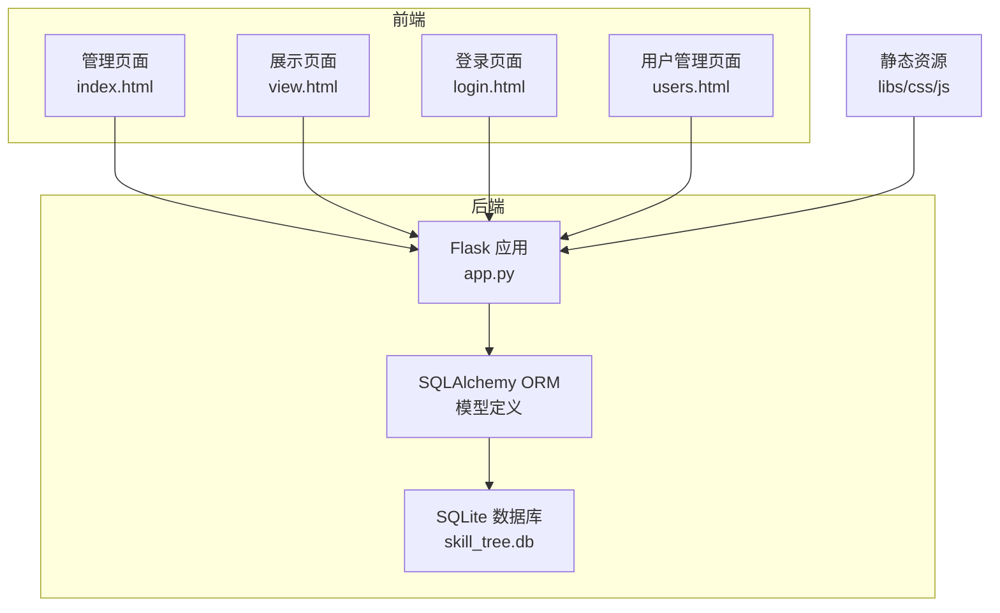
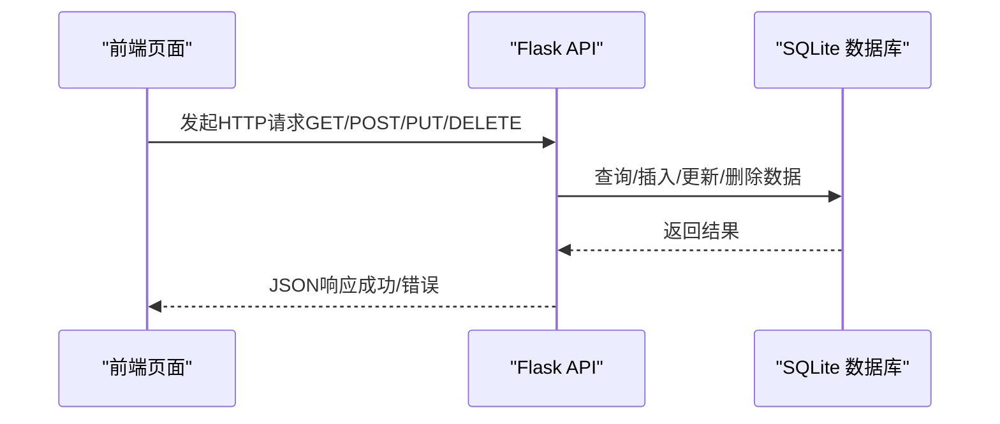
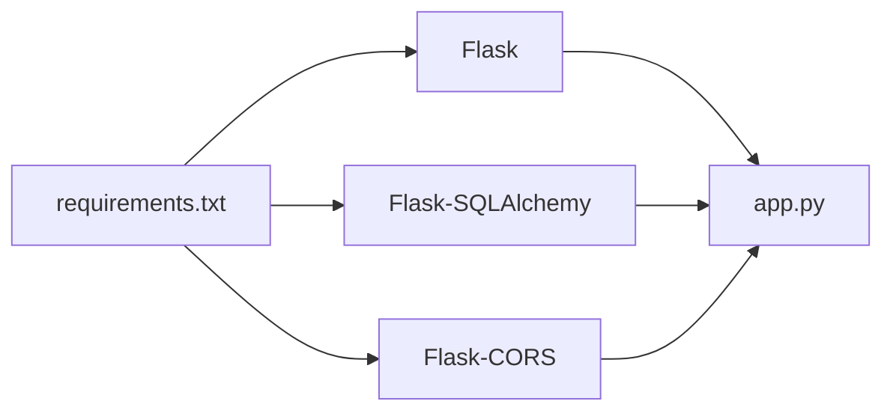

# API接口文档

<cite>
**本文档引用的文件**
- [app.py](file://app.py)
- [README.md](file://README.md)
- [requirements.txt](file://requirements.txt)
- [create_admin.py](file://create_admin.py)
- [migrate_db.py](file://migrate_db.py)
- [migrate_db_v2.py](file://migrate_db_v2.py)
</cite>

## 目录
1. [简介](#简介)
2. [项目结构](#项目结构)
3. [核心组件](#核心组件)
4. [架构总览](#架构总览)
5. [详细组件分析](#详细组件分析)
6. [依赖分析](#依赖分析)
7. [性能考虑](#性能考虑)
8. [故障排查指南](#故障排查指南)
9. [结论](#结论)
10. [附录](#附录)

## 简介
本API接口文档面向前端开发者与第三方集成开发者，系统性梳理技能树管理系统的RESTful接口，覆盖用户管理、技能树管理、节点操作、激活控制、重置功能、统计查询与任务管理等能力。文档提供每个端点的HTTP方法、URL模式、请求参数、响应格式、数据类型、验证规则、错误处理机制、认证与权限策略、版本管理与兼容性说明，以及客户端调用示例与最佳实践建议。

## 项目结构
- 后端框架：Flask + SQLAlchemy
- 数据库：SQLite（文件型）
- 跨域：Flask-CORS
- 前端：HTML/JS/静态资源（由后端提供）

图表来源
- [app.py:17-22](file://app.py#L17-L22)
- [app.py:1711-1737](file://app.py#L1711-L1737)

章节来源
- [README.md:61-78](file://README.md#L61-L78)
- [requirements.txt:1-5](file://requirements.txt#L1-L5)

## 核心组件
- 用户模型：用户基本信息、权限标识、模块与分组
- 技能树模型：名称、作者、版本、默认技能点、激活模式、扩展数据
- 节点模型：节点ID、父子关系、状态、成本、颜色、描述与链接、等级与模块、排序索引
- 用户技能树状态：用户在特定技能树中的节点状态与可用技能点
- 历史与统计：节点编辑历史、节点点击历史、全局统计与任务管理

章节来源
- [app.py:25-121](file://app.py#L25-L121)
- [app.py:1055-1075](file://app.py#L1055-L1075)

## 架构总览
系统采用前后端同源部署，后端提供REST API与静态文件服务，前端通过AJAX调用API完成技能树的增删改查、节点激活/取消激活、重置、统计与任务管理。

图表来源
- [app.py:1711-1737](file://app.py#L1711-L1737)

## 详细组件分析

### 用户管理API
- 创建用户
  - 方法：POST
  - 路径：/api/users
  - 请求体字段：
    - username: string（必填，唯一）
    - password: string（可选）
    - is_admin: boolean（可选，默认false）
    - is_leader: boolean（可选，默认false）
    - module: string（可选，默认"默认模块"）
    - group: string（可选，默认"A"）
  - 成功响应：返回用户ID与消息
  - 错误：用户名重复返回400
- 获取用户列表
  - 方法：GET
  - 路径：/api/users
  - 成功响应：用户数组（含id、username、is_admin、is_leader、module、group、created_at）
- 更新用户
  - 方法：PUT
  - 路径：/api/users/{user_id}
  - 支持更新字段：username（唯一性校验）、password、is_admin、is_leader、module、group
  - 成功响应：更新成功消息
- 用户登录
  - 方法：POST
  - 路径：/api/login
  - 请求体字段：username、password
  - 成功响应：用户信息与登录成功消息
  - 错误：用户名不存在404、密码错误401

章节来源
- [app.py:280-303](file://app.py#L280-L303)
- [app.py:305-318](file://app.py#L305-L318)
- [app.py:319-354](file://app.py#L319-L354)
- [app.py:356-383](file://app.py#L356-L383)

### 技能树管理API
- 获取技能树列表（带权限标记）
  - 方法：GET
  - 路径：/api/trees
  - 查询参数：user_id（可选）
  - 成功响应：技能树数组（含id、name、module、author、version、can_activate、created_at、updated_at）
- 创建技能树
  - 方法：POST
  - 路径：/api/trees
  - 请求体字段：name、author、version、default_skill_points（可选，默认10）、data（可选，jsmind格式）
  - 成功响应：创建成功消息与id
- 获取指定技能树（包含节点与用户状态）
  - 方法：GET
  - 路径：/api/trees/{tree_id}
  - 查询参数：user_id（可选）
  - 成功响应：jsmind格式数据（包含元信息与树形结构）
- 更新技能树
  - 方法：PUT
  - 路径：/api/trees/{tree_id}
  - 请求体字段：name、module、author、version、default_skill_points、extra_data、data（可选）
  - 成功响应：更新成功消息
  - 注意：若包含data，将替换节点并记录编辑历史
- 删除技能树
  - 方法：DELETE
  - 路径：/api/trees/{tree_id}
  - 成功响应：删除成功消息

章节来源
- [app.py:385-413](file://app.py#L385-L413)
- [app.py:415-440](file://app.py#L415-L440)
- [app.py:442-454](file://app.py#L442-L454)
- [app.py:456-552](file://app.py#L456-L552)
- [app.py:554-561](file://app.py#L554-L561)

### 节点操作API
- 快速添加单个节点
  - 方法：POST
  - 路径：/api/trees/{tree_id}/nodes
  - 请求体字段：data（包含id、parent_id、topic、direction、level、module、cost、description、link、link2、user_id）
  - 成功响应：添加成功消息与node_id
  - 错误：节点ID已存在返回400
- 批量导入节点（CSV导入专用）
  - 方法：POST
  - 路径：/api/trees/{tree_id}/nodes/batch
  - 请求体字段：nodes（数组，每项包含topic、parent_id、direction、level、module、cost、description、link、link2）
  - 成功响应：导入统计与明细（成功/失败计数与每行结果）
  - 错误：节点数据为空400
- 更新单个节点
  - 方法：PUT
  - 路径：/api/trees/{tree_id}/nodes/{node_id}
  - 请求体字段：topic、direction、expanded、background_color、foreground_color、cost、description、link、link2、level、module、user_id
  - 成功响应：更新成功消息
  - 注意：若有字段变更，记录编辑历史

章节来源
- [app.py:562-607](file://app.py#L562-L607)
- [app.py:608-686](file://app.py#L608-L686)
- [app.py:712-775](file://app.py#L712-L775)

### 激活控制API
- 激活节点（用户操作）
  - 方法：POST
  - 路径：/api/trees/{tree_id}/nodes/{node_id}/activate
  - 请求体字段：user_id（必填）
  - 权限与规则：
    - 非管理员仅能激活自身模块内的节点
    - 树状模式：子节点全部激活后方可激活父节点
    - 进阶模式：同一模块内前序等级全部完成后方可激活当前等级
    - 技能点不足或节点已激活/待审核时拒绝
  - 成功响应：消息、状态与当前技能点
  - 错误：权限不足403、前置条件不满足400、节点已激活400、待审核中400
- 取消激活节点（重置）
  - 方法：POST
  - 路径：/api/trees/{tree_id}/nodes/{node_id}/deactivate
  - 权限：仅管理员或组长可直接重置
  - 成功响应：重置成功消息与当前技能点
  - 错误：节点未激活400、存在已激活子节点400

章节来源
- [app.py:777-902](file://app.py#L777-L902)
- [app.py:904-930](file://app.py#L904-L930)

### 重置功能API
- 重置技能树（管理员）
  - 方法：POST
  - 路径：/api/trees/{tree_id}/reset
  - 请求体字段：user_id（操作者ID，必填）、target_user_id（目标用户ID，可选）
  - 行为：若target_user_id为空，重置所有用户；否则仅重置指定用户
  - 成功响应：重置消息与技能点
  - 错误：非管理员403
- 重置指定用户的技能树（用户自己）
  - 方法：POST
  - 路径：/api/users/{user_id}/trees/{tree_id}/reset
  - 行为：仅重置该用户在该技能树中的状态与技能点
  - 成功响应：重置消息与技能点

章节来源
- [app.py:948-1053](file://app.py#L948-L1053)

### 统计查询API
- 获取全局统计数据
  - 方法：GET
  - 路径：/api/dashboard/stats
  - 成功响应：总用户数、总技能树数、总节点数、总激活数、分组进度、模块进度、最活跃用户Top10
- 获取用户进度
  - 方法：GET
  - 路径：/api/progress
  - 查询参数：user_id（必填）、all（可选，是否查询所有用户）
  - 权限：非管理员仅能查看与自己模块交集的用户进度
  - 成功响应：用户进度列表（含各技能树的激活节点数与百分比）
- 获取节点历史与点击统计
  - 方法：GET
  - 路径：/api/trees/{tree_id}/nodes/{node_id}/history
  - 成功响应：编辑历史与点击统计（最近一次点击时间与用户）
- 获取全局点击统计与最近点击记录
  - 方法：GET
  - 路径：/api/history/global/clicks
  - 查询参数：ranking_limit（可选，默认5）、page（可选，默认1）、per_page（可选，默认20）
  - 成功响应：技能树点击排行、节点点击排行、激活排行、最近点击日志分页
- 获取全局编辑历史
  - 方法：GET
  - 路径：/api/history/global/edits
  - 查询参数：page（可选，默认1）、per_page（可选，默认20）
  - 成功响应：编辑历史分页（含用户名、树名、节点主题、变更详情、时间）

章节来源
- [app.py:1740-1841](file://app.py#L1740-L1841)
- [app.py:1408-1495](file://app.py#L1408-L1495)
- [app.py:1517-1546](file://app.py#L1517-L1546)
- [app.py:1549-1652](file://app.py#L1549-L1652)
- [app.py:1655-1708](file://app.py#L1655-L1708)

### 任务管理API
- 分配学习任务（管理员/组长）
  - 方法：POST
  - 路径：/api/tasks/assign
  - 请求体字段：assigner_id（必填）、user_id（必填）、tree_id（必填）、node_id 或 node_ids（必填，单个或数组）、task_type（可选，默认weekly）
  - 权限：管理员或同组组长
  - 成功响应：分配数量
- 取消分配的任务（管理员/组长）
  - 方法：DELETE
  - 路径：/api/tasks/{task_id}
  - 查询参数：user_id（当前操作者ID，必填）
  - 权限：管理员或同组组长
  - 成功响应：任务已撤回
- 获取我的任务列表
  - 方法：GET
  - 路径：/api/tasks/my
  - 查询参数：user_id（必填）
  - 成功响应：按任务类型分组的任务列表（含树名、节点主题、层级路径、创建时间）
- 获取待审核列表
  - 方法：GET
  - 路径：/api/tasks/pending
  - 查询参数：user_id（必填）
  - 权限：管理员或组长
  - 成功响应：待审核的节点激活申请列表（含用户、树、节点、路径、成本、申请时间）
- 审核通过任务
  - 方法：POST
  - 路径：/api/tasks/approve
  - 请求体字段：approver_id（必填）、user_id（必填）、tree_id（必填）、node_id（必填）
  - 权限：管理员或同组组长
  - 成功响应：审核通过消息

章节来源
- [app.py:1843-1896](file://app.py#L1843-L1896)
- [app.py:1897-1917](file://app.py#L1897-L1917)
- [app.py:1918-1972](file://app.py#L1918-L1972)
- [app.py:1973-2027](file://app.py#L1973-L2027)
- [app.py:2029-2080](file://app.py#L2029-L2080)

### 辅助API
- 获取模块列表
  - 方法：GET
  - 路径：/api/modules
  - 成功响应：树模块、节点模块、用户模块的去重集合
- 记录节点点击
  - 方法：POST
  - 路径：/api/trees/{tree_id}/nodes/{node_id}/click
  - 请求体字段：user_id（可选）
  - 成功响应：点击已记录
- 更新技能点（管理员）
  - 方法：PUT
  - 路径：/api/trees/{tree_id}/skill-points
  - 请求体字段：skill_points、total_skill_points
  - 成功响应：当前技能点与总技能点
- 更新技能树激活模式
  - 方法：PUT
  - 路径：/api/trees/{tree_id}/mode
  - 请求体字段：mode（tree/path 或 linear）
  - 成功响应：模式更新消息与规范化后的模式

章节来源
- [app.py:1381-1406](file://app.py#L1381-L1406)
- [app.py:1498-1514](file://app.py#L1498-L1514)
- [app.py:932-946](file://app.py#L932-L946)
- [app.py:688-710](file://app.py#L688-L710)

## 依赖分析
- Flask：Web框架
- Flask-SQLAlchemy：ORM
- Flask-CORS：跨域支持
- SQLite：轻量数据库

图表来源
- [requirements.txt:1-5](file://requirements.txt#L1-L5)
- [app.py:5-22](file://app.py#L5-L22)

章节来源
- [requirements.txt:1-5](file://requirements.txt#L1-L5)

## 性能考虑
- 数据库索引：节点表对(tree_id, node_id)建立复合索引，用户状态表对(user_id, tree_id, node_id)建立唯一约束，提升查询与去重效率。
- 批量操作：批量导入节点使用flush逐条写入，最后统一commit，减少事务开销。
- 状态计算：构建jsmind数据时动态计算节点状态，避免冗余存储。
- 分页查询：全局历史与统计接口支持分页，降低响应体积。

章节来源
- [app.py:102](file://app.py#L102)
- [app.py:118](0.121)
- [app.py:675-686](file://app.py#L675-L686)
- [app.py:1554-1556](file://app.py#L1554-L1556)
- [app.py:1659-1661](file://app.py#L1659-L1661)

## 故障排查指南
- 跨域问题：确认Flask-CORS已启用，若仍失败检查浏览器网络面板与CORS响应头。
- 数据库迁移失败：执行迁移脚本或删除数据库文件后重启服务自动重建。
- 权限错误：非管理员尝试重置/审核/分配任务将返回403，请确认角色与组别。
- 参数缺失：创建/更新/激活等接口缺少必填参数将返回400。
- 节点ID冲突：快速添加节点时若ID已存在将返回400。
- 子节点激活：取消激活时若存在已激活子节点将返回400。

章节来源
- [README.md:299-304](file://README.md#L299-L304)
- [migrate_db.py:32-36](file://migrate_db.py#L32-L36)
- [app.py:960-963](file://app.py#L960-L963)
- [app.py:569-576](file://app.py#L569-L576)
- [app.py:913-918](file://app.py#L913-L918)

## 结论
本API体系围绕技能树的生命周期提供完整能力：用户管理、技能树与节点CRUD、节点激活/取消激活、重置、统计与任务管理。系统通过模块与组别实现细粒度权限控制，支持树状与进阶两种激活模式，具备历史追踪与全局统计能力。建议在生产环境加强认证与授权、完善输入校验与异常处理，并考虑引入令牌机制与API版本化策略。

## 附录

### 认证与权限策略
- 登录：/api/login返回用户信息，前端应缓存用户标识用于后续请求。
- 权限：
  - 管理员：可重置所有用户技能树、审核节点激活、分配任务、修改技能点。
  - 组长：可审核本组成员的节点激活申请、分配本组成员任务。
  - 普通用户：仅能管理自己的技能树与任务，激活节点需审核。

章节来源
- [app.py:356-383](file://app.py#L356-L383)
- [app.py:960-963](file://app.py#L960-L963)
- [app.py:1982-1984](file://app.py#L1982-L1984)

### API版本管理与兼容性
- 当前版本：v1（未显式版本号，接口稳定）
- 兼容性：
  - 新增字段：default_skill_points、module、group、level、link2、sort_index等，迁移脚本自动处理。
  - 激活模式：支持tree与path，兼容linear关键字映射为path。
- 建议：未来引入API版本前缀（如/api/v1/...），并在迁移时提供降级策略。

章节来源
- [app.py:2120-2207](file://app.py#L2120-L2207)
- [app.py:696-701](file://app.py#L696-L701)

### 客户端调用示例与最佳实践
- 示例（通用）：
  - GET /api/trees?user_id=1
  - POST /api/users {"username":"alice","password":"pwd","is_admin":false}
  - PUT /api/trees/1 {"name":"新名称","data":{...}}
  - POST /api/trees/1/nodes {"data":{"id":"node_x","topic":"新节点"}}
  - POST /api/trees/1/nodes/activate {"user_id":1}
  - POST /api/trees/1/reset {"user_id":1,"target_user_id":2}
  - GET /api/dashboard/stats
- 最佳实践：
  - 对敏感操作（重置、审核、分配任务）进行二次确认与权限校验。
  - 批量导入时先预览CSV，再提交导入，避免大事务失败。
  - 使用分页接口处理大量历史与统计数据。
  - 前端缓存用户模块与组别，减少重复查询。

章节来源
- [README.md:113-214](file://README.md#L113-L214)

### 数据模型与Schema（简述）
- 用户（users）
  - 字段：id, username, password, is_admin, is_leader, module, group, created_at
- 技能树（skill_trees）
  - 字段：id, name, module, author, version, default_skill_points, mode, extra_data, created_at, updated_at
- 节点（skill_nodes）
  - 字段：id, node_id, tree_id, parent_id, topic, direction, expanded, status, cost, background_color, foreground_color, description, link, link2, level, module, sort_index, extra_data, created_at, updated_at
- 用户技能树状态（user_skill_tree_states）
  - 字段：id, user_id, tree_id, node_id, status, skill_points, updated_at
- 节点编辑历史（node_edit_histories）
  - 字段：id, tree_id, node_id, user_id, username, change_details, created_at
- 节点点击历史（node_click_histories）
  - 字段：id, tree_id, node_id, user_id, username, created_at
- 学习任务（learning_tasks）
  - 字段：id, user_id, tree_id, node_id, task_type, status, assigner_id, created_at, updated_at, completed_at

章节来源
- [app.py:25-121](file://app.py#L25-L121)
- [app.py:124-177](file://app.py#L124-L177)