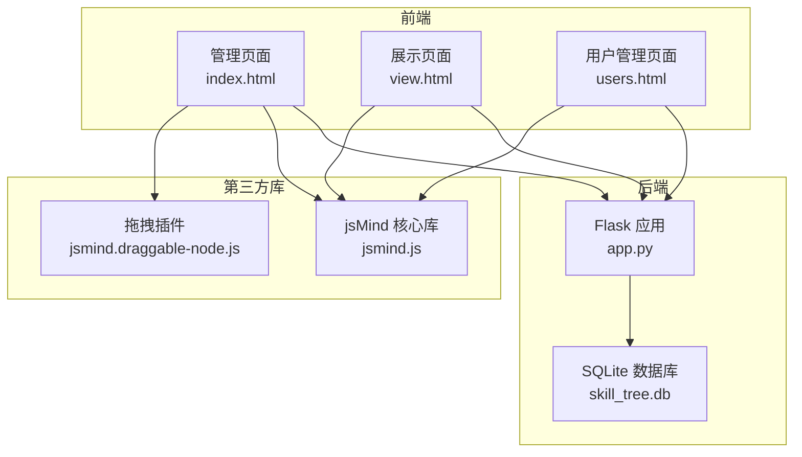
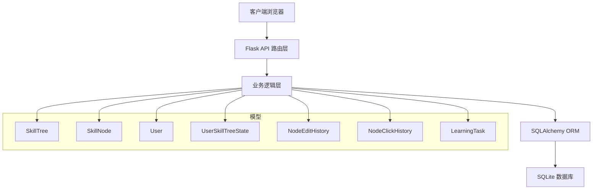
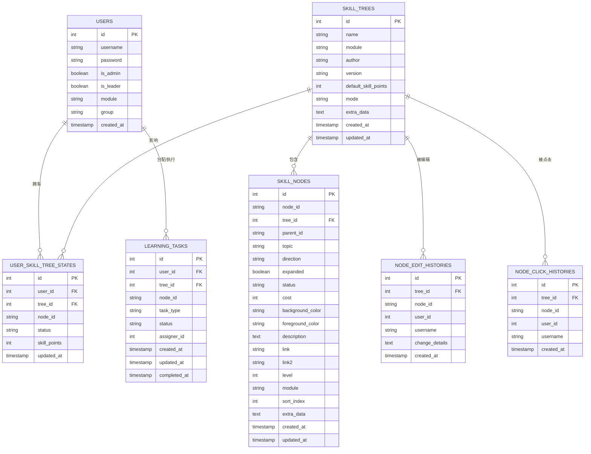
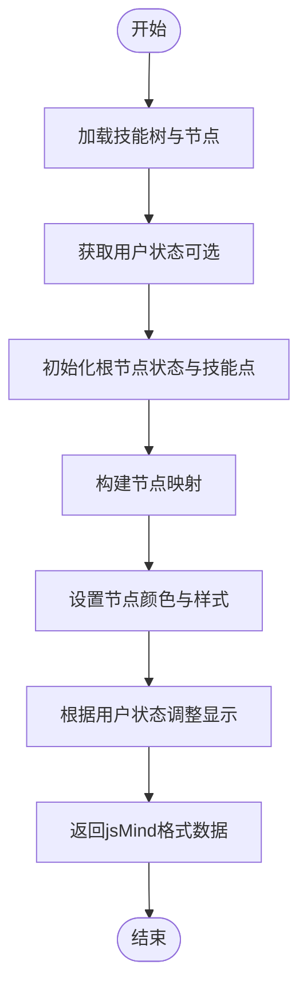
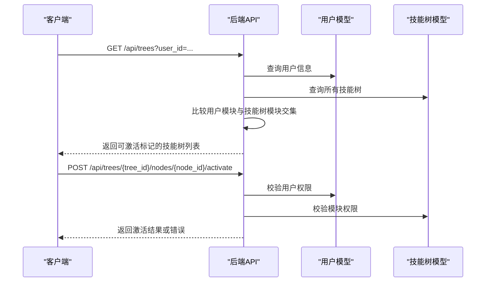
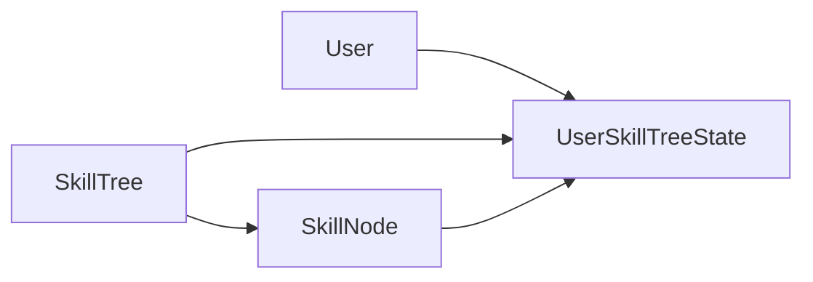

# 技能树管理API

<cite>
**本文档引用的文件**
- [app.py](file://app.py)
- [README.md](file://README.md)
- [index.html](file://index.html)
- [view.html](file://view.html)
- [_patch_mode.py](file://_patch_mode.py)
- [users.html](file://users.html)
</cite>

## 目录
1. [简介](#简介)
2. [项目结构](#项目结构)
3. [核心组件](#核心组件)
4. [架构概览](#架构概览)
5. [详细组件分析](#详细组件分析)
6. [依赖分析](#依赖分析)
7. [性能考虑](#性能考虑)
8. [故障排除指南](#故障排除指南)
9. [结论](#结论)
10. [附录](#附录)

## 简介
本文件为技能树管理系统的技能树管理API提供完整技术文档。系统基于Flask后端与jsMind前端协作，支持技能树的创建、获取列表、获取单个技能树、更新和删除等CRUD操作，并提供节点激活、重置、导入导出等功能。文档详细说明技能树模型的关键字段、jsMind格式转换逻辑、权限控制机制与模块限制、完整的API端点规范、请求参数与响应格式、错误处理策略，并提供实际的请求/响应示例与使用场景。

## 项目结构
系统采用前后端分离架构：
- 后端：Flask应用，提供RESTful API接口，使用SQLite数据库存储用户、技能树、节点及状态数据。
- 前端：HTML+JavaScript页面，通过jsMind渲染技能树，调用后端API进行数据交互。
- 第三方库：jsMind及其拖拽插件，用于可视化展示与编辑技能树。

**图表来源**
- [app.py:1-2233](file://app.py#L1-L2233)
- [index.html:1421-1454](file://index.html#L1421-L1454)
- [view.html:3720-3749](file://view.html#L3720-L3749)
- [_patch_mode.py:3650-3680](file://_patch_mode.py#L3650-L3680)

**章节来源**
- [README.md:61-78](file://README.md#L61-L78)
- [app.py:17-22](file://app.py#L17-L22)

## 核心组件
- 技能树模型（SkillTree）：存储技能树基本信息与默认技能点、激活模式、扩展数据等。
- 技能节点模型（SkillNode）：存储节点结构、样式、等级、模块、排序索引、额外数据等。
- 用户模型（User）：存储用户信息、权限（管理员/组长）、模块范围、用户组等。
- 用户技能树状态模型（UserSkillTreeState）：存储每个用户在各技能树中的节点状态与可用技能点。
- 节点编辑历史模型（NodeEditHistory）：记录节点变更详情，便于审计与追踪。
- 节点点击历史模型（NodeClickHistory）：记录节点点击行为，用于统计分析。
- 学习任务模型（LearningTask）：支持为节点分配学习任务，含任务类型与状态。

**章节来源**
- [app.py:42-121](file://app.py#L42-L121)

## 架构概览
系统采用三层架构：
- 表现层：前端页面负责用户交互与技能树可视化。
- 业务层：Flask路由处理HTTP请求，执行业务逻辑，调用数据库。
- 数据层：SQLite数据库存储所有实体数据，配合SQLAlchemy ORM进行数据访问。

**图表来源**
- [app.py:42-121](file://app.py#L42-L121)
- [app.py:385-412](file://app.py#L385-L412)

## 详细组件分析

### 技能树模型与数据结构
技能树模型包含以下关键字段：
- id：主键
- name：技能树名称
- module：所属模块（支持多模块，逗号分隔）
- author：作者
- version：版本号
- default_skill_points：默认技能点
- mode：激活模式（tree：树状自下而上；path/linear：进阶等级线性）
- extra_data：扩展数据（JSON格式，存储外框、连线、概要等）
- created_at/updated_at：创建与更新时间

节点模型包含以下关键字段：
- id：主键
- node_id：节点标识（对应jsMind节点ID）
- tree_id：所属技能树
- parent_id：父节点ID（root节点为None或特殊标记）
- topic：节点标题
- direction：左右方向（left/right）
- expanded：展开状态
- status：节点状态（locked/unlocked/activated）
- cost：激活消耗技能点
- background_color/foreground_color：背景色与文字色
- description/link/link2：技能说明与相关链接
- level/module/sort_index：等级、模块、排序索引
- extra_data：其他自定义数据（JSON格式）

用户模型包含以下关键字段：
- id：主键
- username/password：用户名与密码
- is_admin/is_leader：管理员与组长权限
- module：所属模块（支持多模块）
- group：用户组别（A/B/C/D/Office）
- created_at：创建时间

用户技能树状态模型包含以下关键字段：
- id：主键
- user_id/tree_id/node_id：用户、技能树、节点组合键
- status：节点状态（locked/activated）
- skill_points：用户在该技能树中的可用技能点（通常根节点存储）
- updated_at：更新时间

**图表来源**
- [app.py:25-121](file://app.py#L25-L121)

**章节来源**
- [app.py:42-121](file://app.py#L42-L121)

### jsMind格式转换逻辑
后端在获取技能树时，会将数据库中的节点数据转换为jsMind所需的node_tree格式，同时结合用户状态与技能点信息，动态调整节点颜色与状态。转换流程如下：

**图表来源**
- [app.py:1137-1180](file://app.py#L1137-L1180)

**章节来源**
- [app.py:1137-1180](file://app.py#L1137-L1180)

### 权限控制与模块限制
- 登录与用户管理：支持用户登录、创建用户、更新用户信息。
- 技能树访问控制：获取技能树列表时，非管理员用户只能看到其模块范围内可激活的技能树。
- 节点激活权限：激活节点时，非管理员用户必须具备目标技能树所属模块的权限。
- 管理员权限：管理员可重置所有用户或指定用户的技能树状态，且不受模块限制。

**图表来源**
- [app.py:385-412](file://app.py#L385-L412)
- [app.py:777-809](file://app.py#L777-L809)

**章节来源**
- [app.py:385-412](file://app.py#L385-L412)
- [app.py:777-809](file://app.py#L777-L809)

### CRUD操作与API端点规范

#### 获取技能树列表
- 方法：GET
- 路径：/api/trees
- 查询参数：
  - user_id：可选，用于计算模块权限与可激活标记
- 响应：技能树数组，包含id、name、module、author、version、can_activate、created_at、updated_at
- 权限：无需认证
- 错误：无

**章节来源**
- [app.py:385-412](file://app.py#L385-L412)
- [README.md:115-118](file://README.md#L115-L118)

#### 创建技能树
- 方法：POST
- 路径：/api/trees
- 请求体：
  - name：技能树名称
  - module：模块（默认模块）
  - author：作者（默认system）
  - version：版本号（默认1.0）
  - default_skill_points：默认技能点（默认10）
  - data：jsMind格式的节点树（可选）
- 响应：{id, message}
- 错误：400（缺少必要字段时），500（保存节点失败时）
- 说明：若包含data，将递归保存节点并保留颜色信息

**章节来源**
- [app.py:415-439](file://app.py#L415-L439)
- [README.md:120-131](file://README.md#L120-L131)

#### 获取指定技能树
- 方法：GET
- 路径：/api/trees/{tree_id}
- 查询参数：
  - user_id：可选，用于返回用户状态与技能点
- 响应：jsMind格式的完整数据（包含meta与data）
- 错误：404（技能树不存在）
- 说明：将数据库节点转换为jsMind格式，结合用户状态与技能点

**章节来源**
- [app.py:442-453](file://app.py#L442-L453)
- [README.md:133-136](file://README.md#L133-L136)

#### 更新技能树
- 方法：PUT
- 路径：/api/trees/{tree_id}
- 请求体：
  - name/module/author/version/default_skill_points/extra_data：可选更新字段
  - data：可选，若提供则替换整棵树的节点（保留颜色信息）
- 响应：{message}
- 错误：404（技能树不存在），500（保存节点失败）
- 说明：更新元数据；若包含data，先删除旧节点，再保存新节点，记录编辑历史

**章节来源**
- [app.py:456-551](file://app.py#L456-L551)
- [README.md:138-147](file://README.md#L138-L147)

#### 删除技能树
- 方法：DELETE
- 路径：/api/trees/{tree_id}
- 响应：{message}
- 错误：404（技能树不存在）

**章节来源**
- [app.py:554-560](file://app.py#L554-L560)
- [README.md:149-152](file://README.md#L149-L152)

#### 更新节点
- 方法：PUT
- 路径：/api/trees/{tree_id}/nodes/{node_id}
- 请求体：
  - topic/background_color/foreground_color/cost/description/link/link2/level/module/direction/expanded
  - user_id：可选，用于记录编辑历史
- 响应：{message}
- 错误：404（节点不存在），500（保存失败）
- 说明：记录变更详情到NodeEditHistory

**章节来源**
- [app.py:712-774](file://app.py#L712-L774)
- [README.md:154-165](file://README.md#L154-L165)

#### 激活节点
- 方法：POST
- 路径：/api/trees/{tree_id}/nodes/{node_id}/activate
- 请求体：
  - user_id：用户ID（必填）
- 响应：
  - 成功：{message, status, skill_points}
  - 待审核：{status: pending_approval}
- 错误：400（缺少user_id），403（无权限），404（节点不存在），500（保存失败）
- 说明：检查前置条件（父节点已激活、技能点充足），更新用户状态与技能点

**章节来源**
- [app.py:777-809](file://app.py#L777-L809)
- [README.md:167-170](file://README.md#L167-L170)

#### 取消激活节点
- 方法：POST
- 路径：/api/trees/{tree_id}/nodes/{node_id}/deactivate
- 请求体：
  - user_id：用户ID（必填）
- 响应：{message, skill_points}
- 错误：400（缺少user_id），404（节点不存在），500（保存失败）

**章节来源**
- [app.py:918-929](file://app.py#L918-L929)
- [README.md:172-175](file://README.md#L172-L175)

#### 重置技能树（管理员）
- 方法：POST
- 路径：/api/trees/{tree_id}/reset
- 请求体：
  - user_id：操作者ID（必填，需为管理员）
  - target_user_id：目标用户ID（可选，为空则重置所有用户）
- 响应：{message, skill_points}
- 错误：400（缺少user_id），403（非管理员），500（保存失败）
- 说明：重置所有用户或指定用户的节点状态为locked，返还技能点

**章节来源**
- [app.py:948-1052](file://app.py#L948-L1052)
- [README.md:204-213](file://README.md#L204-L213)

#### 重置用户技能树（普通用户）
- 方法：POST
- 路径：/api/users/{user_id}/trees/{tree_id}/reset
- 响应：{message, skill_points}
- 错误：403（非管理员且非本人），500（保存失败）

**章节来源**
- [app.py:1021-1052](file://app.py#L1021-L1052)

#### 更新技能树激活模式
- 方法：PUT
- 路径：/api/trees/{tree_id}/mode
- 请求体：
  - mode：tree/path/linear（linear会被映射为path）
- 响应：{message, mode}
- 错误：400（无效模式），404（技能树不存在）

**章节来源**
- [app.py:688-709](file://app.py#L688-L709)

#### 更新技能点
- 方法：PUT
- 路径：/api/trees/{tree_id}/skill-points
- 请求体：
  - skill_points：可用技能点
  - total_skill_points：总技能点
- 响应：{skill_points, total_skill_points}
- 错误：404（技能树不存在），500（保存失败）

**章节来源**
- [app.py:932-945](file://app.py#L932-L945)

#### 快速添加节点
- 方法：POST
- 路径：/api/trees/{tree_id}/nodes
- 请求体：
  - data：包含id、parent_id、topic、direction、level、module、cost、description、link、link2、user_id（可选）
- 响应：{message, node_id}
- 错误：400（节点ID重复或缺失），500（保存失败）

**章节来源**
- [app.py:562-606](file://app.py#L562-L606)

#### 批量导入节点（CSV导入）
- 方法：POST
- 路径：/api/trees/{tree_id}/nodes/batch
- 请求体：
  - nodes：节点数组，每项包含topic、parent_id、direction、level、module、cost、description、link、link2等
- 响应：{message, success_count, error_count, results}
- 错误：400（节点数据为空），500（批量提交失败）

**章节来源**
- [app.py:608-685](file://app.py#L608-L685)

### API使用示例

#### 获取技能树列表
- 请求
  - GET /api/trees?user_id=1
- 响应
  - 200 [{"id":1,"name":"技能树A","module":"开发,测试","author":"张三","version":"1.0","can_activate":true,"created_at":"2023-01-01T00:00:00","updated_at":"2023-01-01T00:00:00"}]

**章节来源**
- [app.py:385-412](file://app.py#L385-L412)

#### 创建技能树（含节点）
- 请求
  - POST /api/trees
  - Content-Type: application/json
  - Body: {"name":"技能树B","module":"开发","author":"李四","version":"1.0","default_skill_points":15,"data":{"id":"root","topic":"根节点","children":[{"id":"node1","topic":"子节点1","children":[]}]}}

**章节来源**
- [app.py:415-439](file://app.py#L415-L439)

#### 激活节点
- 请求
  - POST /api/trees/1/nodes/node1/activate
  - Body: {"user_id":2}
- 响应
  - 200 {"message":"节点已激活","status":"activated","skill_points":12}

**章节来源**
- [app.py:777-809](file://app.py#L777-L809)

## 依赖分析
- 组件耦合：
  - SkillTree与SkillNode：一对多关系，节点通过tree_id关联技能树。
  - User与UserSkillTreeState：一对多关系，用户状态通过user_id关联用户。
  - SkillTree与UserSkillTreeState：一对多关系，用户状态通过tree_id关联技能树。
  - SkillNode与UserSkillTreeState：一对一关系，用户状态通过node_id关联节点。
- 外部依赖：
  - Flask：Web框架
  - SQLAlchemy：ORM与数据库访问
  - jsMind：前端可视化库
  - Flask-CORS：跨域支持

**图表来源**
- [app.py:42-121](file://app.py#L42-L121)

**章节来源**
- [app.py:42-121](file://app.py#L42-L121)

## 性能考虑
- 数据库索引：SkillNode对(tree_id,node_id)建立复合索引，提升查询效率。
- 批量操作：批量导入节点使用flush而非commit，减少事务开销。
- 颜色信息保留：在更新节点时保留原有颜色信息，避免不必要的重绘。
- 前端渲染：jsMind格式转换在后端完成，前端直接渲染，降低前端复杂度。

## 故障排除指南
- 跨域问题：确保Flask-CORS已正确安装与启用。
- 节点ID冲突：快速添加节点时若ID已存在，后端会生成新的唯一ID。
- 权限不足：激活节点或重置技能树时，非管理员用户需具备相应模块权限。
- 数据库异常：批量提交失败时，后端会回滚事务并返回错误信息。

**章节来源**
- [README.md:298-303](file://README.md#L298-L303)
- [app.py:608-685](file://app.py#L608-L685)

## 结论
技能树管理API提供了完整的CRUD与状态管理能力，结合jsMind实现了直观的可视化编辑体验。通过模块权限与用户状态隔离，系统能够满足多用户、多模块的技能树管理需求。建议在生产环境中加强密码加密、鉴权与审计日志，以提升安全性与可维护性。

## 附录

### 前端集成要点
- 管理页面（index.html）：支持创建、编辑、保存技能树，调用后端API进行数据同步。
- 展示页面（view.html）：支持用户选择与只读展示，节点激活状态保存到用户状态。
- 用户管理页面（users.html）：支持用户权限设置与模块分配。

**章节来源**
- [index.html:1421-1454](file://index.html#L1421-L1454)
- [view.html:3720-3749](file://view.html#L3720-L3749)
- [users.html:506-809](file://users.html#L506-L809)