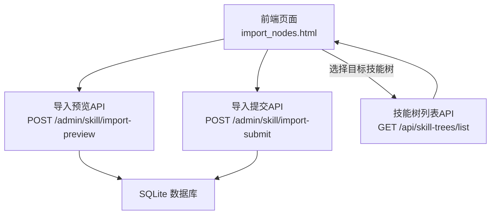
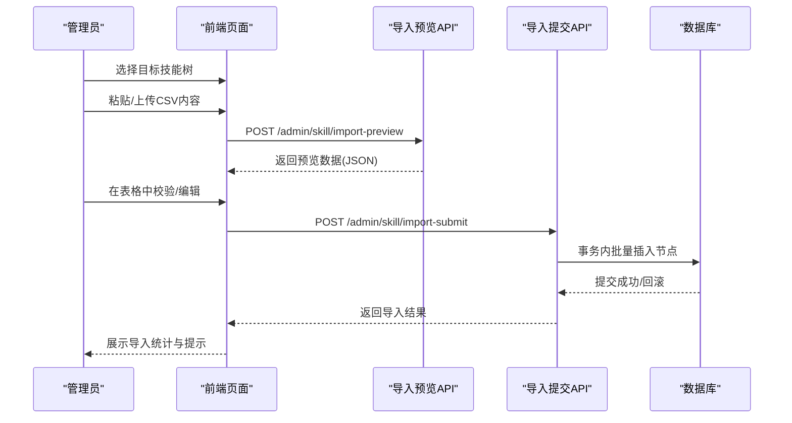
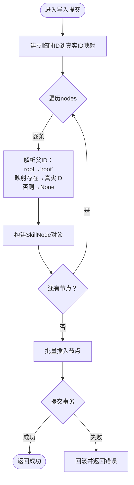
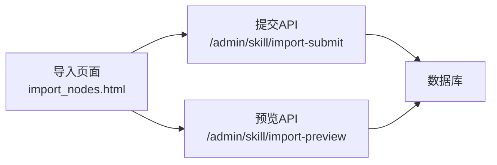

# 数据导入API

<cite>
**本文引用的文件**
- [app.py](file://app.py)
- [import_nodes.html](file://import_nodes.html)
- [README.md](file://README.md)
</cite>

## 目录
1. [简介](#简介)
2. [项目结构](#项目结构)
3. [核心组件](#核心组件)
4. [架构总览](#架构总览)
5. [详细组件分析](#详细组件分析)
6. [依赖分析](#依赖分析)
7. [性能考虑](#性能考虑)
8. [故障排查指南](#故障排查指南)
9. [结论](#结论)
10. [附录](#附录)

## 简介
本文件面向管理员与开发者，系统性说明技能树管理系统的“数据导入API”。重点覆盖以下能力：
- CSV文件预览API：接收上传文件，解析为JSON供前端表格预览
- 批量导入API：接收前端预览后的数据，执行节点ID映射、父子关系处理与批量入库
- 数据一致性与事务控制：通过数据库事务保障批量导入原子性
- 完整API端点规范：请求方法、参数、响应、错误处理与状态码
- CSV模板与最佳实践：字段说明、示例与导入建议

## 项目结构
后端采用Flask + SQLAlchemy，前端提供可视化导入页面。导入流程由前端页面负责解析与预览，后端提供两个关键API支撑导入。

图表来源
- [app.py:189-203](file://app.py#L189-L203)
- [app.py:208-274](file://app.py#L208-L274)
- [app.py:183-187](file://app.py#L183-L187)
- [import_nodes.html:312-331](file://import_nodes.html#L312-L331)

章节来源
- [app.py:183-203](file://app.py#L183-L203)
- [app.py:208-274](file://app.py#L208-L274)
- [import_nodes.html:312-331](file://import_nodes.html#L312-L331)

## 核心组件
- 导入预览API：接收multipart/form-data中的文件，使用csv.DictReader解析为JSON数组，返回给前端表格渲染
- 导入提交API：接收JSON数组，执行临时ID映射、父子关系解析、节点对象构建与批量入库
- 技能树列表API：供前端选择目标技能树
- 批量导入API（备用路径）：直接接收节点数组进行逐条校验与入库

章节来源
- [app.py:189-203](file://app.py#L189-L203)
- [app.py:208-274](file://app.py#L208-L274)
- [app.py:183-187](file://app.py#L183-L187)
- [app.py:608-686](file://app.py#L608-L686)

## 架构总览
导入流程分为三步：选择目标技能树 → 预览与校验 → 提交入库。前端页面负责解析Excel粘贴内容或本地文本文件，后端提供预览与提交接口。

图表来源
- [import_nodes.html:441-482](file://import_nodes.html#L441-L482)
- [app.py:189-203](file://app.py#L189-L203)
- [app.py:208-274](file://app.py#L208-L274)

## 详细组件分析

### 导入预览API
- 端点：POST /admin/skill/import-preview
- 请求体：multipart/form-data，字段名为file
- 处理逻辑：
  - 读取上传文件流，解码为UTF-8
  - 使用csv.DictReader逐行解析为字典列表
  - 返回{"data": rows}，供前端表格渲染
- 错误处理：未检测到文件时返回400
- 适用场景：大文件或复杂格式，需要服务端解析

章节来源
- [app.py:189-203](file://app.py#L189-L203)

### 导入提交API（推荐）
- 端点：POST /admin/skill/import-submit
- 请求体：JSON，包含tree_id与nodes数组
- nodes数组字段（与CSV模板一致）：
  - temp_id：节点在CSV中的临时ID（用于父子关系映射）
  - parent_temp_id：父节点的temp_id，特殊值"root"表示直连根节点
  - topic：节点标题（必填）
  - direction、expanded、status、background_color、foreground_color、description、link、link2、level、module、sort_index
- 处理流程：
  1) 建立临时ID到真实ID映射：遍历nodes，为每个temp_id生成唯一node_id
  2) 解析父子关系：
     - 若parent_temp_id为"root"，父ID存为字符串"root"
     - 若parent_temp_id存在于映射表，父ID为对应的真实node_id
     - 否则父ID为None
  3) 构建SkillNode对象并批量入库
  4) 事务提交，返回成功消息
- 错误处理：异常时回滚并返回500
- 适用场景：前端已解析并校验后的数据，直接入库

图表来源
- [app.py:208-274](file://app.py#L208-L274)

章节来源
- [app.py:208-274](file://app.py#L208-L274)

### 技能树列表API（供前端选择）
- 端点：GET /api/skill-trees/list
- 返回：[{id, name}, ...]，用于下拉选择目标技能树

章节来源
- [app.py:183-187](file://app.py#L183-L187)
- [import_nodes.html:312-331](file://import_nodes.html#L312-L331)

### 批量导入API（备用路径）
- 端点：POST /api/trees/{tree_id}/nodes/batch
- 请求体：JSON，nodes数组，每项包含topic等字段
- 处理逻辑：
  - 逐条校验topic是否为空
  - 生成唯一node_id，若冲突则重新生成
  - 插入节点并记录历史
  - 最终统一提交
- 适用场景：直接调用后端批量导入，无需前端预览

章节来源
- [app.py:608-686](file://app.py#L608-L686)

### 前端导入页面与CSV模板
- 页面功能：
  - 加载技能树列表
  - 从Excel粘贴TSV/CSV，自动识别分隔符
  - 拖拽或选择本地UTF-8文本文件
  - 表格预览与可编辑单元格
  - 提交时将预览数据发送到导入提交API
- CSV模板字段（与后端nodes字段一致）：
  - temp_id、parent_temp_id、topic、direction、expanded、status、background_color、foreground_color、description、link、link2、level、module、sort_index
- 下载模板：页面提供一键下载CSV模板（含示例行）

章节来源
- [import_nodes.html:133-162](file://import_nodes.html#L133-L162)
- [import_nodes.html:238-287](file://import_nodes.html#L238-L287)
- [import_nodes.html:389-419](file://import_nodes.html#L389-L419)
- [import_nodes.html:441-482](file://import_nodes.html#L441-L482)
- [import_nodes.html:484-506](file://import_nodes.html#L484-L506)

## 依赖分析
- 前端依赖后端提供的两个API：导入预览与导入提交
- 后端依赖SQLAlchemy进行数据库操作
- 前端页面依赖浏览器原生FileReader与fetch API

图表来源
- [import_nodes.html:441-482](file://import_nodes.html#L441-L482)
- [app.py:189-203](file://app.py#L189-L203)
- [app.py:208-274](file://app.py#L208-L274)

章节来源
- [import_nodes.html:441-482](file://import_nodes.html#L441-L482)
- [app.py:189-203](file://app.py#L189-L203)
- [app.py:208-274](file://app.py#L208-L274)

## 性能考虑
- 批量插入：导入提交API使用批量保存减少多次往返
- 事务控制：导入提交API在try/except中统一提交，异常回滚
- 单条刷新：备用批量API逐条flush，降低内存压力
- 建议：
  - 大批量导入优先使用导入提交API（一次性JSON）
  - 控制单次导入节点数量，避免超长事务
  - 确保CSV字段与模板一致，减少后端解析与校验成本

## 故障排查指南
- 未检测到文件（预览API）
  - 现象：返回400，提示未发现文件
  - 处理：确认请求体字段名为file，且为multipart/form-data
- 导入提交失败（服务端异常）
  - 现象：返回500，错误信息来自异常字符串
  - 处理：检查nodes数组格式、必填字段、父子关系映射
- 父子关系异常
  - 现象：父ID为None或"root"不符合预期
  - 处理：确保parent_temp_id为"root"或存在于映射表
- 批量导入部分失败
  - 现象：备用API返回207，包含每条记录状态与错误信息
  - 处理：根据results逐条修复后重试

章节来源
- [app.py:192-194](file://app.py#L192-L194)
- [app.py:272-274](file://app.py#L272-L274)
- [app.py:669-672](file://app.py#L669-L672)
- [app.py:680-685](file://app.py#L680-L685)

## 结论
本系统提供两条导入路径：服务端解析预览（适合大文件）与前端预览提交（适合交互式校验）。导入提交API具备完善的临时ID映射、父子关系处理与事务控制，能够稳定地将CSV数据批量入库。建议管理员结合前端页面与模板进行导入，确保字段一致与父子关系正确。

## 附录

### API端点规范

- 获取技能树列表（供前端选择）
  - 方法：GET
  - 路径：/api/skill-trees/list
  - 响应：[{id, name}, ...]

- 导入预览（服务端解析）
  - 方法：POST
  - 路径：/admin/skill/import-preview
  - Content-Type：multipart/form-data
  - 表单字段：file
  - 成功响应：{"data": [row_dict, ...]}
  - 失败响应：{"error": "..."}, 400

- 导入提交（前端预览后提交）
  - 方法：POST
  - 路径：/admin/skill/import-submit
  - Content-Type：application/json
  - 请求体：
    - tree_id: 目标技能树ID
    - nodes: 数组，每项包含以下字段
      - temp_id: 节点在CSV中的临时ID
      - parent_temp_id: 父节点的temp_id，"root"表示直连根节点
      - topic: 标题（必填）
      - direction、expanded、status、background_color、foreground_color、description、link、link2、level、module、sort_index
  - 成功响应：{"message": "..."}
  - 失败响应：{"error": "..."}, 500

- 备用批量导入（直接调用）
  - 方法：POST
  - 路径：/api/trees/{tree_id}/nodes/batch
  - Content-Type：application/json
  - 请求体：{"nodes": [item, ...]}
  - 成功响应：{"message": "...", "success_count": N, "error_count": M, "results": [...]}, 200或207
  - 失败响应：{"error": "..."}, 500

章节来源
- [app.py:183-187](file://app.py#L183-L187)
- [app.py:189-203](file://app.py#L189-L203)
- [app.py:208-274](file://app.py#L208-L274)
- [app.py:608-686](file://app.py#L608-L686)

### CSV文件格式与示例
- 字段说明（与nodes数组字段一一对应）
  - temp_id：节点在CSV中的临时ID（用于父子关系映射）
  - parent_temp_id：父节点的temp_id，"root"表示直连根节点
  - topic：节点标题（必填）
  - direction：方向（left/right）
  - expanded：是否展开（true/false）
  - status：节点状态（locked/unlocked/activated）
  - background_color、foreground_color：背景色与文字色
  - description：描述
  - link、link2：链接
  - level：等级
  - module：模块
  - sort_index：排序索引
- 模板下载：页面提供一键下载CSV模板（含示例行）

章节来源
- [import_nodes.html:484-506](file://import_nodes.html#L484-L506)

### 数据验证规则
- 导入提交API
  - 必填字段：topic
  - 父子关系：parent_temp_id为"root"或存在于映射表
  - 类型转换：level、sort_index转为整数
  - 布尔值：expanded按字符串"true"判定
- 备用批量导入API
  - 必填字段：topic
  - 唯一性：若传入的node_id已存在，将重新生成

章节来源
- [app.py:208-274](file://app.py#L208-L274)
- [app.py:608-686](file://app.py#L608-L686)

### 错误处理机制
- 未检测到文件：返回400
- 服务端异常：捕获异常并回滚，返回500
- 部分失败：备用API返回207，包含每条记录状态与错误信息

章节来源
- [app.py:192-194](file://app.py#L192-L194)
- [app.py:272-274](file://app.py#L272-L274)
- [app.py:669-672](file://app.py#L669-L672)
- [app.py:680-685](file://app.py#L680-L685)

### 批量操作结果反馈
- 导入提交API：返回成功消息，包含导入数量
- 备用批量导入API：返回message、success_count、error_count与results数组，每条记录包含row、topic、status、node_id或message

章节来源
- [app.py:268-270](file://app.py#L268-L270)
- [app.py:680-685](file://app.py#L680-L685)

### 数据一致性与事务处理
- 导入提交API：在try/except中统一commit，异常回滚
- 备用批量导入API：逐条flush，最终commit，异常回滚

章节来源
- [app.py:213-274](file://app.py#L213-L274)
- [app.py:674-678](file://app.py#L674-L678)

### CSV文件格式示例
- 示例字段与示例行见页面模板下载功能

章节来源
- [import_nodes.html:484-506](file://import_nodes.html#L484-L506)

### 导入最佳实践
- 使用前端页面进行粘贴/上传，自动识别分隔符
- 下载模板并按字段填写，确保topic不为空
- 父子关系使用temp_id与parent_temp_id，根节点使用"root"
- 大批量导入建议拆分批次，避免超长事务
- 导入前确认目标技能树，避免误导入

章节来源
- [import_nodes.html:238-287](file://import_nodes.html#L238-L287)
- [import_nodes.html:441-482](file://import_nodes.html#L441-L482)
- [README.md:215-280](file://README.md#L215-L280)