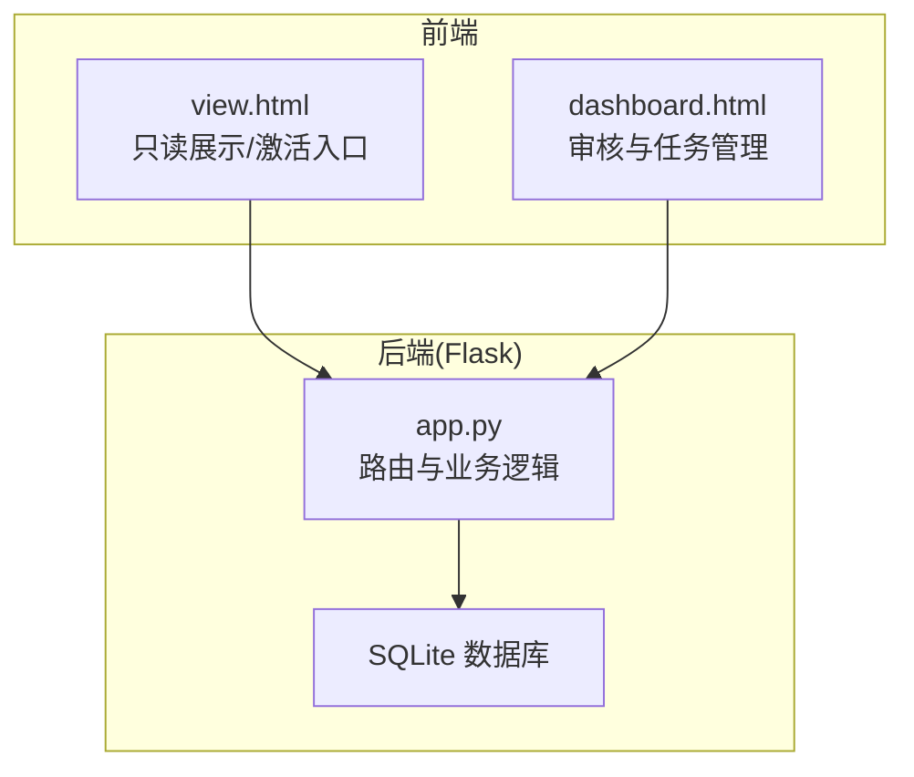
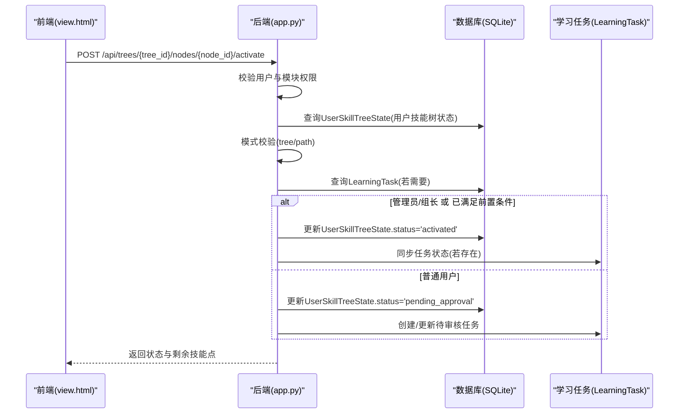
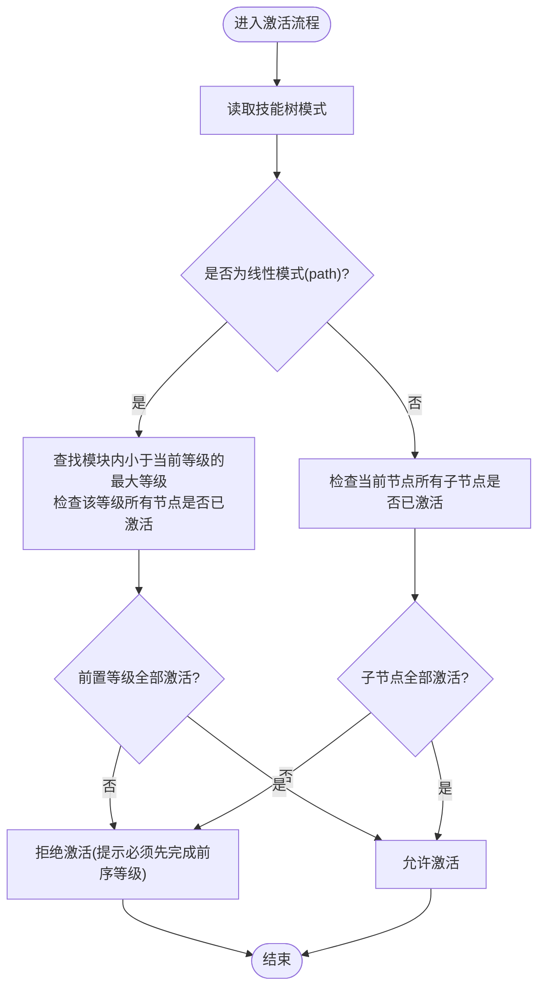
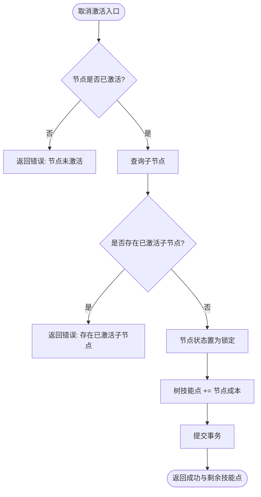
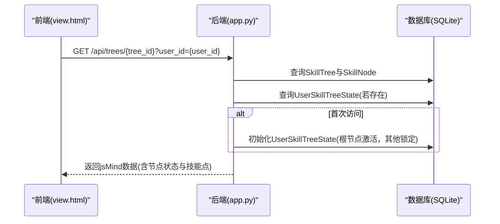
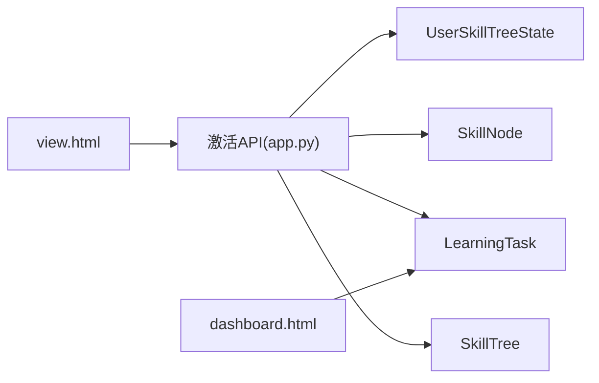

# 激活控制API

<cite>
**本文引用的文件**
- [app.py](file://app.py)
- [README.md](file://README.md)
- [view.html](file://view.html)
- [dashboard.html](file://dashboard.html)
- [_patch_mode.py](file://_patch_mode.py)
</cite>

## 目录
1. [简介](#简介)
2. [项目结构](#项目结构)
3. [核心组件](#核心组件)
4. [架构总览](#架构总览)
5. [详细组件分析](#详细组件分析)
6. [依赖分析](#依赖分析)
7. [性能考虑](#性能考虑)
8. [故障排查指南](#故障排查指南)
9. [结论](#结论)
10. [附录](#附录)

## 简介
本文件聚焦于技能树管理系统的“激活控制API”，系统性阐述节点激活/取消激活的核心逻辑与实现细节，解释树状激活模式（tree）与线性激活模式（path/linear）的差异与适用场景，覆盖权限验证、技能点消耗、状态转换流程、用户技能树状态管理与节点状态同步机制，并提供完整的API规范、错误处理策略以及激活历史与进度跟踪能力说明。面向开发者提供技术实现指南与最佳实践。

## 项目结构
后端基于Flask+SQLAlchemy，核心数据模型围绕用户、技能树、节点与用户技能树状态展开；前端通过view.html与dashboard.html分别提供只读展示与审核管理界面，二者均通过REST API与后端交互。

图表来源
- [app.py:17-22](file://app.py#L17-L22)
- [view.html:2540-2562](file://view.html#L2540-L2562)
- [dashboard.html:1157-1214](file://dashboard.html#L1157-L1214)

章节来源
- [app.py:17-22](file://app.py#L17-L22)
- [README.md:61-78](file://README.md#L61-L78)

## 核心组件
- 用户(User)：身份与权限主体，支持管理员与组长角色，具备模块与分组属性。
- 技能树(SkillTree)：树形结构容器，包含默认技能点、激活模式（tree/path）等元数据。
- 技能节点(SkillNode)：树节点实体，含状态、成本、等级、模块等属性。
- 用户技能树状态(UserSkillTreeState)：记录每个用户在特定技能树中的节点状态与可用技能点（根节点存储）。
- 学习任务(LearningTask)：用于激活申请的异步审批流程跟踪。
- 历史记录(NodeEditHistory/NodeClickHistory)：节点编辑与点击统计的历史数据。

章节来源
- [app.py:25-121](file://app.py#L25-L121)
- [app.py:124-151](file://app.py#L124-L151)

## 架构总览
激活控制API遵循“请求-校验-计算-持久化-响应”的标准流程，结合树/路径两种模式的前置条件检查，统一由UserSkillTreeState驱动状态同步，并通过LearningTask实现非管理员的异步审批。

图表来源
- [app.py:777-901](file://app.py#L777-L901)
- [app.py:864-892](file://app.py#L864-L892)

## 详细组件分析

### 激活控制API规范
- 路径
  - POST /api/trees/{tree_id}/nodes/{node_id}/activate
  - POST /api/trees/{tree_id}/nodes/{node_id}/deactivate
  - PUT /api/trees/{tree_id}/mode
- 请求参数
  - activate/deactivate: { user_id: number }
  - mode: { mode: "tree" | "path" | "linear" }
- 成功响应
  - activate: { message: string, status: "activated"|"pending_approval", skill_points: number }
  - deactivate: { message: string, skill_points: number }
  - mode: { message: string, mode: string }
- 错误响应
  - 400: 参数缺失/前置条件不满足/节点未激活/存在已激活子节点
  - 401: 未认证（登录态）
  - 403: 权限不足（模块权限/管理员/组长权限）
  - 404: 资源不存在
  - 5xx: 服务器内部错误

章节来源
- [README.md:167-180](file://README.md#L167-L180)
- [app.py:777-901](file://app.py#L777-L901)
- [app.py:904-929](file://app.py#L904-L929)
- [app.py:688-709](file://app.py#L688-L709)

### 树状激活模式(tree)与线性激活模式(path/linear)对比
- 树状模式(tree)
  - 前置条件：当前节点的所有子节点均需已激活，方可激活当前节点。
  - 适合：强调层级递进、必须逐层掌握的技能体系。
- 线性模式(path/linear)
  - 前置条件：在同一模块(module)内，当前等级(level)之前的所有等级节点必须全部激活。
  - 适合：强调阶段性通关、模块内线性进阶的学习路径。
- 模式切换
  - 后端接受 "tree"、"path"、"linear"，其中 "linear" 会被规范化为 "path"。
  - 前端通过PUT /api/trees/{tree_id}/mode同步模式，并重新加载数据以获得最新状态。

图表来源
- [app.py:810-846](file://app.py#L810-L846)
- [app.py:696-701](file://app.py#L696-L701)

章节来源
- [app.py:810-846](file://app.py#L810-L846)
- [app.py:688-709](file://app.py#L688-L709)
- [view.html:3657-3674](file://view.html#L3657-L3674)
- [_patch_mode.py:3559-3601](file://_patch_mode.py#L3559-L3601)

### 权限验证与模块隔离
- 非管理员用户仅能在其所属模块(module)的技能树中进行激活操作。
- 模块匹配通过用户与技能树的module字段进行集合交集判断。
- 管理员与组长拥有更高权限，可直接点亮节点或审核申请。

章节来源
- [app.py:790-795](file://app.py#L790-L795)

### 技能点消耗与状态转换逻辑
- 激活流程
  - 若用户为管理员或组长，且非本人申请（或本人申请），直接将状态置为"已激活"。
  - 普通用户申请时，状态置为"待审核"，并创建/更新LearningTask记录。
  - 返回当前用户在该技能树下的可用技能点（根节点状态记录）。
- 取消激活(deactivate)
  - 仅激活状态的节点可取消。
  - 若存在已激活的子节点，禁止取消激活。
  - 取消后释放该节点的成本点数给根节点技能点。

图表来源
- [app.py:904-929](file://app.py#L904-L929)

章节来源
- [app.py:864-892](file://app.py#L864-L892)
- [app.py:904-929](file://app.py#L904-L929)

### 用户技能树状态管理与节点状态同步
- 初始化
  - 首次访问某技能树时，若用户状态不存在，将为该用户初始化UserSkillTreeState，根节点状态为"已激活"，其余节点为"锁定"。
- 状态同步
  - 前端每次加载技能树时，后端会合并用户状态与节点数据，返回jsMind格式数据，包含节点状态、技能点等。
  - 激活/取消激活后，前端刷新树视图并更新技能点显示。

图表来源
- [app.py:1137-1153](file://app.py#L1137-L1153)
- [app.py:1055-1075](file://app.py#L1055-L1075)

章节来源
- [app.py:1137-1153](file://app.py#L1137-L1153)
- [app.py:1055-1075](file://app.py#L1055-L1075)

### 激活历史记录与用户进度跟踪
- 节点历史
  - 编辑历史：记录节点字段变更详情与时间。
  - 点击统计：记录节点被点击的次数与最近一次点击信息。
- 进度跟踪
  - 前端支持按模块与等级统计激活数量，辅助计算线性模式下的解锁状态。
  - 审核面板(dashboard.html)提供待审核列表与批量审批能力。

章节来源
- [app.py:1278-1332](file://app.py#L1278-L1332)
- [app.py:1517-1546](file://app.py#L1517-L1546)
- [dashboard.html:1157-1214](file://dashboard.html#L1157-L1214)

## 依赖分析
- 组件耦合
  - 激活API强依赖UserSkillTreeState与SkillNode状态一致性。
  - 线性模式依赖SkillNode.level与module分组统计。
  - 审核流程依赖LearningTask与用户角色(管理员/组长)。
- 外部依赖
  - 前端jsMind用于可视化展示。
  - 前端fetch用于API调用与历史记录上报。

图表来源
- [app.py:777-901](file://app.py#L777-L901)
- [app.py:1055-1075](file://app.py#L1055-L1075)
- [app.py:1973-2027](file://app.py#L1973-L2027)

章节来源
- [app.py:777-901](file://app.py#L777-L901)
- [app.py:1973-2027](file://app.py#L1973-L2027)

## 性能考虑
- 查询优化
  - 模式校验时对模块与等级的查询应尽量利用索引与分组聚合，避免N+1查询。
  - 前端加载时建议按需分页或延迟渲染，减少DOM压力。
- 事务与并发
  - 激活/取消激活涉及状态与技能点的原子性更新，应使用数据库事务。
  - 对高频点击与历史记录可采用异步上报，降低主流程阻塞。
- 前端渲染
  - 树状模式与线性模式切换时，建议深拷贝原始数据，避免重复计算。

## 故障排查指南
- 常见错误与定位
  - 400 权限不足：确认用户模块与技能树模块交集是否为空。
  - 400 前置条件不满足：检查树状模式的子节点或线性模式的前序等级是否全部激活。
  - 400 存在已激活子节点：取消激活时需先重置子节点。
  - 403 无权限审核：确认当前用户是否为管理员或同组组长。
- 日志与追踪
  - 使用节点历史与点击统计接口定位问题节点与用户行为。
  - 审核面板中查看待审核任务，确认流程卡点。

章节来源
- [app.py:790-795](file://app.py#L790-L795)
- [app.py:810-846](file://app.py#L810-L846)
- [app.py:913-917](file://app.py#L913-L917)
- [app.py:1517-1546](file://app.py#L1517-L1546)
- [dashboard.html:1157-1214](file://dashboard.html#L1157-L1214)

## 结论
激活控制API通过树/路径双模式、严格的权限与前置条件校验、完善的用户状态与任务跟踪机制，实现了灵活可控的技能树激活体系。开发者可据此在不同业务场景下选择合适的激活模式，并结合历史与进度数据持续优化用户体验。

## 附录
- API一览
  - 激活节点：POST /api/trees/{tree_id}/nodes/{node_id}/activate
  - 取消激活：POST /api/trees/{tree_id}/nodes/{node_id}/deactivate
  - 切换模式：PUT /api/trees/{tree_id}/mode
  - 获取节点历史：GET /api/trees/{tree_id}/nodes/{node_id}/history
  - 待审核列表：GET /api/tasks/pending
  - 审核通过：POST /api/tasks/approve

章节来源
- [README.md:167-180](file://README.md#L167-L180)
- [app.py:1517-1546](file://app.py#L1517-L1546)
- [app.py:1973-2027](file://app.py#L1973-L2027)