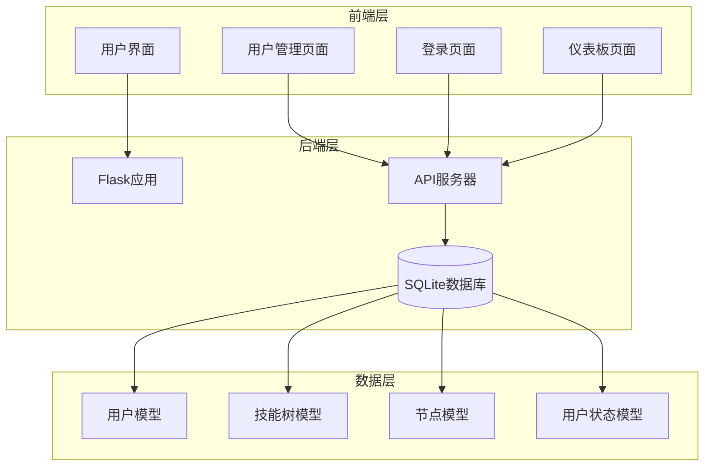
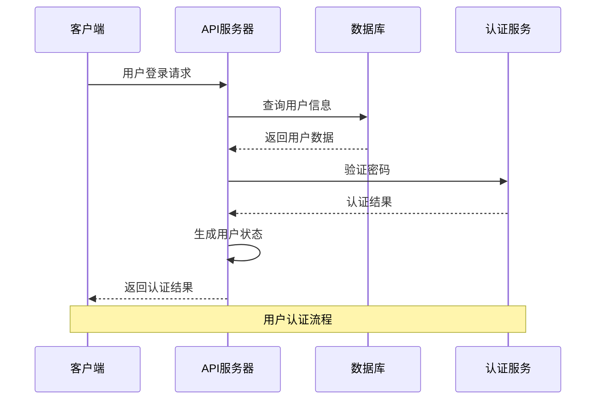
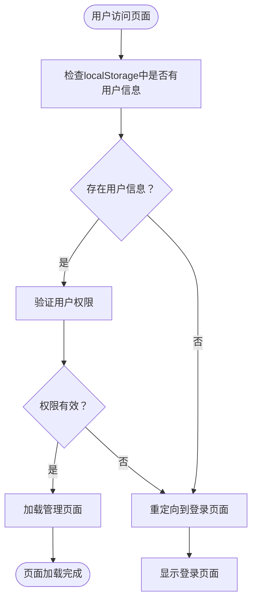
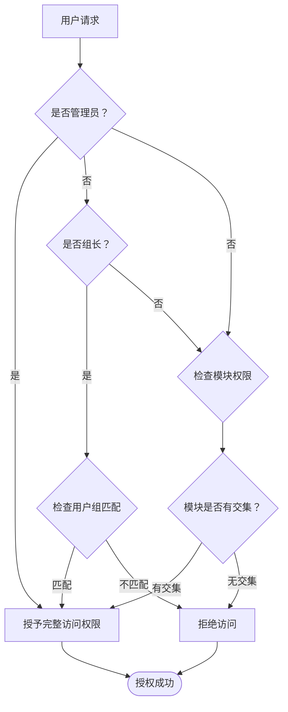
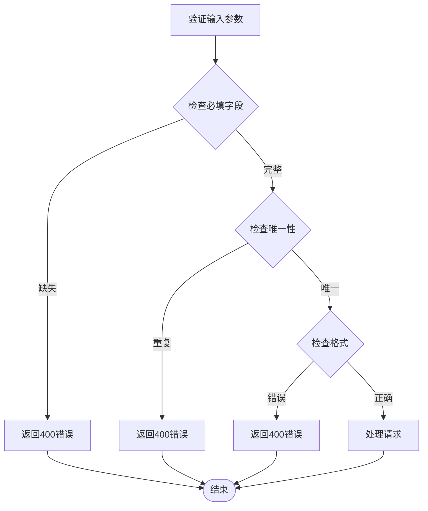
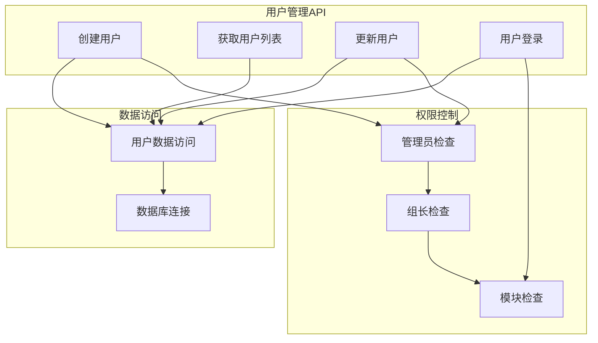
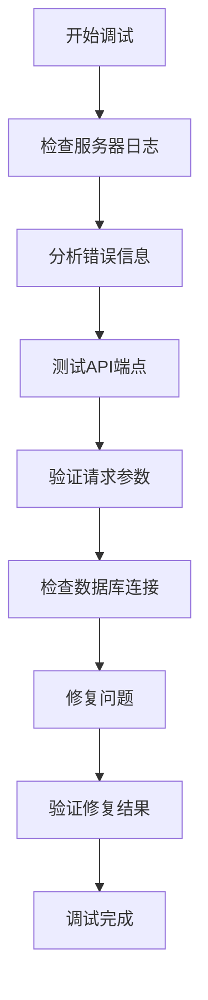

# 用户管理API

<cite>
**本文档引用的文件**
- [app.py](file://app.py)
- [users.html](file://users.html)
- [login.html](file://login.html)
- [dashboard.html](file://dashboard.html)
- [README.md](file://README.md)
</cite>

## 目录
1. [简介](#简介)
2. [项目结构](#项目结构)
3. [核心组件](#核心组件)
4. [架构概览](#架构概览)
5. [详细组件分析](#详细组件分析)
6. [依赖分析](#依赖分析)
7. [性能考虑](#性能考虑)
8. [故障排除指南](#故障排除指南)
9. [结论](#结论)
10. [附录](#附录)

## 简介
技能树管理系统是一个基于Flask的Web应用，提供技能树的创建、管理和展示功能。本文档专注于用户管理API，涵盖用户创建、获取列表、更新用户信息和用户登录认证等核心功能。系统支持多用户、权限管理、技能点系统和节点激活状态管理。

## 项目结构
该项目采用前后端分离的架构设计，后端使用Flask提供RESTful API，前端使用HTML/CSS/JavaScript实现用户界面。



**图表来源**
- [app.py:17-22](file://app.py#L17-L22)
- [users.html:1-800](file://users.html#L1-L800)
- [login.html:1-221](file://login.html#L1-L221)

**章节来源**
- [app.py:17-22](file://app.py#L17-L22)
- [README.md:61-78](file://README.md#L61-L78)

## 核心组件
用户管理API由以下核心组件构成：

### 用户模型
用户模型定义了用户的基本属性和权限控制机制：
- 用户ID：主键，自增整数
- 用户名：唯一标识，字符串类型
- 密码：用户凭据，字符串类型
- 管理员权限：布尔值，默认false
- 组长权限：布尔值，默认false
- 模块归属：字符串，默认"默认模块"
- 用户组别：A/B/C/D/Office，字符串类型
- 创建时间：日期时间，默认当前时间

### 权限控制系统
系统实现了多层次的权限控制机制：
- 管理员权限：完全访问权限
- 组长权限：仅限本组用户
- 模块权限：基于模块的访问控制
- 节点激活权限：基于前置条件的节点激活控制

**章节来源**
- [app.py:25-40](file://app.py#L25-L40)
- [app.py:356-382](file://app.py#L356-L382)

## 架构概览
用户管理API采用RESTful架构设计，遵循HTTP协议标准，提供标准化的接口规范。



**图表来源**
- [app.py:356-382](file://app.py#L356-L382)
- [login.html:168-210](file://login.html#L168-L210)

## 详细组件分析

### 用户管理API端点

#### 用户创建接口
**HTTP方法**: POST  
**URL路径**: `/api/users`  
**请求参数**:
- username: 用户名（必填）
- password: 密码（可选）
- is_admin: 管理员权限（可选，默认false）
- is_leader: 组长权限（可选，默认false）
- module: 模块归属（可选，默认"默认模块"）
- group: 用户组别（可选，默认"A"）

**响应格式**:
```json
{
  "id": 1,
  "username": "testuser",
  "message": "用户创建成功"
}
```

**错误处理**:
- 400: 用户名不能为空
- 400: 用户名已存在

**章节来源**
- [app.py:280-302](file://app.py#L280-L302)

#### 用户列表获取接口
**HTTP方法**: GET  
**URL路径**: `/api/users`  
**请求参数**: 无  
**响应格式**:
```json
[
  {
    "id": 1,
    "username": "admin",
    "is_admin": true,
    "is_leader": false,
    "module": "默认模块",
    "group": "A",
    "created_at": "2023-01-01T00:00:00"
  }
]
```

**错误处理**: 无

**章节来源**
- [app.py:305-317](file://app.py#L305-L317)

#### 用户更新接口
**HTTP方法**: PUT  
**URL路径**: `/api/users/{user_id}`  
**路径参数**:
- user_id: 用户ID（必填）

**请求参数**:
- username: 用户名（可选）
- password: 密码（可选）
- is_admin: 管理员权限（可选）
- is_leader: 组长权限（可选）
- module: 模块归属（可选）
- group: 用户组别（可选）

**响应格式**:
```json
{
  "message": "用户更新成功"
}
```

**错误处理**:
- 404: 用户不存在
- 400: 用户名已存在

**章节来源**
- [app.py:319-353](file://app.py#L319-L353)

#### 用户登录接口
**HTTP方法**: POST  
**URL路径**: `/api/login`  
**请求参数**:
- username: 用户名（必填）
- password: 密码（必填）

**响应格式**:
```json
{
  "id": 1,
  "username": "admin",
  "is_admin": true,
  "is_leader": false,
  "module": "默认模块",
  "group": "A",
  "message": "登录成功"
}
```

**错误处理**:
- 400: 用户名不能为空
- 404: 用户不存在
- 401: 密码错误

**章节来源**
- [app.py:356-382](file://app.py#L356-L382)

### 用户认证机制

#### 前端认证流程
前端使用localStorage存储用户认证状态，实现单点登录体验：



**图表来源**
- [users.html:587-599](file://users.html#L587-L599)
- [login.html:155-166](file://login.html#L155-L166)

#### 权限验证流程
系统实现了多层级的权限验证机制：



**图表来源**
- [app.py:790-795](file://app.py#L790-L795)
- [users.html:593-598](file://users.html#L593-L598)

### 数据验证规则

#### 用户模型验证
系统对用户数据实施严格的验证规则：

| 字段 | 类型 | 必填 | 默认值 | 验证规则 |
|------|------|------|--------|----------|
| id | 整数 | 否 | 自增 | 主键约束 |
| username | 字符串 | 是 | 无 | 唯一性，长度限制 |
| password | 字符串 | 否 | 空 | 无特殊限制 |
| is_admin | 布尔值 | 否 | false | 无限制 |
| is_leader | 布尔值 | 否 | false | 无限制 |
| module | 字符串 | 否 | "默认模块" | 多模块支持，逗号分隔 |
| group | 字符串 | 否 | "A" | A/B/C/D/Office |
| created_at | 日期时间 | 否 | 当前时间 | 自动设置 |

#### 请求参数验证
API接口对请求参数进行严格验证：



**图表来源**
- [app.py:291-296](file://app.py#L291-L296)
- [app.py:325-329](file://app.py#L325-L329)

## 依赖分析

### 组件耦合关系
用户管理API与其他系统组件存在紧密的依赖关系：



**图表来源**
- [app.py:280-382](file://app.py#L280-L382)
- [app.py:790-795](file://app.py#L790-L795)

### 外部依赖
系统依赖以下外部组件：

- **Flask**: Web框架，提供HTTP服务器和路由功能
- **Flask-SQLAlchemy**: ORM框架，提供数据库抽象层
- **Flask-CORS**: 跨域资源共享支持
- **SQLite**: 本地数据库存储

**章节来源**
- [app.py:5-11](file://app.py#L5-L11)
- [requirements.txt](file://requirements.txt)

## 性能考虑
系统在设计时充分考虑了性能优化：

### 数据库优化
- 使用索引优化用户查询性能
- 实现批量操作减少数据库往返
- 采用连接池管理数据库连接

### 缓存策略
- 前端使用localStorage缓存用户状态
- 后端实现查询结果缓存
- 减少重复的数据库查询

### 并发处理
- 使用线程安全的数据库连接
- 实现乐观锁防止并发冲突
- 采用异步处理耗时操作

## 故障排除指南

### 常见错误及解决方案

#### 用户名冲突错误
**错误代码**: 400  
**错误信息**: 用户名已存在  
**解决方案**: 
1. 检查用户名唯一性
2. 提供不同的用户名
3. 使用用户名生成器

#### 权限不足错误
**错误代码**: 403  
**错误信息**: 无权限访问  
**解决方案**:
1. 验证用户权限级别
2. 检查模块权限设置
3. 确认用户组匹配

#### 认证失败错误
**错误代码**: 401  
**错误信息**: 密码错误  
**解决方案**:
1. 验证密码输入
2. 检查密码哈希算法
3. 实施密码重置流程

### 调试工具
系统提供了多种调试工具帮助开发者定位问题：



**图表来源**
- [app.py:272-274](file://app.py#L272-L274)
- [app.py:370-372](file://app.py#L370-L372)

**章节来源**
- [app.py:272-274](file://app.py#L272-L274)
- [app.py:370-372](file://app.py#L370-L372)

## 结论
技能树管理系统的用户管理API提供了完整的用户生命周期管理功能，包括用户创建、认证、权限控制和状态管理。系统采用RESTful架构设计，具有良好的可扩展性和维护性。通过实施多层级的权限控制和严格的数据验证，确保了系统的安全性和稳定性。

## 附录

### API请求/响应示例

#### 成功场景示例
**创建用户成功**:
```json
POST /api/users
{
  "username": "john_doe",
  "password": "secure_password",
  "is_admin": false,
  "is_leader": true,
  "module": "开发,测试",
  "group": "A"
}

Response: 201 Created
{
  "id": 101,
  "username": "john_doe",
  "message": "用户创建成功"
}
```

**用户登录成功**:
```json
POST /api/login
{
  "username": "admin",
  "password": "admin123"
}

Response: 200 OK
{
  "id": 1,
  "username": "admin",
  "is_admin": true,
  "is_leader": false,
  "module": "默认模块",
  "group": "A",
  "message": "登录成功"
}
```

#### 失败场景示例
**用户名已存在**:
```json
POST /api/users
{
  "username": "admin",
  "password": "password"
}

Response: 400 Bad Request
{
  "error": "用户名已存在"
}
```

**权限不足**:
```json
GET /api/users
Authorization: Bearer invalid_token

Response: 403 Forbidden
{
  "error": "无权限访问"
}
```

### 安全最佳实践
1. **密码安全**: 实施密码哈希和盐值机制
2. **权限控制**: 最小权限原则和职责分离
3. **输入验证**: 严格的参数验证和过滤
4. **日志审计**: 完整的操作日志记录
5. **错误处理**: 适当的错误信息和安全的日志记录

### 前端集成指南
前端开发者可以参考以下集成步骤：

1. **认证流程**: 实现localStorage存储和自动重定向
2. **权限检查**: 在页面加载时验证用户权限
3. **错误处理**: 统一处理API错误响应
4. **状态管理**: 维护用户会话状态
5. **UI反馈**: 提供清晰的用户反馈信息

**章节来源**
- [users.html:587-800](file://users.html#L587-L800)
- [login.html:168-210](file://login.html#L168-L210)