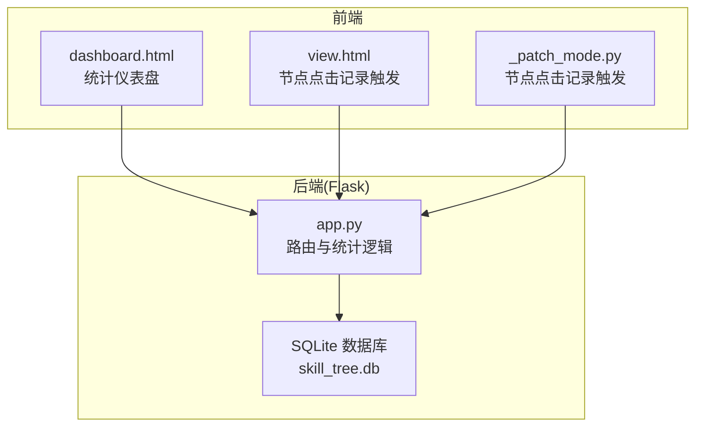
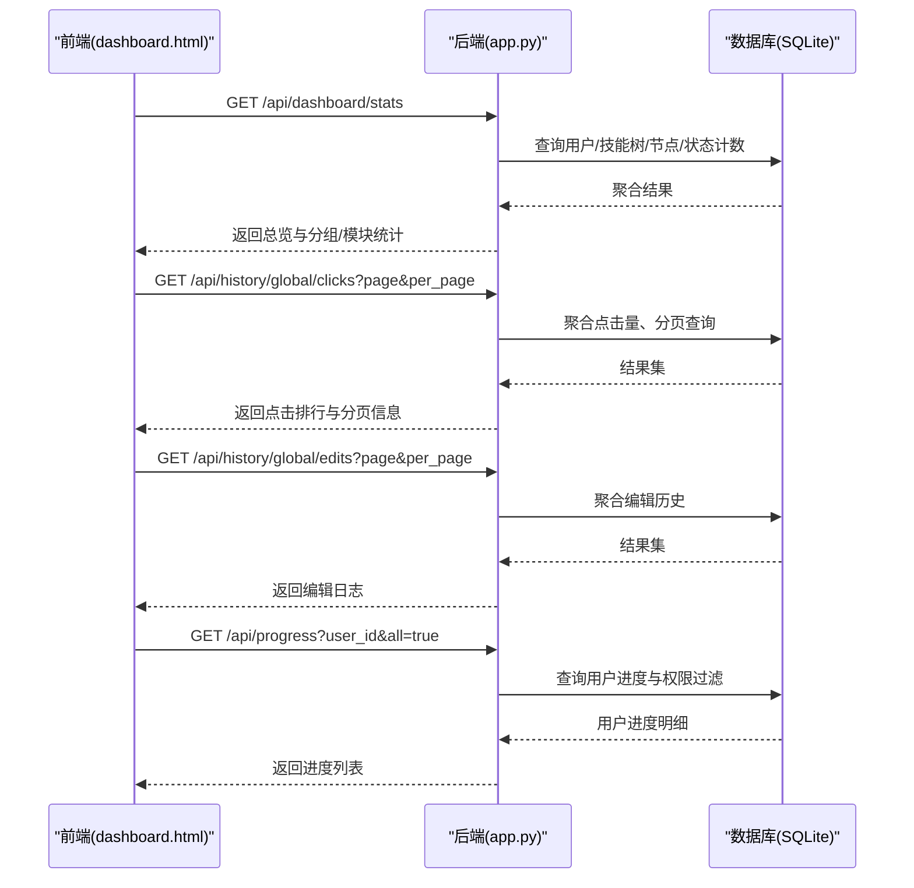
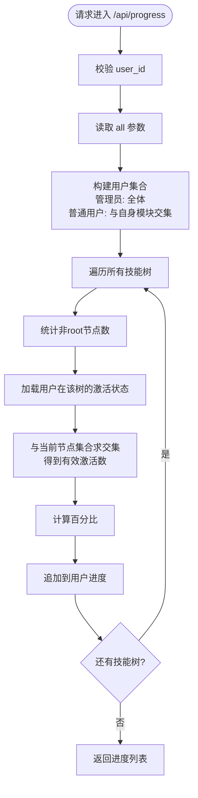
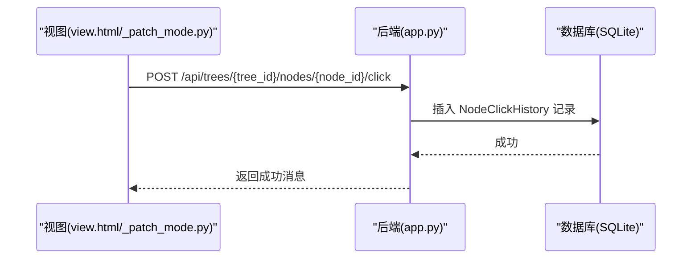
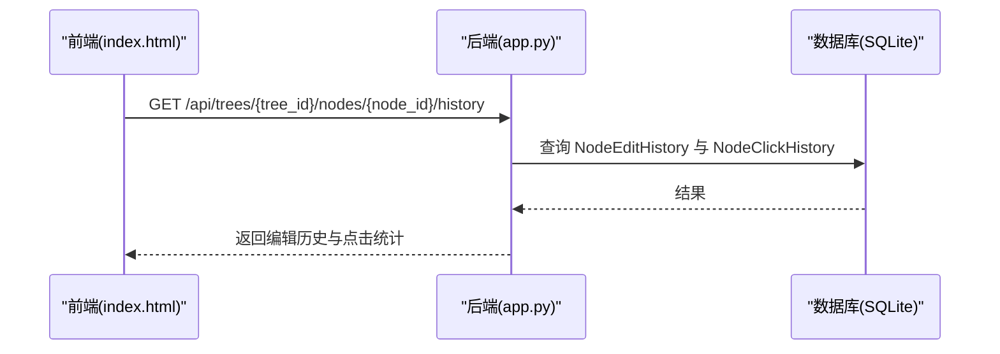
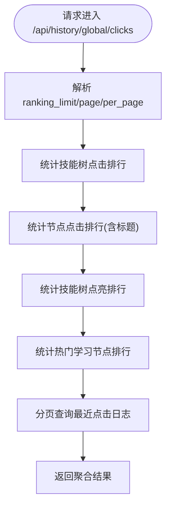
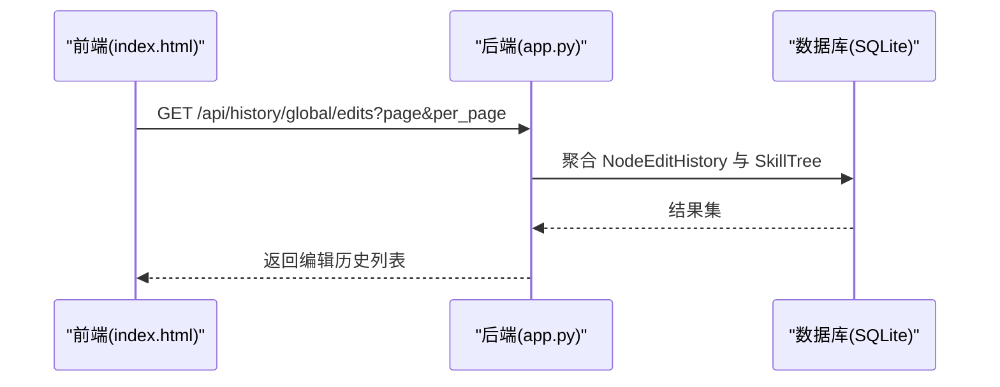
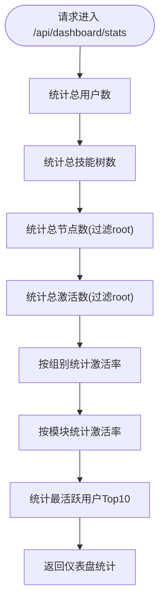
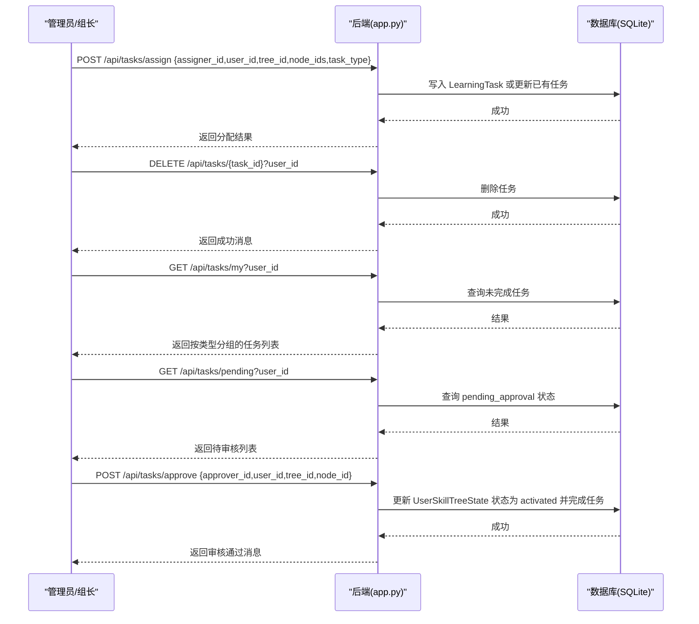
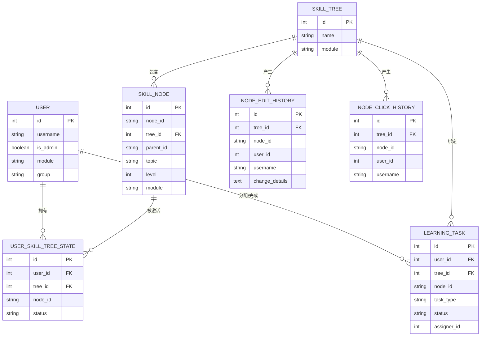

# 统计查询API

<cite>
**本文档引用的文件**
- [app.py](file://app.py)
- [README.md](file://README.md)
- [dashboard.html](file://dashboard.html)
- [_patch_mode.py](file://_patch_mode.py)
- [view.html](file://view.html)
</cite>

## 目录
1. [简介](#简介)
2. [项目结构](#项目结构)
3. [核心组件](#核心组件)
4. [架构总览](#架构总览)
5. [详细组件分析](#详细组件分析)
6. [依赖分析](#依赖分析)
7. [性能考虑](#性能考虑)
8. [故障排除指南](#故障排除指南)
9. [结论](#结论)
10. [附录](#附录)

## 简介
本文件面向管理员与数据分析人员，系统性梳理技能树管理系统的统计查询API，覆盖进度统计、用户表现分析、历史数据追踪与报表生成等能力。重点说明以下方面：
- 节点点击历史记录与统计
- 节点编辑历史记录与统计
- 学习任务管理与审核流程
- 用户进度与模块/组别层面的聚合统计
- 数据收集机制、存储结构与查询优化
- API端点规范、统计维度、时间范围过滤、用户权限控制与数据聚合逻辑
- 统计报表的数据格式与可视化支持
- 性能优化建议与大数据量处理策略

## 项目结构
后端基于Flask + SQLAlchemy，采用SQLite存储；前端通过静态页面调用后端API进行统计展示。核心统计相关API集中在app.py中，前端dashboard.html负责调用与呈现。

图表来源
- [app.py:1711-1737](file://app.py#L1711-L1737)
- [dashboard.html:855-884](file://dashboard.html#L855-L884)
- [_patch_mode.py:3548-3560](file://_patch_mode.py#L3548-L3560)
- [view.html:3621-3627](file://view.html#L3621-L3627)

章节来源
- [README.md:61-78](file://README.md#L61-L78)
- [app.py:1711-1737](file://app.py#L1711-L1737)

## 核心组件
- 统计数据模型
  - 用户(User)、技能树(SkillTree)、技能节点(SkillNode)、用户技能树状态(UserSkillTreeState)
  - 节点编辑历史(NodeEditHistory)、节点点击历史(NodeClickHistory)
  - 学习任务(LearningTask)
- 统计API
  - 用户进度查询(/api/progress)
  - 节点点击记录(/api/trees/{tree_id}/nodes/{node_id}/click)
  - 节点历史与点击统计(/api/trees/{tree_id}/nodes/{node_id}/history)
  - 全局点击统计(/api/history/global/clicks)
  - 全局编辑历史(/api/history/global/edits)
  - 仪表盘总览(/api/dashboard/stats)
  - 学习任务管理(/api/tasks/*)

章节来源
- [app.py:25-121](file://app.py#L25-L121)
- [app.py:1408-1495](file://app.py#L1408-L1495)
- [app.py:1498-1546](file://app.py#L1498-L1546)
- [app.py:1550-1652](file://app.py#L1550-L1652)
- [app.py:1655-1708](file://app.py#L1655-L1708)
- [app.py:1740-1841](file://app.py#L1740-L1841)
- [app.py:1843-2079](file://app.py#L1843-L2079)

## 架构总览
统计查询API围绕“用户-技能树-节点”三层结构展开，结合历史表与状态表进行聚合统计。前端通过dashboard.html调用仪表盘与全局统计接口，同时在节点点击时异步记录点击历史。

图表来源
- [app.py:1740-1841](file://app.py#L1740-L1841)
- [app.py:1550-1652](file://app.py#L1550-L1652)
- [app.py:1655-1708](file://app.py#L1655-L1708)
- [app.py:1408-1495](file://app.py#L1408-L1495)

## 详细组件分析

### 用户进度统计API
- 端点：GET /api/progress
- 参数
  - user_id: 目标用户ID（必填）
  - all: true/false，是否返回所有符合模块权限的用户进度
- 权限控制
  - 管理员可查看所有用户
  - 普通用户仅可见与自身模块有交集的用户
- 聚合逻辑
  - 遍历所有技能树，计算每个用户在每棵技能树上的激活节点数与百分比
  - 过滤root节点，避免计入总节点数
  - 对于已激活但节点已被删除的情况，取当前真实节点集合的交集作为有效激活数
- 返回结构
  - 包含用户基本信息、模块/组别、每棵技能树的总节点数、激活节点数、百分比及激活节点详情列表

图表来源
- [app.py:1408-1495](file://app.py#L1408-L1495)

章节来源
- [app.py:1408-1495](file://app.py#L1408-L1495)

### 节点点击历史记录API
- 端点：POST /api/trees/{tree_id}/nodes/{node_id}/click
- 功能：记录节点点击事件，便于后续统计分析
- 请求体：user_id（可选）
- 响应：点击记录已保存

图表来源
- [app.py:1498-1514](file://app.py#L1498-L1514)
- [_patch_mode.py:3548-3560](file://_patch_mode.py#L3548-L3560)
- [view.html:3621-3627](file://view.html#L3621-L3627)

章节来源
- [app.py:1498-1514](file://app.py#L1498-L1514)
- [_patch_mode.py:3548-3560](file://_patch_mode.py#L3548-L3560)
- [view.html:3621-3627](file://view.html#L3621-L3627)

### 节点历史与点击统计API
- 端点：GET /api/trees/{tree_id}/nodes/{node_id}/history
- 功能：返回节点编辑历史与点击统计（总点击数、最近一次点击时间与用户）
- 返回结构
  - edit_history: 编辑历史列表（用户名、变更详情、时间）
  - click_stats: 总点击数、最近点击时间、最近点击用户

图表来源
- [app.py:1517-1546](file://app.py#L1517-L1546)

章节来源
- [app.py:1517-1546](file://app.py#L1517-L1546)

### 全局点击统计API
- 端点：GET /api/history/global/clicks
- 参数
  - ranking_limit: 排行榜限制数量，默认5
  - page: 页码，默认1
  - per_page: 每页条数，默认20
- 聚合统计
  - 技能树点击排行
  - 节点点击排行（含节点标题）
  - 技能树点亮排行（激活数）
  - 热门学习节点排行（激活数）
  - 最近点击日志分页
- 返回结构
  - tree_stats、node_stats、tree_activation_stats、node_activation_stats
  - recent_clicks、total_clicks、page、per_page

图表来源
- [app.py:1550-1652](file://app.py#L1550-L1652)

章节来源
- [app.py:1550-1652](file://app.py#L1550-L1652)

### 全局编辑历史API
- 端点：GET /api/history/global/edits
- 参数
  - page: 页码，默认1
  - per_page: 每页条数，默认20
- 功能：返回编辑历史列表，包含用户名、技能树名、节点标题、变更详情、时间
- 错误处理：对JSON解析异常进行容错

图表来源
- [app.py:1655-1708](file://app.py#L1655-L1708)

章节来源
- [app.py:1655-1708](file://app.py#L1655-L1708)

### 仪表盘总览API
- 端点：GET /api/dashboard/stats
- 功能：返回平台级总览与分层统计
  - 总用户数、总技能树数、总节点数（过滤root）、总激活数
  - 各组别激活率统计
  - 模块维度激活率统计（按用户模块与技能树模块交集）
  - 最活跃用户Top10（按激活节点数）
- 返回结构
  - overview、group_stats、module_stats、top_users

图表来源
- [app.py:1740-1841](file://app.py#L1740-L1841)

章节来源
- [app.py:1740-1841](file://app.py#L1740-L1841)

### 学习任务管理API
- 分配任务：POST /api/tasks/assign
  - 支持单节点或多节点批量分配
  - 任务类型：daily、weekly、monthly、quarterly、yearly
  - 权限：管理员或组长（且同组）
- 取消任务：DELETE /api/tasks/{task_id}
  - 权限：管理员或组长（且同组）
- 我的任务：GET /api/tasks/my
  - 返回用户当前未完成的任务，按任务类型分组
- 待审核列表：GET /api/tasks/pending
  - 返回管理员/组长可审核的待审核状态
- 审核通过：POST /api/tasks/approve
  - 将状态从pending_approval转为activated，并同步完成对应学习任务

图表来源
- [app.py:1843-2079](file://app.py#L1843-L2079)

章节来源
- [app.py:1843-2079](file://app.py#L1843-L2079)

## 依赖分析
- 统计API依赖的核心数据表
  - User、SkillTree、SkillNode、UserSkillTreeState：用于进度与激活统计
  - NodeEditHistory、NodeClickHistory：用于历史与点击统计
  - LearningTask：用于学习任务管理
- 权限与模块过滤
  - 通过User.module与SkillTree.module的交集控制可见范围
  - 管理员拥有最高权限，可绕过模块过滤
- 查询优化要点
  - 使用SQLAlchemy原生聚合函数与group_by减少内存计算
  - 分页查询避免一次性返回大量历史记录
  - 对热点节点与技能树建立索引（如idx_tree_node、idx_user_tree_node）

图表来源
- [app.py:25-121](file://app.py#L25-L121)

章节来源
- [app.py:25-121](file://app.py#L25-L121)

## 性能考虑
- 查询优化
  - 使用SQLAlchemy聚合函数与group_by，避免在Python侧进行大规模数据合并
  - 对高频查询字段建立索引（如idx_tree_node、idx_user_tree_node），提升JOIN与过滤效率
  - 分页查询历史记录，限制ranking_limit与per_page，避免大结果集
- 数据规模与存储
  - NodeClickHistory与NodeEditHistory为高频写入表，建议定期清理或归档历史数据
  - 对热点技能树与节点可考虑缓存最近统计结果，降低重复计算
- 前端交互
  - dashboard.html按需加载统计，避免一次性请求过多数据
  - 节点点击记录采用异步POST，不影响主流程

[本节为通用性能建议，不直接分析具体文件]

## 故障排除指南
- 权限相关
  - 无权限访问：确认请求者是否为管理员或组长，或是否与目标用户/技能树模块有交集
  - 任务操作失败：检查操作者与目标用户是否属于同一组（组长权限）
- 数据一致性
  - 用户进度统计：若节点被删除，系统会与当前真实节点集合求交集，避免错误计数
  - 编辑历史JSON解析失败：接口已做容错处理，返回原始详情或错误提示
- 前端调用
  - dashboard.html调用统计接口失败：检查后端是否启动、端口是否正确、CORS配置
  - 节点点击记录未生效：确认前端是否正确传递user_id，后端是否成功插入NodeClickHistory

章节来源
- [app.py:1408-1495](file://app.py#L1408-L1495)
- [app.py:1655-1708](file://app.py#L1655-L1708)
- [dashboard.html:855-884](file://dashboard.html#L855-L884)

## 结论
本统计查询API围绕用户-技能树-节点三层结构，提供了从个人进度、模块/组别、平台总览到全局历史与学习任务管理的全链路统计能力。通过合理的权限控制、模块过滤与分页查询，既能满足管理员与数据分析人员的需求，又能在大数据量场景下保持良好性能。建议在生产环境中配合索引优化、定期归档与缓存策略，进一步提升稳定性与响应速度。

[本节为总结性内容，不直接分析具体文件]

## 附录

### API端点规范与参数
- 用户进度
  - GET /api/progress
  - 参数：user_id（必填）、all（可选）
  - 返回：用户进度列表（含每棵树的激活详情）
- 节点点击记录
  - POST /api/trees/{tree_id}/nodes/{node_id}/click
  - 请求体：user_id（可选）
  - 返回：成功消息
- 节点历史与点击统计
  - GET /api/trees/{tree_id}/nodes/{node_id}/history
  - 返回：编辑历史与点击统计
- 全局点击统计
  - GET /api/history/global/clicks
  - 参数：ranking_limit、page、per_page
  - 返回：技能树/节点/激活排行与最近点击日志
- 全局编辑历史
  - GET /api/history/global/edits
  - 参数：page、per_page
  - 返回：编辑历史列表
- 仪表盘总览
  - GET /api/dashboard/stats
  - 返回：总览与分组/模块/用户统计
- 学习任务管理
  - POST /api/tasks/assign：分配任务
  - DELETE /api/tasks/{task_id}：取消任务
  - GET /api/tasks/my：我的任务
  - GET /api/tasks/pending：待审核列表
  - POST /api/tasks/approve：审核通过

章节来源
- [app.py:1408-1495](file://app.py#L1408-L1495)
- [app.py:1498-1546](file://app.py#L1498-L1546)
- [app.py:1550-1652](file://app.py#L1550-L1652)
- [app.py:1655-1708](file://app.py#L1655-L1708)
- [app.py:1740-1841](file://app.py#L1740-L1841)
- [app.py:1843-2079](file://app.py#L1843-L2079)

### 统计维度与数据聚合逻辑
- 维度
  - 个人：用户ID、技能树ID、节点ID
  - 组别：用户组别(A/B/C/D/Office)
  - 模块：用户模块与技能树模块的交集
  - 时间：节点点击与编辑历史的时间戳
- 聚合
  - 计数：激活数、点击数、编辑数
  - 百分比：激活率（激活数/总节点数×100）
  - 排行：按激活数/点击数排序
  - 分页：历史记录分页展示

章节来源
- [app.py:1550-1652](file://app.py#L1550-L1652)
- [app.py:1740-1841](file://app.py#L1740-L1841)

### 数据格式与可视化支持
- 前端dashboard.html负责调用统计API并渲染图表与表格
- 常见可视化元素：卡片指标、进度条、排行榜、分组/模块钻取
- 建议：结合图表库（如ECharts/Chart.js）对返回的JSON数据进行二次渲染

章节来源
- [dashboard.html:648-1005](file://dashboard.html#L648-L1005)