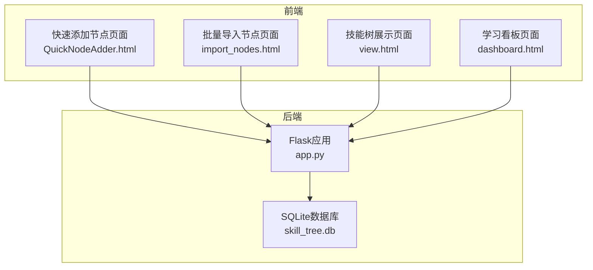
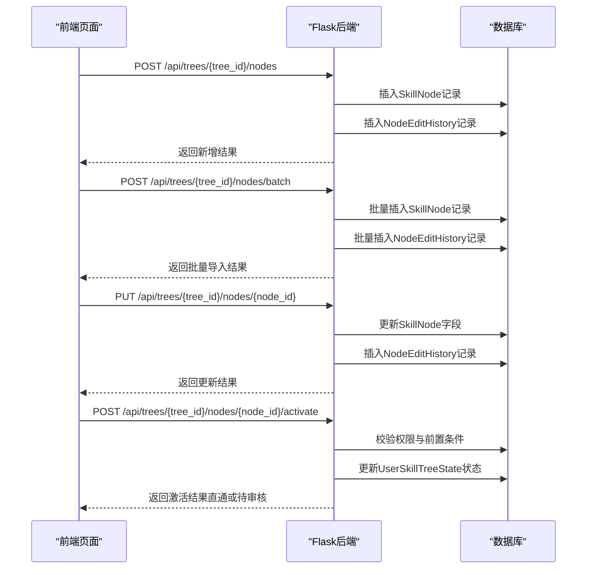
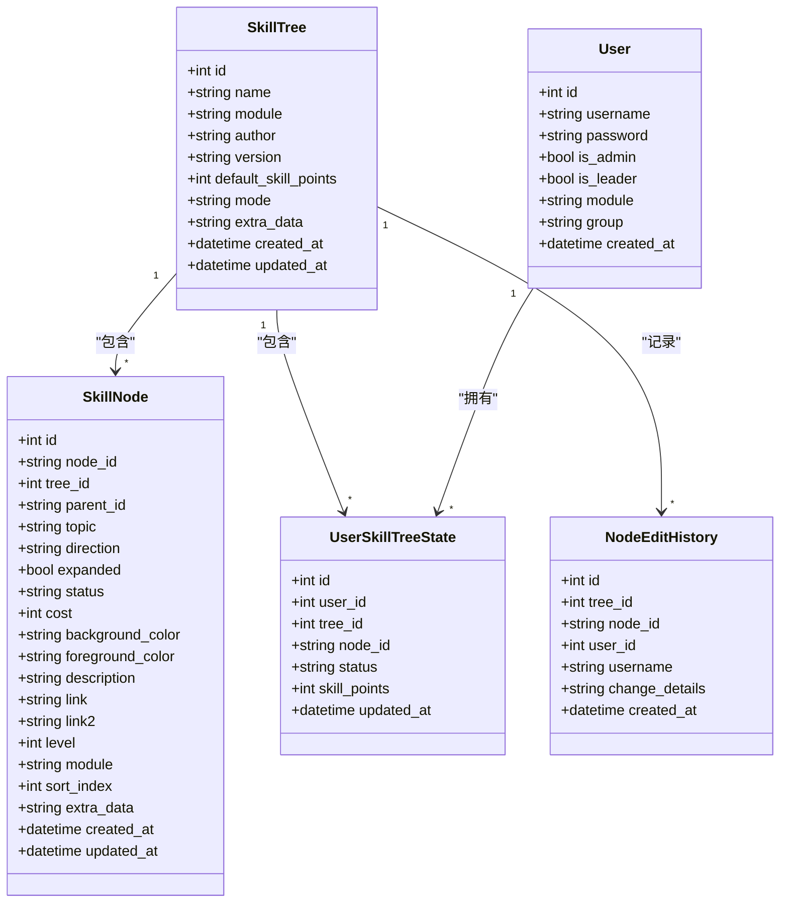
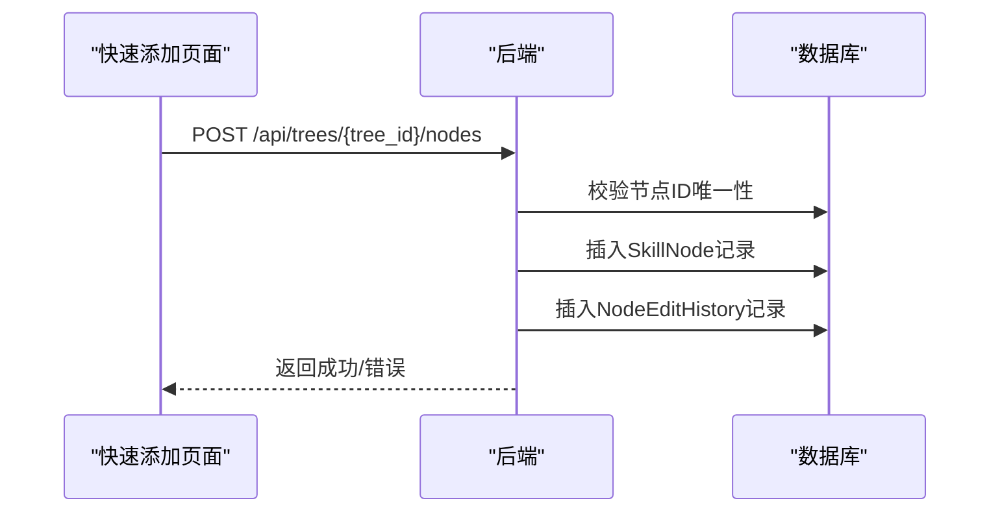
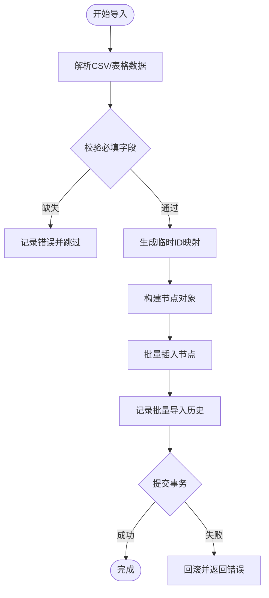
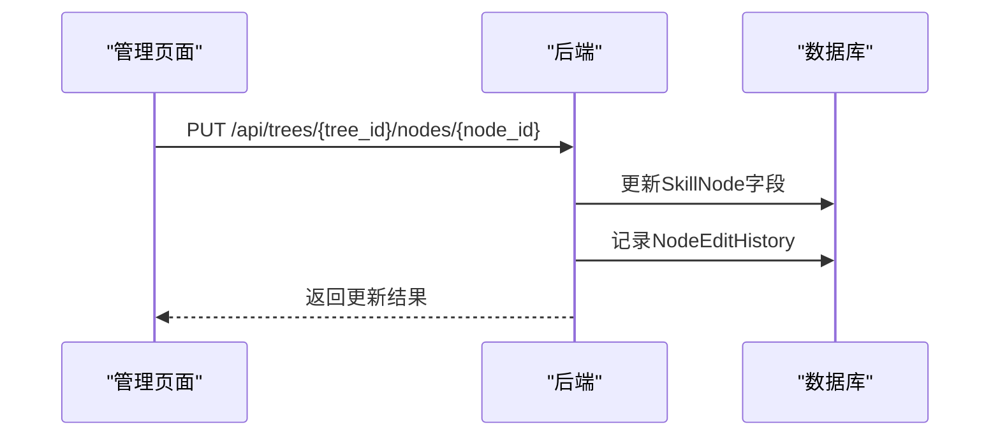
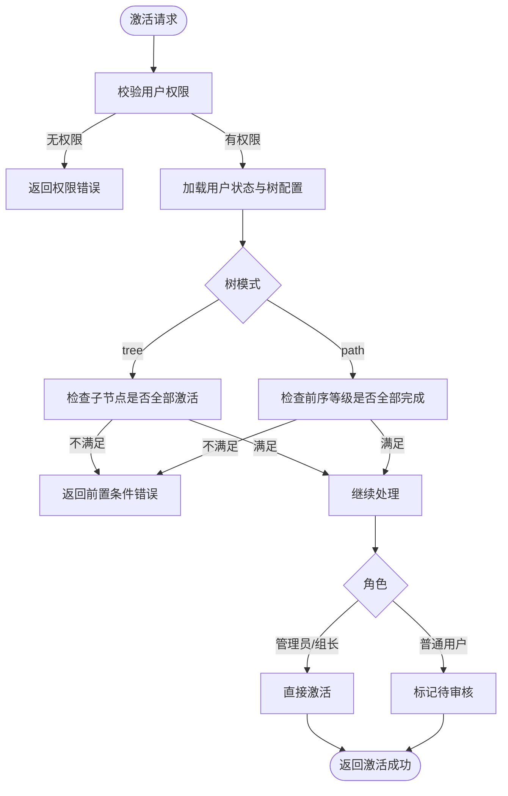
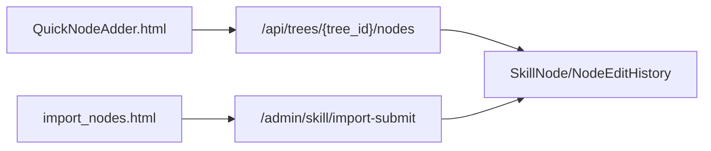

# 节点操作API

<cite>
**本文引用的文件**
- [app.py](file://app.py)
- [import_nodes.html](file://import_nodes.html)
- [QuickNodeAdder.html](file://QuickNodeAdder.html)
- [README.md](file://README.md)
</cite>

## 目录
1. [简介](#简介)
2. [项目结构](#项目结构)
3. [核心组件](#核心组件)
4. [架构总览](#架构总览)
5. [详细组件分析](#详细组件分析)
6. [依赖关系分析](#依赖关系分析)
7. [性能考量](#性能考量)
8. [故障排查指南](#故障排查指南)
9. [结论](#结论)
10. [附录](#附录)

## 简介
本文件为技能树管理系统的节点操作API技术文档，聚焦于以下核心能力：
- 单个节点添加（快速添加）
- 批量节点导入（CSV导入）
- 节点更新
- 节点激活控制（含权限验证与审核流程）
- 节点编辑历史记录与数据一致性保障

文档同时提供API端点规范、请求参数验证、响应格式说明，并给出节点激活算法的技术细节与权限验证机制，帮助开发者快速集成与扩展。

## 项目结构
系统采用前后端分离架构，后端基于Flask，前端提供管理界面与导入工具页面：
- 后端：Flask + SQLAlchemy，提供REST API与静态资源服务
- 前端：HTML/JavaScript页面，包括快速添加节点、批量导入节点、管理看板等

**图表来源**
- [app.py:17-22](file://app.py#L17-L22)
- [QuickNodeAdder.html:1-500](file://QuickNodeAdder.html#L1-L500)
- [import_nodes.html:1-512](file://import_nodes.html#L1-L512)

**章节来源**
- [app.py:17-22](file://app.py#L17-L22)
- [README.md:61-78](file://README.md#L61-L78)

## 核心组件
- 技能树模型（SkillTree）：保存树的基本信息与激活模式
- 节点模型（SkillNode）：保存节点的结构、样式、状态与属性
- 用户技能树状态（UserSkillTreeState）：保存用户在特定树中的节点状态与技能点
- 节点编辑历史（NodeEditHistory）：记录节点的编辑变更
- 节点点击历史（NodeClickHistory）：记录节点的点击统计
- 学习任务（LearningTask）：支持任务分配与审核流程

**章节来源**
- [app.py:42-122](file://app.py#L42-L122)

## 架构总览
后端通过路由暴露节点操作API，前端页面通过AJAX调用后端接口完成节点的增删改查与激活控制。系统支持两种激活模式：
- 树状模式（tree）：自下而上，子节点全部点亮后父节点方可点亮
- 进阶模式（path）：线性等级推进，同一模块下前序等级全部完成后方可点亮当前等级

**图表来源**
- [app.py:562-774](file://app.py#L562-L774)
- [app.py:777-901](file://app.py#L777-L901)

## 详细组件分析

### 节点数据模型与字段说明
SkillNode模型字段（节选）：
- 节点标识：node_id（字符串，唯一）
- 所属树：tree_id（外键）
- 父节点：parent_id（字符串，root节点为None）
- 主题：topic（文本）
- 方向：direction（left/right）
- 展开状态：expanded（布尔）
- 状态：status（locked/unlocked/activated）
- 技能点消耗：cost（整数）
- 颜色配置：background_color、foreground_color（十六进制）
- 描述与链接：description（文本）、link、link2（URL）
- 等级与模块：level（整数）、module（字符串）
- 排序索引：sort_index（整数）
- 额外数据：extra_data（JSON）

UserSkillTreeState模型字段（节选）：
- 用户ID：user_id
- 树ID：tree_id
- 节点ID：node_id
- 状态：status（locked/activated/pending_approval）
- 技能点：skill_points（整数）

NodeEditHistory模型字段（节选）：
- 树ID、节点ID、修改者ID与用户名
- 变更详情：change_details（JSON）

**图表来源**
- [app.py:25-122](file://app.py#L25-L122)

**章节来源**
- [app.py:63-102](file://app.py#L63-L102)
- [app.py:105-121](file://app.py#L105-L121)
- [app.py:124-137](file://app.py#L124-L137)

### 快速添加节点（单个）
- 端点：POST /api/trees/{tree_id}/nodes
- 请求体字段：data（对象）
  - id：节点ID（必填，唯一）
  - parent_id：父节点ID（可选）
  - topic：节点标题（可选，默认新节点）
  - direction：方向（可选，默认right）
  - level：等级（可选，默认1）
  - module：模块（可选，默认默认模块）
  - cost：技能点消耗（可选，默认1）
  - description/link/link2：描述与链接（可选）
  - user_id：操作用户ID（可选，用于记录历史）
- 响应：新增成功返回消息与node_id；若节点ID已存在返回错误

**图表来源**
- [app.py:562-606](file://app.py#L562-L606)

**章节来源**
- [app.py:562-606](file://app.py#L562-L606)

### 批量导入节点（CSV导入）
- 端点：POST /admin/skill/import-submit
- 请求体字段：tree_id（目标树ID）、nodes（数组）
  - nodes数组元素包含：topic、direction、expanded、status、background_color、foreground_color、description、link、link2、level、module、sort_index等
- 流程要点：
  - 生成临时ID映射，处理父子关系（支持parent_temp_id为root或数字ID）
  - 逐条校验必填字段（如topic），生成唯一node_id
  - 批量插入SkillNode记录
  - 记录NodeEditHistory（CSV批量导入）

**图表来源**
- [app.py:208-274](file://app.py#L208-L274)
- [import_nodes.html:441-482](file://import_nodes.html#L441-L482)

**章节来源**
- [app.py:189-204](file://app.py#L189-L204)
- [app.py:208-274](file://app.py#L208-L274)
- [import_nodes.html:1-512](file://import_nodes.html#L1-L512)

### 节点更新
- 端点：PUT /api/trees/{tree_id}/nodes/{node_id}
- 请求体字段：topic、direction、expanded、background_color、foreground_color、cost、description、link、link2、level、module等
- 变更记录：比较字段差异，记录NodeEditHistory

**图表来源**
- [app.py:712-774](file://app.py#L712-L774)

**章节来源**
- [app.py:712-774](file://app.py#L712-L774)

### 节点激活控制（权限验证与审核流程）
- 端点：POST /api/trees/{tree_id}/nodes/{node_id}/activate
- 权限校验：
  - 非管理员用户仅能激活自身所属模块的技能树节点
- 激活模式：
  - 树状模式（tree）：子节点全部点亮后父节点方可点亮
  - 进阶模式（path）：同一模块下前序等级全部完成后方可点亮当前等级
- 状态流转：
  - 管理员/组长：直接点亮，同步完成相关任务
  - 普通用户：提交待审核，状态为pending_approval
- 前置条件检查：
  - 根节点默认激活
  - 子节点激活需满足模式要求
  - 节点状态不能重复激活或处于待审核中

**图表来源**
- [app.py:777-901](file://app.py#L777-L901)

**章节来源**
- [app.py:777-901](file://app.py#L777-L901)

### 节点取消激活与重置
- 端点：POST /api/trees/{tree_id}/nodes/{node_id}/deactivate
- 规则：
  - 仅激活状态节点可取消
  - 若存在已激活子节点，禁止取消
  - 取消后返还技能点

**章节来源**
- [app.py:904-929](file://app.py#L904-L929)

### 节点编辑历史记录与数据一致性
- 节点编辑历史：每次字段变更都会记录NodeEditHistory，包含变更详情JSON
- 点击历史：记录节点点击次数与最近点击
- 数据一致性：
  - 批量导入使用事务，失败回滚
  - 节点更新比较字段差异，仅记录变更
  - 用户状态初始化时按树结构生成，避免遗漏

**章节来源**
- [app.py:124-151](file://app.py#L124-L151)
- [app.py:518-548](file://app.py#L518-L548)
- [app.py:1498-1546](file://app.py#L1498-L1546)

## 依赖关系分析
- 前端页面依赖后端API：
  - 快速添加页面：调用单节点添加接口
  - 批量导入页面：调用CSV解析与提交接口
- 后端依赖：
  - SQLAlchemy ORM模型
  - SQLite数据库
  - Flask-CORS跨域支持

**图表来源**
- [QuickNodeAdder.html:422-496](file://QuickNodeAdder.html#L422-L496)
- [import_nodes.html:441-482](file://import_nodes.html#L441-L482)
- [app.py:562-274](file://app.py#L562-L274)

**章节来源**
- [QuickNodeAdder.html:1-500](file://QuickNodeAdder.html#L1-L500)
- [import_nodes.html:1-512](file://import_nodes.html#L1-L512)
- [app.py:562-274](file://app.py#L562-L274)

## 性能考量
- 批量导入使用批量插入，减少事务次数，提升导入效率
- 节点更新仅记录变更字段，降低历史记录体积
- 前端页面对大量数据进行预览与校验，避免一次性提交导致的错误
- 数据库索引与唯一约束保证查询与去重效率

[本节为通用指导，无需特定文件引用]

## 故障排查指南
- 节点ID冲突：快速添加与批量导入均会校验ID唯一性，若冲突会返回错误
- 权限不足：激活节点需满足模块权限，非管理员用户仅能激活自身模块
- 前置条件不满足：树状模式需子节点全部点亮，进阶模式需前序等级全部完成
- 事务失败：批量导入失败会回滚，检查CSV格式与必填字段

**章节来源**
- [app.py:572-576](file://app.py#L572-L576)
- [app.py:790-796](file://app.py#L790-L796)
- [app.py:836-846](file://app.py#L836-L846)
- [app.py:272-274](file://app.py#L272-L274)

## 结论
本节点操作API提供了完整的技能树节点生命周期管理能力，涵盖单节点添加、批量导入、节点更新与激活控制，并内置权限验证与审核流程。通过历史记录与数据一致性保障，系统能够稳定支撑技能树的日常维护与展示。建议在生产环境中结合前端校验与后端事务，进一步优化导入体验与错误处理。

[本节为总结性内容，无需特定文件引用]

## 附录

### API端点规范与参数说明
- 快速添加节点
  - 方法：POST
  - 路径：/api/trees/{tree_id}/nodes
  - 请求体：data对象（见“快速添加节点（单个）”章节）
  - 响应：成功返回消息与node_id；失败返回错误信息

- 批量导入节点
  - 方法：POST
  - 路径：/admin/skill/import-submit
  - 请求体：tree_id、nodes数组（见“批量导入节点（CSV导入）”章节）
  - 响应：成功返回导入统计；失败返回错误信息

- 更新节点
  - 方法：PUT
  - 路径：/api/trees/{tree_id}/nodes/{node_id}
  - 请求体：节点字段（见“节点更新”章节）
  - 响应：成功返回更新结果；失败返回错误信息

- 激活节点
  - 方法：POST
  - 路径：/api/trees/{tree_id}/nodes/{node_id}/activate
  - 请求体：user_id（必填）
  - 响应：成功返回状态与技能点；失败返回错误信息

- 取消激活
  - 方法：POST
  - 路径：/api/trees/{tree_id}/nodes/{node_id}/deactivate
  - 响应：成功返回重置结果；失败返回错误信息

**章节来源**
- [app.py:562-929](file://app.py#L562-L929)

### 节点激活算法技术细节
- 树状模式（tree）：父节点状态由其所有子节点状态决定，子节点全部激活后父节点可激活
- 进阶模式（path）：同一模块下，当前等级的前序等级必须全部完成，方可激活当前等级
- 状态计算：后端根据用户激活状态与树模式动态计算节点显示状态

**章节来源**
- [app.py:810-846](file://app.py#L810-L846)
- [app.py:1288-1351](file://app.py#L1288-L1351)

### 权限验证机制
- 模块权限：非管理员用户仅能操作自身模块的技能树
- 角色权限：管理员与组长可直接激活节点，普通用户提交待审核
- 组权限：组长仅能审核本组成员的申请

**章节来源**
- [app.py:790-796](file://app.py#L790-L796)
- [app.py:864-892](file://app.py#L864-L892)
- [app.py:2006-2009](file://app.py#L2006-L2009)