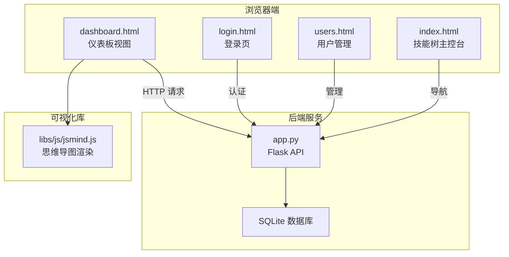
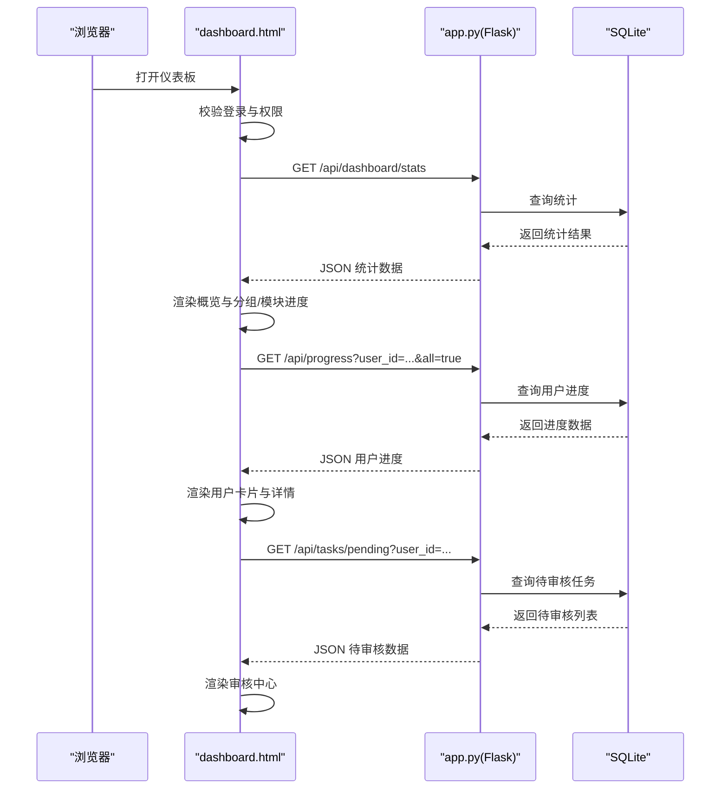
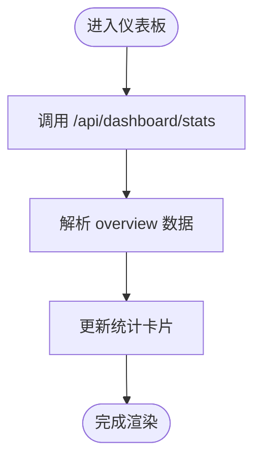
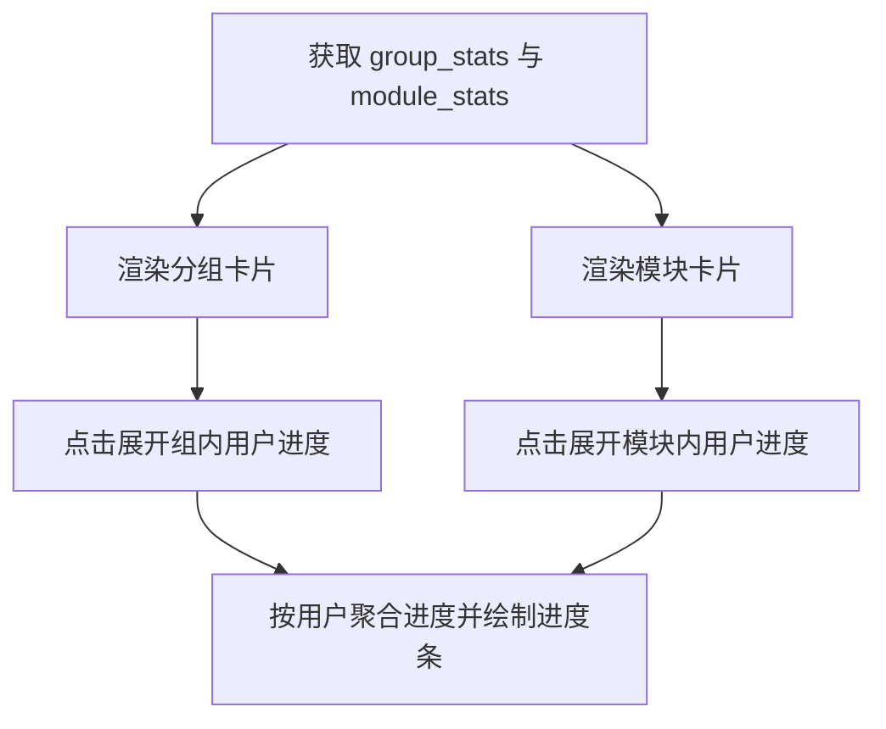
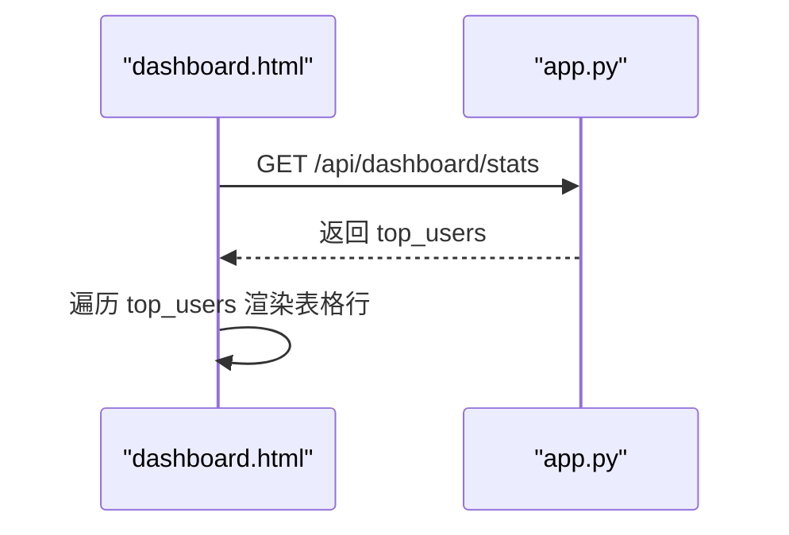
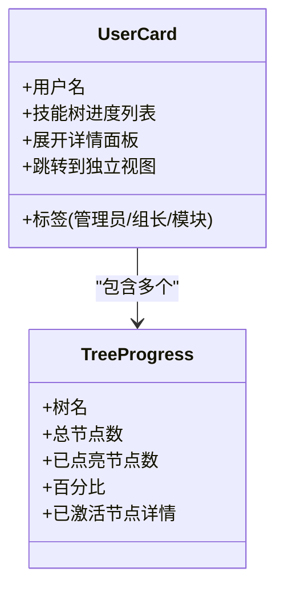
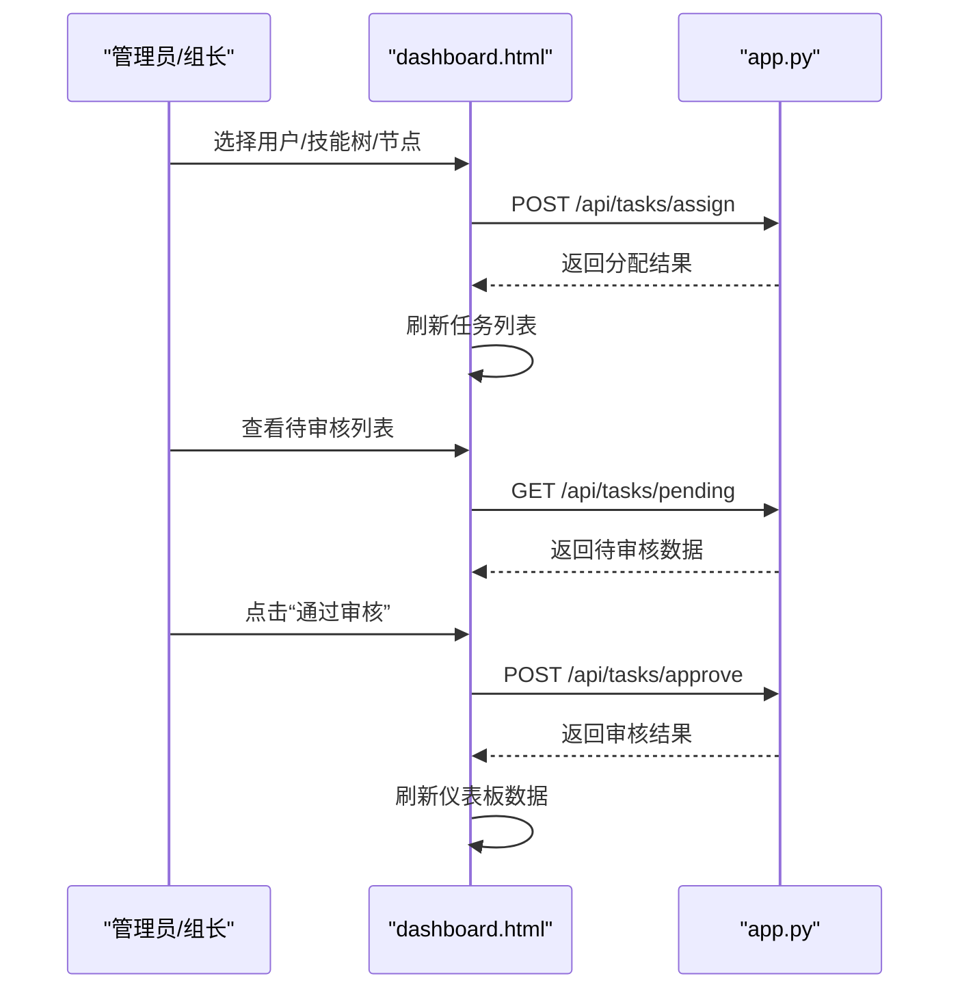
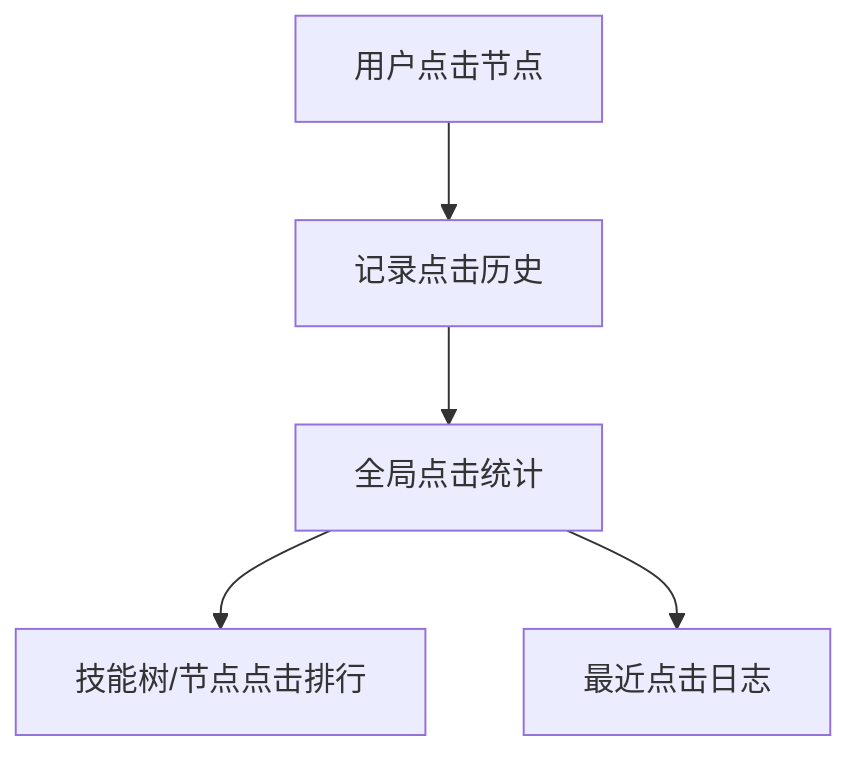
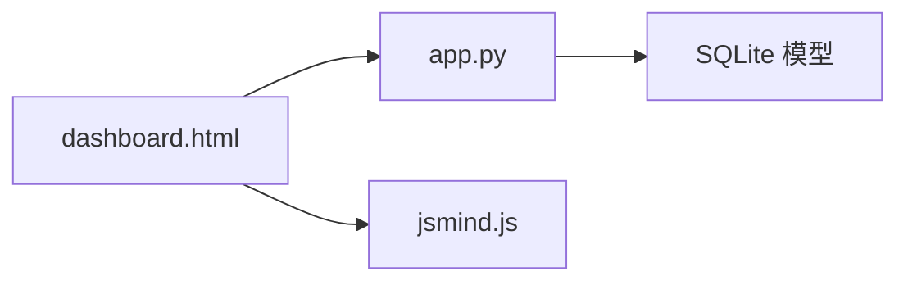

# 仪表板界面

<cite>
**本文档引用的文件**
- [dashboard.html](file://dashboard.html)
- [app.py](file://app.py)
- [login.html](file://login.html)
- [users.html](file://users.html)
- [index.html](file://index.html)
- [jsmind.js](file://libs/js/jsmind.js)
</cite>

## 目录
1. [简介](#简介)
2. [项目结构](#项目结构)
3. [核心组件](#核心组件)
4. [架构总览](#架构总览)
5. [详细组件分析](#详细组件分析)
6. [依赖关系分析](#依赖关系分析)
7. [性能考虑](#性能考虑)
8. [故障排除指南](#故障排除指南)
9. [结论](#结论)
10. [附录](#附录)

## 简介
本文件面向“技能树”系统的仪表板界面，聚焦于 dashboard.html 中的统计分析与进度跟踪功能，系统化阐述以下方面：
- 统计卡片、进度条、排行榜、用户卡片等数据展示组件的设计与实现
- 实时数据更新机制（定时刷新、WebSocket连接、数据缓存策略）
- 用户行为分析（点击统计、学习轨迹、活跃度分析）
- 报表生成功能（数据导出、格式选择、自定义报告）
- 数据可视化最佳实践与性能优化建议
- 管理员与用户不同视角的仪表板内容与权限控制

## 项目结构
仪表板界面由前端 HTML 页面与后端 Flask API 共同组成，采用前后端分离设计：
- 前端：dashboard.html 提供仪表板视图，包含统计卡片、进度图表、用户卡片、任务分配与审核中心等功能区域
- 后端：app.py 提供 /api/dashboard/stats、/api/progress、/api/tasks/* 等接口，支撑仪表板数据与交互
- 权限控制：login.html、users.html、index.html 提供登录、用户管理与主控台入口，配合 dashboard.html 的访问控制

**图表来源**
- [dashboard.html](file://dashboard.html)
- [app.py](file://app.py)
- [login.html](file://login.html)
- [users.html](file://users.html)
- [index.html](file://index.html)
- [jsmind.js](file://libs/js/jsmind.js)

**章节来源**
- [dashboard.html](file://dashboard.html)
- [app.py](file://app.py)

## 核心组件
仪表板的核心组件包括：
- 概览统计卡片：总用户数、总技能树、总节点数、平台总学习次数
- 分组进度卡片：A/B/C/D 组综合进度与明细
- 模块进度卡片：按模块聚合的进度与明细
- 学霸榜：按点亮节点数量排行的用户
- 用户卡片：按组别展示的个人进度与已点亮节点详情
- 任务分配与审核中心：管理员/组长权限下的任务管理

这些组件通过前端 JavaScript 异步调用后端 API 获取数据，并在页面中进行渲染。

**章节来源**
- [dashboard.html](file://dashboard.html)
- [app.py](file://app.py)

## 架构总览
仪表板的前后端交互流程如下：
- 登录与权限验证：用户登录后，前端将用户信息保存在本地存储；仪表板仅允许管理员或组长访问
- 数据加载：仪表板首次加载时，调用 /api/dashboard/stats 获取全局统计，随后调用 /api/progress 获取用户进度
- 任务管理：管理员/组长可加载用户、技能树、节点，进行任务分配与审核
- 实时更新：当前实现为手动刷新；可扩展 WebSocket 或定时轮询实现自动刷新

**图表来源**
- [dashboard.html](file://dashboard.html)
- [app.py](file://app.py)

**章节来源**
- [dashboard.html](file://dashboard.html)
- [app.py](file://app.py)

## 详细组件分析

### 统计卡片与概览
- 总用户数、总技能树、总节点数、平台总学习次数
- 渲染逻辑：前端获取 /api/dashboard/stats 后，将 overview 字段填充到对应卡片元素

**图表来源**
- [dashboard.html](file://dashboard.html)
- [app.py](file://app.py)

**章节来源**
- [dashboard.html](file://dashboard.html)
- [app.py](file://app.py)

### 分组进度与模块进度
- 分组进度：按 A/B/C/D/Office 组计算激活率，渲染为进度条卡片
- 模块进度：按模块聚合技能树与用户，计算模块内激活率
- 明细展开：点击卡片标题可展开该组/模块下的用户或模块内用户的进度明细

**图表来源**
- [dashboard.html](file://dashboard.html)
- [app.py](file://app.py)

**章节来源**
- [dashboard.html](file://dashboard.html)
- [app.py](file://app.py)

### 学霸榜（Top 10）
- 按用户激活节点数量排序，展示用户名、组别与已点亮节点数
- 渲染逻辑：使用 leaderboard_body 表格行进行填充

**图表来源**
- [dashboard.html](file://dashboard.html)
- [app.py](file://app.py)

**章节来源**
- [dashboard.html](file://dashboard.html)
- [app.py](file://app.py)

### 用户卡片与进度详情
- 用户卡片：按组别渲染，展示用户名、标签（管理员/组长/模块）、每棵技能树的进度与已点亮节点详情
- 详情面板：点击进度条可展开“已激活技能详情”，展示节点主题标签
- 路由跳转：支持跳转到独立技能树视图

**图表来源**
- [dashboard.html](file://dashboard.html)

**章节来源**
- [dashboard.html](file://dashboard.html)

### 任务分配与审核中心
- 任务分配：管理员/组长可选择用户、技能树、节点（支持多选），设置任务周期（当日/周/月/季度/年），提交后刷新任务列表
- 待审核中心：列出当前用户（管理员/组长）可审核的申请，点击“通过审核”后同步更新用户进度与任务状态
- 权限控制：非管理员/非组长无法访问审核中心与任务分配功能

**图表来源**
- [dashboard.html](file://dashboard.html)
- [app.py](file://app.py)

**章节来源**
- [dashboard.html](file://dashboard.html)
- [app.py](file://app.py)

### 用户行为分析
- 节点点击统计：后端提供 /api/trees/<int:tree_id>/nodes/<node_id>/history 接口，返回编辑历史与点击统计
- 全局点击统计：后端提供 /api/history/global/clicks 接口，支持按技能树/节点排行与分页查看最近点击日志
- 学习轨迹：用户卡片中的“已激活技能详情”展示用户点亮节点的路径与主题

**图表来源**
- [app.py](file://app.py)

**章节来源**
- [app.py](file://app.py)

### 报表生成功能
- 当前实现：仪表板提供数据展示与交互，未见内置报表导出按钮或格式选择
- 建议扩展：在用户卡片与统计区域增加“导出为 PDF/Excel”按钮，结合后端接口返回的原始数据进行导出

**章节来源**
- [dashboard.html](file://dashboard.html)
- [app.py](file://app.py)

## 依赖关系分析
- 前端依赖：dashboard.html 依赖 app.py 提供的 /api/* 接口；使用本地存储保存用户身份信息
- 后端依赖：app.py 依赖 SQLite 数据库模型（User、SkillTree、SkillNode、UserSkillTreeState、LearningTask 等）
- 可视化依赖：libs/js/jsmind.js 用于技能树视图渲染，与仪表板的“查看独立技能树图”功能配合

**图表来源**
- [dashboard.html](file://dashboard.html)
- [app.py](file://app.py)
- [jsmind.js](file://libs/js/jsmind.js)

**章节来源**
- [dashboard.html](file://dashboard.html)
- [app.py](file://app.py)
- [jsmind.js](file://libs/js/jsmind.js)

## 性能考虑
- 数据聚合：后端在 /api/dashboard/stats 中对组别与模块进行聚合计算，建议对常用查询建立索引（如 UserSkillTreeState.status、UserSkillTreeState.node_id）
- 分页与限制：全局点击统计接口支持排行数量与分页参数，建议在前端设置合理默认值，避免一次性加载过多数据
- 前端渲染：用户卡片与进度明细采用按需展开，减少初始渲染压力
- 缓存策略：当前未见前端缓存实现，建议对静态统计数据（如模块列表、用户列表）进行短期缓存，降低重复请求

[本节为通用性能建议，无需特定文件引用]

## 故障排除指南
- 登录与权限
  - 若提示“仅管理员或组长可以查看管理大盘”，请确认登录用户角色与组别
  - 登录页会在本地存储中保存用户信息，若异常可清除本地存储后重新登录
- 数据加载失败
  - 检查 /api/dashboard/stats 与 /api/progress 的响应状态
  - 确认后端数据库初始化是否完成
- 任务分配与审核
  - 确认当前用户具备管理员或组长权限
  - 检查技能树与节点是否存在，节点是否已被分配过

**章节来源**
- [dashboard.html](file://dashboard.html)
- [login.html](file://login.html)
- [users.html](file://users.html)
- [app.py](file://app.py)

## 结论
仪表板界面通过清晰的布局与丰富的数据展示组件，实现了对组织学习进度的全面掌控。后端 API 提供了统计、进度、任务与审核等核心能力，前端通过异步加载与按需展开提升了用户体验。后续可在实时更新、报表导出、缓存策略等方面进一步优化，以满足更高并发与更复杂分析场景的需求。

[本节为总结性内容，无需特定文件引用]

## 附录

### 权限与角色
- 管理员：可查看所有用户进度、分配任务、审核申请
- 组长：仅可查看与管理本组成员，可分配任务与审核申请
- 普通用户：仅可查看自身进度与任务

**章节来源**
- [dashboard.html](file://dashboard.html)
- [users.html](file://users.html)
- [app.py](file://app.py)