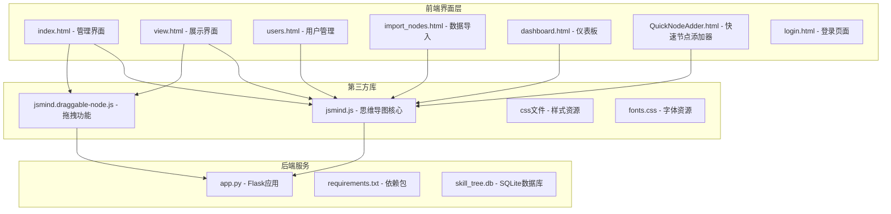
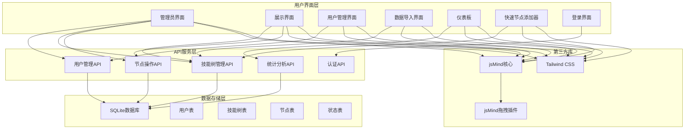
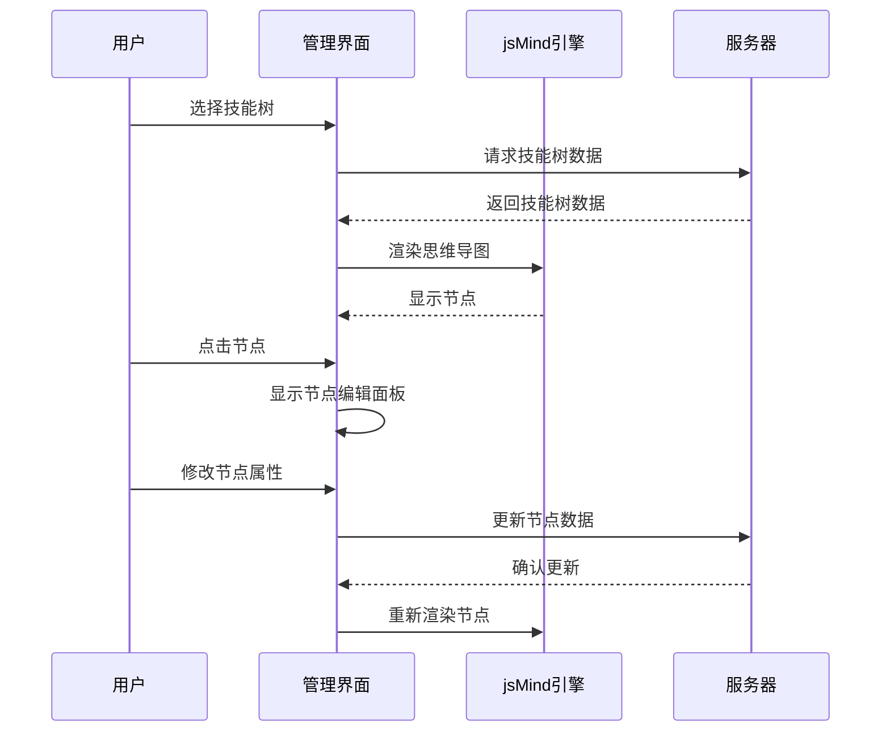
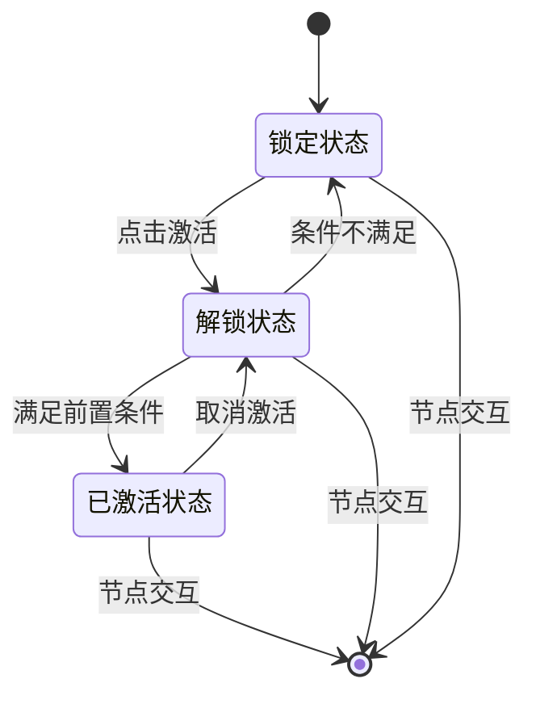
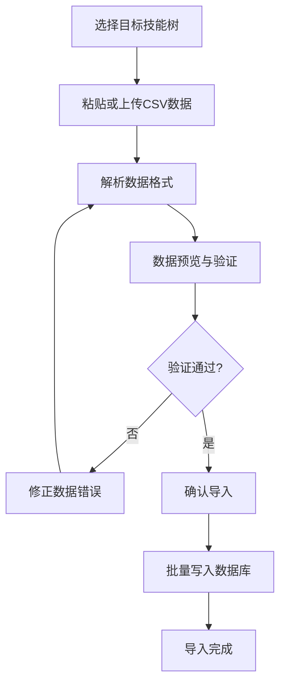
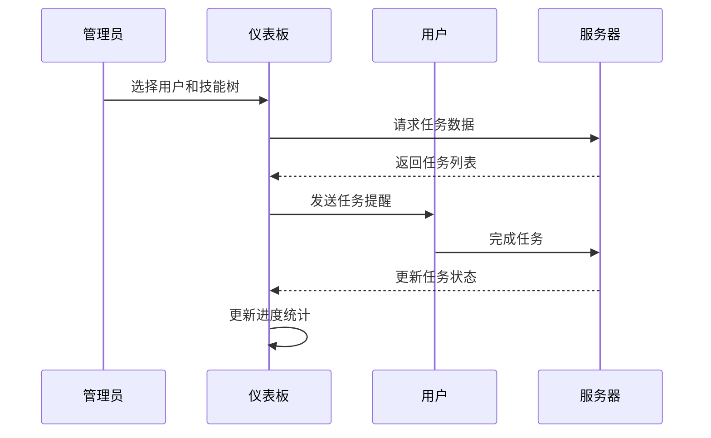
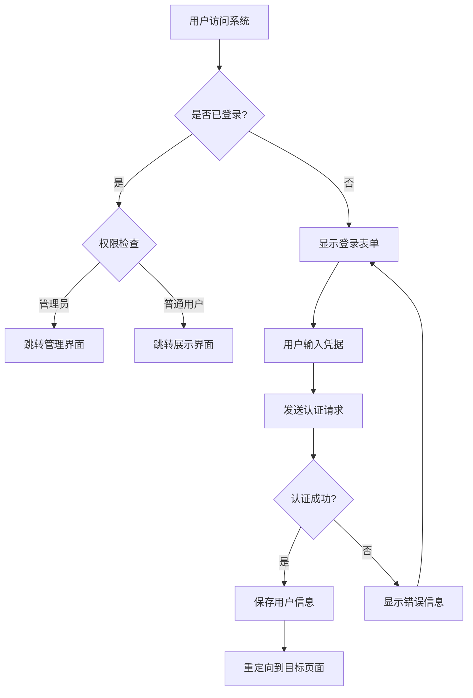
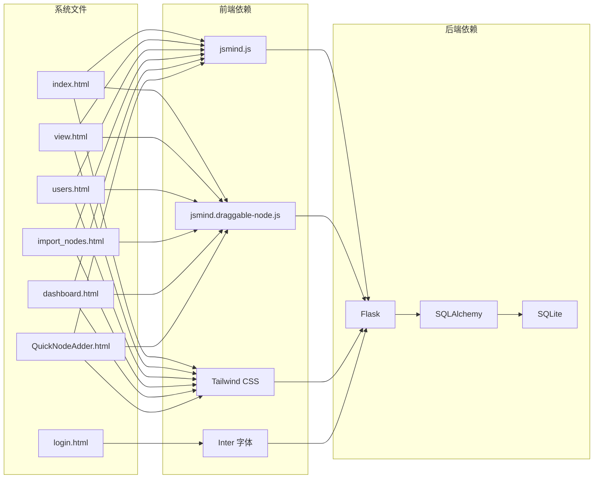

# 前端界面文档

<cite>
**本文档引用的文件**
- [index.html](file://index.html)
- [view.html](file://view.html)
- [users.html](file://users.html)
- [import_nodes.html](file://import_nodes.html)
- [dashboard.html](file://dashboard.html)
- [QuickNodeAdder.html](file://QuickNodeAdder.html)
- [login.html](file://login.html)
- [README.md](file://README.md)
- [jsmind.js](file://libs/js/jsmind.js)
- [jsmind.draggable-node.js](file://libs/js/jsmind.draggable-node.js)
</cite>

## 目录
1. [简介](#简介)
2. [项目结构](#项目结构)
3. [核心组件](#核心组件)
4. [架构概览](#架构概览)
5. [详细组件分析](#详细组件分析)
6. [依赖关系分析](#依赖关系分析)
7. [性能考虑](#性能考虑)
8. [故障排除指南](#故障排除指南)
9. [结论](#结论)
10. [附录](#附录)

## 简介

技能树管理系统是一个基于 jsMind 和 Flask 的前端界面系统，提供了完整的技能树管理、展示和用户管理功能。该系统采用现代化的设计理念，实现了响应式布局和跨浏览器兼容性，支持多用户权限管理和技能点系统。

系统的核心特色包括：
- **多用户支持**：每个用户拥有独立的技能树状态
- **权限管理**：管理员可以重置所有用户的技能树
- **状态持久化**：用户的节点激活状态独立保存
- **技能点系统**：每个用户有独立的技能点
- **jsMind 集成**：完整的思维导图渲染和交互功能

## 项目结构

项目采用模块化的文件组织方式，主要包含以下核心文件：

**图表来源**
- [index.html](file://index.html)
- [view.html](file://view.html)
- [users.html](file://users.html)
- [import_nodes.html](file://import_nodes.html)
- [dashboard.html](file://dashboard.html)
- [QuickNodeAdder.html](file://QuickNodeAdder.html)
- [login.html](file://login.html)

**章节来源**
- [README.md](file://README.md)

## 核心组件

### 设计系统与主题

系统采用了统一的深灰调设计语言，基于 CSS 变量实现主题定制：

- **主色调**：基于 Slate-700 (#4a5568) 的深灰配色
- **辅助色彩**：绿色（成功）、金色（警告）、红色（危险）
- **层次结构**：通过不同的表面色调区分页面层级
- **字体系统**：Inter 字体族，支持中英文混排

### 响应式布局架构

系统采用 Flexbox 和 Grid 布局相结合的方式：

- **容器布局**：使用 `display: flex` 实现主布局
- **网格系统**：使用 `display: grid` 实现复杂的卡片布局
- **断点设计**：针对不同屏幕尺寸优化显示效果
- **弹性单位**：使用 `rem`、`em`、`%` 实现自适应缩放

**章节来源**
- [index.html](file://index.html)
- [view.html](file://view.html)
- [users.html](file://users.html)

## 架构概览

系统采用前后端分离的架构模式，前端负责用户界面展示，后端提供 RESTful API 服务。

**图表来源**
- [index.html](file://index.html)
- [view.html](file://view.html)
- [users.html](file://users.html)
- [import_nodes.html](file://import_nodes.html)
- [dashboard.html](file://dashboard.html)
- [QuickNodeAdder.html](file://QuickNodeAdder.html)
- [login.html](file://login.html)

## 详细组件分析

### 管理界面 (index.html)

管理界面是系统的核心编辑工具，提供了完整的技能树管理功能。

#### 主要功能模块

1. **技能树管理**
   - 技能树创建、保存、加载
   - 多技能树管理支持
   - 自动数据持久化

2. **节点编辑功能**
   - 添加子节点和兄弟节点
   - 节点属性编辑（名称、颜色、技能点消耗）
   - 节点删除操作
   - 拖拽移动节点（需要 jsmind.draggable-node.js）

3. **颜色主题系统**
   - 王者荣耀风格配色方案
   - 12种背景颜色 + 5种文字颜色
   - 实时颜色预览和选择

#### 用户交互流程

**图表来源**
- [index.html](file://index.html)
- [jsmind.js](file://libs/js/jsmind.js)

#### 节点操作界面

界面采用三栏布局设计：

- **左侧边栏**：技能树列表和搜索功能
- **中间主区域**：jsMind 思维导图容器
- **右侧编辑面板**：节点属性编辑器

**章节来源**
- [index.html](file://index.html)
- [README.md](file://README.md)

### 展示界面 (view.html)

展示界面提供只读模式的技能树浏览功能，支持节点激活和状态管理。

#### 核心特性

1. **用户选择机制**
   - 必须先选择用户才能查看技能树
   - 每个用户看到自己的技能树状态
   - 管理员可以选择查看任意用户的技能树

2. **只读展示模式**
   - 专门用于展示技能树，不可编辑节点内容
   - 支持点击节点激活/点亮
   - 初始状态所有节点都是锁定的（根节点除外）

3. **节点状态管理**
   - **锁定状态**：灰色显示，带锁图标，无法激活
   - **已激活状态**：正常颜色，带高亮动画和✓标记
   - 前置条件检查：只有父节点已激活才能激活子节点

#### 节点状态可视化

**图表来源**
- [view.html](file://view.html)

#### 技能点系统

展示界面集成了完整的技能点管理系统：

- **技能点显示**：实时显示当前用户的可用技能点和总技能点
- **消耗机制**：激活节点消耗技能点（每个用户独立）
- **重置功能**：支持重置技能树状态

**章节来源**
- [view.html](file://view.html)
- [README.md](file://README.md)

### 用户管理界面 (users.html)

用户管理界面提供了完整的用户权限分配和状态控制功能。

#### 功能特性

1. **用户创建与编辑**
   - 创建新用户（用户名、密码、组别）
   - 编辑现有用户信息
   - 权限设置（管理员、组长）

2. **模块权限管理**
   - 多选模块分配
   - 自定义模块创建
   - 权限继承机制

3. **用户筛选与搜索**
   - 按组别筛选（A/B/C/D/Office）
   - 搜索功能
   - 组长过滤

#### 界面布局

采用两栏布局设计：

- **左侧表单**：用户信息输入和权限设置
- **右侧列表**：用户卡片展示和批量操作

**章节来源**
- [users.html](file://users.html)

### 数据导入界面 (import_nodes.html)

数据导入界面提供了 CSV 文件处理和批量导入功能。

#### 导入流程

**图表来源**
- [import_nodes.html](file://import_nodes.html)

#### CSV 处理能力

- **自动格式检测**：智能识别制表符或逗号分隔
- **数据验证**：字段完整性检查
- **预览编辑**：可编辑的预览表格
- **批量操作**：支持大量数据的高效处理

**章节来源**
- [import_nodes.html](file://import_nodes.html)

### 仪表板界面 (dashboard.html)

仪表板提供了全面的统计分析和进度跟踪功能。

#### 统计指标

1. **全局指标**
   - 总用户数
   - 总技能树数量
   - 总技能节点数
   - 平台总学习次数

2. **分组进度**
   - A/B/C/D 组的学习进度对比
   - 各组技能树完成度
   - 组内成员活跃度

3. **排行榜功能**
   - 全员学霸榜（Top 10）
   - 组内排名
   - 进步幅度排行

#### 任务管理

**图表来源**
- [dashboard.html](file://dashboard.html)

**章节来源**
- [dashboard.html](file://dashboard.html)

### 快速节点添加器 (QuickNodeAdder.html)

快速节点添加器提供了便捷的批量节点添加功能。

#### 核心功能

1. **批量添加**
   - 支持多行技能标题批量添加
   - 自动生成节点 ID
   - 统一的节点属性设置

2. **父节点选择**
   - 树形节点列表预览
   - 点击选择父节点
   - 层级缩进显示

3. **配置选项**
   - 展示方向设置（左右）
   - 归属等级配置
   - 激活消耗点数设置

#### 用户体验优化

- **实时预览**：添加后立即更新节点列表
- **结果反馈**：成功/失败统计显示
- **错误处理**：友好的错误提示信息

**章节来源**
- [QuickNodeAdder.html](file://QuickNodeAdder.html)

### 登录界面 (login.html)

登录界面提供了安全的用户认证机制。

#### 认证流程

**图表来源**
- [login.html](file://login.html)

**章节来源**
- [login.html](file://login.html)

## 依赖关系分析

系统的主要依赖关系如下：

**图表来源**
- [index.html](file://index.html)
- [view.html](file://view.html)
- [users.html](file://users.html)
- [import_nodes.html](file://import_nodes.html)
- [dashboard.html](file://dashboard.html)
- [QuickNodeAdder.html](file://QuickNodeAdder.html)
- [login.html](file://login.html)
- [jsmind.js](file://libs/js/jsmind.js)
- [jsmind.draggable-node.js](file://libs/js/jsmind.draggable-node.js)

**章节来源**
- [README.md](file://README.md)

## 性能考虑

### 前端性能优化

1. **资源加载优化**
   - 使用 CSS 变量减少重复样式定义
   - 图片懒加载和缓存策略
   - CDN 加速字体和静态资源

2. **DOM 操作优化**
   - 批量 DOM 更新
   - 虚拟滚动处理大量数据
   - 事件委托减少监听器数量

3. **内存管理**
   - 及时清理事件监听器
   - 合理的垃圾回收策略
   - 避免内存泄漏

### jsMind 性能特性

- **高效的渲染算法**：基于 Canvas 的高性能渲染
- **增量更新**：只更新变化的部分
- **虚拟化支持**：处理大规模节点树

## 故障排除指南

### 常见问题及解决方案

1. **jsMind 渲染异常**
   - 检查容器尺寸设置
   - 确认 CSS 样式冲突
   - 验证数据格式正确性

2. **拖拽功能失效**
   - 确认已加载 draggable-node 插件
   - 检查编辑模式状态
   - 验证节点是否可拖拽

3. **权限相关问题**
   - 检查用户登录状态
   - 验证权限级别设置
   - 确认 API 访问权限

4. **数据导入失败**
   - 验证 CSV 格式正确性
   - 检查必填字段完整性
   - 确认目标技能树存在

**章节来源**
- [README.md](file://README.md)

## 结论

技能树管理系统前端界面展现了现代 Web 应用的最佳实践，通过合理的架构设计和丰富的功能实现，为用户提供了优秀的技能树管理体验。

### 主要优势

1. **设计理念先进**：采用深灰调设计语言，符合现代审美趋势
2. **功能完整丰富**：涵盖技能树管理的各个方面
3. **用户体验优秀**：直观的操作界面和流畅的交互体验
4. **技术实现成熟**：基于成熟的 jsMind 库和现代前端技术栈

### 技术亮点

- **响应式设计**：完美适配各种设备和屏幕尺寸
- **跨浏览器兼容**：支持主流现代浏览器
- **性能优化**：高效的渲染和数据处理机制
- **可扩展性**：模块化的架构便于功能扩展

该系统为技能树管理提供了一个完整、稳定、易用的前端解决方案，适合在企业培训、教育机构等场景中广泛应用。

## 附录

### API 接口规范

系统提供完整的 RESTful API 接口，支持技能树的增删改查操作。

### 数据模型

系统采用关系型数据库设计，通过清晰的表结构实现数据的高效存储和查询。

### 开发指南

为前端开发者提供了详细的实现指南，包括组件开发、样式定制、性能优化等方面的最佳实践。