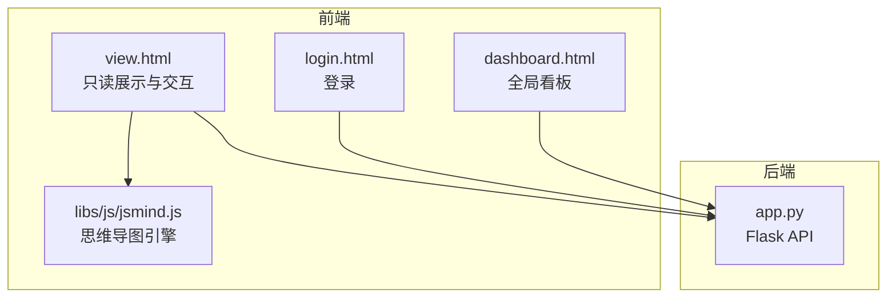
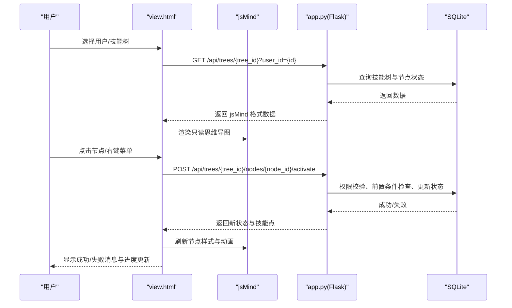
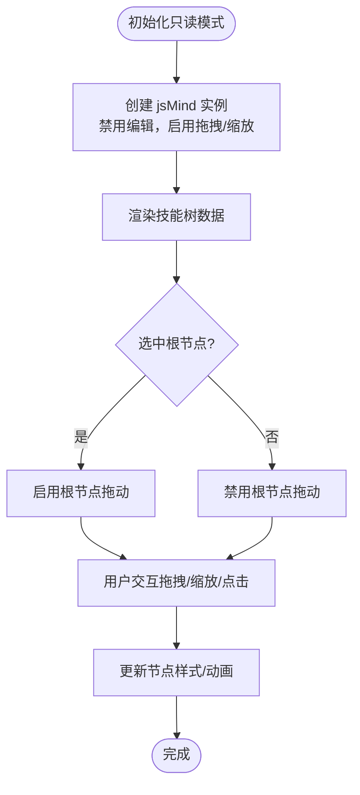
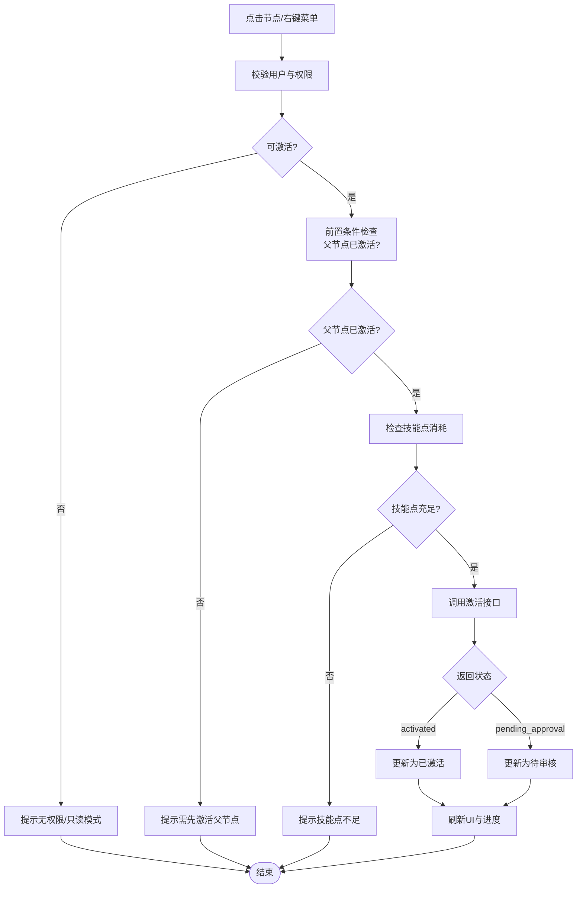
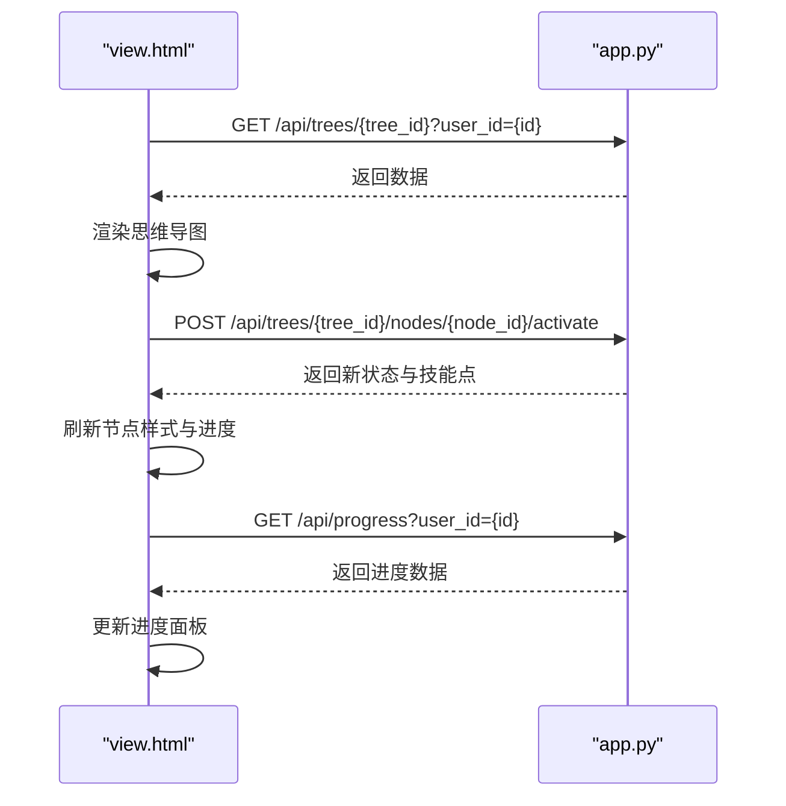
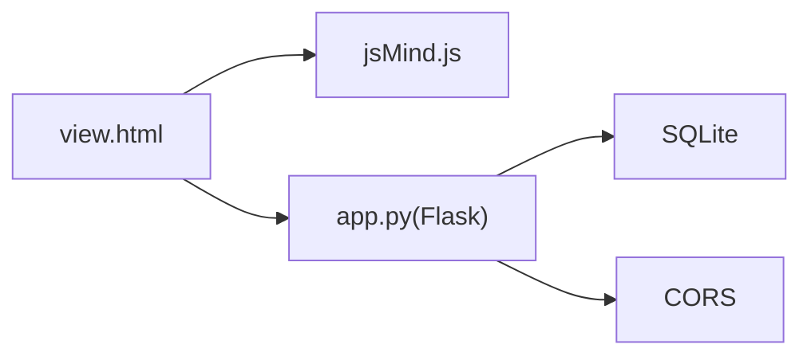

# 展示界面

<cite>
**本文引用的文件**
- [view.html](file://view.html)
- [app.py](file://app.py)
- [README.md](file://README.md)
- [login.html](file://login.html)
- [dashboard.html](file://dashboard.html)
- [libs/js/jsmind.js](file://libs/js/jsmind.js)
</cite>

## 目录
1. [简介](#简介)
2. [项目结构](#项目结构)
3. [核心组件](#核心组件)
4. [架构总览](#架构总览)
5. [详细组件分析](#详细组件分析)
6. [依赖关系分析](#依赖关系分析)
7. [性能考虑](#性能考虑)
8. [故障排查指南](#故障排查指南)
9. [结论](#结论)
10. [附录](#附录)

## 简介
本文件面向技能树展示界面（view.html）的只读模式，系统性阐述其可视化展示机制、节点激活流程、权限控制、用户进度跟踪、响应式与跨浏览器兼容策略，以及与后台API的数据交互与实时更新机制。读者无需深入前端技术即可理解界面如何帮助用户查看技能树结构、理解节点关系并完成学习任务。

## 项目结构
- 前端页面：view.html（只读展示与交互）、login.html（登录）、dashboard.html（全局看板）
- 后端服务：app.py（Flask API，提供技能树、节点、用户、任务、进度等接口）
- 可视化库：libs/js/jsmind.js（思维导图渲染引擎）
- 文档与说明：README.md（功能与API说明）

**图表来源**
- [view.html](file://view.html)
- [login.html](file://login.html)
- [dashboard.html](file://dashboard.html)
- [app.py](file://app.py)
- [libs/js/jsmind.js](file://libs/js/jsmind.js)

**章节来源**
- [README.md: 项目结构:61-78](file://README.md#L61-L78)

## 核心组件
- 只读思维导图容器：通过 jsMind 初始化为只读模式，禁用编辑能力，启用拖拽与缩放，适配大尺寸树图。
- 节点状态系统：锁定（locked）、解锁（unlocked）、已激活（activated）、待审核（pending_approval）四种状态，配合样式与动画反馈。
- 用户与权限：登录态来自 localStorage，管理员可见更多控制；普通用户仅能查看与激活。
- 技能点系统：显示可用技能点与总技能点，激活节点消耗技能点。
- 视图模式：树状模式（自下而上解锁）与进阶路径模式（线性等级解锁），支持切换并同步到服务器。
- 任务看板：登录后弹窗展示每日/每周/每月/季度/年度任务，点击快速定位节点。
- 进度面板：管理员可查看全员进度，普通用户查看个人进度。
- 右键菜单与详情面板：右键菜单提供快捷操作，详情面板展示节点等级、模块、说明、链接与激活按钮。

**章节来源**
- [view.html: 初始化与只读模式:1778-1858](file://view.html#L1778-L1858)
- [view.html: 节点状态样式与动画:314-417](file://view.html#L314-L417)
- [view.html: 激活节点流程:2275-2317](file://view.html#L2275-L2317)
- [view.html: 视图模式切换:3636-3674](file://view.html#L3636-L3674)
- [view.html: 任务看板与进度面板:2320-2390](file://view.html#L2320-L2390)
- [view.html: 右键菜单与详情面板:3798-3859](file://view.html#L3798-L3859)

## 架构总览
view.html 作为前端展示层，通过 fetch 与后端 API 通信，获取技能树数据、执行节点激活、重置技能树、加载任务与进度。jsMind 负责渲染与交互（只读模式），并提供缩放、拖拽、键盘快捷键等体验增强。

**图表来源**
- [view.html: 激活节点流程:2275-2317](file://view.html#L2275-L2317)
- [app.py: 节点激活接口:777-800](file://app.py#L777-L800)

## 详细组件分析

### 只读模式与可视化展示
- 初始化：禁用编辑（editable=false），启用拖拽与缩放，设置边距与连线样式，提升可读性。
- 根节点拖动：选中根节点时启用拖动整个画布的能力，便于大图浏览。
- 缩放与滚动：提供缩放控件与滚轮缩放，内置补丁以适配内嵌容器尺寸判断，避免误判导致无法继续缩小。
- 响应式布局：工具栏、节点详情面板、进度面板、任务看板均适配不同屏幕尺寸。

**图表来源**
- [view.html: 只读模式初始化:1778-1858](file://view.html#L1778-L1858)
- [view.html: 根节点拖动与画布拖动:2090-2246](file://view.html#L2090-L2246)
- [view.html: 缩放补丁:1866-1909](file://view.html#L1866-L1909)

**章节来源**
- [view.html: 只读模式初始化:1778-1858](file://view.html#L1778-L1858)
- [view.html: 根节点拖动:2090-2246](file://view.html#L2090-L2246)
- [view.html: 画布拖动:1922-2000](file://view.html#L1922-L2000)
- [view.html: 缩放补丁:1866-1909](file://view.html#L1866-L1909)

### 节点激活机制
- 触发方式：左键点击节点详情面板或右键菜单“点亮此技能”。
- 权限校验：非管理员仅能激活与自身模块匹配的技能树节点。
- 前置条件：父节点必须已激活（根节点除外）。
- 技能点消耗：节点 cost 消耗，若不足则阻止激活。
- 状态转换：
  - locked → unlocked（满足条件但未激活）
  - unlocked → activated（成功激活）
  - activated → pending_approval（审核流程）
- 后台接口：POST /api/trees/{tree_id}/nodes/{node_id}/activate
- 前端反馈：更新节点样式、动画、技能点显示，刷新详情面板，提示成功/失败。

**图表来源**
- [view.html: 激活节点流程:2275-2317](file://view.html#L2275-L2317)
- [app.py: 节点激活接口:777-800](file://app.py#L777-L800)

**章节来源**
- [view.html: 激活节点流程:2275-2317](file://view.html#L2275-L2317)
- [app.py: 节点激活接口:777-800](file://app.py#L777-L800)

### 权限验证与用户进度跟踪
- 登录态：用户信息存储于 localStorage，页面加载时读取并校验。
- 权限判定：管理员可重置所有用户技能树；普通用户仅能重置自己的。
- 进度跟踪：每个用户在每个技能树中的节点状态独立保存，含技能点余额。
- 模块权限：非管理员仅能激活与自身模块匹配的技能树节点。

**章节来源**
- [view.html: 登录态与权限:2460-2491](file://view.html#L2460-L2491)
- [app.py: 权限校验与模块匹配:790-796](file://app.py#L790-L796)
- [README.md: 权限与状态持久化:3-11](file://README.md#L3-L11)

### 响应式设计与跨浏览器兼容
- 布局：工具栏、节点详情面板、进度面板、任务看板均使用 Flex/Grid 布局，适配移动端与桌面端。
- 滚动与缩放：容器内滚动与 jsMind 缩放结合，避免内容溢出与遮挡。
- 兼容性：jsMind 支持 Canvas 渲染与多种浏览器；CSS 使用现代属性并提供降级方案。
- 键盘快捷键：支持手型/指针模式切换（H/V），提升无障碍体验。

**章节来源**
- [view.html: 响应式与布局:1614-1676](file://view.html#L1614-L1676)
- [view.html: 键盘快捷键与交互模式:4133-4152](file://view.html#L4133-L4152)
- [libs/js/jsmind.js: 渲染与配置:1-200](file://libs/js/jsmind.js#L1-L200)

### 用户如何查看技能树、理解节点关系与完成学习任务
- 查看技能树：选择用户与技能树后，加载对应数据；根节点可拖动，节点详情展示等级、模块、说明与链接。
- 理解节点关系：树状/进阶路径两种视图模式，清晰呈现父子层级与等级顺序。
- 完成学习任务：登录后弹出任务看板，点击任务卡片快速定位节点并尝试激活。

**章节来源**
- [view.html: 详情面板与节点信息:3496-3611](file://view.html#L3496-L3611)
- [view.html: 视图模式切换:3636-3674](file://view.html#L3636-L3674)
- [view.html: 任务看板:2320-2390](file://view.html#L2320-L2390)

### 界面元素布局、视觉反馈与用户体验优化
- 节点状态反馈：锁定（灰色+锁图标）、解锁（虚线边框脉冲）、已激活（高亮边框与✓标记）、待审核（橙色边框与⏳图标）。
- 动画与过渡：节点样式切换、详情面板滑入、进度面板淡入、消息提示滑出，提升交互感知。
- 操作入口：工具栏按钮、右键菜单、详情面板激活按钮，满足不同操作习惯。
- 可访问性：键盘快捷键、焦点状态、提示文案，降低使用门槛。

**章节来源**
- [view.html: 节点状态样式与动画:314-417](file://view.html#L314-L417)
- [view.html: 详情面板与激活按钮:3517-3557](file://view.html#L3517-L3557)
- [view.html: 消息提示与面板动画:857-890](file://view.html#L857-L890)

### 数据交互流程与实时更新机制
- 技能树加载：GET /api/trees/{tree_id}?user_id={id}
- 节点激活：POST /api/trees/{tree_id}/nodes/{node_id}/activate
- 重置技能树：POST /api/users/{user_id}/trees/{tree_id}/reset 或 POST /api/trees/{tree_id}/reset（管理员）
- 进度加载：GET /api/progress?user_id={id}[&all=true]
- 任务加载：GET /api/tasks/my?user_id={id}
- 点击记录：POST /api/trees/{tree_id}/nodes/{node_id}/click

**图表来源**
- [view.html: 激活节点与进度加载:2275-2317](file://view.html#L2275-L2317)
- [view.html: 进度面板加载:3891-3951](file://view.html#L3891-L3951)

**章节来源**
- [view.html: 激活节点与进度加载:2275-2317](file://view.html#L2275-L2317)
- [view.html: 进度面板加载:3891-3951](file://view.html#L3891-L3951)

## 依赖关系分析
- view.html 依赖 jsMind 渲染引擎，负责节点绘制、连线、缩放与交互。
- view.html 通过 fetch 与 app.py 通信，后者基于 Flask+CORS 提供 REST API。
- 数据持久化：SQLite 存储用户、技能树、节点、用户状态、任务与历史记录。
- 权限模型：用户角色（管理员/组长/普通用户）决定操作范围与可见性。

**图表来源**
- [view.html](file://view.html)
- [app.py](file://app.py)
- [libs/js/jsmind.js](file://libs/js/jsmind.js)

**章节来源**
- [app.py: CORS 与数据库初始化:17-22](file://app.py#L17-L22)
- [README.md: 技术栈:292-297](file://README.md#L292-L297)

## 性能考虑
- 大树图优化：增加边距与间距，避免节点重叠；缩放补丁减少误判导致的渲染抖动。
- 事件节流：缩放标签更新使用 requestAnimationFrame，避免频繁 DOM 操作。
- 按需渲染：详情面板与进度面板惰性加载，减少首屏压力。
- 本地状态缓存：节点状态映射与原始数据备份，避免重复请求与重绘。

**章节来源**
- [view.html: 缩放补丁与事件优化:1866-1909](file://view.html#L1866-L1909)
- [view.html: 按需渲染与本地状态:1764-1772](file://view.html#L1764-L1772)

## 故障排查指南
- 无法激活节点
  - 检查父节点是否已激活（根节点除外）
  - 检查技能点是否充足
  - 确认当前模块权限是否允许激活
- 无法加载技能树
  - 确认已选择用户与技能树
  - 检查后端服务是否运行与 CORS 是否允许
- 无法缩放/拖拽
  - 确认交互模式（手型/指针）
  - 检查容器尺寸与滚动条状态
- 登录态丢失
  - 检查 localStorage 是否存在 currentUser
  - 确认登录页面是否正确重定向

**章节来源**
- [view.html: 激活节点与权限提示:2275-2317](file://view.html#L2275-L2317)
- [login.html: 登录与重定向:151-221](file://login.html#L151-L221)

## 结论
view.html 的只读展示界面以 jsMind 为核心，结合严格的权限控制、完善的节点状态管理与丰富的交互反馈，为用户提供了直观、高效的学习路径导航。通过与后端 API 的稳定交互，实现了技能树的可视化展示、节点激活、进度追踪与任务驱动学习的闭环体验。

## 附录
- API 接口清单（节选）
  - GET /api/trees/{tree_id}?user_id={id}
  - POST /api/trees/{tree_id}/nodes/{node_id}/activate
  - POST /api/users/{user_id}/trees/{tree_id}/reset
  - POST /api/trees/{tree_id}/reset
  - GET /api/progress?user_id={id}[&all=true]
  - GET /api/tasks/my?user_id={id}

**章节来源**
- [README.md: API 接口说明:113-214](file://README.md#L113-L214)