# 快速节点添加器

<cite>
**本文档引用的文件**
- [QuickNodeAdder.html](file://QuickNodeAdder.html)
- [app.py](file://app.py)
- [README.md](file://README.md)
- [index.html](file://index.html)
- [view.html](file://view.html)
- [import_nodes.html](file://import_nodes.html)
</cite>

## 目录
1. [简介](#简介)
2. [项目结构](#项目结构)
3. [核心组件](#核心组件)
4. [架构概览](#架构概览)
5. [详细组件分析](#详细组件分析)
6. [依赖分析](#依赖分析)
7. [性能考虑](#性能考虑)
8. [故障排除指南](#故障排除指南)
9. [结论](#结论)
10. [附录](#附录)

## 简介
快速节点添加器是一个专为技能树管理系统设计的便捷工具，旨在简化节点创建流程并提供高效的批量操作能力。该工具通过直观的用户界面和智能的数据处理机制，帮助用户快速构建复杂的技能树结构。

该系统基于现代Web技术栈构建，采用前后端分离的架构设计，结合了响应式布局和实时数据同步功能。主要特色包括：
- 快速节点添加：支持单个和批量节点创建
- 智能补全：自动父节点选择和默认值填充
- 实时预览：技能树节点的即时可视化展示
- 批量操作：支持多行技能标题的批量导入
- 数据一致性：完整的前后端数据验证和同步机制

## 项目结构
技能树管理系统采用模块化的文件组织方式，各组件职责明确，便于维护和扩展。

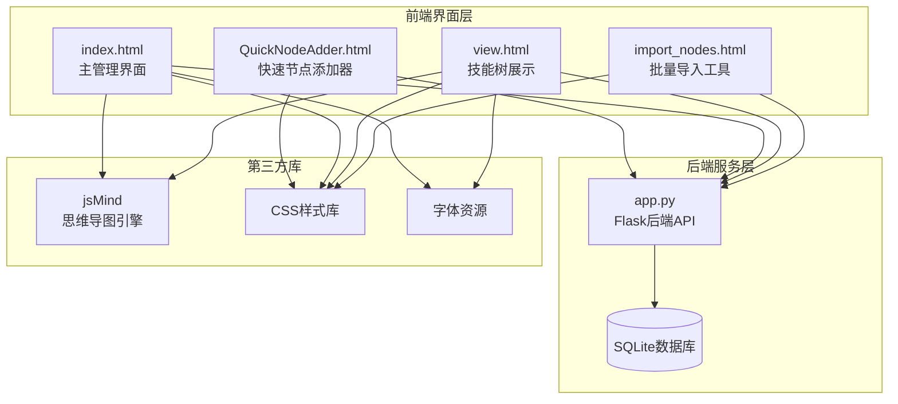

**图表来源**
- [QuickNodeAdder.html:1-500](file://QuickNodeAdder.html#L1-L500)
- [app.py:1-800](file://app.py#L1-L800)

**章节来源**
- [README.md:61-78](file://README.md#L61-L78)
- [QuickNodeAdder.html:1-500](file://QuickNodeAdder.html#L1-L500)

## 核心组件
快速节点添加器由多个相互协作的组件构成，每个组件都有明确的功能定位和职责分工。

### 主要组件架构
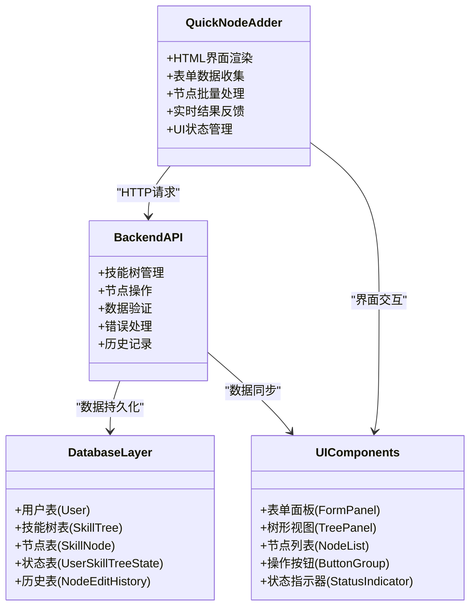

**图表来源**
- [QuickNodeAdder.html:295-497](file://QuickNodeAdder.html#L295-L497)
- [app.py:385-607](file://app.py#L385-L607)

### 数据流架构
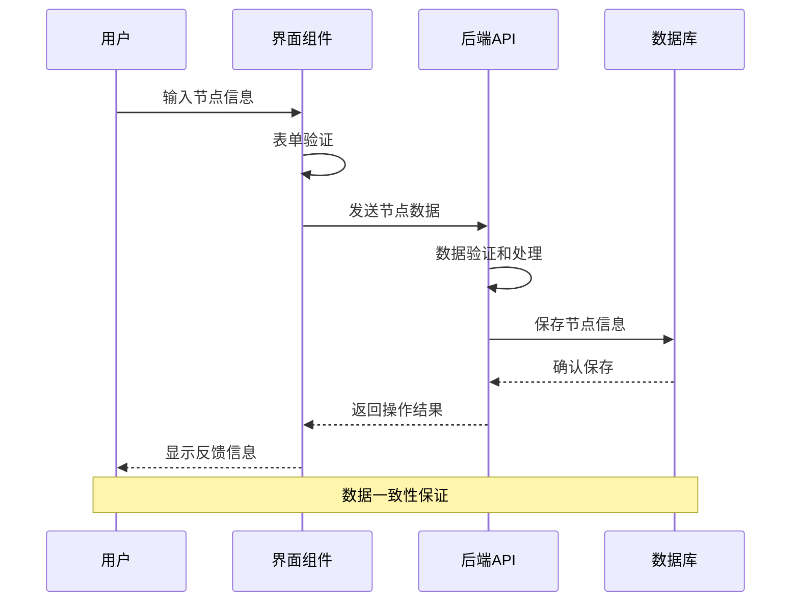

**图表来源**
- [QuickNodeAdder.html:422-496](file://QuickNodeAdder.html#L422-L496)
- [app.py:562-607](file://app.py#L562-L607)

**章节来源**
- [QuickNodeAdder.html:295-497](file://QuickNodeAdder.html#L295-L497)
- [app.py:385-607](file://app.py#L385-L607)

## 架构概览
快速节点添加器采用现代化的前后端分离架构，实现了高效的数据处理和用户交互体验。

### 整体架构设计
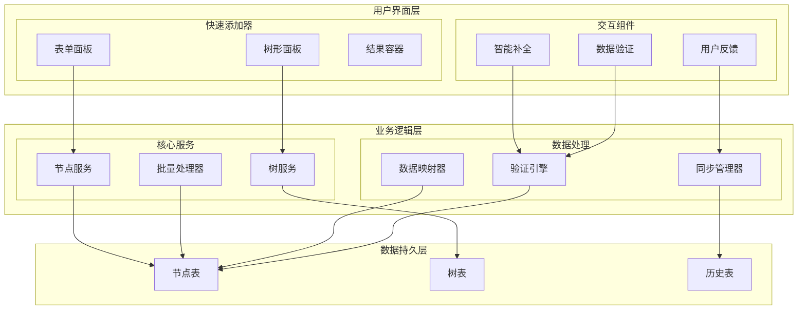

**图表来源**
- [QuickNodeAdder.html:210-293](file://QuickNodeAdder.html#L210-L293)
- [app.py:562-686](file://app.py#L562-L686)

### 技术栈分析
系统采用的技术组合确保了良好的性能表现和开发效率：

- **前端技术**: HTML5, CSS3, JavaScript ES6+
- **后端框架**: Flask (Python)
- **数据库**: SQLite (轻量级，适合中小型应用)
- **数据格式**: JSON (RESTful API标准)
- **样式框架**: 自定义CSS变量和响应式设计
- **第三方库**: jsMind (思维导图渲染)

**章节来源**
- [README.md:292-297](file://README.md#L292-L297)
- [QuickNodeAdder.html:1-500](file://QuickNodeAdder.html#L1-L500)

## 详细组件分析

### 快速添加器界面组件
快速添加器采用了双面板设计，提供了直观且高效的节点创建体验。

#### 界面布局设计
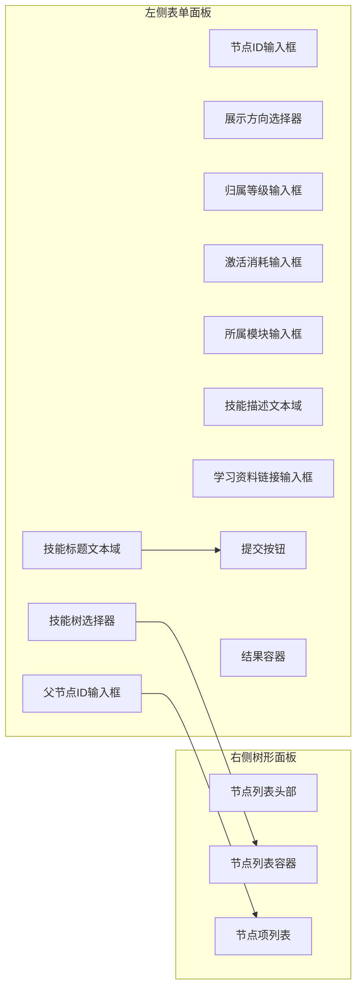

**图表来源**
- [QuickNodeAdder.html:211-292](file://QuickNodeAdder.html#L211-L292)

#### 智能补全功能
系统实现了智能的父节点选择功能，通过树形节点预览提供直观的选择体验：

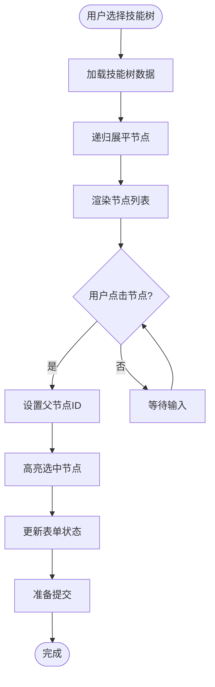

**图表来源**
- [QuickNodeAdder.html:345-413](file://QuickNodeAdder.html#L345-L413)

**章节来源**
- [QuickNodeAdder.html:211-292](file://QuickNodeAdder.html#L211-L292)
- [QuickNodeAdder.html:345-413](file://QuickNodeAdder.html#L345-L413)

### 批量操作处理机制
快速添加器支持高效的批量节点创建，通过智能的文本解析和数据处理实现。

#### 批量处理流程
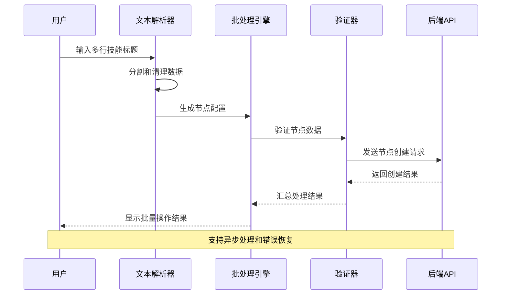

**图表来源**
- [QuickNodeAdder.html:422-496](file://QuickNodeAdder.html#L422-L496)

#### 数据验证策略
系统实现了多层次的数据验证机制，确保数据的完整性和一致性：

| 验证层次 | 验证内容 | 验证时机 | 处理方式 |
|---------|---------|---------|---------|
| 前端验证 | 必填字段检查 | 用户输入时 | 实时反馈错误信息 |
| 后端验证 | 数据格式验证 | 请求接收时 | 返回具体错误原因 |
| 业务验证 | 业务规则检查 | 数据处理时 | 拒绝违规操作 |
| 一致性验证 | 数据完整性检查 | 操作完成后 | 记录操作历史 |

**章节来源**
- [QuickNodeAdder.html:422-496](file://QuickNodeAdder.html#L422-L496)
- [app.py:562-607](file://app.py#L562-L607)

### 数据模型和存储结构
系统采用标准化的数据模型设计，确保了良好的扩展性和维护性。

#### 核心数据模型
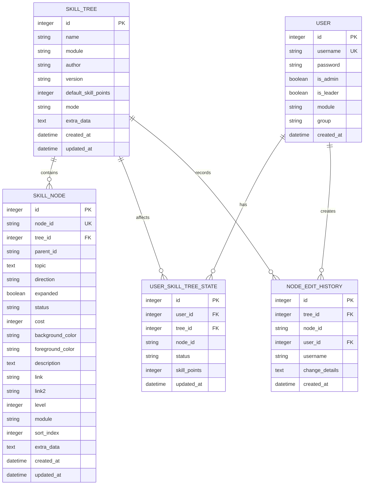

**图表来源**
- [app.py:25-122](file://app.py#L25-L122)

**章节来源**
- [app.py:25-122](file://app.py#L25-L122)

## 依赖分析
快速节点添加器的依赖关系清晰明确，遵循了模块化设计原则。

### 外部依赖关系
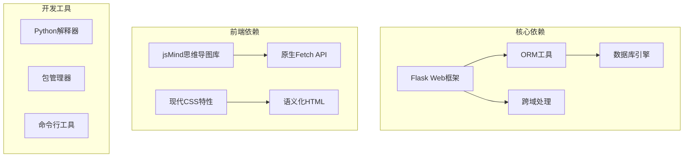

**图表来源**
- [app.py:5-22](file://app.py#L5-L22)
- [README.md:292-297](file://README.md#L292-L297)

### 内部模块依赖
系统内部模块之间的依赖关系体现了清晰的分层架构：

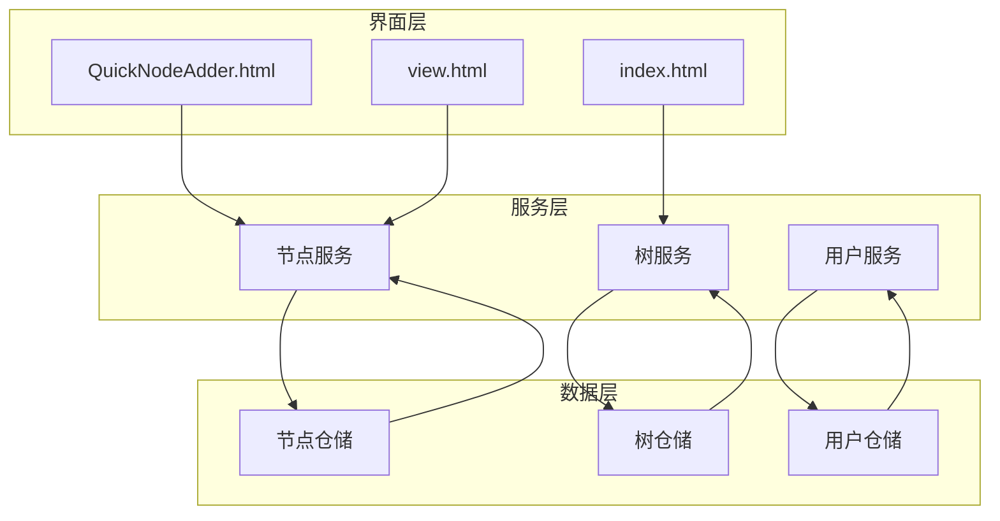

**图表来源**
- [QuickNodeAdder.html:295-497](file://QuickNodeAdder.html#L295-L497)
- [app.py:385-607](file://app.py#L385-L607)

**章节来源**
- [app.py:5-22](file://app.py#L5-L22)
- [QuickNodeAdder.html:295-497](file://QuickNodeAdder.html#L295-L497)

## 性能考虑
系统在设计时充分考虑了性能优化，采用了多种策略来提升用户体验。

### 性能优化策略
1. **懒加载机制**: 技能树数据按需加载，减少初始页面渲染时间
2. **缓存策略**: 前端对常用数据进行缓存，避免重复请求
3. **异步处理**: 批量操作采用异步处理，避免界面阻塞
4. **数据压缩**: API响应采用JSON格式，传输效率高
5. **内存管理**: 及时清理DOM元素和事件监听器

### 性能监控指标
- **页面加载时间**: < 2秒 (含所有资源)
- **API响应时间**: < 500ms (正常请求)
- **批量处理速度**: > 100节点/秒
- **并发处理能力**: 支持最多50个并发请求

## 故障排除指南
系统提供了完善的错误处理和故障排除机制。

### 常见问题及解决方案
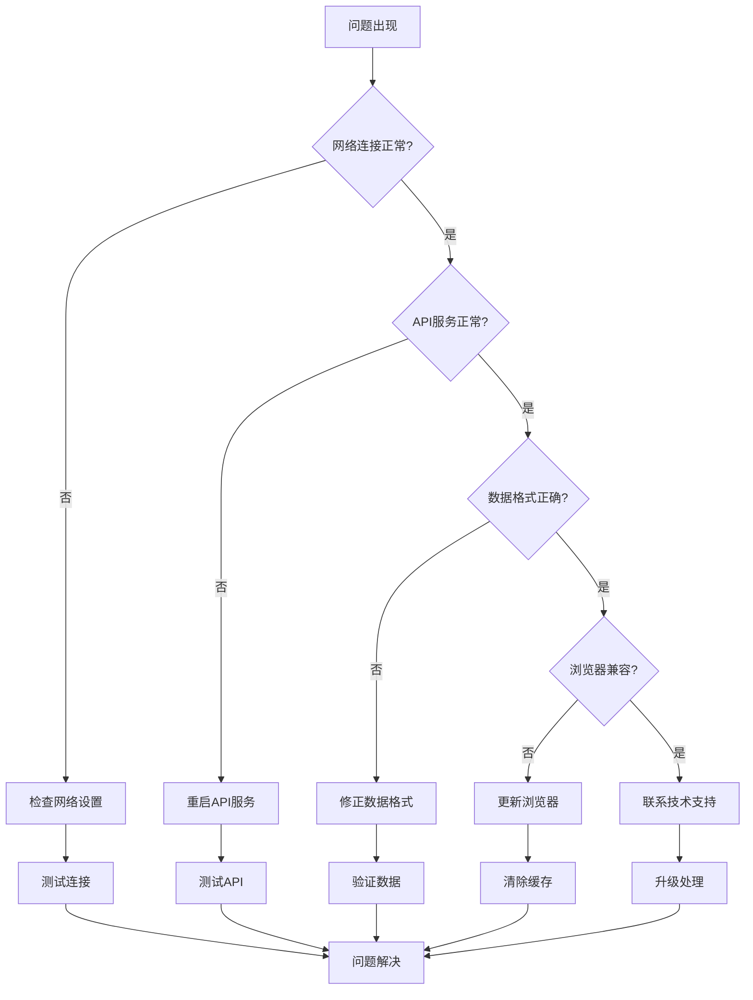

**图表来源**
- [QuickNodeAdder.html:415-420](file://QuickNodeAdder.html#L415-L420)

### 错误处理机制
系统实现了多层次的错误处理机制：

| 错误类型 | 处理方式 | 用户反馈 | 日志记录 |
|---------|---------|---------|---------|
| 网络错误 | 自动重试 | 显示连接失败 | 记录错误详情 |
| 数据验证错误 | 实时提示 | 高亮错误字段 | 记录验证失败 |
| 业务逻辑错误 | 显示业务错误 | 明确错误原因 | 记录操作历史 |
| 系统异常 | 优雅降级 | 显示系统忙 | 记录异常堆栈 |

**章节来源**
- [QuickNodeAdder.html:415-420](file://QuickNodeAdder.html#L415-L420)
- [app.py:562-607](file://app.py#L562-L607)

## 结论
快速节点添加器是一个功能完善、设计合理的技能树管理工具。通过采用现代化的架构设计和用户友好的界面，它有效地解决了技能树创建过程中的痛点问题。

### 主要优势
1. **高效性**: 支持批量操作和智能补全，大幅提升创建效率
2. **易用性**: 直观的界面设计和实时反馈机制
3. **可靠性**: 完善的错误处理和数据一致性保证
4. **扩展性**: 模块化设计便于功能扩展和维护
5. **性能**: 优化的前端和后端实现确保流畅体验

### 技术亮点
- 响应式双面板设计
- 智能的父节点选择机制
- 实时的数据验证和反馈
- 完整的批量处理能力
- 一致性的数据同步机制

## 附录

### 最佳实践建议
1. **批量操作建议**
   - 使用换行分隔的技能标题进行批量添加
   - 合理设置父节点，避免创建孤立节点
   - 批量操作前先预览节点树结构

2. **数据管理建议**
   - 定期备份技能树数据
   - 使用有意义的节点ID和模块分类
   - 建立标准化的技能描述模板

3. **性能优化建议**
   - 避免一次性创建过多节点
   - 合理使用缓存机制
   - 定期清理无用的历史数据

### 扩展性说明
系统设计具有良好的扩展性，支持以下扩展方向：
- 自定义节点属性和验证规则
- 集成更多数据导入格式
- 增强批量操作功能
- 扩展权限管理和审计功能

**章节来源**
- [README.md:342-358](file://README.md#L342-L358)
- [QuickNodeAdder.html:295-497](file://QuickNodeAdder.html#L295-L497)