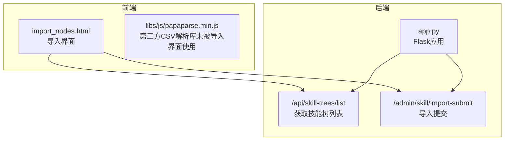
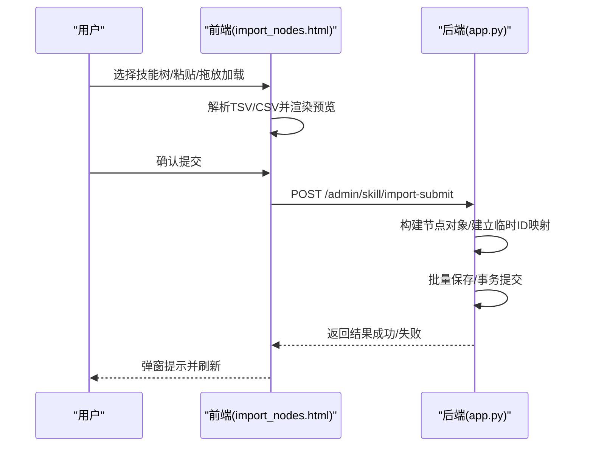
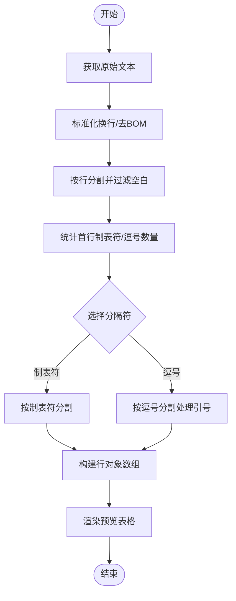
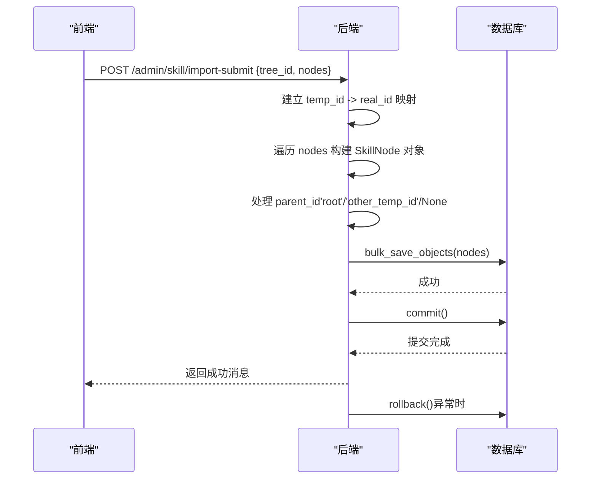
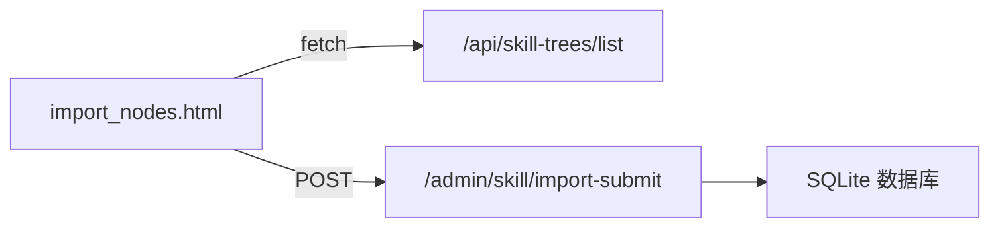

# 数据导入界面

<cite>
**本文档引用的文件**
- [import_nodes.html](file://import_nodes.html)
- [app.py](file://app.py)
- [README.md](file://README.md)
</cite>

## 目录
1. [简介](#简介)
2. [项目结构](#项目结构)
3. [核心组件](#核心组件)
4. [架构总览](#架构总览)
5. [详细组件分析](#详细组件分析)
6. [依赖关系分析](#依赖关系分析)
7. [性能考虑](#性能考虑)
8. [故障排除指南](#故障排除指南)
9. [结论](#结论)
10. [附录](#附录)

## 简介
本文件面向“CSV数据导入界面”的实现进行深入技术文档化，重点覆盖 import_nodes.html 中的 CSV 文件处理与批量导入功能。文档将详细说明：
- 文件上传机制（粘贴/拖放/本地文件加载）
- 文件格式验证、大小限制与安全检查
- CSV 解析流程（字段映射、数据清洗、错误检测）
- 批量数据导入处理流程（预览、事务与回滚）
- 错误处理与异常提示策略
- 完整导入流程与用户操作指南
- 数据验证规则与业务逻辑实现

## 项目结构
本项目采用前后端分离的静态页面 + Flask 后端的架构。导入界面位于前端页面 import_nodes.html，后端提供技能树列表与导入提交接口。

**图表来源**
- [import_nodes.html:183-331](file://import_nodes.html#L183-L331)
- [app.py:183-188](file://app.py#L183-L188)
- [app.py:208-275](file://app.py#L208-L275)

**章节来源**
- [import_nodes.html:1-512](file://import_nodes.html#L1-L512)
- [app.py:1-2233](file://app.py#L1-L2233)
- [README.md:61-78](file://README.md#L61-L78)

## 核心组件
- 前端导入界面（import_nodes.html）
  - 技能树选择器：加载技能树列表
  - 粘贴区：支持从 Excel 粘贴或本地文件加载
  - 解析与预览：自动识别分隔符，渲染可编辑预览表
  - 提交入口：将预览数据提交到后端
- 后端导入服务（app.py）
  - 技能树列表接口：供前端选择目标技能树
  - 导入提交接口：接收前端数据，执行批量导入与事务控制

**章节来源**
- [import_nodes.html:126-227](file://import_nodes.html#L126-L227)
- [app.py:183-188](file://app.py#L183-L188)
- [app.py:208-275](file://app.py#L208-L275)

## 架构总览
导入流程由前端解析与后端导入两部分组成，整体交互如下：

**图表来源**
- [import_nodes.html:441-482](file://import_nodes.html#L441-L482)
- [app.py:208-275](file://app.py#L208-L275)

## 详细组件分析

### 前端解析与预览组件
- 文件上传与粘贴机制
  - 粘贴事件监听：在粘贴后异步触发解析
  - 本地文件加载：FileReader 读取 UTF-8 文本并填充粘贴区
  - 拖放上传：拖入文件后读取并解析
- 解析算法
  - 自动识别分隔符：统计首行制表符与逗号数量，优先使用制表符
  - 引号处理：支持带引号的字段，正确分割
  - 行过滤：去除空白行，保留表头与数据行
- 预览渲染
  - 将解析后的数据渲染为可编辑表格，支持新增行
  - 同步网格到内存数据，保证提交时使用最新数据

**图表来源**
- [import_nodes.html:238-287](file://import_nodes.html#L238-L287)
- [import_nodes.html:389-419](file://import_nodes.html#L389-L419)

**章节来源**
- [import_nodes.html:155-162](file://import_nodes.html#L155-L162)
- [import_nodes.html:339-371](file://import_nodes.html#L339-L371)
- [import_nodes.html:238-287](file://import_nodes.html#L238-L287)
- [import_nodes.html:389-419](file://import_nodes.html#L389-L419)

### 后端导入组件
- 技能树列表接口
  - GET /api/skill-trees/list：返回技能树列表供前端选择
- 导入提交接口
  - POST /admin/skill/import-submit：接收前端传入的 tree_id 与 nodes
  - 临时ID映射：将 CSV 内部 temp_id 映射为真实 UUID
  - 父子关系处理：支持 parent_temp_id 为 'root' 或其他 temp_id
  - 字段映射：将 CSV 字段映射到 SkillNode 模型字段
  - 事务控制：批量保存后统一提交，异常时回滚

**图表来源**
- [app.py:208-275](file://app.py#L208-L275)

**章节来源**
- [app.py:183-188](file://app.py#L183-L188)
- [app.py:208-275](file://app.py#L208-L275)

### 数据模型与字段映射
- SkillNode 字段映射（来自 CSV 字段）
  - temp_id -> node_id（通过映射生成）
  - parent_temp_id -> parent_id（'root'/'other_temp_id'/None）
  - topic/direction/expanded/status/background_color/foreground_color/description/link/link2/level/module/sort_index -> 对应模型字段
- 业务规则
  - expanded 字段转换为布尔值
  - level/sort_index 转换为整数，缺失时使用默认值
  - 父节点为 'root' 时，parent_id 存储字符串 "root"

**章节来源**
- [app.py:249-266](file://app.py#L249-L266)

### 错误处理与异常提示
- 前端
  - 解析失败：提示“未能解析出数据：请确认已包含表头且至少一行数据”
  - 未选择技能树：提示“请先在左侧选择目标技能树！”
  - 无数据：提示“请先粘贴表格并点击「解析并预览」，或加载文本文件”
  - 网络错误：提示“网络错误，提交失败”
- 后端
  - 事务异常：捕获异常并回滚，返回错误信息

**章节来源**
- [import_nodes.html:289-305](file://import_nodes.html#L289-L305)
- [import_nodes.html:441-482](file://import_nodes.html#L441-L482)
- [app.py:272-274](file://app.py#L272-L274)

## 依赖关系分析
- 前端依赖
  - 未引入第三方 CSV 解析库（papaparse），自行实现解析逻辑
  - 依赖浏览器 FileReader API 实现本地文件读取
- 后端依赖
  - Flask、SQLAlchemy、Flask-CORS
  - 数据库：SQLite（skill_tree.db）

**图表来源**
- [import_nodes.html:312-331](file://import_nodes.html#L312-L331)
- [import_nodes.html:462-479](file://import_nodes.html#L462-L479)
- [app.py:183-188](file://app.py#L183-L188)
- [app.py:208-275](file://app.py#L208-L275)

**章节来源**
- [import_nodes.html:1-512](file://import_nodes.html#L1-L512)
- [app.py:1-2233](file://app.py#L1-L2233)

## 性能考虑
- 前端解析
  - 自行实现解析，避免引入额外库，减少体积与依赖
  - 对于超大文件，建议分批粘贴或拆分文件，避免一次性解析过多行导致卡顿
- 后端导入
  - 使用 bulk_save_objects 批量插入，减少多次往返
  - 事务统一提交，异常回滚，保证一致性
- 建议
  - 前端预览表格支持虚拟滚动（如需处理大量行）
  - 后端可增加分页/分批提交（当前实现为一次性提交）

[本节为通用性能建议，不直接分析具体文件]

## 故障排除指南
- 无法解析数据
  - 确认粘贴区包含表头与至少一行数据
  - 确认 Excel 复制区域包含完整表头与数据
  - 若使用本地文件，确保编码为 UTF-8
- 未选择技能树
  - 在左侧下拉框选择目标技能树后再提交
- 提交失败
  - 检查网络连接
  - 查看后端日志，确认数据库连接与权限
- 导入结果异常
  - 检查 CSV 字段是否与模板一致
  - 确认 parent_temp_id 值是否正确（'root' 或其他 temp_id）

**章节来源**
- [import_nodes.html:289-305](file://import_nodes.html#L289-L305)
- [import_nodes.html:441-482](file://import_nodes.html#L441-L482)
- [app.py:272-274](file://app.py#L272-L274)

## 结论
本导入界面通过“前端解析 + 后端导入”的方式，实现了从 Excel 粘贴或本地文件加载 CSV 数据，并在前端进行预览与校验，最终提交到后端执行批量导入。其特点包括：
- 无需第三方 CSV 解析库，简化部署
- 自动识别分隔符与引号处理，提升兼容性
- 前端可编辑预览，便于用户在提交前修正数据
- 后端使用事务控制，保证数据一致性

[本节为总结性内容，不直接分析具体文件]

## 附录

### 完整导入流程与用户操作指南
- 步骤
  1) 选择目标技能树
  2) 从 Excel 复制含表头的区域，粘贴到粘贴区或加载本地 UTF-8 文本文件
  3) 点击“解析并预览”，查看预览表并可编辑
  4) 确认无误后点击“确认提交并入库”
- 注意事项
  - 表头必须与模板一致
  - 父节点可设置为 'root' 或其他 temp_id
  - 如需模板，可点击“下载 CSV 模板”

**章节来源**
- [import_nodes.html:108-118](file://import_nodes.html#L108-L118)
- [import_nodes.html:167-174](file://import_nodes.html#L167-L174)
- [import_nodes.html:189-227](file://import_nodes.html#L189-L227)
- [import_nodes.html:484-506](file://import_nodes.html#L484-L506)

### 数据验证规则与业务逻辑
- 必填字段
  - topic：节点标题不能为空
- 类型转换
  - expanded：字符串转布尔值
  - level/sort_index：字符串转整数，默认值为 1/0
- 父子关系
  - parent_temp_id 为 'root' 时，parent_id 存储 "root"
  - parent_temp_id 为其他 temp_id 时，使用映射后的 UUID
  - 其他情况 parent_id 为 None
- 唯一性
  - 节点 ID 由映射生成，避免重复

**章节来源**
- [app.py:214-266](file://app.py#L214-L266)
- [app.py:618-678](file://app.py#L618-L678)