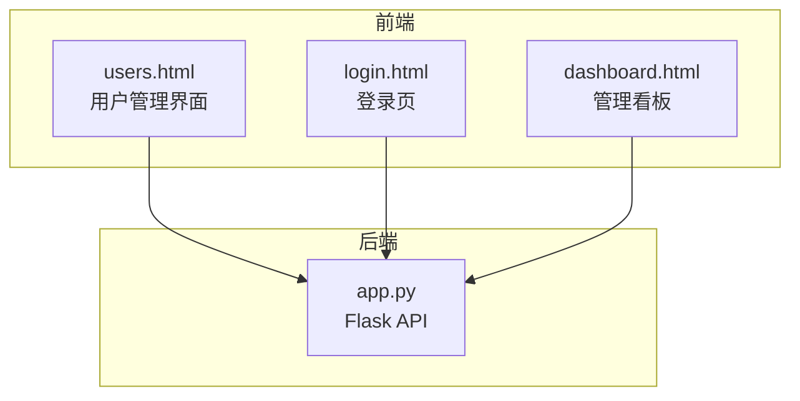
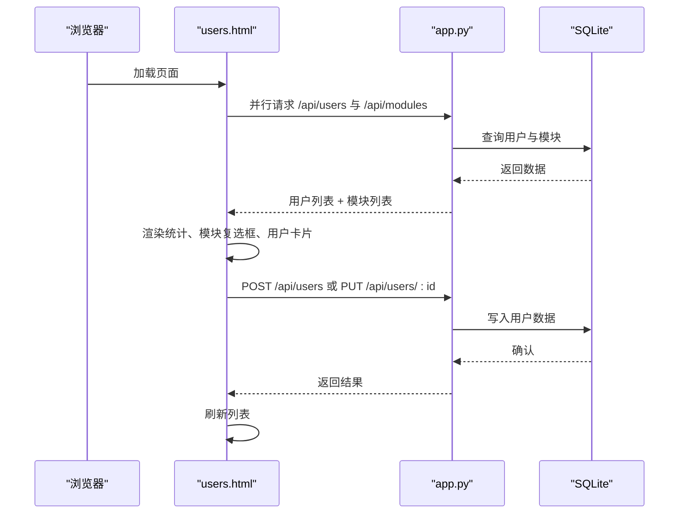
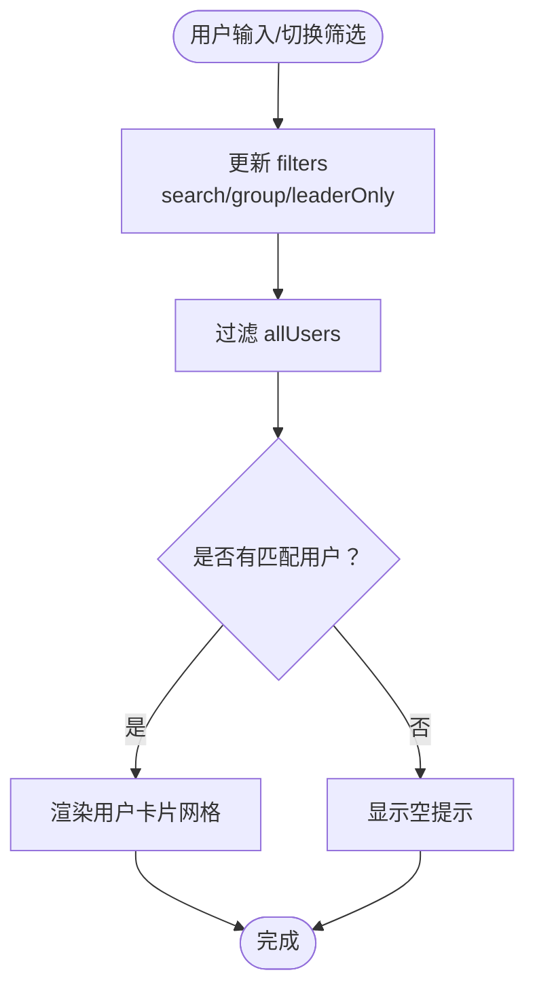
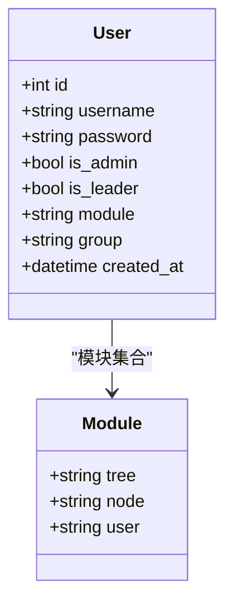
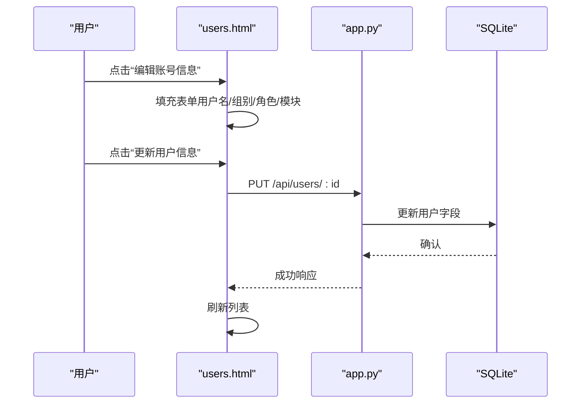
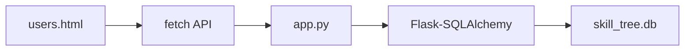

# 用户管理界面

<cite>
**本文档引用的文件**
- [users.html](file://users.html)
- [app.py](file://app.py)
- [login.html](file://login.html)
- [dashboard.html](file://dashboard.html)
- [README.md](file://README.md)
- [requirements.txt](file://requirements.txt)
</cite>

## 目录
1. [简介](#简介)
2. [项目结构](#项目结构)
3. [核心组件](#核心组件)
4. [架构总览](#架构总览)
5. [详细组件分析](#详细组件分析)
6. [依赖关系分析](#依赖关系分析)
7. [性能考量](#性能考量)
8. [故障排查指南](#故障排查指南)
9. [结论](#结论)
10. [附录](#附录)

## 简介
本文件面向“用户管理界面”的实现，围绕 users.html 中的用户权限分配与状态控制功能进行深入解析。内容涵盖：
- 用户列表管理：搜索、筛选、排序与批量操作
- 权限分配机制：角色设置、权限矩阵与访问控制
- 用户状态管理：激活状态、登录记录与活动监控
- 用户信息编辑：基本信息修改、密码重置与安全设置
- 与后端 API 的交互流程与数据同步机制
- 权限验证与访问控制的实现细节
- 最佳实践与安全建议

## 项目结构
用户管理界面位于前端静态页面 users.html，配合后端 Flask 应用 app.py 提供的用户与模块相关 API。登录与导航由 login.html 与 dashboard.html 协同完成。

**图示来源**
- [users.html](file://users.html)
- [login.html](file://login.html)
- [dashboard.html](file://dashboard.html)
- [app.py](file://app.py)

**章节来源**
- [users.html](file://users.html)
- [app.py](file://app.py)
- [login.html](file://login.html)
- [dashboard.html](file://dashboard.html)

## 核心组件
- 用户管理界面（users.html）
  - 侧边栏表单：创建/编辑用户，设置角色（管理员/组长）、所属组别、模块权限
  - 主体列表视图：统计卡片、搜索框、分组筛选、是否仅显示组长筛选、用户卡片列表
  - 数据加载与渲染：并行加载用户列表与模块列表，合并去重后渲染模块复选框
  - 编辑流程：填充表单、勾选模块、提交更新或创建
- 后端 API（app.py）
  - 用户相关接口：创建用户、获取用户列表、更新用户
  - 模块列表接口：聚合技能树、节点、用户三类模块，去重排序
  - 登录接口：校验用户名与密码，返回用户角色与权限信息
- 登录与导航（login.html、dashboard.html）
  - 登录页负责认证与本地存储用户信息
  - 看板页提供导航入口，含用户管理入口

**章节来源**
- [users.html](file://users.html)
- [app.py](file://app.py)
- [login.html](file://login.html)
- [dashboard.html](file://dashboard.html)

## 架构总览
用户管理界面采用前后端分离架构：前端 users.html 通过 fetch API 与后端 app.py 通信，实现用户数据的增删改查与权限控制。

**图示来源**
- [users.html](file://users.html)
- [app.py](file://app.py)

**章节来源**
- [users.html](file://users.html)
- [app.py](file://app.py)

## 详细组件分析

### 用户列表管理
- 搜索与筛选
  - 搜索框实时监听输入，触发 handleSearch()，更新 filters.search 并重新渲染列表
  - 分组筛选：支持 A/B/C/D/Office 组别，点击切换 active 状态并刷新
  - 组长筛选：切换开关，仅显示 is_leader=true 的用户
- 排序与渲染
  - 渲染函数 renderUserList() 对 allUsers 进行过滤：匹配用户名、组别、是否仅组长
  - 用户卡片包含：用户名、组别徽章、ID、角色徽章（管理员/组长）、模块标签、编辑按钮
- 批量操作
  - 当前实现聚焦于单用户编辑与创建，未见批量删除或批量权限变更的前端逻辑

**图示来源**
- [users.html](file://users.html)

**章节来源**
- [users.html](file://users.html)

### 权限分配机制
- 角色设置
  - 管理员（is_admin）：拥有最高权限，可访问用户管理界面
  - 组长（is_leader）：在特定场景下具备任务分配与审核能力（与技能树模块相关）
- 权限矩阵
  - 用户角色与模块的组合决定其可见与操作范围
  - 模块列表来源于技能树、节点与用户三类数据的去重合并
- 访问控制
  - 页面加载时读取本地存储的 currentUser，若非管理员则跳转到只读页面
  - 登录成功后将用户信息写入 localStorage，供后续页面使用

**图示来源**
- [app.py](file://app.py)
- [users.html](file://users.html)

**章节来源**
- [users.html](file://users.html)
- [app.py](file://app.py)

### 用户状态管理
- 激活状态
  - 用户卡片展示管理员与组长徽章，反映当前角色状态
  - 模块标签展示用户已分配的模块集合
- 登录记录与活动监控
  - 登录页 login.html 会在成功后将用户信息写入 localStorage
  - 后端提供节点点击历史与编辑历史接口，可用于追踪用户活动（适用于技能树模块）
- 活动监控扩展
  - 当前用户管理界面未直接展示登录记录，可在后续扩展中接入登录历史接口

**章节来源**
- [login.html](file://login.html)
- [app.py](file://app.py)
- [users.html](file://users.html)

### 用户信息编辑功能
- 基本信息修改
  - 表单字段：用户名、所属组别（A/B/C/D/Office）、角色（管理员/组长）、模块（多选）
  - 编辑流程：点击卡片“编辑账号信息”后，填充表单并勾选模块，提交后刷新列表
- 密码重置
  - 表单允许留空以不修改密码；提交时后端对 password 字段进行条件更新
- 安全设置
  - 登录认证通过后将用户信息写入 localStorage，前端据此进行访问控制
  - 建议在生产环境启用 HTTPS、CSRF 保护与更严格的密码策略

**图示来源**
- [users.html](file://users.html)
- [app.py](file://app.py)

**章节来源**
- [users.html](file://users.html)
- [app.py](file://app.py)

### 与后端 API 的交互流程与数据同步
- 数据加载
  - 并行请求 /api/users 与 /api/modules，合并模块列表后渲染模块复选框
- 用户创建/更新
  - POST /api/users：创建新用户
  - PUT /api/users/:id：更新现有用户
- 模块列表
  - GET /api/modules：聚合技能树、节点、用户模块，去重排序
- 登录与权限
  - POST /api/login：校验凭据并返回用户角色信息
  - 页面加载时读取 localStorage 中的 currentUser，非管理员禁止访问用户管理

**章节来源**
- [users.html](file://users.html)
- [app.py](file://app.py)
- [login.html](file://login.html)

## 依赖关系分析
- 前端依赖
  - 浏览器 fetch API：用于与后端通信
  - 本地存储：localStorage 用于保存登录状态与用户信息
- 后端依赖
  - Flask：提供 REST API
  - Flask-CORS：允许跨域请求
  - Flask-SQLAlchemy：ORM 操作 SQLite 数据库
- 数据库模型
  - User：用户表，包含角色与模块字段
  - SkillTree/SkillNode/UserSkillTreeState：技能树相关模型（与模块权限相关）

**图示来源**
- [users.html](file://users.html)
- [app.py](file://app.py)
- [requirements.txt](file://requirements.txt)

**章节来源**
- [app.py](file://app.py)
- [requirements.txt](file://requirements.txt)

## 性能考量
- 并行加载：前端对用户与模块列表采用 Promise.all 并行请求，减少首屏等待时间
- 前端过滤：列表渲染时在内存中进行过滤与渲染，适合中小规模用户数据
- 建议优化
  - 大数据量时可引入服务端分页与搜索
  - 对模块列表进行缓存，避免重复请求
  - 对用户卡片渲染采用虚拟滚动（如需）

[本节为通用指导，无需特定文件引用]

## 故障排查指南
- 无权限访问
  - 现象：访问用户管理页面被重定向或提示无权限
  - 原因：localStorage 中缺少 currentUser 或 is_admin=false
  - 处理：重新登录并确保账户具有管理员角色
- 创建/更新失败
  - 现象：提交后弹出失败提示
  - 原因：用户名重复、必填字段缺失、后端异常
  - 处理：检查用户名唯一性、必填项、后端日志
- 模块未显示
  - 现象：模块复选框为空或缺失
  - 原因：/api/modules 返回为空或去重后为空
  - 处理：确认技能树、节点、用户模块数据是否存在

**章节来源**
- [users.html](file://users.html)
- [app.py](file://app.py)
- [login.html](file://login.html)

## 结论
用户管理界面通过简洁直观的 UI 实现了用户权限分配与状态控制的核心功能。前端采用并行加载与本地存储保障体验，后端提供稳定的用户与模块 API。建议在生产环境中加强安全措施（HTTPS、CSRF、密码策略），并考虑引入服务端分页与模块缓存以提升性能与稳定性。

[本节为总结性内容，无需特定文件引用]

## 附录

### API 定义概览
- 获取用户列表
  - 方法：GET
  - 路径：/api/users
  - 返回：用户数组（含 id、username、is_admin、is_leader、module、group、created_at）
- 创建用户
  - 方法：POST
  - 路径：/api/users
  - 请求体：username、password、is_admin、is_leader、module、group
  - 返回：创建结果
- 更新用户
  - 方法：PUT
  - 路径：/api/users/:id
  - 请求体：username、password、is_admin、is_leader、module、group
  - 返回：更新结果
- 获取模块列表
  - 方法：GET
  - 路径：/api/modules
  - 返回：tree、node、user 三类模块集合的去重排序结果
- 用户登录
  - 方法：POST
  - 路径：/api/login
  - 请求体：username、password
  - 返回：用户角色与权限信息

**章节来源**
- [app.py](file://app.py)
- [README.md](file://README.md)