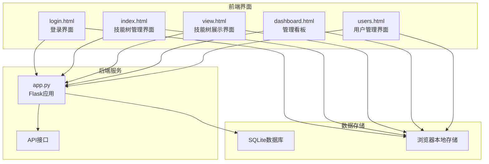
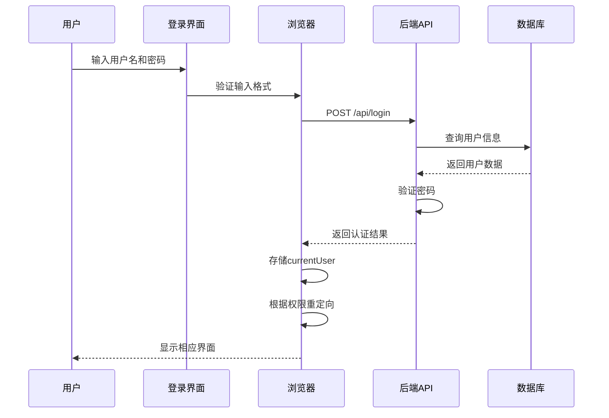
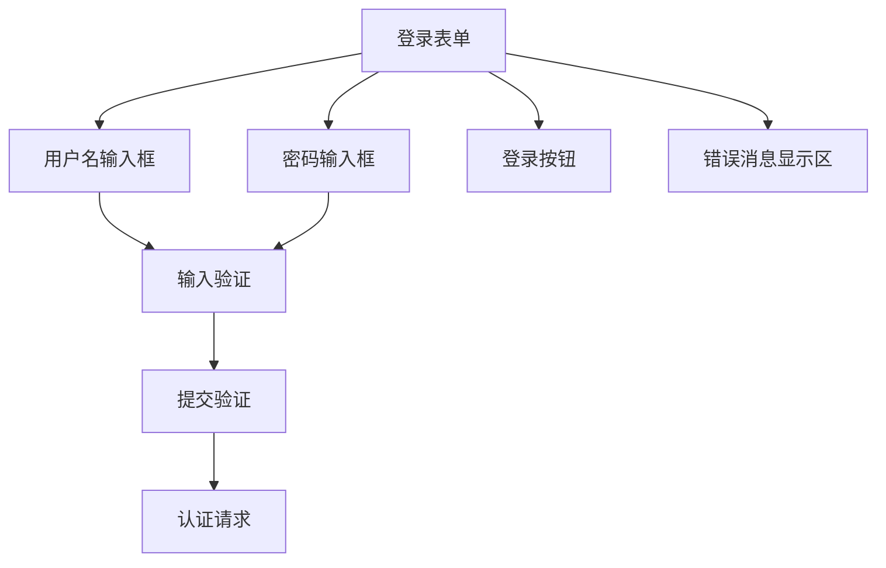
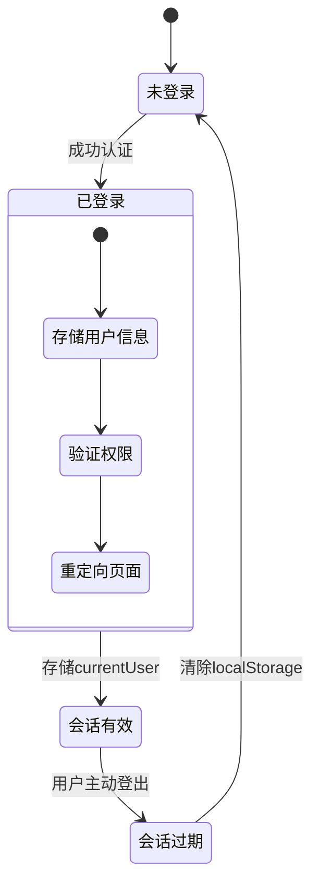
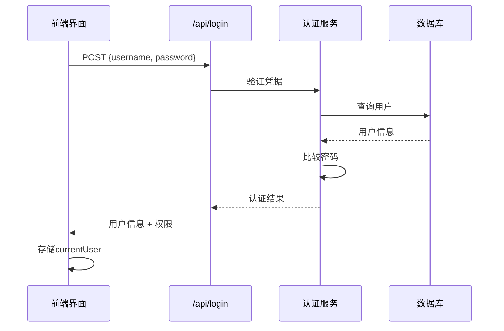
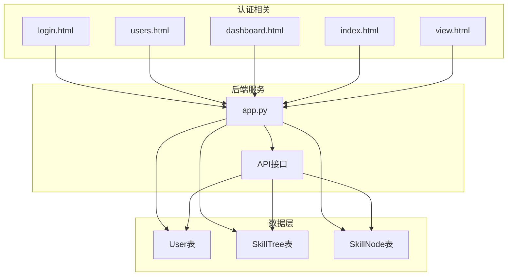

# 登录认证界面

<cite>
**本文档引用的文件**
- [login.html](file://login.html)
- [app.py](file://app.py)
- [dashboard.html](file://dashboard.html)
- [users.html](file://users.html)
- [index.html](file://index.html)
- [view.html](file://view.html)
</cite>

## 目录
1. [简介](#简介)
2. [项目结构](#项目结构)
3. [核心组件](#核心组件)
4. [架构概览](#架构概览)
5. [详细组件分析](#详细组件分析)
6. [依赖关系分析](#依赖关系分析)
7. [性能考虑](#性能考虑)
8. [故障排除指南](#故障排除指南)
9. [结论](#结论)

## 简介

技能树管理系统是一个基于Web的技能树管理工具，采用前后端分离架构。本文档专注于登录认证界面的详细实现，包括用户认证系统、会话管理、权限检查机制以及与后端API的交互流程。

该系统提供了完整的用户身份验证功能，支持管理员、组长和普通用户的分级权限管理，实现了基于本地存储的会话持久化机制。

## 项目结构

项目采用Flask框架构建后端API，前端使用纯HTML+CSS+JavaScript实现。主要文件组织如下：



**图表来源**
- [login.html:1-221](file://login.html#L1-L221)
- [app.py:1-800](file://app.py#L1-L800)

**章节来源**
- [login.html:1-221](file://login.html#L1-L221)
- [app.py:1-800](file://app.py#L1-L800)

## 核心组件

### 登录界面组件

登录界面采用了现代化的设计风格，具有以下核心组件：

- **表单区域**: 包含用户名和密码输入框
- **错误消息显示区**: 用于显示登录错误信息
- **登录按钮**: 触发登录认证流程
- **键盘事件监听**: 支持回车键快速登录

### 会话管理组件

系统使用浏览器的localStorage进行会话状态管理：

- **currentUser存储**: 存储用户基本信息和权限标识
- **自动重定向**: 根据用户权限自动跳转到相应页面
- **权限验证**: 页面加载时进行权限检查

### 权限控制系统

系统实现了三级权限模型：

- **管理员权限**: 完全访问权限
- **组长权限**: 有限管理权限
- **普通用户权限**: 只能查看和操作自己的技能树

**章节来源**
- [login.html:136-220](file://login.html#L136-L220)
- [users.html:587-604](file://users.html#L587-L604)

## 架构概览

系统采用前后端分离架构，登录认证流程如下：



**图表来源**
- [login.html:168-210](file://login.html#L168-L210)
- [app.py:356-382](file://app.py#L356-L382)

## 详细组件分析

### 登录表单设计与验证

#### 表单元素结构

登录界面包含以下关键元素：



**图表来源**
- [login.html:137-149](file://login.html#L137-L149)

#### 输入验证逻辑

系统实现了多层次的输入验证：

1. **必填字段检查**: 确保用户名不为空
2. **格式验证**: 密码字段的格式检查
3. **实时反馈**: 错误信息的即时显示

#### 错误处理机制

系统提供了完善的错误处理：

- **用户名为空**: 提示"请输入用户名"
- **网络错误**: 显示网络连接问题
- **认证失败**: 显示具体的认证错误信息

**章节来源**
- [login.html:168-210](file://login.html#L168-L210)

### 会话管理机制

#### 本地存储策略

系统使用localStorage进行会话状态管理：



**图表来源**
- [login.html:155-166](file://login.html#L155-L166)
- [login.html:187-195](file://login.html#L187-L195)

#### 自动重定向逻辑

根据用户权限和登录来源自动重定向：

- **管理员**: 重定向到主管理界面
- **普通用户**: 重定向到技能树展示界面
- **带重定向参数**: 按原始请求重定向

**章节来源**
- [login.html:155-203](file://login.html#L155-L203)

### 权限检查机制

#### 前端权限验证

每个受保护页面都包含权限检查逻辑：

```mermaid
flowchart TD
PageLoad[页面加载] --> CheckAuth[检查认证状态]
CheckAuth --> HasAuth{有认证信息?}
HasAuth --> |否| RedirectLogin[重定向到登录页]
HasAuth --> |是| CheckRole[检查用户角色]
CheckRole --> RoleAccess{角色权限?}
RoleAccess --> |管理员| AllowAccess[允许访问]
RoleAccess --> |组长| AllowAccess
RoleAccess --> |普通用户| CheckPageType[检查页面类型]
CheckPageType --> |用户页面| AllowAccess
CheckPageType --> |管理页面| DenyAccess[拒绝访问]
RedirectLogin --> [*]
AllowAccess --> [*]
DenyAccess --> [*]
```

**图表来源**
- [users.html:587-599](file://users.html#L587-L599)
- [index.html:1085-1095](file://index.html#L1085-L1095)

#### 后端权限控制

后端API同样实施严格的权限控制：

- **管理员路由**: 仅管理员可访问
- **用户路由**: 所有认证用户可访问
- **权限继承**: 用户权限基于角色和模块分配

**章节来源**
- [users.html:587-599](file://users.html#L587-L599)
- [index.html:1085-1095](file://index.html#L1085-L1095)

### 与后端API的交互

#### 认证流程

系统通过RESTful API与后端通信：



**图表来源**
- [app.py:356-382](file://app.py#L356-L382)

#### 请求头设置

系统在API调用中正确设置请求头：

- **Content-Type**: application/json
- **字符编码**: UTF-8
- **数据格式**: JSON序列化

**章节来源**
- [login.html:178-183](file://login.html#L178-L183)
- [app.py:356-382](file://app.py#L356-L382)

### 安全防护措施

#### 前端安全措施

- **输入验证**: 客户端输入格式验证
- **错误处理**: 友好的错误提示，不泄露敏感信息
- **会话管理**: 本地存储的安全使用

#### 后端安全措施

- **密码验证**: 用户名和密码的双重验证
- **权限控制**: 基于角色的访问控制
- **数据完整性**: 用户信息的完整性和一致性

**章节来源**
- [app.py:356-382](file://app.py#L356-L382)

## 依赖关系分析

系统各组件之间的依赖关系如下：



**图表来源**
- [login.html:1-221](file://login.html#L1-L221)
- [app.py:25-40](file://app.py#L25-L40)

**章节来源**
- [login.html:1-221](file://login.html#L1-L221)
- [app.py:25-40](file://app.py#L25-L40)

## 性能考虑

### 前端性能优化

- **懒加载**: 仅在需要时加载相关脚本
- **缓存策略**: 利用浏览器缓存减少重复请求
- **事件委托**: 减少事件处理器数量

### 后端性能优化

- **数据库索引**: 为常用查询字段建立索引
- **查询优化**: 避免N+1查询问题
- **连接池**: 管理数据库连接资源

## 故障排除指南

### 常见登录问题

#### 登录失败

**症状**: 登录后立即被重定向到登录页

**可能原因**:
- 用户名或密码错误
- 网络连接问题
- 服务器认证服务异常

**解决方法**:
1. 检查用户名和密码是否正确
2. 确认网络连接正常
3. 查看浏览器开发者工具的网络请求

#### 权限不足

**症状**: 访问管理页面时被拒绝

**可能原因**:
- 用户不是管理员或组长
- 会话过期
- 权限配置错误

**解决方法**:
1. 确认用户角色权限
2. 重新登录获取新会话
3. 检查用户权限配置

#### 页面加载错误

**症状**: 页面无法正常加载

**可能原因**:
- JavaScript执行错误
- API请求失败
- 本地存储损坏

**解决方法**:
1. 清除浏览器缓存
2. 检查浏览器控制台错误
3. 清除localStorage中的currentUser

**章节来源**
- [login.html:204-209](file://login.html#L204-L209)
- [users.html:593-595](file://users.html#L593-L595)

## 结论

技能树管理系统的登录认证界面实现了完整的用户身份验证和权限管理功能。系统采用前后端分离架构，通过localStorage实现会话持久化，支持三级权限模型，提供了良好的用户体验和安全性保障。

主要特点包括：
- **简洁直观的登录界面**: 现代化的UI设计，支持键盘快捷键
- **完善的权限控制**: 基于角色的细粒度权限管理
- **安全可靠的认证**: 前后端双重验证机制
- **良好的用户体验**: 自动重定向和错误提示

系统为后续的功能扩展奠定了坚实的基础，可以根据需要进一步增强安全性和功能性。