# 管理员界面

<cite>
**本文档引用的文件**
- [index.html](file://index.html)
- [app.py](file://app.py)
- [libs/js/jsmind.js](file://libs/js/jsmind.js)
- [libs/js/jsmind.draggable-node.js](file://libs/js/jsmind.draggable-node.js)
- [libs/js/papaparse.min.js](file://libs/js/papaparse.min.js)
- [login.html](file://login.html)
- [users.html](file://users.html)
- [dashboard.html](file://dashboard.html)
</cite>

## 目录
1. [简介](#简介)
2. [项目结构](#项目结构)
3. [核心组件](#核心组件)
4. [架构概览](#架构概览)
5. [详细组件分析](#详细组件分析)
6. [依赖分析](#依赖分析)
7. [性能考虑](#性能考虑)
8. [故障排除指南](#故障排除指南)
9. [结论](#结论)

## 简介

管理员界面是技能树管理系统的核心管理平台，基于Flask后端和jsMind前端思维导图引擎构建。该系统提供了完整的技能树管理功能，包括技能树的创建、编辑、删除，节点属性管理，颜色主题设置，拖拽操作，以及侧边栏管理等功能。

系统采用现代化的设计语言，使用统一的板岩色调配色方案，提供流畅的用户体验。管理员可以通过直观的界面进行技能树的可视化编辑，支持多种编辑模式和丰富的交互功能。

## 项目结构

项目采用前后端分离的架构设计，主要文件组织如下：

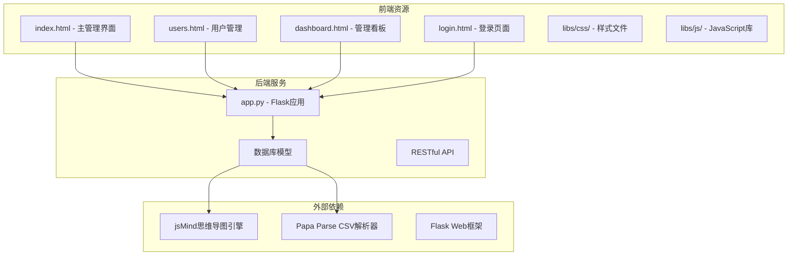

**图表来源**
- [index.html:1-100](file://index.html#L1-L100)
- [app.py:1-50](file://app.py#L1-L50)

**章节来源**
- [index.html:1-200](file://index.html#L1-L200)
- [app.py:1-50](file://app.py#L1-L50)

## 核心组件

管理员界面由多个核心组件构成，每个组件负责特定的功能领域：

### 1. 思维导图引擎集成
系统集成了jsMind思维导图引擎，提供强大的节点管理和可视化功能。支持节点的创建、编辑、删除，以及复杂的布局算法。

### 2. 技能树管理模块
提供完整的技能树生命周期管理，包括创建、加载、保存、删除等操作。支持多模块技能树的分类管理。

### 3. 节点编辑器
提供丰富的节点属性编辑功能，包括文本编辑、颜色主题设置、链接配置、等级标识等。

### 4. 侧边栏管理
包含技能树列表管理、搜索过滤、状态显示等功能，提供便捷的技能树导航。

### 5. 工具栏系统
提供多种编辑工具按钮，支持节点的快速添加、删除、复制粘贴等操作。

**章节来源**
- [index.html:850-1060](file://index.html#L850-L1060)
- [app.py:42-122](file://app.py#L42-L122)

## 架构概览

系统采用三层架构设计，确保良好的可维护性和扩展性：

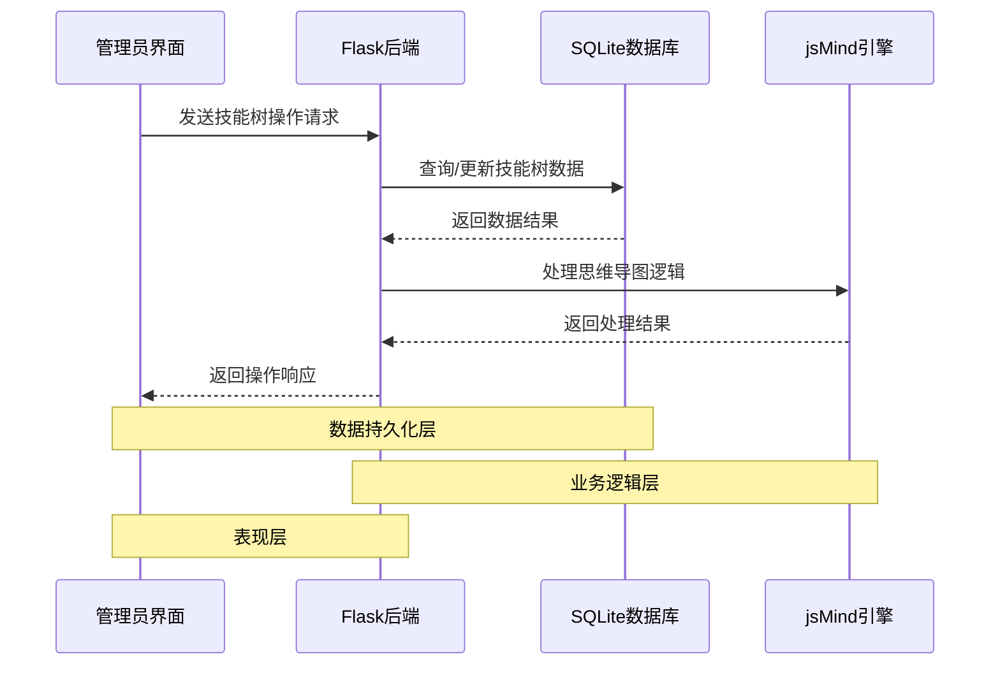

**图表来源**
- [app.py:385-561](file://app.py#L385-L561)
- [index.html:1166-1244](file://index.html#L1166-L1244)

系统架构特点：
- **前后端分离**：前端使用HTML5、CSS3、JavaScript，后端使用Python Flask
- **RESTful API**：标准化的HTTP接口设计
- **实时数据同步**：WebSocket支持（可扩展）
- **模块化设计**：功能模块独立，便于维护和测试

## 详细组件分析

### 思维导图引擎集成

#### jsMind核心功能
系统深度集成了jsMind思维导图引擎，提供以下核心功能：

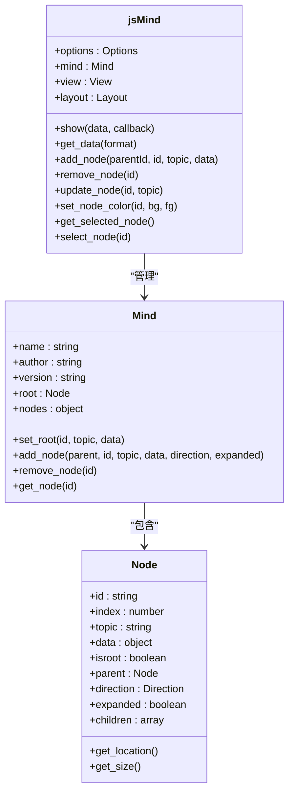

**图表来源**
- [libs/js/jsmind.js:181-216](file://libs/js/jsmind.js#L181-L216)
- [libs/js/jsmind.js:217-317](file://libs/js/jsmind.js#L217-L317)

#### 拖拽功能实现
系统实现了高级的节点拖拽功能，支持根节点的全局拖动和平面内的节点移动：

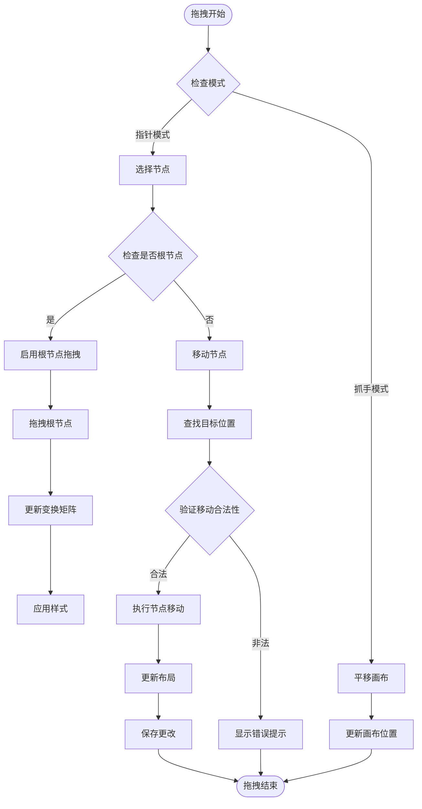

**图表来源**
- [index.html:2110-2290](file://index.html#L2110-L2290)
- [libs/js/jsmind.draggable-node.js:93-140](file://libs/js/jsmind.draggable-node.js#L93-L140)

#### 颜色主题系统
系统提供了完整的颜色主题管理功能，支持背景色和前景色的独立配置：

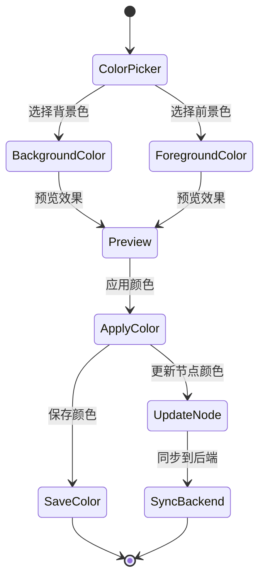

**图表来源**
- [index.html:1128-1164](file://index.html#L1128-L1164)
- [index.html:1828-1901](file://index.html#L1828-L1901)

**章节来源**
- [libs/js/jsmind.js:1-200](file://libs/js/jsmind.js#L1-L200)
- [libs/js/jsmind.draggable-node.js:1-100](file://libs/js/jsmind.draggable-node.js#L1-L100)

### 技能树管理功能

#### 技能树生命周期管理
系统提供了完整的技能树生命周期管理功能：

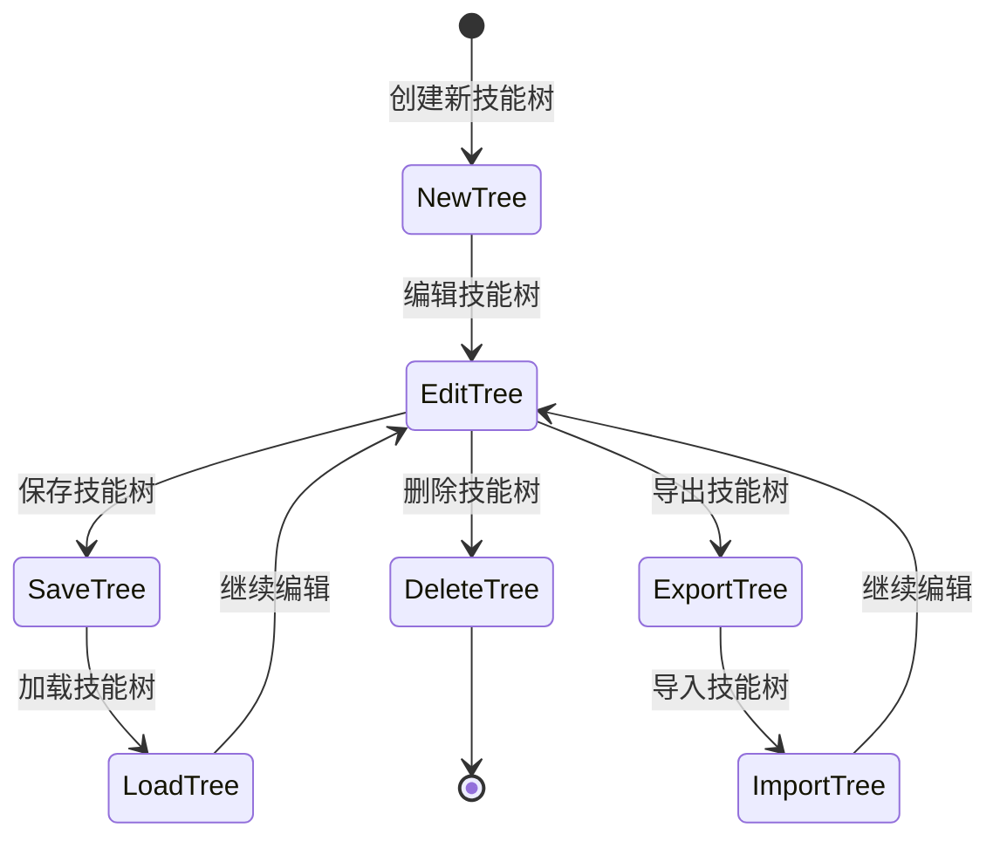

**图表来源**
- [index.html:1246-1276](file://index.html#L1246-L1276)
- [index.html:1278-1499](file://index.html#L1278-L1499)

#### 节点操作功能
系统支持丰富的节点操作功能：

| 操作类型 | 功能描述 | 快捷键 | 使用场景 |
|---------|----------|--------|----------|
| 添加子节点 | 在选中节点下添加子节点 | Insert | 扩展技能树结构 |
| 添加兄弟节点 | 在同级位置添加兄弟节点 | Enter | 平行技能扩展 |
| 编辑节点 | 直接编辑节点文本 | F2 | 快速修改节点内容 |
| 删除节点 | 删除选中节点及其子树 | Delete | 清理不需要的技能点 |
| 复制粘贴 | 复制节点结构并粘贴 | Ctrl+C/V | 快速复制技能结构 |

**章节来源**
- [index.html:1715-1780](file://index.html#L1715-L1780)
- [index.html:1782-1901](file://index.html#L1782-L1901)

### 侧边栏管理功能

#### 技能树列表管理
侧边栏提供了完整的技能树列表管理功能：

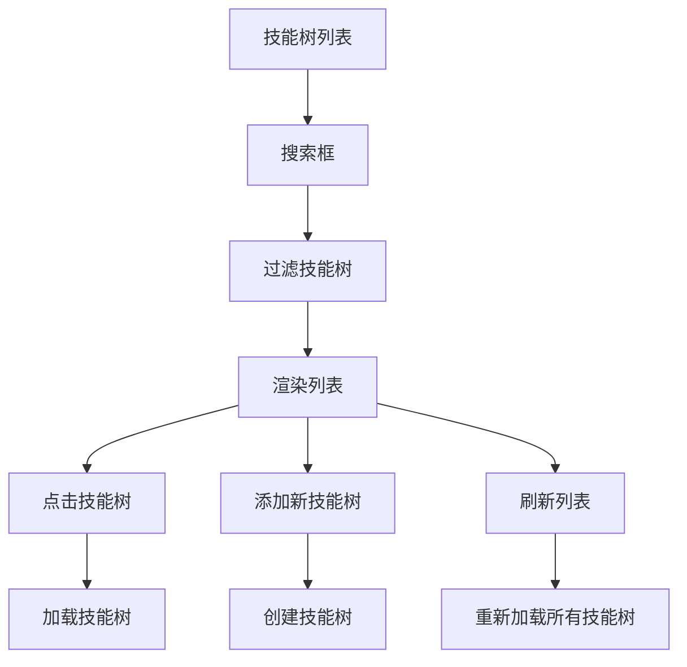

**图表来源**
- [index.html:1576-1588](file://index.html#L1576-L1588)
- [index.html:1501-1520](file://index.html#L1501-L1520)

#### 搜索和过滤机制
系统实现了智能的搜索和过滤功能：

| 过滤类型 | 搜索字段 | 过滤条件 | 实现方式 |
|---------|----------|----------|----------|
| 名称搜索 | 技能树名称 | 包含匹配 | 前端JavaScript正则表达式 |
| 模块过滤 | 所属模块 | 精确匹配 | 下拉框选择 |
| 作者过滤 | 创建作者 | 包含匹配 | 文本搜索 |
| 状态显示 | 激活状态 | 可视化标识 | 颜色编码 |

**章节来源**
- [index.html:1508-1520](file://index.html#L1508-L1520)
- [index.html:1522-1574](file://index.html#L1522-L1574)

### 工具栏按钮组

#### 编辑工具按钮
工具栏提供了多种编辑辅助功能：

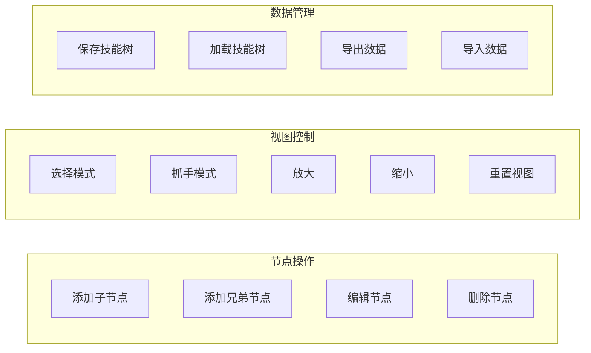

**图表来源**
- [index.html:924-934](file://index.html#L924-L934)
- [index.html:2294-2330](file://index.html#L2294-L2330)

#### 快捷键系统
系统支持完整的键盘快捷键操作：

| 快捷键 | 功能 | 说明 |
|--------|------|------|
| V | 选择模式 | 切换到节点选择模式 |
| H | 抓手模式 | 切换到画布平移模式 |
| Insert | 添加子节点 | 在选中节点下添加子节点 |
| Enter | 添加兄弟节点 | 在同级添加兄弟节点 |
| F2 | 编辑节点 | 直接编辑节点文本 |
| Delete | 删除节点 | 删除选中节点 |
| Ctrl+S | 保存技能树 | 保存当前技能树状态 |

**章节来源**
- [index.html:2378-2393](file://index.html#L2378-L2393)
- [index.html:924-934](file://index.html#L924-L934)

## 依赖分析

### 外部依赖关系

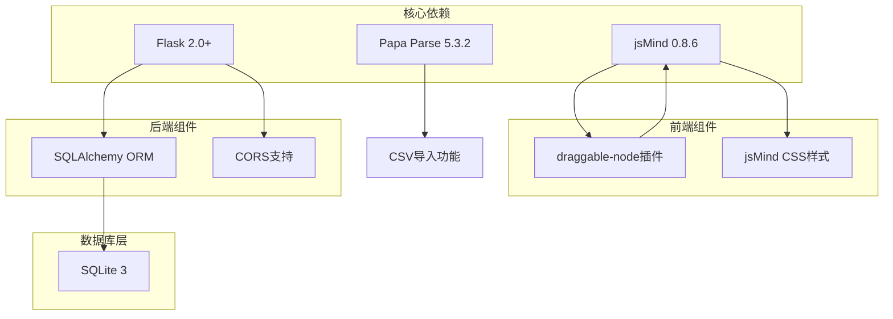

**图表来源**
- [libs/js/jsmind.js:1-15](file://libs/js/jsmind.js#L1-L15)
- [libs/js/papaparse.min.js:1-15](file://libs/js/papaparse.min.js#L1-L15)

### 内部模块依赖

系统采用模块化的内部架构，各模块之间保持松耦合：

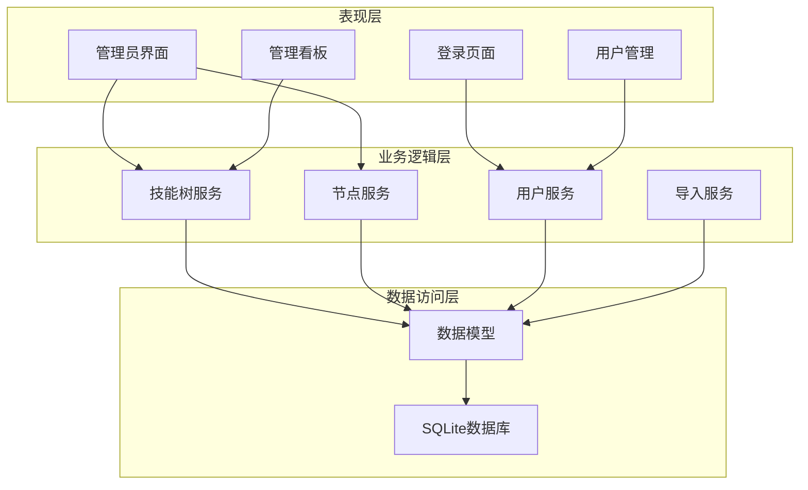

**图表来源**
- [app.py:25-122](file://app.py#L25-L122)
- [index.html:1061-1100](file://index.html#L1061-L1100)

**章节来源**
- [app.py:1-50](file://app.py#L1-L50)
- [libs/js/jsmind.js:1-20](file://libs/js/jsmind.js#L1-L20)

## 性能考虑

### 前端性能优化

系统在前端层面采用了多项性能优化策略：

1. **虚拟滚动**：对于大型技能树，使用虚拟滚动技术减少DOM节点数量
2. **懒加载**：节点数据按需加载，避免一次性渲染大量节点
3. **缓存机制**：技能树数据和用户偏好设置本地缓存
4. **事件节流**：拖拽和缩放操作使用防抖和节流优化

### 后端性能优化

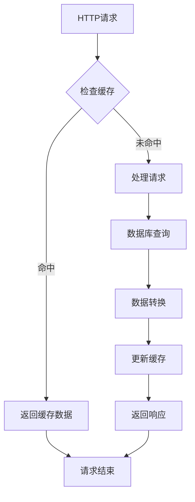

**图表来源**
- [app.py:385-453](file://app.py#L385-L453)

### 数据库优化策略

1. **索引优化**：为常用查询字段建立数据库索引
2. **连接池**：使用连接池管理数据库连接
3. **批量操作**：支持批量节点导入和更新
4. **事务管理**：确保数据一致性和完整性

## 故障排除指南

### 常见问题及解决方案

#### 登录认证问题
- **问题**：登录后无法访问管理员界面
- **原因**：用户权限不足或会话过期
- **解决**：检查用户角色设置，重新登录系统

#### 技能树加载失败
- **问题**：技能树无法加载或显示空白
- **原因**：数据库连接异常或数据损坏
- **解决**：检查数据库状态，重建技能树数据

#### 节点拖拽异常
- **问题**：节点无法拖拽或拖拽位置错误
- **原因**：浏览器兼容性问题或JavaScript错误
- **解决**：清除浏览器缓存，使用推荐浏览器

#### 颜色显示异常
- **问题**：节点颜色显示不正确
- **原因**：颜色数据格式错误或浏览器兼容性
- **解决**：检查颜色值格式，重新设置颜色

**章节来源**
- [login.html:168-210](file://login.html#L168-L210)
- [index.html:1710-1713](file://index.html#L1710-L1713)

### 调试工具和方法

系统提供了多种调试工具：

1. **浏览器开发者工具**：监控网络请求和JavaScript错误
2. **控制台日志**：详细的系统运行日志输出
3. **API测试工具**：Postman或curl命令测试RESTful接口
4. **数据库查看器**：SQLite Browser查看数据库状态

## 结论

管理员界面是一个功能完整、架构清晰的技能树管理系统。系统通过精心设计的前端界面和强大的后端服务，为管理员提供了高效、直观的技能树管理体验。

主要优势包括：
- **用户友好**：直观的思维导图界面，降低学习成本
- **功能全面**：涵盖技能树管理的所有核心功能
- **性能优秀**：优化的前端和后端实现，保证流畅体验
- **扩展性强**：模块化设计便于功能扩展和维护

未来可以考虑的功能增强：
- 支持更多导入导出格式
- 增强协作功能
- 添加更多可视化分析工具
- 支持移动端访问