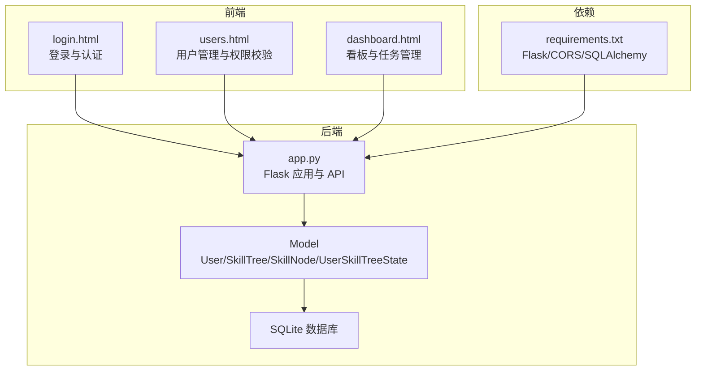
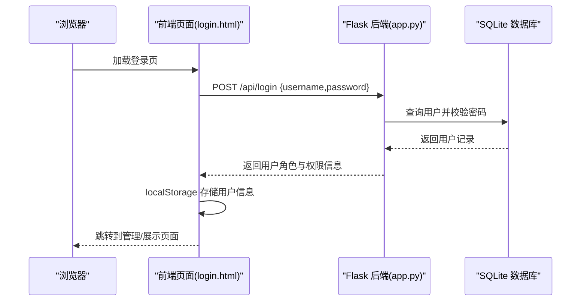
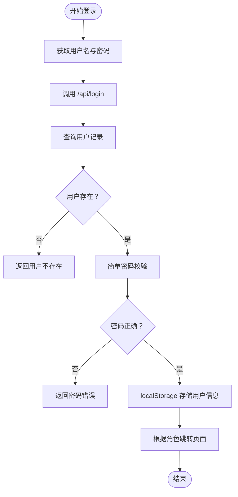
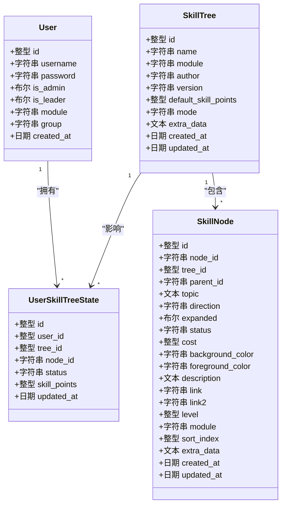
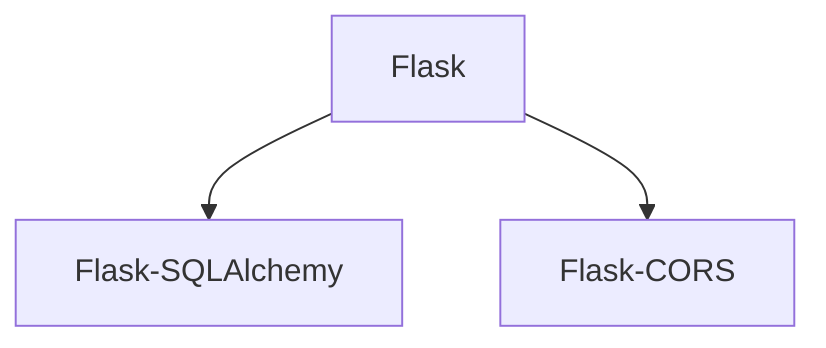

# 安全与权限控制

<cite>
**本文档引用的文件**
- [app.py](file://app.py)
- [login.html](file://login.html)
- [users.html](file://users.html)
- [dashboard.html](file://dashboard.html)
- [create_admin.py](file://create_admin.py)
- [requirements.txt](file://requirements.txt)
</cite>

## 目录
1. [简介](#简介)
2. [项目结构](#项目结构)
3. [核心组件](#核心组件)
4. [架构概览](#架构概览)
5. [详细组件分析](#详细组件分析)
6. [依赖分析](#依赖分析)
7. [性能考虑](#性能考虑)
8. [故障排除指南](#故障排除指南)
9. [结论](#结论)
10. [附录](#附录)

## 简介
本文件面向安全工程师与系统管理员，系统化梳理技能树管理系统的安全与权限控制设计与实现，重点覆盖以下方面：
- 用户认证机制：登录流程、密码处理现状与改进建议、会话管理策略
- 权限体系：管理员、组长与普通用户的权限差异与访问控制策略
- 数据安全：SQL 注入防护、XSS 攻击防范、CSRF 保护现状与改进建议
- 权限验证实现细节与最佳实践
- 安全配置建议与漏洞防护策略
- 敏感数据处理与隐私保护措施
- 安全审计与日志记录方案
- 常见安全威胁的预防与应对措施

## 项目结构
系统采用前后端分离架构，后端基于 Flask 提供 REST API，前端通过静态 HTML 页面与本地存储进行交互。核心文件与职责如下：
- 后端入口与路由：app.py（Flask 应用、模型定义、API 路由）
- 前端页面：
  - 登录页：login.html（负责用户认证与本地会话存储）
  - 用户管理页：users.html（管理员/组长权限校验与用户管理功能）
  - 管理看板：dashboard.html（数据可视化与任务管理入口）
- 安全辅助：create_admin.py（快速创建管理员账户）
- 依赖声明：requirements.txt（Flask、Flask-SQLAlchemy、Flask-CORS）

**图示来源**
- [app.py:1-2233](file://app.py#L1-L2233)
- [login.html:1-221](file://login.html#L1-L221)
- [users.html:1-809](file://users.html#L1-L809)
- [dashboard.html:1-1407](file://dashboard.html#L1-L1407)
- [requirements.txt:1-4](file://requirements.txt#L1-L4)

**章节来源**
- [app.py:1-2233](file://app.py#L1-L2233)
- [login.html:1-221](file://login.html#L1-L221)
- [users.html:1-809](file://users.html#L1-L809)
- [dashboard.html:1-1407](file://dashboard.html#L1-L1407)
- [requirements.txt:1-4](file://requirements.txt#L1-L4)

## 核心组件
- 用户模型与权限字段：用户具备管理员（is_admin）、组长（is_leader）、模块范围（module）、组别（group）等字段，用于细粒度权限控制与模块隔离。
- 登录接口：/api/login 接收用户名与密码，进行简单相等比较后返回用户角色信息。
- 权限校验：多处 API 对管理员、组长与普通用户进行差异化校验，如技能树激活、任务分配、重置等。
- 会话管理：前端使用 localStorage 存储用户信息，未实现服务端会话与令牌机制。
- 数据持久化：使用 SQLite 与 SQLAlchemy，涉及批量导入、节点更新、历史记录等。

**章节来源**
- [app.py:25-39](file://app.py#L25-L39)
- [app.py:355-382](file://app.py#L355-L382)
- [app.py:776-901](file://app.py#L776-L901)
- [app.py:1843-1895](file://app.py#L1843-L1895)

## 架构概览
系统采用轻量级前后端分离架构，前端通过 fetch API 调用后端 REST 接口，后端通过 SQLAlchemy 访问 SQLite 数据库。跨域通过 Flask-CORS 允许。

**图示来源**
- [login.html:151-210](file://login.html#L151-L210)
- [app.py:355-382](file://app.py#L355-L382)

**章节来源**
- [app.py:5-22](file://app.py#L5-L22)
- [login.html:151-210](file://login.html#L151-L210)

## 详细组件分析

### 认证与会话管理
- 登录流程
  - 前端收集用户名与密码，调用 /api/login。
  - 后端查询用户并进行简单密码比较，返回用户角色与模块信息。
  - 前端将用户信息写入 localStorage，并根据角色跳转到不同页面。
- 会话与权限
  - 会话状态完全依赖 localStorage，未实现服务端会话、Cookie 或 JWT。
  - 页面加载时，前端读取 localStorage 并进行基础权限校验（如用户管理页要求管理员）。
- 密码处理现状
  - 用户密码以明文形式存储与比较，存在严重安全隐患，应立即改为安全哈希与盐值存储。

**图示来源**
- [login.html:168-210](file://login.html#L168-L210)
- [app.py:355-382](file://app.py#L355-L382)

**章节来源**
- [login.html:151-210](file://login.html#L151-L210)
- [app.py:355-382](file://app.py#L355-L382)

### 权限体系与访问控制
- 角色定义
  - 管理员（is_admin）：最高权限，可执行重置技能树、全局操作等。
  - 组长（is_leader）：可对本组成员进行任务分配与审核，范围受 group 限制。
  - 普通用户：仅能查看与申请激活节点，需经管理员/组长审核。
- 模块与组别
  - module 字段用于模块范围隔离，树级 module 与用户 module 交集决定可见性与可操作性。
  - group 字段用于组内任务分配与审核范围限制。
- 关键权限校验点
  - 技能树激活：非管理员需满足模块交集与激活规则（树状/线性模式）。
  - 任务分配与审核：仅管理员或同组组长可操作。
  - 技能树重置：仅管理员可对全系统或特定用户执行。
  - 用户管理：仅管理员可访问与修改。

**图示来源**
- [app.py:25-121](file://app.py#L25-L121)

**章节来源**
- [app.py:25-39](file://app.py#L25-L39)
- [app.py:776-901](file://app.py#L776-L901)
- [app.py:1843-1895](file://app.py#L1843-L1895)
- [app.py:948-1052](file://app.py#L948-L1052)

### 数据安全与防护现状
- SQL 注入
  - 现状：使用 SQLAlchemy ORM 查询，未发现显式拼接 SQL 的代码，具备一定防护能力。
  - 建议：继续坚持 ORM 使用；若需复杂查询，优先使用 SQLAlchemy 原生表达式或参数化查询。
- XSS 攻击
  - 现状：前端未对用户输入进行严格过滤与转义，存在反射型 XSS 风险（如错误提示、URL 参数）。
  - 建议：对所有用户可控输出进行 HTML 转义；使用 CSP 头；对富文本输入进行白名单过滤。
- CSRF 保护
  - 现状：未实现 CSRF Token 机制，跨站请求风险较高。
  - 建议：引入 Flask-WTF 或自定义中间件，为敏感操作启用 CSRF Token。
- 传输安全
  - 现状：未强制 HTTPS，密码与会话信息在传输中易被窃听。
  - 建议：部署 HTTPS，配置 HSTS；对敏感字段进行加密存储。

**章节来源**
- [app.py:355-382](file://app.py#L355-L382)
- [login.html:126-133](file://login.html#L126-L133)

### 权限验证实现细节与最佳实践
- 前端权限校验
  - 用户管理页在加载时读取 localStorage 并校验 is_admin，非管理员直接拒绝访问。
  - 建议：将关键权限校验迁移到后端，前端仅负责 UI 控制。
- 后端权限校验
  - 技能树激活：校验用户模块与树模块交集，遵循树状/线性激活规则。
  - 任务分配与审核：校验操作者角色与组别一致性。
  - 技能树重置：仅管理员可执行。
- 最佳实践
  - 统一权限中间件：为关键路由添加装饰器，集中处理角色与模块校验。
  - 最小权限原则：仅授予完成任务所需的最小权限。
  - 审计日志：对高风险操作记录操作者、目标与上下文。

**章节来源**
- [users.html:587-599](file://users.html#L587-L599)
- [app.py:776-901](file://app.py#L776-L901)
- [app.py:1843-1895](file://app.py#L1843-L1895)
- [app.py:948-1052](file://app.py#L948-L1052)

### 敏感数据处理与隐私保护
- 密码处理
  - 现状：明文存储与比较，存在极高风险。
  - 建议：使用强哈希算法（如 bcrypt）与盐值存储；禁止明文日志。
- 会话与令牌
  - 现状：localStorage 无安全保护，易受 XSS 与会话劫持影响。
  - 建议：采用 HttpOnly Cookie + SameSite + Secure 属性；引入短期令牌与刷新机制。
- 数据最小化
  - 仅收集与功能必要的数据；对历史记录与审计日志进行脱敏处理。

**章节来源**
- [app.py:31](file://app.py#L31)
- [create_admin.py:16-24](file://create_admin.py#L16-L24)

### 安全审计与日志记录
- 现有审计
  - 节点编辑历史：记录变更详情与操作者。
  - 节点点击统计：记录点击次数与最近点击。
  - 全局统计：提供热门树、节点与激活统计。
- 建议增强
  - 引入统一审计日志表，记录操作时间、用户、IP、UA、路由、参数摘要与结果。
  - 对敏感操作（重置、删除、权限变更）增加二次确认与审批流程。
  - 日志分级与留存策略：区分操作日志与安全事件日志。

**章节来源**
- [app.py:124-1546](file://app.py#L124-L1546)

## 依赖分析
系统依赖简洁，主要为 Web 框架与数据库访问层：
- Flask：Web 框架
- Flask-SQLAlchemy：ORM 与数据库抽象
- Flask-CORS：跨域支持

**图示来源**
- [requirements.txt:1-4](file://requirements.txt#L1-L4)

**章节来源**
- [requirements.txt:1-4](file://requirements.txt#L1-L4)

## 性能考虑
- 数据库查询优化：对常用查询建立索引（如用户模块、树模块、节点树索引），减少交集计算开销。
- 前端缓存：对静态资源与用户信息进行合理缓存，降低重复请求。
- API 批量操作：批量导入与更新时使用 flush/commit 策略，避免长时间锁表。

## 故障排除指南
- 登录失败
  - 检查用户名是否存在与密码是否匹配；确认前端错误提示是否显示。
  - 若为管理员账户，可通过 create_admin.py 快速创建。
- 权限不足
  - 确认用户角色与模块范围；检查树级 module 与用户 module 的交集。
  - 组长仅能对本组成员进行任务分配与审核。
- 数据异常
  - 检查批量导入流程与历史记录；核对节点 ID 与父子关系。
  - 对于重置操作，确认操作者权限与目标用户范围。

**章节来源**
- [create_admin.py:7-25](file://create_admin.py#L7-L25)
- [app.py:776-901](file://app.py#L776-L901)
- [app.py:1843-1895](file://app.py#L1843-L1895)

## 结论
当前系统在权限控制层面具备基本的模块与角色划分，但在认证与会话安全、XSS 与 CSRF 防护、密码存储等方面存在明显短板。建议优先完成密码安全加固、引入 CSRF 保护与 HTTPS、完善审计日志与权限中间件，以形成闭环的安全体系。

## 附录

### 安全配置建议清单
- 强制 HTTPS 与 HSTS
- 密码安全：bcrypt + 盐值；禁止明文存储
- 会话安全：HttpOnly + SameSite + Secure Cookie；短期令牌
- CSRF 保护：Token 校验；同源策略强化
- XSS 防护：HTML 转义；CSP；富文本白名单
- 审计与监控：统一审计日志；异常告警
- 最小权限：RBAC 精细化授权；操作审批

### 常见威胁与应对
- 强口令暴力破解：限制登录尝试频率、验证码、二次验证
- 会话劫持：短生命周期、随机令牌、安全传输
- 权限提升：严格的 RBAC 与审计；最小权限原则
- 数据泄露：字段级加密、访问控制、日志脱敏