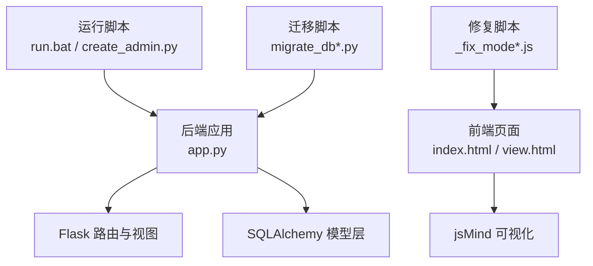
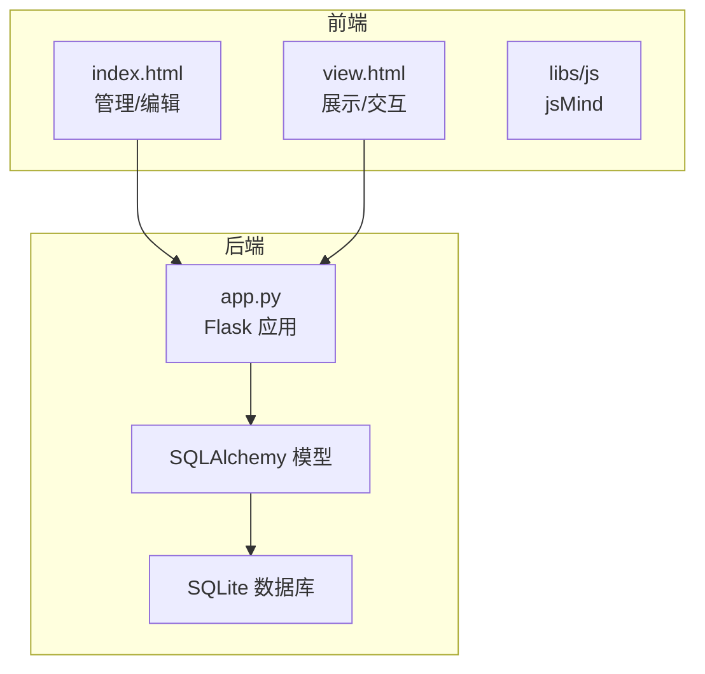
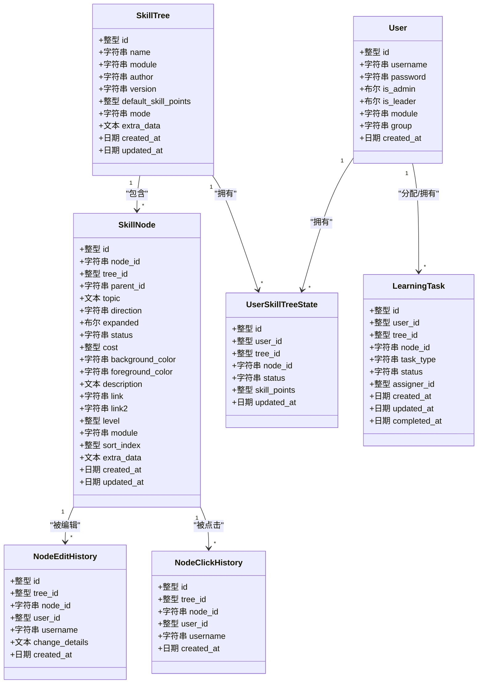
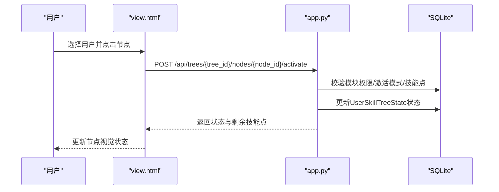
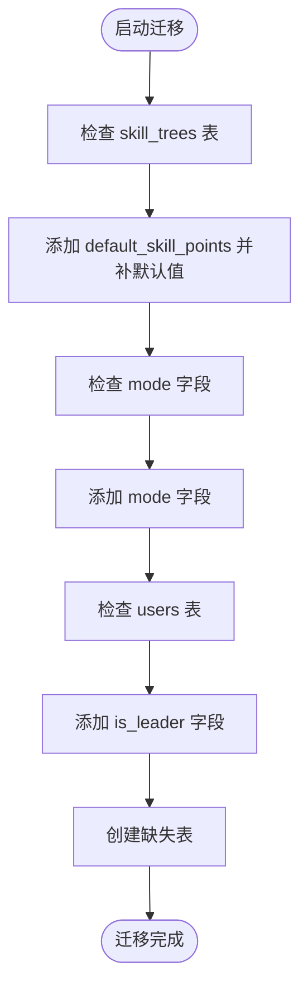
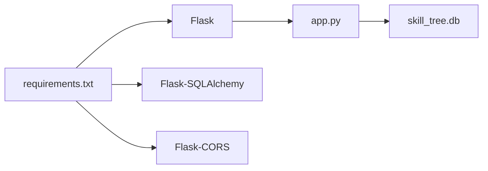

# 开发者指南

<cite>
**本文引用的文件**
- [README.md](file://README.md)
- [app.py](file://app.py)
- [requirements.txt](file://requirements.txt)
- [run.bat](file://run.bat)
- [create_admin.py](file://create_admin.py)
- [index.html](file://index.html)
- [view.html](file://view.html)
- [_fix_mode.js](file://_fix_mode.js)
- [_fix_mode2.js](file://_fix_mode2.js)
- [_fix_mode3.js](file://_fix_mode3.js)
- [migrate_db.py](file://migrate_db.py)
- [migrate_db_v2.py](file://migrate_db_v2.py)
- [migrate_db_v3.py](file://migrate_db_v3.py)
</cite>

## 目录
1. [简介](#简介)
2. [项目结构](#项目结构)
3. [核心组件](#核心组件)
4. [架构总览](#架构总览)
5. [详细组件分析](#详细组件分析)
6. [依赖分析](#依赖分析)
7. [性能考虑](#性能考虑)
8. [故障排查指南](#故障排查指南)
9. [结论](#结论)
10. [附录](#附录)

## 简介
本指南面向技能树管理系统的开发者，提供从环境搭建、代码规范、模块组织、调试技巧到扩展开发与质量保障的全流程说明。系统基于 Flask + SQLAlchemy + SQLite，前端使用 jsMind，支持多用户、权限控制、节点状态与技能点系统、进阶路径与树状两种激活模式、节点导入导出、历史审计与仪表盘统计等能力。

## 项目结构
- 后端入口与API：app.py
- 前端页面：index.html（管理/编辑）、view.html（展示/交互）、login.html、users.html、dashboard.html、import_nodes.html、QuickNodeAdder.html
- 静态资源：libs/css、libs/js（jsmind、样式与字体）
- 运行与脚本：run.bat、create_admin.py、migrate_db*.py、_fix_mode*.js
- 文档与依赖：README.md、requirements.txt、.gitignore

图表来源
- [app.py:17-22](file://app.py#L17-L22)
- [index.html:1-120](file://index.html#L1-L120)
- [view.html:1-120](file://view.html#L1-L120)
- [run.bat:1-10](file://run.bat#L1-L10)
- [create_admin.py:1-30](file://create_admin.py#L1-L30)
- [migrate_db.py:1-41](file://migrate_db.py#L1-L41)
- [_fix_mode.js:1-36](file://_fix_mode.js#L1-L36)

章节来源
- [README.md:61-78](file://README.md#L61-L78)
- [requirements.txt:1-5](file://requirements.txt#L1-L5)

## 核心组件
- Flask 应用与路由：统一CORS、SQLite连接、静态文件服务、页面路由
- 数据模型：User、SkillTree、SkillNode、UserSkillTreeState、NodeEditHistory、NodeClickHistory、LearningTask
- API 体系：用户、技能树、节点、激活/取消、重置、导入、历史、统计、任务等
- 前端页面：管理页（index.html）与展示页（view.html），含交互模式切换修复脚本
- 运行与迁移：run.bat、create_admin.py、migrate_db*.py

章节来源
- [app.py:25-121](file://app.py#L25-L121)
- [app.py:385-561](file://app.py#L385-L561)
- [index.html:1-200](file://index.html#L1-L200)
- [view.html:1-200](file://view.html#L1-L200)

## 架构总览
系统采用前后端分离的单页应用模式：前端负责UI与交互，后端提供REST API与数据库持久化。权限与模块隔离通过用户角色与模块字段实现，激活模式支持树状自下而上与进阶路径两种规则。

图表来源
- [app.py:17-22](file://app.py#L17-L22)
- [index.html:7-8](file://index.html#L7-L8)
- [view.html:7-8](file://view.html#L7-L8)

## 详细组件分析

### 后端应用与路由（app.py）
- 应用初始化：CORS、数据库URI、静态目录
- 模型定义：用户、技能树、节点、状态、历史、任务等
- API 路由：
  - 用户：创建、查询、更新、登录
  - 技能树：列表、创建、查询、更新、删除、重置
  - 节点：新增、批量导入、更新、激活/取消、历史与点击统计
  - 模块与进度：模块列表、全局统计、个人进度
  - 任务：分配、撤销、我的任务、待审核
- 辅助函数：保存节点、构建jsMind数据、初始化用户状态、数据库迁移

图表来源
- [app.py:25-177](file://app.py#L25-L177)

章节来源
- [app.py:17-22](file://app.py#L17-L22)
- [app.py:25-177](file://app.py#L25-L177)
- [app.py:385-561](file://app.py#L385-L561)
- [app.py:777-901](file://app.py#L777-L901)
- [app.py:1055-1134](file://app.py#L1055-L1134)
- [app.py:1137-1378](file://app.py#L1137-L1378)
- [app.py:1711-1737](file://app.py#L1711-L1737)

### 前端页面与交互（index.html、view.html）
- 管理页（index.html）：技能树管理、节点编辑、颜色主题、导入导出、用户管理
- 展示页（view.html）：用户选择、只读展示、节点激活、技能点显示、交互模式切换
- 交互模式修复脚本：_fix_mode.js、_fix_mode2.js、_fix_mode3.js 用于修复交互模式与手型拖拽逻辑

图表来源
- [view.html:1-200](file://view.html#L1-L200)
- [app.py:777-901](file://app.py#L777-L901)

章节来源
- [index.html:1-200](file://index.html#L1-L200)
- [view.html:1-200](file://view.html#L1-L200)
- [_fix_mode.js:1-36](file://_fix_mode.js#L1-L36)
- [_fix_mode2.js:1-99](file://_fix_mode2.js#L1-L99)
- [_fix_mode3.js:1-12](file://_fix_mode3.js#L1-L12)

### 数据库与迁移（migrate_db*.py）
- migrate_db.py：为 skill_trees 添加 default_skill_points，创建缺失表
- migrate_db_v2.py：为 skill_trees 添加 mode 字段
- migrate_db_v3.py：为 users 添加 is_leader 字段并创建 learning_tasks 表

图表来源
- [migrate_db.py:8-36](file://migrate_db.py#L8-L36)
- [migrate_db_v2.py:6-31](file://migrate_db_v2.py#L6-L31)
- [migrate_db_v3.py:8-31](file://migrate_db_v3.py#L8-L31)

章节来源
- [migrate_db.py:1-41](file://migrate_db.py#L1-L41)
- [migrate_db_v2.py:1-34](file://migrate_db_v2.py#L1-L34)
- [migrate_db_v3.py:1-35](file://migrate_db_v3.py#L1-L35)

## 依赖分析
- Python 依赖：Flask、Flask-SQLAlchemy、Flask-CORS
- 前端依赖：jsMind（libs/js/jsmind.js、libs/js/jsmind.draggable-node.js）、样式与字体
- 运行方式：Windows 使用 run.bat，类Unix 使用 python app.py
- 管理员创建：create_admin.py

图表来源
- [requirements.txt:1-5](file://requirements.txt#L1-L5)
- [app.py:17-22](file://app.py#L17-L22)

章节来源
- [requirements.txt:1-5](file://requirements.txt#L1-L5)
- [run.bat:1-10](file://run.bat#L1-L10)
- [create_admin.py:1-30](file://create_admin.py#L1-L30)

## 性能考虑
- 数据库索引与唯一约束：节点表与状态表建立复合索引与唯一约束，减少重复与提升查询效率
- 递归保存与批量导入：save_nodes 递归保存，batch_add_nodes 批量导入并记录历史，注意事务与异常回滚
- 状态计算：build_jsmind_data 中对激活状态与进阶路径进行预聚合统计，降低前端渲染压力
- 跨域与静态资源：CORS 允许跨域，静态文件服务直接返回，减少中间层开销
- 建议
  - 对高频查询（模块、用户、树）建立索引
  - 批量导入时使用 flush/commit 合理拆分批次
  - 前端分页与懒加载，避免一次性渲染超大树

章节来源
- [app.py:101-121](file://app.py#L101-L121)
- [app.py:1078-1134](file://app.py#L1078-L1134)
- [app.py:1137-1378](file://app.py#L1137-L1378)

## 故障排查指南
- 启动与依赖
  - 依赖安装：pip install -r requirements.txt
  - Windows：双击 run.bat 或使用 python app.py
  - 端口占用：默认 5003，可在 app.py 中修改
- 跨域问题：确保 Flask-CORS 已安装并启用
- 数据库初始化：首次运行自动创建 skill_tree.db；若迁移失败，可删除数据库文件后重启
- 权限与模块
  - 非管理员仅能在自身模块内激活节点
  - 模块字段以逗号分隔，查询时需去空格匹配
- 激活规则
  - 树状模式：子节点全部激活后方可激活父节点
  - 进阶模式：同一模块前序等级全部完成后方可激活当前等级
- 历史与审计
  - 节点编辑历史与点击统计可用于问题定位
- 交互模式
  - 使用 _fix_mode*.js 修复交互模式与手型拖拽逻辑

章节来源
- [README.md:80-111](file://README.md#L80-L111)
- [README.md:298-304](file://README.md#L298-L304)
- [app.py:790-846](file://app.py#L790-L846)
- [app.py:1517-1546](file://app.py#L1517-L1546)
- [_fix_mode.js:1-36](file://_fix_mode.js#L1-L36)
- [_fix_mode2.js:1-99](file://_fix_mode2.js#L1-L99)
- [_fix_mode3.js:1-12](file://_fix_mode3.js#L1-L12)

## 结论
本系统通过清晰的前后端职责划分、完善的权限与模块隔离、灵活的激活模式与技能点系统，以及完善的审计与统计能力，形成了可扩展、易维护的技能树管理平台。建议在后续迭代中逐步引入节点图标/链接、搜索、模板、导出/导入等功能，并持续完善测试与监控体系。

## 附录

### 开发环境搭建
- 安装依赖：pip install -r requirements.txt
- 启动后端：Windows 使用 run.bat，类Unix 使用 python app.py
- 访问页面：管理页 http://localhost:5003/，展示页 http://localhost:5003/view.html
- 创建管理员：python create_admin.py

章节来源
- [README.md:80-111](file://README.md#L80-L111)
- [run.bat:1-10](file://run.bat#L1-L10)
- [create_admin.py:1-30](file://create_admin.py#L1-L30)

### 代码规范与开发约定
- 后端
  - 路由命名：统一使用 REST 风格，路径语义明确
  - 错误处理：显式返回错误码与消息，必要时记录日志
  - 数据校验：对用户输入进行基本校验与越权检查
  - 事务管理：批量操作使用 try/except/rollback
- 前端
  - 交互模式：通过脚本修复与键盘快捷键切换
  - 状态同步：与后端状态一致，避免前端缓存不一致
- 迁移与兼容
  - 通过 migrate_db*.py 保证数据库结构演进
  - 保持向后兼容，避免破坏既有数据

章节来源
- [app.py:280-302](file://app.py#L280-L302)
- [app.py:562-685](file://app.py#L562-L685)
- [app.py:1055-1134](file://app.py#L1055-L1134)
- [migrate_db.py:8-36](file://migrate_db.py#L8-L36)

### 扩展开发与最佳实践
- 新增字段
  - 在模型中添加字段并在迁移脚本中补齐
  - 保持默认值与兼容性
- 新增页面
  - 前端：遵循现有布局与样式变量
  - 后端：新增路由与权限校验
- 激活模式扩展
  - 在 SkillTree.mode 中新增枚举值，并在激活逻辑中处理
- 导入导出
  - 批量导入使用 CSV/JSON，记录导入历史
  - 导出时保留节点结构与状态

章节来源
- [app.py:688-709](file://app.py#L688-L709)
- [app.py:190-275](file://app.py#L190-L275)
- [app.py:1078-1134](file://app.py#L1078-L1134)

### 修复模式与补丁机制
- 交互模式修复：_fix_mode.js、_fix_mode2.js、_fix_mode3.js 修复交互模式切换与手型拖拽
- 补丁流程：定位问题 -> 编写修复脚本 -> 验证修复 -> 提交变更

章节来源
- [_fix_mode.js:1-36](file://_fix_mode.js#L1-L36)
- [_fix_mode2.js:1-99](file://_fix_mode2.js#L1-L99)
- [_fix_mode3.js:1-12](file://_fix_mode3.js#L1-L12)

### 新功能开发流程与测试策略
- 流程
  - 设计API与数据模型 -> 实现后端路由与业务逻辑 -> 前端集成与交互验证 -> 编写迁移脚本 -> 回归测试
- 测试
  - 单元测试：对关键函数（保存节点、构建状态、计算激活）编写断言
  - 集成测试：模拟用户登录、模块权限、激活模式、批量导入
  - 端到端：手动验证管理页与展示页的完整流程

章节来源
- [app.py:1078-1134](file://app.py#L1078-L1134)
- [app.py:1137-1378](file://app.py#L1137-L1378)

### 代码审查标准与质量保证
- 代码审查
  - 路由与权限：确保每条路由都有权限校验
  - 数据一致性：状态表与节点表的一致性与唯一性
  - 错误处理：异常捕获与回滚，返回明确错误信息
  - 注释与文档：关键逻辑补充注释，API 文档与 README 同步更新
- 质量保证
  - 静态检查：flake8/black（建议）
  - 自动化测试：pytest（建议）
  - 日志与监控：关键路径增加日志，生产部署加入健康检查

章节来源
- [app.py:777-901](file://app.py#L777-L901)
- [app.py:1517-1546](file://app.py#L1517-L1546)

### 贡献代码与版本控制规范
- 分支策略：主分支保护，功能开发在特性分支
- 提交信息：清晰描述变更目的与影响范围
- 合并与审查：至少一次审查通过后合并
- 发布与迁移：发布前执行数据库迁移脚本

章节来源
- [migrate_db.py:8-36](file://migrate_db.py#L8-L36)
- [migrate_db_v2.py:6-31](file://migrate_db_v2.py#L6-L31)
- [migrate_db_v3.py:8-31](file://migrate_db_v3.py#L8-L31)

### 开发工具与常用命令
- 启动后端：python app.py 或 run.bat
- 创建管理员：python create_admin.py
- 数据库迁移：python migrate_db.py / migrate_db_v2.py / migrate_db_v3.py
- 本地静态服务器：python -m http.server 8000（用于前端预览）

章节来源
- [run.bat:1-10](file://run.bat#L1-L10)
- [create_admin.py:1-30](file://create_admin.py#L1-L30)
- [migrate_db.py:1-41](file://migrate_db.py#L1-L41)
- [migrate_db_v2.py:1-34](file://migrate_db_v2.py#L1-L34)
- [migrate_db_v3.py:1-35](file://migrate_db_v3.py#L1-L35)
- [README.md:102-111](file://README.md#L102-L111)

### 性能分析与优化技巧
- SQL 分析：使用 SQLAlchemy 的查询日志定位慢查询
- 状态计算：在后端聚合统计，减少前端复杂计算
- 批处理：批量导入与更新使用 flush/commit 控制事务大小
- 缓存：对只读数据（模块列表、树列表）进行短期缓存
- 前端优化：分页与懒加载，避免一次性渲染超大树

章节来源
- [app.py:1137-1378](file://app.py#L1137-L1378)
- [app.py:1654-1652](file://app.py#L1654-L1652)