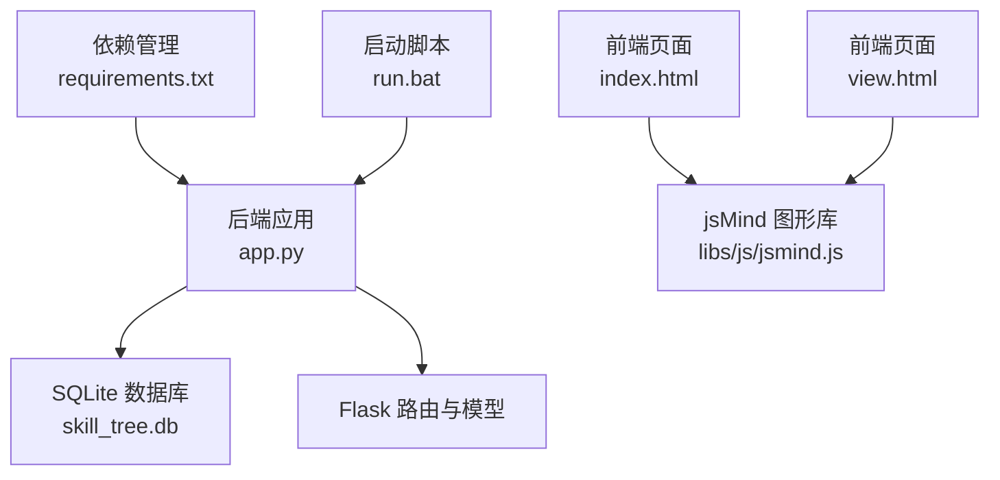
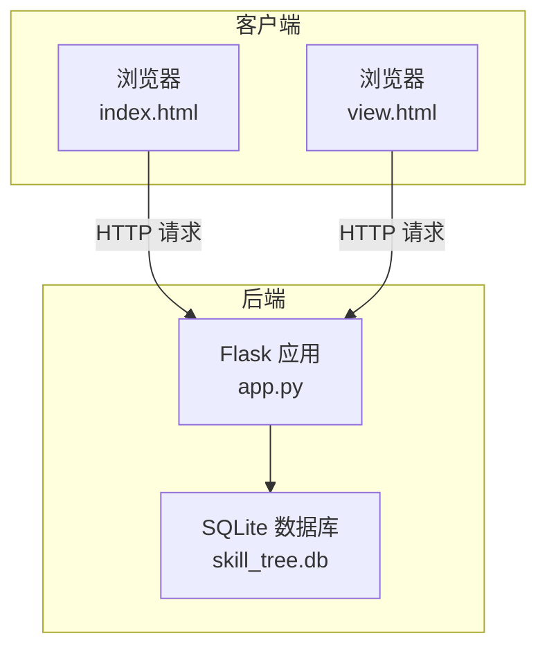
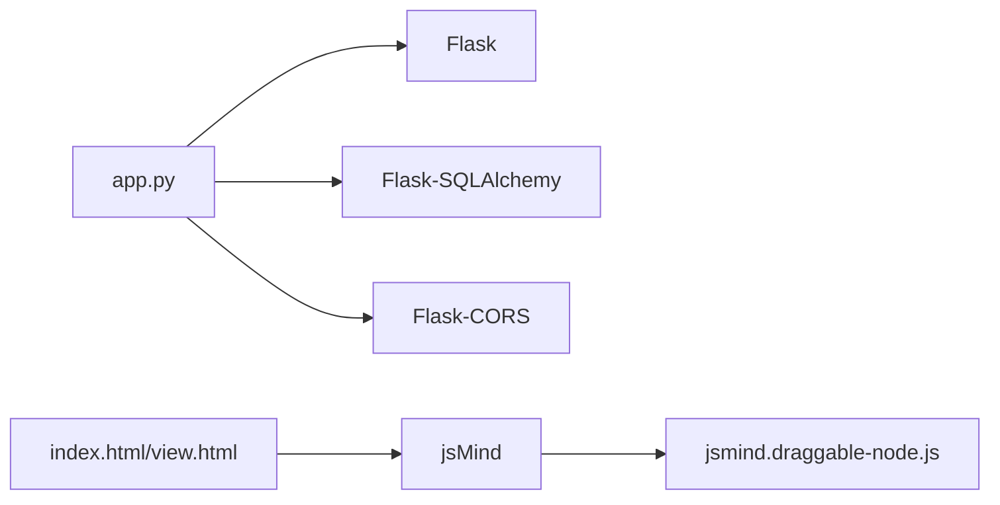

# 快速开始

<cite>
**本文引用的文件**
- [README.md](file://README.md)
- [requirements.txt](file://requirements.txt)
- [app.py](file://app.py)
- [run.bat](file://run.bat)
- [create_admin.py](file://create_admin.py)
- [migrate_db.py](file://migrate_db.py)
- [index.html](file://index.html)
- [view.html](file://view.html)
</cite>

## 目录
1. [简介](#简介)
2. [项目结构](#项目结构)
3. [核心组件](#核心组件)
4. [架构总览](#架构总览)
5. [详细组件分析](#详细组件分析)
6. [依赖分析](#依赖分析)
7. [性能考虑](#性能考虑)
8. [故障排除指南](#故障排除指南)
9. [结论](#结论)
10. [附录](#附录)

## 简介
本指南面向新手用户，帮助你在约30分钟内完成技能树管理系统的安装与首次运行。系统基于 Flask 提供后端 API，前端使用 jsMind 渲染技能树，支持多用户、节点状态持久化与技能点系统。你将学会：
- 环境准备与依赖安装
- 后端服务启动
- 创建管理员用户
- 启动前端页面并进行基本操作
- 常见问题排查与优化建议

## 项目结构
项目采用前后端分离的静态资源与后端 API 结构，核心文件如下：
- 后端入口与API：app.py
- 依赖声明：requirements.txt
- Windows 启动脚本：run.bat
- 管理员创建脚本：create_admin.py
- 数据库迁移脚本：migrate_db.py
- 前端页面：index.html（管理/编辑）、view.html（展示/激活）

图表来源
- [app.py:17-22](file://app.py#L17-L22)
- [requirements.txt:1-5](file://requirements.txt#L1-L5)
- [run.bat:1-10](file://run.bat#L1-L10)

章节来源
- [README.md:61-78](file://README.md#L61-L78)
- [requirements.txt:1-5](file://requirements.txt#L1-L5)
- [run.bat:1-10](file://run.bat#L1-L10)

## 核心组件
- 后端服务（Flask）
  - 提供 RESTful API，负责用户、技能树、节点与状态的增删改查
  - 默认监听地址：http://localhost:5000
- 数据库（SQLite）
  - 自动创建 skill_tree.db
  - 包含用户、技能树、节点、用户状态等表
- 前端页面
  - index.html：管理/编辑技能树
  - view.html：展示/激活节点（只读+可交互）
- 第三方库
  - jsMind（思维导图渲染）
  - jsmind.draggable-node.js（拖拽节点，部分功能依赖）

章节来源
- [README.md:80-112](file://README.md#L80-L112)
- [README.md:305-333](file://README.md#L305-L333)

## 架构总览
系统采用“前端静态页面 + 后端 Flask API + SQLite 数据库”的轻量架构。浏览器通过 HTTP 请求与后端交互，后端通过 SQLAlchemy 访问 SQLite 数据库。

图表来源
- [app.py:17-22](file://app.py#L17-L22)
- [README.md:100](file://README.md#L100)

## 详细组件分析

### 环境与依赖
- Python 版本
  - 建议使用 Python 3.10 或更高版本（以满足依赖兼容性）
- 必需依赖
  - Flask、Flask-SQLAlchemy、Flask-CORS
- 安装步骤
  - 在项目根目录执行：pip install -r requirements.txt

章节来源
- [README.md:82-86](file://README.md#L82-L86)
- [requirements.txt:1-5](file://requirements.txt#L1-L5)

### 启动后端服务
- Windows
  - 双击 run.bat，或在命令行执行：run.bat
- Linux/Mac
  - 在项目根目录执行：python app.py
- 服务地址
  - 默认 http://localhost:5000

章节来源
- [README.md:88-100](file://README.md#L88-L100)
- [run.bat:1-10](file://run.bat#L1-L10)

### 首次运行与管理员创建
- 方式一：使用管理页面创建用户（推荐新手）
  - 打开 index.html，进入“用户管理”，创建用户名、密码与角色
- 方式二：使用脚本创建管理员
  - 在项目根目录执行：python create_admin.py
  - 默认管理员：用户名 admin，密码 admin123

章节来源
- [README.md:217-230](file://README.md#L217-L230)
- [create_admin.py:1-30](file://create_admin.py#L1-L30)

### 启动前端页面
- 直接打开文件
  - 在浏览器中打开 index.html 或 view.html
- 使用本地静态服务器
  - Python 3：python -m http.server 8000
  - 浏览器访问：http://localhost:8000/index.html 或 view.html

章节来源
- [README.md:102-111](file://README.md#L102-L111)

### 基本功能测试（新手实操）
- 创建技能树
  - 在 index.html 中填写技能树名称与初始技能点，点击“新建技能树”
- 添加节点
  - 选择节点，点击“添加子节点/兄弟节点”，输入名称
- 编辑节点
  - 选中节点，在左侧编辑面板修改名称、颜色、技能点消耗
- 保存与加载
  - 点击“保存技能树”，随后可在列表中刷新并加载
- 展示与激活
  - 在 view.html 中选择用户与技能树，点击锁定节点尝试激活
  - 激活成功后节点点亮，状态保存到用户记录

章节来源
- [README.md:231-280](file://README.md#L231-L280)
- [index.html:1-200](file://index.html#L1-L200)
- [view.html:1-200](file://view.html#L1-L200)

### API 使用示例（可选）
以下为常用接口路径与用途（无需编码即可理解）：
- 获取技能树列表：GET /api/trees
- 创建技能树：POST /api/trees
- 获取指定技能树：GET /api/trees/{tree_id}
- 更新技能树：PUT /api/trees/{tree_id}
- 删除技能树：DELETE /api/trees/{tree_id}
- 更新节点：PUT /api/trees/{tree_id}/nodes/{node_id}
- 激活节点：POST /api/trees/{tree_id}/nodes/{node_id}/activate
- 取消激活：POST /api/trees/{tree_id}/nodes/{node_id}/deactivate
- 重置技能树：POST /api/trees/{tree_id}/reset
- 创建用户：POST /api/users
- 获取用户列表：GET /api/users
- 重置用户技能树：POST /api/users/{user_id}/trees/{tree_id}/reset

章节来源
- [README.md:113-213](file://README.md#L113-L213)

## 依赖分析
- 后端依赖
  - Flask：Web 框架
  - Flask-SQLAlchemy：ORM 与数据库访问
  - Flask-CORS：跨域支持
- 前端依赖
  - jsMind：思维导图渲染
  - jsmind.draggable-node.js：拖拽节点（部分功能依赖）

图表来源
- [requirements.txt:1-5](file://requirements.txt#L1-L5)
- [app.py:5-22](file://app.py#L5-L22)

章节来源
- [requirements.txt:1-5](file://requirements.txt#L1-L5)
- [README.md:292-296](file://README.md#L292-L296)

## 性能考虑
- SQLite 适合小规模数据与单机部署，若并发较高可考虑迁移到更强大的数据库
- 首次运行会自动创建数据库文件 skill_tree.db，无需手动初始化
- 节点数量较多时，建议合理分页或限制一次性加载的节点数

章节来源
- [README.md:300-304](file://README.md#L300-L304)

## 故障排除指南
- 依赖安装失败
  - 确认网络可访问 PyPI，必要时切换为国内镜像源
  - 若仍失败，清理缓存后重试
- 启动后端报错
  - 确认已执行 pip install -r requirements.txt
  - 确认端口 5000 未被占用
- 跨域问题
  - 确认已安装 Flask-CORS 并正确启用
- 数据库迁移失败
  - 可删除数据库文件后重启服务，系统会自动重建
  - 或使用 migrate_db.py 执行迁移脚本
- 前端无法加载
  - 确认 index.html/view.html 与 libs 目录在同一层级
  - 使用本地静态服务器访问，避免文件协议导致的限制

章节来源
- [README.md:300-304](file://README.md#L300-L304)
- [migrate_db.py:1-41](file://migrate_db.py#L1-L41)
- [run.bat:1-10](file://run.bat#L1-L10)

## 结论
按照本指南，你可以在30分钟内完成技能树管理系统的安装、启动与基础使用。建议先通过管理页面创建管理员，再在 index.html 中创建第一个技能树，最后在 view.html 中验证节点激活流程。如遇问题，优先检查依赖安装、端口占用与跨域设置。

## 附录

### 快速检查清单
- 已安装 Python 3.10+
- 已执行 pip install -r requirements.txt
- 已启动后端服务（http://localhost:5000）
- 已创建管理员用户
- 已通过本地服务器打开 index.html 或 view.html
- 已成功创建并激活至少一个节点

### 常用命令速查
- 安装依赖：pip install -r requirements.txt
- 启动后端（Windows）：run.bat
- 启动后端（Linux/Mac）：python app.py
- 创建管理员：python create_admin.py
- 本地静态服务器：python -m http.server 8000