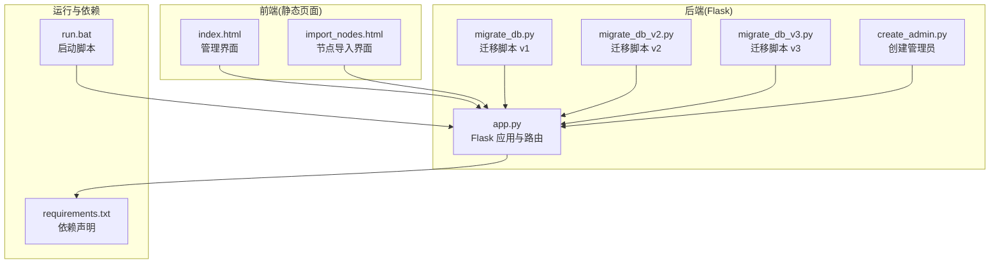
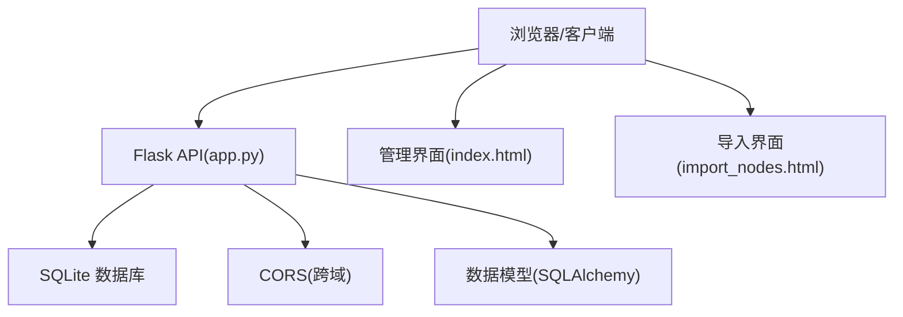
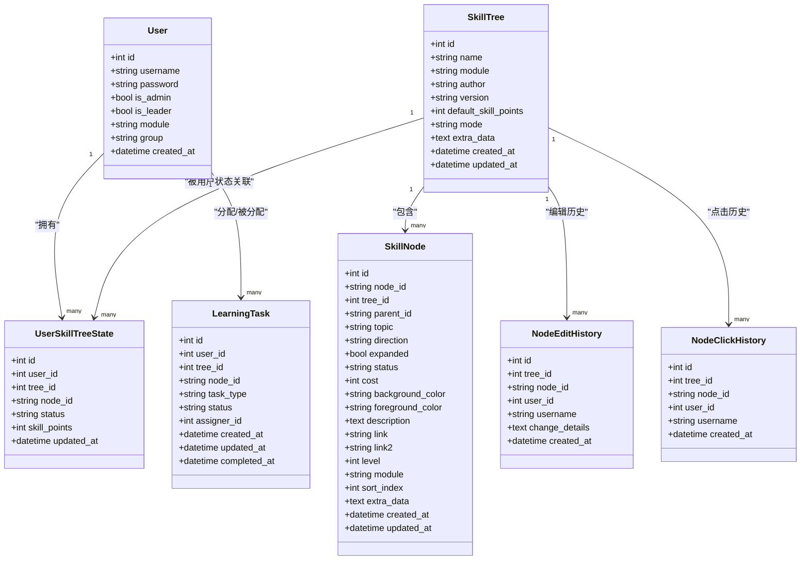
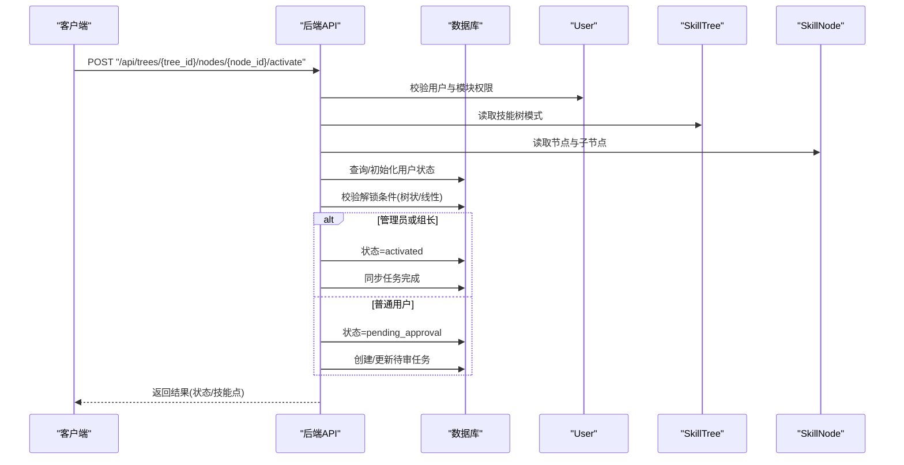
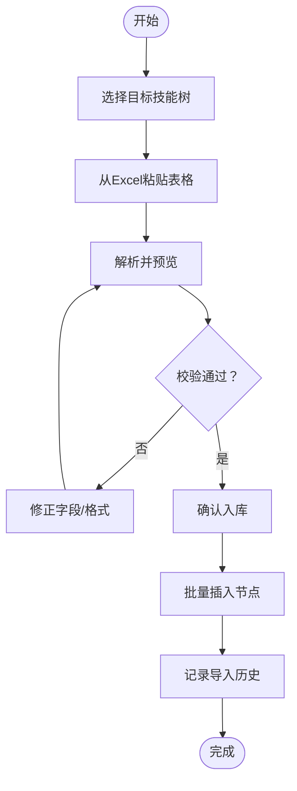
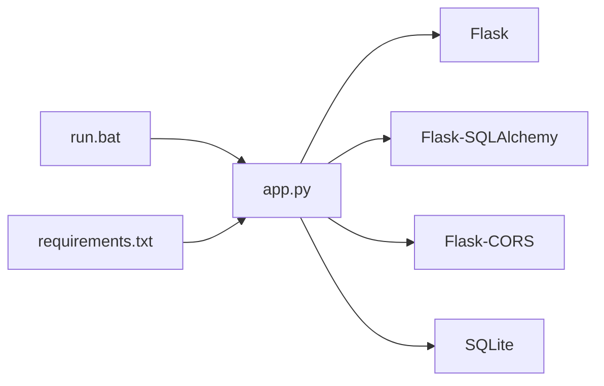

# 故障排除与FAQ

<cite>
**本文引用的文件**
- [app.py](file://app.py)
- [migrate_db.py](file://migrate_db.py)
- [migrate_db_v2.py](file://migrate_db_v2.py)
- [migrate_db_v3.py](file://migrate_db_v3.py)
- [create_admin.py](file://create_admin.py)
- [requirements.txt](file://requirements.txt)
- [run.bat](file://run.bat)
- [index.html](file://index.html)
- [import_nodes.html](file://import_nodes.html)
- [_test_api.py](file://_test_api.py)
</cite>

## 目录
1. [简介](#简介)
2. [项目结构](#项目结构)
3. [核心组件](#核心组件)
4. [架构总览](#架构总览)
5. [详细组件分析](#详细组件分析)
6. [依赖关系分析](#依赖关系分析)
7. [性能考虑](#性能考虑)
8. [故障排除指南](#故障排除指南)
9. [结论](#结论)
10. [附录](#附录)

## 简介
本文件面向技能树管理系统的使用者与技术支持人员，提供系统运行、数据库迁移、网络与跨域、浏览器兼容性、API 调用、数据导入、性能诊断与预防性维护等方面的故障排除与常见问题解答。内容基于仓库中的后端 Flask 应用、迁移脚本、前端页面与运行脚本进行整理。

## 项目结构
- 后端：基于 Flask 的 Web 服务，提供技能树、用户、节点、任务、历史等 API，并内置 SQLite 数据库存储。
- 前端：静态 HTML 页面与 jsMind 可视化组件，支持技能树展示、编辑、导入等功能。
- 运行与依赖：requirements.txt 声明依赖，run.bat 提供一键启动脚本。

**图表来源**
- [app.py](file://app.py)
- [migrate_db.py](file://migrate_db.py)
- [migrate_db_v2.py](file://migrate_db_v2.py)
- [migrate_db_v3.py](file://migrate_db_v3.py)
- [create_admin.py](file://create_admin.py)
- [requirements.txt](file://requirements.txt)
- [run.bat](file://run.bat)
- [index.html](file://index.html)
- [import_nodes.html](file://import_nodes.html)

**章节来源**
- [app.py](file://app.py)
- [requirements.txt](file://requirements.txt)
- [run.bat](file://run.bat)
- [index.html](file://index.html)
- [import_nodes.html](file://import_nodes.html)

## 核心组件
- 数据模型层：用户、技能树、技能节点、用户技能树状态、节点编辑/点击历史、学习任务等。
- API 层：用户管理、登录、技能树 CRUD、节点增删改、激活/取消激活、任务分配与审批、全局统计与历史查询等。
- 前端层：管理界面、展示界面、节点导入界面，使用 jsMind 进行可视化渲染。
- 运行与迁移：启动脚本、数据库迁移脚本、管理员初始化脚本。

**章节来源**
- [app.py](file://app.py)

## 架构总览
后端采用 Flask + SQLAlchemy + SQLite，前端通过静态页面与后端 API 交互。跨域通过 Flask-CORS 开启，数据库迁移脚本负责结构演进。

**图表来源**
- [app.py](file://app.py)
- [index.html](file://index.html)
- [import_nodes.html](file://import_nodes.html)

## 详细组件分析

### 数据模型与权限控制
- 用户与角色：管理员、组长、普通用户，模块与组别用于权限隔离。
- 技能树与节点：支持树状/线性两种激活模式，节点具备等级、模块、排序等属性。
- 用户状态：每个用户在每棵技能树中的节点状态独立维护，支持激活、待审核等状态。
- 任务系统：管理员/组长可分配学习任务，普通用户可申请点亮节点，审核通过后正式激活。

**图表来源**
- [app.py](file://app.py)

**章节来源**
- [app.py](file://app.py)

### API 调用流程（节点激活）

**图表来源**
- [app.py](file://app.py)

**章节来源**
- [app.py](file://app.py)

### 数据导入流程（CSV/粘贴导入）

**图表来源**
- [app.py](file://app.py)
- [import_nodes.html](file://import_nodes.html)

**章节来源**
- [app.py](file://app.py)
- [import_nodes.html](file://import_nodes.html)

## 依赖关系分析
- 后端依赖：Flask、Flask-SQLAlchemy、Flask-CORS。
- 运行方式：Windows 批处理脚本启动，开发模式运行于 0.0.0.0:5003。
- 数据库：SQLite，文件位于 instance/skill_tree.db（迁移脚本中可见）。

**图表来源**
- [run.bat](file://run.bat)
- [requirements.txt](file://requirements.txt)
- [app.py](file://app.py)

**章节来源**
- [run.bat](file://run.bat)
- [requirements.txt](file://requirements.txt)
- [app.py](file://app.py)

## 性能考虑
- 数据库索引与查询：节点与用户状态表存在复合索引，有助于加速查询与去重统计。
- 批量写入：导入节点时使用批量插入，减少事务次数，提升吞吐。
- 视图渲染：前端使用 jsMind 渲染，建议在大数据量时启用虚拟滚动与懒加载策略（前端层面）。
- API 响应：统计与历史接口涉及多表聚合，建议在生产环境配合缓存与分页参数合理使用。

**章节来源**
- [app.py](file://app.py)

## 故障排除指南

### 通用启动与运行问题
- 依赖缺失
  - 现象：启动时报模块导入错误。
  - 处理：执行安装命令，确保依赖正确安装。
  - 参考：[requirements.txt](file://requirements.txt)
- 启动端口与主机
  - 现象：无法访问页面或跨主机访问失败。
  - 处理：确认运行在 0.0.0.0:5003，防火墙放行端口。
  - 参考：[app.py](file://app.py)
- 一键启动
  - 现象：双击批处理无响应。
  - 处理：先在终端执行安装命令，再运行批处理，查看输出。
  - 参考：[run.bat](file://run.bat)

**章节来源**
- [requirements.txt](file://requirements.txt)
- [run.bat](file://run.bat)
- [app.py](file://app.py)

### 数据库迁移失败
- 症状
  - 迁移脚本报错，提示字段不存在或重复添加。
  - 系统启动时提示数据库结构需要更新。
- 排查步骤
  - 检查数据库文件是否存在与可写。
  - 逐个运行迁移脚本，观察输出提示。
  - 若失败，按提示删除数据库文件后重启，系统会自动重建。
- 修复步骤
  - 停止服务。
  - 删除数据库文件（路径见迁移脚本）。
  - 重新启动服务，系统会自动创建新库。
- 参考
  - [migrate_db.py](file://migrate_db.py)
  - [migrate_db_v2.py](file://migrate_db_v2.py)
  - [migrate_db_v3.py](file://migrate_db_v3.py)

**章节来源**
- [migrate_db.py](file://migrate_db.py)
- [migrate_db_v2.py](file://migrate_db_v2.py)
- [migrate_db_v3.py](file://migrate_db_v3.py)

### 网络连接与跨域问题
- 症状
  - 前端请求 403/404 或报跨域错误。
- 排查
  - 确认后端已启用 CORS。
  - 确认前端请求的域名/端口与后端一致。
- 参考
  - [app.py](file://app.py)

**章节来源**
- [app.py](file://app.py)

### 浏览器兼容性与前端功能异常
- 症状
  - 页面空白、样式错乱、导入界面无法粘贴。
- 排查
  - 确认浏览器支持现代 ES 语法与 fetch API。
  - 检查静态资源路径（libs/css、libs/js）是否正确。
  - 导入界面依赖粘贴与解析逻辑，确保未禁用剪贴板。
- 参考
  - [index.html](file://index.html)
  - [import_nodes.html](file://import_nodes.html)

**章节来源**
- [index.html](file://index.html)
- [import_nodes.html](file://import_nodes.html)

### 后端 API 调用失败
- 常见错误码与含义
  - 400：请求参数缺失或非法（如用户名为空、节点ID重复、CSV 行校验失败）。
  - 401：登录凭据错误。
  - 403：无权限（非管理员/组长操作受限）。
  - 404：资源不存在（用户/技能树/节点）。
  - 500：服务器内部错误（数据库异常、迁移失败、导入异常）。
- 调试技巧
  - 使用测试脚本验证 API 可达性与返回结构。
  - 检查后端日志输出，定位异常堆栈。
  - 对批量导入场景，关注单行错误明细与提交阶段异常。
- 参考
  - [app.py](file://app.py)
  - [_test_api.py](file://_test_api.py)

**章节来源**
- [app.py](file://app.py)
- [_test_api.py](file://_test_api.py)

### 数据导入错误与文件格式问题
- 常见问题
  - CSV 列名不匹配、必填字段为空、父子关系引用错误。
  - 粘贴区域未包含表头、分隔符不正确。
- 解决方案
  - 使用模板下载，严格按列名填写。
  - 确保父子节点 ID 关系正确，根节点标识为特殊值。
  - 分批导入，先预览再提交，关注每行错误明细。
- 参考
  - [app.py](file://app.py)
  - [import_nodes.html](file://import_nodes.html)

**章节来源**
- [app.py](file://app.py)
- [import_nodes.html](file://import_nodes.html)

### 管理员账户与权限
- 症状
  - 登录失败或无权限操作。
- 处理
  - 使用管理员初始化脚本创建管理员账号。
  - 确认 is_admin/is_leader 字段生效。
- 参考
  - [create_admin.py](file://create_admin.py)
  - [app.py](file://app.py)

**章节来源**
- [create_admin.py](file://create_admin.py)
- [app.py](file://app.py)

### 系统监控与日志分析
- 建议
  - 启用后端日志输出，关注异常堆栈与数据库操作。
  - 对高频 API（导入、激活、统计）增加埋点与告警。
  - 定期导出历史与点击统计，分析热点节点与使用趋势。
- 参考
  - [app.py](file://app.py)

**章节来源**
- [app.py](file://app.py)

### 预防性维护与系统健康检查
- 建议
  - 定期备份数据库文件。
  - 检查磁盘空间与进程占用，避免 SQLite 文件过大导致锁争用。
  - 对外暴露服务时，开启反向代理与 HTTPS。
  - 对导入与批量操作设置速率限制与超时保护。
- 参考
  - [migrate_db.py](file://migrate_db.py)
  - [app.py](file://app.py)

**章节来源**
- [migrate_db.py](file://migrate_db.py)
- [app.py](file://app.py)

## 结论
本指南围绕技能树管理系统的启动、迁移、API、导入、跨域、浏览器兼容、性能与运维等方面提供了系统化的故障排除方法。建议在生产环境中结合日志、监控与定期巡检，确保系统稳定运行。

## 附录

### 标准化问题处理流程（技术支持）
- 快速复现：确认环境、依赖、数据库状态。
- 采集信息：后端日志、请求参数、错误码、前后端截图。
- 优先级分级：阻断性问题（不可用）> 影响面大（大量用户）> 影响面小（个别用户）。
- 临时措施：降级导入/激活频率、回滚迁移、恢复备份。
- 根因定位：对照本 FAQ 的对应章节，逐步排查。
- 回归验证：修复后验证 API、导入、权限、统计等关键路径。
- 文档更新：补充知识库与变更记录。

### 常用 API 与页面入口
- 管理页面：/
- 展示页面：/view.html
- 登录页面：/login.html
- 用户管理页面：/users.html
- 节点导入页面：/import_nodes.html
- 后端 API 文档：/api/trees

**章节来源**
- [app.py](file://app.py)
- [index.html](file://index.html)
- [import_nodes.html](file://import_nodes.html)