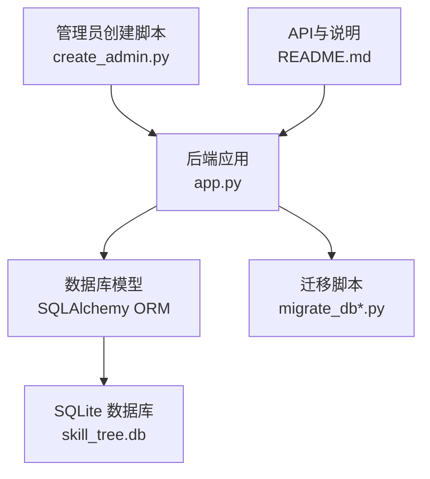
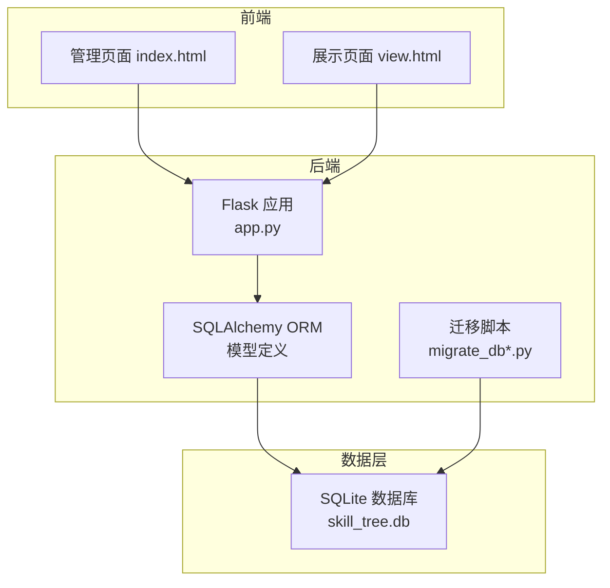
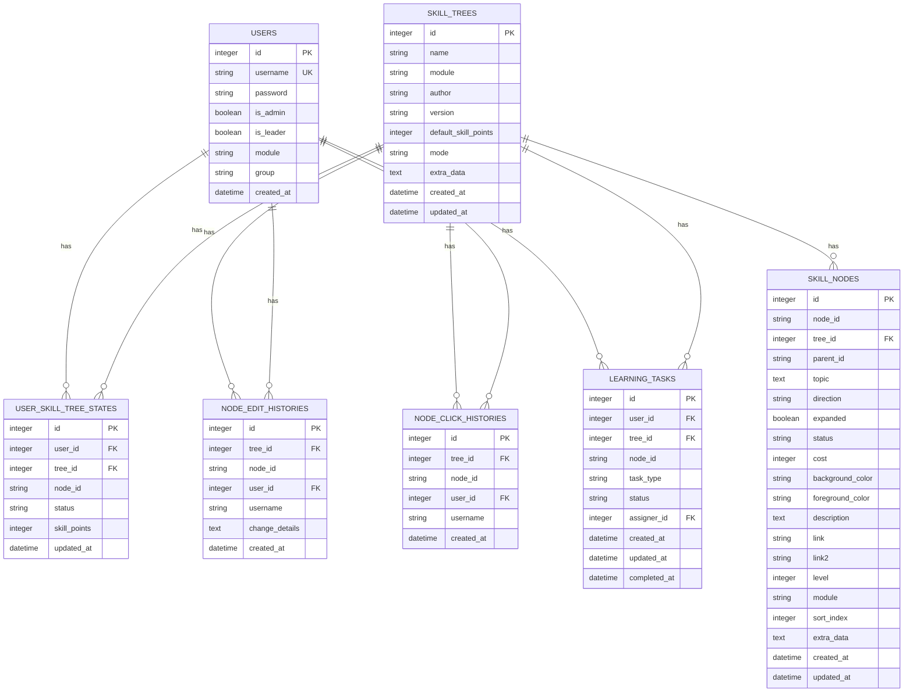
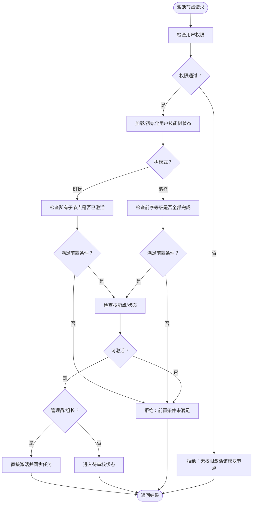
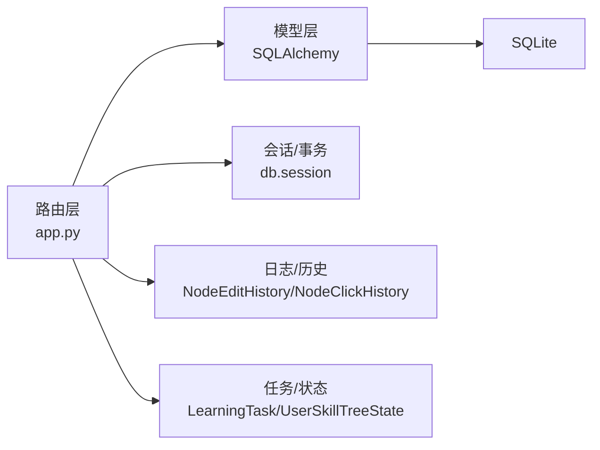

# 数据安全与完整性

<cite>
**本文引用的文件**
- [app.py](file://app.py)
- [migrate_db.py](file://migrate_db.py)
- [migrate_db_v2.py](file://migrate_db_v2.py)
- [migrate_db_v3.py](file://migrate_db_v3.py)
- [create_admin.py](file://create_admin.py)
- [README.md](file://README.md)
</cite>

## 目录
1. [简介](#简介)
2. [项目结构](#项目结构)
3. [核心组件](#核心组件)
4. [架构总览](#架构总览)
5. [详细组件分析](#详细组件分析)
6. [依赖关系分析](#依赖关系分析)
7. [性能考量](#性能考量)
8. [故障排查指南](#故障排查指南)
9. [结论](#结论)
10. [附录](#附录)

## 简介
本文件聚焦于技能树管理系统的数据安全与完整性保障，结合代码库中的模型定义、路由实现与迁移脚本，系统性阐述数据库层面的安全措施、约束设计、权限与审计机制、完整性验证、用户认证与授权、备份与恢复策略，以及敏感数据处理与隐私保护建议。目标读者为系统管理员与安全工程师，帮助其建立可落地的数据安全保障体系。

## 项目结构
系统采用Flask+SQLAlchemy+SQLite的轻量架构：
- 后端入口与业务逻辑集中在后端应用文件中
- 数据库迁移脚本负责结构演进
- 管理员创建脚本用于快速初始化
- README提供API与数据库结构说明

图表来源
- [app.py:17-22](file://app.py#L17-L22)
- [migrate_db.py:5-28](file://migrate_db.py#L5-L28)
- [migrate_db_v2.py:4-34](file://migrate_db_v2.py#L4-L34)
- [migrate_db_v3.py:5-35](file://migrate_db_v3.py#L5-L35)
- [create_admin.py:5-25](file://create_admin.py#L5-L25)
- [README.md:61-78](file://README.md#L61-L78)

章节来源
- [app.py:17-22](file://app.py#L17-L22)
- [README.md:61-78](file://README.md#L61-L78)

## 核心组件
- 数据模型层：用户、技能树、技能节点、用户技能树状态、节点编辑历史、节点点击历史、学习任务等
- 权限与审计：用户角色（管理员/组长/普通用户）、模块/组别隔离、节点编辑与点击历史
- 完整性与约束：外键、唯一约束、索引、输入校验、业务规则检查
- 迁移与初始化：自动建表、字段迁移、默认值与回退策略

章节来源
- [app.py:25-177](file://app.py#L25-L177)
- [app.py:1055-1134](file://app.py#L1055-L1134)
- [app.py:1498-1546](file://app.py#L1498-L1546)
- [app.py:1655-1708](file://app.py#L1655-L1708)
- [migrate_db.py:8-36](file://migrate_db.py#L8-L36)
- [migrate_db_v2.py:6-31](file://migrate_db_v2.py#L6-L31)
- [migrate_db_v3.py:8-31](file://migrate_db_v3.py#L8-L31)

## 架构总览
系统采用三层架构：前端页面（管理/展示）、后端API（Flask+SQLAlchemy）、SQLite数据库。权限与审计贯穿业务流程，数据完整性由模型约束与业务校验共同保障。

图表来源
- [app.py:17-22](file://app.py#L17-L22)
- [migrate_db.py:5-28](file://migrate_db.py#L5-L28)
- [README.md:61-78](file://README.md#L61-L78)

## 详细组件分析

### 数据模型与约束设计
- 用户表：用户名唯一、管理员/组长标志、模块/组别字段、时间戳
- 技能树表：名称、模块、作者、版本、默认技能点、激活模式、扩展数据、时间戳
- 技能节点表：节点ID、树ID外键、父节点ID、主题、方向、展开状态、状态、成本、颜色、描述与链接、等级、模块、排序索引、额外数据、时间戳；复合索引加速查询
- 用户技能树状态表：用户ID、树ID、节点ID三元唯一约束，确保每用户每树每节点唯一；状态与技能点字段
- 节点编辑历史表：树ID、节点ID、用户ID/冗余用户名、变更详情（JSON）、时间戳
- 节点点击历史表：树ID、节点ID、用户ID/冗余用户名、时间戳
- 学习任务表：用户ID、树ID、节点ID、任务类型、状态、分配者ID、时间戳

图表来源
- [app.py:25-177](file://app.py#L25-L177)

章节来源
- [app.py:25-177](file://app.py#L25-L177)

### 外键、唯一与索引约束
- 外键约束：技能节点、用户技能树状态、历史表均通过外键关联到用户与技能树，保证引用完整性
- 唯一约束：用户技能树状态表对(user_id, tree_id, node_id)建立唯一约束，避免重复状态记录
- 索引：技能节点表对(tree_id, node_id)建立复合索引，提升查询效率；同时存在单列索引以优化其他查询场景
- 时间戳：大量实体包含创建与更新时间戳，便于审计与追踪

章节来源
- [app.py:68-121](file://app.py#L68-L121)

### 数据完整性验证机制
- 输入验证：路由层对关键字段进行非空与格式校验（如节点ID、用户名、技能点等），并在异常时返回明确错误
- 业务规则检查：
  - 激活节点前检查前置条件（树状模式要求子节点全部激活；路径模式要求前序等级全部完成）
  - 激活节点前检查用户权限（非管理员仅能激活与自身模块交集内的技能树）
  - 待审核流程：普通用户激活节点进入待审核状态，管理员/组长审批后方可正式点亮
- 历史记录：节点编辑与点击行为均记录历史，便于审计与溯源
- 事务与回滚：批量导入、节点更新、树更新等关键流程在异常时执行回滚，避免部分提交导致的数据不一致

图表来源
- [app.py:777-901](file://app.py#L777-L901)

章节来源
- [app.py:777-901](file://app.py#L777-L901)
- [app.py:1498-1546](file://app.py#L1498-L1546)
- [app.py:1655-1708](file://app.py#L1655-L1708)

### 用户认证与授权机制
- 登录接口：校验用户名与密码（当前为明文比较，建议升级为安全哈希校验）
- 角色权限：
  - 管理员：可重置所有用户技能树、查看/操作全局数据
  - 组长：可对本组成员进行任务分配与审核
  - 普通用户：仅能管理自己的技能树与进度
- 模块/组别隔离：通过模块字段与组别字段限制可见范围与操作范围
- 任务与状态：学习任务表与用户技能树状态表联动，形成完整的权限与状态闭环

章节来源
- [app.py:356-382](file://app.py#L356-L382)
- [app.py:1843-1916](file://app.py#L1843-L1916)
- [app.py:1973-2027](file://app.py#L1973-L2027)
- [app.py:1055-1075](file://app.py#L1055-L1075)

### 审计日志与历史追踪
- 节点编辑历史：记录每次编辑的变更详情（JSON），包含修改者与时间
- 节点点击历史：记录点击次数与最近点击用户
- 全局统计：提供树/节点/激活次数的统计与分页查看
- 历史查询：支持按页查询编辑与点击历史，便于审计与复盘

章节来源
- [app.py:124-151](file://app.py#L124-L151)
- [app.py:1498-1546](file://app.py#L1498-L1546)
- [app.py:1549-1652](file://app.py#L1549-L1652)
- [app.py:1655-1708](file://app.py#L1655-L1708)

### 数据库迁移与演进
- 自动迁移：首次启动或手动执行迁移脚本，自动创建缺失表与字段，并设置默认值
- 版本演进：v1/v2/v3分别添加默认技能点、激活模式、组长字段与学习任务表
- 回退策略：迁移失败时提供删除数据库文件后重启重建的指引

章节来源
- [migrate_db.py:8-36](file://migrate_db.py#L8-L36)
- [migrate_db_v2.py:6-31](file://migrate_db_v2.py#L6-L31)
- [migrate_db_v3.py:8-31](file://migrate_db_v3.py#L8-L31)
- [app.py:2109-2227](file://app.py#L2109-L2227)

### 敏感数据处理与隐私保护
- 当前实现：密码字段为明文存储，存在严重安全风险
- 建议改进：
  - 引入强哈希算法（如bcrypt）存储密码摘要
  - 对历史记录中的用户名字段进行最小化暴露，必要时脱敏
  - 严格控制审计日志的访问权限，遵循最小可见原则
  - 对外部导出/导入的数据进行白名单校验与脱敏处理

章节来源
- [app.py:29-36](file://app.py#L29-L36)
- [create_admin.py:16-24](file://create_admin.py#L16-L24)

### 备份策略、恢复流程与灾难恢复
- 备份策略
  - 定期备份SQLite数据库文件（建议每日增量+每周全量）
  - 备份介质与位置分离，确保异地容灾
  - 备份后进行完整性校验（校验文件大小与校验和）
- 恢复流程
  - 停止服务 -> 备份当前数据库 -> 恢复目标备份 -> 启动服务 -> 验证数据一致性
  - 对关键表（用户、技能树、状态）进行一致性检查
- 灾难恢复
  - 建立RPO/RTO指标，定期演练恢复流程
  - 对迁移脚本与初始化逻辑进行版本化管理，确保可回滚

章节来源
- [migrate_db.py:32-36](file://migrate_db.py#L32-L36)
- [app.py:2109-2227](file://app.py#L2109-L2227)

## 依赖关系分析
- 组件耦合
  - 路由层高度依赖模型层与会话管理
  - 权限控制贯穿多个路由，耦合度较高
  - 历史表与状态表相互补充，形成审计闭环
- 外部依赖
  - Flask、SQLAlchemy、Flask-CORS
  - SQLite（本地文件型数据库）

图表来源
- [app.py:17-22](file://app.py#L17-L22)
- [app.py:25-177](file://app.py#L25-L177)

章节来源
- [app.py:17-22](file://app.py#L17-L22)
- [app.py:25-177](file://app.py#L25-L177)

## 性能考量
- 索引优化：技能节点复合索引与单列索引提升查询效率
- 批量操作：批量导入与批量保存减少往返次数
- 事务边界：关键流程使用事务包裹，避免中间状态
- 建议：对高频查询（如进度统计、历史查询）增加物化视图或缓存层（Redis/Memcached）

## 故障排查指南
- 登录失败
  - 检查用户名是否存在、密码是否匹配（当前为明文对比）
  - 确认用户角色与模块权限
- 激活失败
  - 检查前置条件（树状/路径模式）、技能点、模块权限
  - 查看历史记录与状态表确认是否处于待审核
- 数据不一致
  - 检查事务是否回滚、唯一约束是否触发
  - 核对历史记录与当前状态
- 迁移失败
  - 按提示删除数据库文件后重启重建
  - 检查字段默认值与类型兼容性

章节来源
- [app.py:356-382](file://app.py#L356-L382)
- [app.py:777-901](file://app.py#L777-L901)
- [migrate_db.py:32-36](file://migrate_db.py#L32-L36)

## 结论
系统在数据模型与业务流程上具备较为完善的完整性与审计能力，但在密码存储与访问控制方面存在明显短板。建议优先实施密码哈希、最小权限与最小暴露原则，完善访问日志与审计策略，并建立标准化的备份与灾难恢复流程，以全面提升数据安全与完整性保障水平。

## 附录
- API与数据库结构详见README
- 管理员创建脚本用于快速初始化管理员账户

章节来源
- [README.md:305-333](file://README.md#L305-L333)
- [create_admin.py:7-25](file://create_admin.py#L7-L25)