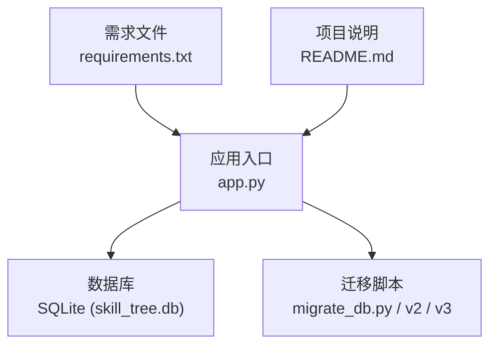
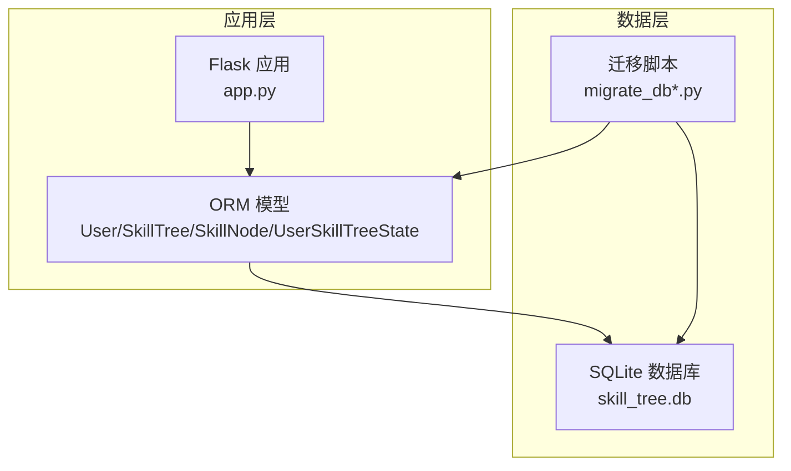
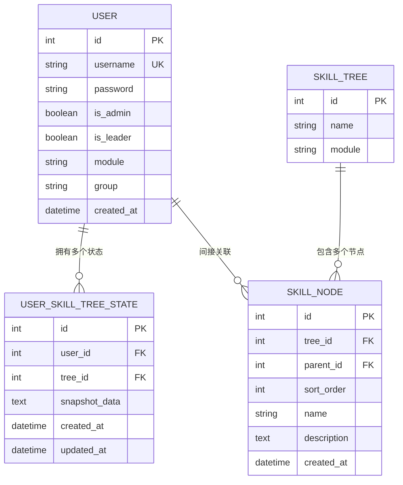
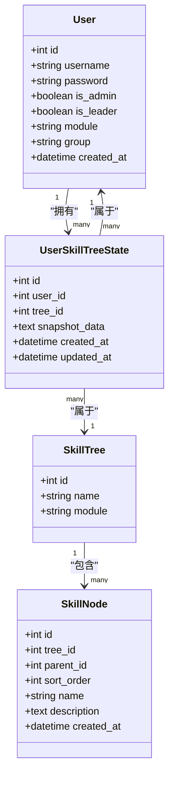
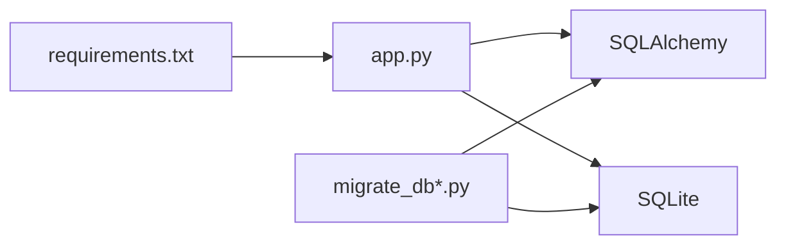

# 数据库设计

<cite>
**本文引用的文件**
- [app.py](file://app.py)
- [migrate_db.py](file://migrate_db.py)
- [migrate_db_v2.py](file://migrate_db_v2.py)
- [migrate_db_v3.py](file://migrate_db_v3.py)
- [README.md](file://README.md)
- [requirements.txt](file://requirements.txt)
</cite>

## 目录
1. [简介](#简介)
2. [项目结构](#项目结构)
3. [核心组件](#核心组件)
4. [架构总览](#架构总览)
5. [详细组件分析](#详细组件分析)
6. [依赖分析](#依赖分析)
7. [性能考量](#性能考量)
8. [故障排查指南](#故障排查指南)
9. [结论](#结论)
10. [附录](#附录)

## 简介
本设计文档面向技能树管理系统，聚焦于基于 SQLite 的数据库整体架构与表结构设计，明确核心实体及其关系，给出字段定义、约束与索引建议、迁移策略与版本管理机制、数据验证与业务规则、性能优化与缓存策略、数据生命周期与安全保护，以及 schema 图与示例数据指引。目标读者为数据库管理员与后端开发者。

## 项目结构
系统采用 Python + Flask + SQLAlchemy 技术栈，数据库为 SQLite，默认连接到本地 skill_tree.db 文件。核心模型在应用入口中定义，迁移脚本负责数据库结构演进。

**图示来源**
- [app.py:17-21](file://app.py#L17-L21)
- [migrate_db.py:1-50](file://migrate_db.py#L1-L50)
- [migrate_db_v2.py:1-50](file://migrate_db_v2.py#L1-L50)
- [migrate_db_v3.py:1-50](file://migrate_db_v3.py#L1-L50)
- [requirements.txt:1-50](file://requirements.txt#L1-L50)
- [README.md:294-299](file://README.md#L294-L299)

**章节来源**
- [README.md:56](file://README.md#L56)
- [README.md:294-299](file://README.md#L294-L299)
- [requirements.txt:1-50](file://requirements.txt#L1-L50)

## 核心组件
本系统通过 SQLAlchemy ORM 定义以下核心实体与关系：
- User：用户实体，包含身份、角色与所属模块/分组信息，并与用户技能树状态存在一对多关系。
- SkillTree：技能树实体，标识树名称与模块归属。
- SkillNode：技能节点实体，用于构建技能树的节点结构（如父子关系、排序、状态等）。
- UserSkillTreeState：用户技能树状态实体，记录用户对某棵技能树的学习进度或状态快照。

上述实体在应用入口中以类的形式声明，使用 SQLAlchemy 的 Column、Relationship 等特性进行映射与关联。

**章节来源**
- [app.py:24-38](file://app.py#L24-L38)
- [app.py:41-55](file://app.py#L41-L55)
- [app.py:56-70](file://app.py#L56-L70)
- [app.py:71-85](file://app.py#L71-L85)

## 架构总览
下图展示应用层与数据库层的交互关系，以及迁移脚本在不同版本中的演进路径。

**图示来源**
- [app.py:17-21](file://app.py#L17-L21)
- [migrate_db.py:1-50](file://migrate_db.py#L1-L50)
- [migrate_db_v2.py:1-50](file://migrate_db_v2.py#L1-L50)
- [migrate_db_v3.py:1-50](file://migrate_db_v3.py#L1-L50)

## 详细组件分析

### 实体与表结构设计
基于模型定义，可抽象出如下表结构与字段约束（字段名、类型、约束与索引建议均按模型声明推导）：

- 表：User
  - 字段
    - id：整数，主键，自增
    - username：字符串(50)，唯一，非空
    - password：字符串(100)
    - is_admin：布尔值，默认 false
    - is_leader：布尔值，默认 false
    - module：字符串(100)，默认“默认模块”
    - group：字符串(20)，默认“A”
    - created_at：日期时间，默认当前时间
  - 约束
    - 主键：id
    - 唯一：username
    - 默认值：module、group、is_admin、is_leader、created_at
  - 索引建议
    - 唯一索引：username
    - 可选：module、group 组合查询时建立复合索引

- 表：SkillTree
  - 字段
    - id：整数，主键，自增
    - name：字符串(100)，非空
    - module：字符串(100)，默认“默认模块”
  - 约束
    - 主键：id
    - 默认值：module
  - 索引建议
    - 可选：name、module 组合查询时建立复合索引

- 表：SkillNode
  - 字段
    - id：整数，主键，自增
    - tree_id：整数，外键指向 SkillTree(id)，非空
    - parent_id：整数，外键指向自身 id（自引用），允许为空
    - sort_order：整数，用于排序
    - name：字符串(255)，非空
    - description：文本，可空
    - created_at：日期时间，默认当前时间
  - 约束
    - 主键：id
    - 外键：tree_id → SkillTree(id)
    - 自引用外键：parent_id → SkillNode(id)
    - 默认值：sort_order、created_at
  - 索引建议
    - 复合索引：(tree_id, parent_id)
    - 复合索引：(tree_id, sort_order)

- 表：UserSkillTreeState
  - 字段
    - id：整数，主键，自增
    - user_id：整数，外键指向 User(id)，非空
    - tree_id：整数，外键指向 SkillTree(id)，非空
    - snapshot_data：文本，存储状态快照
    - created_at：日期时间，默认当前时间
    - updated_at：日期时间，默认当前时间
  - 约束
    - 主键：id
    - 外键：user_id → User(id)、tree_id → SkillTree(id)
    - 默认值：created_at、updated_at
  - 索引建议
    - 复合索引：(user_id, tree_id)，保证唯一性或去重
    - 可选：tree_id 单列索引

**图示来源**
- [app.py:24-38](file://app.py#L24-L38)
- [app.py:41-55](file://app.py#L41-L55)
- [app.py:56-70](file://app.py#L56-L70)
- [app.py:71-85](file://app.py#L71-L85)

**章节来源**
- [app.py:24-38](file://app.py#L24-L38)
- [app.py:41-55](file://app.py#L41-L55)
- [app.py:56-70](file://app.py#L56-L70)
- [app.py:71-85](file://app.py#L71-L85)

### 关系与依赖
- User 与 UserSkillTreeState：一对多，User 通过 relationship 持有多个状态。
- SkillTree 与 SkillNode：一对多，SkillTree 包含多个节点。
- UserSkillTreeState 与 User、SkillTree：多对一，分别关联用户与技能树。
- SkillNode 支持自引用（父子关系），形成树形结构。

**图示来源**
- [app.py:24-38](file://app.py#L24-L38)
- [app.py:41-55](file://app.py#L41-L55)
- [app.py:56-70](file://app.py#L56-L70)
- [app.py:71-85](file://app.py#L71-L85)

**章节来源**
- [app.py:24-38](file://app.py#L24-L38)
- [app.py:41-55](file://app.py#L41-L55)
- [app.py:56-70](file://app.py#L56-L70)
- [app.py:71-85](file://app.py#L71-L85)

### 迁移策略与版本管理
系统提供多版本迁移脚本，用于数据库结构演进与数据迁移：
- migrate_db.py：初始版本迁移脚本，负责首次创建数据库与基础表结构。
- migrate_db_v2.py：第二版迁移脚本，可能包含字段调整、索引新增、约束增强等变更。
- migrate_db_v3.py：第三版迁移脚本，进一步完善结构与数据一致性。

迁移脚本通常包含：
- 创建/修改表结构
- 添加索引与约束
- 数据清洗与补全
- 版本号标记与回滚准备

建议遵循以下迁移流程：
- 在开发环境先行测试
- 对生产环境执行前先备份数据库
- 记录每次迁移的变更内容与影响范围
- 提供回滚脚本或逆向迁移步骤

**章节来源**
- [migrate_db.py:1-50](file://migrate_db.py#L1-L50)
- [migrate_db_v2.py:1-50](file://migrate_db_v2.py#L1-L50)
- [migrate_db_v3.py:1-50](file://migrate_db_v3.py#L1-L50)

### 数据验证与业务规则
- 身份与权限
  - 用户名唯一性由数据库唯一约束保障；管理员与组长标志位用于权限控制。
- 技能树与节点
  - 技能树名称非空；节点名称非空，支持父子关系与排序字段。
- 状态快照
  - 用户技能树状态以文本形式存储快照，便于灵活扩展。
- 时间戳
  - 所有实体均具备创建时间字段，部分实体具备更新时间字段，便于审计与统计。

**章节来源**
- [app.py:24-38](file://app.py#L24-L38)
- [app.py:41-55](file://app.py#L41-L55)
- [app.py:56-70](file://app.py#L56-L70)
- [app.py:71-85](file://app.py#L71-L85)

### 示例数据
以下为各表的示例数据示意（仅作格式参考，不包含具体值）：
- User
  - id, username, password, is_admin, is_leader, module, group, created_at
- SkillTree
  - id, name, module
- SkillNode
  - id, tree_id, parent_id, sort_order, name, description, created_at
- UserSkillTreeState
  - id, user_id, tree_id, snapshot_data, created_at, updated_at

**章节来源**
- [app.py:24-38](file://app.py#L24-L38)
- [app.py:41-55](file://app.py#L41-L55)
- [app.py:56-70](file://app.py#L56-L70)
- [app.py:71-85](file://app.py#L71-L85)

## 依赖分析
- 应用层依赖
  - Flask + SQLAlchemy：用于 Web 框架与 ORM 映射
  - SQLite：轻量级本地数据库
- 迁移脚本依赖
  - SQLAlchemy 与数据库驱动，确保迁移命令可执行
- 外部依赖
  - requirements.txt 中声明的第三方包

**图示来源**
- [requirements.txt:1-50](file://requirements.txt#L1-L50)
- [app.py:17-21](file://app.py#L17-L21)
- [migrate_db.py:1-50](file://migrate_db.py#L1-L50)
- [migrate_db_v2.py:1-50](file://migrate_db_v2.py#L1-L50)
- [migrate_db_v3.py:1-50](file://migrate_db_v3.py#L1-L50)

**章节来源**
- [requirements.txt:1-50](file://requirements.txt#L1-L50)
- [app.py:17-21](file://app.py#L17-L21)

## 性能考量
- 索引设计
  - 在高频查询字段上建立索引，如 User.username、User.module/group 组合索引；SkillNode(tree_id, parent_id)、(tree_id, sort_order) 复合索引；UserSkillTreeState(user_id, tree_id) 复合索引。
- 查询优化
  - 避免 N+1 查询，优先使用联表查询与 select joined 或 select in load 等策略。
  - 对树形遍历场景，建议分页与限制深度，避免一次性加载整棵树。
- 写入优化
  - 合理批量插入与事务提交，减少锁竞争。
- 缓存策略
  - 对热点技能树与用户状态进行缓存（如 Redis），降低数据库压力；注意缓存失效与一致性。
- I/O 与并发
  - SQLite 在高并发写入场景表现有限，建议结合连接池与读写分离（若升级架构）。

[本节为通用性能指导，不直接分析具体文件]

## 故障排查指南
- 连接问题
  - 确认数据库 URI 正确且 skill_tree.db 文件存在与可写。
- 权限问题
  - 管理员与组长权限由 is_admin、is_leader 字段决定，检查对应字段是否正确设置。
- 迁移失败
  - 检查迁移脚本日志与错误堆栈，确认数据库版本与脚本版本匹配；必要时回滚至上一个稳定版本。
- 数据不一致
  - 核对唯一约束与外键约束是否生效；对 UserSkillTreeState 的 user_id + tree_id 建议添加唯一索引以避免重复。

**章节来源**
- [app.py:17-21](file://app.py#L17-L21)
- [app.py:24-38](file://app.py#L24-L38)
- [app.py:41-55](file://app.py#L41-L55)
- [migrate_db.py:1-50](file://migrate_db.py#L1-L50)
- [migrate_db_v2.py:1-50](file://migrate_db_v2.py#L1-L50)
- [migrate_db_v3.py:1-50](file://migrate_db_v3.py#L1-L50)

## 结论
本设计文档基于现有模型与迁移脚本，给出了 SQLite 数据库的整体架构、表结构、索引与约束建议、迁移策略与版本管理机制、数据验证与业务规则、性能优化与缓存策略、数据生命周期与安全保护要点。建议在生产环境中严格执行迁移流程、备份策略与权限控制，并根据业务增长评估是否引入更强大的数据库与缓存方案。

[本节为总结性内容，不直接分析具体文件]

## 附录
- 快速检查清单
  - 数据库文件是否存在且可写
  - 迁移脚本是否成功执行
  - 关键索引是否已创建
  - 权限字段是否正确配置
  - 备份与恢复流程是否演练过

[本节为通用附录，不直接分析具体文件]