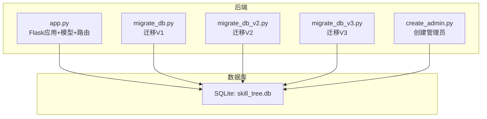
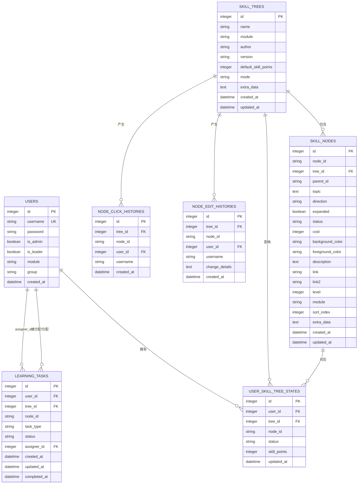
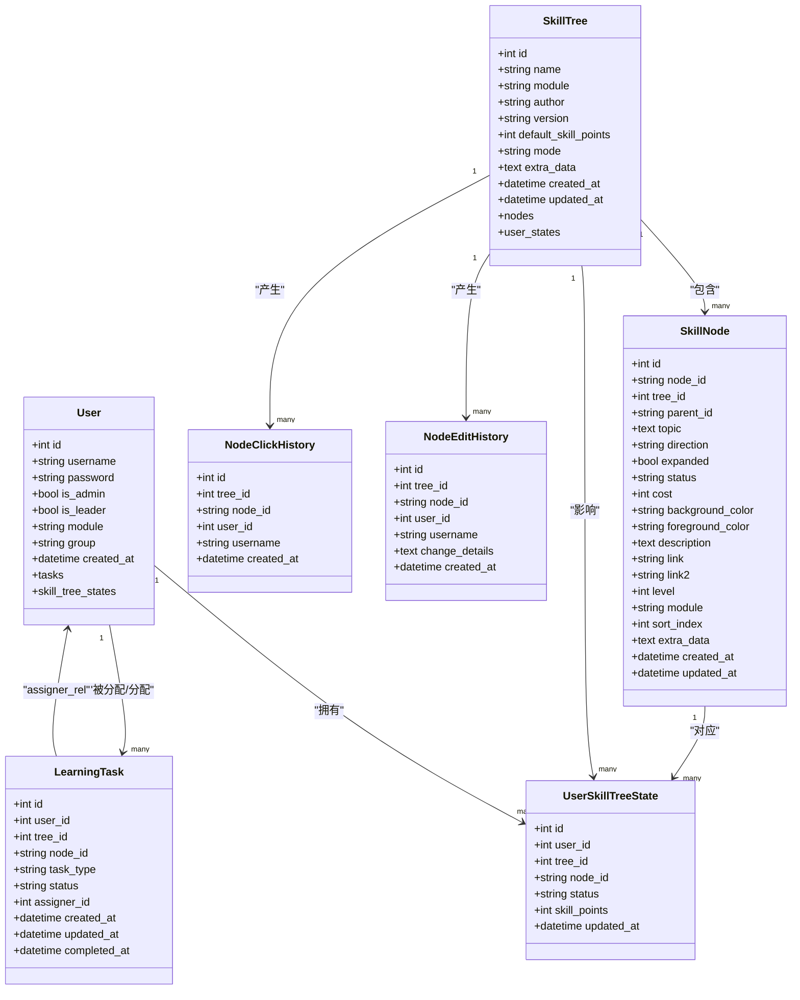

# 数据模型关系

<cite>
**本文引用的文件**
- [app.py](file://app.py)
- [migrate_db.py](file://migrate_db.py)
- [migrate_db_v2.py](file://migrate_db_v2.py)
- [migrate_db_v3.py](file://migrate_db_v3.py)
- [create_admin.py](file://create_admin.py)
- [README.md](file://README.md)
- [requirements.txt](file://requirements.txt)
</cite>

## 目录
1. [简介](#简介)
2. [项目结构](#项目结构)
3. [核心组件](#核心组件)
4. [架构总览](#架构总览)
5. [详细组件分析](#详细组件分析)
6. [依赖分析](#依赖分析)
7. [性能考虑](#性能考虑)
8. [故障排查指南](#故障排查指南)
9. [结论](#结论)
10. [附录](#附录)

## 简介
本文件面向数据库设计者与后端开发者，系统梳理技能树管理系统的数据模型关系，明确核心实体的表结构、字段定义、约束与索引，并解释一对多、多对多关系的实现方式、外键与级联策略、导航关系与查询优化策略。同时提供ER图与实体关系图，帮助快速理解整体架构。

## 项目结构
系统采用Flask + SQLAlchemy + SQLite的轻量架构：
- 后端入口与业务逻辑集中在单文件应用中，包含模型定义、路由与业务方法。
- 数据库迁移脚本负责向后兼容地添加新字段。
- 前端页面通过静态文件提供管理与展示界面。

图表来源
- [app.py:17-22](file://app.py#L17-L22)
- [migrate_db.py:5-36](file://migrate_db.py#L5-L36)
- [migrate_db_v2.py:4-33](file://migrate_db_v2.py#L4-L33)
- [migrate_db_v3.py:5-31](file://migrate_db_v3.py#L5-L31)
- [create_admin.py:5-25](file://create_admin.py#L5-L25)

章节来源
- [README.md:61-78](file://README.md#L61-L78)
- [requirements.txt:1-5](file://requirements.txt#L1-L5)

## 核心组件
本系统围绕以下核心模型构建：
- User：用户表，支持管理员与组长角色、模块与分组。
- SkillTree：技能树表，支持模块、作者、版本、默认技能点、激活模式等。
- SkillNode：技能节点表，树形结构，支持方向、展开状态、等级、模块、排序索引、额外数据等。
- UserSkillTreeState：用户技能树状态表，记录每个用户在每个节点的状态与技能点。
- NodeEditHistory：节点编辑历史表，记录节点变更详情。
- NodeClickHistory：节点点击历史表，记录节点点击行为。
- LearningTask：学习任务表，支持任务类型、状态、分配者等。

章节来源
- [app.py:25-177](file://app.py#L25-L177)

## 架构总览
系统采用“树形结构 + 用户状态 + 历史审计 + 任务驱动”的设计，核心关系如下：
- SkillTree 与 SkillNode：一对多（树包含多个节点）
- SkillTree 与 UserSkillTreeState：一对多（树对应多个用户状态）
- SkillNode 与 UserSkillTreeState：一对多（节点对应多个用户状态）
- User 与 UserSkillTreeState：一对多（用户对应多个状态）
- User 与 LearningTask：一对多（用户可被分配多个任务）
- SkillTree 与 NodeEditHistory：一对多（树对应多个编辑历史）
- SkillTree 与 NodeClickHistory：一对多（树对应多个点击历史）

图表来源
- [app.py:25-177](file://app.py#L25-L177)

## 详细组件分析

### User（用户）
- 主键：id
- 唯一约束：username
- 字段与类型：
  - id: 整型，主键
  - username: 字符串，唯一
  - password: 字符串
  - is_admin: 布尔
  - is_leader: 布尔
  - module: 字符串，默认“默认模块”
  - group: 字符串，默认“A”
  - created_at: 时间戳
- 关系：
  - 一对多：User → UserSkillTreeState（backref: user）
  - 一对多：User → LearningTask（tasks，assigner_rel）
- 索引：无显式索引，但username唯一约束天然建立索引
- 级联：UserSkillTreeState 使用 delete-orphan 级联删除

章节来源
- [app.py:25-39](file://app.py#L25-L39)

### SkillTree（技能树）
- 主键：id
- 字段与类型：
  - id: 整型，主键
  - name: 字符串，非空
  - module: 字符串，默认“默认模块”
  - author: 字符串
  - version: 字符串
  - default_skill_points: 整型，默认10
  - mode: 字符串，默认“tree”，可取“tree”或“path”
  - extra_data: 文本（JSON）
  - created_at/updated_at: 时间戳
- 关系：
  - 一对多：SkillTree → SkillNode（backref: tree）
  - 一对多：SkillTree → UserSkillTreeState（backref: tree）
- 索引：无显式索引
- 级联：SkillNode、UserSkillTreeState 使用 delete-orphan 级联删除

章节来源
- [app.py:42-61](file://app.py#L42-L61)

### SkillNode（技能节点）
- 主键：id
- 字段与类型：
  - id: 整型，主键
  - node_id: 字符串，非空
  - tree_id: 整型，外键 → SkillTree.id，非空
  - parent_id: 字符串（树形父子关系，root节点为None或特殊值）
  - topic: 文本，非空
  - direction: 字符串（left/right）
  - expanded: 布尔，默认True
  - status: 字符串，默认“locked”
  - cost: 整型，默认1
  - background_color/foreground_color: 字符串（颜色）
  - description/link/link2: 文本（说明与链接）
  - level: 整型，默认1
  - module: 字符串，默认“默认模块”
  - sort_index: 整型，默认0
  - extra_data: 文本（JSON）
  - created_at/updated_at: 时间戳
- 索引：
  - 复合索引：idx_tree_node(tree_id, node_id)
- 级联：无显式级联删除（由SkillTree的delete-orphan控制节点删除）

章节来源
- [app.py:63-103](file://app.py#L63-L103)

### UserSkillTreeState（用户技能树状态）
- 主键：id
- 字段与类型：
  - id: 整型，主键
  - user_id: 整型，外键 → Users.id，非空
  - tree_id: 整型，外键 → SkillTrees.id，非空
  - node_id: 字符串，非空
  - status: 字符串，默认“locked”
  - skill_points: 整型，默认0（仅根节点存储）
  - updated_at: 时间戳
- 索引与约束：
  - 复合唯一索引：idx_user_tree_node(user_id, tree_id, node_id)
  - 唯一约束：uq_user_tree_node(user_id, tree_id, node_id)
- 级联：无显式级联删除（由SkillTree的delete-orphan控制状态删除）

章节来源
- [app.py:105-122](file://app.py#L105-L122)

### NodeEditHistory（节点编辑历史）
- 主键：id
- 字段与类型：
  - id: 整型，主键
  - tree_id: 整型，外键 → SkillTree.id，非空
  - node_id: 字符串，非空
  - user_id: 整型，外键 → Users.id（可空）
  - username: 字符串（冗余，便于查询）
  - change_details: 文本（JSON，变更详情）
  - created_at: 时间戳
- 级联：无显式级联删除

章节来源
- [app.py:124-138](file://app.py#L124-L138)

### NodeClickHistory（节点点击历史）
- 主键：id
- 字段与类型：
  - id: 整型，主键
  - tree_id: 整型，外键 → SkillTree.id，非空
  - node_id: 字符串，非空
  - user_id: 整型，外键 → Users.id（可空）
  - username: 字符串
  - created_at: 时间戳
- 级联：无显式级联删除

章节来源
- [app.py:140-151](file://app.py#L140-L151)

### LearningTask（学习任务）
- 主键：id
- 字段与类型：
  - id: 整型，主键
  - user_id: 整型，外键 → Users.id，非空
  - tree_id: 整型，外键 → SkillTrees.id，非空
  - node_id: 字符串，非空
  - task_type: 字符串，非空（daily/weekly/monthly/quarterly/yearly）
  - status: 字符串，默认“assigned”
  - assigner_id: 整型，外键 → Users.id（可空）
  - created_at/updated_at/completed_at: 时间戳
- 关系：
  - user_rel：User（foreign_keys=[user_id]，backref='tasks'）
  - assigner_rel：User（foreign_keys=[assigner_id]）
- 级联：无显式级联删除

章节来源
- [app.py:153-177](file://app.py#L153-L177)

## 依赖分析
- 外键关系与约束
  - SkillNode.tree_id → SkillTree.id（非空）
  - UserSkillTreeState.user_id → Users.id（非空）
  - UserSkillTreeState.tree_id → SkillTrees.id（非空）
  - NodeEditHistory.tree_id → SkillTree.id（非空）
  - NodeEditHistory.user_id → Users.id（可空）
  - NodeClickHistory.tree_id → SkillTree.id（非空）
  - NodeClickHistory.user_id → Users.id（可空）
  - LearningTask.user_id → Users.id（非空）
  - LearningTask.tree_id → SkillTrees.id（非空）
  - LearningTask.assigner_id → Users.id（可空）
- 级联策略
  - SkillTree → SkillNode：delete-orphan（删除树时级联删除节点）
  - SkillTree → UserSkillTreeState：delete-orphan（删除树时级联删除状态）
  - User → UserSkillTreeState：delete-orphan（删除用户时级联删除状态）
- 索引与查询优化
  - idx_tree_node(tree_id, node_id)：加速节点查询与去重
  - idx_user_tree_node(user_id, tree_id, node_id) + 唯一约束：保证用户在某树某节点状态唯一，加速定位
  - username唯一约束：加速用户登录与去重
- 导航关系
  - User.skill_tree_states ←→ UserSkillTreeState.user
  - SkillTree.nodes ←→ SkillNode.tree
  - SkillTree.user_states ←→ UserSkillTreeState.tree
  - User.tasks ←→ LearningTask.user_rel
  - LearningTask.assigner_rel ←→ User

图表来源
- [app.py:25-177](file://app.py#L25-L177)

## 性能考虑
- 查询热点
  - 节点查询：通过 idx_tree_node(tree_id, node_id) 减少扫描
  - 用户状态查询：通过 idx_user_tree_node(user_id, tree_id, node_id) + 唯一约束保证O(1)定位
  - 历史统计：利用分组聚合与连接查询，避免N+1问题
- 索引建议
  - 可考虑为 UserSkillTreeState.user_id 建立索引以加速按用户查询
  - 可考虑为 NodeEditHistory.user_id、NodeClickHistory.user_id 建立索引以加速按用户统计
- 级联与一致性
  - delete-orphan 策略确保树删除时状态与节点的一致清理，减少悬挂数据
- 批量操作
  - 节点导入使用批量插入，减少事务开销
- 前端渲染
  - 通过 build_jsmind_data 将用户状态与节点状态合并，减少前端多次查询

[本节为通用性能指导，无需特定文件引用]

## 故障排查指南
- 数据库迁移失败
  - 现象：迁移脚本报错或字段缺失
  - 处理：参考迁移脚本逐项检查字段是否存在，必要时删除数据库文件后重启服务自动重建
- 用户名重复
  - 现象：创建用户时报用户名已存在
  - 处理：更换用户名或删除重复用户
- 节点ID冲突
  - 现象：导入节点时报节点ID已存在
  - 处理：导入时生成唯一node_id或忽略冲突重新生成
- 权限不足
  - 现象：重置技能树或审核节点时报无权限
  - 处理：确认当前用户是否为管理员或组长，且模块匹配
- 历史记录解析异常
  - 现象：全局编辑历史或点击统计解析失败
  - 处理：检查change_details是否为合法JSON，必要时清理脏数据

章节来源
- [migrate_db.py:30-36](file://migrate_db.py#L30-L36)
- [app.py:280-302](file://app.py#L280-L302)
- [app.py:608-685](file://app.py#L608-L685)
- [app.py:777-901](file://app.py#L777-L901)
- [app.py:1655-1708](file://app.py#L1655-L1708)

## 结论
本系统以清晰的实体模型与外键约束支撑技能树的多用户状态管理、历史审计与任务驱动机制。通过复合索引与级联策略，有效保障数据一致性与查询效率。建议在生产环境中：
- 为高频查询字段补充索引
- 对历史表进行定期归档与清理
- 引入更完善的权限与审计日志
- 考虑引入分页与缓存以应对更大规模数据

[本节为总结性内容，无需特定文件引用]

## 附录

### 数据模型字段与约束一览
- User
  - 主键：id
  - 唯一：username
  - 角色：is_admin, is_leader
  - 模块/分组：module, group
- SkillTree
  - 主键：id
  - 字段：name, module, author, version, default_skill_points, mode, extra_data
- SkillNode
  - 主键：id
  - 外键：tree_id → SkillTree.id
  - 索引：idx_tree_node(tree_id, node_id)
- UserSkillTreeState
  - 主键：id
  - 外键：user_id → Users.id, tree_id → SkillTrees.id
  - 约束：idx_user_tree_node(user_id, tree_id, node_id) + 唯一约束
- NodeEditHistory
  - 主键：id
  - 外键：tree_id → SkillTree.id, user_id → Users.id
- NodeClickHistory
  - 主键：id
  - 外键：tree_id → SkillTree.id, user_id → Users.id
- LearningTask
  - 主键：id
  - 外键：user_id → Users.id, tree_id → SkillTrees.id, assigner_id → Users.id

章节来源
- [app.py:25-177](file://app.py#L25-L177)

### 数据库迁移脚本摘要
- migrate_db.py：添加 default_skill_points 字段并初始化默认值
- migrate_db_v2.py：添加 SkillTree.mode 字段
- migrate_db_v3.py：添加 User.is_leader 字段并创建 LearningTasks 表

章节来源
- [migrate_db.py:8-36](file://migrate_db.py#L8-L36)
- [migrate_db_v2.py:6-30](file://migrate_db_v2.py#L6-L30)
- [migrate_db_v3.py:8-31](file://migrate_db_v3.py#L8-L31)