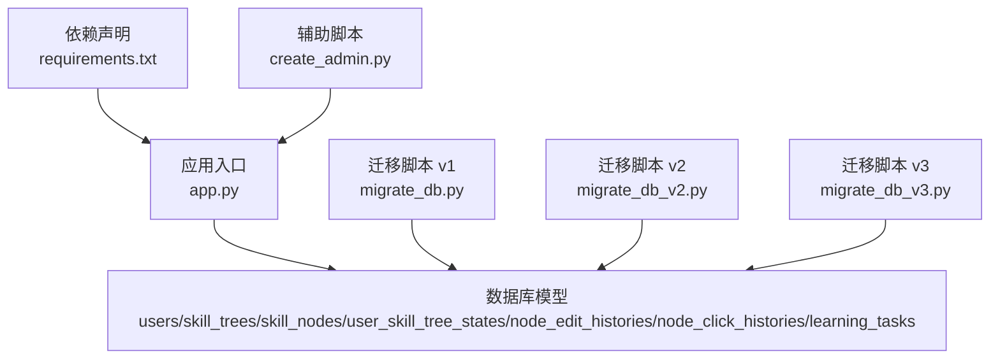
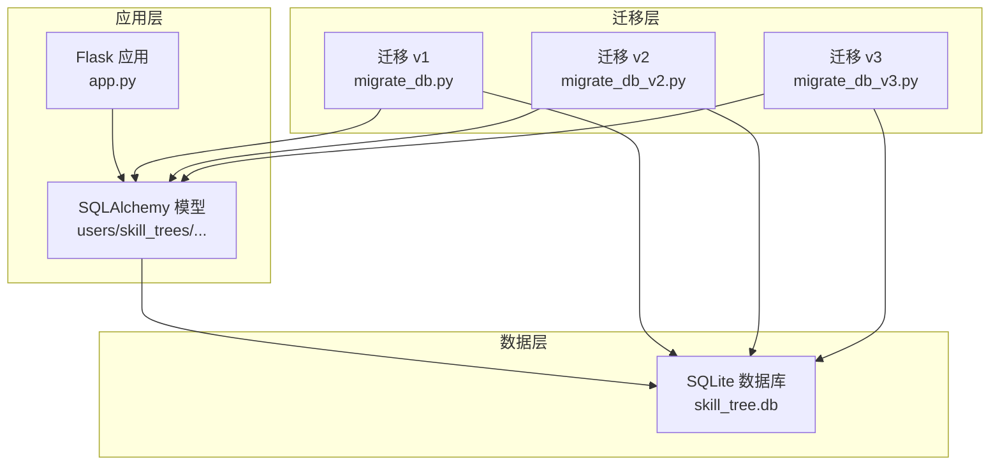
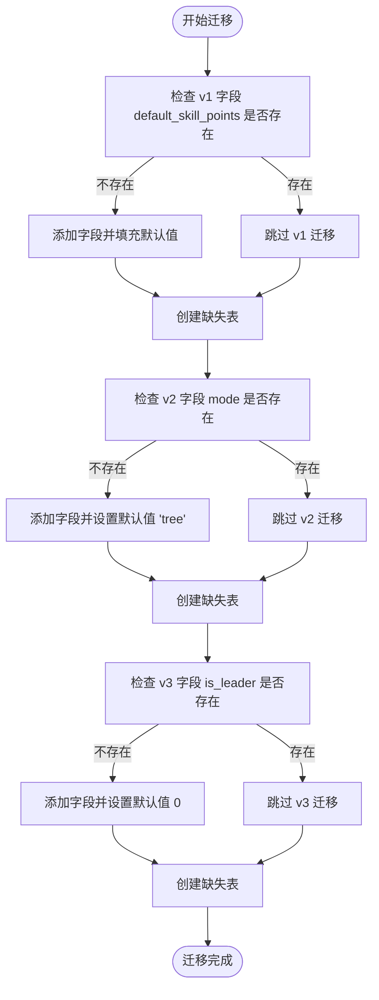
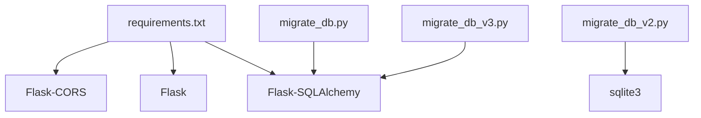

# 数据迁移策略

<cite>
**本文引用的文件**
- [migrate_db.py](file://migrate_db.py)
- [migrate_db_v2.py](file://migrate_db_v2.py)
- [migrate_db_v3.py](file://migrate_db_v3.py)
- [app.py](file://app.py)
- [README.md](file://README.md)
- [requirements.txt](file://requirements.txt)
- [create_admin.py](file://create_admin.py)
</cite>

## 目录
1. [简介](#简介)
2. [项目结构](#项目结构)
3. [核心组件](#核心组件)
4. [架构总览](#架构总览)
5. [详细组件分析](#详细组件分析)
6. [依赖分析](#依赖分析)
7. [性能考虑](#性能考虑)
8. [故障排除指南](#故障排除指南)
9. [结论](#结论)
10. [附录](#附录)

## 简介
本文件面向数据库管理员与开发工程师，系统化阐述技能树管理系统的数据库版本管理与迁移策略。重点覆盖从 v1 到 v2 再到 v3 的数据库结构演进，解释 migrate_db 系列脚本的功能演进与版本升级策略；明确各版本的新增字段、表结构调整、索引优化与约束增强；给出迁移脚本的执行顺序与依赖关系、安全迁移步骤与回滚策略；详述数据兼容性处理、字段默认值设置与历史数据转换逻辑；并提供迁移前准备、迁移过程监控与迁移后验证方法。

## 项目结构
技能树系统采用 Flask + SQLAlchemy + SQLite 的轻量架构，数据库迁移通过独立脚本逐步演进，配合主应用模型定义实现结构升级与数据兼容。

图表来源
- [app.py:17-22](file://app.py#L17-L22)
- [migrate_db.py:5-6](file://migrate_db.py#L5-L6)
- [migrate_db_v2.py:1-2](file://migrate_db_v2.py#L1-L2)
- [migrate_db_v3.py:5-6](file://migrate_db_v3.py#L5-L6)
- [requirements.txt:1-5](file://requirements.txt#L1-L5)
- [create_admin.py:5-6](file://create_admin.py#L5-L6)

章节来源
- [README.md:61-78](file://README.md#L61-L78)
- [requirements.txt:1-5](file://requirements.txt#L1-L5)

## 核心组件
- 应用与数据库配置：Flask 应用通过 SQLAlchemy 连接 SQLite，默认数据库 URI 指向 skill_tree.db。
- 数据模型：包含用户、技能树、技能节点、用户技能树状态、节点编辑历史、节点点击历史与学习任务等表，定义了字段、索引与约束。
- 迁移脚本：v1/v2/v3 三个版本的迁移脚本分别负责添加默认技能点、激活模式字段与组长标志位，并创建缺失表。

章节来源
- [app.py:17-22](file://app.py#L17-L22)
- [app.py:25-177](file://app.py#L25-L177)
- [migrate_db.py:8-36](file://migrate_db.py#L8-L36)
- [migrate_db_v2.py:6-30](file://migrate_db_v2.py#L6-L30)
- [migrate_db_v3.py:8-31](file://migrate_db_v3.py#L8-L31)

## 架构总览
系统采用“模型驱动 + 脚本增量”的数据库演进方式。主应用模型定义当前数据库结构，迁移脚本负责在既有数据库上进行增量升级，确保向后兼容与数据安全。

图表来源
- [app.py:17-22](file://app.py#L17-L22)
- [migrate_db.py:5-6](file://migrate_db.py#L5-L6)
- [migrate_db_v2.py:4](file://migrate_db_v2.py#L4)
- [migrate_db_v3.py:5](file://migrate_db_v3.py#L5)

## 详细组件分析

### 数据库版本演进与结构变化

- v1 版本（迁移脚本 migrate_db.py）
  - 新增字段：为 skill_trees 表添加 default_skill_points，默认值为 10。
  - 数据兼容：若字段不存在则添加并为已有记录填充默认值；若已存在则跳过。
  - 表创建：调用 db.create_all() 确保缺失表被创建。
  - 异常处理：捕获异常并输出恢复指引（删除数据库文件后重启服务以重建）。

- v2 版本（迁移脚本 migrate_db_v2.py）
  - 新增字段：为 skill_trees 表添加 mode 字段，默认值为 'tree'。
  - 兼容性：通过 PRAGMA 查询表结构，若字段不存在则添加。
  - 执行环境：直接使用 sqlite3 连接数据库文件，无需 Flask 上下文。

- v3 版本（迁移脚本 migrate_db_v3.py）
  - 新增字段：为 users 表添加 is_leader 字段，默认值为 0（布尔）。
  - 表创建：同样调用 db.create_all() 确保缺失表被创建。
  - 异常处理：捕获异常并提示失败原因。

章节来源
- [migrate_db.py:8-36](file://migrate_db.py#L8-L36)
- [migrate_db_v2.py:6-30](file://migrate_db_v2.py#L6-L30)
- [migrate_db_v3.py:8-31](file://migrate_db_v3.py#L8-L31)

### 迁移脚本功能演进与版本升级策略
- 一致性原则：各版本脚本均先检测目标字段是否存在，避免重复执行导致的错误。
- 渐进式升级：v1 → v2 → v3，每次仅做必要改动，降低风险。
- 安全回退：v1 提供了删除数据库文件后重建的回退路径。
- 幂等性：v2/v3 通过字段存在性检查实现幂等执行。

章节来源
- [migrate_db.py:12-24](file://migrate_db.py#L12-L24)
- [migrate_db_v2.py:15-25](file://migrate_db_v2.py#L15-L25)
- [migrate_db_v3.py:12-23](file://migrate_db_v3.py#L12-L23)

### 数据库结构与索引优化
- skill_nodes 表
  - 主键：id
  - 索引：idx_tree_node(tree_id, node_id)，用于加速节点查询
  - 唯一性：通过复合唯一约束保证用户在技能树中每个节点状态唯一
- user_skill_tree_states 表
  - 主键：id
  - 唯一索引：idx_user_tree_node(user_id, tree_id, node_id)
  - 唯一约束：uq_user_tree_node(user_id, tree_id, node_id)
- learning_tasks 表
  - 主键：id
  - 外键：user_id、tree_id、node_id 对应 users、skill_trees、skill_nodes
  - 状态：assigned/pending/completed
- users 表
  - 新增字段：is_leader（v3），默认 0
- skill_trees 表
  - 新增字段：default_skill_points（v1，默认 10）、mode（v2，默认 'tree'）

章节来源
- [app.py:63-121](file://app.py#L63-L121)
- [app.py:153-177](file://app.py#L153-L177)
- [app.py:25-40](file://app.py#L25-L40)

### 迁移脚本执行顺序与依赖关系
- 执行顺序：v1 → v2 → v3
- 依赖关系：v2 不依赖 v1 的结果，v3 不依赖 v2 的结果；三者均可独立运行且具备幂等性。
- 顺序建议：按版本号顺序依次执行，确保字段与表结构按预期演进。

章节来源
- [migrate_db.py:8-36](file://migrate_db.py#L8-L36)
- [migrate_db_v2.py:6-30](file://migrate_db_v2.py#L6-L30)
- [migrate_db_v3.py:8-31](file://migrate_db_v3.py#L8-L31)

### 数据兼容性处理、默认值与历史数据转换
- default_skill_points（v1）
  - 兼容：若字段不存在则添加并填充默认值 10
  - 影响：新增字段后，新旧记录均具备默认技能点
- mode（v2）
  - 兼容：若字段不存在则添加默认值 'tree'
  - 影响：支持树状自下而上与线性进阶两种激活模式
- is_leader（v3）
  - 兼容：若字段不存在则添加默认值 0（布尔）
  - 影响：新增用户角色维度，便于权限控制
- 历史数据转换：v1 通过 UPDATE 语句为 NULL 值填充默认值，确保历史记录一致性。

章节来源
- [migrate_db.py:17-21](file://migrate_db.py#L17-L21)
- [migrate_db_v2.py:19-23](file://migrate_db_v2.py#L19-L23)
- [migrate_db_v3.py:17-21](file://migrate_db_v3.py#L17-L21)

### 迁移流程与回滚策略

图表来源
- [migrate_db.py:8-36](file://migrate_db.py#L8-L36)
- [migrate_db_v2.py:6-30](file://migrate_db_v2.py#L6-L30)
- [migrate_db_v3.py:8-31](file://migrate_db_v3.py#L8-L31)

回滚策略
- v1 回滚：若迁移失败，停止服务，删除数据库文件，重启服务以重建数据库。
- v2/v3 回滚：由于字段默认值与表创建具备幂等性，可再次运行对应脚本确认状态；若仍需回滚，建议备份数据库后手动撤销 ALTER 操作。

章节来源
- [migrate_db.py:30-36](file://migrate_db.py#L30-L36)

### 迁移前准备、过程监控与迁移后验证

- 迁移前准备
  - 备份数据库文件（skill_tree.db）
  - 停止后端服务，确保数据库无并发写入
  - 确认 Python 环境与依赖满足要求（Flask、SQLAlchemy、Flask-CORS）
- 迁移过程监控
  - 观察脚本输出日志，确认每步迁移成功
  - 检查字段是否存在与默认值是否正确
  - 确认 db.create_all() 未报错
- 迁移后验证
  - 登录系统，检查技能树与用户数据是否正常
  - 验证新增字段在界面与 API 中可见
  - 执行基础 API 请求，确保服务正常

章节来源
- [requirements.txt:1-5](file://requirements.txt#L1-L5)
- [README.md:80-111](file://README.md#L80-L111)

## 依赖分析
- 运行时依赖：Flask、Flask-SQLAlchemy、Flask-CORS
- 迁移脚本依赖：SQLAlchemy Inspector（v1）、sqlite3（v2）、Flask 应用上下文（v3）

图表来源
- [requirements.txt:1-5](file://requirements.txt#L1-L5)
- [migrate_db.py:5-6](file://migrate_db.py#L5-L6)
- [migrate_db_v2.py:1](file://migrate_db_v2.py#L1)
- [migrate_db_v3.py:5](file://migrate_db_v3.py#L5)

章节来源
- [requirements.txt:1-5](file://requirements.txt#L1-L5)

## 性能考虑
- 索引优化：skill_nodes 的 idx_tree_node 与 user_skill_tree_states 的唯一索引/约束提升查询与去重效率。
- 幂等执行：迁移脚本通过存在性检查避免重复 ALTER，减少不必要的元数据变更。
- 批量创建：db.create_all() 一次性创建缺失表，减少多次往返。

章节来源
- [app.py:101-121](file://app.py#L101-L121)

## 故障排除指南
- 迁移失败
  - v1：根据脚本提示删除数据库文件并重启服务以重建
  - v2/v3：检查字段是否存在与默认值是否正确，确认 db.create_all() 成功
- 权限与路径
  - 确保数据库文件路径可写，v2 脚本硬编码了绝对路径，需确认路径正确
- 依赖缺失
  - 确认已安装 requirements.txt 中的依赖

章节来源
- [migrate_db.py:30-36](file://migrate_db.py#L30-L36)
- [migrate_db_v2.py:4](file://migrate_db_v2.py#L4)
- [requirements.txt:1-5](file://requirements.txt#L1-L5)

## 结论
本迁移策略以“模型驱动 + 脚本增量”为核心，通过 v1/v2/v3 三阶段迁移实现字段与表结构的渐进式演进。脚本具备幂等性与安全性，结合备份与回滚策略，可在生产环境中稳妥推进数据库版本升级。建议严格遵循执行顺序与验证流程，确保数据一致与系统稳定。

## 附录

### 迁移操作指南（数据库管理员）
- 准备阶段
  - 备份 skill_tree.db
  - 停止后端服务
  - 确认 Python 环境与依赖
- 执行阶段
  - 依次运行 migrate_db.py、migrate_db_v2.py、migrate_db_v3.py
  - 观察日志输出，确认每步成功
- 验证阶段
  - 启动服务，登录系统
  - 检查技能树与用户数据
  - 执行基础 API 请求

章节来源
- [README.md:80-111](file://README.md#L80-L111)
- [migrate_db.py:8-36](file://migrate_db.py#L8-L36)
- [migrate_db_v2.py:6-30](file://migrate_db_v2.py#L6-L30)
- [migrate_db_v3.py:8-31](file://migrate_db_v3.py#L8-L31)