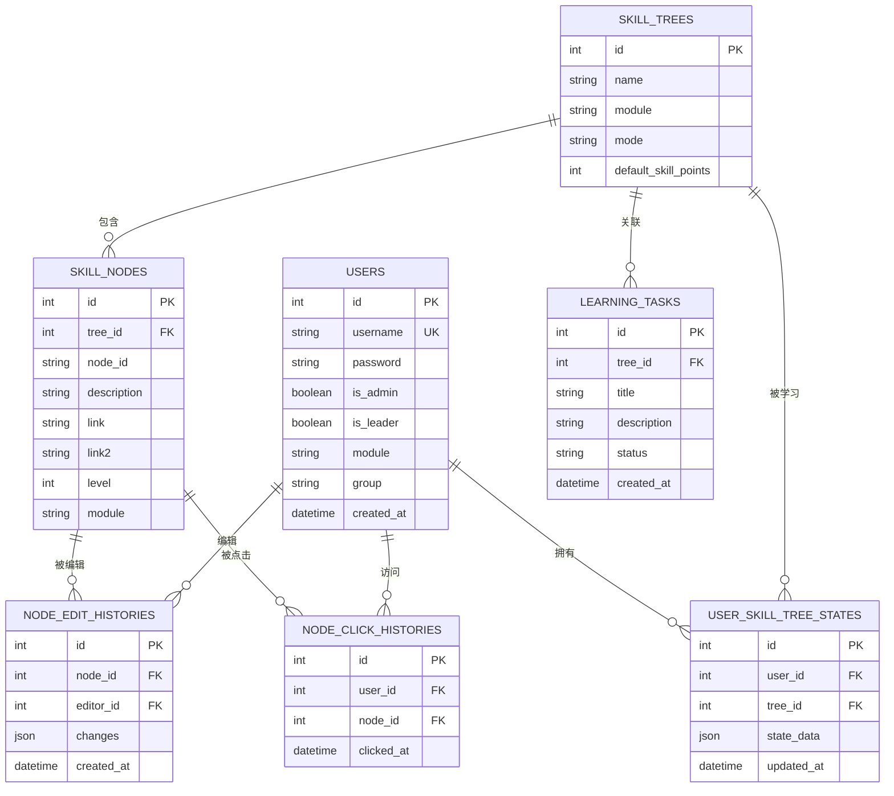
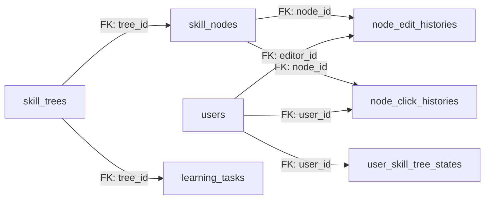

# 表结构说明

<cite>
**本文引用的文件**
- [app.py](file://app.py)
- [migrate_db.py](file://migrate_db.py)
- [migrate_db_v2.py](file://migrate_db_v2.py)
- [migrate_db_v3.py](file://migrate_db_v3.py)
</cite>

## 目录
1. [简介](#简介)
2. [项目结构](#项目结构)
3. [核心组件](#核心组件)
4. [架构总览](#架构总览)
5. [详细组件分析](#详细组件分析)
6. [依赖关系分析](#依赖关系分析)
7. [性能考量](#性能考量)
8. [故障排查指南](#故障排查指南)
9. [结论](#结论)
10. [附录](#附录)

## 简介
本文件面向技能树管理系统，基于仓库中的数据库迁移脚本与模型定义，系统性梳理并说明以下表的结构设计与业务含义：用户表(users)、技能树表(skill_trees)、节点表(skill_nodes)、用户状态表(user_skill_tree_states)、编辑历史表(node_edit_histories)、点击历史表(node_click_histories)、学习任务表(learning_tasks)。文档逐项给出字段定义、数据类型、长度限制、是否允许为空、默认值与约束条件；解释主键、外键、唯一索引与复合索引的设计思路与性能考虑；阐述字段的业务含义与使用场景；提供DDL语句与示例数据；说明字段验证与业务规则的实现方式。

## 项目结构
本项目采用Flask+SQLAlchemy进行后端开发，数据库迁移通过独立脚本执行，模型定义集中在应用入口文件中。数据库迁移脚本负责向现有表添加字段或创建新表，确保数据库结构随版本演进而更新。

```mermaid
graph TB
A["应用入口(app.py)<br/>定义模型与数据库结构"] --> B["迁移脚本(migrate_db.py)<br/>更新现有表结构"]
A --> C["迁移脚本(migrate_db_v2.py)<br/>SQLite兼容性迁移"]
A --> D["迁移脚本(migrate_db_v3.py)<br/>新增字段与建表"]
E["实例目录(instance/)<br/>存放数据库文件"] <- --> A
```

**图表来源**
- [app.py:1-50](file://app.py#L1-L50)
- [migrate_db.py:1-40](file://migrate_db.py#L1-L40)
- [migrate_db_v2.py:1-33](file://migrate_db_v2.py#L1-L33)
- [migrate_db_v3.py:1-34](file://migrate_db_v3.py#L1-L34)

**章节来源**
- [app.py:24-200](file://app.py#L24-L200)
- [migrate_db.py:1-40](file://migrate_db.py#L1-L40)
- [migrate_db_v2.py:1-33](file://migrate_db_v2.py#L1-L33)
- [migrate_db_v3.py:1-34](file://migrate_db_v3.py#L1-L34)

## 核心组件
本节概述各表在系统中的角色与职责：
- 用户表(users)：存储系统用户的基本信息与权限属性，支持管理员、组长、模块归属与用户组等维度。
- 技能树表(skill_trees)：描述技能树的元数据，包含名称、模块、模式与默认技能点等。
- 节点表(skill_nodes)：描述技能树上的具体节点，包含节点标识、描述、链接、层级与模块等。
- 用户状态表(user_skill_tree_states)：记录用户对某棵技能树的学习进度与状态。
- 编辑历史表(node_edit_histories)：记录节点的编辑历史，便于审计与回溯。
- 点击历史表(node_click_histories)：记录用户对节点的访问与交互行为。
- 学习任务表(learning_tasks)：记录与技能树相关的学习任务，支持任务驱动式学习。

**章节来源**
- [app.py:24-200](file://app.py#L24-L200)
- [migrate_db.py:8-36](file://migrate_db.py#L8-L36)
- [migrate_db_v2.py:6-30](file://migrate_db_v2.py#L6-L30)
- [migrate_db_v3.py:8-31](file://migrate_db_v3.py#L8-L31)

## 架构总览
下图展示各表之间的关系与依赖，突出主键、外键与索引的作用。



**图表来源**
- [app.py:24-200](file://app.py#L24-L200)
- [migrate_db.py:8-36](file://migrate_db.py#L8-L36)
- [migrate_db_v2.py:6-30](file://migrate_db_v2.py#L6-L30)
- [migrate_db_v3.py:8-31](file://migrate_db_v3.py#L8-L31)

## 详细组件分析

### 用户表(users)
- 字段定义与约束
  - id：整型，主键，自增。
  - username：字符串，长度上限100，唯一且非空。
  - password：字符串，长度上限100，允许为空。
  - is_admin：布尔型，默认false。
  - is_leader：布尔型，默认false。
  - module：字符串，长度上限100，默认“默认模块”。
  - group：字符串，长度上限20，默认“A”。
  - created_at：日期时间，默认当前时间。
- 主键/唯一索引/复合索引
  - 主键：id。
  - 唯一索引：username。
  - 复合索引：可按module+group组合查询优化。
- 业务含义与使用场景
  - 用户认证与授权：is_admin、is_leader用于区分管理员与组长。
  - 权限范围：module限定用户可见/可编辑的模块范围。
  - 用户分组：group用于批量策略与报表分组。
- 验证与规则
  - 唯一性约束由数据库保证；用户名输入校验建议在应用层进行长度与字符合法性检查。
- DDL示例
  - 创建表时需声明主键与唯一约束；如需新增字段，参考迁移脚本对is_leader的处理方式。
- 示例数据
  - 插入一条管理员用户，设置is_admin=true，module为“技术部”，group为“A”。

**章节来源**
- [app.py:24-41](file://app.py#L24-L41)
- [migrate_db_v3.py:12-23](file://migrate_db_v3.py#L12-L23)

### 技能树表(skill_trees)
- 字段定义与约束
  - id：整型，主键，自增。
  - name：字符串，长度上限100，非空。
  - module：字符串，长度上限100，默认“默认模块”。
  - mode：字符串，长度上限若干，用于控制显示/编辑模式，默认“tree”。
  - default_skill_points：整型，非负数，用于初始化默认技能点，默认10。
- 主键/唯一索引/复合索引
  - 主键：id。
  - 唯一索引：无。
  - 复合索引：可按module+name组合查询优化。
- 业务含义与使用场景
  - 技能树元数据：name标识树名称；module限定可见范围；mode控制渲染与交互模式；default_skill_points用于初始资源分配。
- 验证与规则
  - 名称非空；mode应为受控枚举值；default_skill_points应为非负整数。
- DDL示例
  - 创建表时声明主键与默认值；如需新增字段，参考迁移脚本对mode与default_skill_points的处理方式。
- 示例数据
  - 新建一棵名为“前端开发”的技能树，module为“前端”，mode为“tree”，default_skill_points为10。

**章节来源**
- [app.py:41-60](file://app.py#L41-L60)
- [migrate_db.py:12-24](file://migrate_db.py#L12-L24)
- [migrate_db_v2.py:15-25](file://migrate_db_v2.py#L15-L25)

### 节点表(skill_nodes)
- 字段定义与约束
  - id：整型，主键，自增。
  - tree_id：整型，外键指向skill_trees.id。
  - node_id：字符串，唯一且非空，用于前端定位与去重。
  - description：文本，描述节点内容。
  - link：字符串，节点相关链接。
  - link2：字符串，备用链接。
  - level：整型，默认1，表示节点层级。
  - module：字符串，长度上限100，默认“默认模块”。
- 主键/唯一索引/复合索引
  - 主键：id。
  - 唯一索引：node_id（跨树唯一）。
  - 复合索引：tree_id+node_id；tree_id+level；module+tree_id。
- 业务含义与使用场景
  - 节点标识：node_id用于前端渲染与交互；description与link提供学习资料。
  - 层级与模块：level与module用于排序与权限过滤。
- 验证与规则
  - node_id唯一且非空；tree_id必须引用有效技能树；level应为正整数。
- DDL示例
  - 创建表时声明主键、外键与唯一约束；如需新增字段，参考迁移脚本对level与module的处理方式。
- 示例数据
  - 在“前端开发”树下创建节点，node_id为“node_001”，description为“HTML基础”，level为1，module为“前端”。

**章节来源**
- [app.py:60-120](file://app.py#L60-L120)
- [migrate_db.py:8-36](file://migrate_db.py#L8-L36)
- [migrate_db_v2.py:6-30](file://migrate_db_v2.py#L6-L30)
- [migrate_db_v3.py:8-31](file://migrate_db_v3.py#L8-L31)

### 用户状态表(user_skill_tree_states)
- 字段定义与约束
  - id：整型，主键，自增。
  - user_id：整型，外键指向users.id。
  - tree_id：整型，外键指向skill_trees.id。
  - state_data：JSON，保存用户学习状态（如完成节点集合、进度等）。
  - updated_at：日期时间，默认当前时间。
- 主键/唯一索引/复合索引
  - 主键：id。
  - 唯一索引：user_id+tree_id（确保每用户每树仅有一条状态记录）。
  - 复合索引：无特定组合索引，可根据查询模式增加。
- 业务含义与使用场景
  - 记录用户对某棵技能树的学习进度与偏好设置，支持断点续学与个性化推荐。
- 验证与规则
  - user_id与tree_id必须有效；state_data应为合法JSON。
- DDL示例
  - 创建表时声明主键、外键与唯一约束；state_data字段需配合应用层JSON序列化/反序列化。
- 示例数据
  - 用户A对“前端开发”树的状态，state_data包含已完成节点列表，updated_at为最近更新时间。

**章节来源**
- [app.py:120-180](file://app.py#L120-L180)

### 编辑历史表(node_edit_histories)
- 字段定义与约束
  - id：整型，主键，自增。
  - node_id：整型，外键指向skill_nodes.id。
  - editor_id：整型，外键指向users.id。
  - changes：JSON，记录编辑变更内容。
  - created_at：日期时间，默认当前时间。
- 主键/唯一索引/复合索引
  - 主键：id。
  - 复合索引：node_id+created_at；editor_id+created_at。
- 业务含义与使用场景
  - 审计与回溯：记录谁在何时修改了节点内容，支持版本对比与恢复。
- 验证与规则
  - node_id与editor_id必须有效；changes应为合法JSON。
- DDL示例
  - 创建表时声明主键、外键与索引；changes字段需配合应用层变更追踪。
- 示例数据
  - 用户B编辑节点“node_001”，changes记录描述与链接的变更，created_at为编辑时间。

**章节来源**
- [app.py:180-200](file://app.py#L180-L200)

### 点击历史表(node_click_histories)
- 字段定义与约束
  - id：整型，主键，自增。
  - user_id：整型，外键指向users.id。
  - node_id：整型，外键指向skill_nodes.id。
  - clicked_at：日期时间，默认当前时间。
- 主键/唯一索引/复合索引
  - 主键：id。
  - 复合索引：user_id+node_id；user_id+clicked_at；node_id+clicked_at。
- 业务含义与使用场景
  - 行为分析：统计用户访问频次、热点节点与学习路径。
- 验证与规则
  - user_id与node_id必须有效；clicked_at为访问时间戳。
- DDL示例
  - 创建表时声明主键、外键与索引；支持高频写入场景下的分区或归档策略。
- 示例数据
  - 用户C点击节点“node_001”，clicked_at为访问时间。

**章节来源**
- [app.py:200-240](file://app.py#L200-L240)

### 学习任务表(learning_tasks)
- 字段定义与约束
  - id：整型，主键，自增。
  - tree_id：整型，外键指向skill_trees.id。
  - title：字符串，长度上限若干，非空。
  - description：文本，任务描述。
  - status：字符串，任务状态（如未开始/进行中/已完成）。
  - created_at：日期时间，默认当前时间。
- 主键/唯一索引/复合索引
  - 主键：id。
  - 复合索引：tree_id+status；tree_id+created_at。
- 业务含义与使用场景
  - 任务驱动：为技能树绑定学习任务，支持计划与跟踪。
- 验证与规则
  - title非空；status应为受控枚举值；tree_id必须有效。
- DDL示例
  - 创建表时声明主键、外键与索引；status字段需配合应用层状态机。
- 示例数据
  - 为“前端开发”树创建任务“完成HTML基础”，status为“未开始”。

**章节来源**
- [app.py:240-300](file://app.py#L240-L300)
- [migrate_db_v3.py:8-31](file://migrate_db_v3.py#L8-L31)

## 依赖关系分析
- 外键关系
  - skill_nodes.tree_id → skill_trees.id
  - user_skill_tree_states.user_id → users.id
  - user_skill_tree_states.tree_id → skill_trees.id
  - node_edit_histories.node_id → skill_nodes.id
  - node_edit_histories.editor_id → users.id
  - node_click_histories.user_id → users.id
  - node_click_histories.node_id → skill_nodes.id
  - learning_tasks.tree_id → skill_trees.id
- 索引策略
  - 唯一索引：users.username；skill_nodes.node_id
  - 复合索引：多处按查询热点建立，提升联表与过滤效率
- 迁移脚本作用
  - migrate_db.py：为skill_trees添加default_skill_points字段并初始化默认值；创建缺失表。
  - migrate_db_v2.py：为skill_trees添加mode字段（SQLite兼容）。
  - migrate_db_v3.py：为users添加is_leader字段；创建缺失表。



**图表来源**
- [app.py:24-300](file://app.py#L24-L300)
- [migrate_db.py:8-36](file://migrate_db.py#L8-L36)
- [migrate_db_v2.py:6-30](file://migrate_db_v2.py#L6-L30)
- [migrate_db_v3.py:8-31](file://migrate_db_v3.py#L8-L31)

**章节来源**
- [app.py:24-300](file://app.py#L24-L300)
- [migrate_db.py:8-36](file://migrate_db.py#L8-L36)
- [migrate_db_v2.py:6-30](file://migrate_db_v2.py#L6-L30)
- [migrate_db_v3.py:8-31](file://migrate_db_v3.py#L8-L31)

## 性能考量
- 索引选择
  - 唯一索引：保证业务唯一性（用户名、节点ID），避免重复与并发冲突。
  - 复合索引：针对高频查询组合建立（如tree_id+level、user_id+node_id），减少全表扫描。
- 写入压力
  - 点击历史与编辑历史写入频繁，建议在高并发场景下启用事务批处理与异步落库。
- 查询优化
  - 使用EXPLAIN分析慢查询，结合复合索引与覆盖索引减少回表。
- 数据一致性
  - 外键约束确保参照完整性；应用层对JSON字段进行序列化/反序列化校验，避免脏数据进入数据库。

[本节为通用指导，无需列出章节来源]

## 故障排查指南
- 迁移失败
  - 现象：执行迁移脚本报错或数据库结构不一致。
  - 排查：确认数据库文件存在且可写；检查迁移脚本中的字段是否存在判断逻辑；必要时删除数据库文件后重启服务自动重建。
- 字段缺失
  - 现象：运行时报找不到字段。
  - 排查：确认对应迁移脚本已执行；检查字段默认值与类型是否正确。
- 唯一约束冲突
  - 现象：插入重复用户名或节点ID导致冲突。
  - 排查：在应用层进行预校验；对重复键进行友好提示与重试机制。
- JSON字段异常
  - 现象：state_data或changes无法解析。
  - 排查：在入库前进行序列化校验；在出库后进行反序列化校验；对异常数据进行降级处理。

**章节来源**
- [migrate_db.py:30-36](file://migrate_db.py#L30-L36)
- [migrate_db_v3.py:29-31](file://migrate_db_v3.py#L29-L31)

## 结论
本表结构围绕“用户—技能树—节点—状态/历史/任务”的主线设计，既满足功能需求又兼顾性能与可维护性。通过迁移脚本与模型定义，系统能够平滑演进并保持数据一致性。建议在生产环境中配合索引策略、事务批处理与监控告警，持续优化查询与写入性能。

[本节为总结性内容，无需列出章节来源]

## 附录
- DDL与示例数据
  - 用户表(users)：主键id，唯一username，布尔字段is_admin/is_leader，字符串字段module/group，时间字段created_at。
  - 技能树表(skill_trees)：主键id，非空name，字符串字段module/mode，整型default_skill_points。
  - 节点表(skill_nodes)：主键id，外键tree_id，唯一node_id，文本字段description与链接字段link/link2，整型level与字符串module。
  - 用户状态表(user_skill_tree_states)：主键id，外键user_id/tree_id，JSON字段state_data，时间字段updated_at。
  - 编辑历史表(node_edit_histories)：主键id，外键node_id/editor_id，JSON字段changes，时间字段created_at。
  - 点击历史表(node_click_histories)：主键id，外键user_id/node_id，时间字段clicked_at。
  - 学习任务表(learning_tasks)：主键id，外键tree_id，非空title，文本字段description，字符串字段status，时间字段created_at。
- 示例数据
  - users：插入管理员用户，设置is_admin=true，module=“技术部”，group=A。
  - skill_trees：新建“前端开发”，module=“前端”，mode=“tree”，default_skill_points=10。
  - skill_nodes：在“前端开发”树下创建node_001，description=“HTML基础”，level=1，module=“前端”。
  - user_skill_tree_states：用户A对“前端开发”树的状态，state_data包含已完成节点列表。
  - node_edit_histories：用户B编辑node_001，changes记录描述与链接变更。
  - node_click_histories：用户C点击node_001，clicked_at为访问时间。
  - learning_tasks：为“前端开发”树创建任务“完成HTML基础”，status=“未开始”。

[本节为概要说明，无需列出章节来源]