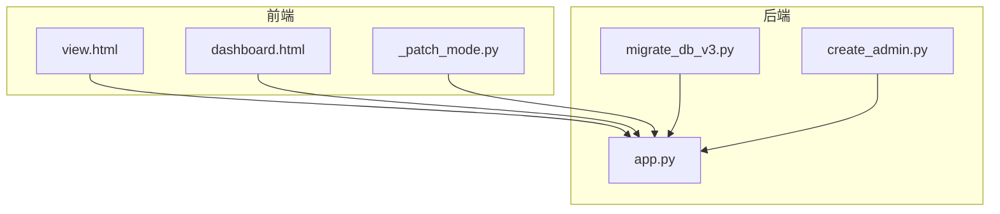
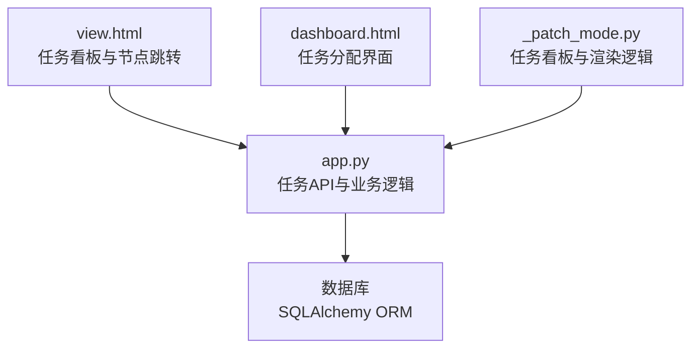
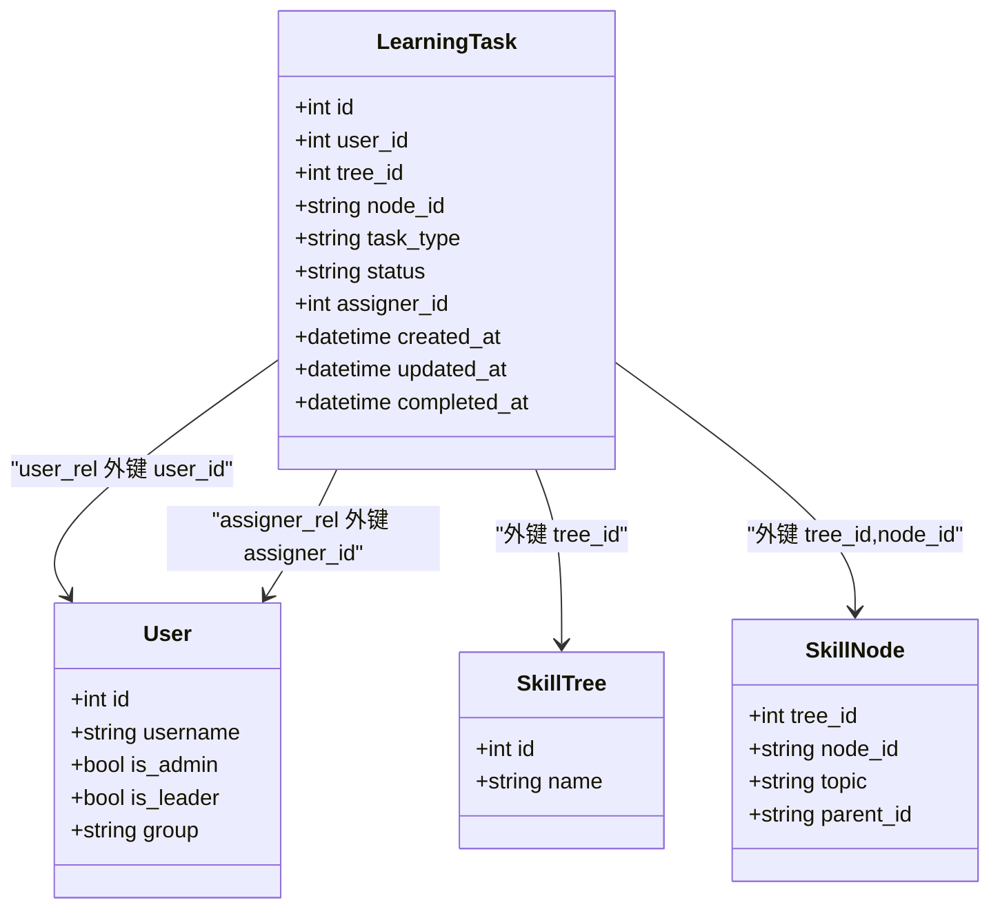
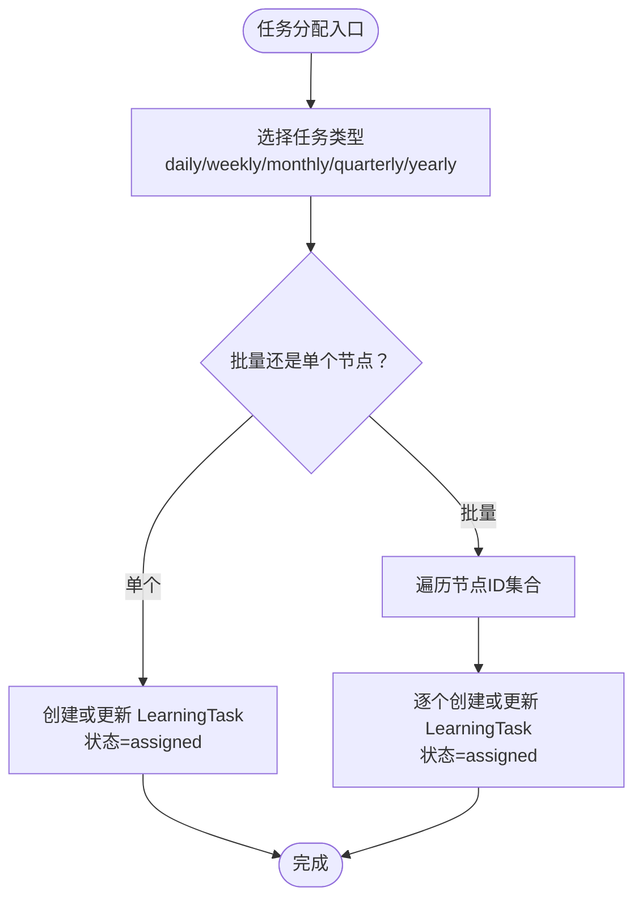
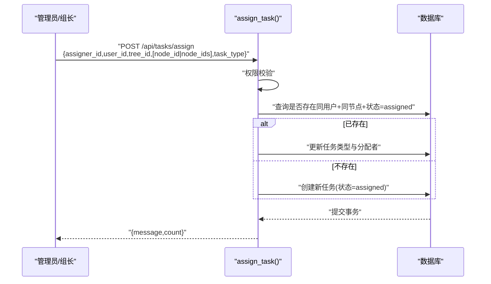
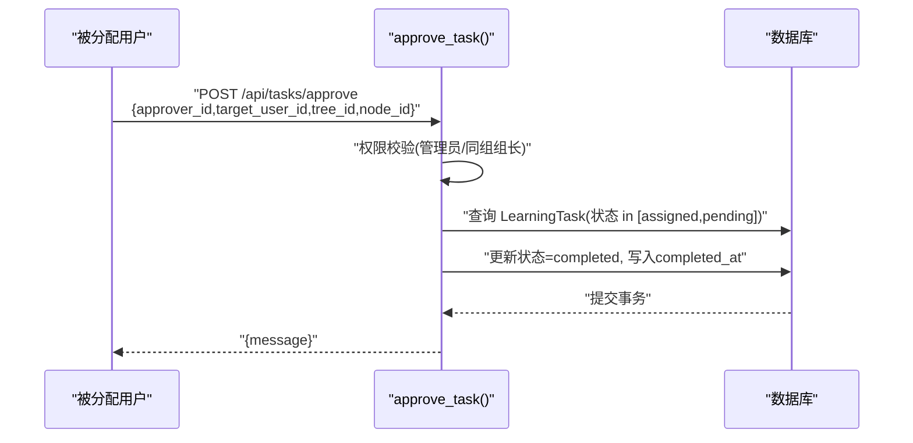
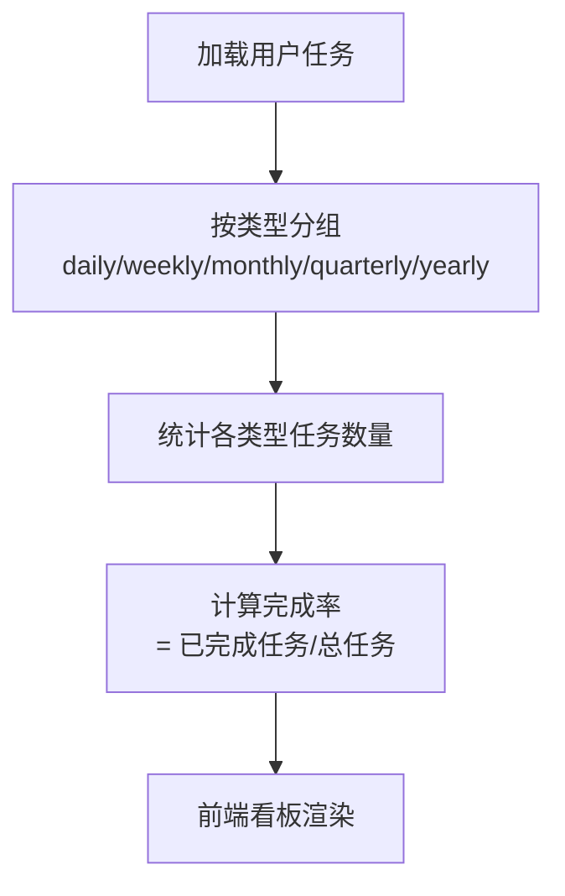
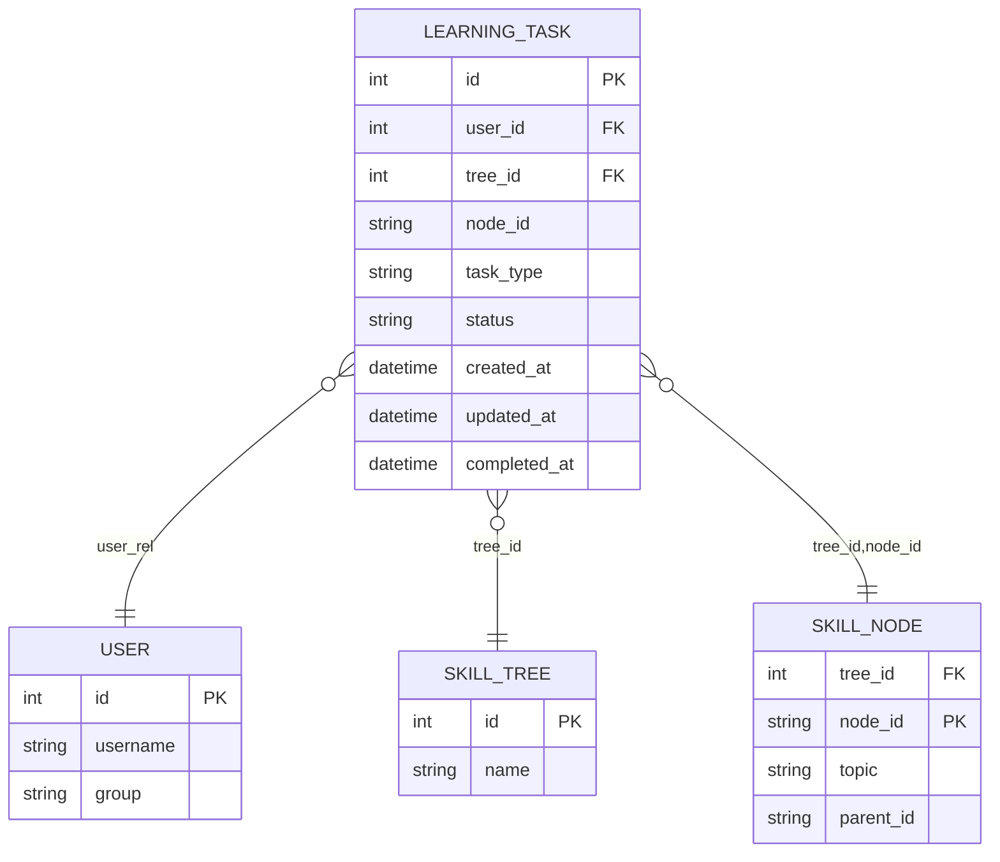
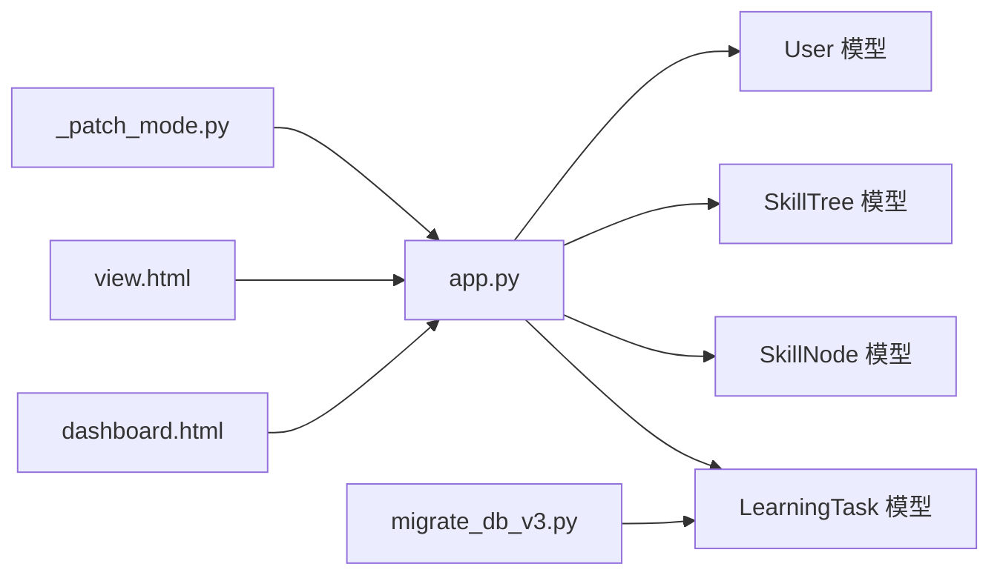

# 任务管理系统模块

<cite>
**本文引用的文件**
- [app.py](file://app.py)
- [_patch_mode.py](file://_patch_mode.py)
- [dashboard.html](file://dashboard.html)
- [view.html](file://view.html)
- [migrate_db_v3.py](file://migrate_db_v3.py)
- [create_admin.py](file://create_admin.py)
</cite>

## 目录
1. [简介](#简介)
2. [项目结构](#项目结构)
3. [核心组件](#核心组件)
4. [架构总览](#架构总览)
5. [详细组件分析](#详细组件分析)
6. [依赖分析](#依赖分析)
7. [性能考虑](#性能考虑)
8. [故障排查指南](#故障排查指南)
9. [结论](#结论)
10. [附录](#附录)

## 简介
本技术文档围绕“任务管理系统模块”展开，重点覆盖以下方面：
- LearningTask 模型设计与任务生命周期管理
- 任务类型分类体系（daily、weekly、monthly、quarterly、yearly）及其业务逻辑
- 任务分配机制（自动分配与手动分配策略）
- 任务审核流程（状态转换：assigned → pending → completed）与审批权限控制
- 任务进度跟踪（完成时间记录与统计分析）
- 任务与用户技能树的关联关系与学习效果评估机制
- 任务管理 API 的完整接口文档与使用示例
- 性能优化与批量处理策略
- 管理员任务报表与数据分析功能的使用指导

## 项目结构
该模块位于 Python Web 应用中，核心实现集中在后端应用文件中，并通过前端页面进行交互展示。关键文件与职责如下：
- 后端应用与模型定义：app.py
- 任务看板与前端交互：_patch_mode.py、view.html、dashboard.html
- 数据库迁移与初始化：migrate_db_v3.py、create_admin.py

**图表来源**
- [app.py](file://app.py)
- [_patch_mode.py](file://_patch_mode.py)
- [dashboard.html](file://dashboard.html)
- [view.html](file://view.html)
- [migrate_db_v3.py](file://migrate_db_v3.py)
- [create_admin.py](file://create_admin.py)

**章节来源**
- [app.py](file://app.py)
- [_patch_mode.py](file://_patch_mode.py)
- [dashboard.html](file://dashboard.html)
- [view.html](file://view.html)
- [migrate_db_v3.py](file://migrate_db_v3.py)
- [create_admin.py](file://create_admin.py)

## 核心组件
- LearningTask 模型：用于持久化学习任务，包含任务类型、状态、分配者、创建与更新时间以及完成时间等字段。
- 任务分配接口：支持管理员/组长对单个或多个技能节点进行批量分配。
- 待审核查询接口：供管理员/组长查询待审核的任务请求。
- 任务审核接口：将任务从 assigned/pending 转换为 completed 并记录完成时间。
- 用户任务查询接口：按任务类型分组返回当前用户的待完成任务。

**章节来源**
- [app.py:153-177](file://app.py#L153-L177)
- [app.py:1843-1896](file://app.py#L1843-L1896)
- [app.py:1918-1971](file://app.py#L1918-L1971)
- [app.py:1973-2028](file://app.py#L1973-L2028)
- [app.py:2029-2072](file://app.py#L2029-L2072)

## 架构总览
系统采用前后端分离架构：
- 前端负责任务看板渲染、用户交互与路由跳转
- 后端提供 RESTful API，处理任务分配、审核、查询与状态变更
- 数据库层由 SQLAlchemy ORM 驱动，LearningTask 与 User、SkillTree、SkillNode 存在外键关联

**图表来源**
- [app.py](file://app.py)
- [_patch_mode.py](file://_patch_mode.py)
- [dashboard.html](file://dashboard.html)
- [view.html](file://view.html)

## 详细组件分析

### LearningTask 模型与任务生命周期
- 字段与关系
  - 主键与外键：id、user_id、tree_id、node_id、assigner_id
  - 任务类型：task_type（枚举值包括 daily、weekly、monthly、quarterly、yearly）
  - 状态：status（默认 assigned）
  - 时间戳：created_at、updated_at、completed_at
  - 关联关系：user_rel、assigner_rel
- 生命周期状态
  - assigned：已分配，等待执行
  - pending：提交审核，等待批准
  - completed：审核通过，任务完成

**图表来源**
- [app.py:153-177](file://app.py#L153-L177)

**章节来源**
- [app.py:153-177](file://app.py#L153-L177)

### 任务类型分类体系与业务逻辑
- 类型定义
  - daily：当日任务
  - weekly：周计划
  - monthly：月目标
  - quarterly：季度挑战
  - yearly：年度项目
- 业务要点
  - 分配时可指定任务类型，默认 weekly
  - 用户侧查询接口按类型分组返回任务列表
  - 前端看板按类型列区分开显示

**图表来源**
- [app.py:1843-1896](file://app.py#L1843-L1896)
- [_patch_mode.py:1679-1706](file://_patch_mode.py#L1679-L1706)

**章节来源**
- [app.py:162-166](file://app.py#L162-L166)
- [app.py:1843-1896](file://app.py#L1843-L1896)
- [_patch_mode.py:1679-1706](file://_patch_mode.py#L1679-L1706)

### 任务分配机制（自动与手动）
- 自动分配
  - 在已有 assigned 且未完成的任务上，重复分配会更新任务类型与分配者，避免重复创建
- 手动分配
  - 管理员或组长通过接口一次性为一个或多个节点创建 LearningTask 记录
- 权限控制
  - 非管理员仅允许组长分配；组长仅可分配给同组成员
- 批量处理
  - 接口支持 node_id 与 node_ids 同时传入，自动去重合并处理

**图表来源**
- [app.py:1843-1896](file://app.py#L1843-L1896)

**章节来源**
- [app.py:1843-1896](file://app.py#L1843-L1896)

### 任务审核流程与权限控制
- 状态流转
  - assigned → pending（提交审核）
  - pending → completed（审核通过）
- 审核接口
  - approve_task()：根据 approver_id、target_user_id、tree_id、node_id 获取对应 LearningTask 并更新状态
- 权限控制
  - 仅管理员或同组组长可审核；跨组不可操作
- 完成时间记录
  - 审核通过后，completed_at 字段被写入当前时间

**图表来源**
- [app.py:2029-2072](file://app.py#L2029-L2072)

**章节来源**
- [app.py:2029-2072](file://app.py#L2029-L2072)

### 任务进度跟踪与统计分析
- 完成时间记录
  - 审核通过时写入 completed_at
- 统计维度
  - 按任务类型分组统计用户任务数量与完成率
  - 结合技能树节点激活状态，可进行学习进度对比分析
- 前端展示
  - 任务看板按类型列展示，支持点击跳转到具体技能节点

**图表来源**
- [app.py:1918-1971](file://app.py#L1918-L1971)
- [_patch_mode.py:2257-2286](file://_patch_mode.py#L2257-L2286)

**章节来源**
- [app.py:1918-1971](file://app.py#L1918-L1971)
- [_patch_mode.py:2257-2286](file://_patch_mode.py#L2257-L2286)

### 任务与用户技能树的关联与学习效果评估
- 关联关系
  - LearningTask 与 SkillTree、SkillNode 通过外键关联
  - 用户任务列表包含技能树名称、节点主题与层级路径
- 学习效果评估
  - 可结合技能树节点激活状态与任务完成情况，评估用户学习进度
  - 报表可按用户、技能树、模块维度汇总完成率与耗时

**图表来源**
- [app.py:153-177](file://app.py#L153-L177)

**章节来源**
- [app.py:1936-1971](file://app.py#L1936-L1971)

### 任务管理 API 完整接口文档
- 任务分配
  - 方法与路径：POST /api/tasks/assign
  - 请求体字段：
    - assigner_id：分配者用户ID（必填）
    - user_id：被分配用户ID（必填）
    - tree_id：技能树ID（必填）
    - node_id：单个技能节点ID（可选）
    - node_ids：节点ID数组（可选）
    - task_type：任务类型（可选，默认 weekly）
  - 返回：成功消息与分配数量
  - 权限：管理员或同组组长
- 取消任务
  - 方法与路径：DELETE /api/tasks/{task_id}
  - 查询参数：user_id（操作者ID，必填）
  - 权限：管理员或同组组长
- 我的任务
  - 方法与路径：GET /api/tasks/my
  - 查询参数：user_id（必填）
  - 返回：按类型分组的任务列表（包含树名、节点主题、层级路径、创建时间）
- 待审核列表
  - 方法与路径：GET /api/tasks/pending
  - 查询参数：user_id（必填）
  - 权限：管理员或同组组长
- 任务审核
  - 方法与路径：POST /api/tasks/approve
  - 请求体字段：
    - approver_id：审核者用户ID（必填）
    - user_id：被审核用户ID（必填）
    - tree_id：技能树ID（必填）
    - node_id：技能节点ID（必填）
  - 权限：管理员或同组组长

**章节来源**
- [app.py:1843-1896](file://app.py#L1843-L1896)
- [app.py:1897-1917](file://app.py#L1897-L1917)
- [app.py:1918-1971](file://app.py#L1918-L1971)
- [app.py:1973-2028](file://app.py#L1973-L2028)
- [app.py:2029-2072](file://app.py#L2029-L2072)

### 使用示例
- 分配任务（批量）
  - 请求：POST /api/tasks/assign
  - 参数：assigner_id、user_id、tree_id、node_ids=["A","B","C"]、task_type="weekly"
  - 响应：包含 message 与 count
- 查看我的任务
  - 请求：GET /api/tasks/my?user_id=123
  - 响应：按类型分组的任务数组
- 审核任务
  - 请求：POST /api/tasks/approve
  - 参数：approver_id、user_id、tree_id、node_id
  - 响应：成功消息

**章节来源**
- [app.py:1843-1896](file://app.py#L1843-L1896)
- [app.py:1918-1971](file://app.py#L1918-L1971)
- [app.py:2029-2072](file://app.py#L2029-L2072)

## 依赖分析
- 模块内依赖
  - app.py 中的 LearningTask 依赖 User、SkillTree、SkillNode
  - 任务 API 依赖数据库会话与权限校验
- 前后端依赖
  - 前端页面通过 fetch 调用后端 API，渲染任务看板与分配界面
- 数据库迁移
  - migrate_db_v3.py 引入 LearningTask 与相关外键约束

**图表来源**
- [app.py](file://app.py)
- [_patch_mode.py](file://_patch_mode.py)
- [dashboard.html](file://dashboard.html)
- [view.html](file://view.html)
- [migrate_db_v3.py](file://migrate_db_v3.py)

**章节来源**
- [app.py](file://app.py)
- [_patch_mode.py](file://_patch_mode.py)
- [dashboard.html](file://dashboard.html)
- [view.html](file://view.html)
- [migrate_db_v3.py](file://migrate_db_v3.py)

## 性能考虑
- 批量处理
  - 分配接口支持 node_ids 数组，减少多次往返请求
  - 对于大量节点分配，建议分批提交并设置合理的超时与重试
- 查询优化
  - 任务查询按 user_id 与 status 过滤，建议在 user_id、status、tree_id、node_id 上建立索引
  - 前端渲染时避免重复请求，缓存用户任务列表
- 审核并发
  - 审核接口需保证幂等性与并发安全，可在数据库层面加唯一约束或使用乐观锁
- 前端渲染
  - 任务看板按类型分栏渲染，避免一次性渲染过多节点导致卡顿

[本节为通用性能建议，无需特定文件来源]

## 故障排查指南
- 权限错误
  - 现象：返回 403 无权限
  - 排查：确认操作者是否管理员或同组组长，被分配/审核对象是否同组
- 缺少参数
  - 现象：返回 400 缺少必要参数
  - 排查：检查请求体字段是否齐全（如 user_id、tree_id、node_id 等）
- 任务不存在
  - 现象：返回 404
  - 排查：确认 task_id 或查询条件是否正确
- 审核失败
  - 现象：无法将任务从 assigned/pending 转为 completed
  - 排查：确认 LearningTask 是否存在且状态符合预期；检查 completed_at 是否已写入

**章节来源**
- [app.py:1843-1896](file://app.py#L1843-L1896)
- [app.py:1897-1917](file://app.py#L1897-L1917)
- [app.py:2029-2072](file://app.py#L2029-L2072)

## 结论
本模块通过 LearningTask 模型实现了完整的任务生命周期管理，结合任务类型分类、权限控制与审核流程，提供了清晰的任务分配与跟踪能力。配合前端任务看板与技能树关联，能够有效支撑学习进度评估与报表分析。建议在生产环境中进一步完善索引、批量处理与并发控制，确保高并发场景下的稳定性与性能。

[本节为总结性内容，无需特定文件来源]

## 附录

### 管理员任务报表与数据分析使用指导
- 功能入口
  - 通过 dashboard.html 的任务分配面板进入任务管理
- 数据维度
  - 按用户、技能树、任务类型、状态（assigned/pending/completed）进行筛选与汇总
- 输出建议
  - 生成完成率趋势图、各类型任务分布饼图、小组/部门任务完成对比表
- 前端集成
  - 任务看板按类型列展示，便于快速定位与跳转

**章节来源**
- [dashboard.html:773-780](file://dashboard.html#L773-L780)
- [_patch_mode.py:1679-1706](file://_patch_mode.py#L1679-L1706)
- [_patch_mode.py:2257-2286](file://_patch_mode.py#L2257-L2286)