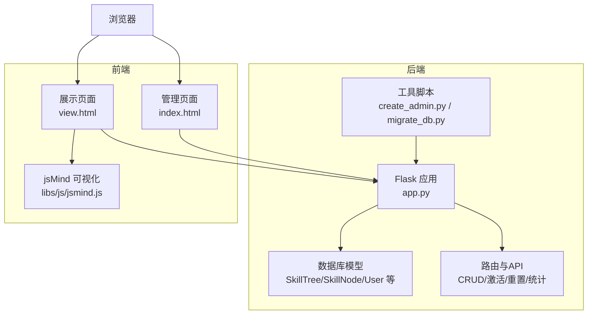
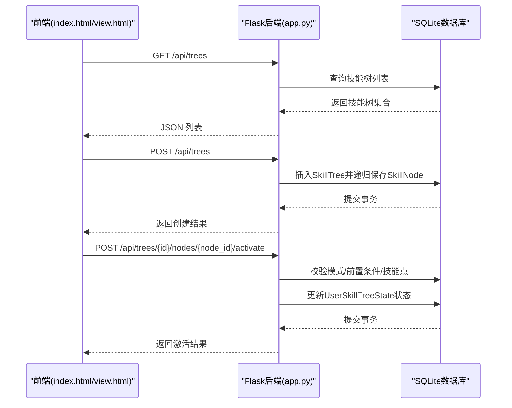
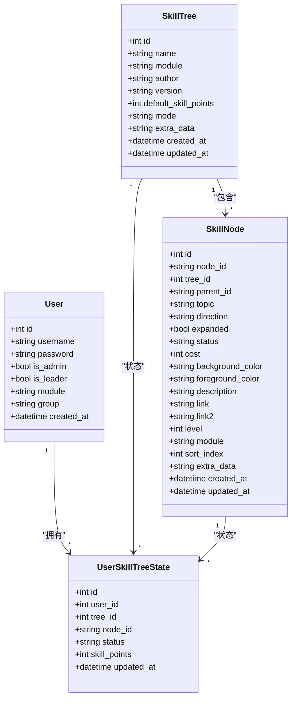
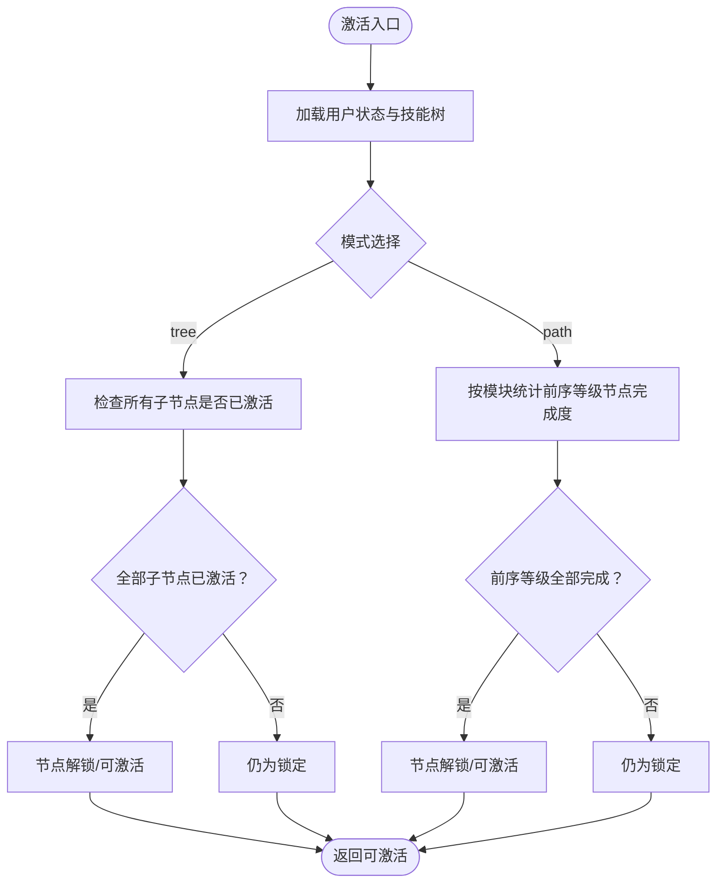
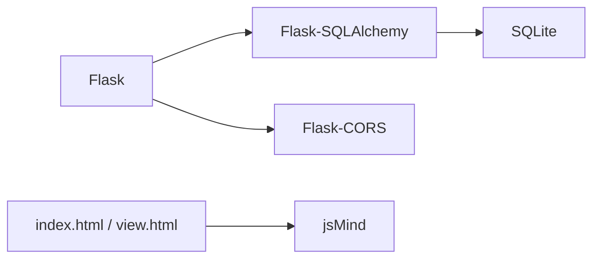

# 技能树管理模块

<cite>
**本文档引用的文件**
- [app.py](file://app.py)
- [README.md](file://README.md)
- [requirements.txt](file://requirements.txt)
- [create_admin.py](file://create_admin.py)
- [migrate_db.py](file://migrate_db.py)
- [index.html](file://index.html)
- [view.html](file://view.html)
- [_test_api.py](file://_test_api.py)
</cite>

## 目录
1. [简介](#简介)
2. [项目结构](#项目结构)
3. [核心组件](#核心组件)
4. [架构总览](#架构总览)
5. [详细组件分析](#详细组件分析)
6. [依赖分析](#依赖分析)
7. [性能考虑](#性能考虑)
8. [故障排查指南](#故障排查指南)
9. [结论](#结论)
10. [附录](#附录)

## 简介
本模块是一个基于 Flask + SQLAlchemy 的技能树管理系统，支持多用户、权限控制、技能点系统、节点激活与状态持久化，并与 jsMind 前端可视化框架无缝集成。系统提供两种激活模式：树状模式（自下而上）与进阶路径模式（线性等级），并内置节点编辑历史、点击统计、任务分配与审核流程。

## 项目结构
- 后端：Flask 应用，提供 REST API、数据库模型与迁移脚本
- 前端：index.html（管理/编辑）、view.html（展示/激活）
- 工具脚本：create_admin.py（快速创建管理员）、migrate_db.py（数据库迁移）

**图表来源**
- [app.py](file://app.py)
- [index.html](file://index.html)
- [view.html](file://view.html)

**章节来源**
- [README.md: 61-78:61-78](file://README.md#L61-L78)

## 核心组件
- 数据模型
  - 用户：用户基本信息、角色（管理员/组长）、模块与分组
  - 技能树：名称、模块、作者、版本、默认技能点、激活模式、扩展数据
  - 技能节点：节点ID、父子关系、主题、方向、展开状态、状态、消耗、颜色、等级、模块、排序索引、扩展数据
  - 用户技能树状态：用户在某棵树上的节点状态与可用技能点
  - 节点编辑历史、节点点击历史、学习任务
- API 路由
  - 技能树 CRUD、节点增删改、激活/取消激活、重置、模块/进度/历史统计、任务分配与审核等

**章节来源**
- [app.py: 25-122:25-122](file://app.py#L25-L122)
- [app.py: 183-561:183-561](file://app.py#L183-L561)
- [app.py: 562-946:562-946](file://app.py#L562-L946)
- [app.py: 948-1053:948-1053](file://app.py#L948-L1053)
- [app.py: 1055-1135:1055-1135](file://app.py#L1055-L1135)
- [app.py: 1137-1379:1137-1379](file://app.py#L1137-L1379)
- [app.py: 1381-1547:1381-1547](file://app.py#L1381-L1547)
- [app.py: 1549-1709:1549-1709](file://app.py#L1549-L1709)
- [app.py: 1740-1842:1740-1842](file://app.py#L1740-L1842)
- [app.py: 1843-2027:1843-2027](file://app.py#L1843-L2027)
- [app.py: 2029-2106:2029-2106](file://app.py#L2029-L2106)

## 架构总览
系统采用前后端分离架构：
- 前端通过 jsMind 渲染技能树，调用后端 API 完成技能树的创建、编辑、查询、激活与重置
- 后端以 Flask 提供 REST API，使用 SQLAlchemy 管理 SQLite 数据库
- 权限控制贯穿用户、技能树与节点层面，支持管理员、组长与普通用户的差异化能力

**图表来源**
- [app.py: 385-454:385-454](file://app.py#L385-L454)
- [app.py: 415-440:415-440](file://app.py#L415-L440)
- [app.py: 777-901:777-901](file://app.py#L777-L901)

## 详细组件分析

### SkillTree 模型与设计理念
- 设计要点
  - 模块化：通过 module 字段支持多模块隔离与权限匹配
  - 版本控制：version 字段便于追踪与回滚
  - 扩展数据：extra_data 存放额外元数据（如边框、连线、概要）
  - 激活模式：mode 支持 tree（自下而上）与 path（线性等级）
- 关系映射
  - 一对多：SkillTree → SkillNode、UserSkillTreeState
  - 多对多：通过 UserSkillTreeState 实现用户与技能树的关联状态

**图表来源**
- [app.py: 25-122:25-122](file://app.py#L25-L122)

**章节来源**
- [app.py: 42-61:42-61](file://app.py#L42-L61)

### 激活模式：tree 与 path 的技术实现
- tree 模式（自下而上）
  - 规则：仅当所有子节点均激活时，当前节点可解锁
  - 实现：遍历子节点状态，若任一子节点未激活则锁定
- path 模式（线性等级）
  - 规则：同一模块内，必须先完成所有小于当前等级的节点
  - 实现：按模块聚合等级，统计前序等级节点的激活数量与总数，要求全部完成
- 前端视图切换
  - 前端通过 PUT /api/trees/{id}/mode 同步模式，后端重新计算并返回最新状态

**图表来源**
- [app.py: 809-846:809-846](file://app.py#L809-L846)
- [app.py: 1288-1351:1288-1351](file://app.py#L1288-L1351)

**章节来源**
- [app.py: 688-710:688-710](file://app.py#L688-L710)
- [app.py: 809-846:809-846](file://app.py#L809-L846)
- [app.py: 1288-1351:1288-1351](file://app.py#L1288-L1351)

### CRUD 操作 API 详解
- 技能树
  - GET /api/trees：获取技能树列表（含权限标记）
  - POST /api/trees：创建技能树（可同时传入 jsMind 格式数据）
  - GET /api/trees/{id}：获取指定技能树（含用户状态与计算后的显示状态）
  - PUT /api/trees/{id}：更新技能树（可替换整棵树的节点）
  - DELETE /api/trees/{id}：删除技能树
- 节点
  - POST /api/trees/{id}/nodes：快速添加单个节点
  - POST /api/trees/{id}/nodes/batch：批量导入节点（CSV专用）
  - PUT /api/trees/{id}/nodes/{node_id}：更新节点
  - POST /api/trees/{id}/nodes/{node_id}/activate：激活节点（含权限与前置条件校验）
  - POST /api/trees/{id}/nodes/{node_id}/deactivate：取消激活（重置）
- 其他
  - PUT /api/trees/{id}/mode：切换激活模式
  - POST /api/trees/{id}/reset：管理员重置技能树
  - POST /api/users/{user_id}/trees/{tree_id}/reset：用户重置自己的技能树

**章节来源**
- [app.py: 385-454:385-454](file://app.py#L385-L454)
- [app.py: 415-440:415-440](file://app.py#L415-L440)
- [app.py: 442-454:442-454](file://app.py#L442-L454)
- [app.py: 456-552:456-552](file://app.py#L456-L552)
- [app.py: 554-561:554-561](file://app.py#L554-L561)
- [app.py: 562-607:562-607](file://app.py#L562-L607)
- [app.py: 608-686:608-686](file://app.py#L608-L686)
- [app.py: 712-775:712-775](file://app.py#L712-L775)
- [app.py: 777-901:777-901](file://app.py#L777-L901)
- [app.py: 904-930:904-930](file://app.py#L904-L930)
- [app.py: 688-710:688-710](file://app.py#L688-L710)
- [app.py: 948-1053:948-1053](file://app.py#L948-L1053)
- [app.py: 1018-1053:1018-1053](file://app.py#L1018-L1053)

### 数据结构与格式
- jsMind 兼容格式（后端输出）
  - 结构：包含 meta（名称、模块、作者、版本、扩展数据、是否可激活、技能点、默认技能点）与 data（根节点）
  - 节点字段：id、topic、direction、expanded、status、cost、background-color、foreground-color、original-background-color、original-foreground-color、description、link、link2、level、module、children
  - 状态计算：根据用户激活状态与模式动态计算显示状态
- JSON 请求/响应
  - 技能树创建/更新：name、module、author、version、default_skill_points、data（jsMind 格式）
  - 节点更新：topic、background_color、foreground_color、cost、level、module 等
  - 激活请求：user_id
  - 重置请求：user_id、target_user_id（管理员可选）

**章节来源**
- [app.py: 1137-1379:1137-1379](file://app.py#L1137-L1379)
- [README.md: 113-214:113-214](file://README.md#L113-L214)

### 权限管理与访问控制
- 用户角色
  - 管理员：可重置所有用户技能树、查看/编辑任意模块
  - 组长：可审核本组成员的节点激活申请、分配学习任务
  - 普通用户：仅能管理自己的技能树与状态
- 模块权限
  - 技能树与用户均可配置 module 字段，系统通过模块交集进行访问控制
- 节点激活策略
  - 管理员/组长：直接点亮，同步完成关联任务
  - 普通用户：提交待审核，等待管理员/组长批准

**章节来源**
- [app.py: 395-412:395-412](file://app.py#L395-L412)
- [app.py: 790-796:790-796](file://app.py#L790-L796)
- [app.py: 864-893:864-893](file://app.py#L864-L893)
- [app.py: 1973-2027:1973-2027](file://app.py#L1973-L2027)
- [app.py: 2029-2080:2029-2080](file://app.py#L2029-L2080)

### 历史与统计功能
- 节点编辑历史：记录变更详情（JSON），支持全局编辑历史查询
- 节点点击统计：记录点击次数与最近点击
- 全局统计：技能树/节点激活排行、用户最活跃度、模块/分组进度
- 仪表盘：总览数据、分组与模块统计、Top 用户

**章节来源**
- [app.py: 1498-1547:1498-1547](file://app.py#L1498-L1547)
- [app.py: 1549-1652:1549-1652](file://app.py#L1549-L1652)
- [app.py: 1740-1842:1740-1842](file://app.py#L1740-L1842)

### 任务分配与审核
- 分配任务：管理员/组长可为用户分配不同周期的任务（日/周/月/季度/年）
- 待审核列表：管理员/组长可查看并审批用户申请
- 审核通过：扣除技能点、正式点亮节点、同步任务状态

**章节来源**
- [app.py: 1843-1972:1843-1972](file://app.py#L1843-L1972)
- [app.py: 1973-2027:1973-2027](file://app.py#L1973-L2027)
- [app.py: 2029-2080:2029-2080](file://app.py#L2029-L2080)

## 依赖分析
- 后端依赖
  - Flask、Flask-SQLAlchemy、Flask-CORS
- 数据库
  - SQLite（默认），使用 SQLAlchemy ORM 管理模型与迁移
- 前端依赖
  - jsMind（可视化渲染）、第三方拖拽插件（可选）

**图表来源**
- [requirements.txt: 1-5:1-5](file://requirements.txt#L1-L5)
- [app.py: 5-22:5-22](file://app.py#L5-L22)

**章节来源**
- [requirements.txt: 1-5:1-5](file://requirements.txt#L1-L5)

## 性能考虑
- 数据库索引
  - SkillNode 上建立 (tree_id, node_id) 复合索引，提升节点查询效率
  - UserSkillTreeState 上建立 (user_id, tree_id, node_id) 唯一索引，保证状态一致性
- 查询优化
  - 批量导入使用 flush/commit 控制，减少事务开销
  - 状态计算在后端一次性完成，避免前端重复计算
- 前端渲染
  - jsMind 渲染树结构，建议控制节点数量与层级深度，避免超大树导致卡顿

**章节来源**
- [app.py: 102](file://app.py#L102)
- [app.py: 118-121:118-121](file://app.py#L118-L121)

## 故障排查指南
- 跨域问题
  - 确认已安装并启用 Flask-CORS
- 数据库迁移
  - 使用 migrate_db.py 或 init_db() 自动添加缺失字段
- 权限错误
  - 管理员/组长权限不足：检查 is_admin/is_leader 与 group/module 配置
- 激活失败
  - 检查前置条件（子节点是否全部激活/前序等级是否全部完成）、技能点是否充足、是否处于待审核状态

**章节来源**
- [README.md: 298-304:298-304](file://README.md#L298-L304)
- [migrate_db.py: 8-37:8-37](file://migrate_db.py#L8-L37)
- [app.py: 960-963:960-963](file://app.py#L960-L963)

## 结论
本模块以清晰的模型设计、完善的权限体系与灵活的激活模式，实现了可扩展的技能树管理能力。通过 jsMind 的可视化渲染与后端 API 的紧密配合，既满足了管理与展示需求，也为后续的功能扩展（如模板、搜索、导出等）奠定了良好基础。

## 附录

### API 接口一览（摘要）
- 技能树
  - GET /api/trees
  - POST /api/trees
  - GET /api/trees/{id}
  - PUT /api/trees/{id}
  - DELETE /api/trees/{id}
- 节点
  - POST /api/trees/{id}/nodes
  - POST /api/trees/{id}/nodes/batch
  - PUT /api/trees/{id}/nodes/{node_id}
  - POST /api/trees/{id}/nodes/{node_id}/activate
  - POST /api/trees/{id}/nodes/{node_id}/deactivate
- 模式与重置
  - PUT /api/trees/{id}/mode
  - POST /api/trees/{id}/reset
  - POST /api/users/{user_id}/trees/{tree_id}/reset
- 统计与历史
  - GET /api/progress
  - GET /api/trees/{id}/nodes/{node_id}/history
  - GET /api/history/global/clicks
  - GET /api/history/global/edits
- 任务
  - POST /api/tasks/assign
  - DELETE /api/tasks/{id}
  - GET /api/tasks/my
  - GET /api/tasks/pending
  - POST /api/tasks/approve

**章节来源**
- [README.md: 113-214:113-214](file://README.md#L113-L214)
- [app.py: 385-1053:385-1053](file://app.py#L385-L1053)
- [app.py: 1408-1547:1408-1547](file://app.py#L1408-L1547)
- [app.py: 1549-1709:1549-1709](file://app.py#L1549-L1709)
- [app.py: 1843-2080:1843-2080](file://app.py#L1843-L2080)

### 最佳实践
- 模块化设计：为技能树与用户配置合理的 module，确保权限边界清晰
- 激活模式选择：根据业务需求选择 tree/path，必要时在前端切换并同步到后端
- 批量导入：优先使用 CSV 导入接口，减少手动维护成本
- 权限最小化：管理员/组长仅授予必要权限，避免越权操作
- 历史审计：充分利用编辑历史与点击统计，便于追踪与分析

### 扩展与定制化开发指南
- 新增字段：在对应模型中添加字段，使用 migrate_db.py 或 init_db() 进行迁移
- 新增模式：在激活逻辑中扩展模式分支，确保状态计算与前端显示一致
- 前端扩展：在 index.html/view.html 中新增交互控件，调用相应 API
- 任务流程：根据组织流程定制任务类型与审批链路

**章节来源**
- [migrate_db.py: 8-37:8-37](file://migrate_db.py#L8-L37)
- [app.py: 2109-2227:2109-2227](file://app.py#L2109-L2227)
- [index.html: 1-200:1-200](file://index.html#L1-L200)
- [view.html: 1-200:1-200](file://view.html#L1-L200)