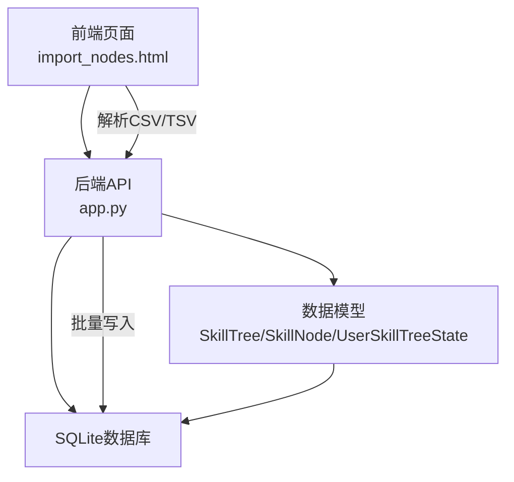
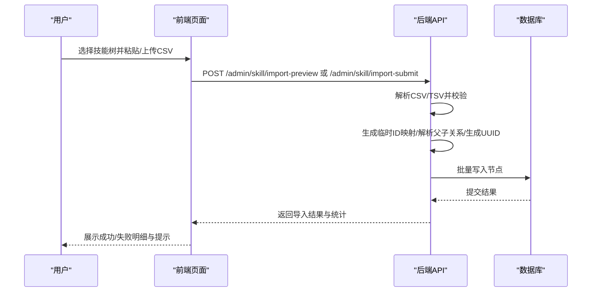
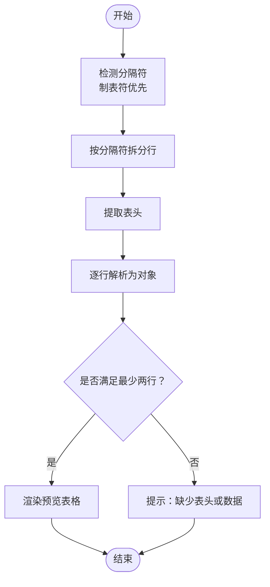
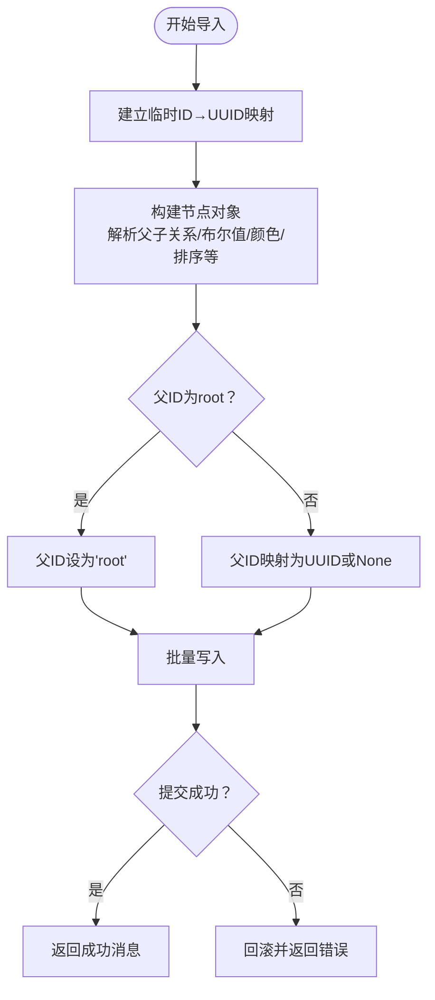
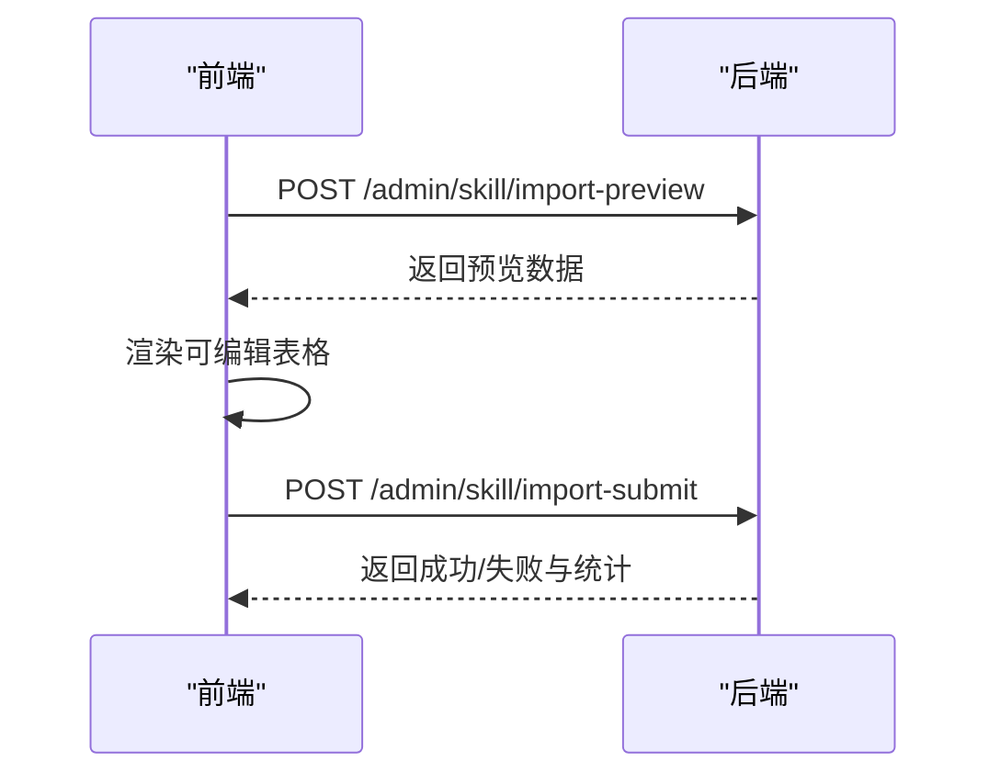
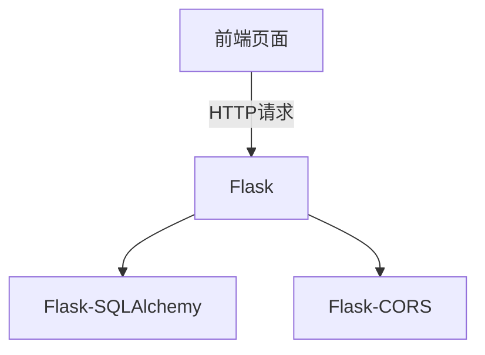

# 数据导入模块

<cite>
**本文引用的文件**
- [app.py](file://app.py)
- [import_nodes.html](file://import_nodes.html)
- [README.md](file://README.md)
- [requirements.txt](file://requirements.txt)
</cite>

## 目录
1. [简介](#简介)
2. [项目结构](#项目结构)
3. [核心组件](#核心组件)
4. [架构总览](#架构总览)
5. [详细组件分析](#详细组件分析)
6. [依赖分析](#依赖分析)
7. [性能考虑](#性能考虑)
8. [故障排除指南](#故障排除指南)
9. [结论](#结论)
10. [附录](#附录)

## 简介
本文件面向“数据导入模块”的技术文档，聚焦于CSV文件解析、数据验证与清洗、批量导入实现（含临时ID映射、父子关系解析、UUID生成策略）、导入预览与错误提示、事务处理与错误恢复、导入结果统计与反馈、CSV标准规范与字段映射、性能优化策略以及常见错误诊断与最佳实践。文档同时结合前端页面与后端API，帮助开发者与使用者全面掌握导入流程。

## 项目结构
- 后端服务：基于Flask + SQLAlchemy，提供技能树与节点的CRUD、导入预览与提交等接口。
- 前端页面：提供CSV模板下载、Excel粘贴解析、表格预览与校验、确认入库等交互。
- 数据模型：SkillTree、SkillNode、UserSkillTreeState、NodeEditHistory等，支撑导入与状态管理。

图表来源
- [app.py:183-275](file://app.py#L183-L275)
- [import_nodes.html:105-227](file://import_nodes.html#L105-L227)

章节来源
- [README.md:61-78](file://README.md#L61-L78)
- [requirements.txt:1-4](file://requirements.txt#L1-L4)

## 核心组件
- 导入预览接口：接收上传文件流，使用DictReader解析为JSON数组，返回给前端表格预览。
- 批量导入接口：接收前端提交的节点数组，执行临时ID映射、父子关系解析、UUID生成、批量写入与事务控制。
- 前端解析器：自动识别分隔符（逗号或制表符），解析Excel粘贴的表格，渲染可编辑预览表。
- CSV模板：提供标准字段清单与示例，便于用户准备数据。

章节来源
- [app.py:189-203](file://app.py#L189-L203)
- [app.py:208-275](file://app.py#L208-L275)
- [import_nodes.html:238-287](file://import_nodes.html#L238-L287)
- [import_nodes.html:484-506](file://import_nodes.html#L484-L506)

## 架构总览
导入流程分为三步：选择目标技能树与粘贴/上传数据 → 解析与预览 → 确认入库。前端负责数据采集与预览，后端负责解析、校验、映射与入库。

图表来源
- [import_nodes.html:289-305](file://import_nodes.html#L289-L305)
- [app.py:189-203](file://app.py#L189-L203)
- [app.py:208-275](file://app.py#L208-L275)

## 详细组件分析

### 1) CSV文件解析与数据验证
- 前端解析
  - 自动检测分隔符：优先使用制表符，其次逗号；支持带引号字段与转义。
  - 表头校验：要求首行为列名，且至少包含一行数据。
  - 渲染预览：将解析后的对象数组渲染为可编辑表格，支持新增行与同步回数组。
- 后端解析
  - 接收上传文件流，转换为StringIO并用DictReader逐行读取，输出JSON数组供前端预览。
  - 该流程不涉及数据写入，仅用于预览与校验。

图表来源
- [import_nodes.html:238-287](file://import_nodes.html#L238-L287)

章节来源
- [import_nodes.html:238-287](file://import_nodes.html#L238-L287)
- [app.py:189-203](file://app.py#L189-L203)

### 2) 批量导入实现机制
- 临时ID映射
  - 针对CSV内部的数字ID（如1,2,3...），在导入前建立“临时ID→真实UUID”的映射表。
  - 根节点的父ID可显式标注为“root”，数据库中以字符串“root”存储，表示其父为空。
- 父子关系解析
  - 若父ID为“root”，则父ID字段存为“root”；
  - 若父ID存在于映射表中，则替换为对应的真实UUID；
  - 其他情况（如空）存为None。
- UUID生成策略
  - 每个节点生成唯一node_id，若与现有重复则重新生成。
- 批量写入与事务
  - 使用bulk_save_objects进行批量插入，最后统一commit。
  - 异常时rollback，保证数据一致性。

图表来源
- [app.py:214-269](file://app.py#L214-L269)

章节来源
- [app.py:208-275](file://app.py#L208-L275)

### 3) 导入预览功能与错误提示
- 预览渲染：前端将解析后的数据渲染为可编辑表格，支持单元格内编辑与新增行。
- 错误提示：解析失败时提示“未能解析出数据：请确认已包含表头且至少一行数据”；提交时根据响应状态提示成功或失败原因。
- 数据格式验证：前端在提交前同步表格到数组，确保提交数据为最新。

图表来源
- [import_nodes.html:289-305](file://import_nodes.html#L289-L305)
- [app.py:189-203](file://app.py#L189-L203)
- [app.py:208-275](file://app.py#L208-L275)

章节来源
- [import_nodes.html:289-305](file://import_nodes.html#L289-L305)
- [app.py:189-203](file://app.py#L189-L203)
- [app.py:208-275](file://app.py#L208-L275)

### 4) 事务处理与错误恢复
- 单次导入为一个事务：批量写入后统一commit；若异常则rollback，避免部分写入导致脏数据。
- 前端提交按钮禁用与加载态，防止重复提交；网络错误与服务端错误均有明确提示。

章节来源
- [app.py:268-274](file://app.py#L268-L274)
- [import_nodes.html:458-482](file://import_nodes.html#L458-L482)

### 5) 导入结果统计与反馈
- 成功/失败计数：后端统计成功与失败数量，并返回每条记录的行号、主题、状态与消息。
- 状态码：全部成功返回200，否则返回207（部分成功）。
- 前端提示：成功弹窗显示处理总数；失败弹窗显示具体错误。

章节来源
- [app.py:618-685](file://app.py#L618-L685)
- [import_nodes.html:470-475](file://import_nodes.html#L470-L475)

### 6) CSV文件格式标准与字段映射
- 标准字段清单：temp_id、parent_temp_id、topic、direction、expanded、status、background_color、foreground_color、description、link、link2、level、module、sort_index。
- 示例模板：前端提供CSV模板下载，包含示例行，便于用户对照填写。
- 字段说明要点：
  - temp_id：节点在CSV内的临时ID，用于父子关系映射。
  - parent_temp_id：父节点的temp_id；若为根节点，可填“root”。
  - expanded：布尔字符串，用于控制展开状态。
  - level/module/sort_index：等级、模块与排序索引。
  - 颜色字段：背景色与前景色，支持十六进制颜色值。

章节来源
- [import_nodes.html:484-506](file://import_nodes.html#L484-L506)

### 7) 性能优化策略
- 批量插入：使用bulk_save_objects减少多次INSERT往返，提升写入效率。
- 单条刷新：在批量导入场景中，单条flush避免频繁提交带来的开销。
- 内存管理：前端解析采用逐行拆分与对象映射，避免一次性加载超大文件；后端解析使用StringIO与迭代器，降低内存峰值。
- 事务边界：将一次导入作为一个事务，减少数据库锁竞争与日志写入次数。

章节来源
- [app.py:268-269](file://app.py#L268-L269)
- [app.py:664](file://app.py#L664)
- [import_nodes.html:238-287](file://import_nodes.html#L238-L287)

### 8) 常见导入错误与诊断
- 未发现文件：后端提示“未发现文件”，检查前端是否正确选择文件或粘贴内容。
- 缺少表头或数据：前端提示“未能解析出数据：请确认已包含表头且至少一行数据”，检查Excel复制区域是否包含表头。
- 标题为空：批量导入时若topic为空，记录为错误并提示“标题不能为空”。
- 节点ID冲突：若生成的node_id与现有重复，后端会重新生成，确保唯一性。
- 网络错误：前端提交失败时提示“网络错误，提交失败”，检查后端服务状态与跨域配置。

章节来源
- [app.py:193-194](file://app.py#L193-L194)
- [import_nodes.html:293-297](file://import_nodes.html#L293-L297)
- [app.py:624-629](file://app.py#L624-L629)
- [app.py:634-637](file://app.py#L634-L637)
- [import_nodes.html:476-478](file://import_nodes.html#L476-L478)

### 9) 最佳实践与注意事项
- 准备数据：使用前端提供的CSV模板，确保表头与示例一致；避免合并单元格与隐藏列。
- 父子关系：根节点的parent_temp_id应填“root”；子节点的parent_temp_id应指向父节点的temp_id。
- 字段规范：布尔值使用“true/false”字符串；颜色使用合法十六进制值；数值字段避免空值。
- 事务与回滚：导入过程中若出现异常，后端会回滚，确保数据一致性；建议在小批量测试通过后再进行大批量导入。
- 前端体验：提交时保持页面不要关闭，等待加载提示结束；若长时间无响应，检查后端日志与网络连接。

章节来源
- [import_nodes.html:148-152](file://import_nodes.html#L148-L152)
- [app.py:208-275](file://app.py#L208-L275)

## 依赖分析
- 后端依赖：Flask、Flask-SQLAlchemy、Flask-CORS。
- 前端依赖：项目自带CSS/JS资源，未引入外部CSV解析库（papaparse），采用原生JS解析以简化依赖。

图表来源
- [requirements.txt:1-4](file://requirements.txt#L1-L4)

章节来源
- [requirements.txt:1-4](file://requirements.txt#L1-L4)

## 性能考虑
- 批量写入：使用bulk_save_objects，减少数据库往返与日志写入。
- 单条flush：在批量导入中逐条flush，平衡内存占用与写入效率。
- 内存优化：前后端均采用流式与迭代方式处理数据，避免一次性加载全量数据。
- 事务边界：将一次导入作为一个事务，减少锁竞争与并发冲突。

章节来源
- [app.py:268-269](file://app.py#L268-L269)
- [app.py:664](file://app.py#L664)
- [import_nodes.html:238-287](file://import_nodes.html#L238-L287)

## 故障排除指南
- 前端解析失败：检查Excel复制区域是否包含表头；确认分隔符为制表符或逗号。
- 后端解析失败：检查文件编码（UTF-8）与文件大小限制；确认上传文件存在。
- 导入失败：查看返回的错误消息；检查节点ID是否唯一、父子关系是否正确。
- 网络错误：检查后端服务是否启动、跨域设置是否允许；确认浏览器控制台无CORS错误。

章节来源
- [import_nodes.html:293-297](file://import_nodes.html#L293-L297)
- [app.py:193-194](file://app.py#L193-L194)
- [import_nodes.html:476-478](file://import_nodes.html#L476-L478)

## 结论
本数据导入模块通过前后端协作，实现了从CSV解析、预览校验到批量入库的完整闭环。其核心优势在于：灵活的父子关系解析（支持“root”标记）、稳定的UUID生成策略、完善的事务与错误恢复、清晰的结果统计与反馈，以及简洁的前端体验。遵循本文档的规范与最佳实践，可高效、安全地完成大规模技能节点导入。

## 附录
- CSV模板字段清单与示例：参见前端模板下载功能。
- API接口路径与用途：
  - 预览接口：POST /admin/skill/import-preview
  - 提交接口：POST /admin/skill/import-submit
- 数据模型关系：SkillTree与SkillNode一对多，UserSkillTreeState与User/Tree多对多，NodeEditHistory记录节点变更历史。

章节来源
- [import_nodes.html:484-506](file://import_nodes.html#L484-L506)
- [app.py:189-203](file://app.py#L189-L203)
- [app.py:208-275](file://app.py#L208-L275)
- [README.md:305-333](file://README.md#L305-L333)