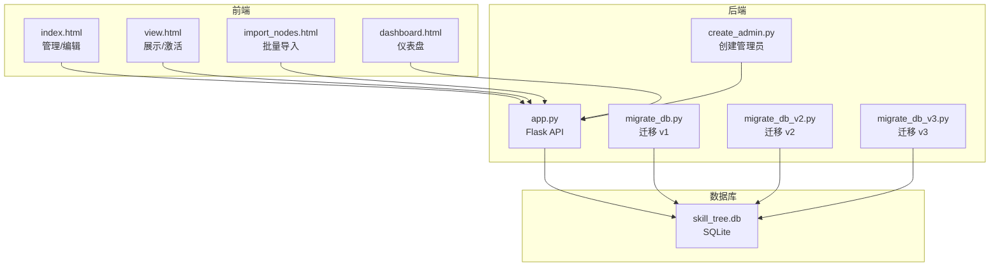
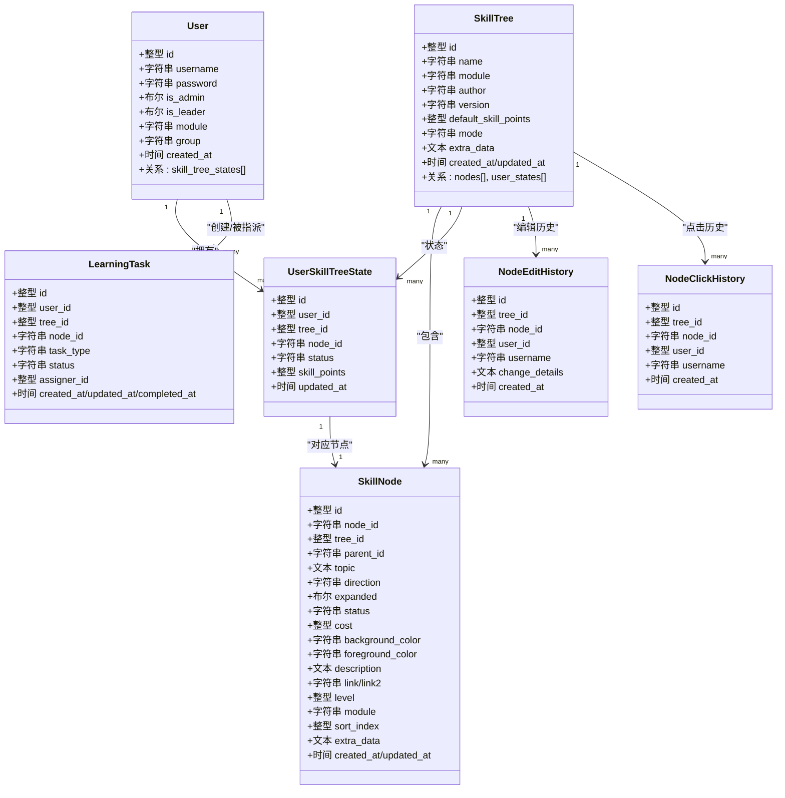
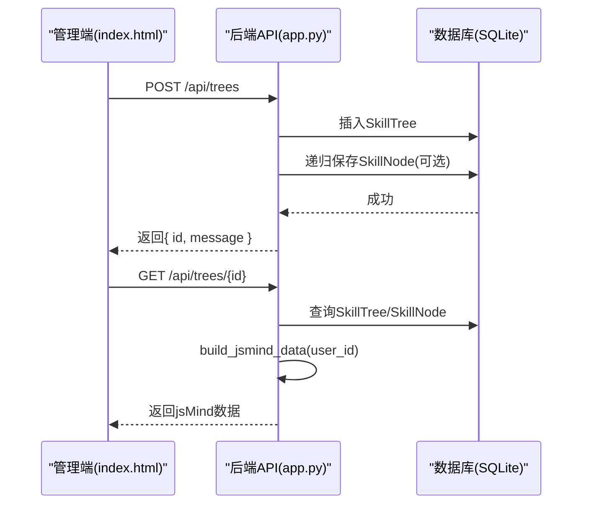
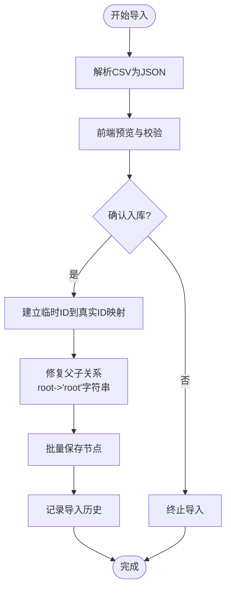
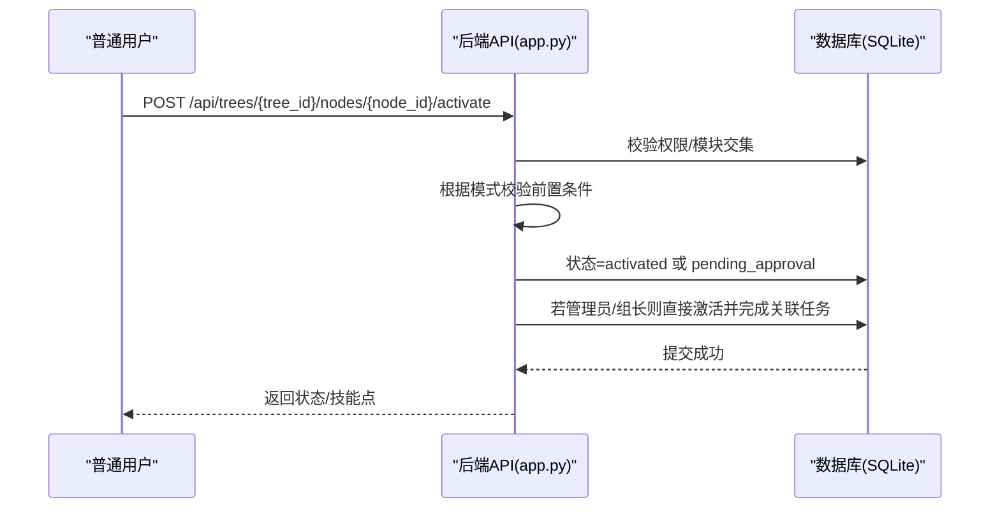
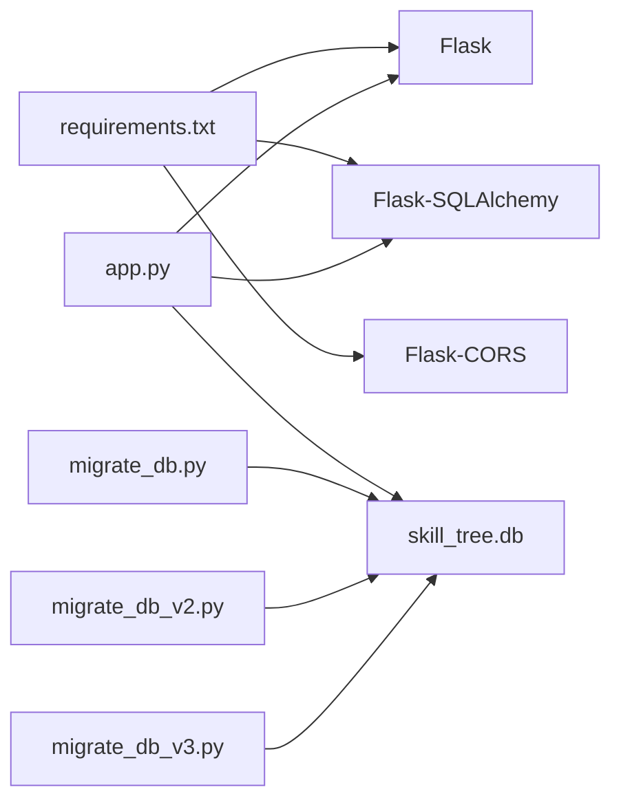

# 核心功能模块

<cite>
**本文引用的文件**
- [app.py](file://app.py)
- [README.md](file://README.md)
- [requirements.txt](file://requirements.txt)
- [create_admin.py](file://create_admin.py)
- [index.html](file://index.html)
- [view.html](file://view.html)
- [import_nodes.html](file://import_nodes.html)
- [migrate_db.py](file://migrate_db.py)
- [migrate_db_v2.py](file://migrate_db_v2.py)
- [migrate_db_v3.py](file://migrate_db_v3.py)
</cite>

## 目录
1. [简介](#简介)
2. [项目结构](#项目结构)
3. [核心组件](#核心组件)
4. [架构总览](#架构总览)
5. [详细组件分析](#详细组件分析)
6. [依赖分析](#依赖分析)
7. [性能考虑](#性能考虑)
8. [故障排查指南](#故障排查指南)
9. [结论](#结论)
10. [附录](#附录)

## 简介
本系统是一个基于 jsMind 与 Flask 的技能树管理系统，围绕“技能树管理、节点操作、用户权限与状态、激活系统、任务管理与数据导入”五大核心模块构建。系统提供多用户独立状态、模块化权限控制、树状/线性两种激活模式、技能点消耗与返还、节点点击与编辑历史追踪、以及 CSV 批量导入能力。本文面向产品经理、系统分析师与开发者，系统阐述模块设计理念、实现技术、业务价值、模块间协作、使用流程与最佳实践，并给出扩展与优化建议。

## 项目结构
- 后端：Flask 应用，使用 SQLAlchemy 管理 SQLite 数据库，提供 REST API。
- 前端：index.html（管理/编辑）、view.html（展示/激活）、import_nodes.html（批量导入）、dashboard.html（仪表盘入口）。
- 数据库：skill_tree.db（SQLite），迁移脚本支持字段演进。
- 运行：requirements.txt 指定依赖，run.bat 或命令行启动后端服务。

**图表来源**
- [app.py](file://app.py)
- [index.html](file://index.html)
- [view.html](file://view.html)
- [import_nodes.html](file://import_nodes.html)
- [dashboard.html](file://dashboard.html)
- [migrate_db.py](file://migrate_db.py)
- [migrate_db_v2.py](file://migrate_db_v2.py)
- [migrate_db_v3.py](file://migrate_db_v3.py)
- [create_admin.py](file://create_admin.py)

**章节来源**
- [README.md](file://README.md)
- [requirements.txt](file://requirements.txt)

## 核心组件
- 技能树管理模块：创建/保存/加载/删除技能树，支持默认技能点、激活模式（树状/线性）、扩展数据。
- 节点操作模块：添加/批量导入/更新/删除节点，支持颜色、描述、链接、排序索引、等级与模块属性。
- 用户权限与状态模块：用户角色（管理员/组长/普通用户）、模块范围、独立技能树状态与技能点。
- 激活系统模块：树状/线性两种前置条件校验、待审核流程、管理员/组长快速通过、任务联动。
- 任务管理模块：学习任务分配、待审核、完成标记与统计。
- 数据导入模块：CSV 预览、临时ID映射、父子关系修复、批量入库与历史记录。
- 进度与审计模块：用户进度统计、节点点击与编辑历史、全局热度统计。

**章节来源**
- [app.py](file://app.py)
- [README.md](file://README.md)

## 架构总览
系统采用前后端分离架构：前端负责交互与可视化（jsMind），后端提供统一 API 与数据持久化。核心数据模型围绕用户、技能树、节点、用户状态、任务与历史展开。

**图表来源**
- [app.py](file://app.py)

## 详细组件分析

### 技能树管理模块
- 设计理念：以“树”为基本单位承载技能知识结构，支持多树并存与模块化权限控制，便于团队/部门/岗位差异化管理。
- 实现要点：
  - 技能树创建/更新/删除，支持默认技能点与激活模式（tree/path）。
  - extra_data 存储扩展元信息（如外框、连线、概要）。
  - 通过 build_jsmind_data 将节点与用户状态合并输出 jsMind 格式。
- 业务价值：统一技能资产，支持可视化学习路径与进度追踪。

**图表来源**
- [app.py](file://app.py)
- [index.html](file://index.html)

**章节来源**
- [app.py](file://app.py)

### 节点操作模块
- 设计理念：支持灵活的节点增删改，保留颜色与样式，支持批量导入与父子关系修复。
- 实现要点：
  - 单节点添加/更新，支持 topic/description/link/module/level/cost 等字段。
  - 批量导入 CSV：解析预览、临时ID映射、父子关系修复、逐条历史记录。
  - 保存时保留颜色信息，避免更新导致的视觉丢失。
- 业务价值：降低技能树维护成本，提升导入效率与准确性。

**图表来源**
- [app.py](file://app.py)
- [import_nodes.html](file://import_nodes.html)

**章节来源**
- [app.py](file://app.py)
- [import_nodes.html](file://import_nodes.html)

### 用户权限与状态模块
- 设计理念：用户独立技能树状态，模块化权限控制，管理员/组长特权，普通用户仅能管理自身。
- 实现要点：
  - 用户表包含 is_admin/is_leader/module/group 等字段。
  - 用户状态初始化时根节点激活、其余节点锁定。
  - 权限校验：非管理员仅能操作与自身模块交集内的技能树。
- 业务价值：保障组织内技能治理边界，支持分级授权与协作。

**章节来源**
- [app.py](file://app.py)
- [create_admin.py](file://create_admin.py)

### 激活系统模块
- 设计理念：双模式前置校验（树状自下而上、线性模块进阶），支持管理员/组长快速通过与普通用户待审核。
- 实现要点：
  - 树状模式：子节点全部激活方可激活父节点。
  - 线性模式：同一模块内，必须先完成所有更低等级节点。
  - 待审核流程：普通用户激活申请进入 pending_approval，管理员/组长可直接激活并联动任务完成。
  - 技能点校验：根节点保存可用技能点，激活消耗、重置返还。
- 业务价值：规范学习路径，激励自主学习，降低管理负担。

**图表来源**
- [app.py](file://app.py)

**章节来源**
- [app.py](file://app.py)

### 任务管理模块
- 设计理念：将节点激活与学习任务绑定，支持任务分配、待审核与完成闭环。
- 实现要点：
  - LearningTask 表记录任务类型（每日/每周/月度等）、状态（已分配/待审核/已完成）。
  - 激活成功时若存在关联任务，自动标记完成。
  - 管理员可重置技能树并返还技能点，同时清理任务状态。
- 业务价值：将“学”与“评”结合，提升学习闭环质量。

**章节来源**
- [app.py](file://app.py)

### 数据导入模块
- 设计理念：提供 CSV 导入预览与校验，自动修复父子关系，批量入库并记录历史。
- 实现要点：
  - 预览接口返回 CSV 行数据，便于前端表格化展示与编辑。
  - 临时ID映射解决 CSV 内部父子关系与 root 标识问题。
  - 批量入库逐条记录 NodeEditHistory，便于审计。
- 业务价值：大幅降低手工录入成本，保证结构一致性。

**章节来源**
- [app.py](file://app.py)
- [import_nodes.html](file://import_nodes.html)

### 进度与审计模块
- 设计理念：提供用户/技能树维度的进度统计与节点热度分析，支持编辑与点击历史追踪。
- 实现要点：
  - 进度接口按用户/技能树聚合激活数量与百分比。
  - 节点历史接口返回编辑变更与点击统计。
  - 全局点击统计支持热门技能树与热门节点排行。
- 业务价值：辅助管理者洞察学习行为与热点，优化技能树设计。

**章节来源**
- [app.py](file://app.py)

## 依赖分析
- 技术栈：Flask + SQLAlchemy + SQLite + jsMind 前端库。
- 外部依赖：requirements.txt 指定 Flask、Flask-SQLAlchemy、Flask-CORS。
- 数据库演进：迁移脚本逐步添加 default_skill_points、mode、is_leader 等字段，确保平滑升级。

**图表来源**
- [requirements.txt](file://requirements.txt)
- [app.py](file://app.py)
- [migrate_db.py](file://migrate_db.py)
- [migrate_db_v2.py](file://migrate_db_v2.py)
- [migrate_db_v3.py](file://migrate_db_v3.py)

**章节来源**
- [requirements.txt](file://requirements.txt)
- [migrate_db.py](file://migrate_db.py)
- [migrate_db_v2.py](file://migrate_db_v2.py)
- [migrate_db_v3.py](file://migrate_db_v3.py)

## 性能考虑
- 数据库层面：
  - 为 idx_tree_node 与 idx_user_tree_node_node 建立复合索引，加速节点查询与用户状态匹配。
  - 批量导入使用 flush/commit 分离，减少事务开销。
- 业务层面：
  - 树状/线性模式下的前置校验尽量使用聚合查询与集合运算，避免 N+1 查询。
  - 进度统计按树聚合，避免逐节点扫描。
- 前端层面：
  - jsMind 渲染树结构，建议在大数据量时启用懒加载与虚拟滚动（如 jsMind 支持）。
- 安全与稳定性：
  - 登录与权限校验前置，避免无效请求进入复杂逻辑。
  - 批量导入失败回滚，保证数据一致性。

[本节为通用指导，不直接分析具体文件]

## 故障排查指南
- 跨域问题：确保 Flask-CORS 正确安装与启用。
- 数据库迁移失败：按提示删除 skill_tree.db 并重启服务，或使用迁移脚本逐版本修复。
- 导入异常：检查 CSV 列名与顺序，确认 temp_id 与 parent_temp_id 映射，关注历史记录中的错误行。
- 激活失败：核对模块交集、前置条件（树状/线性）、技能点余额与节点状态。
- 管理员创建：使用 create_admin.py 快速创建默认管理员账户。

**章节来源**
- [README.md](file://README.md)
- [migrate_db.py](file://migrate_db.py)
- [migrate_db_v2.py](file://migrate_db_v2.py)
- [migrate_db_v3.py](file://migrate_db_v3.py)
- [create_admin.py](file://create_admin.py)

## 结论
本系统以“树”为核心载体，结合模块化权限、双模式激活、技能点与任务联动，形成完整的技能治理体系。通过 CSV 导入与历史审计，进一步降低维护成本并提升可追溯性。建议后续扩展节点图标/链接、搜索、模板与导出能力，持续优化性能与用户体验。

[本节为总结性内容，不直接分析具体文件]

## 附录

### 功能使用流程与最佳实践
- 创建用户与管理员：使用管理页面或 create_admin.py。
- 创建技能树：在管理端填写名称与默认技能点，保存树与节点。
- 节点操作：支持添加/更新/删除，推荐保留颜色信息，避免视觉丢失。
- 激活节点：普通用户提交申请，管理员/组长快速通过；树状/线性模式自动校验前置条件。
- 重置技能树：管理员可重置所有用户或指定用户，返还技能点并清除状态。
- 导入节点：使用 import_nodes.html 进行 CSV 预览与批量入库，记录导入历史。
- 查看进度：通过进度接口汇总用户/技能树维度的激活情况。

**章节来源**
- [README.md](file://README.md)
- [index.html](file://index.html)
- [view.html](file://view.html)
- [import_nodes.html](file://import_nodes.html)
- [app.py](file://app.py)