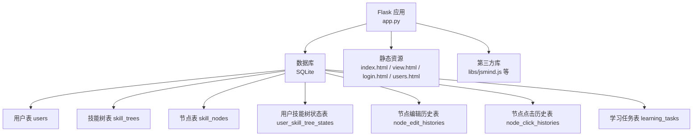
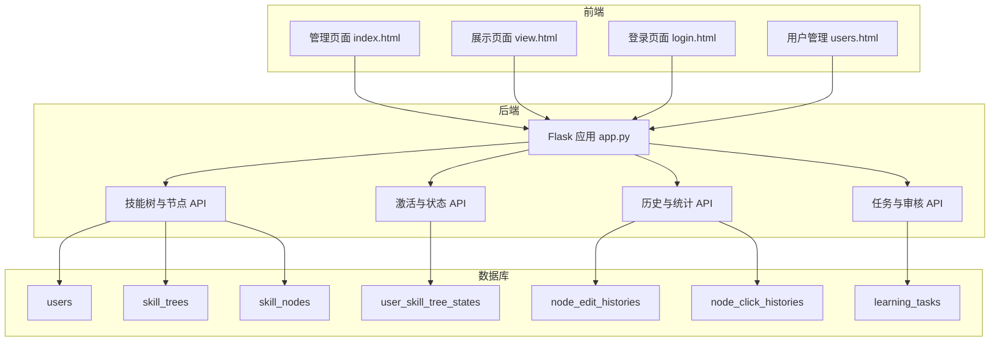
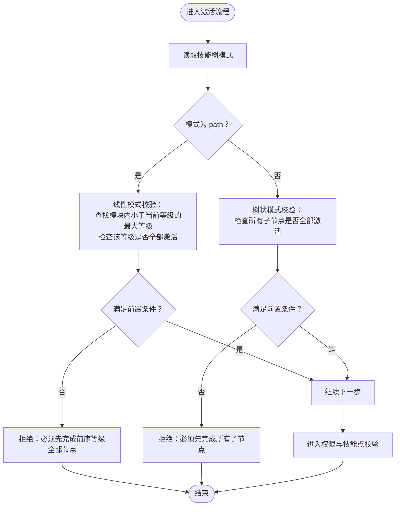
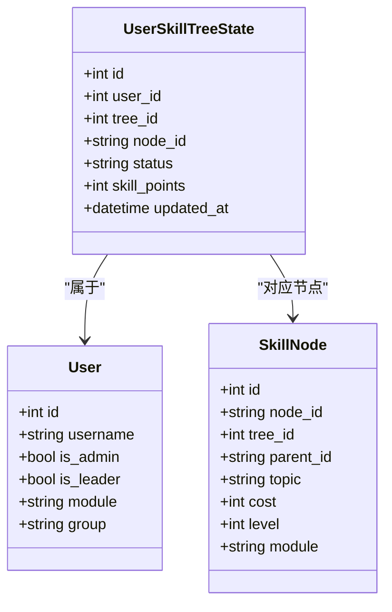
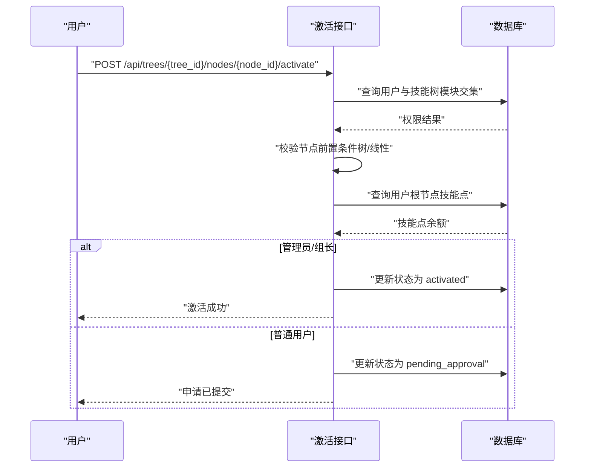
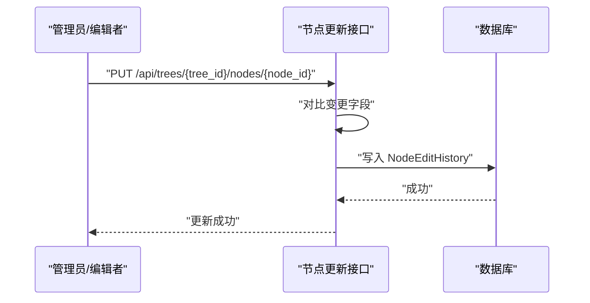
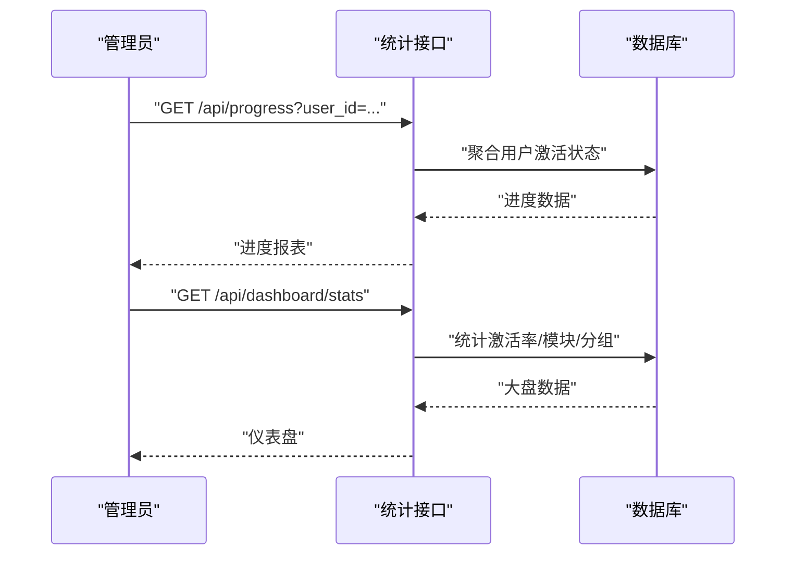

# 激活系统模块

<cite>
**本文引用的文件**
- [app.py](file://app.py)
- [README.md](file://README.md)
- [requirements.txt](file://requirements.txt)
- [create_admin.py](file://create_admin.py)
</cite>

## 目录
1. [简介](#简介)
2. [项目结构](#项目结构)
3. [核心组件](#核心组件)
4. [架构总览](#架构总览)
5. [详细组件分析](#详细组件分析)
6. [依赖分析](#依赖分析)
7. [性能考虑](#性能考虑)
8. [故障排查指南](#故障排查指南)
9. [结论](#结论)
10. [附录](#附录)

## 简介
本技术文档围绕“激活系统模块”的核心能力进行系统化梳理，重点涵盖以下方面：
- 节点激活的核心算法：树状模式与线性模式（进阶等级）的激活逻辑差异
- UserSkillTreeState 模型的作用与状态管理机制
- 激活权限验证流程：用户模块权限检查与技能点消耗验证
- 激活状态的持久化存储与实时同步机制
- 激活历史追踪：NodeEditHistory 模型的使用与审计日志生成
- 性能优化策略：状态缓存与批量操作处理
- 扩展点与定制化开发指南
- 异常处理与回滚机制
- 系统管理员的监控与统计分析功能使用指导

## 项目结构
后端采用 Flask + SQLAlchemy 架构，核心数据模型与 API 路由集中在单一文件中，便于维护与部署。前端页面通过静态文件提供管理与展示功能。

图表来源
- [app.py:25-177](file://app.py#L25-L177)

章节来源
- [app.py:17-22](file://app.py#L17-L22)
- [README.md:61-78](file://README.md#L61-L78)

## 核心组件
- 数据模型层
  - User：用户信息与权限标识（管理员/组长/模块/分组）
  - SkillTree：技能树元数据与激活模式（tree/path）
  - SkillNode：节点结构、状态、成本、等级与模块
  - UserSkillTreeState：用户在特定技能树中的节点状态与技能点
  - NodeEditHistory：节点编辑历史与变更详情
  - NodeClickHistory：节点点击统计
  - LearningTask：学习任务分配与审核流程支撑
- API 层
  - 技能树 CRUD、节点导入/导出、激活/取消激活、重置、进度统计、历史与全局统计、任务管理等

章节来源
- [app.py:25-177](file://app.py#L25-L177)
- [README.md:113-214](file://README.md#L113-L214)

## 架构总览
激活系统采用“模型-路由-视图”三层结构：
- 模型层：定义实体与关系，承载状态与历史
- 路由层：暴露 REST API，负责权限校验、业务逻辑与事务控制
- 视图层：前端页面通过 API 与后端交互，实时渲染状态

图表来源
- [app.py:17-22](file://app.py#L17-L22)
- [app.py:385-552](file://app.py#L385-L552)
- [app.py:777-901](file://app.py#L777-L901)
- [app.py:1408-1547](file://app.py#L1408-L1547)
- [app.py:1843-2080](file://app.py#L1843-L2080)

## 详细组件分析

### 1) 激活算法：树状模式 vs 线性模式
- 树状模式（tree）
  - 自下而上：仅当所有子节点均已激活时，父节点可被激活
  - 适用于“技能树”式的层级关系，强调阶段性完成
- 线性模式（path，兼容 linear）
  - 进阶等级线性：同一模块内，必须先完成“当前等级之前的最大等级”的全部节点，方可激活当前节点
  - 适用于“等级进阶”类的连续学习路径

图表来源
- [app.py:809-846](file://app.py#L809-L846)
- [app.py:810-836](file://app.py#L810-L836)

章节来源
- [app.py:688-710](file://app.py#L688-L710)
- [app.py:809-846](file://app.py#L809-L846)

### 2) UserSkillTreeState 模型与状态管理
- 作用
  - 记录每个用户在特定技能树中的节点状态（locked/activated/pending_approval）
  - 记录用户在该技能树中的可用技能点（根节点存储）
- 初始化
  - 首次访问时自动初始化用户状态，根节点激活、其余节点锁定
- 实时同步
  - 前端每次请求技能树数据时，后端动态注入计算后的状态（考虑树/线性模式与用户已激活集合）

图表来源
- [app.py:105-121](file://app.py#L105-L121)
- [app.py:63-103](file://app.py#L63-L103)
- [app.py:25-40](file://app.py#L25-L40)

章节来源
- [app.py:1054-1076](file://app.py#L1054-L1076)
- [app.py:1136-1378](file://app.py#L1136-L1378)

### 3) 激活权限验证流程
- 模块权限检查
  - 非管理员用户仅能在其模块交集内的技能树中激活节点
- 技能点消耗验证
  - 通过根节点状态获取可用技能点，若不足则拒绝
- 特殊角色
  - 管理员/组长可直接点亮节点；普通用户提交“待审核”申请，由管理员/组长审批

图表来源
- [app.py:777-901](file://app.py#L777-L901)
- [app.py:1355-1363](file://app.py#L1355-L1363)

章节来源
- [app.py:385-412](file://app.py#L385-L412)
- [app.py:777-901](file://app.py#L777-L901)

### 4) 激活状态的持久化与实时同步
- 持久化
  - UserSkillTreeState 记录节点状态与技能点
  - NodeEditHistory 记录节点编辑历史
  - NodeClickHistory 记录节点点击统计
- 实时同步
  - 前端请求技能树数据时，后端动态计算并注入状态，保证展示与实际一致

章节来源
- [app.py:105-121](file://app.py#L105-L121)
- [app.py:124-151](file://app.py#L124-L151)
- [app.py:1136-1378](file://app.py#L1136-L1378)

### 5) 激活历史追踪与审计日志
- NodeEditHistory
  - 记录节点变更详情（JSON），包含变更字段与前后值
  - 支持按节点查询编辑历史与点击统计
- 审计日志
  - 全局编辑历史与点击统计接口，支持分页与排行统计

图表来源
- [app.py:712-774](file://app.py#L712-L774)
- [app.py:1517-1546](file://app.py#L1517-L1546)
- [app.py:1655-1708](file://app.py#L1655-L1708)

章节来源
- [app.py:124-138](file://app.py#L124-L138)
- [app.py:1517-1546](file://app.py#L1517-L1546)
- [app.py:1655-1708](file://app.py#L1655-L1708)

### 6) 性能优化策略
- 状态缓存
  - 前端在展示页面缓存用户状态，减少重复请求
- 批量操作
  - 批量导入节点时使用 flush 逐条写入，最后统一 commit，降低内存占用
- 查询优化
  - 使用索引与 distinct 查询提升模块列表与统计效率
- 动态状态计算
  - 仅在需要时计算节点最终状态，避免全量重算

章节来源
- [app.py:608-685](file://app.py#L608-L685)
- [app.py:1381-1406](file://app.py#L1381-L1406)
- [app.py:1136-1378](file://app.py#L1136-L1378)

### 7) 扩展点与定制化开发指南
- 激活模式扩展
  - 可在 SkillTree 中新增模式字段，并在激活逻辑中扩展分支
- 权限模型扩展
  - 可引入更细粒度的角色与权限矩阵，结合 UserSkillTreeState 的状态进行控制
- 审计与追踪
  - 可扩展 NodeEditHistory 的变更字段，增加变更摘要与影响范围分析
- 任务与审批流
  - 可扩展 LearningTask 的任务类型与审批流程，支持多级审批与条件触发

章节来源
- [app.py:466-551](file://app.py#L466-L551)
- [app.py:1517-1546](file://app.py#L1517-L1546)
- [app.py:1843-2080](file://app.py#L1843-L2080)

### 8) 异常处理与回滚机制
- 事务回滚
  - 批量导入、节点更新、技能树重置等关键操作均在异常时执行回滚
- 权限拒绝
  - 模块权限不匹配、技能点不足、节点状态非法等情况即时返回错误
- 审核流程
  - 待审核状态可通过审批接口正式激活，否则维持 pending_approval

章节来源
- [app.py:272-274](file://app.py#L272-L274)
- [app.py:545-548](file://app.py#L545-L548)
- [app.py:948-1015](file://app.py#L948-L1015)
- [app.py:2029-2079](file://app.py#L2029-L2079)

### 9) 管理员监控与统计分析
- 进度统计
  - 获取用户在各技能树上的激活百分比与具体节点列表
- 全局统计
  - 技能树点击排行、节点激活排行、最活跃用户排行、模块与分组进度
- 历史审计
  - 全局编辑历史与点击日志分页查看

图表来源
- [app.py:1408-1495](file://app.py#L1408-L1495)
- [app.py:1740-1841](file://app.py#L1740-L1841)
- [app.py:1549-1652](file://app.py#L1549-L1652)

章节来源
- [app.py:1408-1495](file://app.py#L1408-L1495)
- [app.py:1740-1841](file://app.py#L1740-L1841)
- [app.py:1549-1652](file://app.py#L1549-L1652)

## 依赖分析
- Python 依赖
  - Flask、Flask-SQLAlchemy、Flask-CORS
- 数据库
  - SQLite（本地开发友好），支持迁移与重建

章节来源
- [requirements.txt:1-5](file://requirements.txt#L1-L5)
- [app.py:2108-2227](file://app.py#L2108-L2227)

## 性能考虑
- 减少全量计算：仅在前端渲染时注入状态，后端持久化与权限校验为主
- 批处理与事务：批量导入使用 flush+commit，避免大事务阻塞
- 索引与去重：模块列表与统计查询使用 distinct 与 group by，降低扫描成本
- 前端缓存：展示页面缓存用户状态，减少重复请求

## 故障排查指南
- 登录失败
  - 检查用户名是否存在、密码是否匹配
- 激活失败
  - 确认模块权限、前置条件（树/线性）、技能点余额
- 重置异常
  - 管理员权限不足或目标用户状态异常
- 历史缺失
  - 确认 NodeEditHistory 与 NodeClickHistory 是否正常写入
- 统计不准确
  - 检查模块字段是否正确、用户与技能树是否匹配

章节来源
- [app.py:356-382](file://app.py#L356-L382)
- [app.py:777-901](file://app.py#L777-L901)
- [app.py:948-1052](file://app.py#L948-L1052)
- [app.py:1517-1546](file://app.py#L1517-L1546)
- [app.py:1408-1495](file://app.py#L1408-L1495)

## 结论
激活系统模块通过清晰的模型设计与严谨的业务流程，实现了灵活的树状与线性激活模式、完善的权限控制与审计追踪，并提供了丰富的统计与监控能力。建议在生产环境中进一步强化密码安全、引入缓存层与异步任务队列，以提升安全性与吞吐能力。

## 附录
- 快速创建管理员
  - 使用脚本一键创建默认管理员账户，便于首次部署与测试

章节来源
- [create_admin.py:1-30](file://create_admin.py#L1-L30)