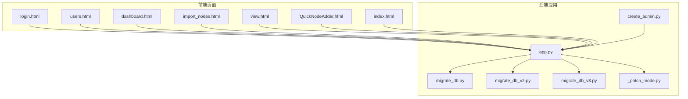
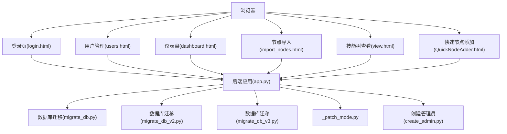
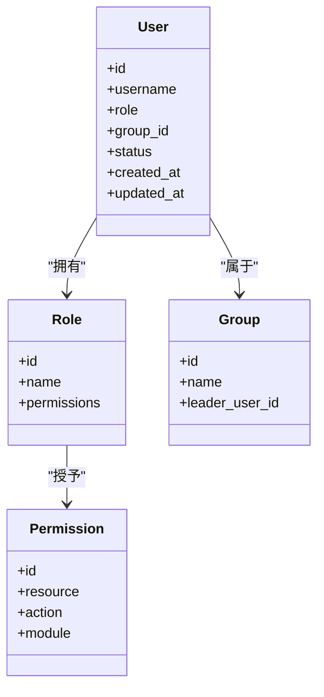
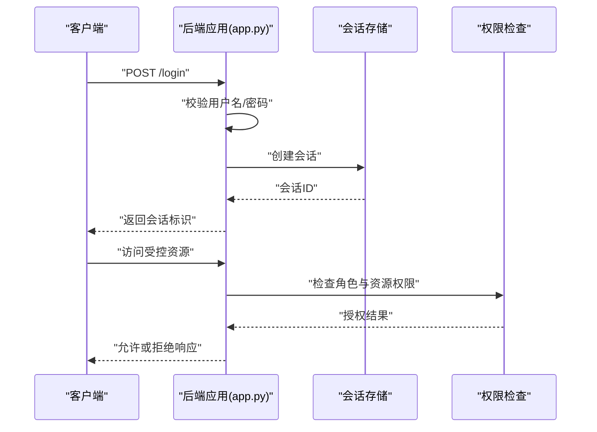
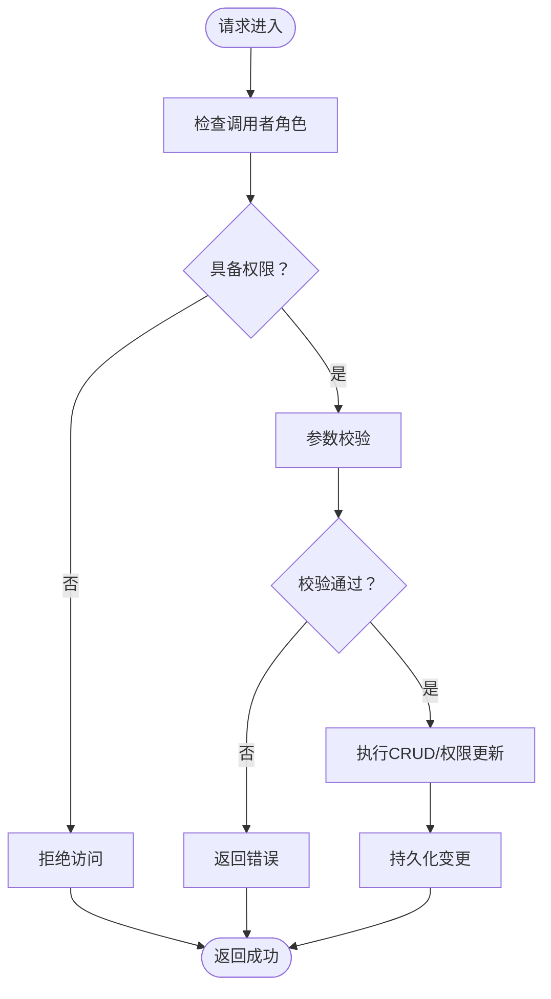
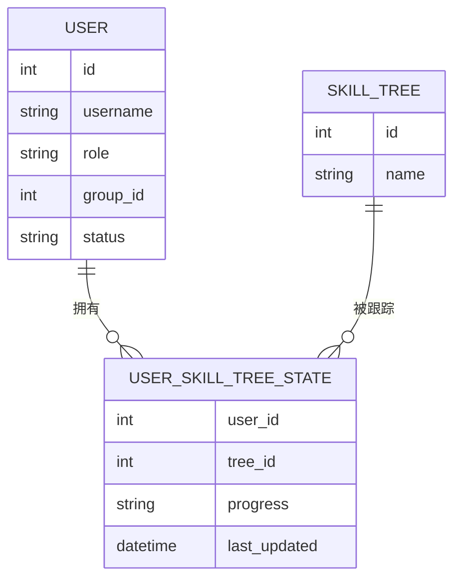
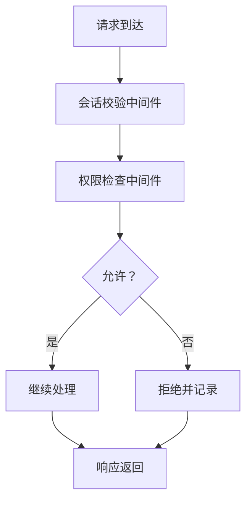
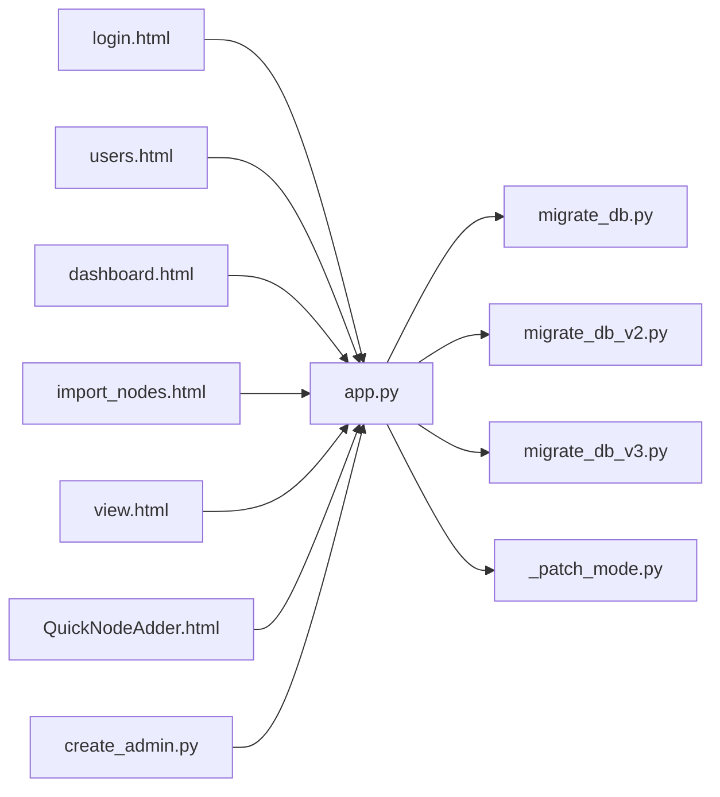

# 用户权限管理模块

<cite>
**本文档引用的文件**
- [app.py](file://app.py)
- [create_admin.py](file://create_admin.py)
- [migrate_db.py](file://migrate_db.py)
- [_patch_mode.py](file://_patch_mode.py)
- [login.html](file://login.html)
- [users.html](file://users.html)
- [dashboard.html](file://dashboard.html)
- [index.html](file://index.html)
- [view.html](file://view.html)
- [import_nodes.html](file://import_nodes.html)
- [QuickNodeAdder.html](file://QuickNodeAdder.html)
</cite>

## 目录
1. [简介](#简介)
2. [项目结构](#项目结构)
3. [核心组件](#核心组件)
4. [架构总览](#架构总览)
5. [详细组件分析](#详细组件分析)
6. [依赖分析](#依赖分析)
7. [性能考虑](#性能考虑)
8. [故障排除指南](#故障排除指南)
9. [结论](#结论)
10. [附录](#附录)

## 简介
本文件面向“用户权限管理模块”，系统性梳理该技能树项目中的用户模型设计、权限体系架构（管理员、组长、普通用户三级）、模块化权限控制机制、用户组别与状态管理、认证与授权流程、用户管理API、用户与技能树关联关系（UserSkillTreeState），以及中间件与安全策略。文档同时提供最佳实践与常见问题解决方案，帮助开发者与运维人员高效理解与维护该模块。

## 项目结构
该项目采用前后端分离的静态页面+后端应用模式：
- 前端页面：登录页、用户管理页、仪表盘、技能树查看与导入等HTML页面
- 后端应用：基于Python的应用入口与数据库迁移脚本
- 数据库迁移：多版本迁移脚本用于初始化与演进权限与用户数据结构

**图表来源**
- [app.py](file://app.py)
- [login.html](file://login.html)
- [users.html](file://users.html)
- [dashboard.html](file://dashboard.html)
- [index.html](file://index.html)
- [view.html](file://view.html)
- [import_nodes.html](file://import_nodes.html)
- [QuickNodeAdder.html](file://QuickNodeAdder.html)
- [migrate_db.py](file://migrate_db.py)
- [migrate_db_v2.py](file://migrate_db_v2.py)
- [migrate_db_v3.py](file://migrate_db_v3.py)
- [_patch_mode.py](file://_patch_mode.py)
- [create_admin.py](file://create_admin.py)

**章节来源**
- [app.py](file://app.py)
- [login.html](file://login.html)
- [users.html](file://users.html)
- [dashboard.html](file://dashboard.html)
- [index.html](file://index.html)
- [view.html](file://view.html)
- [import_nodes.html](file://import_nodes.html)
- [QuickNodeAdder.html](file://QuickNodeAdder.html)
- [migrate_db.py](file://migrate_db.py)
- [migrate_db_v2.py](file://migrate_db_v2.py)
- [migrate_db_v3.py](file://migrate_db_v3.py)
- [_patch_mode.py](file://_patch_mode.py)
- [create_admin.py](file://create_admin.py)

## 核心组件
- 用户模型与权限层级
  - 管理员：拥有最高权限，可管理用户、技能树与系统配置
  - 组长：可管理其组内的成员与技能树进度
  - 普通用户：仅能查看与更新自己的技能树状态
- 权限继承与模块化控制
  - 不同模块（如技能树、用户管理、节点导入）具有独立的权限边界
  - 权限通过角色与资源的映射进行继承与覆盖
- 用户组别与状态
  - 支持按组别划分用户，便于组长管理
  - 用户状态（激活/冻结/删除）影响访问与操作能力
- 认证与授权流程
  - 登录验证：用户名/密码校验与会话建立
  - 授权检查：根据角色与资源权限决定是否放行
- 用户管理API
  - 提供用户CRUD与权限更新接口
- 技能树关联
  - UserSkillTreeState模型用于记录用户与技能树的状态同步

**章节来源**
- [app.py](file://app.py)
- [users.html](file://users.html)
- [dashboard.html](file://dashboard.html)
- [import_nodes.html](file://import_nodes.html)
- [view.html](file://view.html)

## 架构总览
下图展示从浏览器到后端应用与数据库迁移的整体交互：

**图表来源**
- [app.py](file://app.py)
- [login.html](file://login.html)
- [users.html](file://users.html)
- [dashboard.html](file://dashboard.html)
- [import_nodes.html](file://import_nodes.html)
- [view.html](file://view.html)
- [QuickNodeAdder.html](file://QuickNodeAdder.html)
- [migrate_db.py](file://migrate_db.py)
- [migrate_db_v2.py](file://migrate_db_v2.py)
- [migrate_db_v3.py](file://migrate_db_v3.py)
- [_patch_mode.py](file://_patch_mode.py)
- [create_admin.py](file://create_admin.py)

## 详细组件分析

### 用户模型与权限层级
- 角色定义
  - 管理员：全局管理权限
  - 组长：组内管理权限
  - 普通用户：个人权限
- 权限继承
  - 组长继承其组内的部分权限
  - 管理员继承所有模块的最高权限
- 模块化权限
  - 技能树模块、用户管理模块、节点导入模块各自维护权限边界
  - 跨模块权限通过角色映射实现

**图表来源**
- [app.py](file://app.py)
- [users.html](file://users.html)

**章节来源**
- [app.py](file://app.py)
- [users.html](file://users.html)

### 认证与授权流程
- 登录验证
  - 客户端提交凭据至后端
  - 后端校验凭据并生成会话
- 授权检查
  - 请求到达时，根据用户角色与资源权限判断是否允许
- 会话管理
  - 会话存储在服务端或客户端（如Cookie/Token），并设置过期策略

**图表来源**
- [app.py](file://app.py)
- [login.html](file://login.html)

**章节来源**
- [app.py](file://app.py)
- [login.html](file://login.html)

### 用户管理API
- 用户CRUD
  - 创建用户、更新用户信息、删除用户、查询用户列表
- 权限更新
  - 更新用户角色、组别与状态
- 安全要求
  - 所有写操作需管理员或相应模块授权

**图表来源**
- [users.html](file://users.html)
- [app.py](file://app.py)

**章节来源**
- [users.html](file://users.html)
- [app.py](file://app.py)

### 用户与技能树关联(UserSkillTreeState)
- 关联目的
  - 记录用户对特定技能树的完成状态、进度与历史
- 状态同步
  - 当用户完成节点、修改进度时，同步更新UserSkillTreeState
- 数据一致性
  - 通过事务或幂等写入保证状态一致

**图表来源**
- [app.py](file://app.py)
- [view.html](file://view.html)

**章节来源**
- [app.py](file://app.py)
- [view.html](file://view.html)

### 中间件与安全策略
- 中间件职责
  - 统一会话校验、权限拦截、日志记录
- 安全策略
  - 强制HTTPS、CSRF防护、最小权限原则、审计日志

**图表来源**
- [app.py](file://app.py)

**章节来源**
- [app.py](file://app.py)

## 依赖分析
- 前端页面依赖后端应用提供的API与会话
- 后端应用依赖数据库迁移脚本以确保权限与用户表结构正确
- 迁移脚本之间存在版本演进关系，需按顺序执行

**图表来源**
- [app.py](file://app.py)
- [login.html](file://login.html)
- [users.html](file://users.html)
- [dashboard.html](file://dashboard.html)
- [import_nodes.html](file://import_nodes.html)
- [view.html](file://view.html)
- [QuickNodeAdder.html](file://QuickNodeAdder.html)
- [migrate_db.py](file://migrate_db.py)
- [migrate_db_v2.py](file://migrate_db_v2.py)
- [migrate_db_v3.py](file://migrate_db_v3.py)
- [_patch_mode.py](file://_patch_mode.py)
- [create_admin.py](file://create_admin.py)

**章节来源**
- [app.py](file://app.py)
- [migrate_db.py](file://migrate_db.py)
- [migrate_db_v2.py](file://migrate_db_v2.py)
- [migrate_db_v3.py](file://migrate_db_v3.py)
- [_patch_mode.py](file://_patch_mode.py)
- [create_admin.py](file://create_admin.py)

## 性能考虑
- 会话存储与缓存
  - 使用高性能缓存存储会话与权限元数据
- 权限检查优化
  - 将常用权限映射预热到内存，减少数据库查询
- 数据库索引
  - 对用户、角色、权限相关的字段建立索引，提升查询效率
- 分页与批量操作
  - 用户列表与权限更新采用分页与批量提交，降低单次请求压力

## 故障排除指南
- 登录失败
  - 检查用户名/密码是否正确，确认会话是否创建成功
  - 查看后端日志定位认证异常
- 权限不足
  - 确认当前用户角色与目标资源权限是否匹配
  - 检查中间件是否正确拦截未授权请求
- 数据不一致
  - 检查UserSkillTreeState的同步逻辑，确保事务完整性
- 数据库迁移失败
  - 按顺序执行迁移脚本，确保前一版本迁移成功后再执行后续版本

**章节来源**
- [app.py](file://app.py)
- [login.html](file://login.html)
- [users.html](file://users.html)
- [view.html](file://view.html)
- [migrate_db.py](file://migrate_db.py)
- [migrate_db_v2.py](file://migrate_db_v2.py)
- [migrate_db_v3.py](file://migrate_db_v3.py)
- [_patch_mode.py](file://_patch_mode.py)

## 结论
该用户权限管理模块通过清晰的角色分层、模块化权限控制与完善的中间件安全策略，实现了管理员、组长与普通用户的差异化权限管理。结合UserSkillTreeState模型，系统能够有效追踪用户与技能树的状态同步。建议在生产环境中强化会话与权限缓存、完善审计日志与监控告警，并持续演进数据库迁移脚本以适配业务变化。

## 附录
- 最佳实践
  - 严格遵循最小权限原则，避免过度授权
  - 对敏感操作增加二次确认与审计日志
  - 定期审查与清理无效会话与过期权限
- 常见问题
  - 权限继承链过长导致复杂度上升：建议简化角色层级或引入权限模板
  - 用户状态变更未及时同步：建议在状态变更处统一入口并触发同步任务