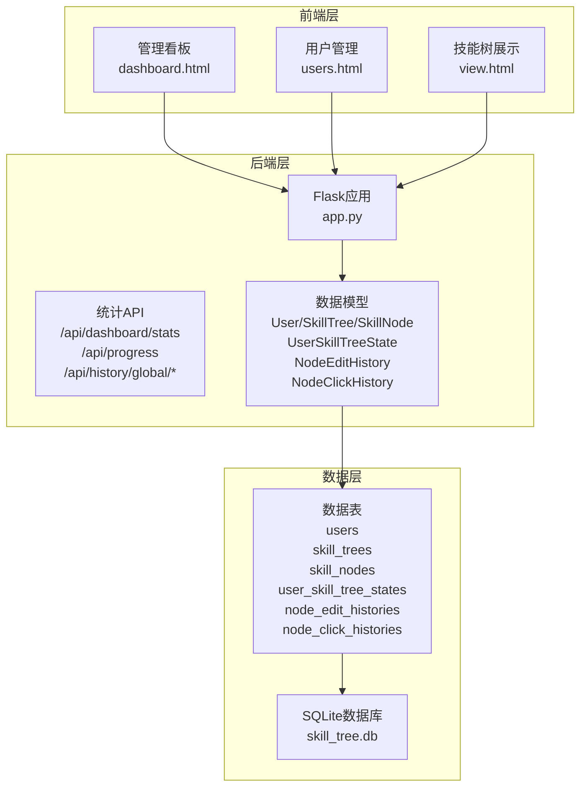
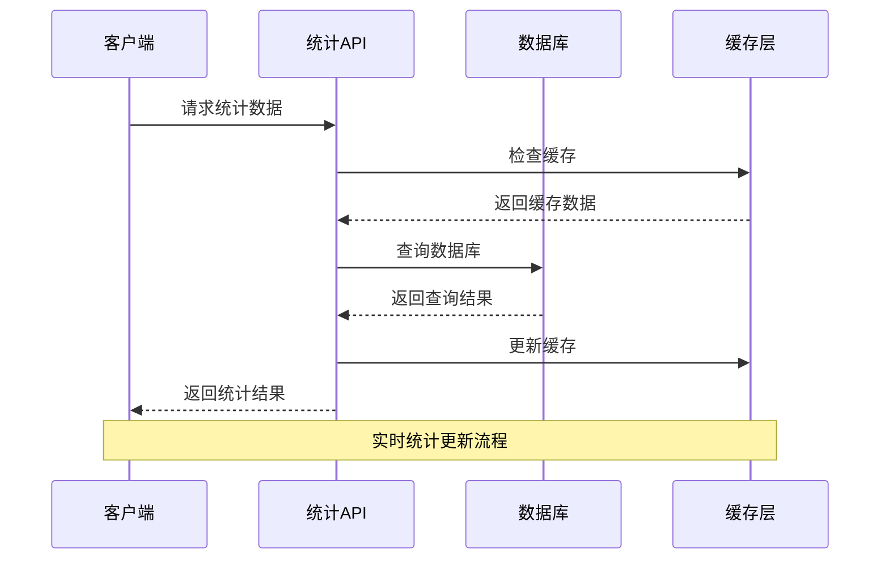
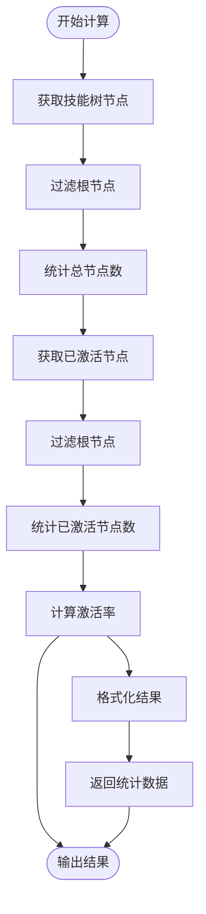
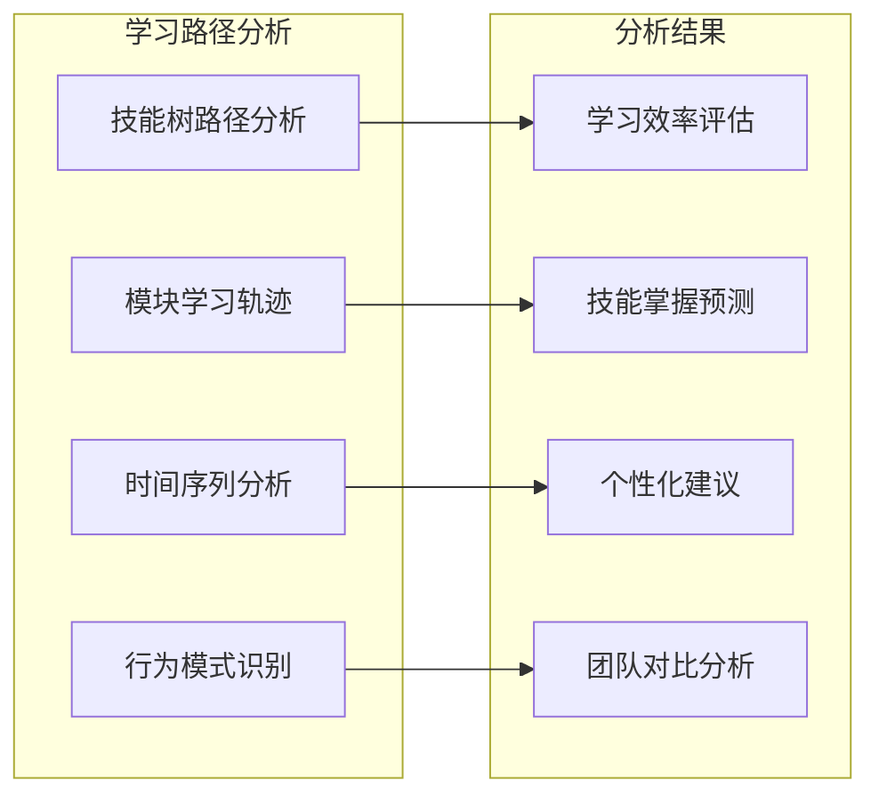
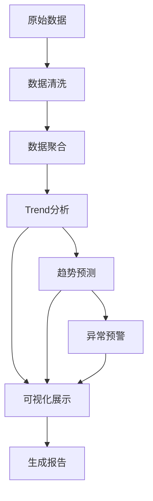
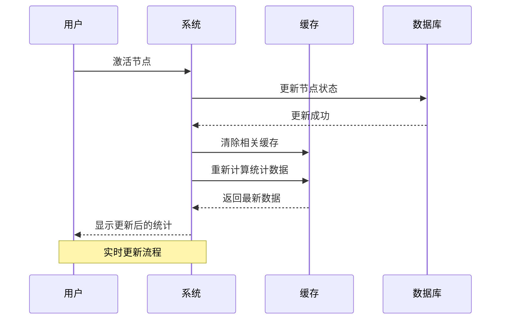
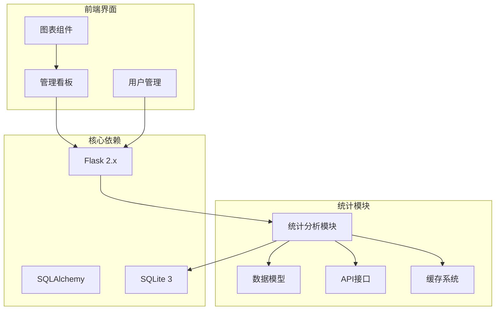

# 统计分析模块

<cite>
**本文档引用的文件**
- [app.py](file://app.py)
- [dashboard.html](file://dashboard.html)
- [users.html](file://users.html)
- [README.md](file://README.md)
- [节点信息显示方案.md](file://节点信息显示方案.md)
- [项目说明文档.md](file://项目说明文档.md)
- [migrate_db.py](file://migrate_db.py)
- [migrate_db_v2.py](file://migrate_db_v2.py)
- [migrate_db_v3.py](file://migrate_db_v3.py)
</cite>

## 目录
1. [简介](#简介)
2. [项目结构](#项目结构)
3. [核心组件](#核心组件)
4. [架构概览](#架构概览)
5. [详细组件分析](#详细组件分析)
6. [依赖分析](#依赖分析)
7. [性能考虑](#性能考虑)
8. [故障排除指南](#故障排除指南)
9. [结论](#结论)
10. [附录](#附录)

## 简介

统计分析模块是技能树管理系统的核心功能之一，负责提供全面的数据洞察和决策支持。该模块通过收集和分析用户行为数据、技能树使用情况以及学习进度信息，为管理员和用户提供可视化的统计报告和趋势分析。

系统采用Flask后端配合SQLite数据库的设计，实现了从数据采集、处理到展示的完整统计分析流程。模块支持实时数据更新、历史数据追踪、多维度统计分析等功能，为企业的技能培养和人才发展提供科学的数据支撑。

## 项目结构

技能树管理系统采用前后端分离的架构设计，统计分析模块位于后端Flask应用中，通过RESTful API为前端界面提供数据支持。



**图表来源**
- [app.py:17-22](file://app.py#L17-L22)
- [dashboard.html:1-800](file://dashboard.html#L1-L800)
- [users.html:1-800](file://users.html#L1-L800)

**章节来源**
- [app.py:17-22](file://app.py#L17-L22)
- [README.md:61-78](file://README.md#L61-L78)

## 核心组件

统计分析模块由多个核心组件构成，每个组件负责特定的统计功能：

### 数据模型层
- **User模型**：用户基本信息和权限控制
- **SkillTree模型**：技能树结构和元数据
- **SkillNode模型**：节点详细信息和属性
- **UserSkillTreeState模型**：用户技能树状态跟踪
- **NodeEditHistory模型**：节点编辑历史记录
- **NodeClickHistory模型**：节点点击行为追踪

### API接口层
- **进度统计API**：用户学习进度计算和展示
- **全局统计API**：平台级数据汇总和分析
- **历史追踪API**：节点操作和点击历史查询
- **任务管理API**：学习任务分配和审核流程

### 前端展示层
- **管理看板**：实时数据可视化和趋势分析
- **用户管理界面**：用户进度和个人统计
- **交互式图表**：支持下钻和筛选的数据透视

**章节来源**
- [app.py:25-151](file://app.py#L25-L151)
- [app.py:1408-1841](file://app.py#L1408-L1841)

## 架构概览

统计分析模块采用分层架构设计，确保数据流的清晰性和系统的可维护性。



**图表来源**
- [app.py:1740-1841](file://app.py#L1740-L1841)
- [app.py:1408-1495](file://app.py#L1408-L1495)

系统架构特点：
- **实时数据更新**：支持节点激活、编辑、点击等操作的实时统计
- **多维度分析**：支持按用户、模块、小组等多维度进行数据分析
- **历史数据追踪**：完整的操作历史记录和趋势分析
- **缓存优化**：采用多级缓存策略提升查询性能

**章节来源**
- [app.py:1740-1841](file://app.py#L1740-L1841)
- [app.py:1498-1652](file://app.py#L1498-L1652)

## 详细组件分析

### 进度统计功能

进度统计功能是统计分析模块的核心，负责计算和展示用户的学习进度。

#### 节点激活率计算

节点激活率是衡量用户技能掌握程度的重要指标，计算公式为：

```
激活率 = (已激活节点数 / 总节点数) × 100%
```

系统通过以下步骤实现激活率计算：



**图表来源**
- [app.py:1464-1495](file://app.py#L1464-L1495)

#### 用户完成度统计

用户完成度统计提供更细致的进度分析，包括：

- **技能树维度**：每个技能树的完成进度
- **模块维度**：按技能模块划分的进度统计
- **时间维度**：历史进度趋势分析

**章节来源**
- [app.py:1408-1495](file://app.py#L1408-L1495)

### 用户表现分析

用户表现分析模块提供深入的用户学习行为洞察：

#### 技能掌握程度评估

系统通过以下指标评估用户的技能掌握程度：

- **激活节点数量**：用户已掌握的技能点数量
- **激活率分布**：不同技能树的掌握程度
- **模块掌握度**：按技能模块划分的掌握情况
- **时间效率**：用户完成技能的时间表现

#### 学习路径分析

学习路径分析帮助识别用户的学习模式和偏好：



**图表来源**
- [app.py:1740-1841](file://app.py#L1740-L1841)

**章节来源**
- [app.py:1740-1841](file://app.py#L1740-L1841)

### 历史数据追踪机制

历史数据追踪机制确保所有用户行为都能被完整记录和分析。

#### NodeClickHistory模型

NodeClickHistory模型记录节点点击行为：

| 字段名 | 类型 | 描述 | 用途 |
|--------|------|------|------|
| id | Integer | 主键 | 唯一标识 |
| tree_id | Integer | 技能树ID | 关联技能树 |
| node_id | String | 节点ID | 关联节点 |
| user_id | Integer | 用户ID | 操作者 |
| username | String | 用户名 | 显示用 |
| created_at | DateTime | 创建时间 | 时间戳 |

#### NodeEditHistory模型

NodeEditHistory模型记录节点编辑历史：

| 字段名 | 类型 | 描述 | 用途 |
|--------|------|------|------|
| id | Integer | 主键 | 唯一标识 |
| tree_id | Integer | 技能树ID | 关联技能树 |
| node_id | String | 节点ID | 关联节点 |
| user_id | Integer | 用户ID | 操作者 |
| username | String | 用户名 | 显示用 |
| change_details | Text | 变更详情 | JSON格式 |
| created_at | DateTime | 创建时间 | 时间戳 |

**章节来源**
- [app.py:124-151](file://app.py#L124-L151)

### 报表生成功能

报表生成功能提供多种格式的数据展示和导出选项：

#### 统计数据聚合

系统支持多维度的数据聚合：

- **平台级聚合**：全站用户、技能树、节点统计
- **小组级聚合**：按A/B/C/D小组划分的统计
- **模块级聚合**：按技能模块划分的统计
- **用户级聚合**：个人学习进度统计

#### 图表展示

前端界面提供丰富的图表展示：

- **进度条图表**：直观显示完成度
- **排行榜**：用户学习成就排名
- **趋势图**：历史数据变化趋势
- **热力图**：热门技能点分析

#### 导出功能

支持多种格式的数据导出：

- **CSV格式**：便于Excel处理
- **JSON格式**：便于程序处理
- **PDF格式**：便于打印和分享

**章节来源**
- [dashboard.html:640-800](file://dashboard.html#L640-L800)

### 统计指标计算逻辑

统计指标计算采用精确的算法设计，确保数据的准确性和可靠性。

#### 时间维度分析

时间维度分析支持多种时间粒度：

- **实时统计**：当前时刻的数据快照
- **日统计**：每日数据汇总
- **周统计**：每周数据汇总
- **月统计**：每月数据汇总
- **年统计**：每年数据汇总

#### 趋势预测

系统提供基础的趋势预测功能：



**图表来源**
- [app.py:1549-1652](file://app.py#L1549-L1652)

**章节来源**
- [app.py:1549-1652](file://app.py#L1549-L1652)

### 实时统计更新机制

实时统计更新机制确保数据的时效性和准确性。

#### 数据更新流程



**图表来源**
- [app.py:777-901](file://app.py#L777-L901)

#### 缓存策略

系统采用多级缓存策略：

- **内存缓存**：热点数据缓存
- **数据库缓存**：查询结果缓存
- **前端缓存**：浏览器缓存
- **CDN缓存**：静态资源缓存

**章节来源**
- [app.py:777-901](file://app.py#L777-L901)

### 统计分析API接口文档

统计分析模块提供完整的API接口，支持各种统计查询需求。

#### 进度统计API

| 接口 | 方法 | 描述 | 参数 |
|------|------|------|------|
| `/api/progress` | GET | 获取用户进度信息 | user_id, all |
| `/api/dashboard/stats` | GET | 获取管理看板统计数据 | 无 |
| `/api/trees/{tree_id}/nodes/{node_id}/history` | GET | 获取节点历史统计 | 无 |

#### 历史追踪API

| 接口 | 方法 | 描述 | 参数 |
|------|------|------|------|
| `/api/history/global/clicks` | GET | 获取全局点击统计 | ranking_limit, page, per_page |
| `/api/history/global/edits` | GET | 获取全局编辑历史 | page, per_page |
| `/api/trees/{tree_id}/nodes/{node_id}/click` | POST | 记录节点点击 | user_id |

#### 任务管理API

| 接口 | 方法 | 描述 | 参数 |
|------|------|------|------|
| `/api/tasks/assign` | POST | 分配学习任务 | assigner_id, user_id, tree_id, node_ids, task_type |
| `/api/tasks/my` | GET | 获取用户任务列表 | user_id |
| `/api/tasks/pending` | GET | 获取待审核列表 | user_id |

**章节来源**
- [app.py:1408-1841](file://app.py#L1408-L1841)

### 前端集成和交互设计

前端界面提供直观的统计数据显示和交互功能。

#### 管理看板集成

管理看板通过AJAX请求获取统计数据：

```javascript
// 示例：获取管理看板数据
async function loadDashboardStats() {
    try {
        const response = await fetch('/api/dashboard/stats');
        const data = await response.json();
        updateDashboardUI(data);
    } catch (error) {
        console.error('加载统计数据失败:', error);
    }
}

// 更新看板界面
function updateDashboardUI(stats) {
    document.getElementById('val_users').textContent = stats.overview.total_users;
    document.getElementById('val_trees').textContent = stats.overview.total_trees;
    document.getElementById('val_nodes').textContent = stats.overview.total_nodes;
    document.getElementById('val_activations').textContent = stats.overview.total_activations;
}
```

#### 交互设计特点

- **实时更新**：统计数据随用户操作实时更新
- **响应式设计**：支持多种设备和屏幕尺寸
- **可视化图表**：丰富的图表类型和交互功能
- **多维度筛选**：支持按用户、模块、时间等多维度筛选

**章节来源**
- [dashboard.html:640-800](file://dashboard.html#L640-L800)

### 管理员决策支持

管理员决策支持功能提供全面的数据洞察和分析工具。

#### 数据洞察功能

- **学习热力分析**：识别最受欢迎的技能点和学习内容
- **团队对比分析**：比较不同小组的学习进度和效率
- **趋势预测**：基于历史数据预测未来学习趋势
- **异常检测**：识别学习异常和潜在问题

#### 决策支持工具

- **个性化建议**：基于用户表现提供学习建议
- **资源配置**：根据学习需求调整资源分配
- **干预措施**：识别需要帮助的用户并提供支持
- **效果评估**：评估培训项目的效果和ROI

**章节来源**
- [项目说明文档.md:34-46](file://项目说明文档.md#L34-L46)

## 依赖分析

统计分析模块的依赖关系相对简单，主要依赖于Flask框架和SQLite数据库。



**图表来源**
- [app.py:5-10](file://app.py#L5-L10)
- [requirements.txt](file://requirements.txt)

**章节来源**
- [app.py:5-10](file://app.py#L5-L10)

## 性能考虑

统计分析模块在设计时充分考虑了性能优化：

### 数据库优化

- **索引优化**：为常用查询字段建立索引
- **查询优化**：使用高效的SQL查询语句
- **连接池**：使用数据库连接池提高并发性能
- **事务管理**：合理使用事务确保数据一致性

### 缓存策略

- **多级缓存**：内存缓存、数据库缓存、前端缓存
- **缓存失效**：基于数据变更的智能缓存失效
- **预加载机制**：提前加载可能使用的数据

### 前端优化

- **懒加载**：图表和大数据的懒加载
- **虚拟滚动**：大量数据的虚拟滚动显示
- **防抖节流**：优化用户交互响应

## 故障排除指南

### 常见问题和解决方案

#### 数据不一致问题

**问题描述**：统计数据与实际状态不一致

**解决方案**：
1. 检查数据库连接和事务处理
2. 验证缓存同步机制
3. 确认数据更新的原子性

#### 性能问题

**问题描述**：统计查询响应缓慢

**解决方案**：
1. 分析慢查询日志
2. 优化数据库索引
3. 实施分页和限制查询结果集大小

#### 数据丢失问题

**问题描述**：历史统计数据丢失

**解决方案**：
1. 检查数据库备份策略
2. 验证数据迁移脚本
3. 实施数据完整性检查

**章节来源**
- [migrate_db.py:8-36](file://migrate_db.py#L8-L36)
- [migrate_db_v2.py:6-30](file://migrate_db_v2.py#L6-L30)
- [migrate_db_v3.py:8-31](file://migrate_db_v3.py#L8-L31)

## 结论

统计分析模块为技能树管理系统提供了全面的数据洞察和决策支持功能。通过精确的统计计算、实时的数据更新和丰富的可视化展示，系统能够有效支持企业的人才培养和技能发展需求。

模块的主要优势包括：

- **全面的数据覆盖**：从用户行为到技能掌握的全方位统计
- **实时的数据更新**：确保统计数据的时效性和准确性
- **灵活的分析维度**：支持多维度、多层次的数据分析
- **友好的用户界面**：直观的图表展示和交互体验
- **可靠的系统架构**：稳定的数据处理和存储机制

未来可以进一步扩展的功能包括机器学习算法的应用、更复杂的数据挖掘分析、以及与其他企业系统的深度集成。

## 附录

### 数据库迁移脚本

系统提供了完整的数据库迁移脚本，确保数据结构的演进和兼容性。

**章节来源**
- [migrate_db.py:1-41](file://migrate_db.py#L1-L41)
- [migrate_db_v2.py:1-34](file://migrate_db_v2.py#L1-L34)
- [migrate_db_v3.py:1-35](file://migrate_db_v3.py#L1-L35)

### API使用示例

以下是一些常用的API调用示例：

#### 获取用户进度统计

```javascript
fetch('/api/progress?user_id=1&all=true')
    .then(response => response.json())
    .then(data => console.log(data))
    .catch(error => console.error('Error:', error));
```

#### 获取管理看板数据

```javascript
fetch('/api/dashboard/stats')
    .then(response => response.json())
    .then(data => updateDashboard(data))
    .catch(error => console.error('Error:', error));
```

**章节来源**
- [README.md:113-213](file://README.md#L113-L213)