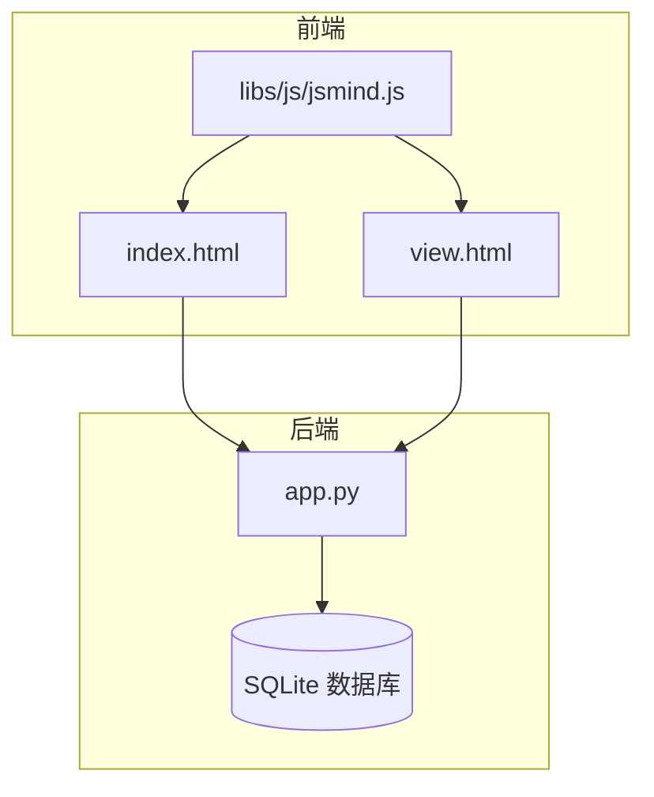
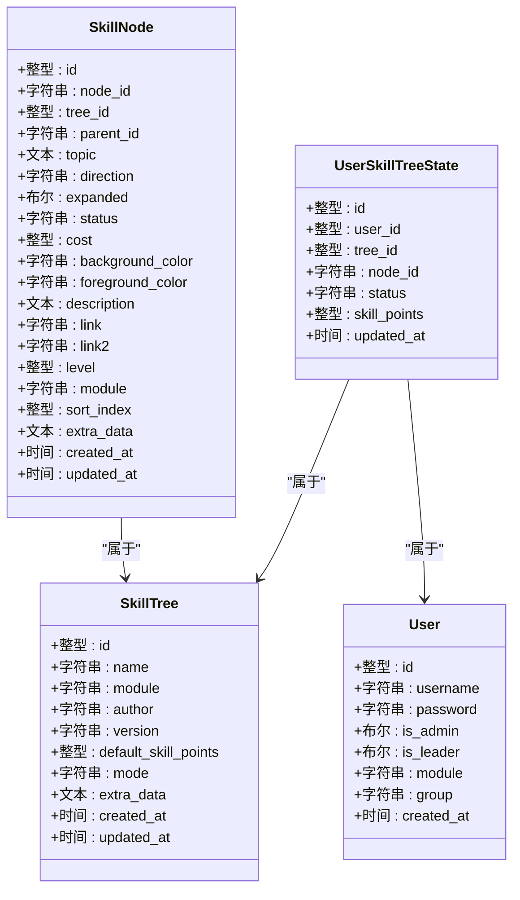
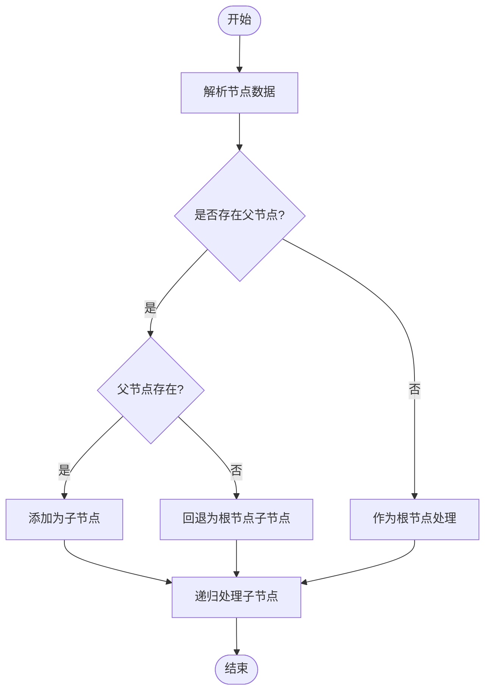
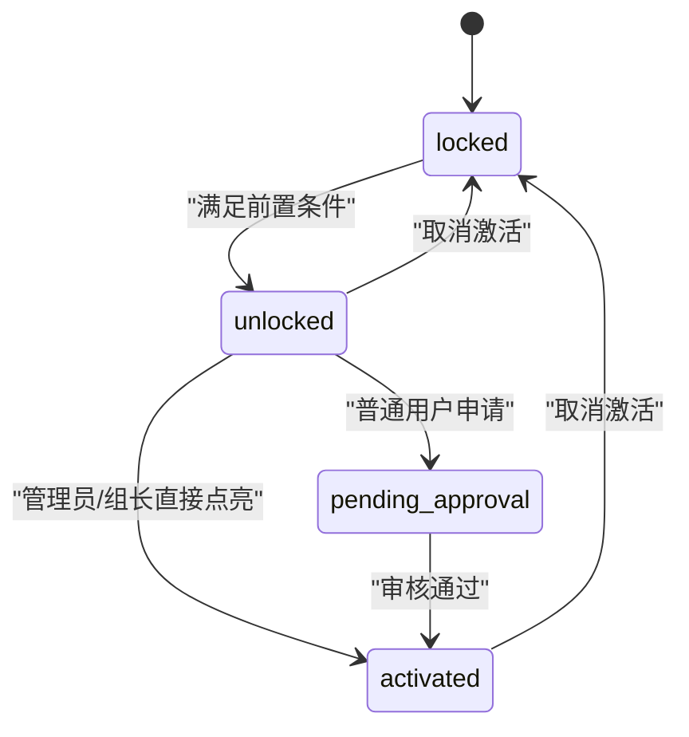
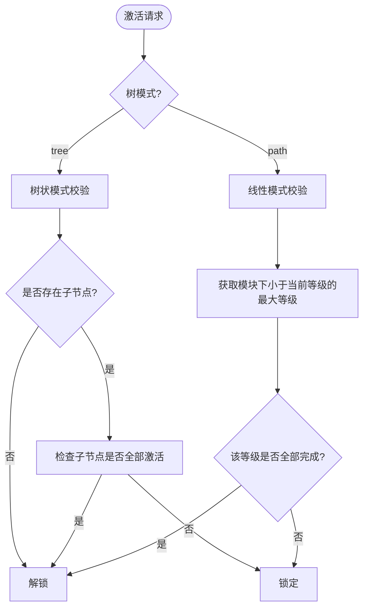
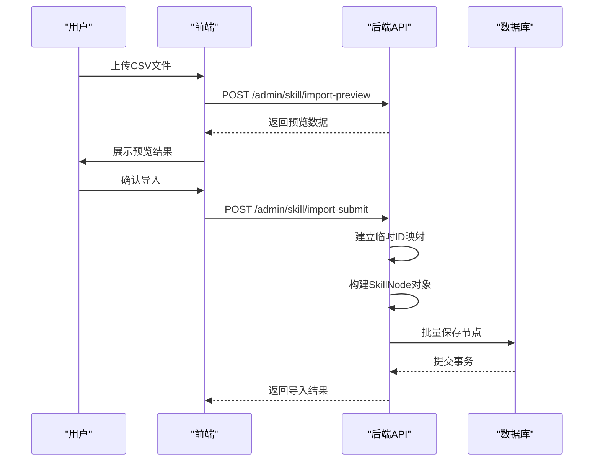
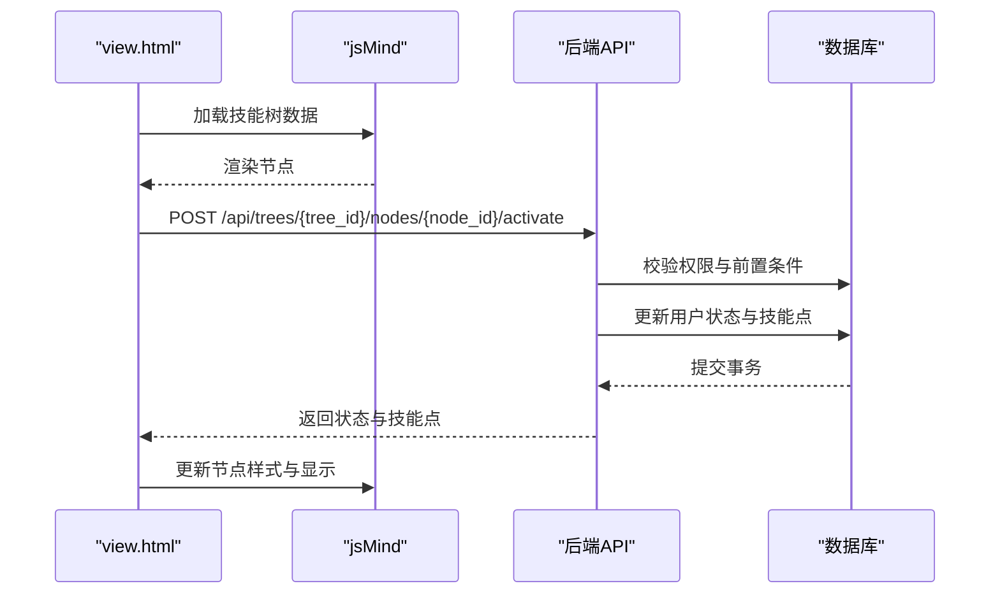
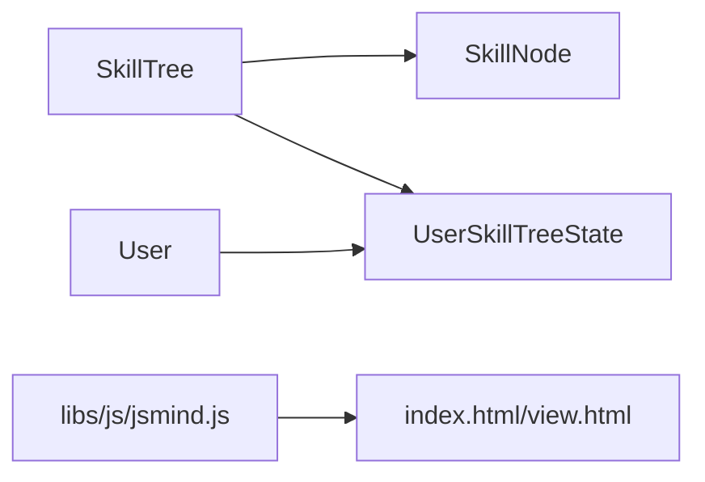

# 节点操作模块

<cite>
**本文档引用的文件**
- [app.py](file://app.py)
- [README.md](file://README.md)
- [index.html](file://index.html)
- [view.html](file://view.html)
- [libs/js/jsmind.js](file://libs/js/jsmind.js)
- [_patch_mode.py](file://_patch_mode.py)
</cite>

## 目录
1. [简介](#简介)
2. [项目结构](#项目结构)
3. [核心组件](#核心组件)
4. [架构概览](#架构概览)
5. [详细组件分析](#详细组件分析)
6. [依赖分析](#依赖分析)
7. [性能考虑](#性能考虑)
8. [故障排除指南](#故障排除指南)
9. [结论](#结论)
10. [附录](#附录)

## 简介
本文件为技能树系统的节点操作模块技术文档，围绕SkillNode模型的完整功能进行深入说明，涵盖节点的创建、更新、删除和查询操作；节点层级关系的实现机制（父子节点关联、树形结构维护、循环依赖检测）；节点状态管理（locked/unlocked/activated）的状态转换逻辑与业务规则；节点激活算法（树状模式与线性模式）的实现细节；节点属性系统（等级、模块、成本、样式配置）；节点数据导入与导出流程；权限控制与安全验证机制；以及前端jsMind集成的节点交互与事件处理指南。

## 项目结构
技能树系统采用前后端分离架构：
- 后端：基于Flask + SQLAlchemy，提供RESTful API，负责数据持久化、业务逻辑与权限控制
- 前端：基于jsMind可视化库，提供技能树的图形化展示与交互
- 数据库：SQLite，使用SQLAlchemy ORM进行模型定义与操作



**图表来源**
- [app.py:17-22](file://app.py#L17-L22)
- [index.html:1-100](file://index.html#L1-L100)
- [view.html:1-100](file://view.html#L1-L100)
- [libs/js/jsmind.js:314-585](file://libs/js/jsmind.js#L314-L585)

**章节来源**
- [README.md:61-78](file://README.md#L61-L78)
- [app.py:17-22](file://app.py#L17-L22)

## 核心组件
本模块的核心数据模型与API如下：

- 数据模型
  - SkillNode：技能节点表，包含节点ID、父节点ID、主题、方向、展开状态、状态、成本、颜色、描述、链接、等级、模块、排序索引、额外数据等字段
  - SkillTree：技能树表，包含树ID、名称、模块、作者、版本、默认技能点、激活模式、扩展数据等
  - User：用户表，包含用户ID、用户名、密码、管理员/组长权限、模块、分组等
  - UserSkillTreeState：用户技能树状态表，记录用户在特定技能树中的节点状态与技能点
  - NodeEditHistory/NodeClickHistory：节点编辑与点击历史表，用于审计与统计
  - LearningTask：学习任务表，支持管理员/组长分配学习任务

- API接口（节选）
  - 技能树管理：GET/POST/PUT/DELETE /api/trees
  - 节点管理：POST /api/trees/{tree_id}/nodes、PUT /api/trees/{tree_id}/nodes/{node_id}
  - 节点激活：POST /api/trees/{tree_id}/nodes/{node_id}/activate
  - 节点取消激活：POST /api/trees/{tree_id}/nodes/{node_id}/deactivate
  - 技能点管理：PUT /api/trees/{tree_id}/skill-points
  - 技能树重置：POST /api/trees/{tree_id}/reset、POST /api/users/{user_id}/trees/{tree_id}/reset
  - 模式切换：PUT /api/trees/{tree_id}/mode
  - 导入/导出：/admin/skill/import-preview、/admin/skill/import-submit、/api/skill-trees/list

**章节来源**
- [app.py:42-122](file://app.py#L42-L122)
- [app.py:183-275](file://app.py#L183-L275)
- [app.py:385-561](file://app.py#L385-L561)
- [app.py:562-686](file://app.py#L562-L686)
- [app.py:777-930](file://app.py#L777-L930)
- [app.py:948-1052](file://app.py#L948-L1052)
- [app.py:1055-1134](file://app.py#L1055-L1134)
- [app.py:1137-1378](file://app.py#L1137-L1378)
- [app.py:1381-1406](file://app.py#L1381-L1406)
- [app.py:1498-1546](file://app.py#L1498-L1546)

## 架构概览
系统采用三层架构：
- 表现层：index.html（管理界面）、view.html（展示界面）
- 业务层：Flask路由与业务逻辑，负责权限校验、状态计算、激活算法
- 数据层：SQLAlchemy模型与SQLite数据库

```mermaid
graph TB
FE1[index.html]
FE2[view.html]
API[Flask API(app.py)]
ORM[SQLAlchemy模型]
DB[(SQLite)]
FE1 --> API
FE2 --> API
API --> ORM
ORM --> DB
```

**图表来源**
- [app.py:17-22](file://app.py#L17-L22)
- [index.html:1-100](file://index.html#L1-L100)
- [view.html:1-100](file://view.html#L1-L100)

## 详细组件分析

### SkillNode模型与节点操作
SkillNode模型定义了节点的完整属性与行为，支持以下操作：
- 创建：通过POST /api/trees/{tree_id}/nodes或批量导入
- 更新：通过PUT /api/trees/{tree_id}/nodes/{node_id}
- 删除：通过DELETE（由管理界面触发，后端逻辑在批量导入处体现）
- 查询：通过GET /api/trees/{tree_id}返回jsMind格式数据



**图表来源**
- [app.py:63-102](file://app.py#L63-L102)
- [app.py:42-61](file://app.py#L42-L61)
- [app.py:25-40](file://app.py#L25-L40)
- [app.py:105-122](file://app.py#L105-L122)

**章节来源**
- [app.py:63-102](file://app.py#L63-L102)
- [app.py:562-607](file://app.py#L562-L607)
- [app.py:712-775](file://app.py#L712-L775)
- [app.py:1078-1134](file://app.py#L1078-L1134)

### 节点层级关系与树形结构维护
- 父子节点关联：通过parent_id字段维护父子关系，root节点parent_id为None
- 树形结构构建：save_nodes递归保存节点及其子节点，build_jsmind_data构建jsMind格式数据
- 循环依赖检测：在构建树形结构时，若父节点不存在则将其作为根节点子节点处理，避免循环引用导致的异常



**图表来源**
- [app.py:1078-1134](file://app.py#L1078-L1134)
- [app.py:1238-1251](file://app.py#L1238-L1251)

**章节来源**
- [app.py:1078-1134](file://app.py#L1078-L1134)
- [app.py:1238-1251](file://app.py#L1238-L1251)

### 节点状态管理与业务规则
节点状态包括：
- locked：默认锁定状态，灰色显示，带锁图标，无法激活
- unlocked：已解锁但未激活，半透明显示
- activated：已激活，正常颜色，带高亮动画和✓标记
- pending_approval：待审核状态（管理员/组长审核）

状态转换逻辑：
- 激活条件：根据树的激活模式（tree/path）进行前置条件检查
- 权限控制：非管理员只能在自己所属模块的技能树中激活节点
- 技能点消耗：激活节点消耗相应技能点，取消激活时返还技能点
- 审核流程：普通用户激活节点进入待审核状态，管理员/组长审核通过后正式点亮



**图表来源**
- [app.py:777-901](file://app.py#L777-L901)
- [app.py:904-930](file://app.py#L904-L930)
- [app.py:1288-1351](file://app.py#L1288-L1351)

**章节来源**
- [app.py:777-901](file://app.py#L777-L901)
- [app.py:904-930](file://app.py#L904-L930)
- [app.py:1288-1351](file://app.py#L1288-L1351)

### 节点激活算法（树状模式 vs 线性模式）
- 树状模式（tree）：自下而上，所有子节点必须全部激活，当前节点才能解锁
- 线性模式（path/linear）：按等级推进，同一模块下比当前等级低的最大等级必须全部完成，当前等级才能解锁



**图表来源**
- [app.py:809-846](file://app.py#L809-L846)
- [app.py:1288-1343](file://app.py#L1288-L1343)

**章节来源**
- [app.py:809-846](file://app.py#L809-L846)
- [app.py:1288-1343](file://app.py#L1288-L1343)

### 节点属性系统
- 等级（level）：1=初级, 2=中级, 3=高级等，用于线性模式的等级推进
- 模块（module）：节点所属模块，用于权限控制与进度统计
- 成本（cost）：激活节点消耗的技能点
- 样式配置：背景色（background_color）、前景色（foreground_color）、描述（description）、链接（link/link2）

**章节来源**
- [app.py:90-93](file://app.py#L90-L93)
- [app.py:75-88](file://app.py#L75-L88)

### 节点数据导入与导出
- 导入流程：
  - 预览：/admin/skill/import-preview解析上传文件并返回JSON用于前端表格预览
  - 提交：/admin/skill/import-submit解析CSV数据，建立临时ID映射，构建SkillNode对象并批量保存
- 导出流程：通过GET /api/trees/{tree_id}返回jsMind格式数据，前端可进一步导出为JSON



**图表来源**
- [app.py:189-204](file://app.py#L189-L204)
- [app.py:208-275](file://app.py#L208-L275)

**章节来源**
- [app.py:189-204](file://app.py#L189-L204)
- [app.py:208-275](file://app.py#L208-L275)

### 权限控制与安全验证
- 用户权限：管理员（is_admin）与组长（is_leader）拥有更高权限
- 模块权限：非管理员只能在自己所属模块的技能树中激活节点
- 审核机制：普通用户激活节点需管理员/组长审核，防止误操作
- 安全建议：密码应进行加密存储与校验，当前实现为明文对比

**章节来源**
- [app.py:790-796](file://app.py#L790-L796)
- [app.py:2030-2080](file://app.py#L2030-L2080)

### 前端jsMind集成与节点交互
- 数据格式：后端返回jsMind node_tree格式数据，包含元数据与节点树
- 展示与交互：view.html中实现节点点击激活、状态更新、技能点显示等功能
- 事件处理：节点点击触发激活请求，根据响应更新节点样式与技能点



**图表来源**
- [app.py:1137-1378](file://app.py#L1137-L1378)
- [view.html:2286-2317](file://view.html#L2286-L2317)

**章节来源**
- [app.py:1137-1378](file://app.py#L1137-L1378)
- [view.html:2286-2317](file://view.html#L2286-L2317)

## 依赖分析
模块间依赖关系：
- SkillNode依赖SkillTree（外键）
- UserSkillTreeState依赖User与SkillTree
- 前端jsMind库用于数据渲染与交互



**图表来源**
- [app.py:69-70](file://app.py#L69-L70)
- [app.py:105-111](file://app.py#L105-L111)
- [libs/js/jsmind.js:314-585](file://libs/js/jsmind.js#L314-L585)

**章节来源**
- [app.py:69-70](file://app.py#L69-L70)
- [app.py:105-111](file://app.py#L105-L111)
- [libs/js/jsmind.js:314-585](file://libs/js/jsmind.js#L314-L585)

## 性能考虑
- 数据库索引：SkillNode与UserSkillTreeState建立复合索引，提升查询效率
- 批量操作：导入时使用bulk_save_objects减少数据库往返
- 状态计算：build_jsmind_data中对用户状态与待审核状态进行预处理，避免重复查询
- 前端渲染：jsMind库优化节点渲染性能，支持大数据量技能树展示

## 故障排除指南
- 跨域问题：确保Flask-CORS正确配置
- 数据库迁移：init_db函数自动检测并迁移表结构
- 导入失败：检查CSV格式与必填字段，查看后端错误日志
- 权限不足：确认用户模块与技能树模块匹配，管理员/组长权限正确

**章节来源**
- [README.md:299-304](file://README.md#L299-L304)
- [app.py:2108-2227](file://app.py#L2108-L2227)

## 结论
节点操作模块通过清晰的模型设计、完善的权限控制与状态管理、灵活的激活算法与前端集成，实现了完整的技能树节点生命周期管理。系统支持多种激活模式、模块化权限控制与审计追踪，具备良好的扩展性与维护性。

## 附录
- API接口清单与使用说明详见README.md
- 前端jsMind集成细节参见index.html与view.html
- 数据库结构与迁移逻辑参见app.py中的init_db与迁移脚本