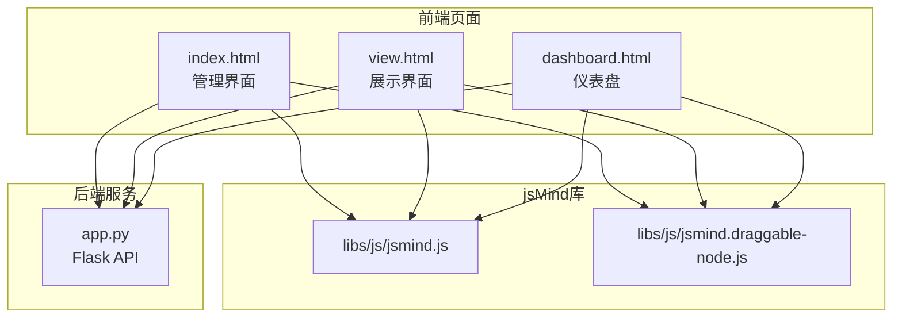
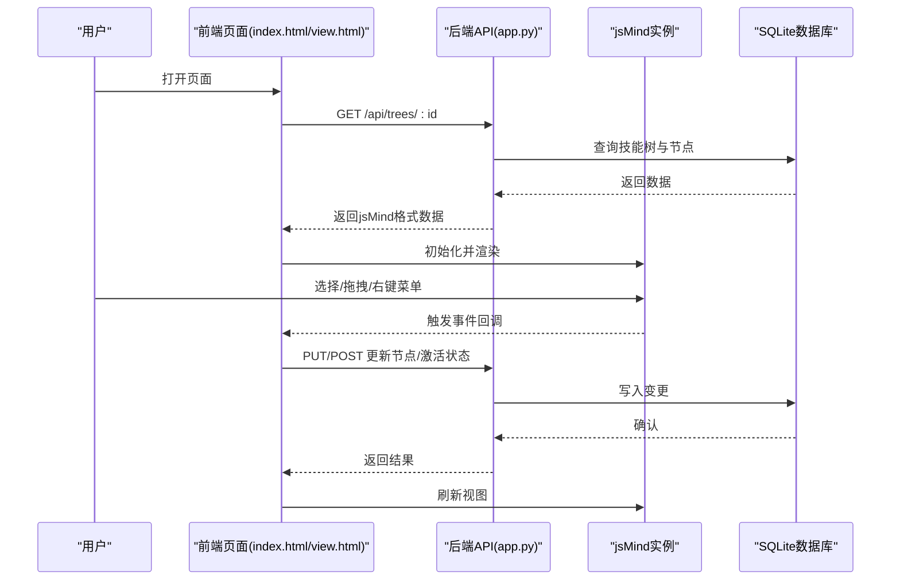
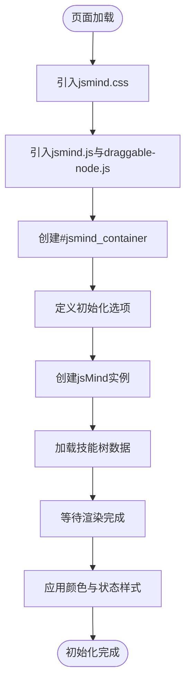
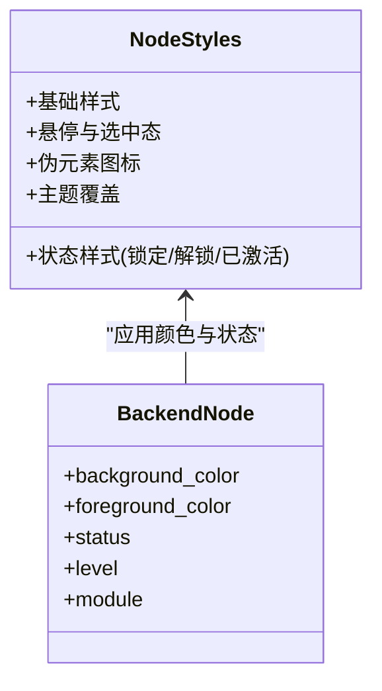
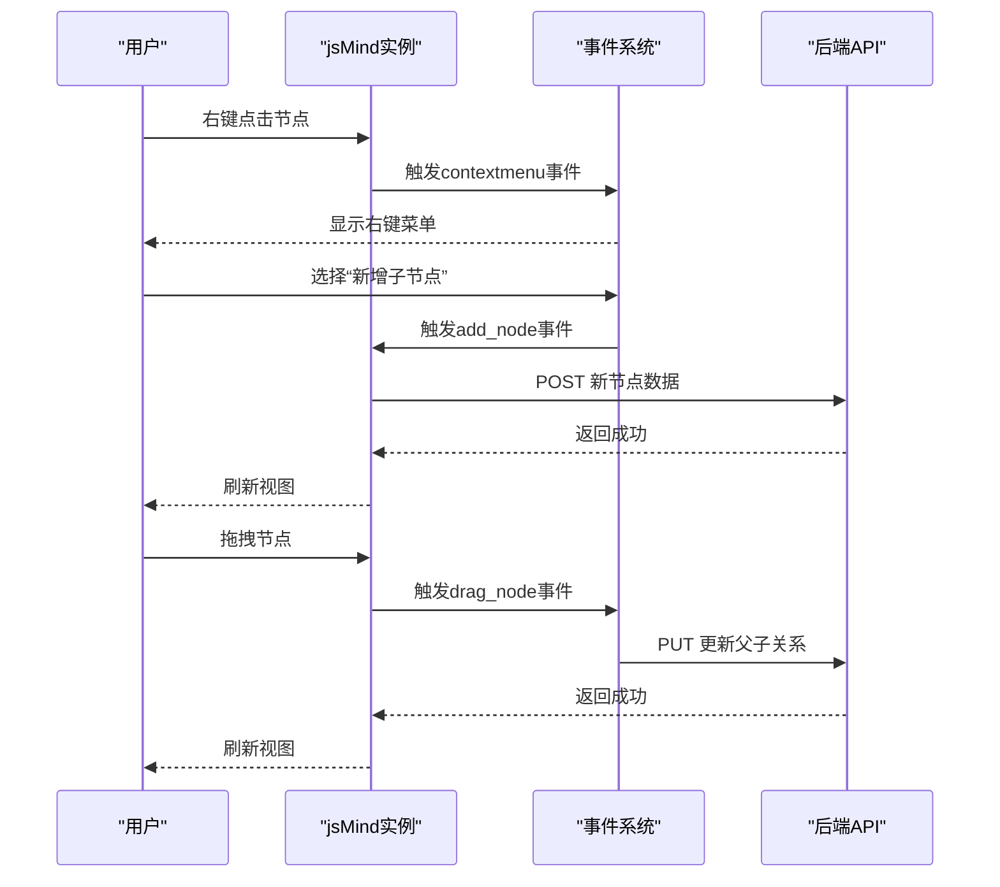
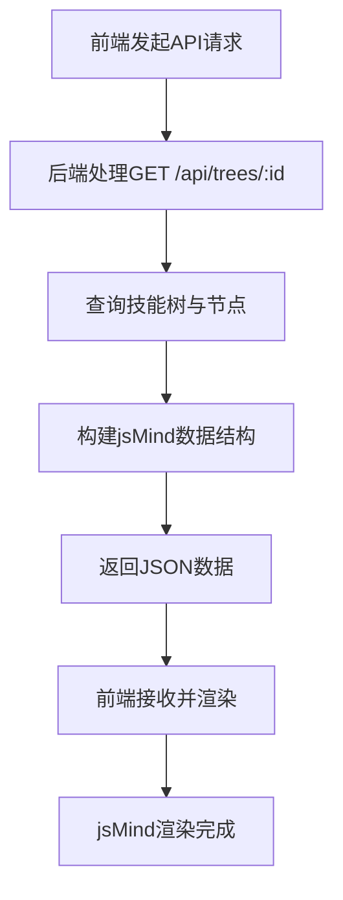
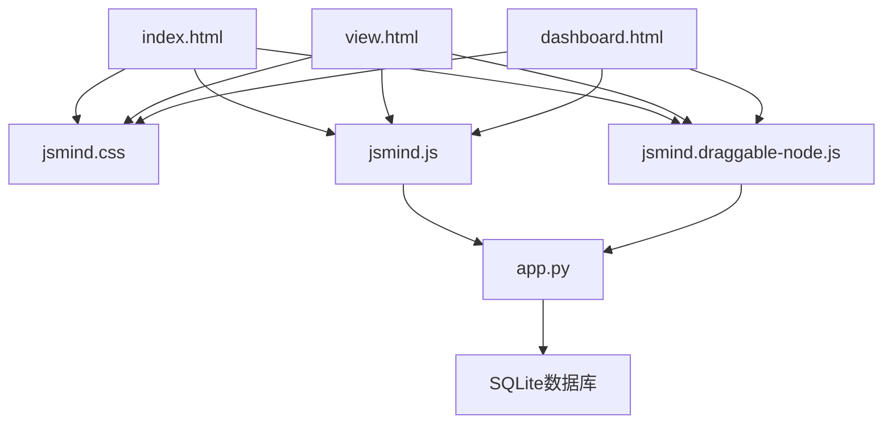

# jsMind可视化库集成

<cite>
**本文档引用的文件**
- [index.html](file://index.html)
- [view.html](file://view.html)
- [dashboard.html](file://dashboard.html)
- [app.py](file://app.py)
- [libs/js/jsmind.js](file://libs/js/jsmind.js)
- [libs/js/jsmind.draggable-node.js](file://libs/js/jsmind.draggable-node.js)
- [_fix_mode.js](file://_fix_mode.js)
- [_fix_mode2.js](file://_fix_mode2.js)
- [_fix_mode3.js](file://_fix_mode3.js)
- [_fix_mode4.js](file://_fix_mode4.js)
</cite>

## 目录
1. [简介](#简介)
2. [项目结构](#项目结构)
3. [核心组件](#核心组件)
4. [架构总览](#架构总览)
5. [详细组件分析](#详细组件分析)
6. [依赖关系分析](#依赖关系分析)
7. [性能考虑](#性能考虑)
8. [故障排除指南](#故障排除指南)
9. [结论](#结论)
10. [附录](#附录)

## 简介
本技术文档面向技能树管理系统的jsMind可视化库集成，系统性阐述jsMind在项目中的引入方式、初始化配置、核心功能调用、节点渲染机制、交互功能实现、数据绑定流程以及配置选项说明。文档同时提供常见问题解决方案与调试技巧，帮助开发者在技能树管理系统中正确、高效地使用jsMind。

## 项目结构
项目采用前后端分离架构，前端页面通过HTTP API与Flask后端通信，后端负责技能树数据的持久化与转换。jsMind库位于libs目录下，前端页面通过<link>与<script>引入并在页面容器中初始化。

**图表来源**
- [index.html:6-9](file://index.html#L6-L9)
- [index.html:848-849](file://index.html#L848-L849)
- [view.html:7-8](file://view.html#L7-L8)
- [view.html:253-279](file://view.html#L253-L279)
- [dashboard.html:1-10](file://dashboard.html#L1-L10)
- [app.py:17-22](file://app.py#L17-L22)

**章节来源**
- [index.html:6-9](file://index.html#L6-L9)
- [index.html:848-849](file://index.html#L848-L849)
- [view.html:7-8](file://view.html#L7-L8)
- [view.html:253-279](file://view.html#L253-L279)
- [dashboard.html:1-10](file://dashboard.html#L1-L10)
- [app.py:17-22](file://app.py#L17-L22)

## 核心组件
- jsMind库文件引入：通过<link>引入样式文件，通过<script>引入主库与拖拽插件。
- 页面容器：使用
作为jsMind实例的挂载点。
- 初始化配置：在页面中定义options对象，包含容器、主题、布局、交互开关等。
- 数据绑定：前端通过AJAX调用后端API获取技能树数据，转换为jsMind格式并渲染。
- 事件监听：注册选择、点击、双击、右键菜单等事件回调。
- 样式覆盖：通过CSS覆盖jsMind默认主题与节点样式，适配项目设计系统。

**章节来源**
- [index.html:6-9](file://index.html#L6-L9)
- [index.html:848-849](file://index.html#L848-L849)
- [index.html:1056-1233](file://index.html#L1056-L1233)
- [index.html:1284-1295](file://index.html#L1284-L1295)
- [index.html:1614-1646](file://index.html#L1614-L1646)
- [view.html:294-446](file://view.html#L294-L446)
- [view.html:447-478](file://view.html#L447-L478)

## 架构总览
前端页面负责UI与交互，jsMind负责节点渲染与视图控制；后端提供RESTful API，负责数据持久化与格式转换。数据流从后端API到前端页面，再由页面驱动jsMind渲染。

**图表来源**
- [index.html:1165-1233](file://index.html#L1165-L1233)
- [index.html:1284-1295](file://index.html#L1284-L1295)
- [app.py:442-453](file://app.py#L442-L453)
- [app.py:777-806](file://app.py#L777-L806)

## 详细组件分析

### jsMind库引入与初始化
- 引入库文件：在<head>中引入jsmind.css，在<body>底部引入jsmind.js与jsmind.draggable-node.js。
- 容器准备：在页面中放置
作为渲染容器。
- 初始化流程：定义options对象，包含容器、主题、布局、交互开关、动画、缩放等配置；创建jsMind实例并加载数据；在渲染完成后进行颜色与状态应用。

**图表来源**
- [index.html:6-9](file://index.html#L6-L9)
- [index.html:848-849](file://index.html#L848-L849)
- [index.html:1056-1233](file://index.html#L1056-L1233)
- [index.html:1614-1646](file://index.html#L1614-L1646)

**章节来源**
- [index.html:6-9](file://index.html#L6-L9)
- [index.html:848-849](file://index.html#L848-L849)
- [index.html:1056-1233](file://index.html#L1056-L1233)
- [index.html:1614-1646](file://index.html#L1614-L1646)

### 节点可视化渲染机制
- 节点样式定制：通过CSS覆盖默认主题，定义节点基础样式、状态样式（锁定/解锁/已激活）、悬停与选中态。
- 颜色配置：节点背景色与前景色来自后端节点数据，前端在渲染后应用到DOM元素。
- 图标设置：通过伪元素与类名实现锁图标、勾选图标等视觉提示，确保图标可见且不影响节点布局。
- 主题适配：覆盖默认橙色主题的hover与selected样式，保持整体设计一致性。

**图表来源**
- [view.html:294-446](file://view.html#L294-L446)
- [view.html:447-478](file://view.html#L447-L478)
- [app.py:81-88](file://app.py#L81-L88)

**章节来源**
- [view.html:294-446](file://view.html#L294-L446)
- [view.html:447-478](file://view.html#L447-L478)
- [app.py:81-88](file://app.py#L81-L88)

### 交互功能实现
- 节点拖拽：通过引入jsmind.draggable-node.js启用节点拖拽能力，配合事件监听实现拖拽后的数据更新。
- 缩放控制：通过jsMind的zoom接口实现放大/缩小，结合容器尺寸与视口判断进行缩放逻辑。
- 右键菜单：注册右键事件，显示上下文菜单，支持复制、粘贴、新增、删除等操作。
- 选择框功能：实现框选多节点，结合工具栏按钮进行批量操作。
- 根节点拖拽：根节点支持拖拽移动，提升整体视图操控体验。

**图表来源**
- [index.html:1199-1233](file://index.html#L1199-L1233)
- [index.html:1284-1295](file://index.html#L1284-L1295)
- [libs/js/jsmind.draggable-node.js](file://libs/js/jsmind.draggable-node.js)

**章节来源**
- [index.html:1199-1233](file://index.html#L1199-L1233)
- [index.html:1284-1295](file://index.html#L1284-L1295)
- [libs/js/jsmind.draggable-node.js](file://libs/js/jsmind.draggable-node.js)

### 数据绑定流程
- 后端API：提供GET /api/trees/:id返回jsMind格式数据，包含节点ID、父ID、主题、方向、展开状态、颜色、描述、链接等。
- 前端加载：页面初始化时调用API获取数据，转换为jsMind所需格式并渲染。
- 实时更新：用户操作触发AJAX请求，后端更新数据库并返回结果，前端刷新视图。

**图表来源**
- [app.py:442-453](file://app.py#L442-L453)
- [index.html:1284-1295](file://index.html#L1284-L1295)

**章节来源**
- [app.py:442-453](file://app.py#L442-L453)
- [index.html:1284-1295](file://index.html#L1284-L1295)

### jsMind配置选项详解
- 容器与主题：container指定渲染容器，theme用于主题切换。
- 布局与方向：direction控制左右布局，expand_tree_layout在初始化时自动居中根节点。
- 动画与缩放：enable_animations开启动画，zoom控制缩放级别，zoom_step设置缩放步进。
- 交互开关：editable启用编辑， draggable_node启用节点拖拽， allow_paste_node允许粘贴。
- 事件回调：注册select、doubleclick、contextmenu等事件处理函数。
- 性能优化：合理设置节点数量上限、禁用不必要的动画、延迟渲染大图。

**章节来源**
- [index.html:1165-1233](file://index.html#L1165-L1233)
- [index.html:1284-1295](file://index.html#L1284-L1295)

### 实际代码示例路径
- 库文件引入与容器准备：[index.html:6-9](file://index.html#L6-L9), [index.html:1056-1060](file://index.html#L1056-L1060)
- 初始化与事件注册：[index.html:1165-1233](file://index.html#L1165-L1233)
- 数据加载与渲染：[index.html:1284-1295](file://index.html#L1284-L1295)
- 样式覆盖与主题适配：[view.html:294-446](file://view.html#L294-L446), [view.html:447-478](file://view.html#L447-L478)
- 拖拽插件启用：[index.html:848-849](file://index.html#L848-L849), [libs/js/jsmind.draggable-node.js](file://libs/js/jsmind.draggable-node.js)

**章节来源**
- [index.html:6-9](file://index.html#L6-L9)
- [index.html:1056-1060](file://index.html#L1056-L1060)
- [index.html:1165-1233](file://index.html#L1165-L1233)
- [index.html:1284-1295](file://index.html#L1284-L1295)
- [view.html:294-446](file://view.html#L294-L446)
- [view.html:447-478](file://view.html#L447-L478)
- [index.html:848-849](file://index.html#L848-L849)
- [libs/js/jsmind.draggable-node.js](file://libs/js/jsmind.draggable-node.js)

## 依赖关系分析
- 前端依赖：index.html、view.html、dashboard.html依赖jsmind.css与jsmind.js；拖拽功能依赖jsmind.draggable-node.js。
- 后端依赖：app.py依赖Flask、SQLAlchemy、CORS等；数据库为SQLite。
- 数据依赖：前端通过API获取技能树数据，后端将数据库中的节点信息转换为jsMind格式。

**图表来源**
- [index.html:6-9](file://index.html#L6-L9)
- [index.html:848-849](file://index.html#L848-L849)
- [view.html:7-8](file://view.html#L7-L8)
- [dashboard.html:1-10](file://dashboard.html#L1-L10)
- [app.py:17-22](file://app.py#L17-L22)

**章节来源**
- [index.html:6-9](file://index.html#L6-L9)
- [index.html:848-849](file://index.html#L848-L849)
- [view.html:7-8](file://view.html#L7-L8)
- [dashboard.html:1-10](file://dashboard.html#L1-L10)
- [app.py:17-22](file://app.py#L17-L22)

## 性能考虑
- 渲染优化：对于大型技能树，建议分层加载或懒加载子节点，减少一次性渲染压力。
- 动画控制：在大量节点场景下关闭动画或降低动画复杂度，提升交互流畅度。
- 缩放策略：根据容器尺寸动态计算缩放级别，避免过度缩放导致的性能问题。
- 事件节流：对频繁触发的事件（如鼠标移动、缩放）进行节流处理，降低CPU占用。
- 数据缓存：前端对已加载的节点数据进行缓存，避免重复请求与重复渲染。

## 故障排除指南
- jsMind未渲染：检查容器是否存在、CSS与JS是否正确引入、初始化选项是否完整。
- 节点颜色不生效：确认后端返回的颜色字段是否正确，前端是否在渲染完成后应用样式。
- 拖拽功能异常：确保引入了jsmind.draggable-node.js，检查事件回调是否正确注册。
- 右键菜单不显示：检查contextmenu事件是否被浏览器拦截，确认事件回调逻辑。
- 缩放异常：检查容器尺寸与min-width/min-height设置，确保缩放逻辑基于正确的可视区域。
- 数据不同步：确认AJAX请求成功返回，前端是否在成功回调中刷新视图。

**章节来源**
- [index.html:1165-1233](file://index.html#L1165-L1233)
- [index.html:1284-1295](file://index.html#L1284-L1295)
- [view.html:294-446](file://view.html#L294-L446)
- [libs/js/jsmind.draggable-node.js](file://libs/js/jsmind.draggable-node.js)

## 结论
本项目通过Flask后端与jsMind前端的协同，实现了技能树的可视化管理与展示。jsMind提供了强大的节点渲染与交互能力，结合后端的数据持久化与API接口，形成了完整的技能树管理系统。通过合理的配置与样式覆盖，系统在功能与美观上达到了良好平衡。开发者可在此基础上进一步扩展功能，如批量操作、历史追踪、权限控制等。

## 附录
- 补丁脚本：项目包含多个补丁脚本（_fix_mode.js、_fix_mode2.js、_fix_mode3.js、_fix_mode4.js），用于修复特定场景下的交互与样式问题，可作为参考以解决类似问题。

**章节来源**
- [_fix_mode.js](file://_fix_mode.js)
- [_fix_mode2.js](file://_fix_mode2.js)
- [_fix_mode3.js](file://_fix_mode3.js)
- [_fix_mode4.js](file://_fix_mode4.js)