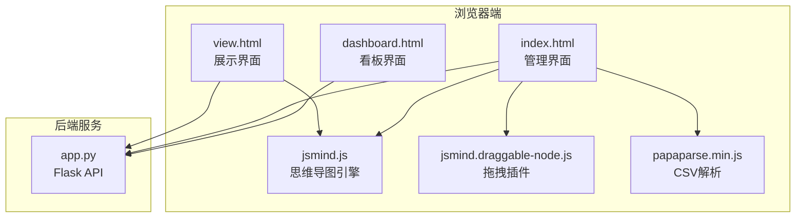
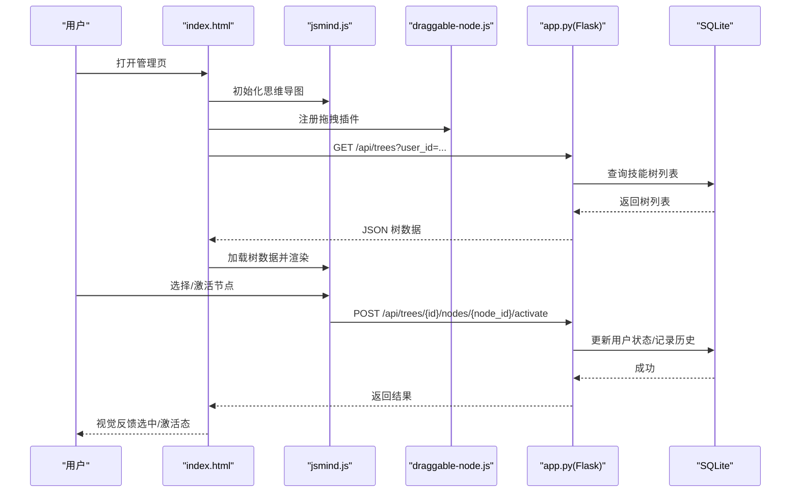
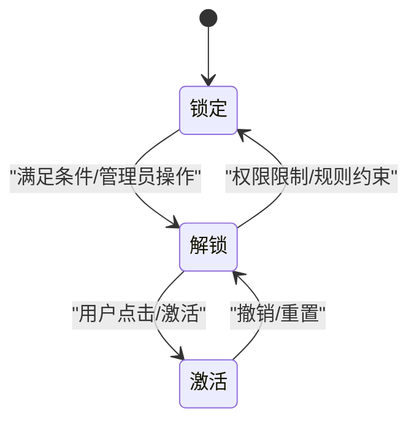
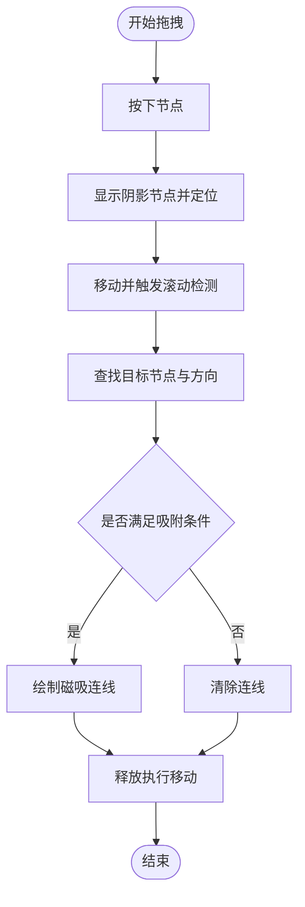
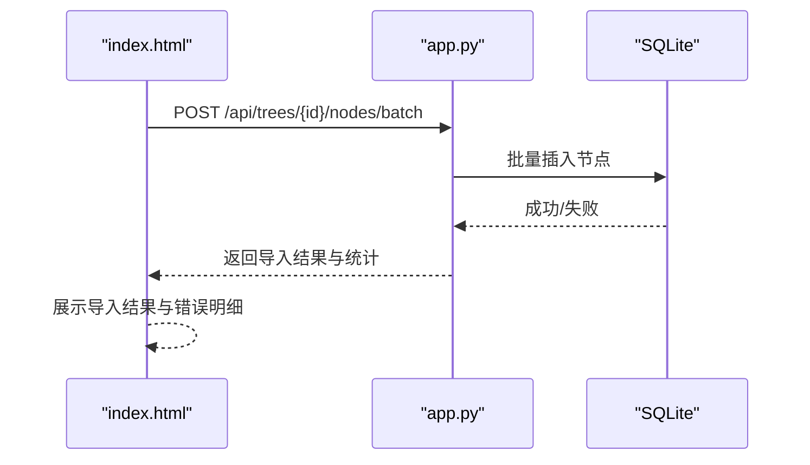
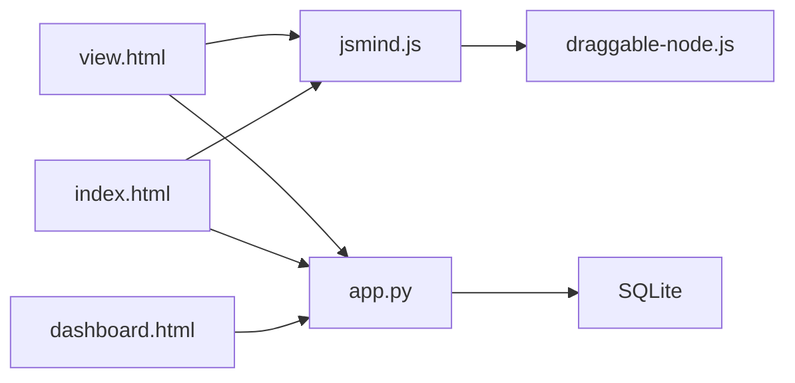

# 交互逻辑实现

<cite>
**本文引用的文件**
- [index.html](file://index.html)
- [view.html](file://view.html)
- [dashboard.html](file://dashboard.html)
- [app.py](file://app.py)
- [jsmind.js](file://libs/js/jsmind.js)
- [jsmind.draggable-node.js](file://libs/js/jsmind.draggable-node.js)
- [papaparse.min.js](file://libs/js/papaparse.min.js)
</cite>

## 目录
1. [简介](#简介)
2. [项目结构](#项目结构)
3. [核心组件](#核心组件)
4. [架构总览](#架构总览)
5. [详细组件分析](#详细组件分析)
6. [依赖分析](#依赖分析)
7. [性能考虑](#性能考虑)
8. [故障排查指南](#故障排查指南)
9. [结论](#结论)
10. [附录](#附录)

## 简介
本技术文档聚焦于技能树管理系统的交互逻辑实现，围绕用户与技能树的交互行为进行系统化梳理，涵盖节点选择、拖拽操作、右键菜单、快捷键支持、事件处理机制、状态管理、异步操作与错误处理、交互反馈设计以及键盘导航与无障碍支持。文档以代码为依据，结合可视化图示，帮助开发者快速理解并扩展交互能力。

## 项目结构
系统采用前后端分离架构：
- 前端页面：index.html（管理界面）、view.html（展示界面）、dashboard.html（看板界面）
- 前端库：jsMind（思维导图渲染与交互）、拖拽插件、CSV解析库
- 后端：Flask 应用，提供技能树、节点、用户、任务、历史等 API

**图示来源**
- [index.html](file://index.html)
- [view.html](file://view.html)
- [dashboard.html](file://dashboard.html)
- [jsmind.js](file://libs/js/jsmind.js)
- [jsmind.draggable-node.js](file://libs/js/jsmind.draggable-node.js)
- [papaparse.min.js](file://libs/js/papaparse.min.js)
- [app.py](file://app.py)

**章节来源**
- [index.html](file://index.html)
- [view.html](file://view.html)
- [dashboard.html](file://dashboard.html)
- [app.py](file://app.py)

## 核心组件
- 思维导图引擎与视图层：负责节点渲染、布局计算、事件绑定与交互响应
- 拖拽插件：提供节点拖拽、吸附、连线与移动能力
- 快捷键与键盘导航：基于 jsMind 的快捷键配置，支持方向键、增删节点等
- 异步数据流：前端通过 AJAX 调用后端 API，实现技能树加载、节点更新、激活、导入等
- 状态管理：当前选中节点、激活状态、用户操作历史等
- 交互反馈：视觉反馈（选中、激活、锁定态）、工具提示、细节面板、动画与过渡

**章节来源**
- [jsmind.js](file://libs/js/jsmind.js)
- [jsmind.draggable-node.js](file://libs/js/jsmind.draggable-node.js)
- [app.py](file://app.py)

## 架构总览
前端通过 jsMind 渲染技能树，拖拽插件增强节点移动体验；快捷键与事件监听贯穿交互流程；后端提供 RESTful API，支撑技能树 CRUD、节点激活、导入导出与历史追踪。

**图示来源**
- [index.html](file://index.html)
- [jsmind.js](file://libs/js/jsmind.js)
- [jsmind.draggable-node.js](file://libs/js/jsmind.draggable-node.js)
- [app.py](file://app.py)

## 详细组件分析

### 节点选择与状态管理
- 选中节点：jsMind 提供选中事件与选中节点标识，前端据此更新 UI 状态与详情面板
- 激活状态：节点状态分为锁定、解锁、激活三态，激活后节点样式变化并触发后端记录
- 用户操作历史：节点编辑与激活均记录到历史表，便于审计与回溯

**图示来源**
- [view.html](file://view.html)
- [app.py](file://app.py)

**章节来源**
- [view.html](file://view.html)
- [app.py](file://app.py)

### 拖拽操作与吸附
- 拖拽流程：按下节点 -> 移动阴影节点 -> 计算目标节点与方向 -> 磁吸连线 -> 放开执行移动
- 边界检测：滚动区域触发与边界判定，避免节点移出可视区
- 插件注册：拖拽插件初始化并绑定容器事件，拦截鼠标/触摸事件

**图示来源**
- [jsmind.draggable-node.js](file://libs/js/jsmind.draggable-node.js)

**章节来源**
- [jsmind.draggable-node.js](file://libs/js/jsmind.draggable-node.js)

### 右键菜单与上下文操作
- 右键菜单：在节点上右键触发上下文菜单，提供新增子节点、新增兄弟节点、编辑、删除等操作
- 菜单集成：与 jsMind 事件体系集成，确保在编辑模式下可用

**章节来源**
- [jsmind.js](file://libs/js/jsmind.js)

### 快捷键支持与键盘导航
- 快捷键映射：支持新增子节点、新增兄弟节点、编辑节点、删除节点、展开/折叠、方向键移动等
- 键盘导航：方向键在树中移动选中节点，空格键切换展开/折叠，Enter 编辑节点
- 可访问性：焦点管理与键盘可达性，确保屏幕阅读器友好

**章节来源**
- [jsmind.js](file://libs/js/jsmind.js)

### 事件处理机制
- DOM 事件监听：统一通过 jsMind 的事件系统绑定容器事件，避免直接操作原生 DOM
- 自定义事件：节点选择、展开/折叠、激活等事件触发自定义回调
- 事件冒泡控制：在拖拽与编辑场景中，阻止不必要的事件冒泡，保证交互稳定性

**章节来源**
- [jsmind.js](file://libs/js/jsmind.js)

### 异步操作与数据加载
- 技能树加载：GET /api/trees?user_id=... 返回树数据，前端转换为 jsMind 数据格式
- 节点激活：POST /api/trees/{id}/nodes/{node_id}/activate，后端校验权限与模块
- 批量导入：CSV 导入通过 Papa Parse 解析，后端批量保存节点并记录历史
- 错误处理：统一的错误码与消息返回，前端捕获并提示用户

**图示来源**
- [app.py](file://app.py)
- [papaparse.min.js](file://libs/js/papaparse.min.js)

**章节来源**
- [app.py](file://app.py)
- [papaparse.min.js](file://libs/js/papaparse.min.js)

### 交互反馈设计
- 视觉反馈：选中节点高亮、激活节点发光、锁定节点灰度与禁用指针
- 动画与过渡：面板滑入、节点缩放与脉冲动画、磁吸连线绘制
- 工具提示：节点悬停显示状态、描述与链接
- 细节面板：右侧详情面板展示节点属性、状态徽章与描述内容

**章节来源**
- [view.html](file://view.html)
- [index.html](file://index.html)

### 键盘导航与无障碍支持
- 键盘可达性：焦点管理、键盘切换、语义化标签与 ARIA 属性
- 无障碍提示：屏幕阅读器友好的文本与状态描述
- 操作一致性：键盘与鼠标操作保持一致的行为与反馈

**章节来源**
- [jsmind.js](file://libs/js/jsmind.js)

## 依赖分析
- 前端依赖：jsMind 为核心渲染与交互引擎，拖拽插件扩展节点移动能力，Papa Parse 用于 CSV 导入
- 后端依赖：Flask、SQLAlchemy、CORS，提供 RESTful API 与数据库访问
- 数据模型：用户、技能树、节点、用户状态、编辑历史、点击历史、学习任务

**图示来源**
- [jsmind.js](file://libs/js/jsmind.js)
- [jsmind.draggable-node.js](file://libs/js/jsmind.draggable-node.js)
- [index.html](file://index.html)
- [view.html](file://view.html)
- [dashboard.html](file://dashboard.html)
- [app.py](file://app.py)

**章节来源**
- [app.py](file://app.py)

## 性能考虑
- 渲染优化：仅在节点展开/折叠时重新布局，避免全量重绘
- 拖拽性能：阴影节点与磁吸连线绘制在 Canvas 上，减少 DOM 操作
- 数据分页与预览：导入 CSV 时支持预览与分批提交，降低内存压力
- 缓存策略：节点状态与布局缓存，提升交互流畅度

## 故障排查指南
- 激活失败：检查用户模块权限与技能树模式，确认节点成本与可用技能点
- 拖拽异常：确认编辑模式开启、容器尺寸与滚动区域配置正确
- 导入错误：检查 CSV 格式、必填字段与重复节点 ID，查看后端返回的错误明细
- 历史缺失：确认节点编辑与激活接口均已记录历史，必要时检查数据库连接

**章节来源**
- [app.py](file://app.py)

## 结论
本系统通过 jsMind 引擎与拖拽插件构建了稳定的交互基础，配合后端 API 实现了完整的技能树生命周期管理。通过状态管理、事件处理与异步数据流，系统实现了从节点选择、拖拽、激活到导入导出的完整闭环。建议在后续迭代中进一步完善无障碍支持与性能监控，持续优化用户体验。

## 附录
- 开发者扩展建议
  - 新增交互：在 jsMind 事件回调中注入自定义逻辑，确保与现有状态管理解耦
  - 快捷键扩展：在配置中新增映射，注意与现有快捷键冲突
  - 拖拽策略：通过插件参数调整吸附阈值与滚动触发距离
  - 历史追踪：为新功能增加历史记录，便于审计与回滚