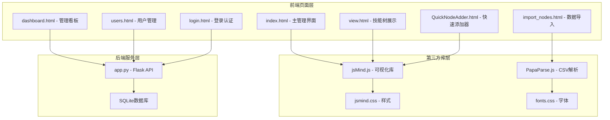
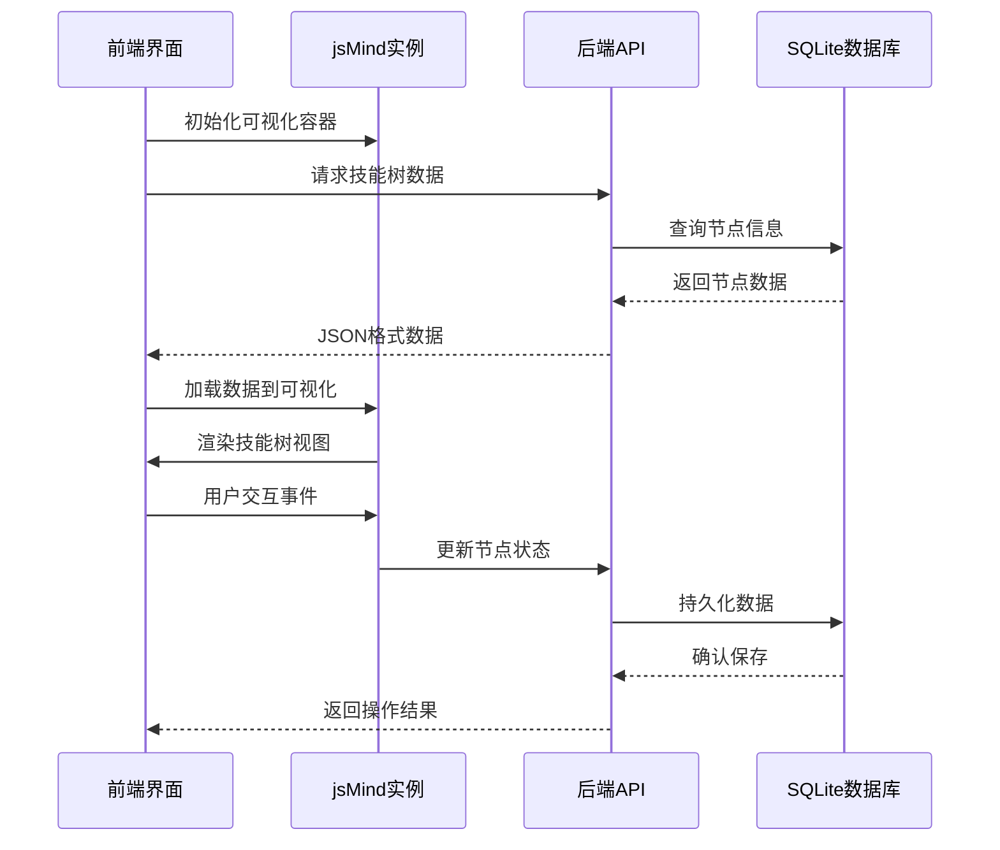
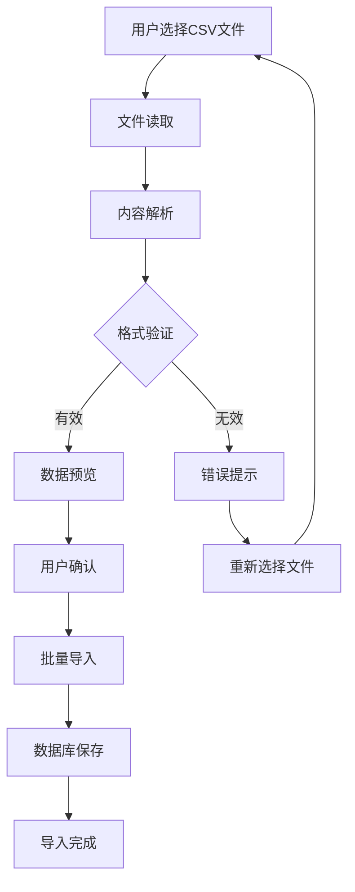
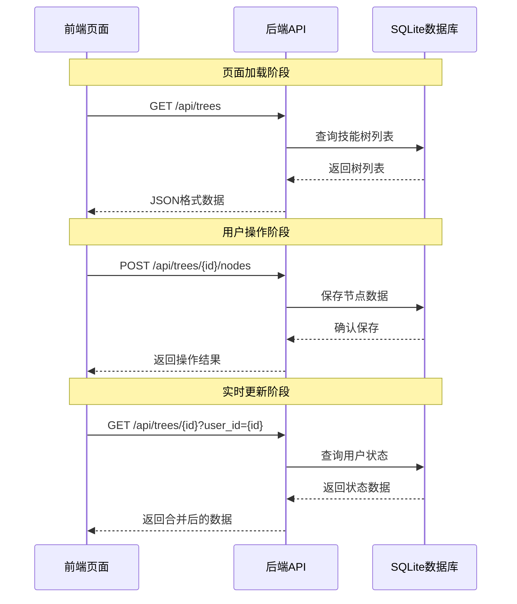
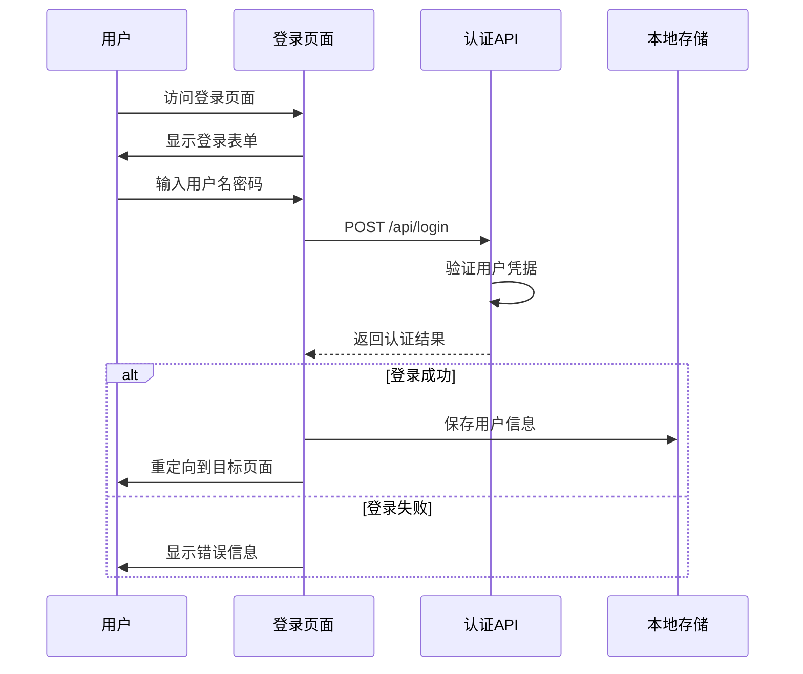

# 前端架构设计

<cite>
**本文档引用的文件**
- [index.html](file://index.html)
- [view.html](file://view.html)
- [dashboard.html](file://dashboard.html)
- [users.html](file://users.html)
- [import_nodes.html](file://import_nodes.html)
- [login.html](file://login.html)
- [QuickNodeAdder.html](file://QuickNodeAdder.html)
- [app.py](file://app.py)
- [jsmind.js](file://libs/js/jsmind.js)
- [PapaParse.min.js](file://libs/js/PapaParse.min.js)
- [jsmind.css](file://libs/css/jsmind.css)
- [fonts.css](file://libs/css/fonts.css)
- [README.md](file://README.md)
</cite>

## 目录
1. [项目概述](#项目概述)
2. [技术栈选择](#技术栈选择)
3. [项目结构分析](#项目结构分析)
4. [核心组件架构](#核心组件架构)
5. [jsMind可视化集成](#jsmind可视化集成)
6. [数据导入处理](#数据导入处理)
7. [用户界面组件](#用户界面组件)
8. [数据绑定机制](#数据绑定机制)
9. [用户交互设计](#用户交互设计)
10. [性能优化策略](#性能优化策略)
11. [开发指南](#开发指南)
12. [总结](#总结)

## 项目概述

技能树管理系统是一个基于HTML5、CSS3和JavaScript的前端架构设计，结合jsMind可视化库实现技能树的可视化管理和展示。系统采用前后端分离的设计模式，前端负责用户界面展示和交互，后端使用Flask提供RESTful API接口。

### 系统特点

- **多用户支持**：每个用户拥有独立的技能树状态
- **权限管理**：管理员和普通用户的权限区分
- **状态持久化**：用户节点激活状态独立保存
- **技能点系统**：每个用户独立的技能点管理
- **响应式设计**：支持多种设备和屏幕尺寸

## 技术栈选择

### 前端技术栈

**HTML5 + CSS3 + JavaScript**
- 采用语义化HTML5标签，提供良好的可访问性和SEO支持
- 使用CSS3变量实现主题系统，支持动态主题切换
- 原生JavaScript实现核心功能，避免额外框架依赖

**jsMind可视化库**
- 专门的思维导图/技能树可视化库
- 支持多种布局模式和主题样式
- 提供丰富的交互功能，包括拖拽、缩放、节点操作

**Bootstrap框架**
- 提供响应式网格系统和组件样式
- 简化移动端适配和跨浏览器兼容性
- 标准化的UI组件和交互模式

### 后端技术栈

**Python + Flask**
- 轻量级Web框架，适合中小型项目
- 简洁的路由定义和请求处理
- 与前端技术栈的良好兼容性

**SQLite数据库**
- 轻量级嵌入式数据库
- 无需额外配置，易于部署
- 支持完整的SQL功能

**Flask-SQLAlchemy**
- ORM对象关系映射
- 简化数据库操作和模型定义
- 提供数据库迁移和版本管理

**Section sources**
- [README.md:292-297](file://README.md#L292-L297)

## 项目结构分析

### 前端文件组织

```
技能树/
├── index.html                  # 主管理界面
├── view.html                   # 技能树展示界面
├── dashboard.html              # 管理看板界面
├── users.html                  # 用户管理界面
├── import_nodes.html           # 数据导入界面
├── login.html                  # 登录认证界面
├── QuickNodeAdder.html         # 快速节点添加器
├── libs/                       # 第三方库
│   ├── css/
│   │   ├── jsmind.css          # jsMind样式
│   │   ├── fonts.css           # 字体样式
│   │   └── tailwind.css        # Tailwind CSS
│   └── js/
│       ├── jsmind.js           # jsMind核心库
│       └── PapaParse.min.js    # CSV解析库
└── instance/                   # 实例配置
```

### 样式系统架构

系统采用CSS变量和模块化设计：

```css
:root {
    --surface-0: #eef0f3;  /* 页面背景 */
    --surface-1: #f4f5f7;  /* 卡片背景 */
    --surface-2: #fafafa;  /* 输入框背景 */
    --text-primary: #1a1f2e; /* 主要文字 */
    --accent: #4a5568;     /* 主色调 */
    --ok: #3d6b50;         /* 成功状态 */
    --warn: #7a5c2e;       /* 警告状态 */
    --err: #7a3040;        /* 错误状态 */
}
```

**Section sources**
- [index.html:13-72](file://index.html#L13-L72)
- [view.html:10-55](file://view.html#L10-L55)

## 核心组件架构

### 页面组件层次结构



**图表来源**
- [index.html](file://index.html)
- [view.html](file://view.html)
- [dashboard.html](file://dashboard.html)
- [users.html](file://users.html)
- [import_nodes.html](file://import_nodes.html)
- [login.html](file://login.html)
- [QuickNodeAdder.html](file://QuickNodeAdder.html)
- [jsmind.js](file://libs/js/jsmind.js)
- [PapaParse.min.js](file://libs/js/PapaParse.min.js)
- [jsmind.css](file://libs/css/jsmind.css)
- [fonts.css](file://libs/css/fonts.css)
- [app.py](file://app.py)

### 组件职责划分

**管理员界面 (index.html)**
- 技能树创建和管理
- 节点编辑和样式设置
- 颜色主题配置
- 技能点系统管理

**用户展示界面 (view.html)**
- 技能树只读展示
- 节点激活功能
- 用户状态管理
- 响应式布局适配

**管理看板界面 (dashboard.html)**
- 用户学习进度统计
- 团队绩效分析
- 任务分配管理
- 数据可视化展示

**用户管理界面 (users.html)**
- 用户信息维护
- 权限角色管理
- 组别分配控制
- 模块权限设置

**数据导入界面 (import_nodes.html)**
- CSV数据批量导入
- 数据格式验证
- 预览和确认机制
- 错误处理和回滚

**Section sources**
- [README.md:14-60](file://README.md#L14-L60)

## jsMind可视化集成

### 库集成架构



**图表来源**
- [index.html](file://index.html)
- [view.html](file://view.html)
- [app.py](file://app.py)

### 可视化配置参数

系统使用jsMind的标准配置参数：

| 参数 | 类型 | 默认值 | 描述 |
|------|------|--------|------|
| `container` | String | "" | 容器元素ID |
| `editable` | Boolean | false | 是否允许编辑 |
| `theme` | String | null | 主题样式 |
| `mode` | String | "full" | 显示模式 |
| `view.engine` | String | "canvas" | 渲染引擎 |
| `layout.hspace` | Number | 30 | 水平间距 |
| `layout.vspace` | Number | 20 | 垂直间距 |
| `view.zoom.min` | Number | 0.5 | 最小缩放 |
| `view.zoom.max` | Number | 2.1 | 最大缩放 |

### 节点状态样式

系统为不同状态的节点定义了特定的样式：

```css
/* 锁定状态 - 灰色显示，带锁图标 */
jmnode[data-status="locked"] {
    opacity: 0.6;
    filter: grayscale(100%);
    background: #f1f5f9 !important;
}

/* 已激活状态 - 正常颜色，带高亮动画 */
jmnode[data-status="activated"] {
    border: 1px solid var(--cyan);
    background: var(--cyan) !important;
    animation: activePulse 1s cubic-bezier(0.175, 0.885, 0.32, 1.275);
}

/* 解锁状态 - 半透明显示 */
jmnode[data-status="unlocked"] {
    border: 1.5px dashed var(--cyan);
    opacity: 1;
}
```

**Section sources**
- [jsmind.js:126-180](file://libs/js/jsmind.js#L126-L180)
- [view.html:314-417](file://view.html#L314-L417)

## 数据导入处理

### CSV处理架构



**图表来源**
- [import_nodes.html](file://import_nodes.html)

### PapaParse集成

虽然系统包含了PapaParse库文件，但实际导入功能使用了自定义解析逻辑：

```javascript
function parseDelimitedText(raw) {
    let text = String(raw || '').replace(/\r\n/g, '\n').replace(/\r/g, '\n').trim();
    if (!text) return [];

    const lines = text.split('\n').map(l => l.replace(/\uFEFF/g, '')).filter(l => l.trim() !== '');
    if (lines.length < 2) return [];

    const firstLine = lines[0];
    const tabCount = (firstLine.match(/\t/g) || []).length;
    const commaCount = (firstLine.match(/,/g) || []).length;
    const delimiter = tabCount >= commaCount && tabCount > 0 ? '\t' : ',';

    // 自定义分隔符解析逻辑
    function splitLine(line, delim) {
        if (delim === '\t') {
            return line.split('\t').map(c => c.trim());
        }
        // 处理带引号的CSV字段
        const result = [];
        let cur = '';
        let inQuotes = false;
        for (let i = 0; i < line.length; i++) {
            const c = line[i];
            if (c === '"') {
                inQuotes = !inQuotes;
                continue;
            }
            if (!inQuotes && c === ',') {
                result.push(cur.trim());
                cur = '';
                continue;
            }
            cur += c;
        }
        result.push(cur.trim());
        return result;
    }

    const headers = splitLine(firstLine, delimiter).map(h => h.trim());
    const rows = [];
    for (let i = 1; i < lines.length; i++) {
        const cells = splitLine(lines[i], delimiter);
        const obj = {};
        headers.forEach((h, idx) => {
            obj[h] = cells[idx] !== undefined ? cells[idx] : '';
        });
        rows.push(obj);
    }
    return rows;
}
```

### 数据验证机制

导入过程包含多层次的数据验证：

1. **格式验证**：检查文件是否包含表头和有效数据
2. **字段验证**：验证必需字段的存在性和格式
3. **业务规则验证**：检查节点层级关系和前置条件
4. **重复性检查**：避免重复的节点ID和用户信息

**Section sources**
- [import_nodes.html:238-287](file://import_nodes.html#L238-L287)
- [import_nodes.html:441-482](file://import_nodes.html#L441-L482)

## 用户界面组件

### 响应式布局设计

系统采用Flexbox和CSS Grid实现响应式布局：

```css
.container {
    display: flex;
    height: 100vh;
    padding: 20px;
    gap: 20px;
    overflow: hidden;
}

.sidebar {
    width: 320px;
    min-width: 280px;
    min-height: 0;
    align-self: stretch;
}

.main-content {
    flex: 1;
    padding: 20px;
    display: flex;
    flex-direction: column;
}
```

### 组件样式系统

```css
/* 按钮组件系统 */
.btn {
    padding: 9px 20px;
    border-radius: 7px;
    cursor: pointer;
    font-size: 13.5px;
    font-family: var(--font-body);
    font-weight: 600;
    transition: all 0.15s ease;
    letter-spacing: 0.3px;
    border: 1px solid transparent;
    display: inline-flex;
    align-items: center;
    gap: 6px;
}

.btn-primary { background: var(--accent); }
.btn-success { background: var(--ok-bg); }
.btn-warning { background: var(--warn-bg); }
.btn-danger { background: var(--err-bg); }
.btn-outline { background: transparent; }
```

### 交互状态管理

系统为不同组件状态提供了明确的视觉反馈：

```css
.tree-item:hover {
    transform: translateX(2px);
    border-left-color: var(--cyan);
}

.tree-item.active {
    background: #f0f9ff;
    border-left-color: var(--cyan);
    color: var(--cyan);
}

.node-editor.active {
    display: block;
    animation: fadeSlideIn 0.3s ease-out;
}
```

**Section sources**
- [index.html:113-177](file://index.html#L113-L177)
- [index.html:232-316](file://index.html#L232-L316)
- [users.html:42-466](file://users.html#L42-L466)

## 数据绑定机制

### 前后端数据流



**图表来源**
- [app.py](file://app.py)
- [index.html](file://index.html)
- [view.html](file://view.html)

### 数据模型映射

系统采用标准化的数据模型映射：

**技能树模型 (SkillTree)**
- `id`: 技能树唯一标识
- `name`: 技能树名称
- `module`: 所属模块
- `default_skill_points`: 默认技能点数
- `mode`: 激活模式 (tree/path)

**节点模型 (SkillNode)**
- `node_id`: 节点唯一标识
- `parent_id`: 父节点标识
- `topic`: 节点标题
- `status`: 节点状态 (locked/unlocked/activated)
- `cost`: 激活消耗技能点
- `level`: 节点等级
- `module`: 所属模块

**用户状态模型 (UserSkillTreeState)**
- `user_id`: 用户标识
- `tree_id`: 技能树标识
- `node_id`: 节点标识
- `status`: 当前状态
- `skill_points`: 用户技能点余额

### API接口设计

系统提供RESTful API接口：

| 方法 | 路径 | 功能 | 请求体 | 响应 |
|------|------|------|--------|------|
| GET | `/api/trees` | 获取技能树列表 | - | 树列表数组 |
| POST | `/api/trees` | 创建新技能树 | 树数据 | 新树信息 |
| GET | `/api/trees/{id}` | 获取指定技能树 | - | 树数据 |
| PUT | `/api/trees/{id}` | 更新技能树 | 树数据 | 更新结果 |
| DELETE | `/api/trees/{id}` | 删除技能树 | - | 删除结果 |
| POST | `/api/trees/{id}/nodes` | 添加节点 | 节点数据 | 节点信息 |
| PUT | `/api/trees/{id}/nodes/{node_id}` | 更新节点 | 节点数据 | 更新结果 |
| POST | `/api/trees/{id}/nodes/{node_id}/activate` | 激活节点 | 用户信息 | 激活结果 |

**Section sources**
- [app.py:385-454](file://app.py#L385-L454)
- [app.py:562-607](file://app.py#L562-L607)
- [README.md:113-213](file://README.md#L113-L213)

## 用户交互设计

### 节点拖拽交互

系统实现了完整的节点拖拽功能：

```javascript
// 节点拖拽事件处理
function handleNodeDrag() {
    const dragSrc = event.target;
    const dragDst = event.target.parentElement;
    
    // 验证拖拽合法性
    if (!validateDragOperation(dragSrc, dragDst)) {
        return false;
    }
    
    // 执行拖拽操作
    performNodeMove(dragSrc, dragDst);
    
    // 更新UI状态
    updateNodePosition(dragSrc, dragDst);
    
    // 保存到数据库
    saveNodeChanges(dragSrc.dataset.nodeId, dragDst.dataset.nodeId);
}

// 拖拽验证规则
function validateDragOperation(src, dst) {
    // 防止拖拽到自身
    if (src === dst) return false;
    
    // 防止形成循环依赖
    if (isCircularDependency(src, dst)) return false;
    
    // 验证节点类型兼容性
    if (!isNodeTypeCompatible(src, dst)) return false;
    
    return true;
}
```

### 右键菜单系统

```javascript
// 右键菜单事件处理
function showContextMenu(event) {
    event.preventDefault();
    
    const menu = document.getElementById('context-menu');
    const node = event.target.closest('jmnode');
    
    if (!node) return;
    
    // 设置菜单位置
    menu.style.left = event.clientX + 'px';
    menu.style.top = event.clientY + 'px';
    
    // 根据节点状态显示不同菜单项
    updateContextMenuItems(node.dataset.status);
    
    // 显示菜单
    menu.classList.add('active');
}

// 上下文菜单操作
function contextMenuAction(action, nodeId) {
    switch(action) {
        case 'edit':
            openNodeEditor(nodeId);
            break;
        case 'delete':
            confirmNodeDeletion(nodeId);
            break;
        case 'add_child':
            openAddChildDialog(nodeId);
            break;
        case 'add_sibling':
            openAddSiblingDialog(nodeId);
            break;
    }
}
```

### 状态切换机制

```javascript
// 节点状态切换
function toggleNodeStatus(nodeId) {
    const node = getNodeById(nodeId);
    const currentStatus = node.dataset.status;
    
    // 状态转换规则
    const statusMap = {
        'locked': 'unlocked',
        'unlocked': 'activated',
        'activated': 'locked'
    };
    
    // 条件检查
    if (!canToggleNode(nodeId, statusMap[currentStatus])) {
        showStatusError('前置条件不满足');
        return;
    }
    
    // 执行状态切换
    performStatusChange(nodeId, statusMap[currentStatus]);
    
    // 更新UI反馈
    updateNodeVisualState(nodeId, statusMap[currentStatus]);
    
    // 保存到服务器
    saveNodeStatus(nodeId, statusMap[currentStatus]);
}
```

### 用户认证流程



**图表来源**
- [login.html](file://login.html)
- [users.html](file://users.html)

**Section sources**
- [index.html:500-550](file://index.html#L500-L550)
- [view.html:447-479](file://view.html#L447-L479)
- [login.html:168-210](file://login.html#L168-L210)

## 性能优化策略

### 资源加载优化

**静态资源压缩**
- CSS文件使用CSS变量减少重复定义
- JavaScript代码进行混淆和压缩
- 图片资源使用WebP格式优化传输

**懒加载策略**
- 非关键CSS延迟加载
- 图片资源按需加载
- 大型组件延迟初始化

### 内存管理优化

**DOM元素复用**
- 使用虚拟滚动处理大量节点
- 组件池复用减少DOM创建
- 事件委托减少监听器数量

**垃圾回收优化**
- 及时代理事件处理器
- 及时清理定时器和动画
- 避免内存泄漏的闭包引用

### 网络性能优化

**缓存策略**
- HTTP缓存头配置
- 浏览器本地缓存
- CDN静态资源加速

**请求优化**
- 批量API请求合并
- 增量数据更新
- 防抖和节流处理

### 渲染性能优化

**Canvas渲染**
- 使用requestAnimationFrame优化动画
- 合理的绘制区域裁剪
- 减少重绘和回流操作

**虚拟化技术**
- 大列表虚拟滚动
- 懒加载节点渲染
- 按需计算布局

## 开发指南

### 组件开发规范

**HTML结构规范**
- 使用语义化标签提高可访问性
- 保持HTML结构清晰和可读性
- 遵循WAI-ARIA标准

**CSS编码规范**
- 使用BEM命名约定
- 组件样式局部作用域
- 响应式设计优先

**JavaScript开发规范**
- ES6+语法标准
- 模块化代码组织
- 错误处理和日志记录

### 界面定制指导

**主题定制**
```css
/* 自定义主题变量 */
:root {
    --primary-color: #007bff;
    --secondary-color: #6c757d;
    --success-color: #28a745;
    --warning-color: #ffc107;
    --danger-color: #dc3545;
}

/* 应用自定义主题 */
.custom-theme {
    --accent: var(--primary-color);
    --ok: var(--success-color);
    --warn: var(--warning-color);
    --err: var(--danger-color);
}
```

**布局定制**
- Flexbox和CSS Grid灵活组合
- 响应式断点合理设置
- 移动端优先设计原则

**交互定制**
- 动画效果适度使用
- 加载状态和错误状态
- 键盘导航支持

### API集成指南

**错误处理**
```javascript
async function apiCall(url, options) {
    try {
        const response = await fetch(url, options);
        
        if (!response.ok) {
            throw new Error(`HTTP error! status: ${response.status}`);
        }
        
        const data = await response.json();
        return data;
        
    } catch (error) {
        handleError(error);
        throw error;
    }
}

function handleError(error) {
    console.error('API调用失败:', error);
    
    // 显示用户友好的错误信息
    showToast('操作失败，请稍后重试', 'error');
}
```

**数据缓存**
```javascript
class DataCache {
    constructor() {
        this.cache = new Map();
        this.ttl = 5 * 60 * 1000; // 5分钟缓存
    }
    
    get(key) {
        const item = this.cache.get(key);
        if (!item) return null;
        
        if (Date.now() - item.timestamp > this.ttl) {
            this.cache.delete(key);
            return null;
        }
        
        return item.data;
    }
    
    set(key, data) {
        this.cache.set(key, {
            data,
            timestamp: Date.now()
        });
    }
}
```

## 总结

技能树管理系统展现了优秀的前端架构设计，通过合理的组件划分、完善的交互设计和高效的性能优化，为用户提供了一个功能丰富、体验流畅的技能树管理平台。

### 核心优势

**技术架构优势**
- 前后端分离设计，职责清晰
- jsMind库深度集成，可视化效果出色
- 响应式设计支持多终端访问

**用户体验优势**
- 直观的节点拖拽操作
- 丰富的状态可视化反馈
- 灵活的权限管理和角色控制

**开发维护优势**
- 模块化代码结构，易于扩展
- 完善的错误处理机制
- 良好的性能优化策略

### 发展建议

**功能扩展方向**
- 增加节点图标和多媒体支持
- 实现技能树模板系统
- 添加搜索和筛选功能
- 支持导出为图片和PDF

**性能优化方向**
- 实现更精细的懒加载机制
- 优化大数据量场景下的渲染性能
- 增强离线缓存和同步能力
- 支持WebSocket实现实时更新

该系统为技能树管理提供了一个坚实的技术基础，通过持续的优化和功能扩展，能够满足各种复杂的应用场景需求。