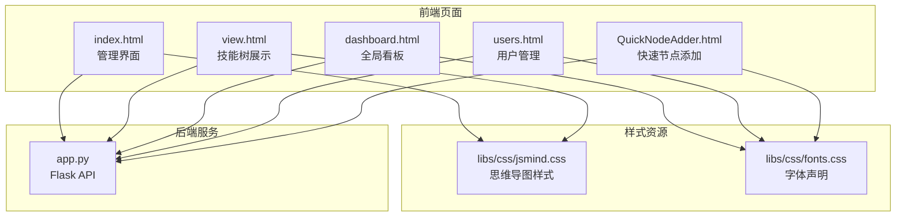
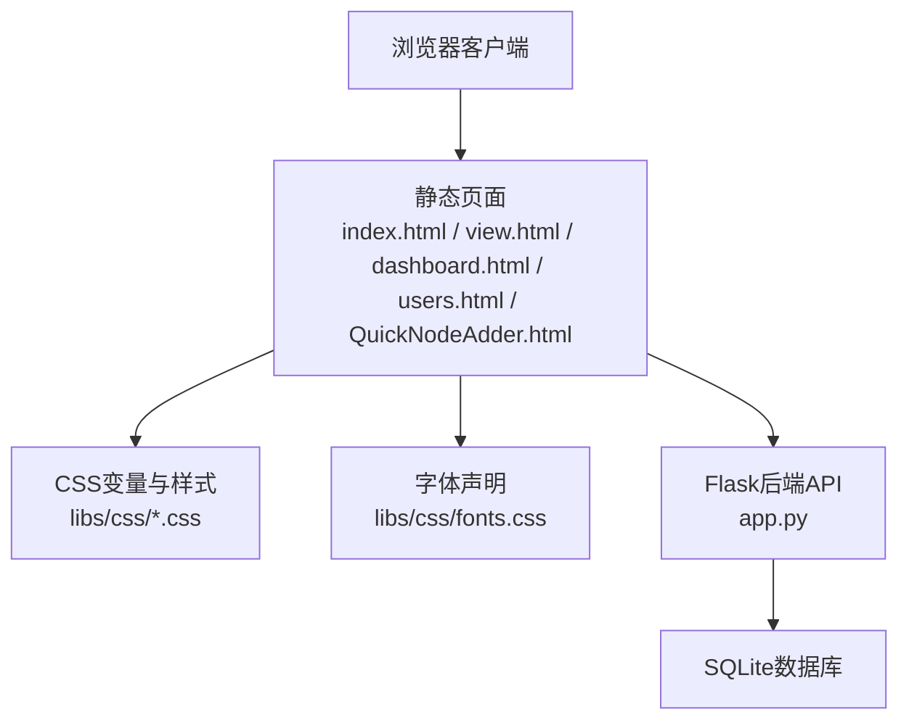
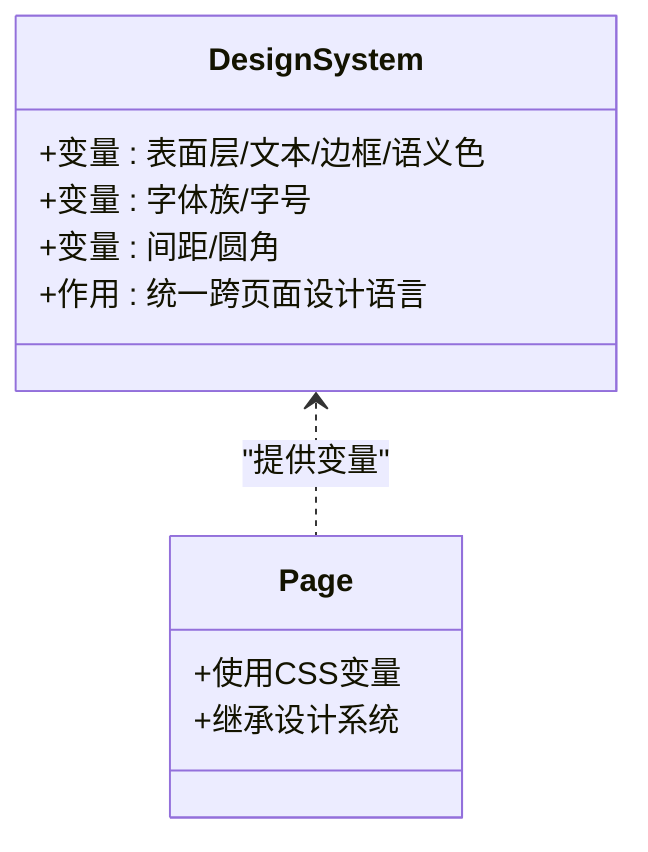
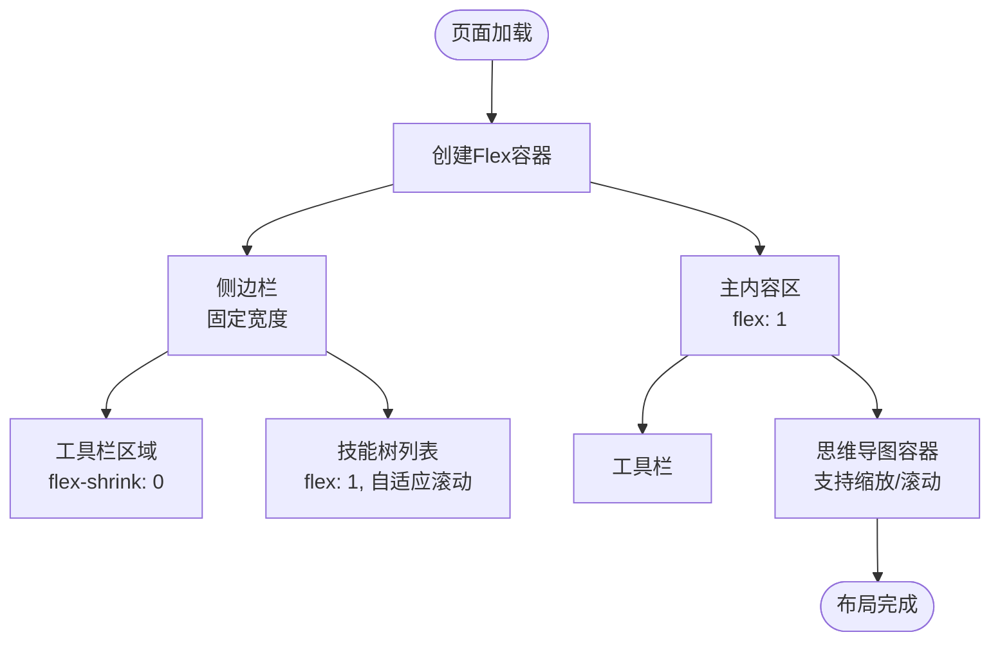
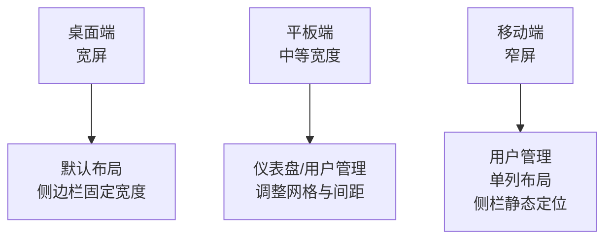
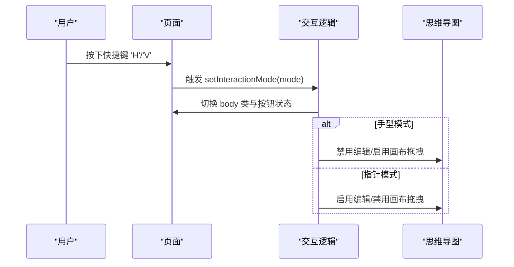
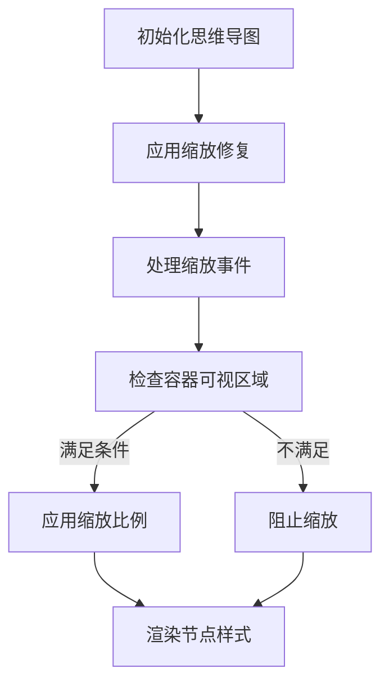
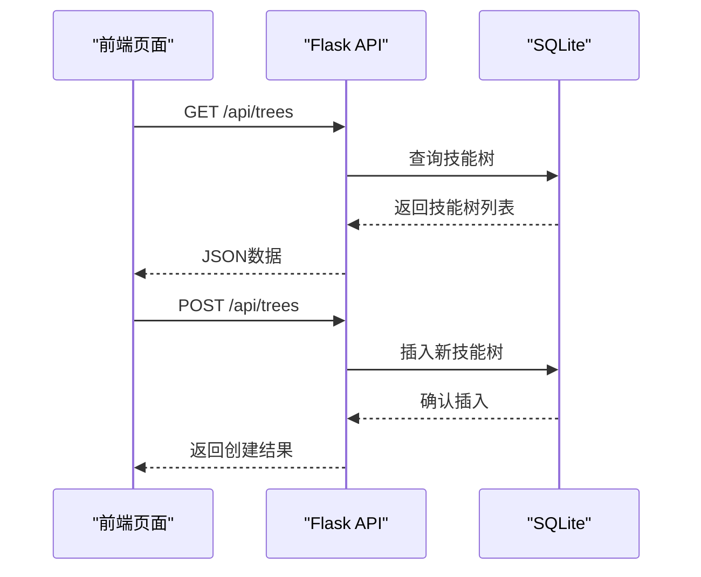
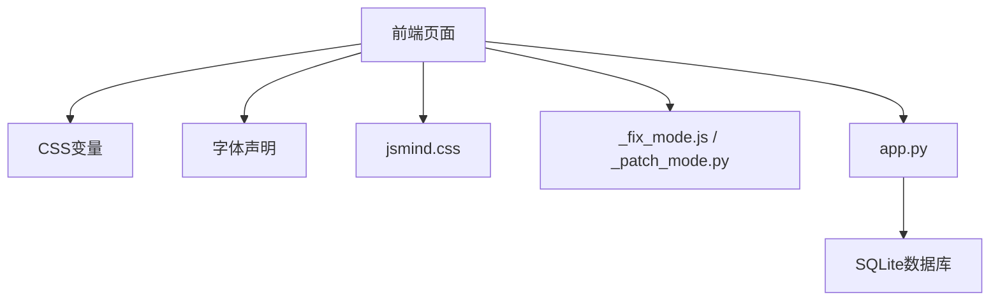

# 响应式设计实现

<cite>
**本文档引用的文件**
- [index.html](file://index.html)
- [view.html](file://view.html)
- [dashboard.html](file://dashboard.html)
- [users.html](file://users.html)
- [QuickNodeAdder.html](file://QuickNodeAdder.html)
- [libs/css/jsmind.css](file://libs/css/jsmind.css)
- [libs/css/fonts.css](file://libs/css/fonts.css)
- [app.py](file://app.py)
- [_fix_mode.js](file://_fix_mode.js)
- [_patch_mode.py](file://_patch_mode.py)
</cite>

## 目录
1. [简介](#简介)
2. [项目结构](#项目结构)
3. [核心组件](#核心组件)
4. [架构总览](#架构总览)
5. [详细组件分析](#详细组件分析)
6. [依赖关系分析](#依赖关系分析)
7. [性能考虑](#性能考虑)
8. [故障排除指南](#故障排除指南)
9. [结论](#结论)
10. [附录](#附录)

## 简介
本技术文档围绕技能树管理系统的响应式设计实现进行全面阐述，涵盖断点设置、弹性布局、媒体查询应用、CSS变量系统、容器布局、触摸设备适配、浏览器兼容性以及性能优化策略。文档旨在帮助开发者在不同设备与浏览器环境下，构建一致且高性能的用户体验。

## 项目结构
该项目采用前后端分离的静态页面+Flask后端架构，前端页面通过CSS变量统一设计系统，结合Flexbox/Grid与媒体查询实现响应式布局；后端提供技能树数据接口，支持节点增删改查与用户管理。

**图表来源**
- [index.html](file://index.html)
- [view.html](file://view.html)
- [dashboard.html](file://dashboard.html)
- [users.html](file://users.html)
- [QuickNodeAdder.html](file://QuickNodeAdder.html)
- [libs/css/jsmind.css](file://libs/css/jsmind.css)
- [libs/css/fonts.css](file://libs/css/fonts.css)
- [app.py](file://app.py)

**章节来源**
- [index.html](file://index.html)
- [view.html](file://view.html)
- [dashboard.html](file://dashboard.html)
- [users.html](file://users.html)
- [QuickNodeAdder.html](file://QuickNodeAdder.html)
- [libs/css/jsmind.css](file://libs/css/jsmind.css)
- [libs/css/fonts.css](file://libs/css/fonts.css)
- [app.py](file://app.py)

## 核心组件
- 设计系统与CSS变量：统一的色彩、字体与间距规范，确保跨页面一致性。
- 弹性布局容器：主容器、侧边栏与内容区域的自适应组合。
- 媒体查询：基于屏幕宽度的断点策略，覆盖桌面、平板与手机场景。
- 交互模式切换：指针/手型模式，适配触摸设备与桌面环境。
- 思维导图集成：jsMind容器与节点样式，配合缩放与拖拽行为。
- 用户界面：仪表盘、用户管理、快速节点添加等页面的响应式布局。

**章节来源**
- [index.html](file://index.html)
- [view.html](file://view.html)
- [dashboard.html](file://dashboard.html)
- [users.html](file://users.html)
- [QuickNodeAdder.html](file://QuickNodeAdder.html)
- [libs/css/jsmind.css](file://libs/css/jsmind.css)

## 架构总览
系统采用“静态页面 + 后端API”的轻量架构。前端页面通过CSS变量与媒体查询实现响应式，后端提供REST风格API，支持技能树与用户数据的CRUD操作。

**图表来源**
- [index.html](file://index.html)
- [view.html](file://view.html)
- [dashboard.html](file://dashboard.html)
- [users.html](file://users.html)
- [QuickNodeAdder.html](file://QuickNodeAdder.html)
- [libs/css/jsmind.css](file://libs/css/jsmind.css)
- [libs/css/fonts.css](file://libs/css/fonts.css)
- [app.py](file://app.py)

## 详细组件分析

### 设计系统与CSS变量
- 色彩体系：采用统一的板岩灰系（Slate）作为主色板，定义表面层、文本、边框与语义色（成功/警告/危险），并通过CSS变量在页面间共享。
- 字体系统：通过CSS变量统一字体族，优先使用Inter字体，回退到系统字体，保证跨平台一致性。
- 间距规范：通过变量控制卡片圆角、内边距、间距等，确保视觉节奏一致。

**图表来源**
- [index.html](file://index.html)
- [view.html](file://view.html)
- [dashboard.html](file://dashboard.html)
- [users.html](file://users.html)

**章节来源**
- [index.html](file://index.html)
- [view.html](file://view.html)
- [dashboard.html](file://dashboard.html)
- [users.html](file://users.html)

### 容器布局与弹性布局
- 主容器：采用Flexbox布局，主容器横向排列，侧边栏固定宽度，内容区域占据剩余空间，溢出隐藏并启用滚动。
- 侧边栏：固定宽度与最小宽度约束，内部使用垂直Flex布局，顶部工具栏固定，下方列表区域自适应滚动。
- 内容区域：采用垂直Flex布局，工具栏与思维导图区域自适应，思维导图容器支持缩放与滚动。

**图表来源**
- [index.html](file://index.html)

**章节来源**
- [index.html](file://index.html)

### 媒体查询与断点策略
- 桌面端：默认布局，侧边栏固定宽度，内容区域自适应。
- 平板端：在特定断点下，仪表盘与用户管理页面调整网格与布局，确保信息密度合理。
- 移动端：用户管理页面在更窄断点下，主布局改为单列，侧边栏变为静态定位，提高可读性。

**图表来源**
- [dashboard.html](file://dashboard.html)
- [users.html](file://users.html)

**章节来源**
- [dashboard.html](file://dashboard.html)
- [users.html](file://users.html)

### 触摸设备适配与交互模式
- 交互模式：提供“指针”和“手型”两种模式，通过键盘快捷键在两者间切换，适配触摸与非触摸场景。
- 手型模式：禁用编辑功能，启用画布拖拽，提升触摸体验。
- 指针模式：启用编辑功能，保持传统鼠标交互。

**图表来源**
- [_fix_mode.js](file://_fix_mode.js)
- [view.html](file://view.html)

**章节来源**
- [_fix_mode.js](file://_fix_mode.js)
- [view.html](file://view.html)

### 思维导图容器与缩放行为
- 容器尺寸：思维导图容器采用百分比宽度与固定高度，背景使用棋盘纹理，增强层次感。
- 缩放修复：针对jsMind的面板尺寸计算问题进行修复，确保在放大后仍能正确缩放到合适比例。
- 节点样式：根据节点状态（锁定/解锁/已激活）应用不同的视觉反馈与动画效果。

**图表来源**
- [_patch_mode.py](file://_patch_mode.py)
- [libs/css/jsmind.css](file://libs/css/jsmind.css)
- [view.html](file://view.html)

**章节来源**
- [_patch_mode.py](file://_patch_mode.py)
- [libs/css/jsmind.css](file://libs/css/jsmind.css)
- [view.html](file://view.html)

### 字体与本地化资源
- 字体声明：通过@font-face声明Inter与Orbitron字体，使用woff2格式，设置font-display为swap，提升加载性能。
- 字体回退：在CSS中统一使用Inter作为正文与显示字体，确保跨平台一致性。

**章节来源**
- [libs/css/fonts.css](file://libs/css/fonts.css)
- [index.html](file://index.html)
- [view.html](file://view.html)
- [dashboard.html](file://dashboard.html)
- [users.html](file://users.html)
- [QuickNodeAdder.html](file://QuickNodeAdder.html)

### 后端API与数据流
- 技能树管理：提供技能树列表、创建、更新、删除与节点增删改查接口。
- 用户管理：提供用户列表、创建、更新与权限设置接口。
- 数据模型：用户、技能树、技能节点、用户技能树状态、节点编辑历史、节点点击历史、学习任务等。

**图表来源**
- [app.py](file://app.py)

**章节来源**
- [app.py](file://app.py)

## 依赖关系分析
- 前端页面依赖CSS变量与字体声明，确保设计一致性。
- 思维导图依赖jsmind.css样式与容器布局。
- 页面通过JavaScript实现交互模式切换与缩放修复。
- 后端提供统一的REST API，前端通过fetch调用。

**图表来源**
- [index.html](file://index.html)
- [view.html](file://view.html)
- [dashboard.html](file://dashboard.html)
- [users.html](file://users.html)
- [QuickNodeAdder.html](file://QuickNodeAdder.html)
- [libs/css/jsmind.css](file://libs/css/jsmind.css)
- [libs/css/fonts.css](file://libs/css/fonts.css)
- [_fix_mode.js](file://_fix_mode.js)
- [_patch_mode.py](file://_patch_mode.py)
- [app.py](file://app.py)

**章节来源**
- [index.html](file://index.html)
- [view.html](file://view.html)
- [dashboard.html](file://dashboard.html)
- [users.html](file://users.html)
- [QuickNodeAdder.html](file://QuickNodeAdder.html)
- [libs/css/jsmind.css](file://libs/css/jsmind.css)
- [libs/css/fonts.css](file://libs/css/fonts.css)
- [_fix_mode.js](file://_fix_mode.js)
- [_patch_mode.py](file://_patch_mode.py)
- [app.py](file://app.py)

## 性能考虑
- CSS变量与样式复用：通过CSS变量减少重复定义，降低CSS体积与维护成本。
- 字体优化：使用woff2格式与font-display: swap，提升首屏渲染性能。
- 媒体查询精简：仅在必要断点处调整布局，避免过度碎片化。
- JavaScript模块化：交互模式切换与缩放修复独立脚本，便于维护与按需加载。
- 后端接口：使用Flask轻量框架，SQLite本地存储，减少部署复杂度与I/O开销。

[本节为通用性能建议，无需特定文件引用]

## 故障排除指南
- 缩放异常：若思维导图缩放后无法继续缩小，检查缩放修复逻辑是否生效，确认容器可视区域计算正确。
- 交互模式切换无效：检查键盘事件绑定与按钮状态切换逻辑，确保在手型模式下禁用编辑，在指针模式下启用编辑。
- 布局溢出：检查Flex容器的gap与padding设置，确保内容不会超出视口；在窄屏下启用滚动容器。
- 字体加载缓慢：确认字体文件路径与格式正确，优先使用woff2，设置合适的font-display策略。

**章节来源**
- [_patch_mode.py](file://_patch_mode.py)
- [_fix_mode.js](file://_fix_mode.js)
- [libs/css/fonts.css](file://libs/css/fonts.css)
- [index.html](file://index.html)

## 结论
本项目通过统一的CSS变量设计系统、灵活的弹性布局与精准的媒体查询断点，实现了跨设备的一致体验。结合交互模式切换与思维导图缩放修复，进一步提升了触摸设备的可用性。后端API简洁高效，前端页面结构清晰，整体具备良好的可维护性与扩展性。

## 附录
- 最佳实践
  - 使用CSS变量统一设计语言，避免硬编码颜色与尺寸。
  - 在关键布局处使用媒体查询，保持断点数量合理。
  - 对触摸设备提供明确的交互反馈与手势支持。
  - 优化字体加载与关键渲染路径，提升首屏性能。
- 常见问题
  - 布局溢出：通过容器滚动与弹性布局解决。
  - 缩放异常：通过容器可视区域计算修复。
  - 字体加载：使用现代字体格式与合适的加载策略。

[本节为概念性总结，无需特定文件引用]