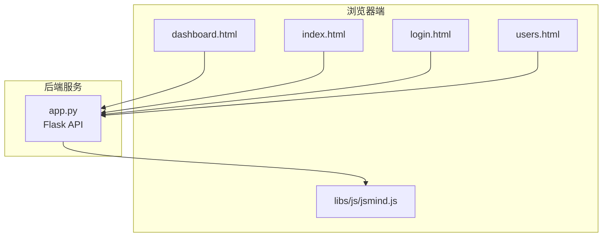
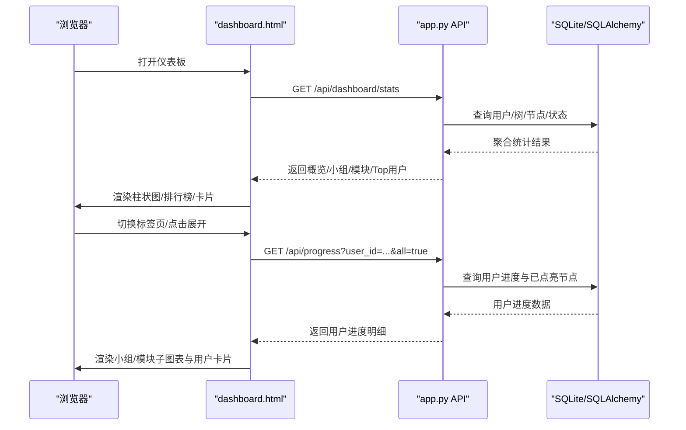
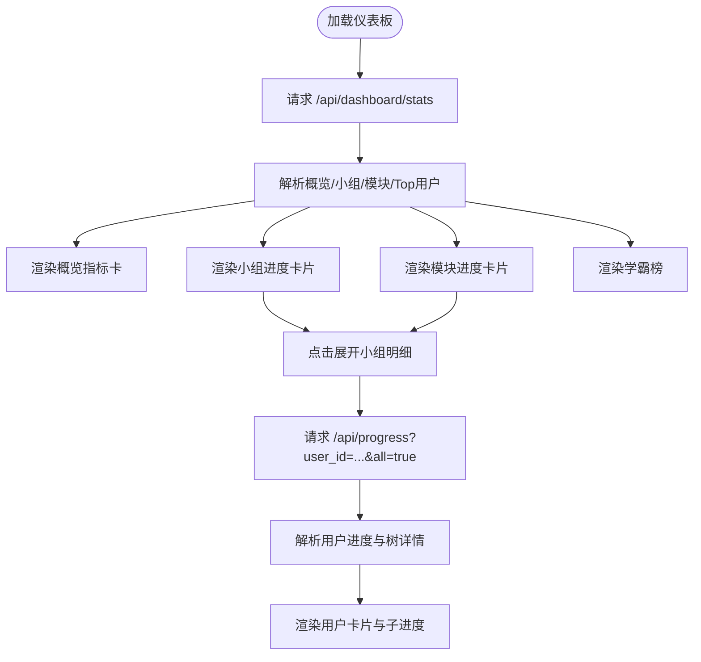
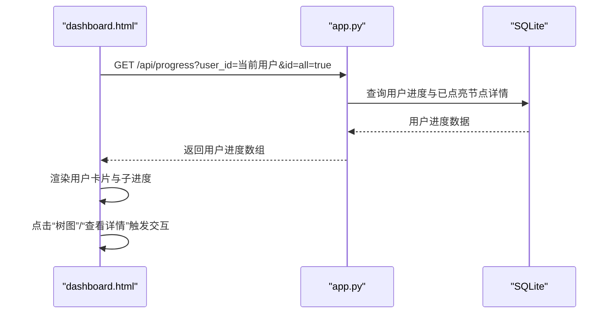
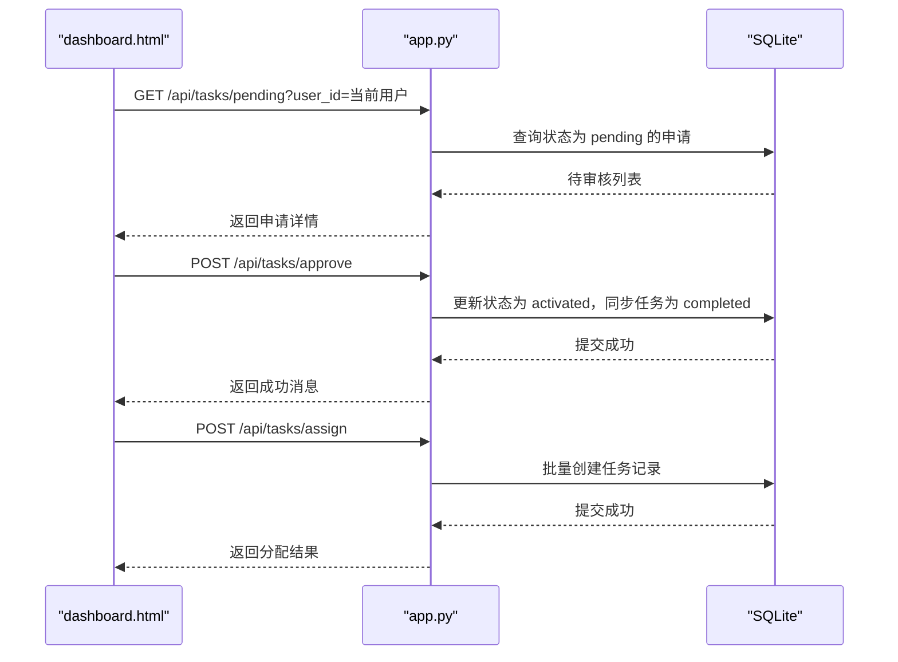
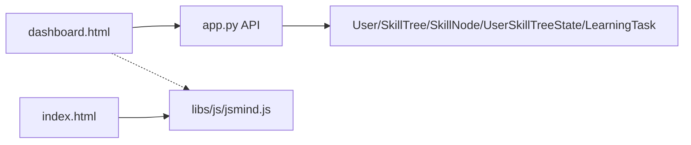

# 仪表板界面组件

<cite>
**本文引用的文件**
- [dashboard.html](file://dashboard.html)
- [app.py](file://app.py)
- [index.html](file://index.html)
- [login.html](file://login.html)
- [users.html](file://users.html)
- [libs/js/jsmind.js](file://libs/js/jsmind.js)
</cite>

## 目录
1. [简介](#简介)
2. [项目结构](#项目结构)
3. [核心组件](#核心组件)
4. [架构总览](#架构总览)
5. [详细组件分析](#详细组件分析)
6. [依赖关系分析](#依赖关系分析)
7. [性能考量](#性能考量)
8. [故障排查指南](#故障排查指南)
9. [结论](#结论)
10. [附录](#附录)

## 简介
本技术文档聚焦于技能树管理系统的“仪表板界面组件”，围绕 dashboard.html 的统计分析与进度监控实现进行深入解析。文档涵盖：
- 数据图表展示与交互式布局
- 统计报表生成与用户行为分析
- 系统状态监控与任务分配流程
- 后端 API 的数据聚合与权限控制
- 前端渲染优化与实时更新策略
- 报表导出与定时任务调度建议

## 项目结构
系统采用前后端分离架构：
- 前端页面：dashboard.html、index.html、login.html、users.html
- 后端服务：Flask 应用 app.py，提供 REST API
- 前端可视化库：libs/js/jsmind.js（思维导图渲染）
- 静态资源：libs/css、libs/fonts

**图表来源**
- [dashboard.html](file://dashboard.html)
- [app.py](file://app.py)
- [libs/js/jsmind.js](file://libs/js/jsmind.js)

**章节来源**
- [dashboard.html](file://dashboard.html)
- [app.py](file://app.py)

## 核心组件
- 仪表板页面：dashboard.html 提供全局概览、模块概览、小组进度、学霸榜、审核中心、任务分配等视图。
- 统计接口：/api/dashboard/stats 返回总体指标、小组进度、模块进度、Top 用户。
- 进度接口：/api/progress 返回用户在各技能树的进度与已点亮节点详情。
- 任务接口：/api/tasks/* 提供任务分配、撤销、审批、查询。
- 登录与权限：登录页 login.html 与用户权限控制，仅管理员与组长可见仪表板。
- 思维导图：index.html 使用 jsmind.js 渲染技能树。

**章节来源**
- [dashboard.html](file://dashboard.html)
- [app.py](file://app.py)
- [index.html](file://index.html)
- [login.html](file://login.html)
- [users.html](file://users.html)
- [libs/js/jsmind.js](file://libs/js/jsmind.js)

## 架构总览
仪表板的数据流由前端发起，经由后端 API 聚合数据库统计，再返回到前端进行可视化渲染。权限控制贯穿登录、任务分配与审核流程。

**图表来源**
- [dashboard.html](file://dashboard.html)
- [app.py](file://app.py)

## 详细组件分析

### 1) 统计面板与图表渲染
- 概览指标：总用户数、总技能树、总节点数、平台总激活数。
- 小组进度：A/B/C/D/Office 组的综合进度百分比，按用户数标注。
- 模块进度：按模块维度统计，显示树数量、节点数量、用户数量与进度。
- 学霸榜：按已点亮节点数量 Top 10 展示。

**图表来源**
- [dashboard.html](file://dashboard.html)
- [app.py](file://app.py)

**章节来源**
- [dashboard.html](file://dashboard.html)
- [app.py](file://app.py)

### 2) 用户进度与交互式图表
- 用户卡片：展示每个用户的技能树进度、点亮节点数量、百分比与进度条。
- 交互细节：点击“树图”跳转独立视图；点击进度条查看已点亮节点详情。
- 小组/模块钻取：点击卡片标题展开该小组/模块下用户的细粒度进度。

**图表来源**
- [dashboard.html](file://dashboard.html)
- [app.py](file://app.py)

**章节来源**
- [dashboard.html](file://dashboard.html)
- [app.py](file://app.py)

### 3) 审核中心与任务分配
- 审核中心：列出待审核的“点亮申请”，支持通过审核。
- 任务分配：管理员/组长可为本组成员分配每日/周/月/季度/年任务，支持多选节点。
- 权限控制：非管理员/非组长无法查看仪表板与执行任务操作。

**图表来源**
- [dashboard.html](file://dashboard.html)
- [app.py](file://app.py)

**章节来源**
- [dashboard.html](file://dashboard.html)
- [app.py](file://app.py)

### 4) 数据统计与计算逻辑
- 总体指标：用户数、树数、节点数、激活数（过滤 root 节点）。
- 小组进度：小组激活数 / (小组人数 × 总节点数) × 100。
- 模块进度：模块内树的节点总数 × 模块内用户数，激活数 / 可能激活数 × 100。
- 学霸榜：按激活节点数 Top 10 排行，计算占总节点比例。
- 用户进度：树内实际节点与用户激活节点交集，计算百分比与已点亮节点详情。

**章节来源**
- [app.py](file://app.py)

### 5) 前端渲染与交互优化
- 按需渲染：标签页切换时仅加载对应内容；点击展开明细时再请求用户进度。
- 动态进度条：进度条宽度动画过渡，提升视觉反馈。
- 权限控制：登录页与仪表板均进行权限校验，非管理员/非组长不可见。
- 任务面板：分配后自动刷新下方任务列表，支持撤回任务。

**章节来源**
- [dashboard.html](file://dashboard.html)
- [login.html](file://login.html)

## 依赖关系分析
- 前端依赖 jsmind.js 用于技能树渲染（在 index.html 中使用），与 dashboard.html 无直接耦合。
- dashboard.html 依赖 app.py 的 /api/dashboard/stats、/api/progress、/api/tasks/* 等接口。
- 权限模型：User 表含 is_admin、is_leader、group、module 字段，贯穿登录、任务分配、审核流程。

**图表来源**
- [dashboard.html](file://dashboard.html)
- [app.py](file://app.py)
- [index.html](file://index.html)
- [libs/js/jsmind.js](file://libs/js/jsmind.js)

**章节来源**
- [app.py](file://app.py)
- [dashboard.html](file://dashboard.html)
- [index.html](file://index.html)

## 性能考量
- 数据聚合：后端一次性查询并聚合，减少前端多次请求。
- 权限过滤：在后端按模块交集与组别过滤，避免前端渲染无关数据。
- 渲染优化：进度条使用 CSS 动画过渡，避免频繁重排；按需展开明细，降低初始渲染压力。
- 并发请求：仪表板初始化时并发获取统计与用户进度，缩短首屏等待。
- 建议：
  - 对高频查询建立合适索引（如 UserSkillTreeState 的 user_id/tree_id/node_id 组合索引）。
  - 对大数据量场景考虑分页或懒加载。
  - 对图表渲染可引入虚拟滚动或分页展示。

[本节为通用性能建议，无需特定文件引用]

## 故障排查指南
- 登录失败：检查 login.html 的 /api/login 返回与本地存储 currentUser。
- 无权限访问：确认当前用户 is_admin 或 is_leader，否则会被重定向。
- 仪表板空白：检查 /api/dashboard/stats 与 /api/progress 的响应，确认网络与后端服务状态。
- 审核/分配失败：检查权限校验与参数完整性，查看后端返回的错误信息。
- 任务列表为空：确认用户是否被分配任务，或任务是否已被完成/撤回。

**章节来源**
- [login.html](file://login.html)
- [dashboard.html](file://dashboard.html)
- [app.py](file://app.py)

## 结论
仪表板界面组件通过清晰的标签页与卡片布局，结合后端强大的统计聚合能力，实现了从全局概览到小组/模块/个人进度的多层次可视化。配合严格的权限控制与任务分配/审核流程，满足管理员与组长对系统状态与学习进度的全面掌控。建议持续关注数据聚合性能与前端渲染优化，以支撑更大规模的用户与技能树数据。

[本节为总结性内容，无需特定文件引用]

## 附录

### A. 关键 API 一览
- GET /api/dashboard/stats：返回总体指标、小组进度、模块进度、Top 用户
- GET /api/progress：返回用户在各技能树的进度与已点亮节点详情
- POST /api/tasks/assign：分配学习任务（支持多选节点）
- DELETE /api/tasks/{id}：撤回任务
- GET /api/tasks/my：获取用户任务列表（按周期分类）
- GET /api/tasks/pending：获取待审核列表
- POST /api/tasks/approve：审核通过并正式点亮节点

**章节来源**
- [app.py](file://app.py)

### B. 前端交互要点
- 标签页切换：switchTab 控制内容显隐，必要时触发数据加载。
- 进度展开：点击卡片标题展开小组/模块下用户明细。
- 任务分配：选择用户/技能树/节点，提交后刷新任务面板。
- 审核流程：点击“通过审核”更新状态并刷新仪表板。

**章节来源**
- [dashboard.html](file://dashboard.html)

### C. 权限与角色
- 管理员：可查看所有用户与技能树，可分配/审核任务。
- 组长：仅可查看与管理本组成员，可分配/审核本组成员任务。
- 普通用户：仅可查看自身进度与任务。

**章节来源**
- [login.html](file://login.html)
- [dashboard.html](file://dashboard.html)
- [app.py](file://app.py)