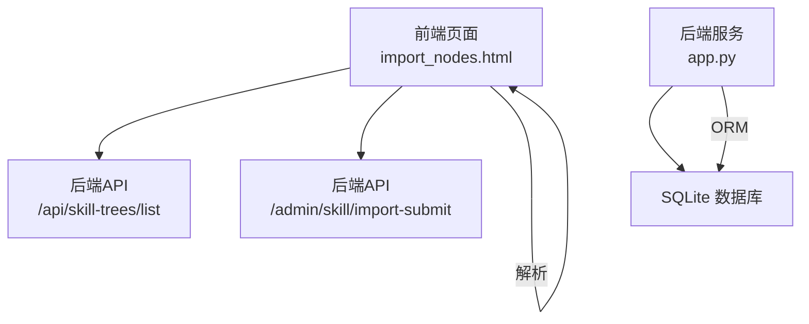
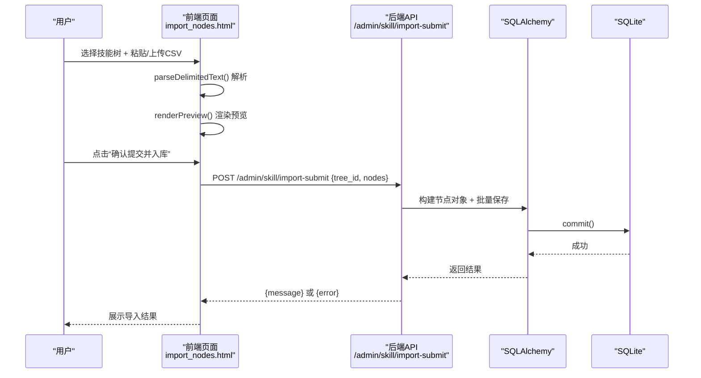
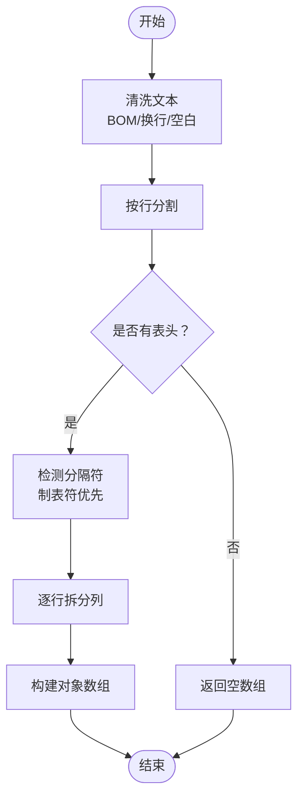
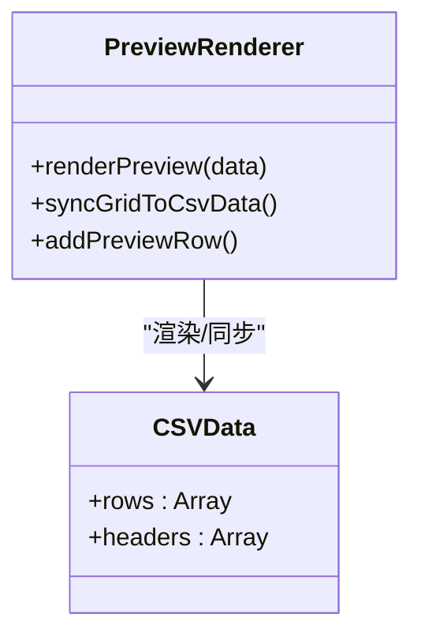
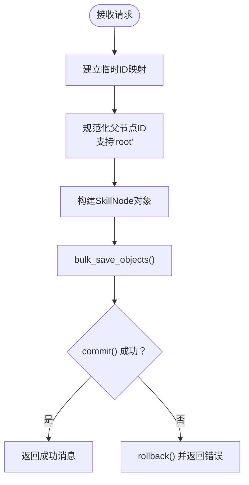
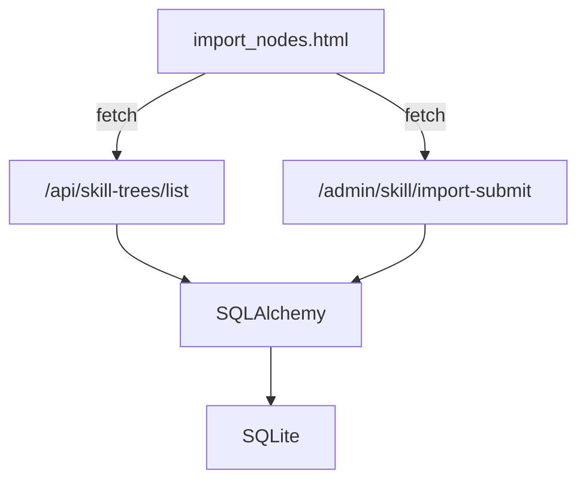

# 数据导入界面组件

<cite>
**本文档引用的文件**
- [import_nodes.html](file://import_nodes.html)
- [app.py](file://app.py)
- [README.md](file://README.md)
- [requirements.txt](file://requirements.txt)
</cite>

## 目录
1. [简介](#简介)
2. [项目结构](#项目结构)
3. [核心组件](#核心组件)
4. [架构总览](#架构总览)
5. [详细组件分析](#详细组件分析)
6. [依赖关系分析](#依赖关系分析)
7. [性能考虑](#性能考虑)
8. [故障排查指南](#故障排查指南)
9. [结论](#结论)
10. [附录](#附录)

## 简介
本文件面向技能树管理系统的“数据导入界面组件”，聚焦于 import_nodes.html 中的 CSV 文件导入功能，涵盖以下方面：
- 文件上传处理与粘贴解析
- CSV 格式验证与标准化
- 数据预览与可编辑表格
- 批量导入逻辑与事务回滚
- 错误处理与提示机制
- 前端解析流程与后端 API 对接
- 性能优化与最佳实践

该组件通过纯前端解析与后端批量入库相结合的方式，实现从 Excel 复制粘贴或本地文本文件导入，最终将节点批量写入数据库。

## 项目结构
- 前端页面：import_nodes.html 提供导入界面、解析与预览、提交入口
- 后端服务：app.py 提供技能树列表、导入预览、导入提交等 API
- 依赖：Flask、Flask-SQLAlchemy、Flask-CORS

图表来源
- [import_nodes.html:180-225](file://import_nodes.html#L180-L225)
- [app.py:183-187](file://app.py#L183-L187)
- [app.py:208-275](file://app.py#L208-L275)

章节来源
- [import_nodes.html:103-227](file://import_nodes.html#L103-L227)
- [app.py:17-22](file://app.py#L17-L22)
- [README.md:61-78](file://README.md#L61-L78)

## 核心组件
- 前端解析器：parseDelimitedText，支持自动识别分隔符（逗号或制表符），并进行基本清洗与标准化
- 预览渲染：renderPreview，将解析后的数据渲染为可编辑表格，支持新增行与同步回数据集
- 文件处理：支持拖拽/点击上传本地 UTF-8 文本文件，自动填充粘贴区并触发解析
- 提交流程：提交目标技能树与数据集，后端执行批量入库与事务控制

章节来源
- [import_nodes.html:238-287](file://import_nodes.html#L238-L287)
- [import_nodes.html:389-419](file://import_nodes.html#L389-L419)
- [import_nodes.html:339-371](file://import_nodes.html#L339-L371)
- [import_nodes.html:441-482](file://import_nodes.html#L441-L482)

## 架构总览
导入流程分为三步：选择目标技能树、解析粘贴/上传内容、确认入库。前端负责解析与预览，后端负责批量入库与事务控制。

图表来源
- [import_nodes.html:441-482](file://import_nodes.html#L441-L482)
- [app.py:208-275](file://app.py#L208-L275)

## 详细组件分析

### 1. 文件上传与粘贴解析
- 自动识别分隔符：优先使用制表符，其次使用逗号；若两者都不存在或仅有表头，视为无效
- 清洗与标准化：去除 BOM、统一换行符、去空白、处理带引号的逗号分隔
- 结果：返回对象数组，每项为一行，键为表头

图表来源
- [import_nodes.html:238-287](file://import_nodes.html#L238-L287)

章节来源
- [import_nodes.html:238-287](file://import_nodes.html#L238-L287)

### 2. 数据预览与可编辑表格
- 预览表头与数据：根据解析结果动态生成
- 单元格输入：可编辑输入框，支持 Tab 移动
- 同步机制：syncGridToCsvData 将表格内容同步回 csvData
- 新增行：addPreviewRow 在已有表头基础上追加空行

图表来源
- [import_nodes.html:389-419](file://import_nodes.html#L389-L419)
- [import_nodes.html:373-387](file://import_nodes.html#L373-L387)
- [import_nodes.html:429-439](file://import_nodes.html#L429-L439)

章节来源
- [import_nodes.html:389-419](file://import_nodes.html#L389-L419)
- [import_nodes.html:373-387](file://import_nodes.html#L373-L387)
- [import_nodes.html:429-439](file://import_nodes.html#L429-L439)

### 3. 文件上传处理（拖拽/点击）
- 支持 .csv/.txt 文本文件，读取为 UTF-8
- 自动填充粘贴区并触发解析
- 拖拽事件：dragenter/dragover/dragleave/drop

章节来源
- [import_nodes.html:339-371](file://import_nodes.html#L339-L371)

### 4. 技能树选择与加载
- 页面加载后调用 /api/skill-trees/list 获取技能树列表
- 下拉框动态填充，供用户选择目标技能树

章节来源
- [import_nodes.html:312-331](file://import_nodes.html#L312-L331)
- [app.py:183-187](file://app.py#L183-L187)

### 5. 批量导入逻辑与事务控制
- 前端提交：tree_id + nodes
- 后端处理：
  - 构建临时 ID 映射表（CSV 内部父子关系）
  - 规范化父节点：支持字符串 "root" 直接存入 parent_id
  - 布尔值处理：expanded 字段转换
  - 构建 SkillNode 对象集合
  - 批量保存 + 提交
  - 异常回滚

图表来源
- [app.py:208-275](file://app.py#L208-L275)

章节来源
- [app.py:208-275](file://app.py#L208-L275)

### 6. 错误处理与提示机制
- 前端：
  - 解析失败提示：提示缺少表头或数据
  - 提交前校验：未选择技能树、无数据
  - 加载中状态：禁用按钮并显示加载动画
- 后端：
  - 异常捕获与回滚
  - 返回结构化错误信息

章节来源
- [import_nodes.html:289-305](file://import_nodes.html#L289-L305)
- [import_nodes.html:441-482](file://import_nodes.html#L441-L482)
- [app.py:272-274](file://app.py#L272-L274)

### 7. 数据模板与下载
- downloadTemplate 生成 CSV 模板，包含示例行
- 模板字段：temp_id、parent_temp_id、topic、direction、expanded、status、background_color、foreground_color、description、link、link2、level、module、sort_index

章节来源
- [import_nodes.html:484-506](file://import_nodes.html#L484-L506)

## 依赖关系分析
- 前端依赖：无外部 CSV 解析库（不依赖 PapaParse），内置解析器满足需求
- 后端依赖：Flask、Flask-SQLAlchemy、Flask-CORS
- 数据库：SQLite（由 SQLAlchemy 管理）

图表来源
- [import_nodes.html:312-331](file://import_nodes.html#L312-L331)
- [import_nodes.html:463-467](file://import_nodes.html#L463-L467)
- [app.py:17-22](file://app.py#L17-L22)

章节来源
- [requirements.txt:1-4](file://requirements.txt#L1-L4)
- [app.py:17-22](file://app.py#L17-L22)

## 性能考虑
- 前端解析：
  - 采用原生字符串处理，避免引入额外库，减少体积与依赖
  - 对大文件建议分批粘贴或使用本地文件上传，避免一次性超长文本导致卡顿
- 后端入库：
  - 使用 bulk_save_objects() 批量插入，减少多次往返
  - 事务控制：成功提交，异常回滚，保证一致性
- UI 交互：
  - 预览表格使用可编辑输入框，避免复杂表格库带来的性能负担
  - 滚动到预览区域，提升用户体验

## 故障排查指南
- 无法解析数据
  - 检查粘贴区是否包含表头与至少一行数据
  - 确认分隔符是否为制表符或逗号之一
  - 若 Excel 复制，确保复制的是“值”而非公式
- 未选择技能树
  - 确认已从下拉框选择目标技能树
- 提交失败
  - 查看后端日志与返回的错误信息
  - 检查节点字段是否符合要求（如 topic 不能为空）
- 数据库连接问题
  - 确认 SQLite 数据库文件存在且可写
  - 确认 Flask 服务已启动并监听端口

章节来源
- [import_nodes.html:289-305](file://import_nodes.html#L289-L305)
- [import_nodes.html:441-482](file://import_nodes.html#L441-L482)
- [app.py:272-274](file://app.py#L272-L274)

## 结论
该导入界面组件通过“纯前端解析 + 后端批量入库”的方式，实现了从 Excel 复制粘贴或本地文本导入的完整流程。前端负责灵活的解析与预览，后端负责稳健的批量入库与事务控制。整体设计简洁、可移植性强，适合在不同系统环境中复用。

## 附录

### API 定义
- 获取技能树列表
  - 方法：GET
  - 路径：/api/skill-trees/list
  - 返回：[{id, name}]
- 导入提交
  - 方法：POST
  - 路径：/admin/skill/import-submit
  - 请求体：{tree_id: 数字, nodes: 对象数组}
  - 响应：成功返回消息，失败返回错误信息

章节来源
- [app.py:183-187](file://app.py#L183-L187)
- [app.py:208-275](file://app.py#L208-L275)

### 数据模型（节选）
- SkillNode 字段（部分）
  - node_id：节点标识
  - tree_id：所属技能树
  - parent_id：父节点标识（支持字符串 "root"）
  - topic：节点标题
  - direction：方向（left/right）
  - expanded：是否展开
  - status：状态（locked/unlocked/activated）
  - background_color / foreground_color：颜色
  - description / link / link2：描述与链接
  - level / module / sort_index：等级、模块、排序索引

章节来源
- [app.py:63-102](file://app.py#L63-L102)