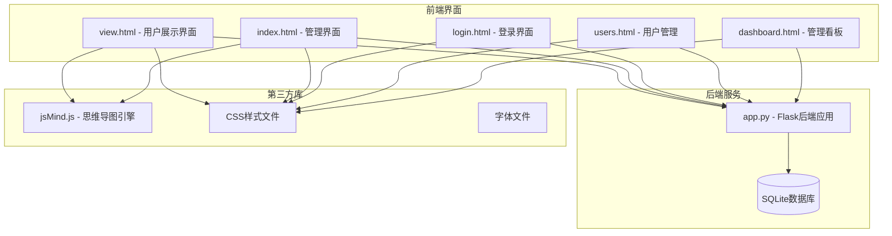
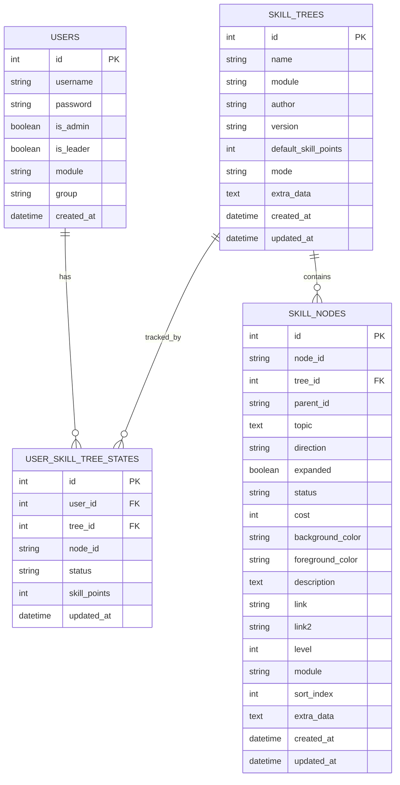
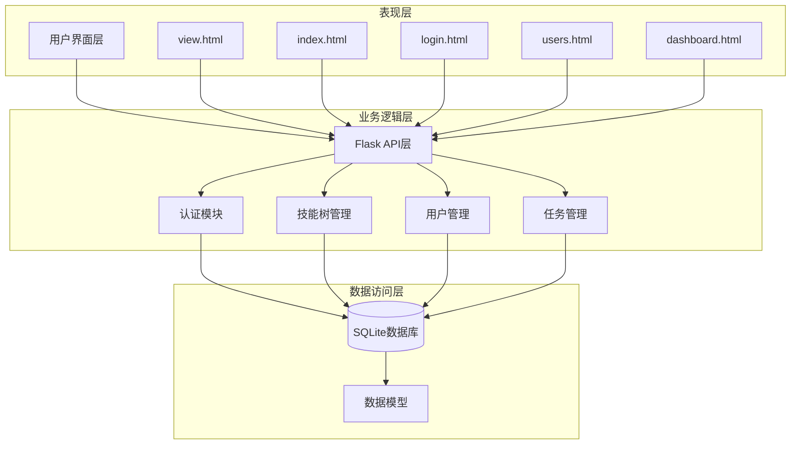
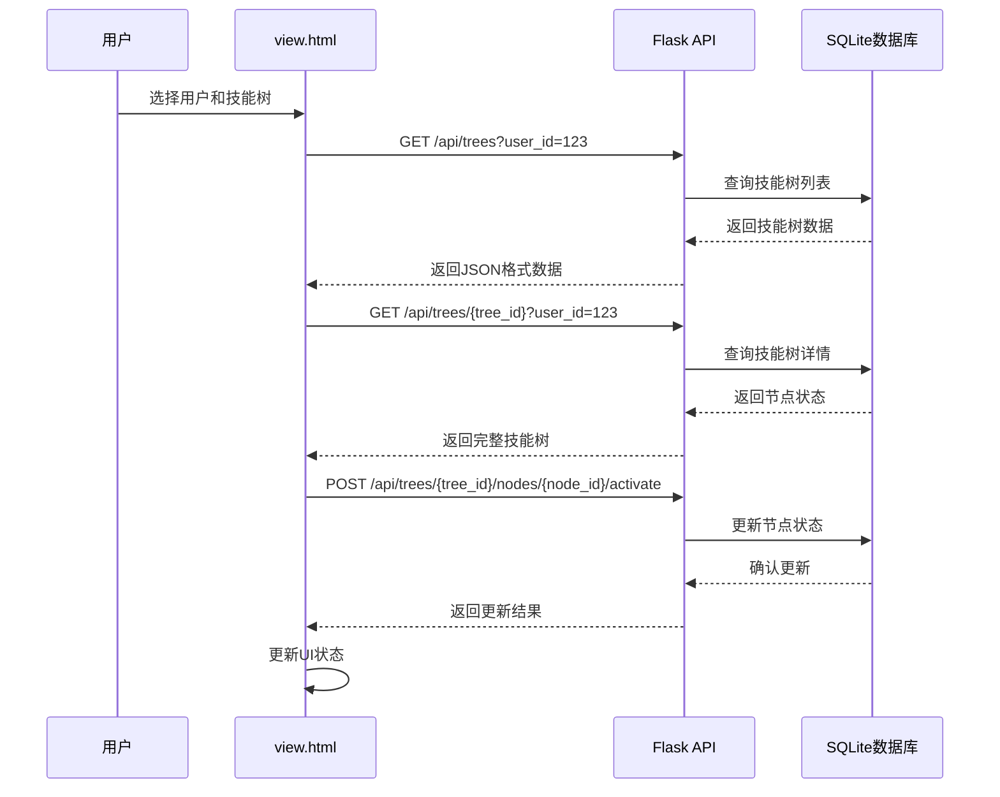
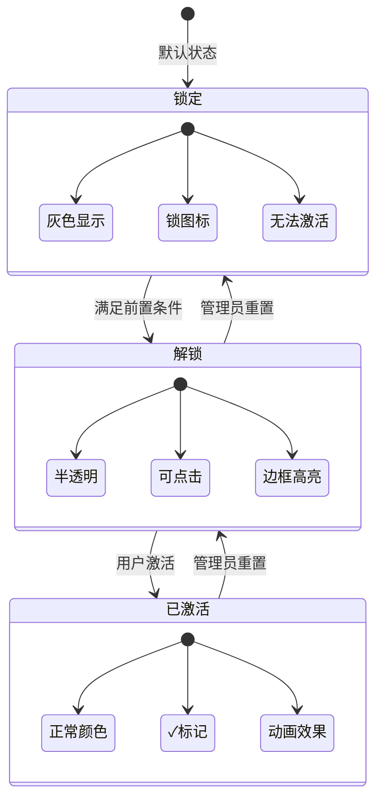
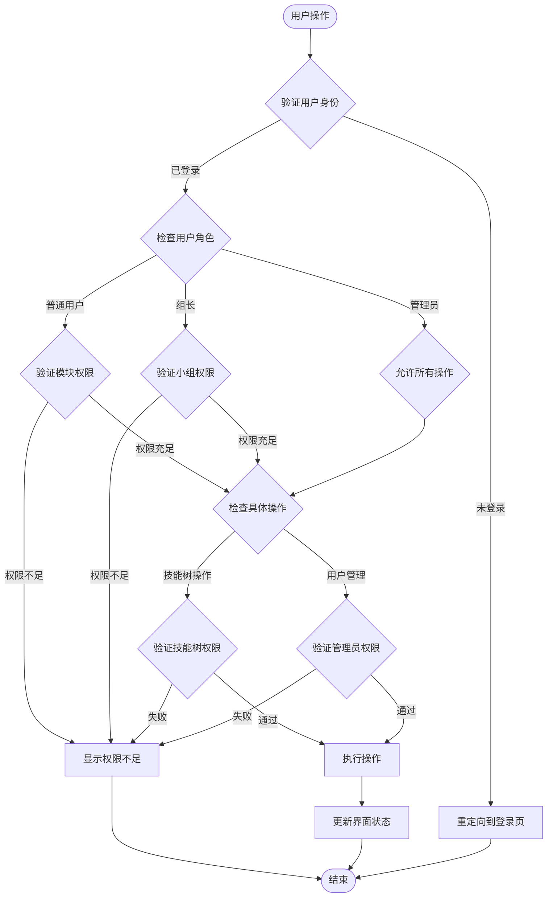
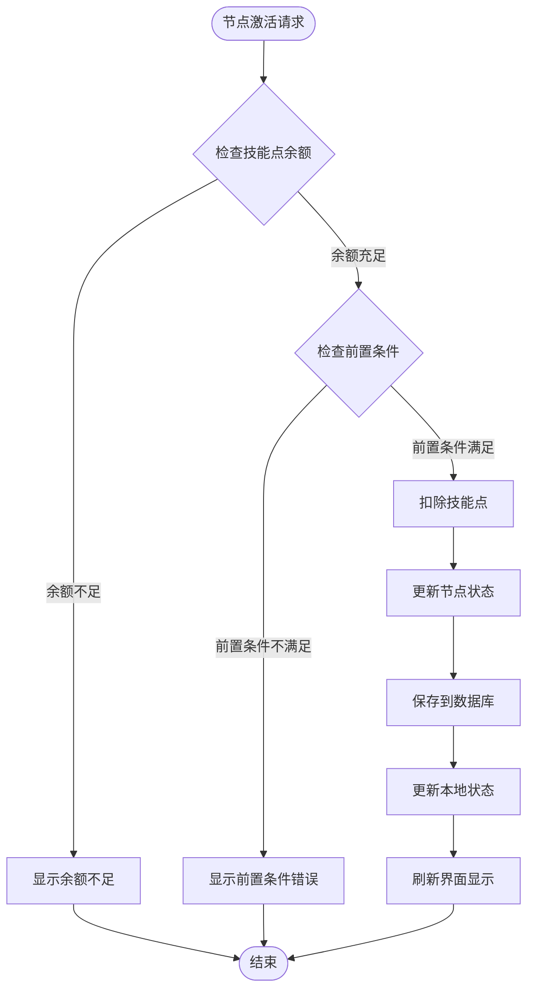
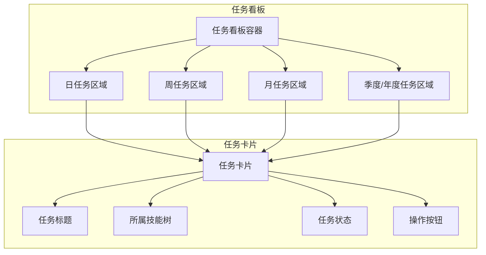
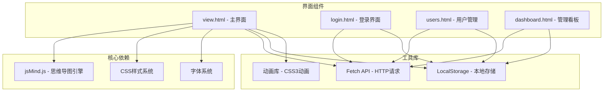
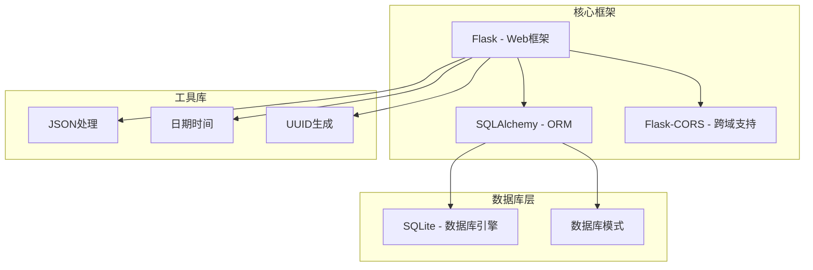

# 用户展示界面组件

<cite>
**本文档引用的文件**
- [view.html](file://view.html)
- [app.py](file://app.py)
- [README.md](file://README.md)
- [index.html](file://index.html)
- [login.html](file://login.html)
- [users.html](file://users.html)
- [dashboard.html](file://dashboard.html)
</cite>

## 目录
1. [简介](#简介)
2. [项目结构](#项目结构)
3. [核心组件](#核心组件)
4. [架构概览](#架构概览)
5. [详细组件分析](#详细组件分析)
6. [依赖关系分析](#依赖关系分析)
7. [性能考虑](#性能考虑)
8. [故障排除指南](#故障排除指南)
9. [结论](#结论)

## 简介

技能树管理系统是一个基于 jsMind 和 Flask 的技能树管理平台，专为技能树展示和学习设计。该系统提供了完整的用户展示界面组件，支持多用户、权限管理、状态持久化和技能点系统。

系统的核心特色包括：
- **多用户支持**：每个用户有独立的技能树状态，互不影响
- **权限管理**：管理员可以重置所有用户的技能树，普通用户只能管理自己的
- **状态持久化**：用户的节点激活状态独立保存
- **技能点系统**：每个用户有独立的技能点
- **只读展示模式**：用于技能树展示，不可编辑节点内容

## 项目结构

该项目采用前后端分离的架构设计，主要文件组织如下：

**图表来源**
- [view.html](file://view.html)
- [app.py](file://app.py)
- [index.html](file://index.html)

**章节来源**
- [README.md:61-78](file://README.md#L61-L78)

## 核心组件

### 用户展示界面 (view.html)

用户展示界面是系统的核心组件，提供了完整的技能树查看和学习功能。主要功能包括：

#### 技能树展示功能
- **只读展示模式**：技能树以只读形式展示，用户可以看到完整的技能树结构
- **节点状态可视化**：通过不同的颜色和图标显示节点的不同状态
- **交互式导航**：支持鼠标拖拽、缩放和节点详情查看

#### 节点状态管理
- **锁定状态**：灰色显示，带锁图标，无法激活
- **解锁状态**：半透明显示，表示可激活但未激活
- **已激活状态**：正常颜色，带高亮动画和✓标记

#### 技能点系统
- **技能点显示**：实时显示当前用户的可用技能点和总技能点
- **技能点消耗**：激活节点时消耗相应的技能点
- **技能点重置**：支持重置技能树并返还技能点

#### 权限控制
- **用户身份验证**：通过登录系统验证用户身份
- **模块权限**：根据用户所属模块限制可操作的技能树
- **角色权限**：管理员可以重置所有用户的技能树

**章节来源**
- [view.html:129-182](file://view.html#L129-L182)
- [view.html:314-417](file://view.html#L314-L417)
- [view.html:2248-2317](file://view.html#L2248-L2317)

### 后端API服务 (app.py)

后端采用Flask框架构建RESTful API，提供完整的技能树管理和用户权限控制功能。

#### 数据模型设计
系统包含四个核心数据模型：

**图表来源**
- [app.py:25-122](file://app.py#L25-L122)

#### API接口设计
系统提供完整的RESTful API接口：

| 接口 | 方法 | 描述 |
|------|------|------|
| `/api/login` | POST | 用户登录认证 |
| `/api/trees` | GET | 获取技能树列表 |
| `/api/trees/:id` | GET | 获取指定技能树 |
| `/api/trees/:id/nodes/:node_id/activate` | POST | 激活技能节点 |
| `/api/users/:id/trees/:tree_id/reset` | POST | 重置用户技能树 |
| `/api/tasks/my` | GET | 获取用户学习任务 |

**章节来源**
- [app.py:356-382](file://app.py#L356-L382)
- [app.py:385-412](file://app.py#L385-L412)
- [app.py:777-775](file://app.py#L777-L775)

## 架构概览

系统采用前后端分离的三层架构设计：

**图表来源**
- [app.py:17-22](file://app.py#L17-L22)
- [view.html:4154-4174](file://view.html#L4154-L4174)

### 数据流架构

**图表来源**
- [view.html:2540-2755](file://view.html#L2540-L2755)
- [app.py:777-775](file://app.py#L777-L775)

## 详细组件分析

### 节点激活状态管理系统

系统实现了完整的节点状态管理机制，通过不同的状态值控制节点的显示和交互行为：

#### 状态定义与可视化

**图表来源**
- [view.html:314-417](file://view.html#L314-L417)
- [view.html:2275-2317](file://view.html#L2275-L2317)

#### 状态更新机制

节点状态的更新遵循严格的前置条件检查：

1. **父节点验证**：只有父节点已激活才能激活子节点
2. **技能点检查**：用户必须有足够的技能点才能激活节点
3. **权限验证**：用户必须有权限激活该模块的技能树
4. **状态同步**：状态更新后立即同步到服务器和本地缓存

**章节来源**
- [view.html:2275-2317](file://view.html#L2275-L2317)
- [app.py:790-796](file://app.py#L790-L796)

### 用户权限控制系统

系统实现了多层次的权限控制机制，确保不同角色的用户只能访问和操作相应的功能：

#### 角色权限矩阵

| 功能 | 普通用户 | 组长 | 管理员 |
|------|----------|------|--------|
| 查看技能树 | ✅ | ✅ | ✅ |
| 激活节点 | ✅ | ✅ | ✅ |
| 重置技能树 | 仅自己 | ❌ | ✅ |
| 管理用户 | ❌ | ❌ | ✅ |
| 管理技能树 | ❌ | ❌ | ✅ |
| 查看进度 | ✅ | ✅ | ✅ |

#### 权限验证流程

**图表来源**
- [app.py:385-412](file://app.py#L385-L412)
- [view.html:2494-2537](file://view.html#L2494-L2537)

**章节来源**
- [app.py:385-412](file://app.py#L385-L412)
- [view.html:2494-2537](file://view.html#L2494-L2537)

### 技能点系统设计

系统实现了独立的技能点管理系统，每个用户都有自己的技能点余额：

#### 技能点计算逻辑

**图表来源**
- [view.html:2275-2317](file://view.html#L2275-L2317)
- [app.py:798-800](file://app.py#L798-L800)

#### 技能点显示组件

技能点信息通过专门的UI组件展示：

| 组件 | 功能 | 样式特征 |
|------|------|----------|
| 技能点容器 | 显示技能点信息 | 居中布局，圆角边框 |
| 技能点图标 | 显示金币图标 | 圆形背景，金色主题 |
| 技能点数值 | 显示当前技能点 | 粗体显示，20px字体 |
| 总技能点 | 显示总技能点 | 灰色斜体，16px字体 |

**章节来源**
- [view.html:129-182](file://view.html#L129-L182)
- [view.html:2716](file://view.html#L2716)

### 任务完成界面设计

系统集成了学习任务管理功能，为用户提供任务完成的可视化界面：

#### 任务看板架构

**图表来源**
- [view.html:2320-2362](file://view.html#L2320-L2362)

#### 任务状态管理

任务系统支持多种时间维度的任务类型：

| 任务类型 | 时间范围 | 颜色主题 |
|----------|----------|----------|
| daily | 当日 | 绿色主题 |
| weekly | 一周 | 蓝色主题 |
| monthly | 一月 | 橙色主题 |
| quarterly | 一季度 | 紫色主题 |
| yearly | 一年 | 红色主题 |

**章节来源**
- [view.html:2320-2362](file://view.html#L2320-L2362)
- [view.html:4040-4094](file://view.html#L4040-L4094)

## 依赖关系分析

### 前端技术栈依赖

系统前端采用现代化的Web技术栈，各组件之间的依赖关系如下：

**图表来源**
- [view.html:7](file://view.html#L7)
- [login.html:6](file://login.html#L6)

### 后端服务依赖

后端服务采用Python生态系统的标准库和第三方库：

**图表来源**
- [app.py:5-22](file://app.py#L5-L22)

**章节来源**
- [app.py:5-22](file://app.py#L5-L22)
- [view.html:7](file://view.html#L7)

## 性能考虑

### 前端性能优化

系统在前端层面实现了多项性能优化策略：

#### 渲染优化
- **虚拟滚动**：对于大量节点的情况，采用虚拟滚动技术减少DOM节点数量
- **懒加载**：技能树节点按需加载，避免一次性渲染所有节点
- **防抖处理**：对频繁的UI操作进行防抖处理，减少重绘频率

#### 内存管理
- **事件监听器清理**：及时清理不再使用的事件监听器，防止内存泄漏
- **DOM元素复用**：复用DOM元素而非频繁创建销毁
- **缓存策略**：合理使用浏览器缓存和本地存储

#### 网络优化
- **请求合并**：将多个小请求合并为批量请求
- **CDN加速**：静态资源通过CDN分发
- **压缩传输**：启用Gzip压缩减少传输体积

### 后端性能优化

#### 数据库优化
- **索引优化**：为常用查询字段建立合适的索引
- **查询优化**：使用高效的SQL查询语句
- **连接池**：使用数据库连接池提高连接复用率

#### API优化
- **异步处理**：对于耗时操作采用异步处理
- **缓存机制**：实现多级缓存减少数据库访问
- **分页查询**：大数据量时采用分页查询

## 故障排除指南

### 常见问题诊断

#### 登录认证问题
**症状**：用户无法登录或登录后被重定向
**解决方案**：
1. 检查后端服务是否正常运行
2. 验证用户名和密码是否正确
3. 确认浏览器localStorage是否正常工作

#### 技能树加载失败
**症状**：技能树无法显示或显示空白
**解决方案**：
1. 检查网络连接是否正常
2. 验证API接口是否可达
3. 确认数据库连接状态

#### 节点激活异常
**症状**：节点无法激活或激活后状态不正确
**解决方案**：
1. 检查用户权限是否足够
2. 验证前置条件是否满足
3. 确认技能点余额是否充足

### 调试工具使用

#### 浏览器开发者工具
- **Network面板**：监控API请求和响应
- **Console面板**：查看JavaScript错误信息
- **Elements面板**：检查DOM结构和样式

#### 后端调试
- **日志输出**：查看Flask应用日志
- **数据库查询**：使用SQLite命令行工具检查数据
- **API测试**：使用Postman测试API接口

**章节来源**
- [view.html:2741-2755](file://view.html#L2741-L2755)
- [app.py:265-275](file://app.py#L265-L275)

## 结论

技能树管理系统通过精心设计的用户展示界面组件，为用户提供了直观、易用且功能丰富的技能树学习体验。系统的主要优势包括：

### 技术优势
- **架构清晰**：采用前后端分离的架构，职责明确，易于维护
- **功能完整**：涵盖了技能树管理的所有核心功能
- **用户体验优秀**：界面设计简洁美观，交互流畅自然

### 设计亮点
- **权限控制完善**：多层次的权限管理确保系统安全性
- **状态管理精确**：节点状态的实时同步保证数据一致性
- **性能优化到位**：前后端性能优化确保系统响应速度

### 扩展性考虑
系统具有良好的扩展性，可以轻松添加新功能：
- 支持更多的用户角色和权限组合
- 可以集成更多的学习资源和工具
- 支持自定义的主题和样式

该系统为技能树管理提供了一个完整、可靠的解决方案，适合各种规模的企业和组织使用。