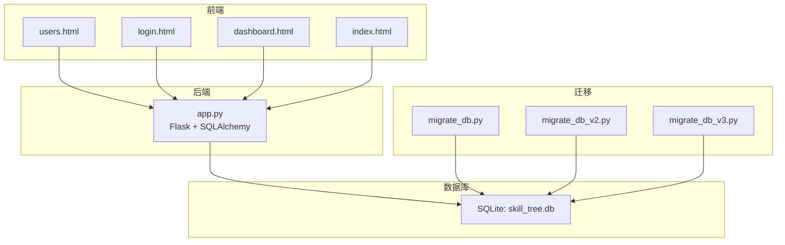
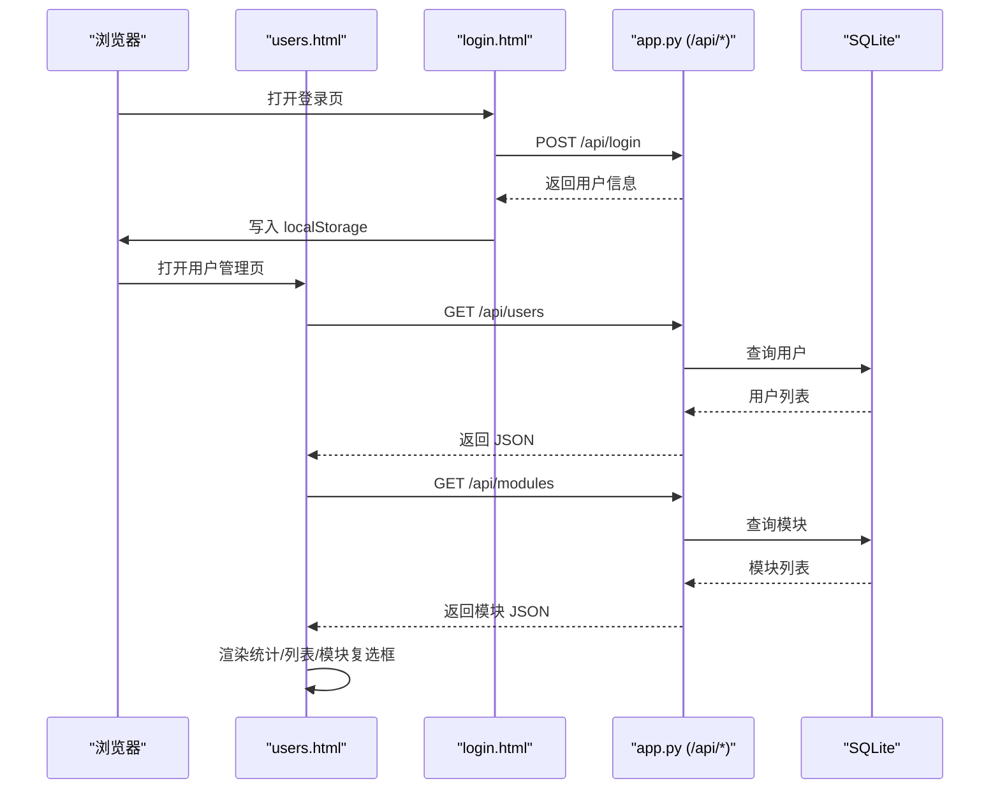
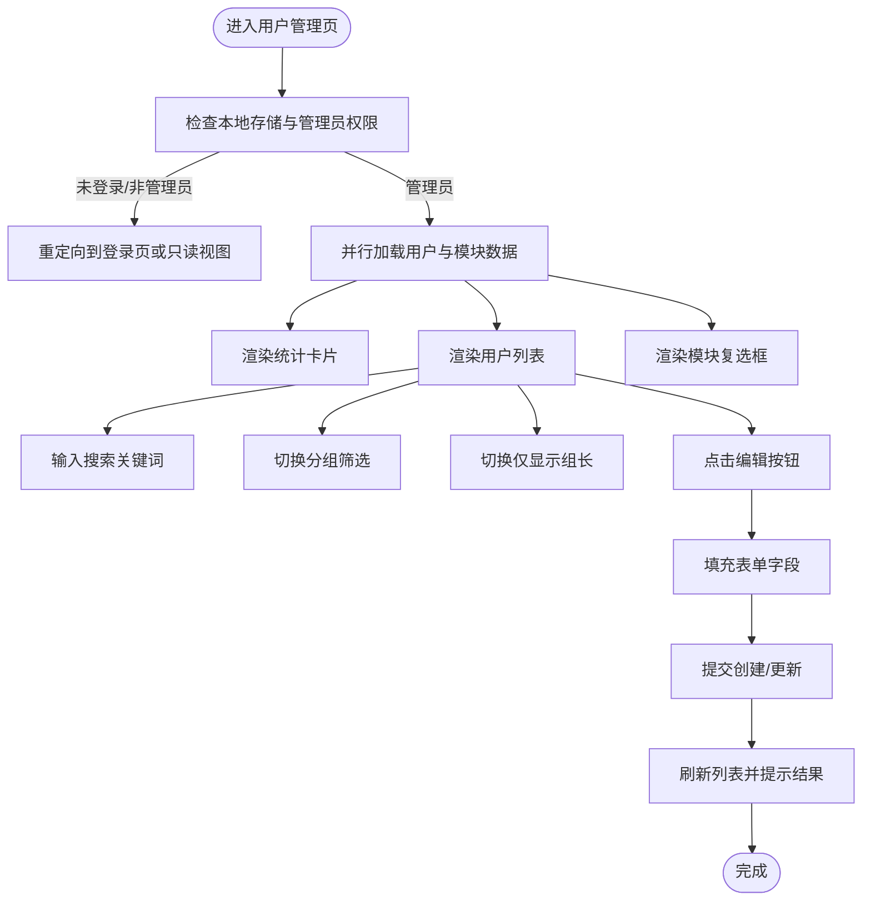
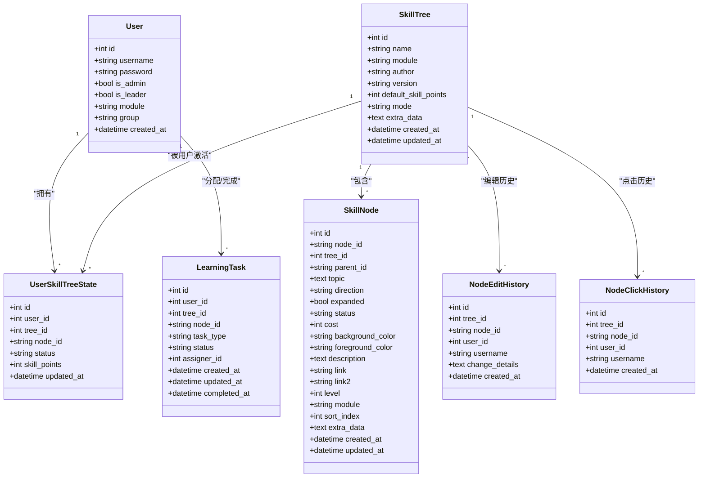
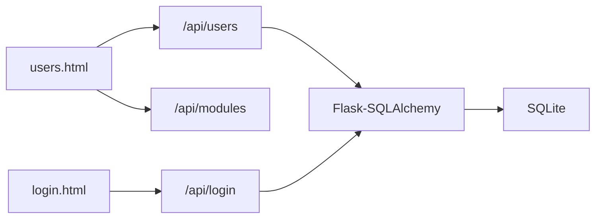

# 用户管理界面组件

<cite>
**本文引用的文件**
- [users.html](file://users.html)
- [app.py](file://app.py)
- [login.html](file://login.html)
- [dashboard.html](file://dashboard.html)
- [index.html](file://index.html)
- [requirements.txt](file://requirements.txt)
- [create_admin.py](file://create_admin.py)
- [migrate_db.py](file://migrate_db.py)
- [migrate_db_v2.py](file://migrate_db_v2.py)
- [migrate_db_v3.py](file://migrate_db_v3.py)
</cite>

## 目录
1. [简介](#简介)
2. [项目结构](#项目结构)
3. [核心组件](#核心组件)
4. [架构总览](#架构总览)
5. [详细组件分析](#详细组件分析)
6. [依赖分析](#依赖分析)
7. [性能考虑](#性能考虑)
8. [故障排查指南](#故障排查指南)
9. [结论](#结论)
10. [附录](#附录)

## 简介
本文件面向技能树管理系统的“用户管理界面组件”，围绕 users.html 展开，系统化阐述用户账户管理与权限控制界面的实现方式，涵盖用户列表展示、用户信息编辑、权限分配管理、用户状态控制等核心功能；同时解释权限控制机制（RBAC 模型）、动态权限检查、安全审计日志等；并提供界面交互设计要点（表格操作、模态框管理、表单验证、批量操作确认）及扩展与安全加固建议。

## 项目结构
- 前端页面
  - users.html：用户管理主界面，包含用户列表、筛选器、侧边栏表单、统计卡片与交互逻辑。
  - login.html：登录页，负责认证与本地存储。
  - dashboard.html：管理看板，包含用户统计、分组进度、任务分配等。
  - index.html：技能树主界面（与用户管理协同）。
- 后端服务
  - app.py：Flask 应用，提供 /api/users、/api/login 等接口，定义 User 模型与权限控制逻辑。
- 数据库与迁移
  - SQLite 数据库存放于 instance/skill_tree.db（由 SQLAlchemy 管理）。
  - migrate_db*.py：数据库结构迁移脚本，逐步添加字段与表。
- 开发工具
  - requirements.txt：依赖清单（Flask、Flask-SQLAlchemy、Flask-CORS）。
  - create_admin.py：快速创建管理员账户的脚本。

**图示来源**
- [users.html](file://users.html)
- [login.html](file://login.html)
- [dashboard.html](file://dashboard.html)
- [index.html](file://index.html)
- [app.py](file://app.py)
- [migrate_db.py](file://migrate_db.py)
- [migrate_db_v2.py](file://migrate_db_v2.py)
- [migrate_db_v3.py](file://migrate_db_v3.py)

**章节来源**
- [users.html](file://users.html)
- [app.py](file://app.py)
- [login.html](file://login.html)
- [dashboard.html](file://dashboard.html)
- [index.html](file://index.html)
- [requirements.txt](file://requirements.txt)
- [create_admin.py](file://create_admin.py)
- [migrate_db.py](file://migrate_db.py)
- [migrate_db_v2.py](file://migrate_db_v2.py)
- [migrate_db_v3.py](file://migrate_db_v3.py)

## 核心组件
- 用户管理界面（users.html）
  - 侧边栏表单：创建/编辑用户，含用户名、密码、所属组、角色（管理员/组长）、模块权限多选、自定义模块输入。
  - 主视图：统计卡片（总成员、管理员、组长）、搜索框、分组筛选、组长筛选、用户卡片网格。
  - 交互逻辑：加载数据、渲染统计、渲染模块复选框、搜索过滤、分组/筛选过滤、渲染用户卡片、编辑填充、提交创建/更新、取消编辑。
- 后端 API（app.py）
  - /api/users：GET 获取用户列表；POST 创建用户；PUT 更新用户。
  - /api/login：用户登录，返回用户信息（含 is_admin、is_leader、module、group）并写入本地存储。
  - 权限控制：非管理员禁止访问用户管理页；技能树访问时按模块交集进行权限判定。
- 数据模型（app.py）
  - User：id、username、password、is_admin、is_leader、module、group、created_at。
  - 其他相关模型：SkillTree、SkillNode、UserSkillTreeState、NodeEditHistory、NodeClickHistory、LearningTask。
- 数据库迁移（migrate_db*.py）
  - 逐步添加 default_skill_points、mode、is_leader 等字段，创建缺失表。

**章节来源**
- [users.html](file://users.html)
- [app.py](file://app.py)
- [login.html](file://login.html)
- [migrate_db.py](file://migrate_db.py)
- [migrate_db_v2.py](file://migrate_db_v2.py)
- [migrate_db_v3.py](file://migrate_db_v3.py)

## 架构总览
用户管理界面采用前后端分离思路：
- 前端 users.html 通过 fetch 调用 /api/users 与 /api/modules（模块数据合并）加载用户与模块信息，渲染统计与列表。
- 登录流程由 login.html 完成，成功后将用户信息写入 localStorage，后续页面基于该信息进行权限控制与导航。
- 后端 app.py 提供 RESTful 接口，使用 SQLAlchemy 操作 SQLite 数据库，实现用户增删改查与权限判定。

**图示来源**
- [users.html](file://users.html)
- [login.html](file://login.html)
- [app.py](file://app.py)

## 详细组件分析

### 用户管理界面（users.html）
- 页面布局
  - 顶部导航：包含“技能树管理”、“管理大盘”、“用户管理”跳转与退出登录。
  - 主体两列：左侧侧边栏（表单区域），右侧主视图（统计、筛选、用户列表）。
- 侧边栏表单
  - 字段：用户名、密码（留空表示不修改）、所属组（A/B/C/D/Office）、角色（管理员/组长）、模块权限多选、自定义模块输入+按钮。
  - 提交：区分创建与更新（根据 editingUserId 判断），PUT 或 POST 到 /api/users/{id} 或 /api/users。
- 主视图
  - 统计卡片：总成员、管理员数量、组长数量。
  - 过滤区：搜索框（按用户名模糊匹配）、分组筛选（全部/A/B/C/D/Office）、组长筛选（仅显示组长）。
  - 用户列表：卡片式展示，包含用户名、组别、ID、角色徽章、模块标签、编辑按钮。
- 交互逻辑
  - 认证拦截：若未登录或非管理员，重定向到登录页或只读视图。
  - 加载数据：Promise.all 并行请求 /api/users 与 /api/modules，合并模块集合，渲染统计、列表与模块复选框。
  - 搜索与筛选：实时过滤，支持用户名包含匹配、组别匹配、仅显示组长。
  - 编辑流程：点击“编辑账号信息”填充表单，勾选模块，提交后刷新列表。
  - 提交流程：表单校验（用户名必填），构造 payload（含 is_admin、is_leader、module、group），调用 API，提示结果并重置表单。

**图示来源**
- [users.html](file://users.html)

**章节来源**
- [users.html](file://users.html)

### 后端 API 与权限控制（app.py）
- 用户管理 API
  - GET /api/users：返回用户列表（id、username、is_admin、is_leader、module、group、created_at）。
  - POST /api/users：创建用户（校验用户名唯一性，支持设置 is_admin、is_leader、module、group）。
  - PUT /api/users/{id}：更新用户（用户名唯一性校验、可更新字段包括用户名、密码、角色、模块、组别）。
- 登录与权限
  - POST /api/login：简单明文密码校验（开发环境），返回用户信息（含 is_admin、is_leader、module、group）。
  - 用户管理页前端：读取 localStorage 中用户信息，非管理员禁止访问。
- 权限控制机制
  - RBAC 模型：用户具备角色（管理员/组长）与模块（module）集合，技能树访问按模块交集判定。
  - 动态权限检查：在 /api/trees 列表中，非管理员仅能看到与自身模块交集的技能树。
- 数据模型
  - User：包含 id、username、password、is_admin、is_leader、module、group、created_at。
  - 其他模型：SkillTree、SkillNode、UserSkillTreeState、NodeEditHistory、NodeClickHistory、LearningTask。

**图示来源**
- [app.py](file://app.py)

**章节来源**
- [app.py](file://app.py)

### 登录与导航（login.html、dashboard.html、index.html）
- 登录页（login.html）
  - 输入用户名/密码，调用 /api/login，成功后将用户信息写入 localStorage，并根据 is_admin 决定跳转首页或只读视图。
- 管理看板（dashboard.html）
  - 包含用户统计、分组进度、任务分配等，提供“用户管理”跳转入口。
- 技能树主界面（index.html）
  - 与用户管理协同，展示技能树与用户状态。

**章节来源**
- [login.html](file://login.html)
- [dashboard.html](file://dashboard.html)
- [index.html](file://index.html)

### 数据库迁移与初始化（migrate_db*.py、create_admin.py）
- 迁移脚本
  - migrate_db.py：添加 default_skill_points 字段并创建缺失表。
  - migrate_db_v2.py：为 skill_trees 添加 mode 字段。
  - migrate_db_v3.py：为 users 添加 is_leader 字段并创建缺失表。
- 初始化管理员
  - create_admin.py：在应用上下文中创建管理员用户（若不存在），便于首次部署使用。

**章节来源**
- [migrate_db.py](file://migrate_db.py)
- [migrate_db_v2.py](file://migrate_db_v2.py)
- [migrate_db_v3.py](file://migrate_db_v3.py)
- [create_admin.py](file://create_admin.py)

## 依赖分析
- 前端依赖
  - users.html 使用 fetch 发起 /api/users 与 /api/modules 请求，Promise.all 并行加载，减少等待时间。
  - localStorage 用于存储当前用户信息，实现前端权限控制与导航。
- 后端依赖
  - Flask、Flask-SQLAlchemy、Flask-CORS：提供 Web 服务、ORM 与跨域支持。
  - SQLite：轻量数据库，适合小型团队或演示场景。
- 迁移依赖
  - migrate_db*.py 依赖 SQLAlchemy Inspector 与 SQL 语句，确保字段与表结构一致。

**图示来源**
- [users.html](file://users.html)
- [login.html](file://login.html)
- [app.py](file://app.py)
- [requirements.txt](file://requirements.txt)

**章节来源**
- [users.html](file://users.html)
- [login.html](file://login.html)
- [app.py](file://app.py)
- [requirements.txt](file://requirements.txt)

## 性能考虑
- 前端
  - 并行加载：/api/users 与 /api/modules 使用 Promise.all，降低首屏等待时间。
  - 本地缓存：localStorage 存储用户信息，避免重复登录与权限判断开销。
  - 虚拟滚动/分页：用户规模扩大后可考虑分页或虚拟滚动以提升列表渲染性能。
- 后端
  - 查询优化：用户列表与模块列表均为小规模数据，无需复杂索引；若用户量增长，可在 username、module 上建立索引。
  - 批量操作：若引入批量用户管理，建议后端提供批量接口并配合事务提交。
- 数据库
  - SQLite 适合开发与小规模生产，若并发较高，建议迁移到 PostgreSQL/MySQL 并启用连接池与读写分离。

## 故障排查指南
- 登录失败
  - 检查 /api/login 返回的错误信息（用户名/密码/状态码），确认用户名存在且密码匹配。
  - 确认 localStorage 中是否正确写入用户信息。
- 无法访问用户管理页
  - 检查 localStorage 中 is_admin 字段是否为真；否则会被重定向到只读视图。
- 用户列表为空
  - 确认 /api/users 返回正常；检查数据库中是否存在用户记录。
- 模块权限未生效
  - 确认 /api/modules 返回模块列表并与用户 module 字段一致；技能树访问时按模块交集判定。
- 数据库迁移问题
  - 若迁移失败，参考 migrate_db*.py 输出的提示，必要时删除数据库文件后重启服务自动重建。

**章节来源**
- [login.html](file://login.html)
- [users.html](file://users.html)
- [app.py](file://app.py)
- [migrate_db.py](file://migrate_db.py)
- [migrate_db_v2.py](file://migrate_db_v2.py)
- [migrate_db_v3.py](file://migrate_db_v3.py)

## 结论
users.html 实现了完整的用户管理界面，结合 app.py 的 RBAC 权限控制与模块交集校验，提供了直观的用户列表、灵活的筛选与编辑能力。通过 localStorage 实现前端权限控制，配合后端 API 的统一鉴权，形成从前端到后端的完整安全闭环。建议在生产环境中强化密码策略、引入 JWT/SSE 安全审计、优化数据库索引与并发处理，并考虑引入更强大的数据库与缓存层以支撑更大规模的用户与数据。

## 附录
- 代码示例路径（不展示具体代码内容）
  - 用户数据获取与展示：[users.html](file://users.html)
  - 权限更新处理（创建/更新用户）：[users.html](file://users.html)，[app.py](file://app.py)
  - 状态变更逻辑（登录与权限控制）：[login.html](file://login.html)，[users.html](file://users.html)
  - 搜索过滤实现：[users.html](file://users.html)
  - 权限控制与模块交集判定：[app.py](file://app.py)
- 扩展与安全加固建议
  - 密码安全：使用强哈希算法（如 bcrypt）存储密码，登录时进行安全校验。
  - 会话与令牌：引入短期 JWT，结合刷新令牌与安全头（SameSite、HttpOnly、Secure）。
  - 审计日志：记录用户登录、权限变更、模块分配等关键事件，便于追踪与合规。
  - 权限细化：将模块权限扩展为细粒度资源权限（如 CRUD 权限），并支持权限继承与动态授权。
  - 批量管理：提供批量导入/导出、批量角色/模块分配、批量状态变更等接口与前端交互。
  - 数据库优化：为高频查询字段建立索引，启用 WAL 模式，定期备份与监控。
  - 前端健壮性：增加表单校验与防抖、错误重试、离线提示与加载骨架屏。