# 管理员界面组件

<cite>
**本文档引用的文件**
- [index.html](file://index.html)
- [app.py](file://app.py)
- [login.html](file://login.html)
- [users.html](file://users.html)
- [dashboard.html](file://dashboard.html)
</cite>

## 目录
1. [简介](#简介)
2. [项目结构](#项目结构)
3. [核心组件](#核心组件)
4. [架构概览](#架构概览)
5. [详细组件分析](#详细组件分析)
6. [依赖关系分析](#依赖关系分析)
7. [性能考虑](#性能考虑)
8. [故障排除指南](#故障排除指南)
9. [结论](#结论)

## 简介

技能树管理系统管理员界面是一个基于Web的可视化编辑工具，专为技能树的创建、编辑和管理而设计。该系统采用前后端分离架构，前端使用HTML5、CSS3和JavaScript构建交互式界面，后端基于Flask框架提供RESTful API服务。

系统的核心功能包括：
- 技能树的创建、编辑、删除和版本管理
- 节点的添加、修改、删除和层级调整
- 可视化的jsMind思维导图编辑器
- 激活模式切换（树状/线性）
- 颜色选择器和主题定制
- 批量操作功能（框选、批量删除）
- 全局历史记录和统计分析

## 项目结构

该项目采用模块化设计，主要包含以下核心文件：

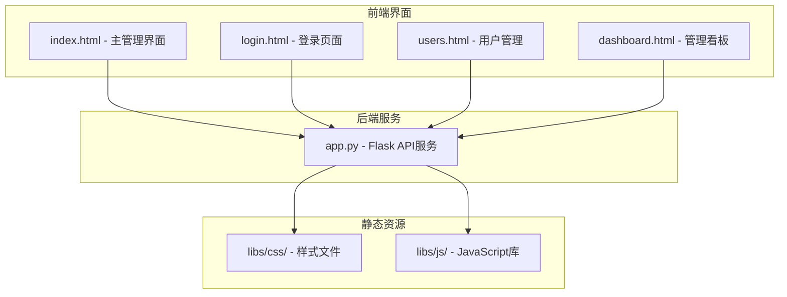

**图表来源**
- [index.html:1-50](file://index.html#L1-L50)
- [app.py:1-30](file://app.py#L1-L30)

**章节来源**
- [index.html:1-100](file://index.html#L1-L100)
- [app.py:1-50](file://app.py#L1-L50)

## 核心组件

### 1. 管理员界面布局

管理员界面采用响应式布局设计，主要分为三个核心区域：

#### 左侧边栏 - 技能树管理面板
- **技能树列表**：显示所有已保存的技能树，支持搜索和筛选
- **技能树控制**：创建、保存、刷新、删除技能树
- **模块管理**：技能树所属模块的分配和管理
- **高级功能**：外框/联系线管理、全局历史查看

#### 右侧主内容区域 - jsMind可视化编辑器
- **工具栏**：节点操作按钮组（添加子节点、添加兄弟节点、编辑节点、删除节点）
- **jsMind容器**：交互式思维导图编辑区域
- **节点编辑器**：顶部横向配置面板，用于节点属性编辑

#### 底部工具栏 - 模式切换
- **指针模式**：默认选择模式，支持节点选择和编辑
- **抓手模式**：平移画布模式，支持拖拽浏览大型技能树

**章节来源**
- [index.html:854-935](file://index.html#L854-L935)
- [index.html:938-1055](file://index.html#L938-L1055)

### 2. jsMind集成组件

系统集成了jsMind思维导图库，提供了丰富的可视化编辑功能：

#### jsMind配置选项
- **容器设置**：指定渲染容器和主题样式
- **视图配置**：画布引擎、边距、线条样式、拖拽功能
- **布局参数**：水平间距、垂直间距、节点间距
- **编辑功能**：启用节点编辑、拖拽节点

#### 事件监听机制
- **节点选择事件**：监听节点选择变化，自动显示节点编辑器
- **根节点拖拽**：支持根节点拖拽移动整个技能树
- **右键菜单**：提供上下文相关的操作选项

**章节来源**
- [index.html:1166-1244](file://index.html#L1166-L1244)
- [index.html:1198-1211](file://index.html#L1198-L1211)

### 3. 节点编辑器功能

节点编辑器是一个顶部横向配置面板，提供完整的节点属性编辑功能：

#### 编辑器字段
- **基础属性**：节点名称、等级、模块
- **链接管理**：两个外部链接字段
- **描述编辑**：富文本编辑器，支持多种格式化选项
- **颜色选择**：独立的背景色和前景色选择器

#### 格式化工具
- **文本格式**：加粗、斜体、颜色、字号
- **缩进控制**：文本缩进设置
- **链接插入**：快速插入链接格式

**章节来源**
- [index.html:938-1055](file://index.html#L938-L1055)
- [index.html:1903-1965](file://index.html#L1903-L1965)

### 4. 批量操作功能

系统提供了多种批量操作能力：

#### 框选（Lasso Selection）
- **鼠标框选**：拖拽鼠标创建选择区域
- **碰撞检测**：自动检测框选范围内的节点
- **批量操作**：支持对外框样式应用到选中节点

#### 右键菜单
- **分支外框**：一键为选中分支添加各种样式的外框
- **联系线**：建立节点间的连接关系
- **快速编辑**：直接编辑选中节点

**章节来源**
- [index.html:3311-3435](file://index.html#L3311-L3435)
- [index.html:3216-3247](file://index.html#L3216-L3247)

## 架构概览

系统采用前后端分离的三层架构设计：

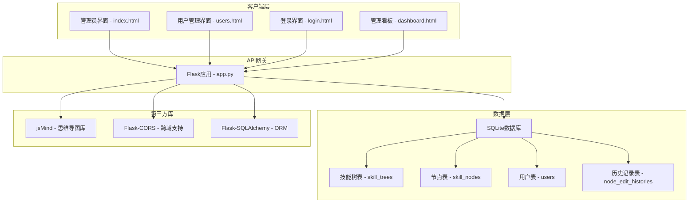

**图表来源**
- [app.py:1-30](file://app.py#L1-L30)
- [index.html:849-851](file://index.html#L849-L851)

### 数据流架构

系统的数据流遵循RESTful API设计原则：

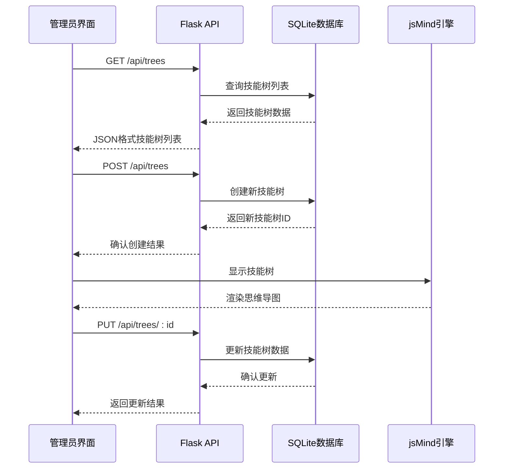

**图表来源**
- [app.py:385-412](file://app.py#L385-L412)
- [app.py:415-440](file://app.py#L415-L440)

**章节来源**
- [app.py:1-80](file://app.py#L1-L80)
- [index.html:1061-1070](file://index.html#L1061-L1070)

## 详细组件分析

### 1. 技能树管理面板

#### 技能树列表组件
技能树列表采用卡片式设计，提供直观的技能树浏览体验：

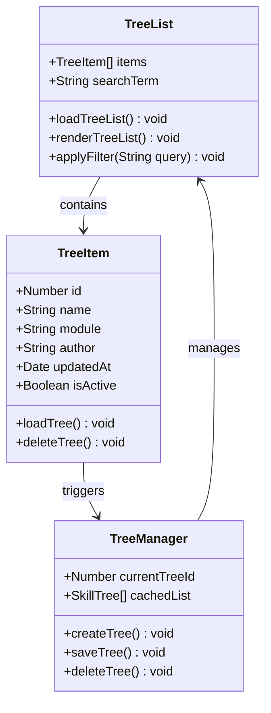

**图表来源**
- [index.html:1576-1588](file://index.html#L1576-L1588)
- [index.html:1590-1713](file://index.html#L1590-L1713)

#### 模块管理功能
系统支持灵活的模块分配机制：

- **模块列表**：动态加载所有可用模块
- **模块选择**：支持技能树和节点级别的模块分配
- **自定义模块**：允许管理员创建新的模块

**章节来源**
- [index.html:2395-2433](file://index.html#L2395-L2433)
- [index.html:2435-2460](file://index.html#L2435-L2460)

### 2. jsMind可视化编辑器

#### jsMind初始化流程
编辑器的初始化过程包含多个关键步骤：

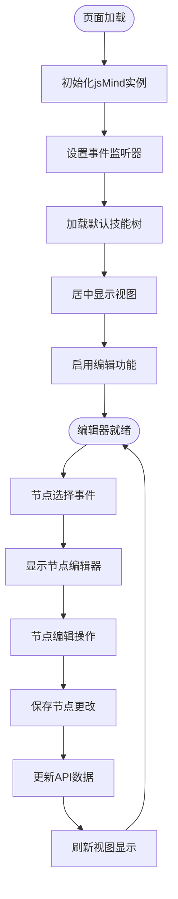

**图表来源**
- [index.html:1166-1244](file://index.html#L1166-L1244)
- [index.html:1198-1211](file://index.html#L1198-L1211)

#### 节点操作功能
系统提供了完整的节点生命周期管理：

| 操作类型 | 方法名 | 功能描述 | 触发条件 |
|---------|--------|----------|----------|
| 添加子节点 | addChildNode() | 在选中节点下添加子节点 | 点击"添加子节点"按钮 |
| 添加兄弟节点 | addBrotherNode() | 在选中节点旁添加兄弟节点 | 点击"添加兄弟节点"按钮 |
| 编辑节点 | editSelectedNode() | 开启节点编辑模式 | 点击"编辑节点"按钮 |
| 删除节点 | deleteSelectedNode() | 删除选中节点（根节点除外） | 点击"删除节点"按钮 |

**章节来源**
- [index.html:1715-1780](file://index.html#L1715-L1780)
- [index.html:1782-1826](file://index.html#L1782-L1826)

### 3. 节点编辑器组件

#### 编辑器状态管理
节点编辑器采用状态驱动的设计模式：

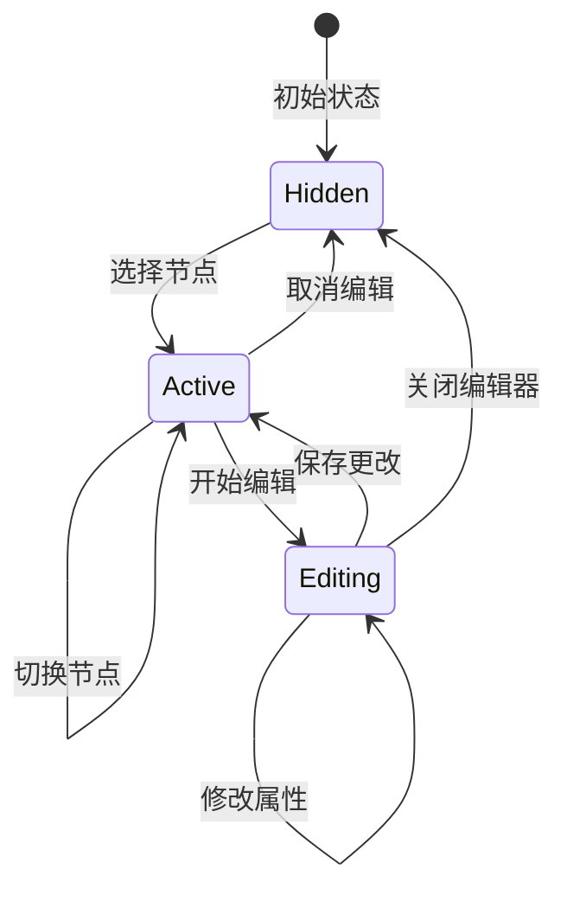

**图表来源**
- [index.html:1782-1826](file://index.html#L1782-L1826)
- [index.html:1828-1901](file://index.html#L1828-L1901)

#### 颜色管理系统
系统实现了双层颜色管理机制：

- **原始颜色**：保存数据库中的原始颜色值
- **显示颜色**：当前在界面中显示的颜色值
- **颜色同步**：确保保存时使用正确的颜色值

**章节来源**
- [index.html:1128-1164](file://index.html#L1128-L1164)
- [index.html:1828-1901](file://index.html#L1828-L1901)

### 4. 批量操作组件

#### 框选选择器
框选功能提供了直观的批量选择体验：

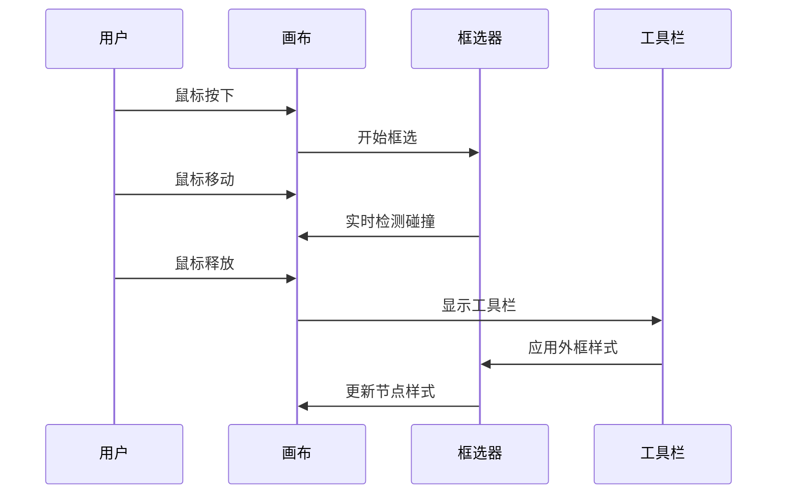

**图表来源**
- [index.html:3316-3435](file://index.html#L3316-L3435)

#### 右键菜单系统
右键菜单提供了快速操作入口：

- **分支外框**：为选中分支添加各种样式的外框
- **联系线**：建立节点间的连接关系
- **快速编辑**：直接编辑选中节点

**章节来源**
- [index.html:3216-3247](file://index.html#L3216-L3247)
- [index.html:3261-3310](file://index.html#L3261-L3310)

### 5. 全局历史记录系统

#### 历史数据管理
系统提供了全面的历史记录追踪功能：

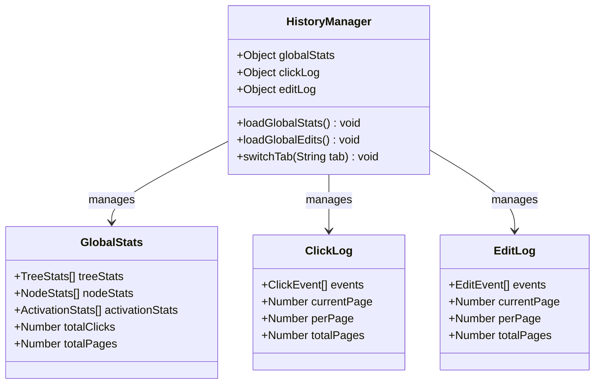

**图表来源**
- [index.html:2463-2700](file://index.html#L2463-L2700)
- [index.html:2516-2699](file://index.html#L2516-L2699)

**章节来源**
- [index.html:2463-2700](file://index.html#L2463-L2700)

## 依赖关系分析

### 1. 前端依赖关系

系统前端依赖关系清晰明确：

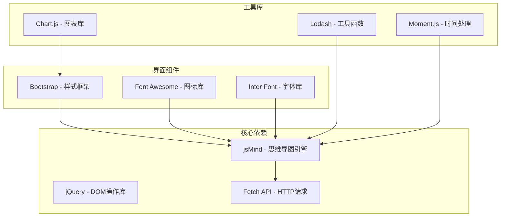

**图表来源**
- [index.html:849-851](file://index.html#L849-L851)
- [index.html:8-86](file://index.html#L8-L86)

### 2. 后端依赖关系

后端服务依赖关系简洁高效：

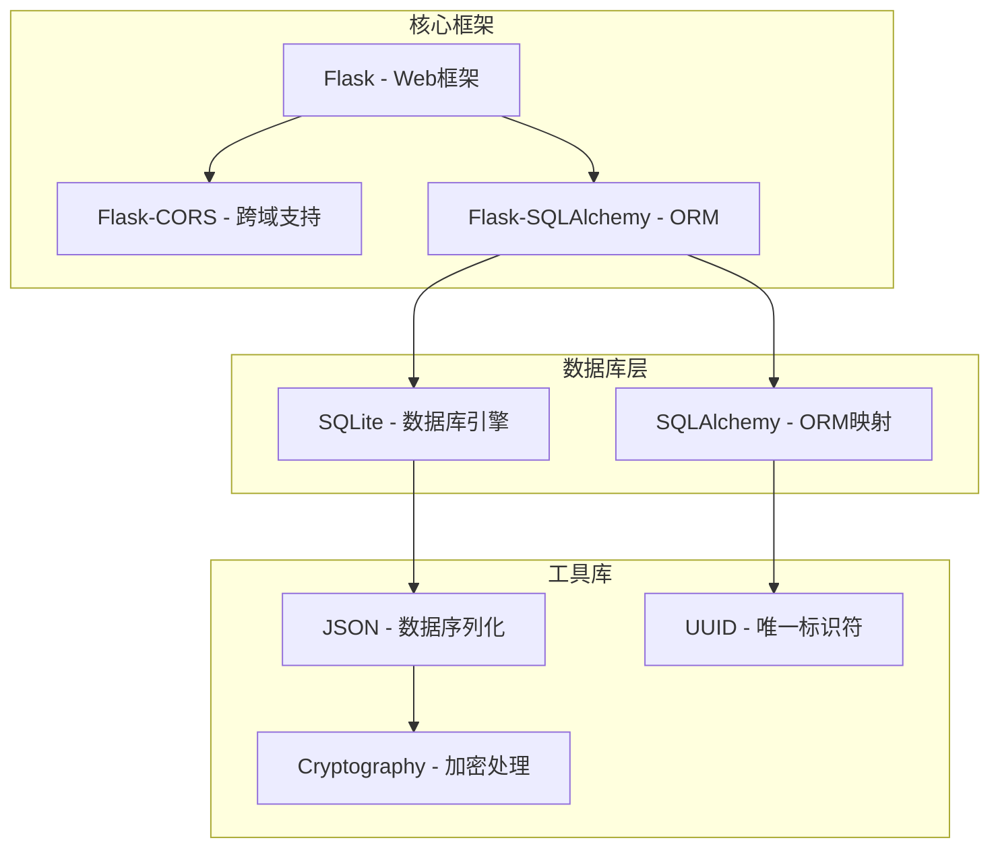

**图表来源**
- [app.py:1-15](file://app.py#L1-L15)

**章节来源**
- [app.py:1-30](file://app.py#L1-L30)

### 3. 数据模型关系

系统采用标准化的关系型数据模型：

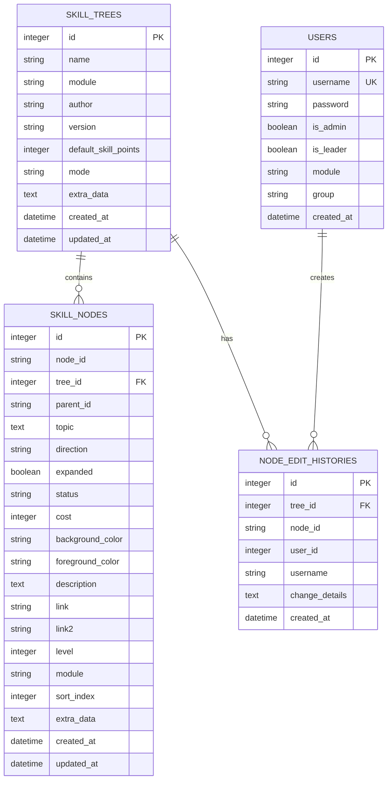

**图表来源**
- [app.py:42-122](file://app.py#L42-L122)

**章节来源**
- [app.py:42-122](file://app.py#L42-L122)

## 性能考虑

### 1. 前端性能优化

系统在前端层面采用了多项性能优化策略：

#### 渲染优化
- **虚拟滚动**：对于大量技能树列表采用虚拟滚动技术
- **懒加载**：技能树内容按需加载，减少初始渲染压力
- **防抖处理**：搜索功能采用防抖机制，避免频繁请求

#### 内存管理
- **事件清理**：及时清理不再使用的事件监听器
- **DOM复用**：重用DOM元素，减少内存分配
- **垃圾回收**：定期清理无用的JavaScript对象

#### 网络优化
- **缓存策略**：合理使用浏览器缓存机制
- **请求合并**：将多个小请求合并为批量请求
- **增量更新**：仅更新发生变化的部分

### 2. 后端性能优化

后端服务在性能方面同样注重优化：

#### 数据库优化
- **索引设计**：为常用查询字段建立适当索引
- **查询优化**：使用高效的SQL查询语句
- **连接池**：使用数据库连接池提高并发性能

#### API优化
- **分页处理**：大数据量采用分页机制
- **缓存机制**：热点数据使用Redis缓存
- **异步处理**：耗时操作采用异步处理

## 故障排除指南

### 1. 常见问题诊断

#### 登录认证问题
**症状**：用户无法登录或登录后跳转错误
**解决方案**：
1. 检查localStorage中是否存在currentUser数据
2. 验证用户权限标志位（is_admin）
3. 确认后端API /api/login正常运行

#### 技能树加载失败
**症状**：技能树列表为空或加载超时
**解决方案**：
1. 检查后端数据库连接状态
2. 验证SQLite数据库文件完整性
3. 确认API路由 /api/trees 正常响应

#### jsMind渲染异常
**症状**：思维导图无法正常显示或交互失效
**解决方案**：
1. 检查jsMind库文件加载状态
2. 验证DOM容器元素存在性
3. 确认事件监听器正确绑定

### 2. 调试技巧

#### 前端调试
- 使用浏览器开发者工具监控网络请求
- 检查JavaScript控制台错误信息
- 使用断点调试验证数据流向

#### 后端调试
- 启用Flask调试模式
- 使用日志记录关键操作
- 验证数据库事务完整性

**章节来源**
- [login.html:151-220](file://login.html#L151-L220)
- [index.html:1070-1100](file://index.html#L1070-L1100)

### 3. 错误处理机制

系统实现了完善的错误处理机制：

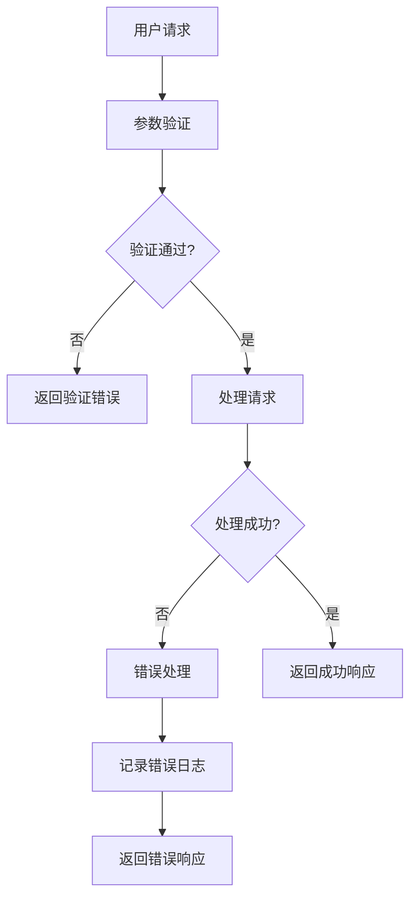

**图表来源**
- [app.py:356-382](file://app.py#L356-L382)
- [index.html:1439-1498](file://index.html#L1439-L1498)

## 结论

技能树管理系统管理员界面组件是一个功能完整、架构清晰的可视化编辑工具。系统的主要优势包括：

### 技术优势
- **模块化设计**：前后端分离，职责明确
- **可视化编辑**：基于jsMind的直观思维导图编辑
- **批量操作**：支持框选、批量删除等高效操作
- **历史追踪**：完整的操作历史记录和统计分析

### 架构特点
- **响应式设计**：适配不同屏幕尺寸
- **权限控制**：严格的管理员权限验证
- **数据持久化**：基于SQLite的可靠数据存储
- **扩展性强**：模块化设计便于功能扩展

### 改进建议
1. **性能优化**：考虑引入虚拟滚动和缓存机制
2. **用户体验**：增加撤销/重做功能
3. **协作功能**：支持多人实时协作编辑
4. **移动端适配**：优化移动端操作体验

该系统为技能树的创建、管理和维护提供了完整的解决方案，具有良好的可扩展性和维护性，适合在企业环境中部署使用。