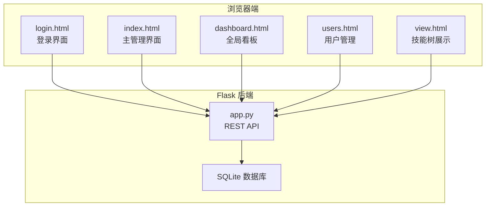
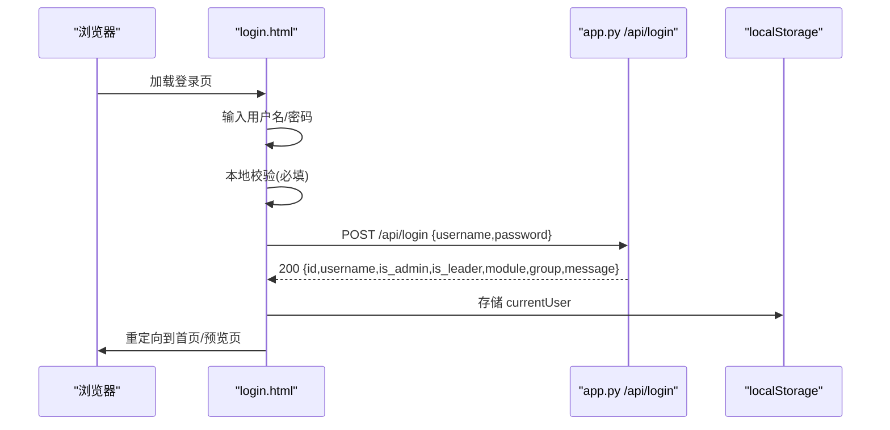
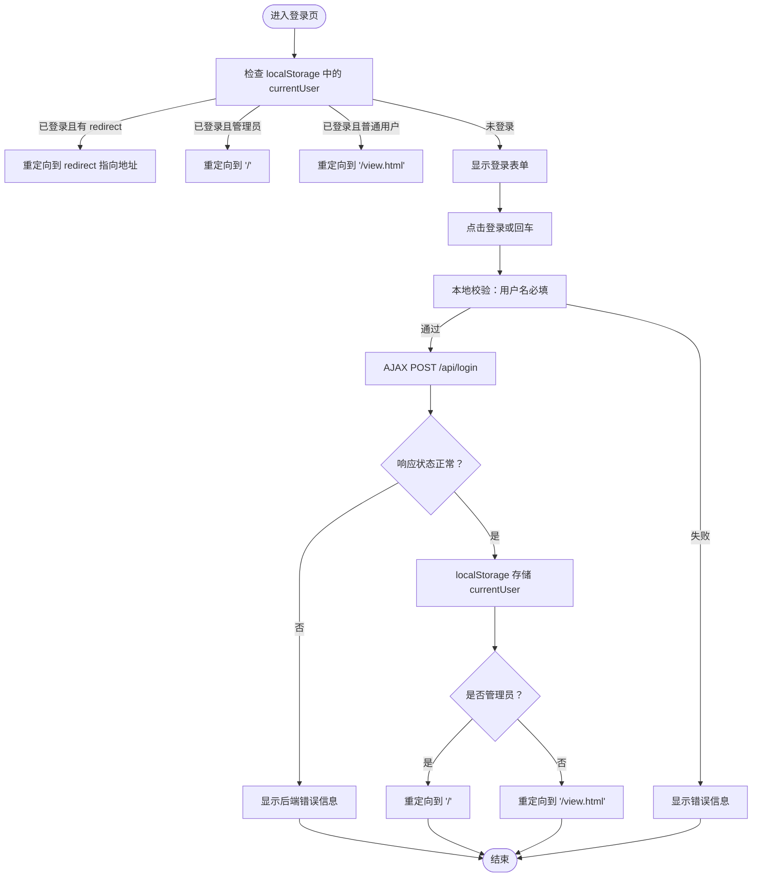
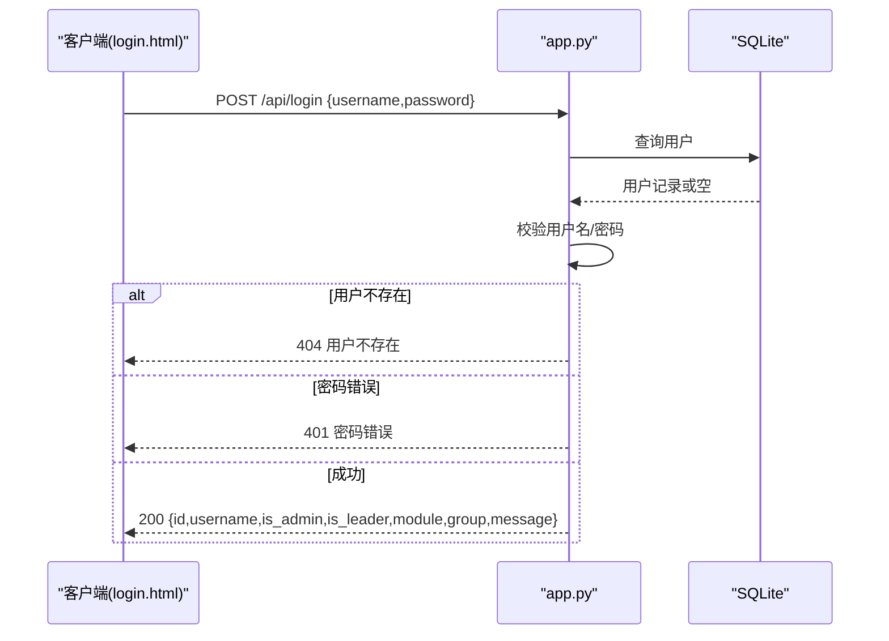
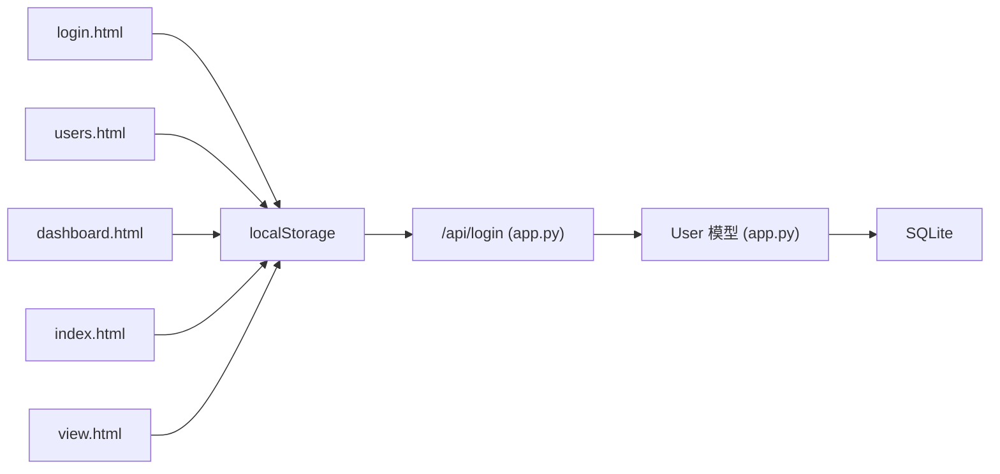

# 认证界面组件

<cite>
**本文引用的文件**
- [login.html](file://login.html)
- [app.py](file://app.py)
- [create_admin.py](file://create_admin.py)
- [users.html](file://users.html)
- [dashboard.html](file://dashboard.html)
- [index.html](file://index.html)
- [view.html](file://view.html)
</cite>

## 目录
1. [简介](#简介)
2. [项目结构](#项目结构)
3. [核心组件](#核心组件)
4. [架构总览](#架构总览)
5. [详细组件分析](#详细组件分析)
6. [依赖分析](#依赖分析)
7. [性能考虑](#性能考虑)
8. [故障排查指南](#故障排查指南)
9. [结论](#结论)
10. [附录](#附录)

## 简介
本文件面向技能树管理系统的认证界面组件，聚焦于登录页面 login.html 的实现与前后端交互协议。文档将从表单设计、输入验证、错误处理、会话与权限控制、与后端 API 的交互协议、安全与最佳实践等方面进行系统化说明，并提供可视化图示帮助理解。

## 项目结构
本项目采用前后端分离的静态页面 + Flask 后端的架构：
- 前端页面：login.html、index.html、dashboard.html、users.html、view.html 等
- 后端服务：app.py 提供 REST API，包含用户认证、技能树管理、用户管理等功能
- 数据库：SQLite（通过 SQLAlchemy）存储用户、技能树、节点、用户状态等

**图表来源**
- [login.html](file://login.html)
- [index.html](file://index.html)
- [dashboard.html](file://dashboard.html)
- [users.html](file://users.html)
- [view.html](file://view.html)
- [app.py](file://app.py)

**章节来源**
- [login.html](file://login.html)
- [app.py](file://app.py)

## 核心组件
- 登录界面 login.html：负责用户凭据收集、本地表单校验、AJAX 认证请求、错误提示与重定向
- 后端 API app.py：提供 /api/login 认证接口，返回用户角色与权限信息
- 用户管理 users.html：基于 localStorage 中的 currentUser 实现权限控制与导航
- 全局看板 dashboard.html：展示用户信息与退出登录按钮，体现认证状态
- 主管理界面 index.html：展示技能树列表与工具栏，体现认证状态
- 技能树展示 view.html：展示技能树视图，体现认证状态

**章节来源**
- [login.html](file://login.html)
- [app.py](file://app.py)
- [users.html](file://users.html)
- [dashboard.html](file://dashboard.html)
- [index.html](file://index.html)
- [view.html](file://view.html)

## 架构总览
登录认证的关键流程如下：
- 浏览器加载 login.html
- 用户输入用户名/密码，前端进行本地校验
- 前端发起 AJAX 请求到 /api/login
- 后端校验用户名与密码，返回用户信息
- 前端将用户信息存入 localStorage 并根据角色重定向
- 其他页面通过读取 localStorage 判断认证状态并执行相应逻辑

**图表来源**
- [login.html](file://login.html)
- [app.py](file://app.py)

**章节来源**
- [login.html](file://login.html)
- [app.py](file://app.py)

## 详细组件分析

### 登录界面 login.html
- 表单字段设计
  - 用户名：文本输入，英文提示“Username”
  - 密码：密码输入，英文提示“Password”
- 输入验证规则
  - 用户名必填；密码必填
  - 支持回车键触发登录
- 错误处理机制
  - 网络错误统一显示“网络错误：...”
  - 服务器返回错误时显示后端错误消息
- 会话与权限控制
  - 登录成功后将用户信息写入 localStorage
  - 根据 is_admin 与 redirect 参数决定重定向目标
- 与后端 API 的交互
  - 发送 POST /api/login，JSON 负载包含 username 与 password
  - 成功后解析响应体，构造 currentUser 对象并持久化

**图表来源**
- [login.html](file://login.html)

**章节来源**
- [login.html](file://login.html)

### 后端 API app.py 的认证接口
- 接口路径：/api/login
- 方法：POST
- 请求体：JSON，包含 username 与 password
- 响应：
  - 成功：200，返回用户信息（id、username、is_admin、is_leader、module、group、message）
  - 失败：400/401/404，返回错误信息
- 权限与模块控制：
  - 返回 is_admin/is_leader 以区分管理员/组长/普通用户
  - 返回 module/group 用于前端权限判断与导航

**图表来源**
- [app.py](file://app.py)

**章节来源**
- [app.py](file://app.py)

### 用户管理 users.html 的认证与权限控制
- 页面加载时读取 localStorage 中的 currentUser
- 若不存在则重定向到登录页并携带 redirect 参数
- 若非管理员则提示无权限并重定向到预览页
- 提供退出登录按钮，清除 localStorage 并重定向到登录页

**章节来源**
- [users.html](file://users.html)

### 全局看板 dashboard.html 的认证与权限控制
- 页面加载时读取 localStorage 中的 currentUser
- 若不存在则重定向到登录页
- 展示用户信息与导航菜单，提供退出登录按钮

**章节来源**
- [dashboard.html](file://dashboard.html)

### 主管理界面 index.html 的认证与权限控制
- 页面加载时读取 localStorage 中的 currentUser
- 若不存在则重定向到登录页
- 展示技能树列表与工具栏，提供退出登录按钮

**章节来源**
- [index.html](file://index.html)

### 技能树展示 view.html 的认证与权限控制
- 页面加载时读取 localStorage 中的 currentUser
- 若不存在则重定向到登录页
- 展示技能树视图，提供退出登录按钮

**章节来源**
- [view.html](file://view.html)

### 管理员账户创建脚本 create_admin.py
- 作用：在数据库中创建默认管理员账户（用户名 admin，密码 admin123）
- 使用场景：首次部署或忘记管理员密码时使用

**章节来源**
- [create_admin.py](file://create_admin.py)

## 依赖分析
- 前端依赖
  - login.html 依赖 localStorage 进行认证状态持久化
  - users.html、dashboard.html、index.html、view.html 依赖 localStorage 进行权限控制
- 后端依赖
  - app.py 依赖 SQLite 数据库存储用户信息
  - /api/login 依赖 User 模型进行用户查询与校验

**图表来源**
- [login.html](file://login.html)
- [users.html](file://users.html)
- [dashboard.html](file://dashboard.html)
- [index.html](file://index.html)
- [view.html](file://view.html)
- [app.py](file://app.py)

**章节来源**
- [login.html](file://login.html)
- [users.html](file://users.html)
- [dashboard.html](file://dashboard.html)
- [index.html](file://index.html)
- [view.html](file://view.html)
- [app.py](file://app.py)

## 性能考虑
- 前端
  - 登录表单仅做基础必填校验，避免不必要的计算开销
  - 使用 localStorage 存储用户信息，减少重复请求
- 后端
  - /api/login 仅进行用户名与密码匹配，逻辑简单，响应迅速
  - 建议在生产环境启用 HTTPS 与更严格的密码策略

[本节为通用建议，无需特定文件引用]

## 故障排查指南
- 登录失败
  - 检查用户名/密码是否正确
  - 查看浏览器控制台网络面板，确认 /api/login 返回状态码与错误信息
- 无法访问受保护页面
  - 确认 localStorage 中是否存在 currentUser
  - 检查用户是否具备相应权限（is_admin/is_leader）
- 退出登录后仍可访问
  - 确认页面在加载时调用了清除 localStorage 的逻辑
  - 检查页面是否缓存了旧版本代码

**章节来源**
- [login.html](file://login.html)
- [users.html](file://users.html)
- [dashboard.html](file://dashboard.html)
- [index.html](file://index.html)
- [view.html](file://view.html)
- [app.py](file://app.py)

## 结论
login.html 作为认证入口，通过简单的表单与 AJAX 请求实现了基本的用户登录与权限控制。结合后端 /api/login 与前端各页面的 localStorage 机制，形成了轻量级的认证体系。建议在生产环境中进一步强化安全措施（如 HTTPS、密码加密、CSRF 防护、会话超时与令牌刷新等），以提升整体安全性与用户体验。

[本节为总结性内容，无需特定文件引用]

## 附录

### 与后端 API 的交互协议
- 认证接口
  - 方法：POST
  - 路径：/api/login
  - 请求体：JSON，包含 username 与 password
  - 成功响应：200，包含 id、username、is_admin、is_leader、module、group、message
  - 失败响应：400/401/404，包含错误信息
- 权限字段
  - is_admin：管理员
  - is_leader：组长
  - module：模块/权限范围
  - group：用户组别

**章节来源**
- [app.py](file://app.py)
- [login.html](file://login.html)

### 安全最佳实践
- 传输层安全
  - 强制使用 HTTPS，防止明文传输
- 凭据安全
  - 后端应使用强哈希算法（如 bcrypt）存储密码，而非明文
  - 前端不应记录或显示密码
- 会话与令牌
  - 建议引入短期 JWT 或会话令牌，支持刷新与过期控制
  - localStorage 不适合长期存放敏感令牌，必要时使用 HttpOnly Cookie
- 前端防护
  - 添加 CSRF Token
  - 限制重试次数与速率
  - 对输入进行最小化与白名单校验

[本节为通用建议，无需特定文件引用]