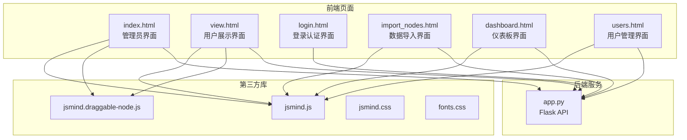
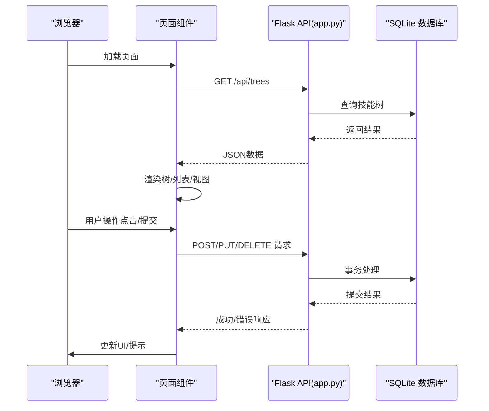
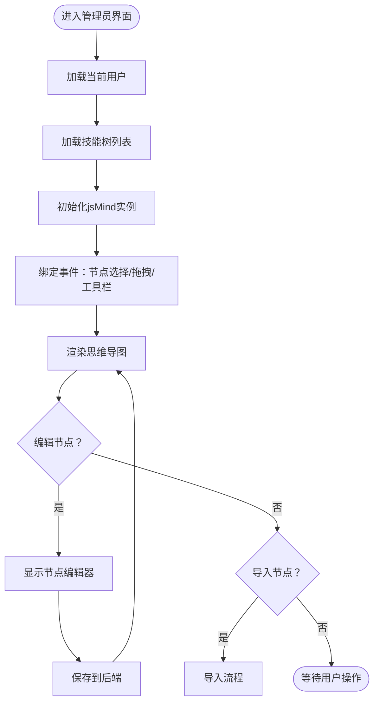
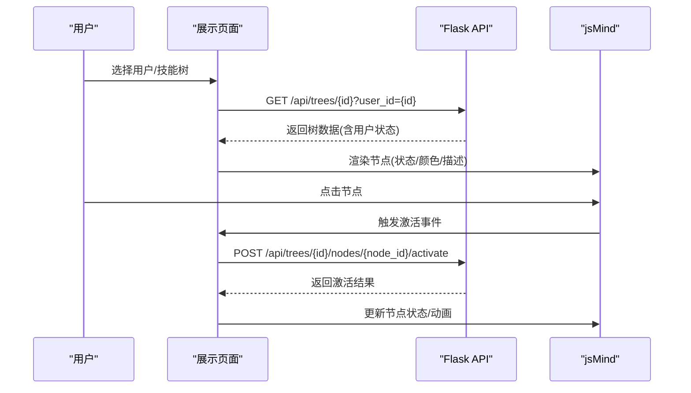
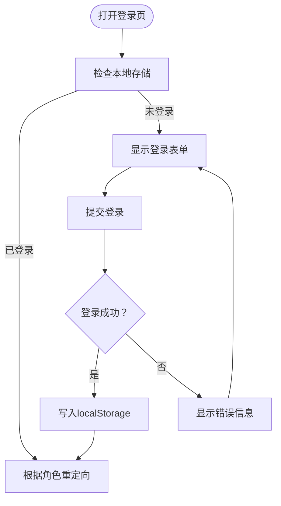
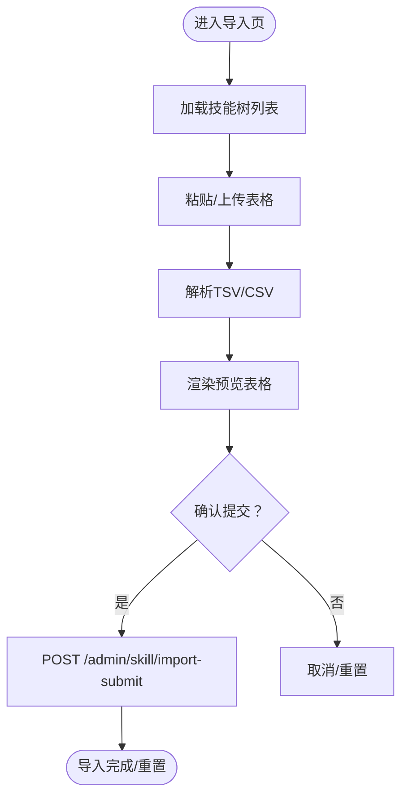
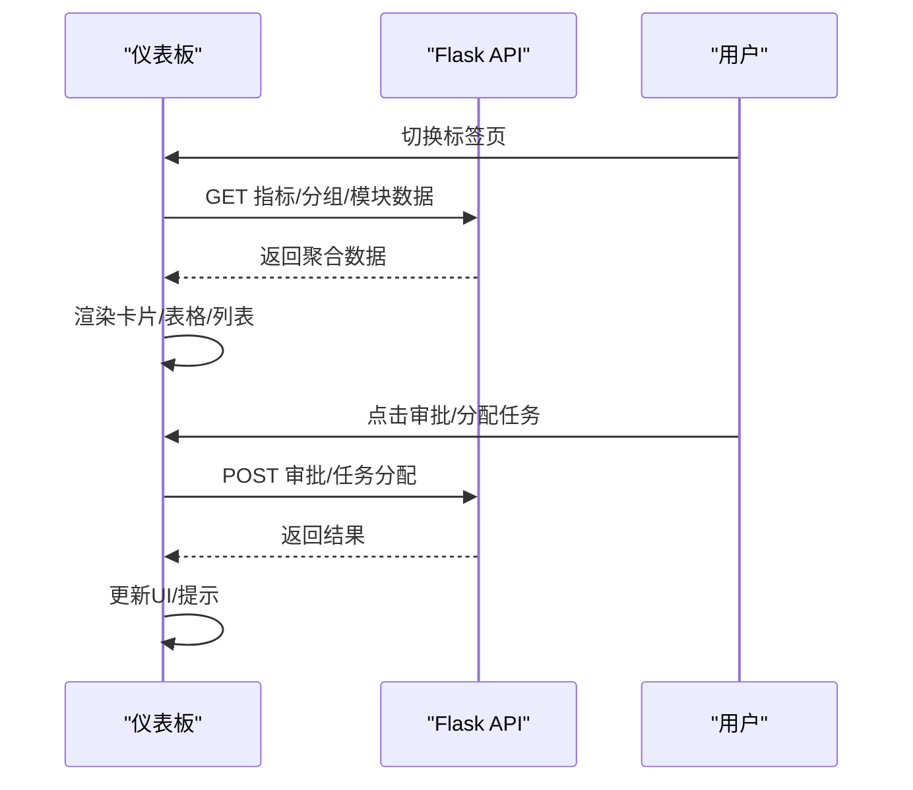
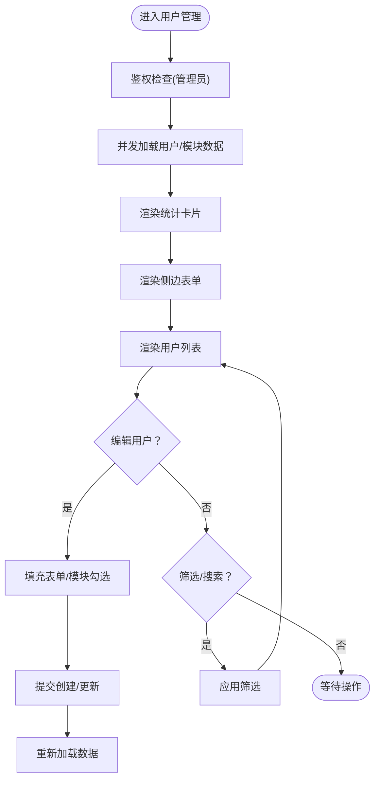
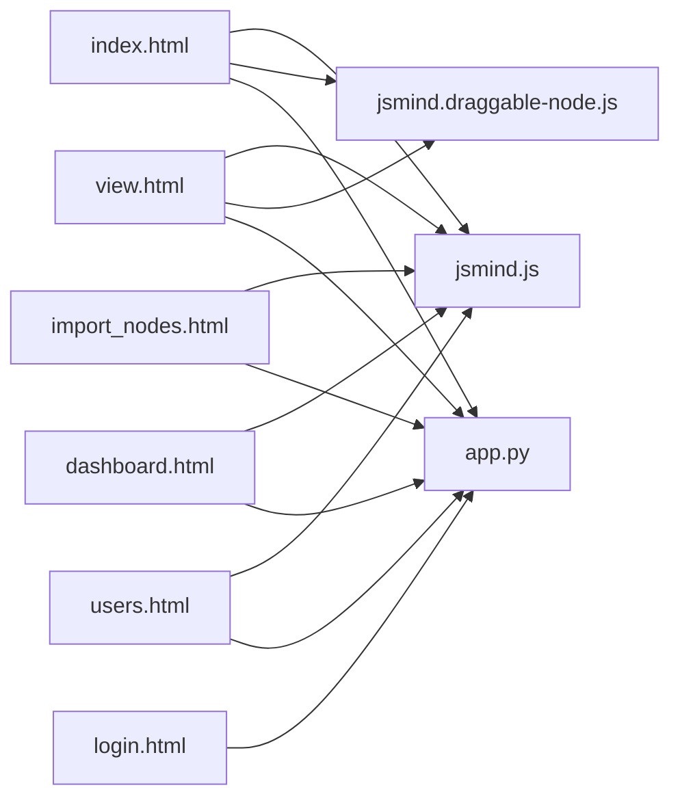

# 页面组件架构

<cite>
**本文档引用的文件**
- [index.html](file://index.html)
- [view.html](file://view.html)
- [login.html](file://login.html)
- [import_nodes.html](file://import_nodes.html)
- [dashboard.html](file://dashboard.html)
- [users.html](file://users.html)
- [app.py](file://app.py)
- [README.md](file://README.md)
- [jsmind.js](file://libs/js/jsmind.js)
- [jsmind.draggable-node.js](file://libs/js/jsmind.draggable-node.js)
- [jsmind.css](file://libs/css/jsmind.css)
- [fonts.css](file://libs/css/fonts.css)
</cite>

## 目录
1. [简介](#简介)
2. [项目结构](#项目结构)
3. [核心组件](#核心组件)
4. [架构总览](#架构总览)
5. [详细组件分析](#详细组件分析)
6. [依赖分析](#依赖分析)
7. [性能考虑](#性能考虑)
8. [故障排查指南](#故障排查指南)
9. [结论](#结论)
10. [附录](#附录)

## 简介
本设计文档面向“技能树管理系统”的页面组件架构，围绕六大前端页面（管理员界面、用户展示界面、登录认证界面、数据导入界面、仪表板界面、用户管理界面）进行系统化梳理，重点阐述：
- 页面功能定位与职责划分
- 布局设计（响应式、网格系统、组件层次）
- 组件间通信机制（数据传递、事件触发、状态同步）
- 生命周期管理（初始化、渲染、销毁）
- 组件复用策略（通用组件抽象与封装）
- 性能优化方案（懒加载、缓存、资源压缩）
- 前端开发规范与最佳实践

## 项目结构
项目采用前后端分离的静态页面+Flask后端的轻量架构：
- 前端页面：index.html、view.html、login.html、import_nodes.html、dashboard.html、users.html
- 前端依赖：jsMind（思维导图引擎）、Tailwind（可选）、字体与样式资源
- 后端：Flask + SQLAlchemy，提供REST API接口
- 数据库：SQLite（skill_tree.db）

**图示来源**
- [index.html](file://index.html)
- [view.html](file://view.html)
- [login.html](file://login.html)
- [import_nodes.html](file://import_nodes.html)
- [dashboard.html](file://dashboard.html)
- [users.html](file://users.html)
- [app.py](file://app.py)
- [jsmind.js](file://libs/js/jsmind.js)
- [jsmind.draggable-node.js](file://libs/js/jsmind.draggable-node.js)
- [jsmind.css](file://libs/css/jsmind.css)
- [fonts.css](file://libs/css/fonts.css)

**章节来源**
- [README.md](file://README.md)
- [app.py](file://app.py)

## 核心组件
- 管理员界面（index.html）
  - 职责：技能树的创建、编辑、保存；节点增删改；颜色主题配置；历史记录查看；拖拽节点（依赖jsMind插件）
  - 关键交互：树列表、工具栏、节点编辑器、右键菜单、手型/选择模式切换
- 用户展示界面（view.html）
  - 职责：用户选择、只读展示、节点激活（点亮）、技能点统计、节点详情面板
  - 关键交互：用户下拉、技能树下拉、节点点击、详情面板、工具栏控制
- 登录认证界面（login.html）
  - 职责：用户身份验证、本地状态存储、重定向逻辑
  - 关键交互：用户名/密码输入、登录按钮、错误提示、回车登录
- 数据导入界面（import_nodes.html）
  - 职责：Excel/CSV粘贴导入、解析预览、确认入库
  - 关键交互：树选择、粘贴区、解析按钮、预览表格、提交按钮、模板下载
- 仪表板界面（dashboard.html）
  - 职责：全局/模块/小组进度看板、排行榜、审核中心、任务分配
  - 关键交互：指标卡片、标签页切换、分组卡片、用户卡片、任务表单
- 用户管理界面（users.html）
  - 职责：用户增删改、角色与模块分配、筛选与搜索
  - 关键交互：侧边表单、用户列表、统计卡片、过滤器、编辑/取消

**章节来源**
- [index.html](file://index.html)
- [view.html](file://view.html)
- [login.html](file://login.html)
- [import_nodes.html](file://import_nodes.html)
- [dashboard.html](file://dashboard.html)
- [users.html](file://users.html)

## 架构总览
系统采用“静态页面 + 前端状态 + 后端API”的三层架构：
- 前端页面负责UI与交互，使用jsMind渲染思维导图
- 前端通过fetch调用后端API（/api/*、/admin/*）进行数据读写
- 后端提供技能树、节点、用户、任务、导入等接口，使用SQLite持久化

**图示来源**
- [app.py](file://app.py)
- [index.html](file://index.html)
- [view.html](file://view.html)
- [users.html](file://users.html)
- [import_nodes.html](file://import_nodes.html)
- [dashboard.html](file://dashboard.html)

## 详细组件分析

### 管理员界面（index.html）
- 布局与层次
  - 两栏布局：左侧侧栏（树列表/搜索/控制）、右侧主内容（jsMind画布）
  - 工具栏：新增/删除/保存/撤销/重置/模式切换
  - 节点编辑器：节点属性编辑（名称、颜色、描述、链接、等级、模块、排序）
  - 历史面板：变更记录查看
- 交互机制
  - 选择节点 -> 显示编辑器 -> 修改属性 -> 保存到后端
  - 拖拽节点（启用draggable-node插件）-> 更新父子关系 -> 同步到后端
  - 历史面板通过API获取变更记录
- 生命周期
  - 初始化：加载用户、树列表、jsMind实例、绑定事件
  - 渲染：根据当前树数据渲染画布
  - 销毁：移除事件监听、清理定时器
- 复用策略
  - 将“节点编辑器”、“工具栏”、“历史面板”抽象为可复用组件
  - 将“颜色选择器”、“描述编辑器工具栏”封装为通用控件

**图示来源**
- [index.html](file://index.html)
- [jsmind.draggable-node.js](file://libs/js/jsmind.draggable-node.js)

**章节来源**
- [index.html](file://index.html)
- [jsmind.js](file://libs/js/jsmind.js)
- [jsmind.draggable-node.js](file://libs/js/jsmind.draggable-node.js)

### 用户展示界面（view.html）
- 布局与层次
  - 顶部导航与用户选择、中部思维导图画布、右侧详情面板
  - 响应式布局：小屏适配、细节面板抽屉式展开
- 交互机制
  - 选择用户 -> 选择技能树 -> 加载树数据 -> 点击节点尝试激活
  - 激活前置条件：父节点已激活、技能点充足
  - 详情面板展示节点状态、描述、链接
- 生命周期
  - 初始化：检测登录状态、加载用户列表、初始化画布
  - 渲染：根据用户与树渲染节点状态
  - 销毁：关闭面板、解绑事件
- 复用策略
  - 将“用户选择下拉”、“技能树下拉”、“详情面板”封装为通用组件

**图示来源**
- [view.html](file://view.html)
- [app.py](file://app.py)

**章节来源**
- [view.html](file://view.html)
- [app.py](file://app.py)

### 登录认证界面（login.html）
- 布局与层次
  - 居中卡片式登录表单，包含用户名/密码输入、登录按钮、错误提示
- 交互机制
  - 输入用户名/密码 -> 发起登录请求 -> 成功后写入localStorage -> 重定向
  - 已登录用户根据角色重定向到不同页面
- 生命周期
  - 初始化：检查本地存储、解析redirect参数
  - 渲染：显示表单
  - 销毁：无特殊清理
- 复用策略
  - 将“登录表单”封装为通用组件，支持外部传入redirect参数

**图示来源**
- [login.html](file://login.html)

**章节来源**
- [login.html](file://login.html)

### 数据导入界面（import_nodes.html）
- 布局与层次
  - 三步流程：选择目标树 -> 粘贴/上传表格 -> 预览与确认
  - 预览表格支持可编辑单元格、添加行、统计数量
- 交互机制
  - 解析TSV/CSV（不含外部库）-> 渲染预览表格 -> 同步到内存数组 -> 提交入库
  - 模板下载：生成CSV文件供Excel打开
- 生命周期
  - 初始化：加载树列表、绑定事件
  - 渲染：步骤标签、预览表格
  - 销毁：移除事件监听
- 复用策略
  - 将“粘贴/拖拽上传”、“解析器”、“预览表格”封装为通用组件

**图示来源**
- [import_nodes.html](file://import_nodes.html)

**章节来源**
- [import_nodes.html](file://import_nodes.html)

### 仪表板界面（dashboard.html）
- 布局与层次
  - 顶部导航与用户信息、指标卡片网格、标签页内容区
  - 全员/模块/小组/审核/任务分配等多标签页
- 交互机制
  - 指标卡片：总用户数、总树数、总节点数、总激活次数
  - 分组卡片：各小组进度条、模块卡片
  - 审核中心：待审核列表、审批按钮
  - 任务分配：用户/树/节点/周期选择、提交任务
- 生命周期
  - 初始化：加载用户信息、指标数据、分组/模块卡片
  - 渲染：根据标签页切换显示内容
  - 销毁：隐藏面板、解绑事件
- 复用策略
  - 将“指标卡片”、“分组卡片”、“用户卡片”、“任务表单”封装为通用组件

**图示来源**
- [dashboard.html](file://dashboard.html)
- [app.py](file://app.py)

**章节来源**
- [dashboard.html](file://dashboard.html)
- [app.py](file://app.py)

### 用户管理界面（users.html）
- 布局与层次
  - 两栏布局：左侧侧边表单（创建/编辑用户）、右侧主视图（统计/筛选/列表）
  - 统计卡片：总成员、管理员、组长
  - 过滤器：按组/是否组长/关键词搜索
- 交互机制
  - 创建/编辑用户：表单校验 -> POST/PUT /api/users
  - 模块分配：多选模块/自定义模块
  - 筛选：实时过滤用户列表
- 生命周期
  - 初始化：鉴权检查、加载用户与模块数据
  - 渲染：统计卡片、模块复选框、用户列表
  - 销毁：取消编辑、解绑事件
- 复用策略
  - 将“用户卡片”、“模块标签”、“过滤器”封装为通用组件

**图示来源**
- [users.html](file://users.html)
- [app.py](file://app.py)

**章节来源**
- [users.html](file://users.html)
- [app.py](file://app.py)

## 依赖分析
- 前端依赖
  - jsMind：思维导图画布与节点渲染
  - draggable-node：节点拖拽能力
  - Tailwind（导入页）：栅格与组件样式
  - 字体与样式：Inter/Orbitron字体、jsMind默认样式
- 后端依赖
  - Flask：路由与API
  - SQLAlchemy：ORM与SQLite
  - CORS：跨域支持

**图示来源**
- [index.html](file://index.html)
- [view.html](file://view.html)
- [login.html](file://login.html)
- [import_nodes.html](file://import_nodes.html)
- [dashboard.html](file://dashboard.html)
- [users.html](file://users.html)
- [jsmind.js](file://libs/js/jsmind.js)
- [jsmind.draggable-node.js](file://libs/js/jsmind.draggable-node.js)
- [app.py](file://app.py)

**章节来源**
- [jsmind.js](file://libs/js/jsmind.js)
- [jsmind.draggable-node.js](file://libs/js/jsmind.draggable-node.js)
- [jsmind.css](file://libs/css/jsmind.css)
- [fonts.css](file://libs/css/fonts.css)
- [app.py](file://app.py)

## 性能考虑
- 懒加载
  - 仅在进入页面时初始化jsMind实例，避免重复创建
  - 导入页解析采用一次性读取与延迟渲染，减少主线程阻塞
- 缓存策略
  - 本地存储：登录态（localStorage）避免重复登录
  - 前端缓存：用户/模块数据并发加载并缓存，减少重复请求
- 资源压缩
  - 建议对CSS/JS进行压缩与合并，开启Gzip/Br压缩
  - 字体与图片按需加载，使用现代格式（woff2）
- 交互优化
  - 节点点击与激活采用防抖/节流，避免频繁请求
  - 大列表渲染使用虚拟滚动（可选）提升性能

## 故障排查指南
- 登录失败
  - 检查用户名/密码是否为空
  - 确认后端服务运行在http://localhost:5000
  - 查看浏览器网络面板与后端日志
- 跨域问题
  - 确认Flask-CORS已安装并启用
- 导入失败
  - 检查粘贴区是否包含表头与数据
  - 确认树ID选择正确
- 激活失败
  - 检查父节点是否已激活、技能点是否充足
  - 管理员权限是否满足模块限制

**章节来源**
- [login.html](file://login.html)
- [import_nodes.html](file://import_nodes.html)
- [app.py](file://app.py)

## 结论
本系统通过清晰的页面职责划分、统一的jsMind渲染层、稳定的Flask API与SQLite持久化，实现了从“管理编辑”到“用户展示”再到“数据导入与看板”的完整闭环。建议后续在前端引入组件化框架（如Vue/React）进一步提升可维护性，并完善节点搜索、模板导出、节点链接等增强功能。

## 附录
- 开发规范与最佳实践
  - 统一命名：页面文件、API路径、变量与函数命名保持一致
  - 错误处理：统一的错误提示与降级策略
  - 安全：密码字段不回显、权限校验前置、CSRF防护（可选）
  - 可测试性：将UI逻辑与业务逻辑解耦，便于单元测试与E2E测试