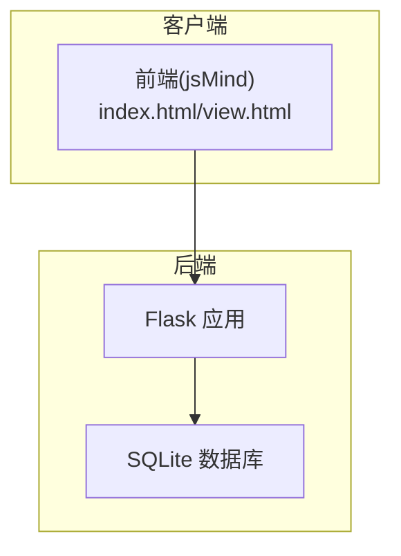
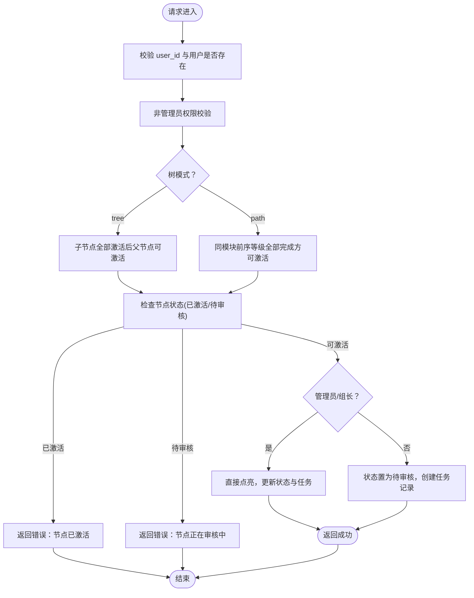
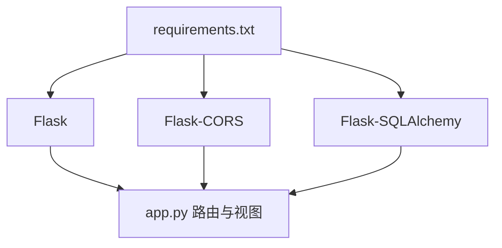

# API路由设计

<cite>
**本文引用的文件**
- [app.py](file://app.py)
- [README.md](file://README.md)
- [requirements.txt](file://requirements.txt)
</cite>

## 目录
1. [简介](#简介)
2. [项目结构](#项目结构)
3. [核心组件](#核心组件)
4. [架构总览](#架构总览)
5. [详细组件分析](#详细组件分析)
6. [依赖分析](#依赖分析)
7. [性能考虑](#性能考虑)
8. [故障排查指南](#故障排查指南)
9. [结论](#结论)
10. [附录](#附录)

## 简介
本文件面向技能树管理系统的API路由设计，系统基于Flask + SQLAlchemy，提供RESTful风格的后端接口，涵盖用户管理、技能树管理、节点操作与激活控制等能力。本文将从REST设计原则出发，系统阐述HTTP方法映射、URL路径设计与资源命名规范，逐项说明各API端点的功能、参数与返回结构，并结合源码分析路由装饰器与参数验证策略，给出版本控制与向后兼容建议，以及最佳实践与错误处理机制。

## 项目结构
- 后端入口：Flask应用实例与蓝图注册
- 数据模型：用户、技能树、节点、用户技能树状态、历史与任务等
- 路由层：基于@app.route装饰器的REST端点
- 前端交互：通过jsMind前端框架与后端API进行数据交换

```mermaid
graph TB
A["Flask 应用<br/>app.py"] --> B["用户管理<br/>/api/users"]
A --> C["技能树管理<br/>/api/trees"]
A --> D["节点操作<br/>/api/trees/<tree_id>/nodes"]
A --> E["激活控制<br/>/api/trees/<tree_id>/nodes/<node_id>/activate"]
A --> F["取消激活<br/>/api/trees/<tree_id>/nodes/<node_id>/deactivate"]
A --> G["重置技能树<br/>/api/trees/<tree_id>/reset"]
A --> H["重置用户技能树<br/>/api/users/<user_id>/trees/<tree_id>/reset"]
A --> I["技能点更新<br/>/api/trees/<tree_id>/skill-points"]
A --> J["模块列表<br/>/api/modules"]
A --> K["进度查询<br/>/api/progress"]
A --> L["节点点击日志<br/>/api/trees/<tree_id>/nodes/<node_id>/click"]
A --> M["节点历史<br/>/api/trees/<tree_id>/nodes/<node_id>/history"]
A --> N["全局点击统计<br/>/api/history/global/clicks"]
A --> O["全局编辑历史<br/>/api/history/global/edits"]
A --> P["仪表盘统计<br/>/api/dashboard/stats"]
A --> Q["任务分配/撤销/查询<br/>/api/tasks/*"]
```

图表来源
- [app.py](file://app.py)

章节来源
- [app.py](file://app.py)
- [README.md](file://README.md)

## 核心组件
- Flask应用与CORS：启用跨域支持，便于前后端分离部署
- SQLAlchemy模型：用户、技能树、节点、用户状态、历史与任务
- 路由装饰器：@app.route绑定HTTP方法与URL路径
- 参数验证：基于请求体与查询参数的显式校验，配合4xx语义化错误响应
- 数据转换：构建jsMind格式输出，注入用户状态与动态计算结果

章节来源
- [app.py](file://app.py)
- [requirements.txt](file://requirements.txt)

## 架构总览
系统采用经典的MVC分层：
- 视图层：Flask路由与视图函数
- 模型层：SQLAlchemy ORM模型与数据库交互
- 控制层：路由装饰器与参数校验逻辑
- 输出层：JSON响应与状态码

图表来源
- [app.py](file://app.py)

## 详细组件分析

### 用户管理API（/api/users）
- GET /api/users
  - 功能：获取所有用户列表
  - 参数：无
  - 返回：用户数组，包含基础字段与创建时间
- POST /api/users
  - 功能：创建用户
  - 请求体字段：username、password、is_admin、is_leader、module、group
  - 校验：用户名必填且唯一
  - 成功：201，返回用户ID与消息
  - 失败：400（用户名为空/重复）
- PUT /api/users/<int:user_id>
  - 功能：更新用户信息
  - 请求体字段：username（可选，唯一性校验）、password（可选）、is_admin、is_leader、module、group
  - 成功：200，返回更新成功消息
  - 失败：400（用户名冲突）

章节来源
- [app.py](file://app.py)

### 技能树管理API（/api/trees）
- GET /api/trees
  - 功能：获取技能树列表（带权限标记）
  - 查询参数：user_id（可选）
  - 返回：技能树数组，包含模块、作者、版本、是否可激活等
- POST /api/trees
  - 功能：创建新技能树
  - 请求体字段：name、author、version、default_skill_points、extra_data、data（可选，jsMind格式）
  - 成功：201，返回技能树ID与消息
  - 失败：400/500
- GET /api/trees/<int:tree_id>
  - 功能：获取指定技能树（包含所有节点）
  - 查询参数：user_id（可选）
  - 返回：jsMind格式数据，包含元信息与树形结构，按用户状态注入显示状态
- PUT /api/trees/<int:tree_id>
  - 功能：更新整个技能树（可选替换节点）
  - 请求体字段：name、module、author、version、default_skill_points、extra_data、data（可选）
  - 行为：若包含data，先删除旧节点，再保存新节点，保留颜色信息并记录编辑历史
  - 成功：200，返回更新成功消息
  - 失败：400/500
- DELETE /api/trees/<int:tree_id>
  - 功能：删除技能树
  - 成功：200，返回删除成功消息

章节来源
- [app.py](file://app.py)

### 节点操作API（/api/trees/<tree_id>/nodes）
- POST /api/trees/<int:tree_id>/nodes
  - 功能：快速添加单个节点
  - 请求体字段：data.id、data.parent_id、data.topic、data.direction、data.level、data.module、data.cost、data.description、data.link、data.link2、user_id（可选）
  - 校验：节点ID必填且唯一
  - 成功：201，返回消息与node_id
  - 失败：400（ID为空/重复）
- POST /api/trees/<int:tree_id>/nodes/batch
  - 功能：批量导入节点（CSV导入专用）
  - 请求体字段：nodes（数组，每项含topic、parent_id、level、module、cost等）
  - 行为：逐条校验并保存，记录导入历史，支持部分失败
  - 成功：200或207，返回统计与明细
  - 失败：400/500
- PUT /api/trees/<int:tree_id>/nodes/<node_id>
  - 功能：更新单个节点
  - 请求体字段：topic、direction、expanded、background_color、foreground_color、cost、description、link、link2、level、module、user_id（可选）
  - 行为：记录变更详情到历史表
  - 成功：200，返回更新成功消息
  - 失败：404/500

章节来源
- [app.py](file://app.py)

### 激活控制API（/api/trees/<tree_id>/nodes/<node_id>/activate）
- POST /api/trees/<int:tree_id>/nodes/<node_id>/activate
  - 功能：激活/点亮节点（用户操作）
  - 请求体字段：user_id（必填）
  - 权限：非管理员仅能激活自身模块内的技能树节点
  - 激活规则：
    - tree模式：自下而上，子节点全部激活后方可激活父节点
    - path模式：线性进阶，同一模块内前序等级全部完成后方可激活当前等级
  - 状态流转：
    - 管理员或组长：直接点亮
    - 普通用户：提交待审核，状态为pending_approval
  - 成功：200，返回消息、状态与技能点
  - 失败：400/401/403（权限不足、前置条件未满足、节点已激活/待审核）

图表来源
- [app.py](file://app.py)

章节来源
- [app.py](file://app.py)

### 取消激活API（/api/trees/<tree_id>/nodes/<node_id>/deactivate）
- POST /api/trees/<int:tree_id>/nodes/<node_id>/deactivate
  - 功能：取消激活节点（重置）
  - 校验：节点必须处于activated状态，且无已激活子节点
  - 行为：重置状态为locked，返还技能点
  - 成功：200，返回消息与技能点
  - 失败：400（未激活/存在已激活子节点）

章节来源
- [app.py](file://app.py)

### 重置相关API
- POST /api/trees/<int:tree_id>/reset
  - 功能：管理员重置技能树（可选重置指定用户）
  - 请求体字段：user_id（必填）、target_user_id（可选）
  - 行为：重置状态为locked，返还技能点，支持重置所有用户
  - 成功：200或207，返回消息与统计
  - 失败：400/403
- POST /api/users/<int:user_id>/trees/<int:tree_id>/reset
  - 功能：用户重置自己的技能树
  - 行为：重置状态与技能点
  - 成功：200，返回消息与技能点

章节来源
- [app.py](file://app.py)

### 技能点与模式API
- PUT /api/trees/<int:tree_id>/mode
  - 功能：更新技能树的激活模式（tree/path，兼容linear）
  - 请求体字段：mode（tree/path/linear）
  - 成功：200，返回消息与标准化模式
  - 失败：400（无效模式）
- PUT /api/trees/<int:tree_id>/skill-points
  - 功能：更新技能点
  - 请求体字段：skill_points、total_skill_points
  - 成功：200，返回更新后的技能点
  - 失败：400/500

章节来源
- [app.py](file://app.py)

### 辅助与统计API
- GET /api/modules
  - 功能：获取分离的模块列表（树、节点、用户）
  - 成功：200，返回模块数组
- GET /api/progress
  - 功能：获取用户进度信息（可选all=true）
  - 查询参数：user_id（必填）、all（可选）
  - 成功：200，返回进度与激活节点详情
- POST /api/trees/<int:tree_id>/nodes/<node_id>/click
  - 功能：记录节点点击事件
  - 请求体字段：user_id（可选）
  - 成功：200，返回消息
- GET /api/trees/<int:tree_id>/nodes/<node_id>/history
  - 功能：获取节点的历史与点击统计
  - 成功：200，返回编辑历史与点击统计
- GET /api/history/global/clicks
  - 功能：获取全局点击统计与最近点击记录
  - 查询参数：ranking_limit、page、per_page
  - 成功：200，返回统计与分页
- GET /api/history/global/edits
  - 功能：获取全局编辑历史记录
  - 查询参数：page、per_page
  - 成功：200，返回历史列表与分页
- GET /api/dashboard/stats
  - 功能：获取仪表盘统计数据（用户、树、节点、激活率、模块与组别进度）
  - 成功：200，返回汇总与分组统计
- POST /api/tasks/assign
  - 功能：管理员或组长分配学习任务
  - 请求体字段：assigner_id、user_id、tree_id、node_id/node_ids、task_type
  - 成功：200，返回分配数量
  - 失败：400/403
- DELETE /api/tasks/<int:task_id>
  - 功能：管理员或组长取消分配的任务
  - 查询参数：user_id（必填）
  - 成功：200，返回消息
  - 失败：400/403
- GET /api/tasks/my
  - 功能：获取用户的学习任务列表
  - 查询参数：user_id（必填）
  - 成功：200，返回按周期分类的任务
- GET /api/tasks/pending
  - 功能：获取待审核列表（管理员/组长）
  - 查询参数：user_id（必填）
  - 成功：200，返回待审核状态

章节来源
- [app.py](file://app.py)

## 依赖分析
- Flask：Web框架与路由装饰器
- Flask-CORS：跨域支持
- Flask-SQLAlchemy：ORM与数据库抽象
- SQLite：轻量级数据库

图表来源
- [requirements.txt](file://requirements.txt)
- [app.py](file://app.py)

章节来源
- [requirements.txt](file://requirements.txt)
- [app.py](file://app.py)

## 性能考虑
- 批量导入：使用flush而非commit逐条入库，最后一次性提交，减少事务开销
- 状态计算：在构建jsMind数据时进行一次遍历，按模块聚合与动态计算，避免多次数据库查询
- 分页查询：全局统计与历史查询使用分页参数，降低响应体积
- 唯一索引：用户技能树状态表对(user_id, tree_id, node_id)建立唯一约束，避免重复状态

章节来源
- [app.py](file://app.py)

## 故障排查指南
- 路由装饰器与HTTP方法
  - 使用@app.route绑定HTTP方法与路径，确保与REST约定一致
  - 对于资源路径，使用资源名词复数形式与资源ID占位符
- 参数验证
  - 必填字段缺失：返回400
  - 唯一性冲突：返回400
  - 权限不足：返回403
  - 资源不存在：返回404
  - 业务前置条件不满足：返回400
- 错误响应格式
  - 统一返回JSON对象，包含错误描述
  - 结合HTTP状态码表达语义
- 日志与历史
  - 节点编辑历史与点击统计可用于问题定位与审计

章节来源
- [app.py](file://app.py)

## 结论
本系统遵循RESTful设计原则，通过清晰的URL路径与HTTP方法映射，实现了用户、技能树、节点与状态的完整生命周期管理。路由装饰器与参数校验确保了接口的稳定性与安全性。建议在后续迭代中引入版本号前缀与更严格的参数校验库，以进一步提升可维护性与向后兼容性。

## 附录

### API版本控制与向后兼容
- 版本策略建议
  - 路径版本：/api/v1/users、/api/v1/trees
  - 头部版本：Accept: application/vnd.company.v1+json
  - 语义化版本：PATCH仅修复，MINOR新增端点，MAJOR变更破坏性
- 向后兼容
  - 新增字段默认可选
  - 废弃字段保留但标注deprecated
  - 严格遵守HTTP状态码语义

### 路由设计最佳实践
- 资源命名
  - 使用名词复数表示集合：/api/users、/api/trees
  - 使用资源ID表示单个资源：/api/users/{id}
- HTTP方法
  - GET：获取资源或集合
  - POST：创建资源
  - PUT：整体更新资源
  - DELETE：删除资源
- 参数传递
  - 查询参数用于过滤与分页
  - 请求体用于创建/更新资源
- 错误处理
  - 明确的4xx/5xx语义
  - 统一的错误响应结构
  - 详细错误描述与上下文