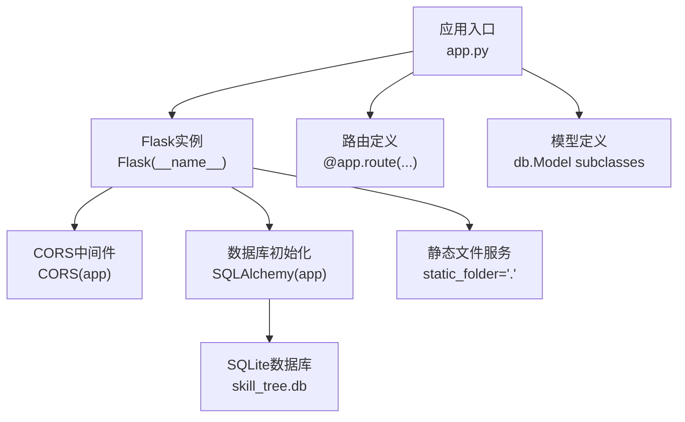
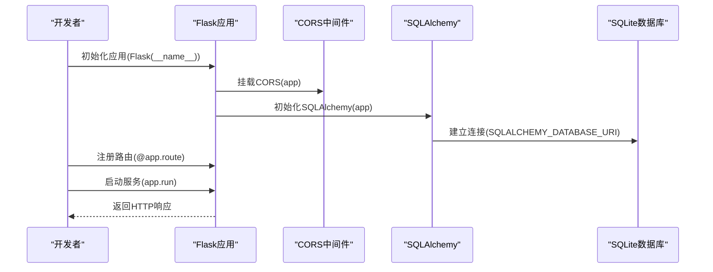
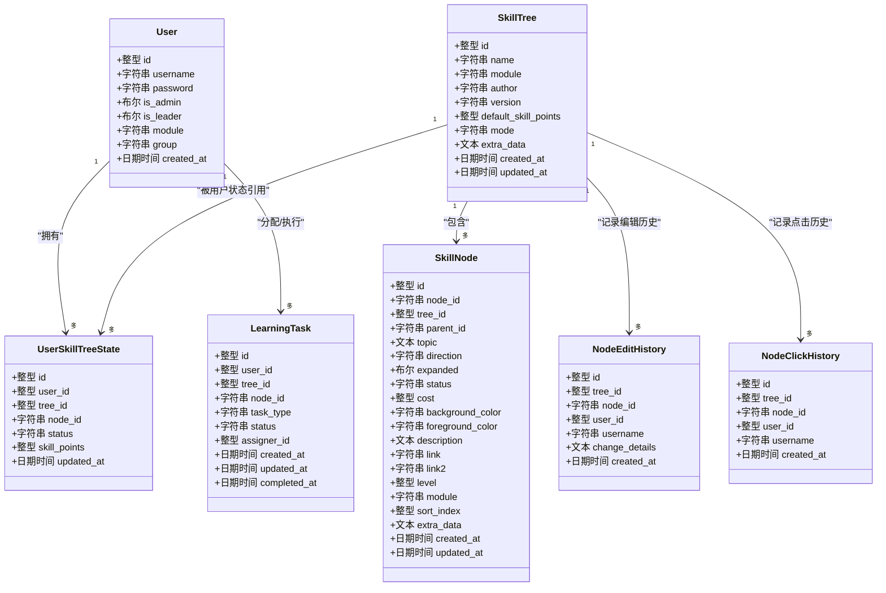
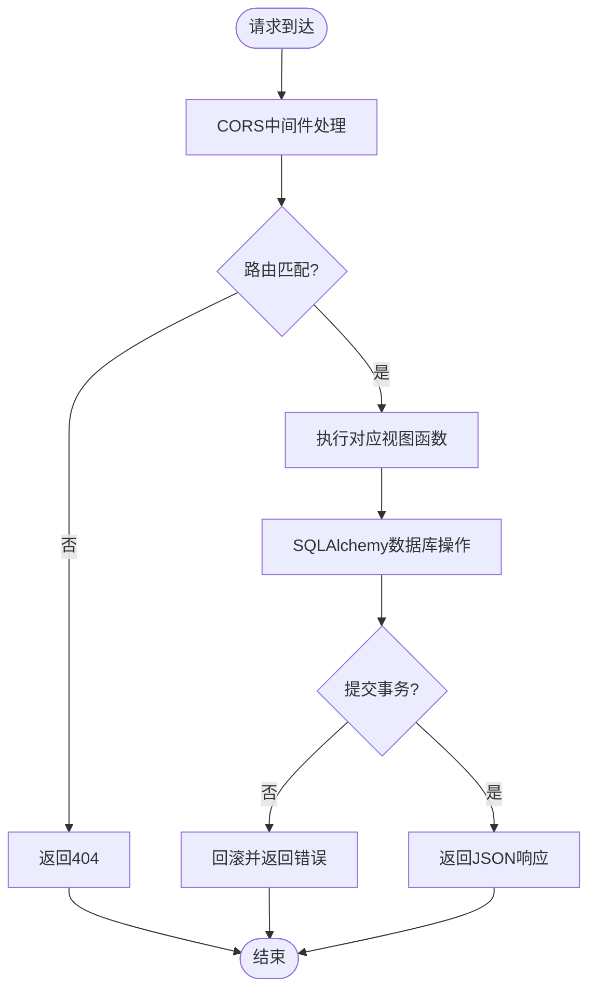
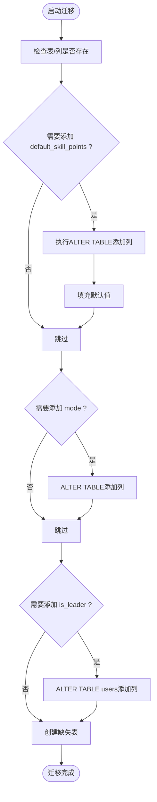
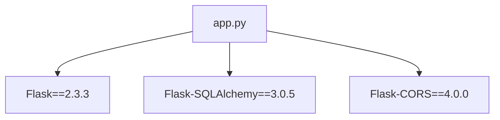

# Flask框架配置

<cite>
**本文档引用的文件**
- [app.py](file://app.py)
- [requirements.txt](file://requirements.txt)
- [README.md](file://README.md)
- [migrate_db.py](file://migrate_db.py)
- [migrate_db_v2.py](file://migrate_db_v2.py)
- [migrate_db_v3.py](file://migrate_db_v3.py)
- [_test_api.py](file://_test_api.py)
</cite>

## 目录
1. [简介](#简介)
2. [项目结构](#项目结构)
3. [核心组件](#核心组件)
4. [架构总览](#架构总览)
5. [详细组件分析](#详细组件分析)
6. [依赖分析](#依赖分析)
7. [性能考虑](#性能考虑)
8. [故障排除指南](#故障排除指南)
9. [结论](#结论)
10. [附录](#附录)

## 简介
本文件面向技能树管理系统的Flask后端，围绕应用初始化、CORS跨域配置、数据库连接与Flask-SQLAlchemy配置、静态文件处理、中间件与蓝图使用进行系统化技术说明。文档同时提供最佳实践与性能优化建议，帮助开发者高效维护与扩展系统。

## 项目结构
项目采用“单文件应用 + 多迁移脚本”的组织方式：
- 应用入口与业务逻辑集中在单个Python文件中，便于开发与部署。
- 数据库迁移通过独立脚本实现，支持增量演进。
- 前端资源位于libs目录，静态文件由Flask内置静态路由服务。

图表来源
- [app.py:17-22](file://app.py#L17-L22)

章节来源
- [app.py:17-22](file://app.py#L17-L22)
- [README.md:61-78](file://README.md#L61-L78)

## 核心组件
- Flask应用实例：负责路由注册、中间件挂载与静态文件服务。
- CORS跨域中间件：允许来自不同源的前端访问API。
- Flask-SQLAlchemy：ORM封装与数据库连接管理。
- 数据库迁移脚本：支持字段与表结构的增量升级。

章节来源
- [app.py:17-22](file://app.py#L17-L22)
- [requirements.txt:1-4](file://requirements.txt#L1-L4)
- [migrate_db.py:8-36](file://migrate_db.py#L8-L36)

## 架构总览
Flask应用启动流程与关键配置如下：

图表来源
- [app.py:17-22](file://app.py#L17-L22)
- [app.py:18-19](file://app.py#L18-L19)

章节来源
- [app.py:17-22](file://app.py#L17-L22)
- [app.py:18-19](file://app.py#L18-L19)

## 详细组件分析

### Flask应用初始化与静态文件处理
- 应用实例创建：使用Flask构造函数创建应用实例，指定static_folder与static_url_path以启用静态文件服务。
- 静态文件处理：通过Flask内置的静态路由提供libs目录下的CSS/JS等资源，便于前端直接访问。
- 路由注册：所有API均通过@app.route装饰器注册，形成集中式路由定义。

章节来源
- [app.py:17](file://app.py#L17)

### CORS跨域配置与中间件机制
- CORS挂载：在应用实例上直接调用CORS(app)，即可为所有路由启用跨域支持。
- 实现机制：Flask-CORS在请求进入应用前拦截并注入CORS响应头，允许跨域预检与实际请求。
- 配置要点：默认允许常见方法与头部；生产环境可根据需要精细化配置。

章节来源
- [app.py:20](file://app.py#L20)
- [requirements.txt:3](file://requirements.txt#L3)

### Flask-SQLAlchemy配置与数据库连接
- 数据库URI：使用SQLite文件型数据库，路径为相对项目根目录的skill_tree.db。
- 修改追踪：关闭SQLAlchemy的自动修改追踪，降低开销。
- 连接池：默认连接池参数适用于开发场景；生产环境建议结合具体负载调整。

章节来源
- [app.py:18-19](file://app.py#L18-L19)
- [requirements.txt:2](file://requirements.txt#L2)

### 数据库模型与关系
应用定义了用户、技能树、技能节点、用户技能树状态、节点编辑历史与学习任务等模型，涵盖权限、状态持久化与历史审计需求。

图表来源
- [app.py:25-177](file://app.py#L25-L177)

章节来源
- [app.py:25-177](file://app.py#L25-L177)

### 路由与蓝图使用说明
- 路由注册：所有API通过@app.route装饰器集中注册，覆盖用户管理、登录、技能树CRUD、节点操作、状态重置、模块与进度查询等。
- 蓝图使用：当前项目未使用Flask蓝图，所有路由直接绑定到应用实例。若未来规模扩大，建议按功能模块拆分蓝图以提升可维护性。

章节来源
- [app.py:182-1516](file://app.py#L182-L1516)

### 中间件配置与控制流
- CORS中间件：在应用初始化阶段挂载，无需额外中间件栈配置。
- 请求处理：请求进入后，CORS先行处理跨域相关头部，随后路由匹配与业务逻辑执行。

图表来源
- [app.py:20](file://app.py#L20)
- [app.py:182-1516](file://app.py#L182-L1516)

章节来源
- [app.py:20](file://app.py#L20)
- [app.py:182-1516](file://app.py#L182-L1516)

### 数据库迁移与演进
- 迁移脚本：提供多版本迁移脚本，分别用于添加默认技能点、激活模式与新增字段等。
- 迁移策略：通过检查表结构与字段存在性，按需添加列并回填默认值，最后统一创建缺失表。

图表来源
- [migrate_db.py:8-36](file://migrate_db.py#L8-L36)
- [migrate_db_v2.py:6-31](file://migrate_db_v2.py#L6-L31)
- [migrate_db_v3.py:8-32](file://migrate_db_v3.py#L8-L32)

章节来源
- [migrate_db.py:8-36](file://migrate_db.py#L8-L36)
- [migrate_db_v2.py:6-31](file://migrate_db_v2.py#L6-L31)
- [migrate_db_v3.py:8-32](file://migrate_db_v3.py#L8-L32)

## 依赖分析
- Flask版本：2.3.3
- Flask-SQLAlchemy版本：3.0.5
- Flask-CORS版本：4.0.0

图表来源
- [requirements.txt:1-4](file://requirements.txt#L1-L4)

章节来源
- [requirements.txt:1-4](file://requirements.txt#L1-L4)

## 性能考虑
- 关闭SQLAlchemy修改追踪：在生产环境中保持关闭以减少不必要的对象跟踪开销。
- 静态文件服务：将静态资源置于独立目录并通过Flask静态路由提供，避免业务逻辑干扰。
- 跨域处理：CORS中间件仅做必要头部注入，对性能影响较小；如需更细粒度控制，可在生产环境限制允许的源与方法。
- 数据库连接：SQLite适合小中型应用；若并发较高，建议评估连接池参数或迁移到更健壮的数据库。

## 故障排除指南
- 跨域问题：确认Flask-CORS已安装且正确挂载；若仍出现跨域错误，检查前端请求的Origin与CORS配置。
- 数据库迁移失败：迁移脚本提供错误提示与手动清理指引；可按提示删除数据库文件后重启应用以重建。
- API测试：可通过测试客户端验证路由可用性与返回格式。

章节来源
- [README.md:298-304](file://README.md#L298-L304)
- [migrate_db.py:31-36](file://migrate_db.py#L31-L36)
- [_test_api.py:8-19](file://_test_api.py#L8-L19)

## 结论
本项目以简洁的方式实现了技能树管理的后端能力：通过Flask+CORS+SQLAlchemy构建了完整的API与数据层，配合独立迁移脚本保障数据库结构演进。建议在生产环境中进一步完善CORS白名单、数据库连接池参数与安全策略，同时在规模扩大时引入蓝图模块化组织。

## 附录
- 启动与运行：参见README中的安装与运行说明。
- API接口：参见README中的接口说明与示例。

章节来源
- [README.md:80-112](file://README.md#L80-L112)
- [README.md:113-214](file://README.md#L113-L214)