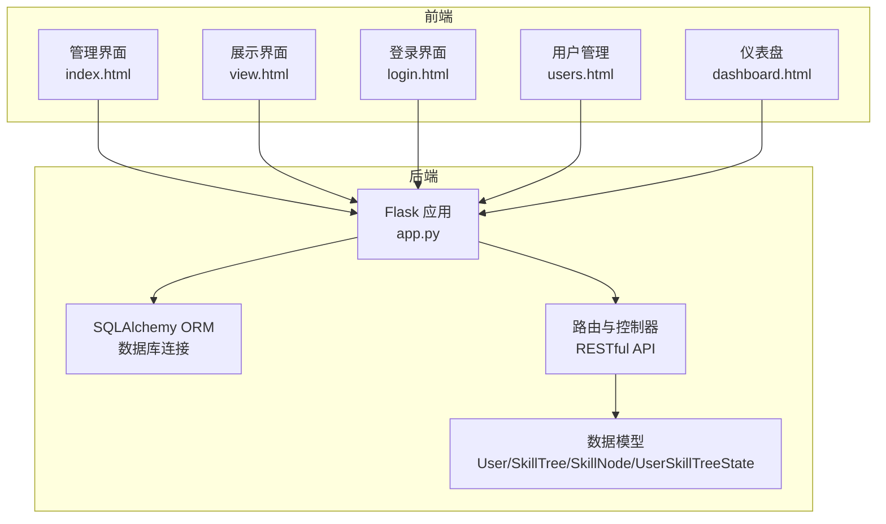
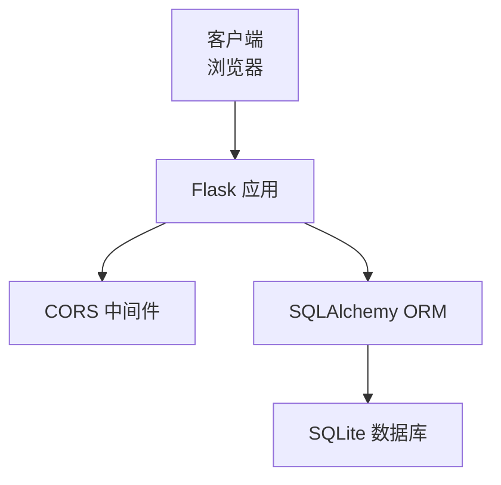
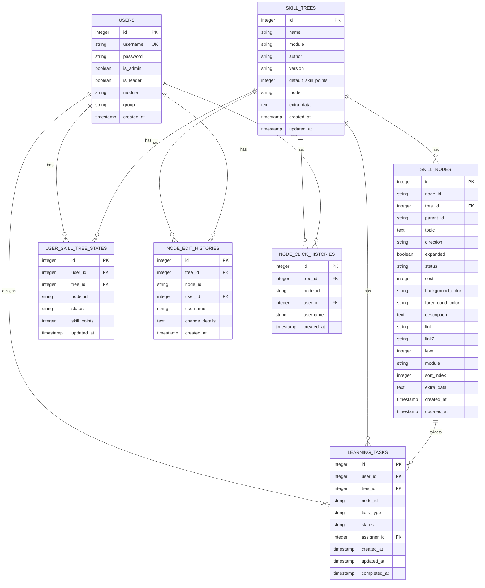
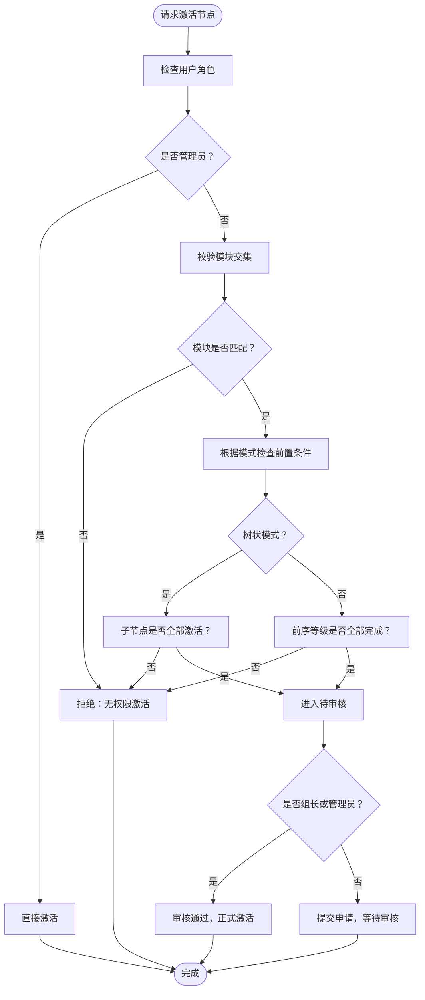
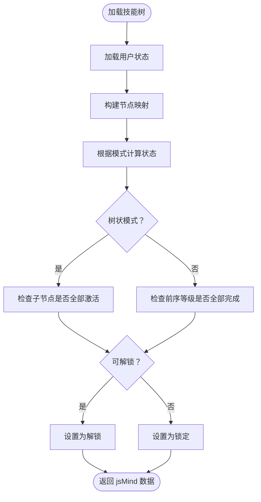
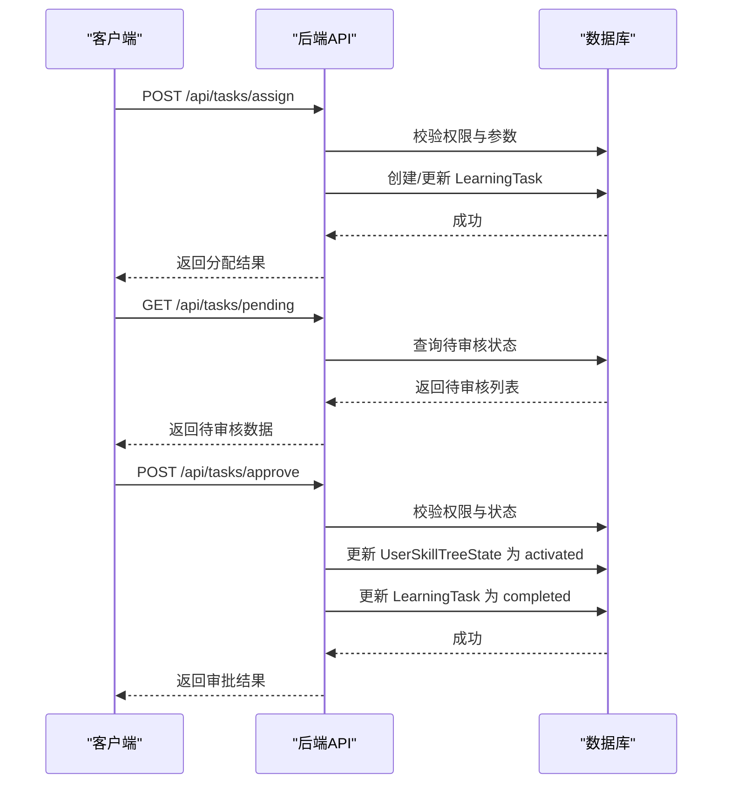
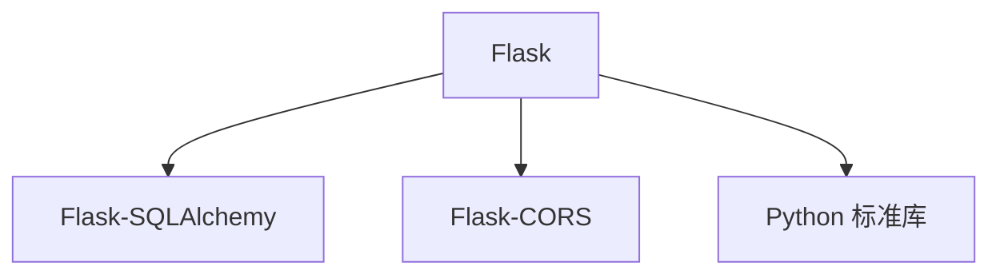

# 后端架构设计

<cite>
**本文档引用的文件**
- [app.py](file://app.py)
- [requirements.txt](file://requirements.txt)
- [README.md](file://README.md)
- [create_admin.py](file://create_admin.py)
- [migrate_db.py](file://migrate_db.py)
</cite>

## 目录
1. [简介](#简介)
2. [项目结构](#项目结构)
3. [核心组件](#核心组件)
4. [架构总览](#架构总览)
5. [详细组件分析](#详细组件分析)
6. [依赖分析](#依赖分析)
7. [性能考虑](#性能考虑)
8. [故障排查指南](#故障排查指南)
9. [结论](#结论)
10. [附录](#附录)

## 简介
本项目是一个基于 Flask 的技能树管理系统，采用 MVC 架构，结合 SQLAlchemy ORM 实现数据持久化，支持多用户、权限控制、技能点系统、节点状态管理与历史追踪。系统通过 RESTful API 提供技能树的创建、编辑、激活、重置等功能，并提供仪表盘统计与任务管理能力。

## 项目结构
- 后端入口：app.py
- 依赖声明：requirements.txt
- 项目说明：README.md
- 管理员创建脚本：create_admin.py
- 数据库迁移脚本：migrate_db.py
- 前端静态资源：index.html、view.html、login.html、users.html、dashboard.html 等（由 Flask 提供静态文件服务）

图表来源
- [app.py:17-22](file://app.py#L17-L22)
- [app.py:1711-1737](file://app.py#L1711-L1737)

章节来源
- [app.py:17-22](file://app.py#L17-L22)
- [README.md:61-78](file://README.md#L61-L78)

## 核心组件
- 数据模型层（Model）
  - User：用户表，包含用户名、密码、管理员/组长标识、模块与分组等
  - SkillTree：技能树表，包含名称、模块、作者、版本、默认技能点、激活模式等
  - SkillNode：技能节点表，包含节点ID、父节点ID、主题、方向、展开状态、状态、成本、颜色、描述、链接、等级、模块、排序索引等
  - UserSkillTreeState：用户技能树状态表，记录用户在特定技能树中各节点的状态与可用技能点
  - NodeEditHistory：节点编辑历史表
  - NodeClickHistory：节点点击历史表
  - LearningTask：学习任务表，支持任务分配、审核与完成状态管理
- 视图层（View/Route）
  - RESTful API 路由：用户管理、技能树 CRUD、节点管理、激活/取消激活、重置、历史统计、任务管理等
  - 静态文件服务：提供前端页面与静态资源
- 控制器层（Controller）
  - 业务逻辑：权限校验、状态计算、前置条件检查、任务审批流程、历史记录与统计

章节来源
- [app.py:25-121](file://app.py#L25-L121)
- [app.py:183-275](file://app.py#L183-L275)
- [app.py:280-354](file://app.py#L280-L354)
- [app.py:356-382](file://app.py#L356-L382)
- [app.py:385-561](file://app.py#L385-L561)
- [app.py:562-686](file://app.py#L562-L686)
- [app.py:688-710](file://app.py#L688-L710)
- [app.py:777-901](file://app.py#L777-L901)
- [app.py:904-930](file://app.py#L904-L930)
- [app.py:948-1052](file://app.py#L948-L1052)
- [app.py:1018-1052](file://app.py#L1018-L1052)
- [app.py:1498-1546](file://app.py#L1498-L1546)
- [app.py:1549-1652](file://app.py#L1549-L1652)
- [app.py:1655-1708](file://app.py#L1655-L1708)
- [app.py:1740-1841](file://app.py#L1740-L1841)
- [app.py:1843-1917](file://app.py#L1843-L1917)
- [app.py:1918-2027](file://app.py#L1918-L2027)
- [app.py:2029-2079](file://app.py#L2029-L2079)

## 架构总览
系统采用 Flask + SQLAlchemy 的经典后端架构：
- Web 框架：Flask
- ORM：Flask-SQLAlchemy
- 跨域：Flask-CORS
- 数据库：SQLite（本地文件型数据库）
- 静态文件：Flask 提供静态文件服务

图表来源
- [app.py:5-22](file://app.py#L5-L22)
- [requirements.txt:1-4](file://requirements.txt#L1-L4)

## 详细组件分析

### 数据模型设计
- User（用户）
  - 主键：id
  - 唯一约束：username
  - 关系：与 UserSkillTreeState 一对多
- SkillTree（技能树）
  - 主键：id
  - 关系：与 SkillNode、UserSkillTreeState 一对多
- SkillNode（技能节点）
  - 主键：id
  - 复合索引：tree_id + node_id
  - 外键：tree_id -> SkillTree.id
- UserSkillTreeState（用户技能树状态）
  - 主键：id
  - 唯一约束：user_id + tree_id + node_id
  - 外键：user_id -> User.id，tree_id -> SkillTree.id
- NodeEditHistory（节点编辑历史）
  - 外键：tree_id -> SkillTree.id，user_id -> User.id
- NodeClickHistory（节点点击历史）
  - 外键：tree_id -> SkillTree.id，user_id -> User.id
- LearningTask（学习任务）
  - 外键：user_id -> User.id，tree_id -> SkillTree.id

图表来源
- [app.py:25-121](file://app.py#L25-L121)

章节来源
- [app.py:25-121](file://app.py#L25-L121)

### 权限控制机制
- 用户角色
  - is_admin：管理员，可重置所有用户技能树、审核任务、查看所有模块
  - is_leader：组长，可审核本组成员的任务、查看本组成员进度
  - group：用户分组（A/B/C/D/Office），用于任务审批范围控制
  - module：模块/权限范围，用于技能树可见性与激活权限控制
- 模块权限验证
  - 技能树列表与技能树加载时，对非管理员用户进行模块交集校验
  - 激活节点时，若用户与技能树模块无交集，拒绝激活
- 任务审批
  - 管理员可审核任意用户请求
  - 组长仅可审核本组成员的请求
  - 审核通过后扣除技能点并同步任务状态

图表来源
- [app.py:777-901](file://app.py#L777-L901)
- [app.py:2029-2079](file://app.py#L2029-L2079)

章节来源
- [app.py:385-412](file://app.py#L385-L412)
- [app.py:777-901](file://app.py#L777-L901)
- [app.py:1973-2027](file://app.py#L1973-L2027)
- [app.py:2029-2079](file://app.py#L2029-L2079)

### RESTful API 设计
- 用户管理
  - GET /api/users：获取用户列表
  - POST /api/users：创建用户
  - PUT /api/users/<int:user_id>：更新用户
- 登录
  - POST /api/login：用户登录
- 技能树管理
  - GET /api/trees：获取技能树列表（含权限标记）
  - POST /api/trees：创建技能树（可同时保存节点）
  - GET /api/trees/<int:tree_id>：获取指定技能树（包含节点与用户状态）
  - PUT /api/trees/<int:tree_id>：更新技能树（可更新节点）
  - DELETE /api/trees/<int:tree_id>：删除技能树
  - PUT /api/trees/<int:tree_id>/mode：更新技能树激活模式
- 节点管理
  - POST /api/trees/<int:tree_id>/nodes：快速添加单个节点
  - POST /api/trees/<int:tree_id>/nodes/batch：批量导入节点（CSV）
  - PUT /api/trees/<int:tree_id>/nodes/<node_id>：更新节点
  - POST /api/trees/<int:tree_id>/nodes/<node_id>/activate：激活节点
  - POST /api/trees/<int:tree_id>/nodes/<node_id>/deactivate：取消激活
- 重置与统计
  - POST /api/trees/<int:tree_id>/reset：管理员重置技能树
  - POST /api/users/<int:user_id>/trees/<int:tree_id>/reset：用户重置自身技能树
  - GET /api/progress：获取用户进度信息
  - GET /api/modules：获取模块列表
  - GET /api/history/global/clicks：全局点击统计
  - GET /api/history/global/edits：全局编辑历史
  - GET /api/dashboard/stats：仪表盘统计数据
- 任务管理
  - POST /api/tasks/assign：分配学习任务
  - DELETE /api/tasks/<int:task_id>：撤销任务
  - GET /api/tasks/my：获取我的任务
  - GET /api/tasks/pending：获取待审核列表
  - POST /api/tasks/approve：审核通过

章节来源
- [app.py:280-354](file://app.py#L280-L354)
- [app.py:356-382](file://app.py#L356-L382)
- [app.py:385-561](file://app.py#L385-L561)
- [app.py:562-686](file://app.py#L562-L686)
- [app.py:688-710](file://app.py#L688-L710)
- [app.py:777-901](file://app.py#L777-L901)
- [app.py:904-930](file://app.py#L904-L930)
- [app.py:948-1052](file://app.py#L948-L1052)
- [app.py:1018-1052](file://app.py#L1018-L1052)
- [app.py:1408-1495](file://app.py#L1408-L1495)
- [app.py:1381-1406](file://app.py#L1381-L1406)
- [app.py:1549-1652](file://app.py#L1549-L1652)
- [app.py:1655-1708](file://app.py#L1655-L1708)
- [app.py:1740-1841](file://app.py#L1740-L1841)
- [app.py:1843-1917](file://app.py#L1843-L1917)
- [app.py:1918-2027](file://app.py#L1918-L2027)
- [app.py:2029-2079](file://app.py#L2029-L2079)

### 数据库设计决策
- SQLite 选择理由
  - 轻量、无需额外服务端、易于部署与迁移
  - 适合中小规模数据与演示场景
- ORM 映射关系
  - 一对一/一对多/多对多通过外键与关系属性定义
  - 复合唯一索引保证用户在技能树中节点状态的唯一性
- 索引优化策略
  - SkillNode 上建立 (tree_id, node_id) 复合索引，加速节点查询
  - UserSkillTreeState 上建立 (user_id, tree_id, node_id) 复合唯一索引，保证状态唯一性
- 数据一致性
  - 使用级联删除与外键约束保证数据完整性
  - 批量导入使用 flush/commit 控制事务边界

章节来源
- [app.py:101-121](file://app.py#L101-L121)
- [migrate_db.py:8-36](file://migrate_db.py#L8-L36)

### 技能树激活模式与状态计算
- 激活模式
  - tree：树状自下而上，要求所有子节点激活后方可激活父节点
  - path：线性进阶，要求同一模块下前序等级全部完成后方可激活当前等级
- 状态计算
  - 根据用户激活状态与待审核状态动态计算节点显示状态
  - 结合树/路径模式与等级聚合统计，确保规则一致性

图表来源
- [app.py:1137-1378](file://app.py#L1137-L1378)
- [app.py:1288-1351](file://app.py#L1288-L1351)

章节来源
- [app.py:1137-1378](file://app.py#L1137-L1378)
- [app.py:1288-1351](file://app.py#L1288-L1351)

### 任务管理与审批流程
- 任务分配
  - 管理员或组长可为用户分配学习任务（支持单选或多选节点）
  - 任务类型：daily/weekly/monthly/quarterly/yearly
- 待审核列表
  - 组长仅能看到本组成员的申请
  - 管理员可审核任意用户请求
- 审批通过
  - 扣除技能点并正式激活节点
  - 同步更新任务状态为 completed

图表来源
- [app.py:1843-1917](file://app.py#L1843-L1917)
- [app.py:1973-2027](file://app.py#L1973-L2027)
- [app.py:2029-2079](file://app.py#L2029-L2079)

章节来源
- [app.py:1843-1917](file://app.py#L1843-L1917)
- [app.py:1973-2027](file://app.py#L1973-L2027)
- [app.py:2029-2079](file://app.py#L2029-L2079)

## 依赖分析
- Flask：Web 框架
- Flask-SQLAlchemy：ORM
- Flask-CORS：跨域支持
- Python 标准库：json、os、io、uuid、datetime 等

图表来源
- [requirements.txt:1-4](file://requirements.txt#L1-L4)

章节来源
- [requirements.txt:1-4](file://requirements.txt#L1-L4)

## 性能考虑
- 数据库查询优化
  - 使用复合索引 (tree_id, node_id) 与 (user_id, tree_id, node_id) 加速节点与状态查询
  - 批量导入使用 bulk_save_objects 与 flush/commit 控制事务
- 缓存机制
  - 当前未实现应用层缓存，建议在高频读取场景引入 Redis 或内存缓存（如用户状态快照）
- 并发处理
  - 使用 Flask 默认开发服务器，生产环境建议使用 Gunicorn + 多进程/多线程部署
  - 对于高并发场景，建议引入连接池与异步任务队列处理耗时操作（如历史统计）
- I/O 与序列化
  - 历史记录与统计接口使用分页查询，避免一次性加载大量数据

章节来源
- [app.py:101-121](file://app.py#L101-L121)
- [app.py:562-686](file://app.py#L562-L686)
- [app.py:1549-1652](file://app.py#L1549-L1652)

## 故障排查指南
- 跨域问题
  - 确认已安装并启用 Flask-CORS
- 数据库迁移失败
  - 可删除数据库文件后重启服务，系统会自动重建
  - 或使用 migrate_db.py 脚本执行迁移
- 管理员创建
  - 使用 create_admin.py 脚本快速创建默认管理员账户
- 权限不足
  - 确认用户角色与模块配置正确，管理员可重置所有用户技能树
- 节点导入异常
  - 检查 CSV 格式与节点父子关系，确保父节点 ID 正确

章节来源
- [migrate_db.py:8-36](file://migrate_db.py#L8-L36)
- [create_admin.py:7-25](file://create_admin.py#L7-L25)
- [README.md:298-304](file://README.md#L298-L304)

## 结论
本系统以 Flask + SQLAlchemy 实现了完整的技能树管理功能，具备清晰的 MVC 分层、完善的权限控制与任务审批流程、以及丰富的统计与历史追踪能力。SQLite 的轻量特性使其易于部署与维护，适合中小规模团队使用。建议在生产环境中引入缓存、连接池与异步任务，进一步提升性能与稳定性。

## 附录
- 启动与运行
  - 安装依赖：pip install -r requirements.txt
  - 运行后端：python app.py 或使用 run.bat
  - 访问地址：http://localhost:5003

章节来源
- [README.md:80-111](file://README.md#L80-L111)