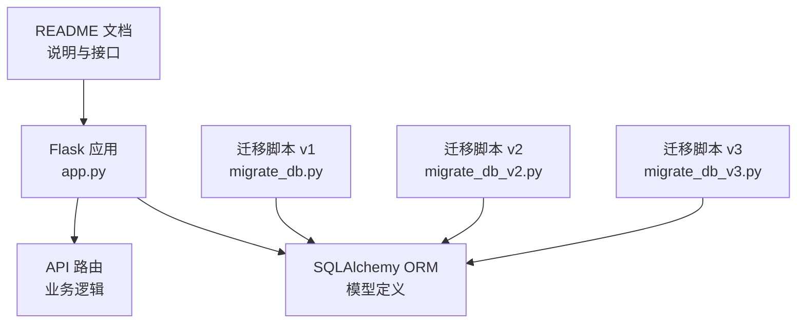
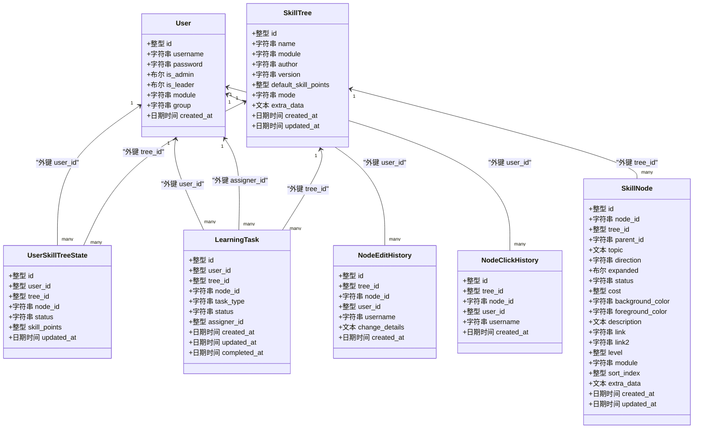
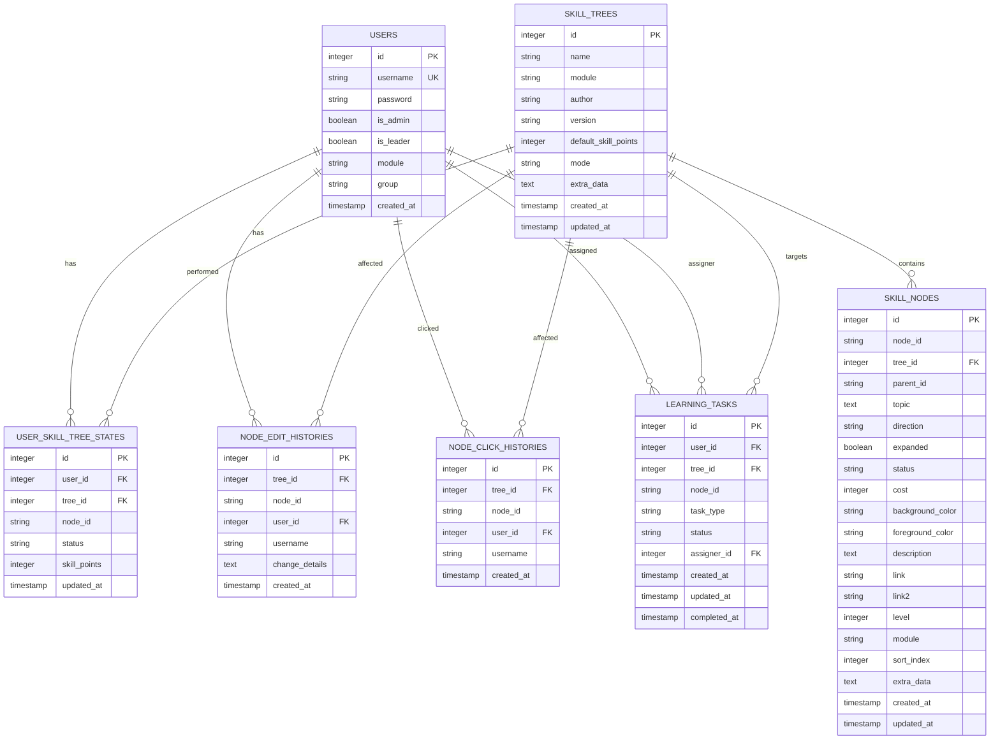
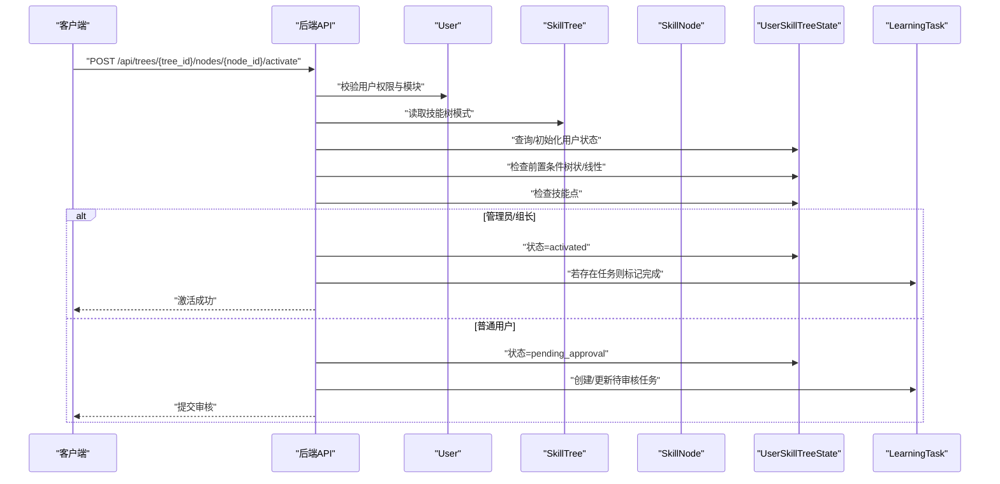
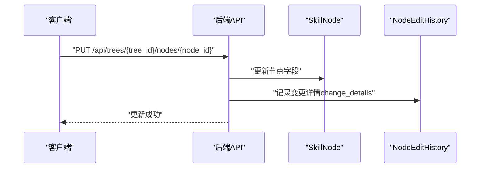
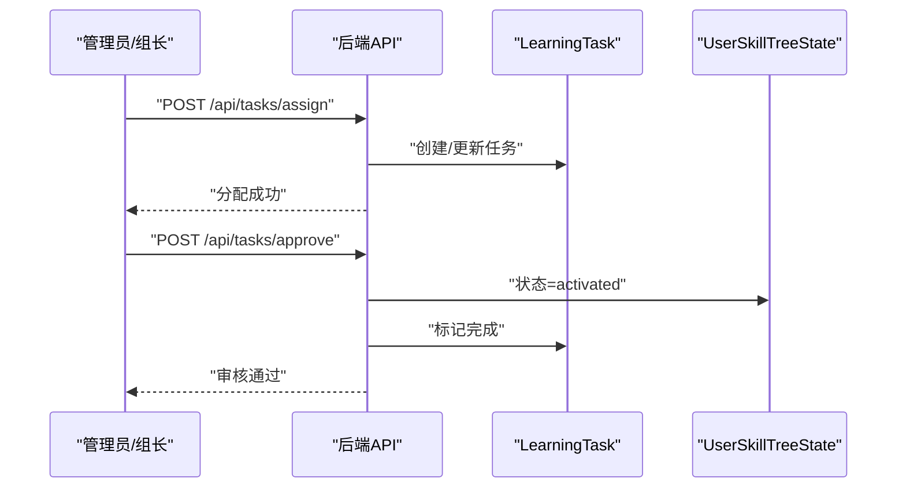

# 数据库模型设计

<cite>
**本文引用的文件**
- [app.py](file://app.py)
- [migrate_db.py](file://migrate_db.py)
- [migrate_db_v2.py](file://migrate_db_v2.py)
- [migrate_db_v3.py](file://migrate_db_v3.py)
- [README.md](file://README.md)
</cite>

## 目录
1. [简介](#简介)
2. [项目结构](#项目结构)
3. [核心组件](#核心组件)
4. [架构总览](#架构总览)
5. [详细组件分析](#详细组件分析)
6. [依赖关系分析](#依赖关系分析)
7. [性能考量](#性能考量)
8. [故障排查指南](#故障排查指南)
9. [结论](#结论)
10. [附录](#附录)

## 简介
本文件面向技能树管理系统的数据库模型设计，系统基于 Flask + SQLAlchemy + SQLite，围绕用户、技能树、节点、用户状态、历史记录与学习任务等实体展开，提供完整的数据模型、关系设计、索引策略、迁移与版本管理指导，以及扩展与性能优化建议。文档同时给出关键流程的时序图与类图，帮助开发者快速理解与落地实现。

## 项目结构
系统采用“模型定义 + API路由 + 迁移脚本”的组织方式：
- 模型定义集中在后端入口文件中，使用 SQLAlchemy ORM 映射到 SQLite。
- API 路由负责业务逻辑与数据交互，贯穿模型间的关联与约束。
- 迁移脚本负责数据库结构演进与字段补齐。

图表来源
- [app.py:17-22](file://app.py#L17-L22)
- [migrate_db.py:5-36](file://migrate_db.py#L5-L36)
- [migrate_db_v2.py:1-34](file://migrate_db_v2.py#L1-L34)
- [migrate_db_v3.py:5-31](file://migrate_db_v3.py#L5-L31)

章节来源
- [README.md:61-78](file://README.md#L61-L78)
- [app.py:17-22](file://app.py#L17-L22)

## 核心组件
本节概述六大核心数据模型及其职责：
- User 用户模型：承载用户基本信息、权限与模块归属。
- SkillTree 技能树模型：描述技能树元数据、默认技能点、激活模式与扩展数据。
- SkillNode 节点模型：描述节点结构、样式、成本、模块与排序。
- UserSkillTreeState 用户状态模型：记录用户在特定技能树中的节点状态与可用技能点。
- NodeEditHistory 编辑历史模型：记录节点变更详情与操作人。
- NodeClickHistory 点击历史模型：记录节点点击行为与时间。
- LearningTask 学习任务模型：支持管理员/组长分配学习任务与审核流程。

章节来源
- [app.py:25-177](file://app.py#L25-L177)

## 架构总览
系统采用“树形结构 + 用户状态隔离 + 历史审计 + 任务驱动”的架构思路：
- 技能树与节点构成树形结构，支持两种激活模式：树状自下而上与线性进阶。
- 用户状态独立保存，根节点存储初始技能点，子节点激活消耗技能点。
- 历史与任务模型提供审计与追踪能力，支持管理员/组长审核流程。

图表来源
- [app.py:25-177](file://app.py#L25-L177)

## 详细组件分析

### User 用户模型
- 设计要点
  - 主键自增 id。
  - username 唯一，便于登录与权限控制。
  - is_admin/is_leader 标识管理员与组长角色，用于权限校验。
  - module/group 用于模块与分组隔离，支撑多维度权限与统计。
  - created_at 记录注册时间。
- 关联关系
  - 与 UserSkillTreeState 为一对多，表示用户在不同技能树中的状态。
  - 与 LearningTask 为一对多，表示任务的申请人与被分配人。
- 索引与约束
  - username 唯一性约束（ORM 层定义）。
- 业务逻辑
  - 登录校验、权限判定、模块/分组影响技能树可见性与任务分配范围。

章节来源
- [app.py:25-40](file://app.py#L25-L40)
- [app.py:356-382](file://app.py#L356-L382)
- [app.py:1843-1895](file://app.py#L1843-L1895)

### SkillTree 技能树模型
- 设计要点
  - 主键自增 id。
  - name/version/module/author 描述技能树元数据。
  - default_skill_points 控制默认技能点。
  - mode 支持 tree（树状自下而上）与 path（线性进阶）两种激活模式。
  - extra_data 存放扩展数据（JSON）。
  - created_at/updated_at 记录创建与更新时间。
- 关联关系
  - 与 SkillNode 为一对多，表示技能树包含多个节点。
  - 与 UserSkillTreeState 为一对多，表示用户在该技能树中的状态。
- 索引与约束
  - 无显式复合索引，但通过外键与关系查询满足常见场景。
- 业务逻辑
  - 激活模式切换、默认技能点设置、权限模块匹配。

章节来源
- [app.py:42-61](file://app.py#L42-L61)
- [app.py:688-709](file://app.py#L688-L709)

### SkillNode 节点模型
- 设计要点
  - 主键自增 id。
  - node_id 为业务唯一标识，配合 tree_id 形成复合定位。
  - parent_id 指向父节点，root 节点为 None 或特殊值。
  - topic/description/link/link2/status/cost/level/module/sort_index 等字段支撑节点外观与规则。
  - background_color/foreground_color 为主题色。
  - extra_data 存放自定义扩展字段。
  - created_at/updated_at 记录创建与更新时间。
- 索引与约束
  - 复合索引 idx_tree_node(tree_id, node_id)，保证按技能树+节点ID的查询效率。
- 业务逻辑
  - 节点导入/更新、颜色保留、父子关系与激活前置条件校验。

章节来源
- [app.py:63-103](file://app.py#L63-L103)
- [app.py:562-606](file://app.py#L562-L606)
- [app.py:712-774](file://app.py#L712-L774)

### UserSkillTreeState 用户状态模型
- 设计要点
  - 主键自增 id。
  - user_id/tree_id/node_id 三元组合唯一，确保每个用户在每个技能树中对每个节点的状态唯一。
  - status 支持 locked/activated/pending_approval 等状态。
  - skill_points 记录用户在该技能树中的可用技能点（通常根节点存储初始值）。
  - updated_at 记录状态更新时间。
- 索引与约束
  - 复合唯一约束 idx_user_tree_node(user_id, tree_id, node_id)。
- 业务逻辑
  - 初始化用户技能树状态、激活/取消激活节点、技能点扣减与返还、审核流程。

章节来源
- [app.py:105-121](file://app.py#L105-L121)
- [app.py:777-901](file://app.py#L777-L901)
- [app.py:1055-1075](file://app.py#L1055-L1075)

### NodeEditHistory 编辑历史模型
- 设计要点
  - 主键自增 id。
  - 记录 tree_id/node_id 与操作者 user_id/username。
  - change_details 以 JSON 存储变更详情，便于审计与回溯。
  - created_at 记录变更时间。
- 业务逻辑
  - 节点更新时记录变更详情，支持全局编辑历史查询与统计。

章节来源
- [app.py:124-138](file://app.py#L124-L138)
- [app.py:712-774](file://app.py#L712-L774)
- [app.py:1517-1546](file://app.py#L1517-L1546)

### NodeClickHistory 点击历史模型
- 设计要点
  - 主键自增 id。
  - 记录 tree_id/node_id 与点击者 user_id/username。
  - created_at 记录点击时间。
- 业务逻辑
  - 节点点击事件记录，支持点击统计与最近点击查询。

章节来源
- [app.py:140-151](file://app.py#L140-L151)
- [app.py:1498-1514](file://app.py#L1498-L1514)

### LearningTask 学习任务模型
- 设计要点
  - 主键自增 id。
  - user_id/tree_id/node_id 标识任务对象。
  - task_type 支持 daily/weekly/monthly/quarterly/yearly 等周期类型。
  - status 支持 assigned/pending/completed 等状态。
  - assigner_id 记录分配者。
  - created_at/updated_at/ completed_at 记录生命周期。
- 关联关系
  - 与 User 建立双向关系，分别表示被分配人与分配者。
- 业务逻辑
  - 管理员/组长分配任务、用户查看任务、审核通过后同步点亮节点并标记完成。

章节来源
- [app.py:153-177](file://app.py#L153-L177)
- [app.py:1843-1895](file://app.py#L1843-L1895)
- [app.py:1973-2027](file://app.py#L1973-L2027)
- [app.py:2029-2079](file://app.py#L2029-L2079)

## 依赖关系分析

### 关系图（模型间外键与级联）

图表来源
- [app.py:25-177](file://app.py#L25-L177)

### 关键流程时序图

#### 激活节点流程（含审核）

图表来源
- [app.py:777-901](file://app.py#L777-L901)
- [app.py:864-892](file://app.py#L864-L892)

#### 节点编辑历史记录

图表来源
- [app.py:712-774](file://app.py#L712-L774)
- [app.py:124-138](file://app.py#L124-L138)

#### 学习任务分配与审核

图表来源
- [app.py:1843-1895](file://app.py#L1843-L1895)
- [app.py:2029-2079](file://app.py#L2029-L2079)

## 依赖关系分析

### 外键与级联策略
- UserSkillTreeState
  - 外键 user_id -> users(id)、tree_id -> skill_trees(id)
  - 级联删除：删除用户或技能树时，其状态记录随之外键约束清理。
- SkillNode
  - 外键 tree_id -> skill_trees(id)
  - 无显式级联删除，删除技能树时需谨慎处理节点。
- NodeEditHistory / NodeClickHistory
  - 外键 user_id -> users(id)、tree_id -> skill_trees(id)
  - 无级联删除，适合长期审计。
- LearningTask
  - 外键 user_id -> users(id)、tree_id -> skill_trees(id)、assigner_id -> users(id)
  - 无级联删除，便于审计与追踪。

章节来源
- [app.py:25-177](file://app.py#L25-L177)

### 索引与唯一约束
- 复合索引
  - idx_tree_node(tree_id, node_id)：加速按技能树+节点ID的查询。
  - idx_user_tree_node(user_id, tree_id, node_id)：保证用户在技能树中节点状态的唯一性。
- 唯一约束
  - username 唯一：保证用户登录与权限控制。
- 复合唯一约束
  - uq_user_tree_node(user_id, tree_id, node_id)：确保用户状态唯一。

章节来源
- [app.py:102](file://app.py#L102)
- [app.py:118-121](file://app.py#L118-L121)
- [app.py:30](file://app.py#L30)

## 性能考量
- 查询热点
  - 按技能树加载节点：使用 idx_tree_node(tree_id, node_id) 与 sort_index 排序。
  - 用户状态查询：使用 idx_user_tree_node(user_id, tree_id, node_id)。
  - 激活前置条件：树状模式需遍历子节点，线性模式需按模块聚合等级。
- 索引建议
  - 为 frequently-filtered 字段建立索引：如 skill_nodes.module、skill_nodes.level、user_skill_tree_states.status。
  - 为历史表增加时间范围索引：node_edit_histories.created_at、node_click_histories.created_at。
- 批量操作
  - 节点导入使用批量插入与 flush，减少事务开销。
- I/O 优化
  - 使用 JSON 字段存储扩展数据，避免频繁新增表。
- 并发与一致性
  - 使用事务包裹状态更新与技能点扣减，确保原子性。
  - 对唯一约束冲突进行幂等处理（如重复节点ID时重生成）。

[本节为通用性能建议，无需特定文件引用]

## 故障排查指南
- 数据库迁移失败
  - 检查迁移脚本执行顺序与 SQLite 兼容性。
  - 若迁移失败，可按提示删除数据库文件后重启服务自动重建。
- 唯一约束冲突
  - 用户名重复、用户+技能树+节点状态重复等，需在前端或后端进行幂等处理。
- 外键约束异常
  - 删除用户或技能树前，确认级联策略与依赖关系，避免违反外键。
- 历史记录解析失败
  - change_details 为 JSON，解析失败时记录原始内容，便于人工修复。

章节来源
- [migrate_db.py:30-36](file://migrate_db.py#L30-L36)
- [app.py:294-296](file://app.py#L294-L296)
- [app.py:1682-1688](file://app.py#L1682-L1688)

## 结论
本数据库模型以“树形结构 + 用户状态隔离 + 历史审计 + 任务驱动”为核心，通过合理的外键关系、复合索引与唯一约束，支撑技能树的创建、编辑、激活、重置与统计分析。迁移脚本保障了结构演进的平滑过渡。建议在生产环境中进一步完善索引、监控与备份策略，并持续评估性能瓶颈与扩展需求。

[本节为总结性内容，无需特定文件引用]

## 附录

### 模型迁移与版本管理
- v1 迁移：为 skill_trees 表添加 default_skill_points 字段，若缺失则自动补齐默认值。
- v2 迁移：为 skill_trees 表添加 mode 字段，默认 tree 模式。
- v3 迁移：为 users 表添加 is_leader 字段；创建 learning_tasks 表。
- 启动时初始化：自动检测表结构并补齐缺失字段，最后统一创建所有表。

章节来源
- [migrate_db.py:8-36](file://migrate_db.py#L8-L36)
- [migrate_db_v2.py:6-30](file://migrate_db_v2.py#L6-L30)
- [migrate_db_v3.py:8-31](file://migrate_db_v3.py#L8-L31)
- [app.py:2109-2218](file://app.py#L2109-L2218)

### API 与数据流补充
- 节点导入/批量导入：支持 CSV 预览与提交，生成唯一 node_id 并记录导入历史。
- 技能点系统：根节点存储初始技能点，激活节点消耗技能点，重置返还。
- 权限与模块：管理员可重置所有用户状态，普通用户仅能重置自身；模块交集决定可见性与操作范围。

章节来源
- [app.py:189-203](file://app.py#L189-L203)
- [app.py:208-274](file://app.py#L208-L274)
- [app.py:385-412](file://app.py#L385-L412)
- [app.py:948-1052](file://app.py#L948-L1052)