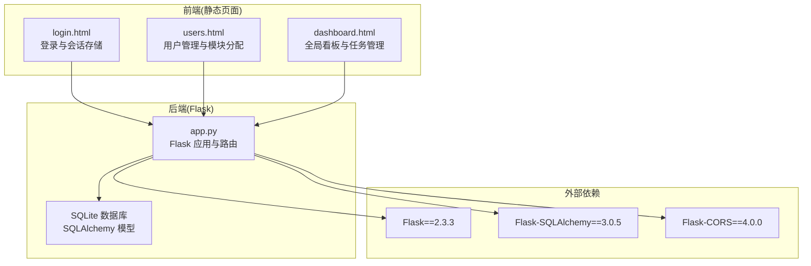
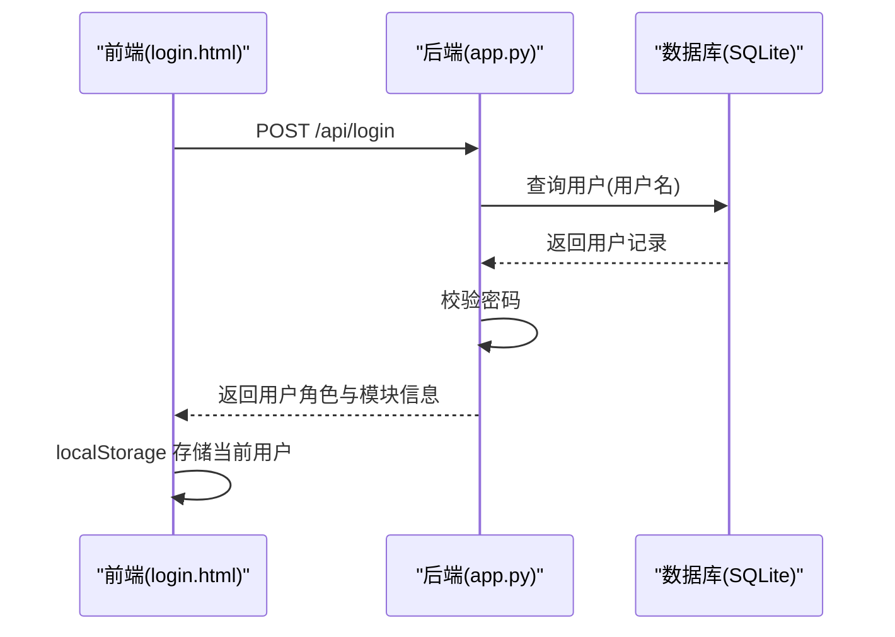
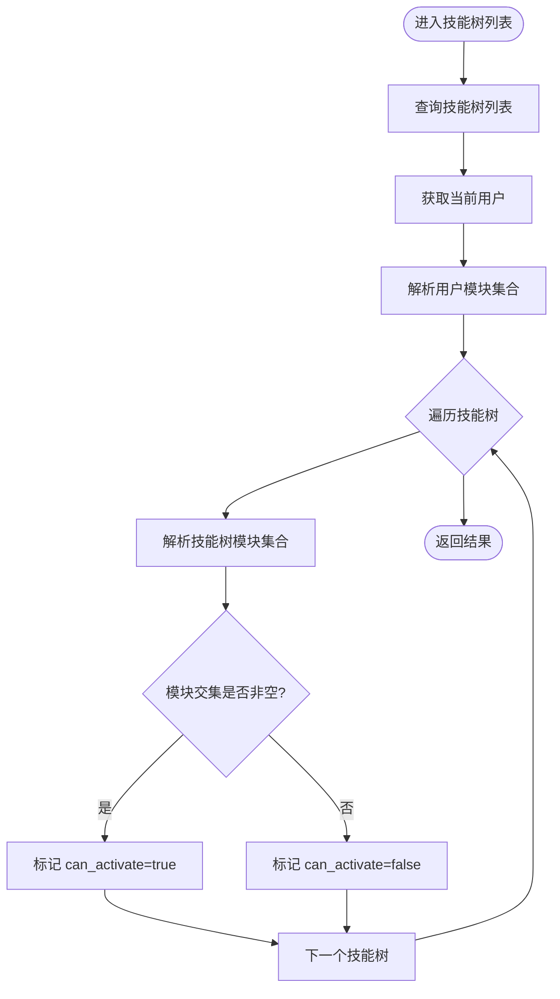
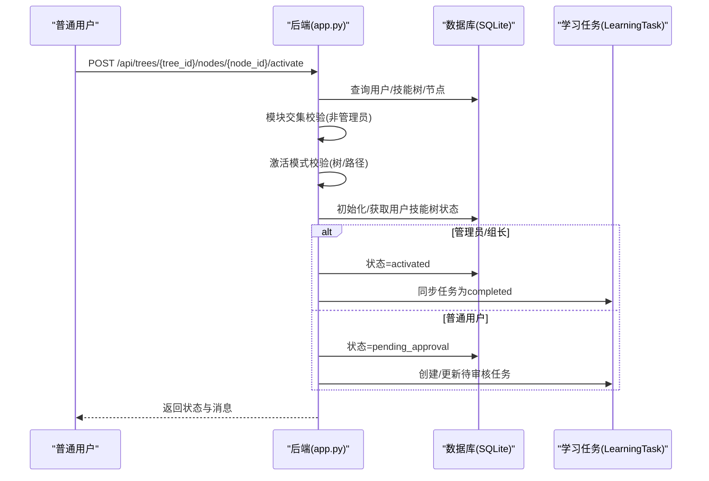

# 权限控制系统

<cite>
**本文引用的文件**
- [app.py](file://app.py)
- [create_admin.py](file://create_admin.py)
- [login.html](file://login.html)
- [users.html](file://users.html)
- [dashboard.html](file://dashboard.html)
- [requirements.txt](file://requirements.txt)
</cite>

## 目录
1. [简介](#简介)
2. [项目结构](#项目结构)
3. [核心组件](#核心组件)
4. [架构总览](#架构总览)
5. [详细组件分析](#详细组件分析)
6. [依赖分析](#依赖分析)
7. [性能考虑](#性能考虑)
8. [故障排查指南](#故障排查指南)
9. [结论](#结论)
10. [附录](#附录)

## 简介
本技术文档聚焦于技能树管理系统的权限控制系统，系统采用前后端分离架构，后端基于 Flask + SQLAlchemy，前端采用静态 HTML+JavaScript。权限模型围绕“用户角色 + 模块权限 + 组别权限 + 节点状态流转”的多维设计，实现管理员、组长、普通用户的分级权限与模块隔离。系统通过模块集合交集进行技能树可见性与可激活性的控制，并在节点激活流程中引入“待审核”状态，由管理员或组长进行审批，形成闭环的权限治理。

## 项目结构
- 后端入口与核心逻辑：app.py
- 管理员初始化脚本：create_admin.py
- 前端页面：
  - 登录页：login.html
  - 用户管理页：users.html
  - 管理看板页：dashboard.html
- 依赖声明：requirements.txt

图示来源
- [app.py:17-22](file://app.py#L17-L22)
- [requirements.txt:1-4](file://requirements.txt#L1-L4)

章节来源
- [app.py:17-22](file://app.py#L17-L22)
- [requirements.txt:1-4](file://requirements.txt#L1-L4)

## 核心组件
- 用户模型(User)：包含角色字段(is_admin、is_leader)、模块(module)、组别(group)、创建时间等，用于权限判定与模块隔离。
- 技能树模型(SkillTree)：包含模块(module)、作者(author)、版本(version)、默认技能点(default_skill_points)、激活模式(mode)等，用于权限与状态计算。
- 节点模型(SkillNode)：包含等级(level)、模块(module)、排序索引(sort_index)、成本(cost)、描述(description)、链接(link/link2)等，支撑节点激活与路径/树两种模式。
- 用户技能树状态(UserSkillTreeState)：记录用户在特定技能树中每个节点的状态(status)、可用技能点(skill_points)、更新时间等，是节点激活与审核的核心依据。
- 历史与统计模型：节点编辑历史(NodeEditHistory)、节点点击历史(NodeClickHistory)、学习任务(LearningTask)，用于审计与看板统计。

章节来源
- [app.py:25-121](file://app.py#L25-L121)
- [app.py:124-177](file://app.py#L124-L177)

## 架构总览
系统采用“前端静态页面 + 后端REST API”的架构。前端通过AJAX调用后端接口，后端通过SQLAlchemy访问SQLite数据库。权限控制贯穿以下环节：
- 登录与会话：前端本地存储当前用户信息，后端登录接口返回用户角色与模块信息。
- 模块权限：技能树列表与树详情在渲染时进行模块交集校验，决定是否允许激活。
- 节点激活：普通用户激活节点进入“待审核”，管理员/组长可直接激活或审批。
- 任务管理：管理员/组长可分配任务，普通用户可查看个人任务。

图示来源
- [login.html:178-206](file://login.html#L178-L206)
- [app.py:356-382](file://app.py#L356-L382)

章节来源
- [login.html:151-210](file://login.html#L151-L210)
- [app.py:356-382](file://app.py#L356-L382)

## 详细组件分析

### 用户权限模型与分级
- 角色分级
  - 管理员：is_admin=True，拥有最高权限，可重置技能树、审核节点、分配任务、查看所有模块进度。
  - 组长：is_leader=True，仅能管理本组成员，可审核本组成员的节点激活申请。
  - 普通用户：无特殊权限，节点激活需提交申请并等待审核。
- 模块权限
  - 用户与技能树均维护模块字段，采用逗号分隔的模块集合。后端在技能树列表与树详情渲染时，通过集合交集判断用户是否具备激活权限。
- 组别权限
  - 用户按组别(group)划分(A/B/C/D/Office)，管理员可查看所有用户，普通用户仅能看到与自身模块有交集的用户与技能树。

章节来源
- [app.py:25-40](file://app.py#L25-L40)
- [app.py:42-61](file://app.py#L42-L61)
- [app.py:385-412](file://app.py#L385-L412)
- [app.py:1355-1363](file://app.py#L1355-L1363)
- [users.html:587-599](file://users.html#L587-L599)

### 模块权限控制机制
- 技能树可见性与激活权限
  - 列表接口：后端对每个技能树计算can_activate，若用户模块与技能树模块交集为空，则不可激活。
  - 树详情渲染：build_jsmind_data中再次进行模块交集校验，确保前端仅显示用户有权激活的节点。
- 模块集合解析
  - 用户模块与技能树模块均以逗号分隔，后端统一拆分为集合，进行交集运算。
- 模块枚举接口
  - 提供模块聚合接口，前端用于构建模块选择器与权限过滤。

图示来源
- [app.py:385-412](file://app.py#L385-L412)
- [app.py:1355-1363](file://app.py#L1355-L1363)
- [app.py:1381-1405](file://app.py#L1381-L1405)

章节来源
- [app.py:385-412](file://app.py#L385-L412)
- [app.py:1355-1363](file://app.py#L1355-L1363)
- [app.py:1381-1405](file://app.py#L1381-L1405)

### 节点激活与权限验证流程
- 激活模式
  - 树状模式(tree)：子节点全部激活后方可激活父节点。
  - 路径模式(path)：同一模块内，较低等级节点全部激活后方可激活当前等级。
- 权限与状态
  - 管理员/组长：直接点亮节点，同步完成相关任务。
  - 普通用户：提交激活申请，状态变更为“待审核”，等待管理员/组长审批。
- 审批流程
  - 管理员/组长可查看待审核列表，逐项审批，通过后正式点亮节点并完成任务。

图示来源
- [app.py:777-901](file://app.py#L777-L901)
- [app.py:864-892](file://app.py#L864-L892)
- [app.py:1973-2027](file://app.py#L1973-L2027)

章节来源
- [app.py:777-901](file://app.py#L777-L901)
- [app.py:864-892](file://app.py#L864-L892)
- [app.py:1973-2027](file://app.py#L1973-L2027)

### 用户认证与会话管理
- 登录流程
  - 前端调用登录接口，后端校验用户名与密码，返回用户角色与模块信息。
  - 前端将用户信息写入localStorage，后续页面访问时读取并进行权限判断。
- 页面级权限
  - 用户管理页(users.html)：仅管理员可访问。
  - 登录页(login.html)：已登录用户根据角色重定向至不同页面。
- 会话存储
  - 使用浏览器localStorage存储当前用户信息，便于前端权限判断与UI控制。

章节来源
- [login.html:151-210](file://login.html#L151-L210)
- [users.html:587-599](file://users.html#L587-L599)
- [app.py:356-382](file://app.py#L356-L382)

### 权限继承与组合
- 模块继承
  - 用户模块与技能树模块均为集合，通过交集运算实现“继承”：用户仅能访问与其模块交集内的技能树。
- 角色组合
  - 管理员权限优先于组长权限；普通用户在节点激活时统一走“待审核”流程。
- 组别约束
  - 组长仅能管理本组成员，跨组操作会被拒绝。

章节来源
- [app.py:385-412](file://app.py#L385-L412)
- [app.py:1843-1895](file://app.py#L1843-L1895)
- [app.py:1982-2049](file://app.py#L1982-L2049)

### 任务分配与审批
- 任务分配
  - 管理员/组长可为用户分配学习任务，支持单选或多选节点。
  - 分配后用户可在个人任务页查看。
- 审批中心
  - 管理员/组长可查看所有“待审核”状态的节点激活申请，逐项审批通过后正式点亮节点。

章节来源
- [app.py:1843-1895](file://app.py#L1843-L1895)
- [app.py:1973-2027](file://app.py#L1973-L2027)
- [dashboard.html:495-799](file://dashboard.html#L495-L799)

## 依赖分析
- Flask：Web框架，提供路由与请求处理。
- Flask-SQLAlchemy：ORM，简化数据库操作。
- Flask-CORS：跨域支持，便于前后端通信。

章节来源
- [requirements.txt:1-4](file://requirements.txt#L1-L4)

## 性能考虑
- 模块交集计算：在技能树列表与树详情渲染阶段进行，复杂度与模块数量成正比，建议控制模块数量与长度。
- 状态计算：树状/路径模式的激活校验涉及子节点与等级统计，建议在节点规模较大时优化查询与缓存。
- 历史与统计：全局点击与编辑历史查询使用分页，避免一次性加载大量数据。

## 故障排查指南
- 登录失败
  - 检查用户名是否存在、密码是否正确。
  - 确认前端是否正确将用户信息写入localStorage。
- 无法激活节点
  - 确认用户模块与技能树模块是否存在交集。
  - 检查激活模式是否满足要求（树状模式需子节点全部激活；路径模式需前序等级全部完成）。
- 任务无法分配/撤销
  - 确认操作者是否为管理员或组长，且与目标用户同组。
- 审批列表为空
  - 确认当前用户是否具有管理员或组长权限，且目标用户状态为“待审核”。

章节来源
- [app.py:356-382](file://app.py#L356-L382)
- [app.py:777-901](file://app.py#L777-L901)
- [app.py:1843-1895](file://app.py#L1843-L1895)
- [app.py:1973-2027](file://app.py#L1973-L2027)

## 结论
本权限控制系统以“角色 + 模块 + 组别 + 状态流转”为核心，实现了管理员、组长与普通用户的清晰分级与模块隔离。通过模块交集校验与节点激活审批流程，系统在保证灵活性的同时，有效控制了风险。建议在生产环境中进一步完善密码加密、会话令牌、审计日志与细粒度权限控制，以提升安全性与可维护性。

## 附录
- 管理员初始化
  - 提供脚本快速创建管理员账户，便于系统初始部署与运维。

章节来源
- [create_admin.py:7-25](file://create_admin.py#L7-L25)