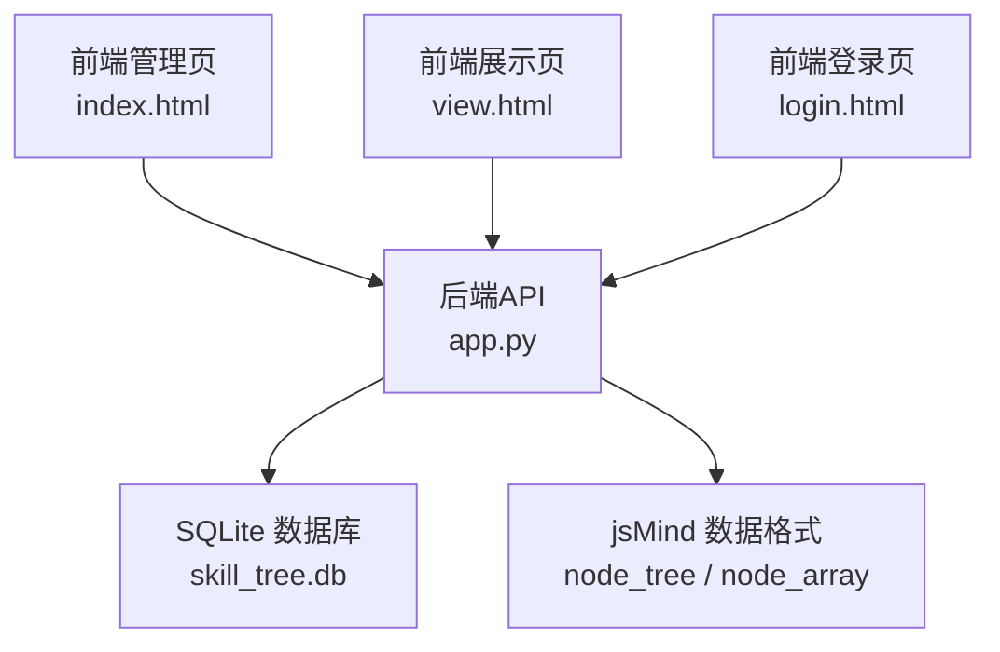
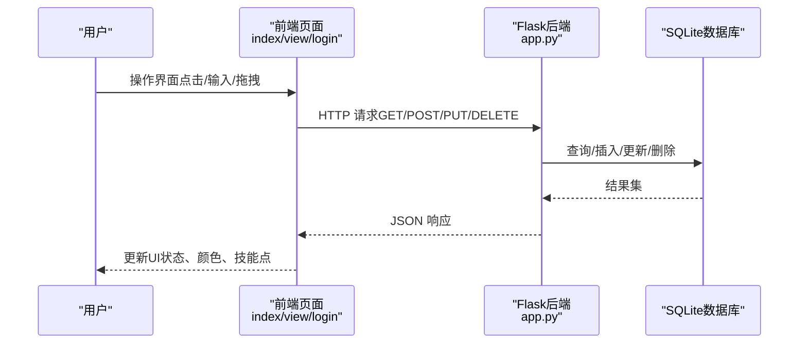
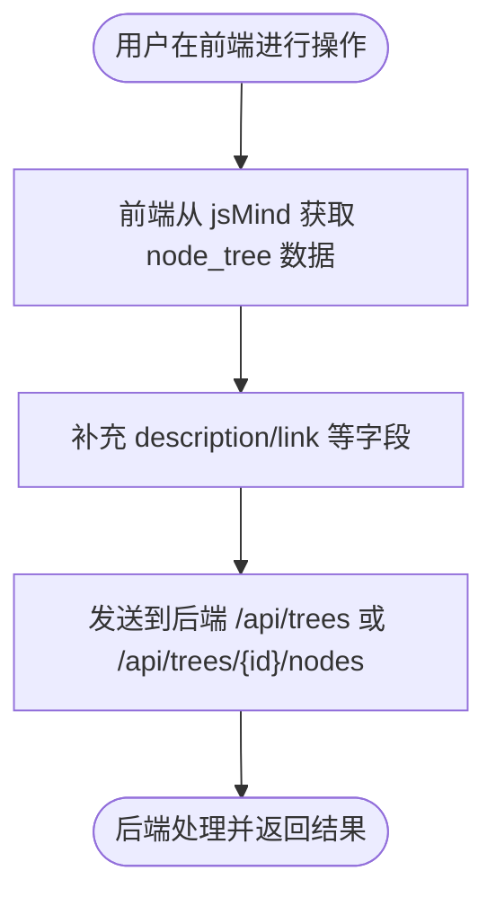
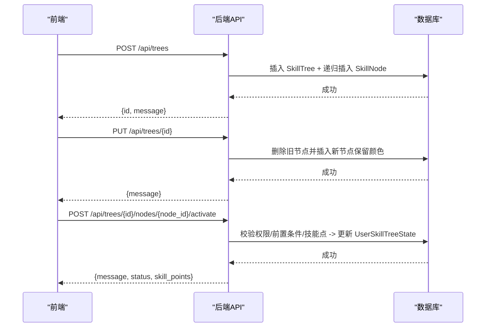
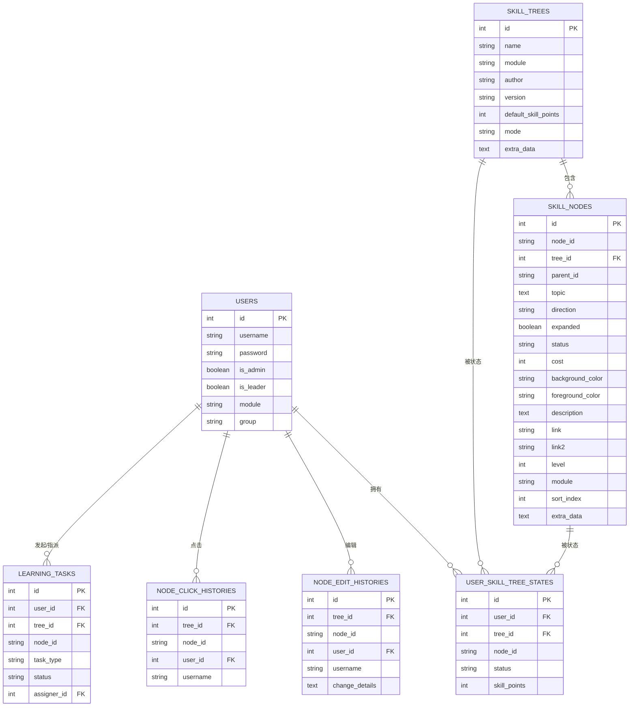
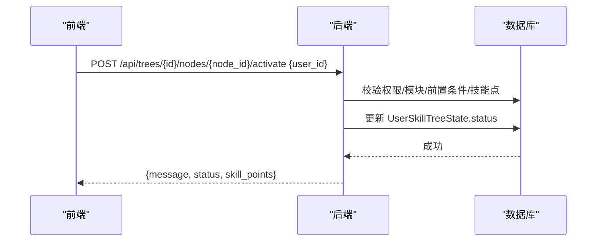
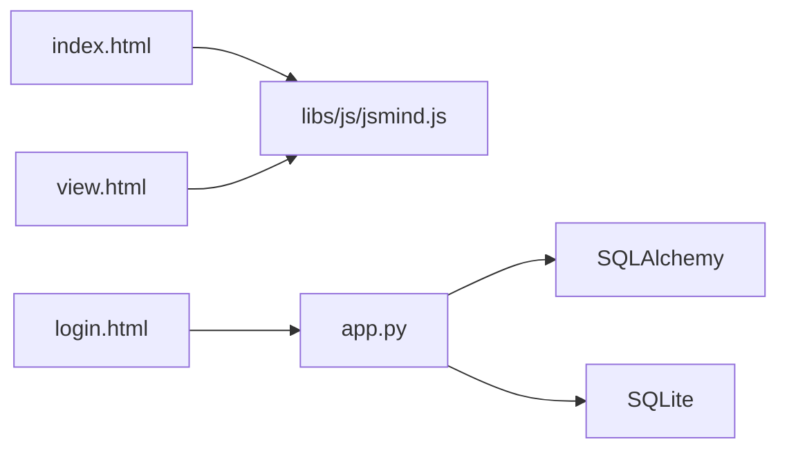

# 数据流设计

<cite>
**本文引用的文件**
- [app.py](file://app.py)
- [README.md](file://README.md)
- [index.html](file://index.html)
- [view.html](file://view.html)
- [login.html](file://login.html)
- [jsmind.js](file://libs/js/jsmind.js)
</cite>

## 目录
1. [简介](#简介)
2. [项目结构](#项目结构)
3. [核心组件](#核心组件)
4. [架构总览](#架构总览)
5. [详细组件分析](#详细组件分析)
6. [依赖分析](#依赖分析)
7. [性能考量](#性能考量)
8. [故障排查指南](#故障排查指南)
9. [结论](#结论)
10. [附录](#附录)

## 简介
本文件面向技能树管理系统，聚焦“数据流设计”，系统性梳理从用户操作到数据库存储的完整链路，涵盖以下方面：
- 用户输入处理与前端数据结构（jsMind node_tree）到后端数据库模型的映射
- API 请求路由、业务逻辑处理、数据库操作与响应返回
- 状态管理机制（用户技能树状态持久化、节点激活状态同步、权限验证状态传递）
- 数据验证流程（输入参数、业务规则、数据完整性）
- 错误处理机制（异常捕获、错误信息传递、状态回滚）
- 数据安全考虑（敏感信息保护、访问控制、数据加密建议）
- 架构师视角的性能优化与调优建议

## 项目结构
系统由前后端组成：
- 前端：HTML + JS（jsMind 图形引擎 + 自定义交互逻辑）
- 后端：Flask + SQLAlchemy（SQLite）

图表来源
- [app.py](file://app.py)
- [index.html](file://index.html)
- [view.html](file://view.html)
- [login.html](file://login.html)
- [jsmind.js](file://libs/js/jsmind.js)

章节来源
- [README.md](file://README.md)
- [app.py](file://app.py)

## 核心组件
- 数据模型层（SQLAlchemy）
  - 用户表：用户基本信息与权限范围
  - 技能树表：树元数据、默认技能点、激活模式、扩展数据
  - 技能节点表：节点树结构、状态、样式、等级、模块、排序索引
  - 用户技能树状态表：用户在特定树上的节点状态与可用技能点
  - 节点编辑历史表、节点点击历史表、学习任务表：审计与流程跟踪
- API 层（Flask）
  - 技能树 CRUD、节点增删改、激活/取消激活、重置、登录、模块聚合等
- 前端层（HTML/JS）
  - 管理页：编辑、保存、导入、颜色主题
  - 展示页：只读展示、激活节点、重置、技能点显示
  - 登录页：认证与状态持久化

章节来源
- [app.py](file://app.py)

## 架构总览
系统采用“前后端分离”的轻量架构：前端通过 fetch 发起 HTTP 请求，后端以 RESTful API 提供数据与业务能力，数据在后端以 SQLAlchemy ORM 映射到 SQLite。

图表来源
- [app.py](file://app.py)
- [index.html](file://index.html)
- [view.html](file://view.html)
- [login.html](file://login.html)

## 详细组件分析

### 1) 用户输入处理与前端数据结构
- 前端使用 jsMind 图形引擎，支持多种数据格式（node_tree、node_array、freemind、text）。管理页与展示页均通过 jsMind API 获取/设置数据。
- 管理页在保存时，会从 jsMind 获取 node_tree 格式数据，并补充 description/link 等字段，再发送给后端。
- 展示页在加载时，向后端请求技能树数据，后端将数据库节点与用户状态合并，返回统一的 node_tree 结构，前端据此渲染。

图表来源
- [index.html](file://index.html)
- [jsmind.js](file://libs/js/jsmind.js)

章节来源
- [index.html](file://index.html)
- [jsmind.js](file://libs/js/jsmind.js)

### 2) API 请求路由与业务处理
- 技能树管理：创建、获取列表、获取单棵、更新、删除
- 节点管理：新增、批量导入、更新、激活/取消激活
- 用户与登录：创建用户、获取列表、登录
- 状态与重置：用户技能树状态初始化、重置、技能点更新
- 模块与历史：模块聚合、节点编辑历史查询

图表来源
- [app.py](file://app.py)

章节来源
- [app.py](file://app.py)

### 3) 数据模型与映射关系
- SkillTree → SkillNode：一对多（树包含节点）
- SkillNode → UserSkillTreeState：一对多（节点在不同用户下的状态）
- User → UserSkillTreeState：一对多（用户在不同树下的状态）
- SkillTree → UserSkillTreeState：一对多（树的用户状态）
- NodeEditHistory/NodeClickHistory/LearningTask：审计与流程辅助

图表来源
- [app.py](file://app.py)

章节来源
- [app.py](file://app.py)

### 4) 状态管理机制
- 用户技能树状态持久化
  - 初始化：首次访问某技能树时，为用户创建节点状态记录（根节点激活，其余锁定）
  - 更新：激活/取消激活节点时，更新 UserSkillTreeState.status 与技能点
- 节点激活状态同步
  - 树状模式（tree）：子节点全部激活后方可激活父节点
  - 进阶模式（path）：同一模块内前序等级全部完成后方可激活当前等级
- 权限验证状态传递
  - 登录成功后，前端将用户信息写入本地存储，后续请求携带 user_id 以进行权限与模块校验

图表来源
- [app.py](file://app.py)
- [view.html](file://view.html)

章节来源
- [app.py](file://app.py)
- [view.html](file://view.html)

### 5) 数据验证流程
- 输入参数验证
  - 必填字段校验（用户名、节点ID、技能树ID等）
  - 类型与范围校验（等级、成本、模块逗号分隔等）
- 业务规则检查
  - 激活前置条件（树状/进阶模式）
  - 技能点消耗与返还
  - 管理员/组长权限与模块交集校验
- 数据完整性保证
  - 唯一约束（用户-树-节点组合唯一）
  - 父子关系一致性（父节点存在性）
  - 批量导入的逐条校验与事务回滚

章节来源
- [app.py](file://app.py)

### 6) 错误处理机制
- 异常捕获与状态回滚
  - 批量导入/更新节点时，单条失败会触发回滚并返回错误明细
  - 节点激活/取消激活失败时，返回明确错误信息
- 错误信息传递
  - 统一以 JSON {error: "..."} 或 {message: "..."} 返回
- 状态回滚策略
  - 事务回滚（rollback）确保数据一致性

章节来源
- [app.py](file://app.py)

### 7) 数据安全考虑
- 敏感信息保护
  - 密码字段明文存储（当前实现），建议改为哈希存储与安全校验
- 访问控制
  - 非管理员仅能在自身模块内激活节点
  - 管理员可重置所有用户技能树
- 数据加密策略
  - 建议启用 HTTPS 传输
  - 对存储的敏感字段（如密码）进行加密
- 建议
  - 引入 JWT 或 Session 机制替代明文密码
  - 增加重放攻击防护与速率限制

章节来源
- [app.py](file://app.py)
- [login.html](file://login.html)

### 8) 数据格式转换与映射
- 前端 jsMind node_tree → 后端 SkillNode
  - 字段映射：id/topic/direction/expanded/status/cost/background_color/foreground_color/description/link/link2/level/module/sort_index/extra_data
  - 父子关系：parent_id 与 children 递归映射
- 后端 SkillNode → 前端 jsMind node_tree（含用户状态）
  - 用户状态注入：根据 UserSkillTreeState.status 计算显示状态
  - 颜色策略：锁定/激活状态对应不同显示色，同时保留原始颜色字段

章节来源
- [app.py](file://app.py)
- [index.html](file://index.html)
- [view.html](file://view.html)
- [jsmind.js](file://libs/js/jsmind.js)

## 依赖分析
- 前端依赖
  - jsMind：负责图形渲染与数据格式转换
  - PapaParse：CSV 导入解析（用于批量节点导入）
- 后端依赖
  - Flask：Web 框架
  - SQLAlchemy：ORM 与数据库抽象
  - Flask-CORS：跨域支持

图表来源
- [index.html](file://index.html)
- [view.html](file://view.html)
- [login.html](file://login.html)
- [app.py](file://app.py)

章节来源
- [app.py](file://app.py)

## 性能考量
- 数据库层面
  - 建立复合索引（idx_tree_node、idx_user_tree_node）以提升查询效率
  - 批量插入/更新时使用 flush/commit 合理拆分，避免长事务
- API 层面
  - 分页查询历史与统计（如节点编辑历史）
  - 对大技能树的渲染采用延迟加载与节流
- 前端层面
  - 颜色与样式的动态计算在渲染阶段进行，避免重复计算
  - 批量导入时逐条刷新（flush）减少单次提交压力

章节来源
- [app.py](file://app.py)

## 故障排查指南
- 常见问题
  - 跨域错误：确认 Flask-CORS 已启用
  - 节点激活失败：检查父节点状态、模块权限、技能点是否充足
  - 批量导入失败：核对 CSV 字段与必填项，查看错误明细
- 排查步骤
  - 检查后端日志输出（print）与异常堆栈
  - 使用浏览器开发者工具查看网络请求与响应
  - 核对数据库中 UserSkillTreeState 与 SkillNode 的状态一致性

章节来源
- [app.py](file://app.py)
- [README.md](file://README.md)

## 结论
本系统通过清晰的前后端职责划分与完善的业务规则，实现了从用户操作到数据库存储的闭环数据流。建议在后续迭代中重点加强安全（密码哈希、HTTPS、权限细化）与性能（索引优化、分页与缓存、批量处理优化），以支撑更大规模的使用场景。

## 附录
- API 接口清单与示例（来自 README）
  - 获取技能树列表、创建技能树、获取技能树、更新技能树、删除技能树
  - 更新节点、激活/取消激活节点、重置技能树、创建用户、获取用户列表、登录
  - 重置用户技能树（管理员）

章节来源
- [README.md](file://README.md)