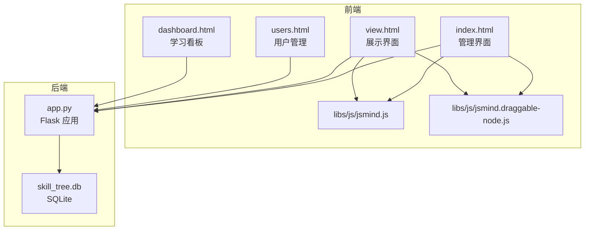
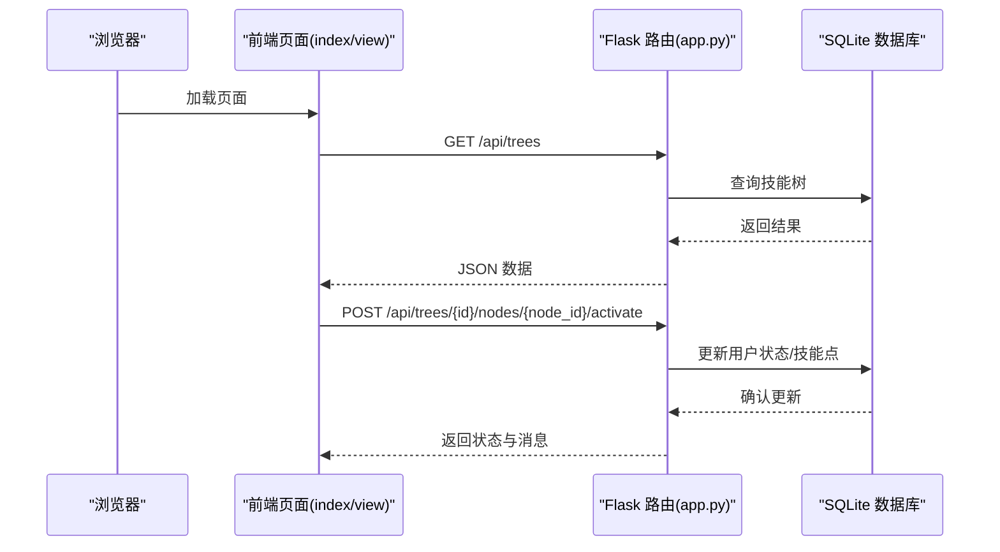
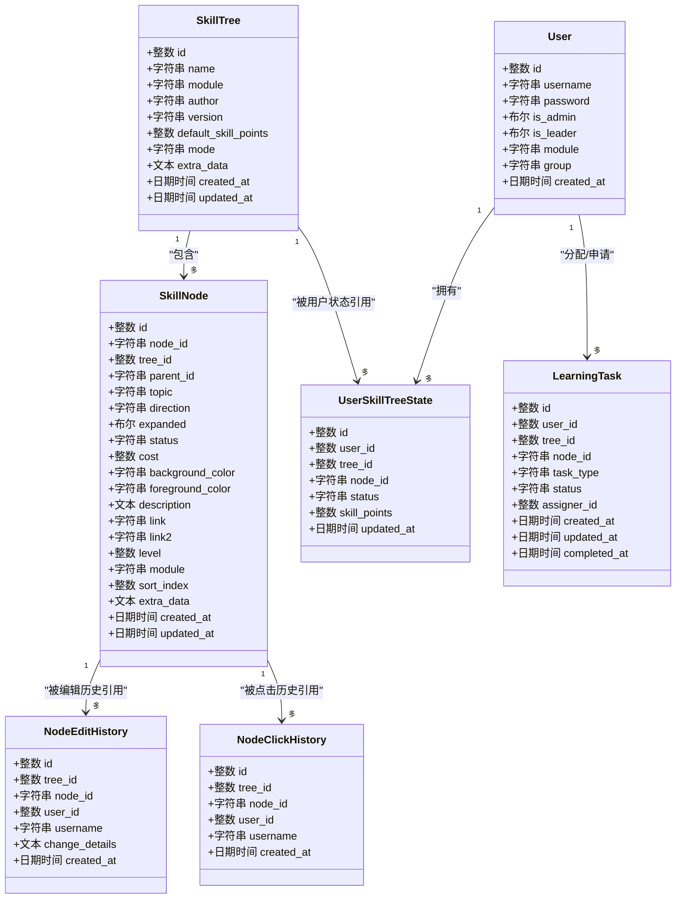
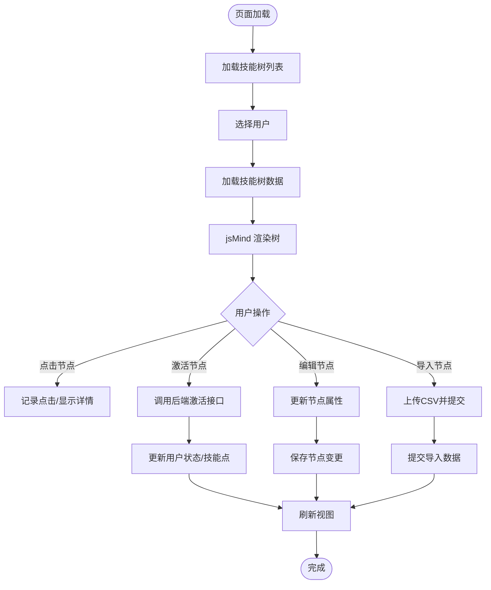
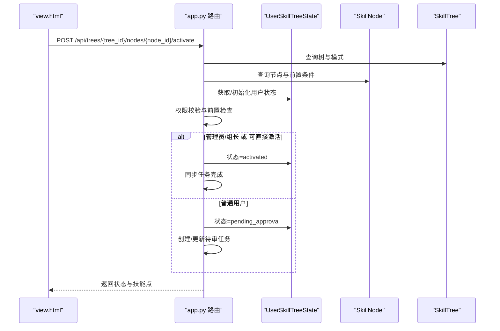
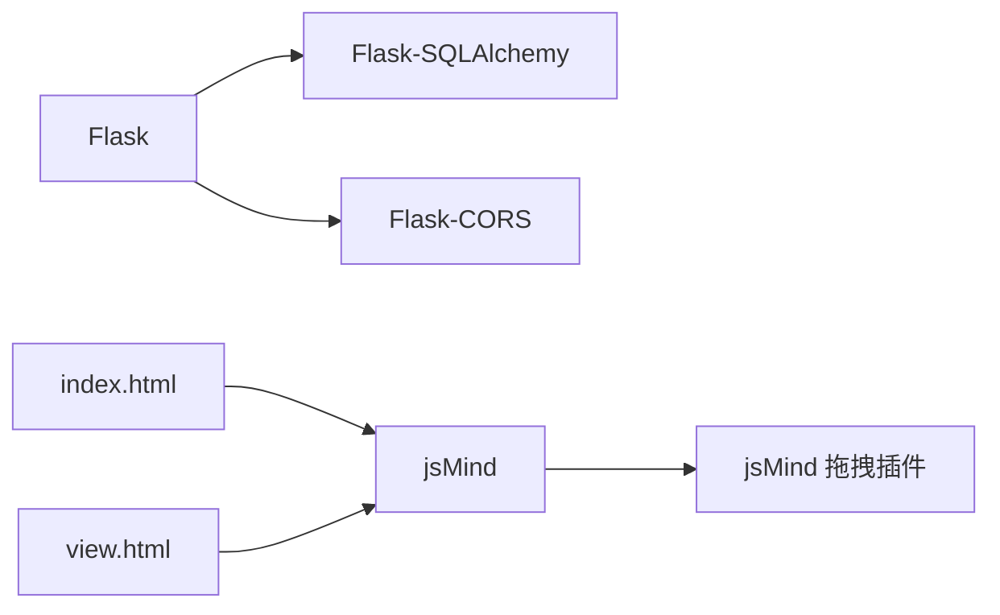

# 系统架构

<cite>
**本文引用的文件**
- [app.py](file://app.py)
- [README.md](file://README.md)
- [requirements.txt](file://requirements.txt)
- [index.html](file://index.html)
- [view.html](file://view.html)
- [users.html](file://users.html)
- [dashboard.html](file://dashboard.html)
- [jsmind.js](file://libs/js/jsmind.js)
- [jsmind.draggable-node.js](file://libs/js/jsmind.draggable-node.js)
- [create_admin.py](file://create_admin.py)
- [_patch_mode.py](file://_patch_mode.py)
</cite>

## 目录
1. [简介](#简介)
2. [项目结构](#项目结构)
3. [核心组件](#核心组件)
4. [架构总览](#架构总览)
5. [详细组件分析](#详细组件分析)
6. [依赖分析](#依赖分析)
7. [性能考量](#性能考量)
8. [故障排查指南](#故障排查指南)
9. [结论](#结论)
10. [附录](#附录)

## 简介
本系统是一个基于 Flask 的后端与基于 jsMind 的前端技能树管理系统，支持多用户、模块化权限、节点状态持久化、技能点系统与两种激活模式（树状/线性）。系统采用 MVC 架构：模型层负责数据持久化与业务规则，视图层提供管理与展示界面，控制器层通过 RESTful API 提供前后端交互。

## 项目结构
系统由后端 Flask 应用、SQLite 数据库、前端 HTML/CSS/JS 页面及第三方 jsMind 库组成。静态资源位于 libs 目录，页面入口包括管理页、展示页、用户管理页与仪表盘页。

**图表来源**
- [app.py](file://app.py)
- [index.html](file://index.html)
- [view.html](file://view.html)
- [users.html](file://users.html)
- [dashboard.html](file://dashboard.html)
- [jsmind.js](file://libs/js/jsmind.js)
- [jsmind.draggable-node.js](file://libs/js/jsmind.draggable-node.js)

**章节来源**
- [README.md](file://README.md)
- [requirements.txt](file://requirements.txt)

## 核心组件
- 后端 Flask 应用：提供 RESTful API、CORS 支持、数据库连接与业务逻辑。
- 数据模型：用户、技能树、技能节点、用户技能树状态、节点编辑/点击历史、学习任务等。
- 前端页面：管理页（编辑/导入/导出）、展示页（只读+激活）、用户管理页、学习看板。
- 可视化库：jsMind 负责思维导图渲染，拖拽插件提供节点拖拽能力。

**章节来源**
- [app.py](file://app.py)
- [index.html](file://index.html)
- [view.html](file://view.html)
- [users.html](file://users.html)
- [dashboard.html](file://dashboard.html)
- [jsmind.js](file://libs/js/jsmind.js)
- [jsmind.draggable-node.js](file://libs/js/jsmind.draggable-node.js)

## 架构总览
系统采用经典的 MVC 模式：
- 模型（Model）：SQLAlchemy ORM 定义的实体类与数据库表，承载业务数据与约束。
- 视图（View）：HTML 页面与 jsMind 渲染，负责用户交互与展示。
- 控制器（Controller）：Flask 路由函数，处理请求、调用模型、返回响应。

前后端通过 HTTP API 通信，CORS 配置允许跨域访问。数据流从浏览器发起请求，经 Flask 处理后访问 SQLite 数据库，再返回 JSON 结果给前端。

**图表来源**
- [app.py](file://app.py)
- [index.html](file://index.html)
- [view.html](file://view.html)

## 详细组件分析

### 后端 Flask 应用（MVC 控制器）
- 应用初始化：启用 CORS、配置 SQLite、创建 SQLAlchemy 实例。
- 用户与权限：用户表含模块/组别/管理员/组长字段，用于权限控制。
- 技能树与节点：树表含模式、默认技能点、扩展数据；节点表含层级、模块、颜色、描述、链接等。
- 用户技能树状态：记录每个用户在每棵树上的节点状态与可用技能点。
- API 路由：
  - 用户管理：创建、查询、更新用户。
  - 技能树管理：创建、查询、更新、删除、重置。
  - 节点管理：新增、批量导入、更新、激活/取消激活、点击记录与历史。
  - 进度与模块：全局进度统计、模块列表。
- 状态计算：根据树模式（树状/线性）计算节点解锁状态，结合用户模块权限与前置条件进行校验。
- 安全与权限：管理员可重置所有用户状态；普通用户激活需审核；非管理员仅能操作自身模块内的树。

**图表来源**
- [app.py](file://app.py)

**章节来源**
- [app.py](file://app.py)

### 前端页面与可视化（MVC 视图）
- 管理页（index.html）：提供技能树编辑、节点增删改、颜色主题、CSV 导入、历史查看等。
- 展示页（view.html）：用户选择后加载技能树，支持激活节点、查看进度、模块筛选。
- 用户管理页（users.html）：创建/编辑用户，分配模块与组别。
- 学习看板（dashboard.html）：全局进度、模块统计、排行榜、任务分配与审核。
- 可视化：jsMind 负责渲染树形结构，拖拽插件支持节点拖拽；页面通过 fetch 与后端 API 交互。

**图表来源**
- [index.html](file://index.html)
- [view.html](file://view.html)
- [jsmind.js](file://libs/js/jsmind.js)
- [jsmind.draggable-node.js](file://libs/js/jsmind.draggable-node.js)

**章节来源**
- [index.html](file://index.html)
- [view.html](file://view.html)
- [users.html](file://users.html)
- [dashboard.html](file://dashboard.html)
- [jsmind.js](file://libs/js/jsmind.js)
- [jsmind.draggable-node.js](file://libs/js/jsmind.draggable-node.js)

### API 工作流（激活节点）

**图表来源**
- [app.py](file://app.py)
- [view.html](file://view.html)

**章节来源**
- [app.py](file://app.py)
- [view.html](file://view.html)

## 依赖分析
- 后端依赖：Flask、Flask-SQLAlchemy、Flask-CORS。
- 前端依赖：jsMind 核心库与拖拽插件。
- 数据库：SQLite，自动创建 skill_tree.db。

**图表来源**
- [requirements.txt](file://requirements.txt)
- [index.html](file://index.html)
- [view.html](file://view.html)
- [jsmind.js](file://libs/js/jsmind.js)
- [jsmind.draggable-node.js](file://libs/js/jsmind.draggable-node.js)

**章节来源**
- [requirements.txt](file://requirements.txt)

## 性能考量
- 数据库：SQLite 适合中小规模数据与单机部署；建议在生产环境使用更高性能的数据库与连接池。
- 查询优化：为常用查询建立索引（如节点表的 tree_id+node_id 复合索引），减少重复查询。
- 前端渲染：大量节点时，合理分页或延迟加载；避免一次性渲染超大树。
- API 并发：限制并发请求，避免数据库写入竞争；必要时引入队列或事务隔离。
- 缓存策略：对只读数据（如技能树列表）可增加缓存层，降低数据库压力。

## 故障排查指南
- 跨域问题：确认已启用 CORS，若仍失败检查浏览器网络面板与后端日志。
- 登录失败：检查用户名/密码是否正确，确认用户是否存在且未被锁定。
- 激活失败：检查前置节点是否已激活、技能点是否充足、用户模块权限是否匹配。
- 导入异常：检查 CSV 格式与必填字段，查看后端返回的错误信息。
- 数据库异常：删除 skill_tree.db 后重启服务以重建数据库。

**章节来源**
- [README.md](file://README.md)
- [app.py](file://app.py)

## 结论
本系统以 Flask + SQLite + jsMind 构建，满足多用户、模块化权限与技能点体系的需求。通过清晰的 MVC 分层与 RESTful API，实现了前后端解耦与良好的可维护性。建议在生产环境中增强安全（认证/授权/加密）、引入更健壮的数据库与缓存策略，并完善测试与监控体系。

## 附录
- 管理员创建脚本：create_admin.py 可一键创建默认管理员账户。
- 模式切换：通过前端按钮切换树状/线性模式，并同步到后端持久化。

**章节来源**
- [create_admin.py](file://create_admin.py)
- [_patch_mode.py](file://_patch_mode.py)